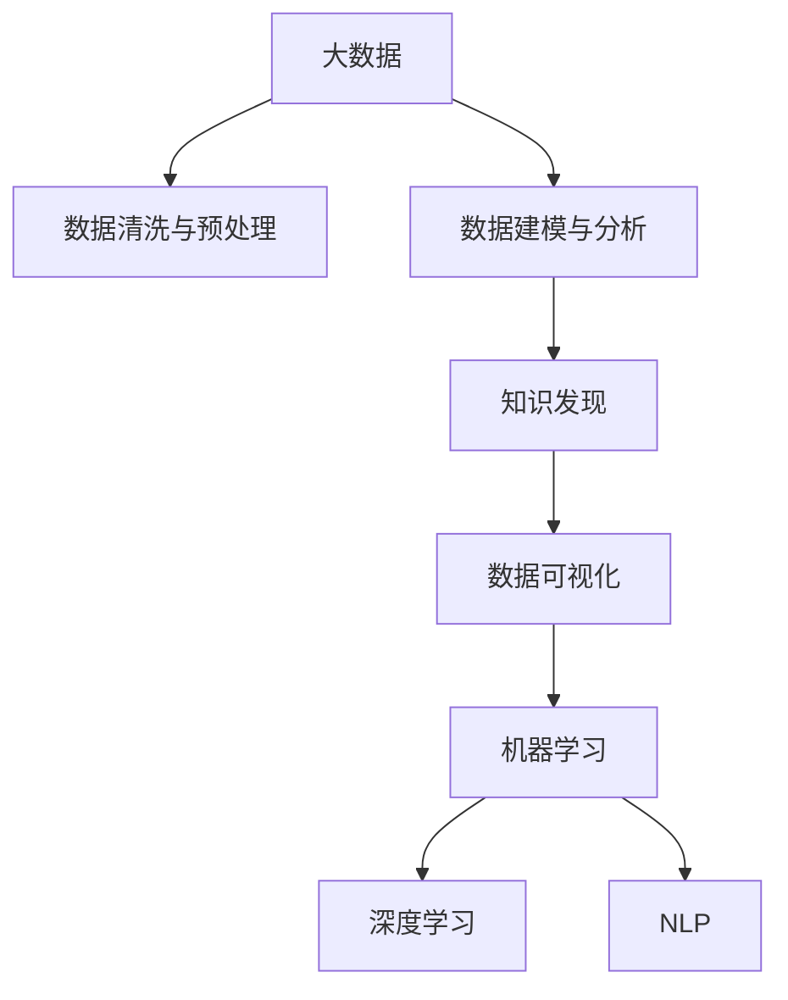

                 

# 大数据分析在知识发现中的应用

> 关键词：大数据, 知识发现, 数据分析, 机器学习, 数据挖掘, 数据可视化

## 1. 背景介绍

### 1.1 问题由来
在信息化飞速发展的今天，数据已经成为了企业决策的重要支撑。然而，面对海量、复杂的数据，如何从中提取出有价值的信息，成为了企业普遍面临的难题。传统的统计分析方法往往需要消耗大量时间和资源，且结果准确度不高。大数据分析技术的出现，为解决这一问题提供了新的思路。

大数据分析是指利用先进的技术手段，对大规模数据集进行深度挖掘，揭示出其中的潜在的规律和知识。与传统的数据分析方法相比，大数据分析可以处理的数据量更大、速度更快、结果更精确，能够为企业提供更为准确的数据驱动决策支持。

### 1.2 问题核心关键点
大数据分析的核心在于如何高效地对大规模数据进行处理和分析，以发现其中的知识。其关键点包括：
- 数据采集与整合：收集来自不同渠道的海量数据，并进行整合处理，确保数据的质量和一致性。
- 数据清洗与预处理：处理数据中的噪音和异常值，进行缺失值填补、归一化等预处理操作。
- 数据建模与分析：选择合适的模型和算法，对数据进行建模和分析，提取关键特征和模式。
- 知识发现与可视化：通过数据挖掘和机器学习等技术，从数据中提取知识，并以图形化的方式展示出来，帮助决策者理解分析结果。

这些关键点共同构成了大数据分析的基础框架，其核心在于利用先进的技术手段，从海量数据中提取有价值的信息，为企业提供科学决策的依据。

## 2. 核心概念与联系

### 2.1 核心概念概述

为了更好地理解大数据分析在知识发现中的应用，本节将介绍几个密切相关的核心概念：

- 大数据（Big Data）：指规模巨大、种类繁多、结构复杂、实时性强的数据集，通常涉及多源异构数据类型。
- 知识发现（Knowledge Discovery, KD）：从数据中自动发现隐含在其中的有价值知识、规律和模式的过程。
- 数据挖掘（Data Mining）：从大量数据中提取有用信息和知识的过程，是知识发现的重要手段。
- 数据可视化（Data Visualization）：将数据通过图表、图形等方式进行展示，帮助人们直观地理解数据和发现规律。
- 机器学习（Machine Learning, ML）：利用算法和模型对数据进行学习，自动提升分析准确度和效率的技术。
- 深度学习（Deep Learning, DL）：一种基于人工神经网络的机器学习方法，能够处理更加复杂和抽象的数据模式。
- 自然语言处理（Natural Language Processing, NLP）：研究如何让计算机理解和处理自然语言的技术。

这些核心概念之间的逻辑关系可以通过以下Mermaid流程图来展示：



这个流程图展示了大数据分析的核心概念及其之间的关系：

1. 大数据通过数据清洗与预处理得到高质量的数据。
2. 高质量的数据经过建模与分析，发现其中的知识。
3. 知识通过数据可视化呈现出来，帮助决策者理解分析结果。
4. 机器学习和深度学习是数据建模与分析的重要手段，而NLP技术则用于处理自然语言数据。

这些概念共同构成了大数据分析的知识体系，帮助企业从海量数据中提取有价值的信息，支持科学决策。

## 3. 核心算法原理 & 具体操作步骤
### 3.1 算法原理概述

大数据分析的核心算法原理主要基于数据挖掘和机器学习。其核心思想是通过对大规模数据集进行深度挖掘和分析，从中提取有用信息和知识。具体而言，大数据分析包括数据采集、清洗与预处理、数据建模与分析、知识发现与可视化等步骤。

### 3.2 算法步骤详解

#### 3.2.1 数据采集与整合
大数据分析的第一步是数据采集与整合。数据来源广泛，包括社交网络、传感器、企业数据库、公共数据集等。数据采集工具包括Flume、Apache Kafka、Hadoop等，用于收集来自不同渠道的数据。数据整合工具如ETL工具，用于将异构数据格式转换为统一格式，确保数据的一致性和完整性。

#### 3.2.2 数据清洗与预处理
数据清洗与预处理是数据质量控制的关键步骤。数据清洗包括处理缺失值、去重、异常值检测等。预处理包括数据归一化、特征工程等，确保数据适合建模与分析。

#### 3.2.3 数据建模与分析
数据建模与分析是大数据分析的核心。常用的建模方法包括回归分析、决策树、随机森林、聚类分析、时间序列分析等。这些方法可以帮助从数据中提取有用的信息和知识。

#### 3.2.4 知识发现与可视化
知识发现是将数据建模与分析的结果进行可视化，呈现给决策者的重要步骤。常用的可视化工具包括Tableau、Power BI、Grafana等，通过图表、图形等方式展示分析结果。

### 3.3 算法优缺点

大数据分析具有以下优点：
1. 处理海量数据：大数据分析可以处理大规模数据集，为决策者提供全面的数据支撑。
2. 提高分析效率：大数据分析利用先进的算法和工具，能够快速地从数据中提取有用信息。
3. 提升决策准确性：通过深入的数据分析和建模，大数据分析能够发现数据中的规律和模式，提高决策准确性。

然而，大数据分析也存在以下缺点：
1. 技术门槛高：大数据分析需要具备先进的技术和工具，对技术要求较高。
2. 数据隐私和安全问题：大数据分析需要收集大量个人和企业的敏感数据，可能存在隐私泄露和安全风险。
3. 数据处理复杂：大数据分析需要处理多源异构数据，数据预处理和模型选择等操作复杂。
4. 成本高：大数据分析需要大量的计算资源和存储资源，成本较高。

尽管存在这些缺点，但大数据分析在数据驱动决策中的重要性不言而喻。未来的发展方向在于降低技术门槛，提高数据隐私保护，优化数据处理流程，降低成本。

### 3.4 算法应用领域

大数据分析的应用领域非常广泛，涵盖了多个行业和领域。以下列举几个典型的应用场景：

1. 金融行业：大数据分析可以帮助银行进行信用评估、风险控制、客户行为分析等，提高金融产品的市场竞争力。
2. 零售行业：大数据分析可以帮助零售企业进行客户细分、库存管理、销售预测等，优化供应链管理和营销策略。
3. 医疗行业：大数据分析可以用于疾病预测、医疗影像分析、患者行为分析等，提升医疗服务的质量和效率。
4. 交通行业：大数据分析可以帮助交通管理部门进行交通流量预测、道路拥堵分析、交通事故预警等，优化交通管理。
5. 电商行业：大数据分析可以帮助电商平台进行用户行为分析、个性化推荐、商品销售预测等，提升用户体验和销售额。

## 4. 数学模型和公式 & 详细讲解 & 举例说明

### 4.1 数学模型构建

大数据分析的数学模型通常包括以下几个部分：

- 数据描述：描述数据的特征、分布、关系等，常用的方法包括描述性统计分析。
- 数据建模：建立数学模型，用于描述数据中的规律和模式，常用的方法包括回归模型、决策树模型、聚类模型等。
- 假设检验：通过建立假设，检验数据中的规律和模式是否具有统计显著性，常用的方法包括t检验、卡方检验等。
- 机器学习模型：利用机器学习算法对数据进行建模，常用的算法包括随机森林、神经网络等。
- 深度学习模型：利用深度学习算法对数据进行建模，常用的算法包括卷积神经网络（CNN）、循环神经网络（RNN）、生成对抗网络（GAN）等。

### 4.2 公式推导过程

以下以线性回归模型为例，推导其在数据分析中的应用。

线性回归模型的一般形式为：

$$
y = \beta_0 + \beta_1 x_1 + \beta_2 x_2 + \cdots + \beta_n x_n + \epsilon
$$

其中，$y$ 为因变量，$x_1, x_2, \cdots, x_n$ 为自变量，$\beta_0, \beta_1, \cdots, \beta_n$ 为回归系数，$\epsilon$ 为误差项。

通过最小二乘法（OLS）可以估计回归系数 $\beta_0, \beta_1, \cdots, \beta_n$。最小二乘法的目标是使预测值与真实值之间的平方误差最小，即：

$$
\sum_{i=1}^n (y_i - \hat{y}_i)^2
$$

其中，$\hat{y}_i$ 为第 $i$ 个样本的预测值。

根据最小二乘法的目标，可以写出回归系数的求解公式：

$$
\beta_j = \frac{\sum_{i=1}^n x_{ij}(y_i - \bar{y})}{\sum_{i=1}^n x_{ij}^2 - \frac{\left(\sum_{i=1}^n x_{ij}\right)^2}{N}} \quad (j = 1, 2, \cdots, n)
$$

其中，$\bar{y}$ 为因变量的均值，$N$ 为样本数。

### 4.3 案例分析与讲解

以下以股票价格预测为例，分析如何使用大数据分析技术进行知识发现。

假设要预测某只股票的价格走势。可以收集过去一段时间的股票价格数据，将其作为因变量。同时收集一些相关因素，如公司财报、市场指数、行业新闻等，作为自变量。利用线性回归模型建立预测模型，可以对未来的股票价格进行预测。

具体步骤如下：

1. 数据采集与整合：收集过去一段时间的股票价格数据以及相关因素数据。
2. 数据清洗与预处理：处理缺失值、去重、异常值检测等，对数据进行归一化处理。
3. 数据建模与分析：建立线性回归模型，选择自变量 $x_1, x_2, \cdots, x_n$ 进行建模。
4. 知识发现与可视化：利用图表、图形等方式展示预测结果，帮助决策者理解分析结果。

通过上述步骤，可以利用大数据分析技术，从历史数据中提取有用信息，预测未来的股票价格走势，帮助决策者做出更科学的投资决策。

## 5. 项目实践：代码实例和详细解释说明

### 5.1 开发环境搭建

在进行大数据分析实践前，我们需要准备好开发环境。以下是使用Python进行Pandas、Scikit-learn、TensorFlow等库的开发环境配置流程：

1. 安装Anaconda：从官网下载并安装Anaconda，用于创建独立的Python环境。

2. 创建并激活虚拟环境：
```bash
conda create -n bigdata-env python=3.8 
conda activate bigdata-env
```

3. 安装Pandas、Scikit-learn、TensorFlow：
```bash
conda install pandas scikit-learn tensorflow -c conda-forge
```

4. 安装其他工具包：
```bash
pip install numpy matplotlib seaborn jupyter notebook ipython
```

完成上述步骤后，即可在`bigdata-env`环境中开始数据分析实践。

### 5.2 源代码详细实现

下面我们以股票价格预测为例，给出使用Pandas、Scikit-learn等库进行大数据分析的Python代码实现。

首先，定义数据处理函数：

```python
import pandas as pd
import numpy as np

def load_data(file_path):
    data = pd.read_csv(file_path)
    return data

def preprocess_data(data):
    # 数据清洗
    data = data.dropna()
    # 数据归一化
    data['price'] = (data['price'] - data['price'].mean()) / data['price'].std()
    return data

def split_data(data, test_size=0.2):
    train_size = int(len(data) * (1 - test_size))
    train_data, test_data = data.iloc[:train_size], data.iloc[train_size:]
    return train_data, test_data
```

然后，定义模型训练函数：

```python
from sklearn.linear_model import LinearRegression

def train_model(train_data, test_data):
    X_train, y_train = train_data.drop(['price'], axis=1), train_data['price']
    X_test, y_test = test_data.drop(['price'], axis=1), test_data['price']
    
    model = LinearRegression()
    model.fit(X_train, y_train)
    
    train_score = model.score(X_train, y_train)
    test_score = model.score(X_test, y_test)
    
    return model, train_score, test_score
```

最后，启动数据分析流程并在测试集上评估：

```python
# 加载数据
data = load_data('stock_prices.csv')
# 数据预处理
data = preprocess_data(data)
# 划分训练集和测试集
train_data, test_data = split_data(data, test_size=0.2)

# 训练模型
model, train_score, test_score = train_model(train_data, test_data)

# 输出模型评估结果
print(f'训练集得分: {train_score:.3f}')
print(f'测试集得分: {test_score:.3f}')
```

以上就是使用Pandas、Scikit-learn进行股票价格预测的大数据分析代码实现。可以看到，利用Python的科学计算库，可以很方便地进行数据处理、模型训练和评估。

### 5.3 代码解读与分析

让我们再详细解读一下关键代码的实现细节：

**load_data函数**：
- 使用Pandas库读取CSV文件，返回一个DataFrame对象。

**preprocess_data函数**：
- 数据清洗：使用dropna()方法去除缺失值。
- 数据归一化：使用标准化方法将数据归一化到0和1之间。

**split_data函数**：
- 使用Pandas的iloc切片操作，将数据集分为训练集和测试集，默认测试集占总数据的20%。

**train_model函数**：
- 从训练集中分离出自变量和因变量，并使用LinearRegression模型进行训练。
- 在训练集和测试集上分别计算模型得分。

**启动数据分析流程**：
- 加载数据，并进行预处理和数据划分。
- 调用train_model函数训练模型，并输出模型在训练集和测试集上的得分。

可以看出，使用Pandas、Scikit-learn等Python科学计算库，可以高效地完成大数据分析任务，快速地实现数据处理、模型训练和评估。

## 6. 实际应用场景

### 6.1 金融行业

大数据分析在金融行业有着广泛的应用。以下是几个典型的应用场景：

1. 信用评估：利用大数据分析，通过客户的历史交易数据、社交媒体数据等，评估客户的信用风险，提高贷款审批效率。
2. 风险控制：通过对历史交易数据的分析，预测未来的交易风险，及时采取风险控制措施。
3. 客户行为分析：通过分析客户的消费行为、投资行为等，了解客户的偏好和需求，制定更加精准的营销策略。

### 6.2 零售行业

大数据分析在零售行业也有着重要的应用。以下是几个典型的应用场景：

1. 客户细分：通过对客户的历史购买行为、社交媒体数据等进行分析，将客户分为不同的细分群体，制定有针对性的营销策略。
2. 库存管理：通过对销售数据、供应链数据等进行分析，优化库存管理，减少库存积压和缺货情况。
3. 销售预测：通过对历史销售数据、市场数据等进行分析，预测未来的销售趋势，优化商品采购和促销策略。

### 6.3 医疗行业

大数据分析在医疗行业也有着重要的应用。以下是几个典型的应用场景：

1. 疾病预测：通过对患者的历史病历、基因数据等进行分析，预测患者的疾病风险，提前进行预防和治疗。
2. 医疗影像分析：利用大数据分析技术，对医疗影像数据进行自动分析和诊断，提高诊断效率和准确性。
3. 患者行为分析：通过对患者的医疗行为数据进行分析，了解患者的健康状况和需求，制定更加精准的医疗方案。

### 6.4 交通行业

大数据分析在交通行业也有着重要的应用。以下是几个典型的应用场景：

1. 交通流量预测：通过对历史交通流量数据、气象数据等进行分析，预测未来的交通流量，优化交通管理。
2. 道路拥堵分析：通过对历史交通数据进行分析，识别出交通拥堵的瓶颈区域和时段，优化交通流向和道路设计。
3. 交通事故预警：通过对历史交通事故数据进行分析，预测未来的交通事故风险，及时采取预警措施。

### 6.5 电商行业

大数据分析在电商行业也有着重要的应用。以下是几个典型的应用场景：

1. 用户行为分析：通过对用户的浏览、购买、评价等数据进行分析，了解用户的偏好和需求，制定更加精准的营销策略。
2. 商品销售预测：通过对历史销售数据、市场数据等进行分析，预测未来的销售趋势，优化商品采购和促销策略。
3. 个性化推荐：通过对用户的购买历史、浏览行为等进行分析，进行个性化推荐，提升用户体验和销售额。

## 7. 工具和资源推荐

### 7.1 学习资源推荐

为了帮助开发者系统掌握大数据分析的理论基础和实践技巧，这里推荐一些优质的学习资源：

1. 《Python数据分析实战》系列博文：由Python数据分析专家撰写，深入浅出地介绍了数据分析的基本方法和实用技巧。
2. 《数据科学导论》课程：由斯坦福大学开设的入门级数据科学课程，系统介绍了数据科学的基本概念和常用工具。
3. 《Hands-On Data Science with Python》书籍：数据科学领域的经典入门书籍，介绍了Python在数据科学中的实际应用。
4. Kaggle平台：提供丰富的数据集和挑战任务，帮助开发者提升数据处理和分析能力。
5. Coursera平台：提供大量数据科学和机器学习相关的课程，适合不同层次的学习者。

通过对这些资源的学习实践，相信你一定能够快速掌握大数据分析的精髓，并用于解决实际的业务问题。

### 7.2 开发工具推荐

高效的开发离不开优秀的工具支持。以下是几款用于大数据分析开发的常用工具：

1. Jupyter Notebook：Python交互式开发工具，支持代码运行、可视化展示和实时编辑。
2. PySpark：基于Python的分布式计算框架，适合处理大规模数据集。
3. Apache Hadoop：开源分布式计算平台，支持大规模数据存储和计算。
4. Apache Kafka：分布式消息队列，用于数据流处理和传输。
5. Apache Flink：分布式流处理框架，支持实时数据处理和分析。

合理利用这些工具，可以显著提升大数据分析的开发效率，加快创新迭代的步伐。

### 7.3 相关论文推荐

大数据分析的研究已经积累了大量的研究成果，以下是几篇奠基性的相关论文，推荐阅读：

1. 《Big Data: Principles and Best Practices of Scalable Real-Time Data Systems》：亚马逊的谢尔曼·克雷恩（Sherman Kraine）和大卫·贝尔（David Bale）所著，介绍了大数据系统的原理和设计。
2. 《Big Data: The Hadoop Data Science Framework》：大数据领域的先驱者杰弗里·帕格（Geoffrey Parag）和约瑟夫·米勒（Joseph Miller）所著，介绍了大数据科学的基本框架和方法。
3. 《Hadoop: The Definitive Guide》：Hadoop技术的经典教程，由Hadoop社区的知名专家撰写。
4. 《Deep Learning》：深度学习领域的经典著作，由深度学习领域的权威专家伊恩·古德费洛（Ian Goodfellow）、约书亚·本吉奥（Yoshua Bengio）和亚伦·库辛伯格（Aaron Courville）共同撰写。

这些论文代表了大数据分析技术的最新研究成果，通过学习这些前沿成果，可以帮助研究者把握学科前进方向，激发更多的创新灵感。

## 8. 总结：未来发展趋势与挑战

### 8.1 总结

本文对大数据分析在知识发现中的应用进行了全面系统的介绍。首先阐述了大数据分析的背景和核心关键点，明确了其在企业决策支持中的重要性。其次，从原理到实践，详细讲解了大数据分析的数学模型和具体操作步骤，给出了大数据分析任务开发的完整代码实例。同时，本文还广泛探讨了大数据分析在金融、零售、医疗、交通、电商等多个行业领域的应用前景，展示了大数据分析技术的广阔前景。

通过本文的系统梳理，可以看到，大数据分析技术正在成为企业决策支持的重要手段，极大地拓展了数据处理和分析的能力，为各行各业提供了科学决策的依据。未来，伴随数据量、数据种类和数据处理能力的持续提升，大数据分析必将在更多领域得到应用，为经济社会发展带来新的动力。

### 8.2 未来发展趋势

展望未来，大数据分析技术将呈现以下几个发展趋势：

1. 数据量持续增大：随着物联网、5G等技术的普及，数据的规模将持续增大，大数据分析技术将迎来更多应用场景。
2. 数据种类更加丰富：未来数据的种类将更加多样化，包含图像、视频、语音等多模态数据，大数据分析技术需要进一步扩展。
3. 计算能力提升：随着云计算、分布式计算等技术的发展，大数据分析的计算能力将大幅提升，能够处理更大规模的数据。
4. 人工智能与大数据结合：大数据分析将与人工智能技术进行更深层次的融合，利用机器学习和深度学习技术，提升数据挖掘和分析的准确性。
5. 数据隐私和安全保障：大数据分析需要考虑数据隐私和安全问题，建立完善的数据保护机制，保障数据安全。
6. 可视化技术升级：大数据分析将与可视化技术进行更深层次的融合，通过更加生动、直观的方式展示分析结果，帮助决策者理解数据。

以上趋势凸显了大数据分析技术的广阔前景。这些方向的探索发展，必将进一步提升数据分析的准确性和效率，为各行各业提供更加科学、智能的决策支持。

### 8.3 面临的挑战

尽管大数据分析技术已经取得了显著的进展，但在迈向更加智能化、普适化应用的过程中，它仍面临着诸多挑战：

1. 数据质量和完整性：大数据分析依赖于高质量的数据，如何确保数据的完整性和准确性，是技术应用的前提。
2. 数据处理复杂性：大数据分析需要处理多源异构数据，数据预处理和模型选择等操作复杂。
3. 技术门槛高：大数据分析需要具备先进的技术和工具，对技术要求较高。
4. 数据隐私和安全问题：大数据分析需要收集大量个人和企业的敏感数据，可能存在隐私泄露和安全风险。
5. 计算资源需求大：大数据分析需要大量的计算资源和存储资源，成本较高。
6. 结果可解释性不足：大数据分析的结果往往是黑箱模型，难以解释其内部工作机制和决策逻辑。

这些挑战需要研究者从数据、技术、伦理等多方面进行深入探索，才能使大数据分析技术更加成熟和普及。

### 8.4 研究展望

面对大数据分析面临的种种挑战，未来的研究需要在以下几个方面寻求新的突破：

1. 数据质量提升：通过数据清洗、数据标注等手段，提升数据的质量和完整性，确保数据可靠。
2. 数据处理自动化：开发更加智能的数据预处理工具，自动化处理多源异构数据，降低数据处理复杂性。
3. 技术普及化：降低大数据分析的技术门槛，推广使用简单、易用的分析工具和平台，普及大数据分析技术。
4. 数据隐私保护：开发数据加密、匿名化等技术，保护数据隐私和安全。
5. 结果可解释性：引入可解释性技术，如特征重要性分析、模型可视化等，提高数据分析结果的可解释性。
6. 知识共享和协作：通过建立数据共享平台和社区，促进数据共享和知识协作，加速大数据分析技术的普及和发展。

这些研究方向的探索，必将引领大数据分析技术迈向更高的台阶，为各行各业提供更加科学、智能的决策支持。面向未来，大数据分析技术还需要与其他人工智能技术进行更深入的融合，如知识表示、因果推理、强化学习等，多路径协同发力，共同推动自然语言理解和智能交互系统的进步。只有勇于创新、敢于突破，才能不断拓展数据分析的边界，让智能技术更好地造福人类社会。

## 9. 附录：常见问题与解答

**Q1：大数据分析是否适用于所有数据类型？**

A: 大数据分析适用于结构化和半结构化数据，但对于非结构化数据（如图像、视频等），需要借助机器学习和深度学习等技术进行分析和挖掘。

**Q2：大数据分析与传统数据分析有何区别？**

A: 大数据分析的主要区别在于数据量和数据处理能力。传统数据分析处理的是相对小规模的数据集，而大数据分析处理的是海量、复杂的数据集，需要更加强大的计算资源和处理能力。

**Q3：大数据分析的计算资源需求大吗？**

A: 大数据分析需要大量的计算资源和存储资源，尤其是在数据量较大、数据种类较多时。合理利用云计算、分布式计算等技术，可以有效地降低计算资源的成本。

**Q4：大数据分析的实时性如何？**

A: 大数据分析一般具有较高的实时性，可以通过流处理、实时计算等技术实现。但也存在一定的延迟，需要根据具体场景和需求进行调整。

**Q5：大数据分析的结果可信度如何？**

A: 大数据分析的结果可靠性较高，但也需要关注数据质量和分析方法的准确性。数据清洗、特征工程等预处理操作是保证结果可信度的关键。

通过以上系统介绍和深入探讨，相信你对大数据分析在知识发现中的应用有了更全面的理解。大数据分析技术作为数据驱动决策的重要手段，必将为各行各业带来更多的机遇和挑战，值得深入研究和持续探索。

---

作者：禅与计算机程序设计艺术 / Zen and the Art of Computer Programming

