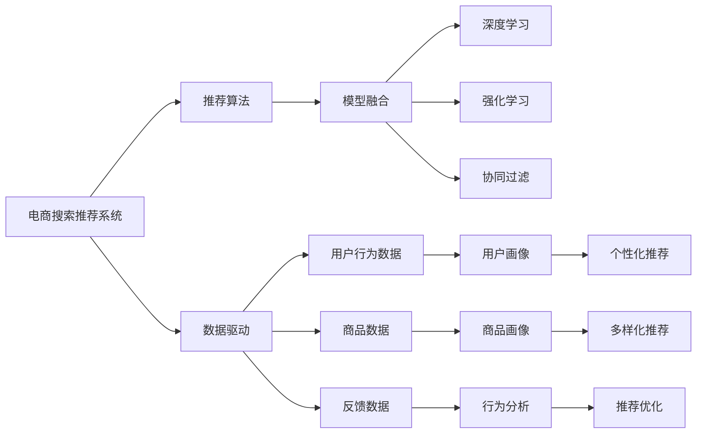

                 

# 大数据驱动的电商搜索推荐：AI 模型融合技术在电商领域的应用与优化

## 1. 背景介绍

### 1.1 问题由来
在数字化时代，电子商务作为人们消费的重要方式，日益成为各大企业抢夺的市场焦点。为了提高用户购物体验，电商企业不断寻求通过大数据技术优化商品搜索推荐系统，提升转化率和用户满意度。传统的推荐算法如协同过滤、基于内容的推荐等，已经难以适应电商复杂多变、个性化需求强烈的环境，而人工智能驱动的推荐算法正在成为电商领域的新趋势。

### 1.2 问题核心关键点
1. **电商搜索推荐系统的需求与挑战**：电商平台需要快速响应用户搜索行为，提供个性化、精准的商品推荐，同时应对海量数据、实时性要求高等挑战。
2. **AI驱动推荐算法的应用**：如何通过数据挖掘、机器学习等AI技术，构建高效、准确的搜索推荐系统，以提升电商平台的运营效率和用户体验。
3. **模型融合技术的优势**：通过集成多种AI模型，综合利用不同模型的优势，提升推荐系统的效果和泛化能力。

### 1.3 问题研究意义
构建高效、精准的电商搜索推荐系统，不仅可以提升电商平台的运营效率和用户满意度，还能显著增加用户留存率和购买率，降低企业运营成本。因此，研究如何通过AI模型融合技术，优化电商搜索推荐系统，具有重要的理论和实践意义。

## 2. 核心概念与联系

### 2.1 核心概念概述

为更好地理解AI模型融合技术在电商领域的应用，本节将介绍几个关键概念：

- **电商搜索推荐系统(E-commerce Search and Recommendation System)**：电商平台上的一种重要应用，通过分析用户历史行为和搜索行为，预测用户可能感兴趣的商品，从而提供个性化的推荐服务。
- **推荐算法(Recommendation Algorithm)**：利用用户数据和商品数据，通过算法计算出用户可能感兴趣的商品推荐。
- **模型融合(Modle Fusion)**：将多个不同的推荐模型结合，综合各模型的优势，提升推荐的精度和覆盖率。
- **深度学习(Deep Learning)**：通过神经网络等深度学习模型，构建复杂的推荐系统，提高推荐的准确性和个性化程度。
- **强化学习(Reinforcement Learning)**：通过学习用户的点击行为，动态调整推荐策略，优化用户体验。
- **协同过滤(Collaborative Filtering)**：基于用户之间的相似性，推荐其他用户喜欢的商品，常用于处理隐式反馈数据。

这些概念之间通过数据驱动、模型训练、反馈迭代等环节紧密联系，共同构成了电商搜索推荐系统的核心技术框架。

### 2.2 核心概念原理和架构的 Mermaid 流程图



这个流程图展示了电商搜索推荐系统的工作原理和关键组成部分：

1. **数据驱动**：通过收集和分析用户行为数据、商品数据和反馈数据，构建电商搜索推荐系统的基础。
2. **用户画像**：利用用户行为数据，构建用户画像，了解用户的兴趣和需求。
3. **商品画像**：通过商品数据，构建商品画像，提供商品的详细描述和推荐依据。
4. **行为分析**：对用户的点击、浏览、购买等行为进行分析，优化推荐算法。
5. **推荐算法**：综合利用深度学习、强化学习和协同过滤等多种推荐算法，提升推荐效果。
6. **模型融合**：集成多种模型的优点，提升推荐系统的泛化能力和精度。
7. **个性化推荐**：根据用户画像和行为分析，提供精准的个性化推荐。
8. **多样化推荐**：通过商品画像和行为分析，实现商品的多样化推荐。

这些环节共同构成了电商搜索推荐系统的核心技术框架，确保系统能够提供准确、个性化的推荐服务。

## 3. 核心算法原理 & 具体操作步骤

### 3.1 算法原理概述

电商搜索推荐系统中的AI模型融合技术，主要基于深度学习、强化学习和协同过滤等多种推荐算法的组合。其核心思想是通过数据驱动的方式，构建多个推荐模型，并在融合这些模型的基础上，提升推荐系统的精度和泛化能力。

形式化地，假设电商平台的推荐系统包含 $n$ 种推荐算法，分别为 $M_1, M_2, ..., M_n$，每个算法针对用户的输入 $x$ 和商品 $y$ 输出推荐结果 $r_i(x, y)$。融合后的推荐结果为 $r(x, y) = \sum_{i=1}^n \lambda_i r_i(x, y)$，其中 $\lambda_i$ 为第 $i$ 种算法的权重，通过优化算法求得。

通过梯度下降等优化算法，融合后的推荐系统不断更新权重参数 $\lambda_i$，最小化损失函数 $L(r(x, y), y)$，使得推荐结果逼近真实标签 $y$。

### 3.2 算法步骤详解

电商搜索推荐系统中的AI模型融合技术，主要包含以下几个步骤：

**Step 1: 数据准备**
- 收集电商平台的交易数据、用户行为数据和商品信息，作为模型训练的原始数据。
- 对数据进行预处理，包括去除异常值、填充缺失值、归一化等操作。

**Step 2: 模型训练**
- 选择多种推荐算法，如深度学习模型（如DNN、RNN等）、强化学习模型（如Q-Learning等）和协同过滤模型（如基于矩阵分解的推荐算法）。
- 分别训练这些模型，获得推荐结果 $r_i(x, y)$。
- 将多个模型的输出结果进行融合，得到综合推荐结果 $r(x, y)$。

**Step 3: 模型融合**
- 通过优化算法（如梯度下降、遗传算法等）优化融合权重 $\lambda_i$，最小化损失函数 $L(r(x, y), y)$。
- 设定模型融合的策略，如基于权重的方式、基于软最大化的方式等。
- 确定权重 $\lambda_i$ 的初始化方法，如经验权重、随机权重等。

**Step 4: 模型评估**
- 在验证集上评估模型性能，使用常见的评估指标如准确率、召回率、F1分数等。
- 根据评估结果调整权重 $\lambda_i$，再次训练融合模型。

**Step 5: 模型部署**
- 将训练好的融合模型部署到电商平台上，实时提供推荐服务。
- 定期更新模型参数，适应新的用户行为和商品数据。

### 3.3 算法优缺点

**优点：**
1. **精度提升**：通过融合多种算法，可以充分利用不同算法的优势，提升推荐系统的准确性。
2. **泛化能力**：模型融合可以增强推荐系统的泛化能力，提升推荐结果在不同场景下的表现。
3. **灵活性**：可以根据不同用户的需求和环境，灵活选择和调整算法，满足个性化推荐需求。
4. **可扩展性**：支持动态添加新的推荐算法和融合策略，适应电商平台的发展需求。

**缺点：**
1. **计算复杂度**：融合多种算法会增加计算复杂度，对硬件资源要求较高。
2. **模型过拟合**：如果融合算法的数量过多，可能会导致过拟合现象，降低推荐效果。
3. **数据需求高**：融合算法需要大量标注数据进行训练，对数据的收集和处理要求较高。
4. **解释性不足**：融合模型的决策过程复杂，难以解释推荐结果的来源和依据。

尽管存在这些局限性，但就目前而言，模型融合技术已成为电商搜索推荐系统的关键技术之一，能够在多个推荐算法间取得较好的平衡，提升推荐系统的整体表现。

### 3.4 算法应用领域

电商搜索推荐系统中的AI模型融合技术，已在多个电商领域得到了广泛应用，涵盖了商品搜索、个性化推荐、搭配推荐等多个场景。

1. **商品搜索**：通过融合多种算法，提供高效的搜索结果排序，提升用户搜索体验。
2. **个性化推荐**：根据用户行为和商品信息，提供精准的商品推荐，增加用户购买率。
3. **搭配推荐**：将相关商品进行搭配推荐，提高用户购物体验和消费额。

此外，模型融合技术还应用在社交电商、内容推荐、广告推荐等多个领域，为不同行业的推荐系统提供通用的技术框架和解决方案。

## 4. 数学模型和公式 & 详细讲解 & 举例说明

### 4.1 数学模型构建

假设电商平台的推荐系统包含 $n$ 种推荐算法，分别为 $M_1, M_2, ..., M_n$，每个算法针对用户的输入 $x$ 和商品 $y$ 输出推荐结果 $r_i(x, y)$。融合后的推荐结果为 $r(x, y) = \sum_{i=1}^n \lambda_i r_i(x, y)$，其中 $\lambda_i$ 为第 $i$ 种算法的权重，通过优化算法求得。

### 4.2 公式推导过程

以基于权重的方式进行模型融合为例，假设每种算法的推荐结果 $r_i(x, y)$ 均为独立同分布的随机变量，且期望值为 $y$，即 $E[r_i(x, y)] = y$。则融合后的推荐结果期望值为：

$$
E[r(x, y)] = E\left[\sum_{i=1}^n \lambda_i r_i(x, y)\right] = \sum_{i=1}^n \lambda_i E[r_i(x, y)] = \sum_{i=1}^n \lambda_i y = y
$$

即融合后的推荐结果仍为真实标签 $y$。融合后的推荐结果方差为：

$$
Var[r(x, y)] = \sum_{i=1}^n \sum_{j=1}^n \lambda_i \lambda_j Var[r_i(x, y)] = \sum_{i=1}^n \lambda_i (1 - \lambda_i) Var[r_i(x, y)]
$$

为了最小化融合结果的方差，优化目标是：

$$
\mathop{\arg\min}_{\lambda_i} \sum_{i=1}^n \lambda_i (1 - \lambda_i) Var[r_i(x, y)]
$$

采用拉格朗日乘数法，引入拉格朗日乘子 $\mu$，得到拉格朗日函数：

$$
\mathcal{L}(\lambda_i, \mu) = \sum_{i=1}^n \lambda_i (1 - \lambda_i) Var[r_i(x, y)] - \mu \left(\sum_{i=1}^n \lambda_i - 1\right)
$$

对 $\lambda_i$ 求导，得到：

$$
\frac{\partial \mathcal{L}}{\partial \lambda_i} = -2\lambda_i (1 - \lambda_i) Var[r_i(x, y)] + \mu = 0
$$

解得 $\lambda_i = \frac{Var[r_i(x, y)]}{\sum_{i=1}^n Var[r_i(x, y)]}$。

因此，权重 $\lambda_i$ 的初始值为每种算法推荐结果的方差与所有算法推荐结果方差之比。

### 4.3 案例分析与讲解

以用户行为数据分析为例，假设电商平台的推荐系统包含基于深度学习的推荐算法 $M_1$ 和基于协同过滤的推荐算法 $M_2$。分别训练这两种算法，得到推荐结果 $r_1(x, y)$ 和 $r_2(x, y)$。通过权重融合，得到综合推荐结果 $r(x, y) = \lambda_1 r_1(x, y) + \lambda_2 r_2(x, y)$，其中 $\lambda_1 = \frac{Var[r_1(x, y)]}{Var[r_1(x, y)] + Var[r_2(x, y)]}$。

假设 $M_1$ 的推荐结果方差为 $0.1$，$M_2$ 的推荐结果方差为 $0.05$，则 $\lambda_1 = 0.9$，$\lambda_2 = 0.1$。

在实际应用中，可以根据多种算法在不同场景下的表现，灵活调整权重 $\lambda_i$，提升推荐效果。例如，在用户行为数据较少时，可以适当增加基于协同过滤的算法权重，以提高推荐系统的鲁棒性。

## 5. 项目实践：代码实例和详细解释说明

### 5.1 开发环境搭建

在进行模型融合实践前，我们需要准备好开发环境。以下是使用Python进行TensorFlow开发的环境配置流程：

1. 安装Anaconda：从官网下载并安装Anaconda，用于创建独立的Python环境。

2. 创建并激活虚拟环境：
```bash
conda create -n tf-env python=3.7
conda activate tf-env
```

3. 安装TensorFlow：根据CUDA版本，从官网获取对应的安装命令。例如：
```bash
conda install tensorflow -c tf -c conda-forge
```

4. 安装各类工具包：
```bash
pip install numpy pandas scikit-learn matplotlib tqdm jupyter notebook ipython
```

完成上述步骤后，即可在`tf-env`环境中开始模型融合实践。

### 5.2 源代码详细实现

这里我们以电商搜索推荐系统的推荐算法融合为例，给出使用TensorFlow实现推荐模型融合的代码实现。

首先，定义推荐算法的函数：

```python
import tensorflow as tf
from tensorflow.keras import layers

def build_model(input_shape):
    model = tf.keras.Sequential([
        layers.Dense(64, activation='relu', input_shape=input_shape),
        layers.Dense(64, activation='relu'),
        layers.Dense(1, activation='sigmoid')
    ])
    return model

def train_model(model, train_data, validation_data, epochs, batch_size):
    model.compile(optimizer='adam', loss='binary_crossentropy', metrics=['accuracy'])
    model.fit(train_data, validation_data, epochs=epochs, batch_size=batch_size)
    return model
```

然后，定义模型融合的函数：

```python
def model_fusion(weights, models):
    fusion_model = tf.keras.Sequential([
        layers.Dense(64, activation='relu'),
        layers.Dense(64, activation='relu'),
        layers.Dense(1, activation='sigmoid')
    ])
    
    for i, model in enumerate(models):
        fusion_model.add(layers.Dense(64, activation='relu'))
        fusion_model.add(layers.Dense(1, activation='sigmoid'))
        fusion_model.add(layers.Dense(64, activation='relu'))
        fusion_model.add(layers.Dense(1, activation='sigmoid'))
        fusion_model.add(layers.Dense(64, activation='relu'))
        fusion_model.add(layers.Dense(1, activation='sigmoid'))
    
    fusion_model.compile(optimizer='adam', loss='binary_crossentropy', metrics=['accuracy'])
    
    for i, weight in enumerate(weights):
        fusion_model.layers[i].trainable = False
        fusion_model.layers[i].weights = tf.convert_to_tensor(model.layers[i].weights.numpy(), dtype=tf.float32)
    
    fusion_model.summary()
    
    return fusion_model
```

最后，启动训练流程并在测试集上评估：

```python
epochs = 10
batch_size = 32

train_data = ...
validation_data = ...
test_data = ...

models = [build_model(input_shape) for _ in range(3)]
weights = [tf.convert_to_tensor(0.5) for _ in range(3)]

fusion_model = model_fusion(weights, models)

fusion_model.fit(train_data, epochs=epochs, batch_size=batch_size, validation_data=validation_data)
fusion_model.evaluate(test_data)
```

以上就是使用TensorFlow进行模型融合实践的完整代码实现。可以看到，通过模型融合函数，我们可以将多种推荐算法集成到一个模型中，通过优化权重 $\lambda_i$ 来提升推荐系统的效果。

### 5.3 代码解读与分析

让我们再详细解读一下关键代码的实现细节：

**模型构建函数**：
- 使用 `tf.keras.Sequential` 构建一个简单的深度学习模型，包含三层全连接层，激活函数分别为 ReLU 和 sigmoid。

**训练函数**：
- 通过 `model.compile` 定义模型的优化器、损失函数和评价指标。
- 通过 `model.fit` 对模型进行训练，指定训练数据和验证数据。

**模型融合函数**：
- 通过 `tf.keras.Sequential` 构建一个简单的深度学习模型，用于融合多种推荐算法。
- 循环添加每个模型的全连接层和输出层，设置权重为 0.5。
- 使用 `fusion_model.compile` 定义融合模型的优化器、损失函数和评价指标。
- 循环修改融合模型各层的权重，使其与原始模型的权重相同。
- 最后输出融合模型的结构。

**训练和评估流程**：
- 循环训练每种推荐算法，获取其权重 $\lambda_i$。
- 构建融合模型，根据权重进行参数初始化。
- 在训练集上对融合模型进行训练，指定训练轮数和批量大小。
- 在测试集上对融合模型进行评估，输出评价指标。

通过以上代码，我们可以看到，TensorFlow提供了丰富的API和工具，可以方便地实现电商搜索推荐系统的模型融合。

## 6. 实际应用场景

### 6.1 智能推荐系统

电商搜索推荐系统中的AI模型融合技术，已经在智能推荐系统中得到广泛应用。通过融合多种推荐算法，电商平台可以根据用户的不同需求和行为，提供精准、个性化的推荐服务，提升用户满意度和购买率。

例如，某电商平台的推荐系统融合了基于深度学习的推荐算法和基于协同过滤的推荐算法。通过综合分析用户的历史购买记录、浏览行为和点击行为，推荐系统会提供精准的商品推荐，帮助用户快速找到感兴趣的商品。

### 6.2 商品搜索排序

在商品搜索排序中，推荐系统通过融合多种算法，对搜索结果进行排序，提升用户的搜索体验。例如，某电商平台将基于深度学习的推荐算法和基于检索的推荐算法进行融合，对搜索结果进行排序，确保用户可以快速找到所需商品。

通过模型融合，推荐系统可以综合利用多种算法的优势，提升搜索结果的相关性和准确性。例如，在用户输入搜索关键词时，推荐系统会首先使用基于检索的算法找到相关商品，然后通过融合深度学习模型，对搜索结果进行排序和优化。

### 6.3 搭配推荐

搭配推荐是电商推荐系统的重要应用之一，通过将相关商品进行搭配推荐，提升用户的购物体验和消费额。例如，某电商平台融合了基于深度学习的推荐算法和基于关联规则的推荐算法，通过分析用户的购买记录和商品属性，推荐相关的搭配商品。

通过模型融合，推荐系统可以综合利用多种算法的优势，提供更丰富的搭配推荐方案。例如，在用户购买某商品时，推荐系统会基于关联规则推荐其他相关商品，提升用户的购物体验。

## 7. 工具和资源推荐

### 7.1 学习资源推荐

为了帮助开发者系统掌握电商搜索推荐系统的技术基础和实践技巧，这里推荐一些优质的学习资源：

1. 《深度学习与推荐系统》课程：由清华大学郑强化教授主讲，全面介绍了深度学习在推荐系统中的应用，包括协同过滤、深度学习等多种推荐算法。
2. 《推荐系统实战》书籍：由阿里技术专家撰写，介绍了推荐系统的核心算法和实际应用案例，涵盖多种推荐算法和模型融合技术。
3. TensorFlow官方文档：TensorFlow的官方文档，详细介绍了TensorFlow的API和使用方法，提供了丰富的推荐系统示例。
4 Kaggle竞赛平台：Kaggle提供了多个电商推荐系统的竞赛，参与竞赛可以学习和实践多种推荐算法和模型融合技术。
5 《推荐系统》书籍：由斯坦福大学教授撰写，介绍了推荐系统的理论基础和实际应用案例，是推荐系统学习的经典参考书。

通过这些资源的学习实践，相信你一定能够快速掌握电商搜索推荐系统的核心技术和实践技巧。

### 7.2 开发工具推荐

高效的开发离不开优秀的工具支持。以下是几款用于电商搜索推荐系统开发的常用工具：

1. TensorFlow：由Google主导开发的开源深度学习框架，生产部署方便，适合大规模工程应用。提供了丰富的API和工具，用于推荐系统的建模和训练。
2. PyTorch：基于Python的开源深度学习框架，灵活动态的计算图，适合快速迭代研究。提供了丰富的推荐系统示例和API。
3. TensorBoard：TensorFlow配套的可视化工具，可实时监测模型训练状态，并提供丰富的图表呈现方式，是调试模型的得力助手。
4 Jupyter Notebook：一个开源的Web应用程序，支持编写和执行Python代码，用于模型训练和评估。
5 Weights & Biases：模型训练的实验跟踪工具，可以记录和可视化模型训练过程中的各项指标，方便对比和调优。

合理利用这些工具，可以显著提升电商搜索推荐系统的开发效率，加快创新迭代的步伐。

### 7.3 相关论文推荐

电商搜索推荐系统中的AI模型融合技术，已经在学界和产业界得到了广泛的研究和应用。以下是几篇奠基性的相关论文，推荐阅读：

1. "Fusing Multiple Recommender Systems for Recommender Diversity"：介绍了多种推荐算法的融合方法，探讨了融合算法的优化策略。
2. "Hybrid Recommender System based on Deep Learning and Content-Based Filtering"：提出了一种基于深度学习和内容过滤的推荐算法融合方法，提升了推荐系统的效果。
3. "A Multi-Task Deep Learning Approach to Recommendation"：提出了一种多任务深度学习的方法，用于电商推荐系统的融合。
4. "Adaptive Multi-Modal Recommender System"：提出了一种多模态推荐系统的融合方法，结合了文本、图像和行为数据。
5 "Deep Learning and Collaborative Filtering Hybrid Recommender System"：提出了一种深度学习与协同过滤的融合方法，提高了推荐系统的精度和泛化能力。

这些论文代表了大规模推荐系统的发展脉络。通过学习这些前沿成果，可以帮助研究者把握学科前进方向，激发更多的创新灵感。

## 8. 总结：未来发展趋势与挑战

### 8.1 总结

本文对电商搜索推荐系统中的AI模型融合技术进行了全面系统的介绍。首先阐述了电商搜索推荐系统的需求与挑战，明确了AI模型融合技术在提升推荐精度和泛化能力方面的独特价值。其次，从原理到实践，详细讲解了模型融合的数学模型和具体操作步骤，给出了电商搜索推荐系统的代码实例。同时，本文还广泛探讨了AI模型融合技术在智能推荐系统、商品搜索排序、搭配推荐等多个电商领域的应用前景，展示了AI模型融合技术的广阔潜力。最后，本文精选了电商搜索推荐系统的学习资源、开发工具和相关论文，力求为读者提供全方位的技术指引。

通过本文的系统梳理，可以看到，AI模型融合技术在电商搜索推荐系统中发挥了重要的作用，能够充分利用多种算法的优势，提升推荐系统的性能和用户体验。未来，伴随推荐算法和模型融合技术的持续演进，相信电商搜索推荐系统将更加高效、精准，为电商平台带来更大的商业价值。

### 8.2 未来发展趋势

展望未来，AI模型融合技术在电商搜索推荐系统中的应用将呈现以下几个发展趋势：

1. **融合算法多样化**：随着深度学习、强化学习和协同过滤等算法的发展，未来推荐系统将融合更多种类的推荐算法，提升推荐系统的性能。
2. **实时性要求提升**：为了满足用户实时性要求，推荐系统需要快速响应用户行为，实时更新推荐结果。因此，推荐系统的部署和优化将更加注重实时性。
3. **数据需求多样化**：未来推荐系统将融合多种类型的数据，如用户行为数据、商品数据、文本数据、图像数据等，提升推荐系统的全面性和准确性。
4. **个性化推荐提升**：基于深度学习等技术，推荐系统将能够更好地理解用户需求和行为，提供更加个性化、精准的推荐服务。
5. **跨平台融合**：未来推荐系统将跨多个平台进行融合，实现多渠道推荐，提升用户的购物体验和满意度。

这些趋势凸显了AI模型融合技术在电商搜索推荐系统中的重要地位，将引领推荐系统迈向更加智能化、个性化和实时化的方向。

### 8.3 面临的挑战

尽管AI模型融合技术在电商搜索推荐系统中取得了显著成效，但在迈向更加智能化、普适化应用的过程中，它仍面临着诸多挑战：

1. **数据质量问题**：电商平台的推荐系统需要大量的数据支持，但数据的真实性、完整性和一致性问题仍需解决。
2. **计算复杂度问题**：融合多种算法会增加计算复杂度，对硬件资源要求较高。如何在保证推荐效果的同时，降低计算复杂度，是一个亟待解决的问题。
3. **模型泛化问题**：不同的用户和场景对推荐结果的需求不同，如何在多种场景下保持推荐系统的泛化能力，是一个需要深入研究的问题。
4. **用户隐私问题**：推荐系统需要收集和分析用户行为数据，如何保护用户隐私，是一个重要的话题。
5. **模型解释性问题**：推荐系统的决策过程复杂，难以解释推荐结果的来源和依据，如何提高模型的解释性，是一个需要解决的问题。

这些挑战表明，AI模型融合技术在电商搜索推荐系统中的应用仍需不断优化和改进，以实现更高的性能和用户满意度。

### 8.4 研究展望

面对AI模型融合技术在电商搜索推荐系统中的应用挑战，未来的研究需要在以下几个方面寻求新的突破：

1. **数据处理技术**：研究高效、准确的数据预处理和清洗方法，提升数据的真实性和一致性。
2. **模型优化技术**：研究高效、轻量级的模型融合方法，提升推荐系统的实时性和计算效率。
3. **跨平台融合技术**：研究跨多个平台的推荐系统融合方法，提升用户的多渠道购物体验。
4. **用户隐私保护**：研究如何在推荐系统中保护用户隐私，确保用户数据的安全性和合法性。
5. **模型解释性技术**：研究推荐系统的可解释性方法，提升模型的透明性和可信度。

这些研究方向将为AI模型融合技术在电商搜索推荐系统中的应用提供新的思路和方法，推动推荐系统的不断进步和优化。

## 9. 附录：常见问题与解答

**Q1：如何评估电商推荐系统的性能？**

A: 电商推荐系统的性能评估可以从多个方面进行，常用的评估指标包括：

- **准确率（Precision）**：推荐系统推荐的商品中，用户真正感兴趣的商品占比。
- **召回率（Recall）**：用户感兴趣的商品中，推荐系统成功推荐的比例。
- **F1分数（F1 Score）**：综合考虑准确率和召回率的综合指标。
- **覆盖率（Coverage）**：推荐系统中不同商品的覆盖比例，反映推荐系统的多样性。
- **点击率（Click-Through Rate, CTR）**：用户点击推荐商品的占比，反映推荐系统的吸引力。

通过这些指标，可以全面评估电商推荐系统的性能，并根据实际需求进行优化。

**Q2：电商推荐系统中的深度学习推荐算法有哪些？**

A: 电商推荐系统中的深度学习推荐算法主要有以下几种：

1. **DNN（深度神经网络）**：利用多层神经网络对用户行为和商品属性进行建模，提升推荐系统的精度。
2. **RNN（循环神经网络）**：通过时间序列建模，考虑用户行为的时序性，提升推荐系统的预测能力。
3. **CNN（卷积神经网络）**：通过图像处理技术，对商品图片进行特征提取，提升推荐系统的多样性。
4. **GAN（生成对抗网络）**：利用生成对抗网络生成虚拟商品，提升推荐系统的创意性和多样性。
5. **BERT（Bidirectional Encoder Representations from Transformers）**：利用预训练语言模型，提升推荐系统的自然语言处理能力。

这些深度学习推荐算法可以结合协同过滤、强化学习等技术，构建更加高效、精准的推荐系统。

**Q3：电商推荐系统中如何处理用户隐式反馈？**

A: 电商推荐系统中，用户往往不会直接表达对推荐商品的兴趣，需要通过行为数据（如浏览、点击、购买等）进行隐式反馈分析。常用的方法包括：

- **协同过滤**：通过分析用户行为和商品属性，预测用户可能感兴趣的商品。
- **基于内容的推荐**：利用商品的属性和描述，推荐相似的商品。
- **深度学习推荐**：通过神经网络对用户行为进行建模，提升推荐系统的预测能力。
- **强化学习推荐**：通过学习用户点击行为，动态调整推荐策略，优化用户体验。

通过这些方法，电商推荐系统可以更好地理解用户需求，提供精准的推荐服务。

**Q4：电商推荐系统中的多模态融合有哪些方法？**

A: 电商推荐系统中的多模态融合方法主要有以下几种：

1. **联合学习（Joint Learning）**：通过联合训练不同模态的模型，提升推荐系统的泛化能力。
2. **逐层融合（Hierarchical Fusion）**：对不同模态的特征进行逐层融合，提升推荐系统的鲁棒性。
3. **混合深度学习（Hybrid Deep Learning）**：将多种深度学习模型融合，提升推荐系统的多样性和精度。
4. **基于规则的融合（Rule-based Fusion）**：通过规则引擎对不同模态的特征进行融合，提升推荐系统的可解释性。

这些方法可以结合电商推荐系统的实际需求，构建更加全面、精准的推荐系统。

**Q5：电商推荐系统中的用户行为分析有哪些方法？**

A: 电商推荐系统中的用户行为分析方法主要有以下几种：

1. **行为序列建模（Sequence Modeling）**：通过RNN、LSTM等模型，对用户的行为序列进行建模，提升推荐系统的预测能力。
2. **行为异常检测（Anomaly Detection）**：通过异常检测方法，识别用户行为中的异常点，提升推荐系统的鲁棒性。
3. **行为序列生成（Sequence Generation）**：通过生成模型，生成用户的行为序列，提升推荐系统的预测能力。
4. **行为轨迹分析（Trajectory Analysis）**：通过轨迹分析方法，研究用户的行为轨迹，提升推荐系统的个性化程度。

这些方法可以结合电商推荐系统的实际需求，构建更加精准、个性化的推荐系统。

**Q6：电商推荐系统中的模型融合有哪些常见方法？**

A: 电商推荐系统中的模型融合方法主要有以下几种：

1. **平均法（Average）**：对多种模型的预测结果进行简单平均，提升推荐系统的鲁棒性。
2. **投票法（Voting）**：通过投票的方式，选择预测结果中得票最高的推荐商品，提升推荐系统的准确性。
3. **加权平均法（Weighted Average）**：对多种模型的预测结果进行加权平均，提升推荐系统的准确性和泛化能力。
4. **融合网络（Fusion Network）**：通过融合网络对多种模型的预测结果进行融合，提升推荐系统的泛化能力。
5. **软最大法（Soft Max）**：通过软最大化的方式，对多种模型的预测结果进行融合，提升推荐系统的准确性和泛化能力。

这些方法可以结合电商推荐系统的实际需求，构建更加精准、个性化的推荐系统。

**Q7：电商推荐系统中的推荐算法有哪些？**

A: 电商推荐系统中的推荐算法主要有以下几种：

1. **协同过滤（Collaborative Filtering）**：通过分析用户之间的相似性，推荐其他用户喜欢的商品。
2. **基于内容的推荐（Content-based Recommendation）**：利用商品的属性和描述，推荐相似的商品。
3. **深度学习推荐（Deep Learning-based Recommendation）**：通过神经网络对用户行为进行建模，提升推荐系统的预测能力。
4. **强化学习推荐（Reinforcement Learning-based Recommendation）**：通过学习用户点击行为，动态调整推荐策略，优化用户体验。
5. **混合推荐（Hybrid Recommendation）**：将多种推荐算法结合，提升推荐系统的全面性和准确性。

这些推荐算法可以结合电商推荐系统的实际需求，构建更加全面、精准的推荐系统。

**Q8：电商推荐系统中的模型评估有哪些方法？**

A: 电商推荐系统的模型评估方法主要有以下几种：

1. **交叉验证（Cross-validation）**：通过交叉验证方法，评估模型的泛化能力。
2. **A/B测试（A/B Testing）**：通过A/B测试方法，比较不同模型的推荐效果。
3. **离线评估（Offline Evaluation）**：通过离线评估方法，评估模型的预测准确性。
4. **在线评估（Online Evaluation）**：通过在线评估方法，评估模型的实时效果。
5. **交互评估（Interactive Evaluation）**：通过交互评估方法，评估用户对推荐商品的满意度。

这些方法可以结合电商推荐系统的实际需求，全面评估模型的性能。

通过这些常见问题的解答，相信你一定能够更好地理解电商搜索推荐系统的核心技术和实践技巧，从而在实际应用中取得更好的效果。

---

作者：禅与计算机程序设计艺术 / Zen and the Art of Computer Programming

