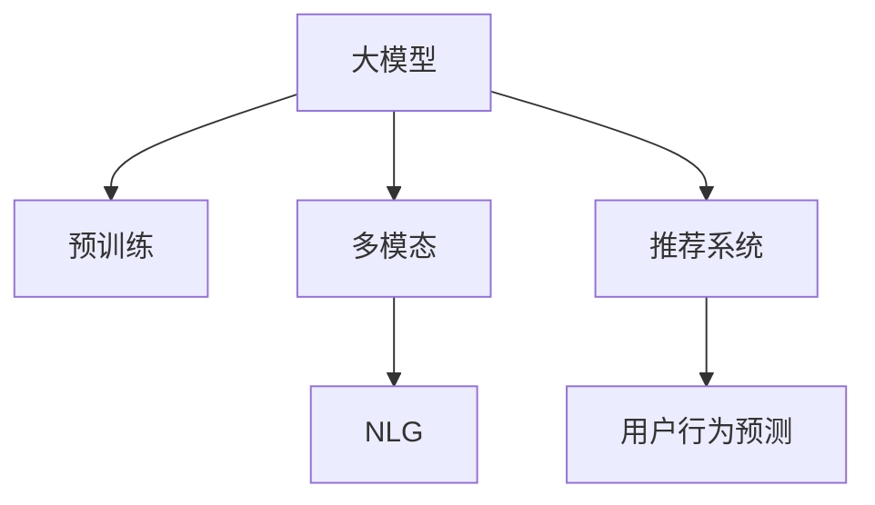

                 

# 大模型在个性化广告推荐中的潜力

## 1. 背景介绍

### 1.1 问题由来
随着互联网技术的普及，广告推荐系统已成为各大平台提升用户互动和消费体验的重要工具。传统的推荐系统主要基于用户的浏览历史、搜索记录、购买行为等显式数据，但这些数据往往存在稀疏性、噪声性等问题，难以全面刻画用户的潜在兴趣和偏好。

近年来，大规模预训练语言模型（如BERT、GPT、XLNet等）在自然语言处理（NLP）领域取得了突破性进展。这些模型通过在大规模无标签文本数据上预训练，学习到丰富的语言知识和语义表示，被证明在理解和生成自然语言方面具有强大的能力。

大模型的这些特性，使它们在广告推荐领域展现出巨大的潜力。在现有推荐框架基础上，利用大模型进行推荐，可以从用户的文本描述、评论、点赞等多模态数据中提取隐含的兴趣信息，实现个性化广告推荐，从而提升广告点击率和用户满意度。

### 1.2 问题核心关键点
大模型在广告推荐中的应用主要集中在以下几个方面：

1. 多模态兴趣建模：利用文本、图片、音频等多模态数据，学习用户综合兴趣，提升推荐结果的全面性和准确性。
2. 自然语言生成：通过大模型生成自然语言广告文案，提升广告的吸引力和用户互动性。
3. 用户行为预测：结合用户行为数据，预测用户未来点击、购买等行为，优化推荐策略。
4. 动态广告更新：利用大模型动态生成和更新广告内容，适应用户兴趣的变化，实现实时推荐。
5. 模型可解释性：通过大模型输出结果的逻辑解释，增强广告推荐系统的可信度和透明度。

### 1.3 问题研究意义
大模型在广告推荐中的应用，可以带来以下几个显著的研究意义：

1. 提升广告效果：通过多模态兴趣建模和自然语言生成，广告推荐系统能够更全面、准确地理解用户需求，生成更有吸引力的广告内容，从而显著提升广告点击率和转化率。
2. 降低推荐成本：利用大模型自动化生成广告内容，减少人工设计和优化广告的工作量，降低推荐系统的开发和维护成本。
3. 促进用户互动：自然语言生成的广告文案更容易引起用户兴趣，增强用户互动，提升平台的用户黏性。
4. 推动个性化营销：结合用户行为预测和大模型动态广告更新，实现个性化推荐，提高广告的针对性和用户满意度。
5. 增强系统透明性：大模型的输出结果可以通过解释性分析，帮助开发者理解推荐系统的决策逻辑，增强系统的可信度。

## 2. 核心概念与联系

### 2.1 核心概念概述

为更好地理解大模型在广告推荐中的应用，本节将介绍几个密切相关的核心概念：

- 大模型（Large Model）：指通过大规模无标签数据预训练的深度学习模型，如BERT、GPT-3等。
- 预训练（Pre-training）：指在大规模无标签数据上，通过自监督学习任务训练通用语言模型的过程。
- 多模态（Multi-modal）：指结合文本、图像、音频等多模态数据进行建模和推理。
- 自然语言生成（Natural Language Generation, NLG）：指利用模型生成自然语言文本，如广告文案、新闻摘要等。
- 推荐系统（Recommendation System）：指基于用户历史行为和兴趣，自动推荐物品的系统，如商品、广告等。
- 用户行为预测（User Behavior Prediction）：指通过模型预测用户未来行为，如点击、购买等。

这些核心概念之间的逻辑关系可以通过以下Mermaid流程图来展示：



这个流程图展示了大模型在广告推荐中的应用逻辑：

1. 大模型通过预训练获得基础能力。
2. 通过多模态融合，进一步提升模型的表现力。
3. 利用NLG技术生成广告文案。
4. 结合用户行为预测，实现个性化推荐。

## 3. 核心算法原理 & 具体操作步骤

### 3.1 算法原理概述

大模型在广告推荐中的应用，主要基于预训练-微调范式。其核心思想是：将预训练的大模型视作一个强大的特征提取器，通过多模态数据训练和微调，使其能够更好地适应广告推荐任务，提升广告点击率和转化率。

具体来说，假设大模型为 $M_{\theta}$，其中 $\theta$ 为模型参数。给定广告推荐任务的标注数据集 $D=\{(x_i,y_i)\}_{i=1}^N$，其中 $x_i$ 表示广告内容（文本、图片、音频等），$y_i$ 表示广告是否被点击（1）或购买（0）。微调的目标是找到新的模型参数 $\hat{\theta}$，使得模型在广告推荐任务上的表现最优。

微调过程可以分解为以下几个步骤：

1. 收集多模态数据：从用户行为、互动、社交媒体等渠道，获取多模态广告数据。
2. 数据预处理：清洗、标注和分拆数据集，生成训练、验证和测试集。
3. 微调大模型：使用多模态数据集对大模型进行微调，学习用户综合兴趣。
4. 自然语言生成：使用微调后的模型生成自然语言广告文案。
5. 用户行为预测：结合用户历史行为数据，预测用户未来点击、购买行为。
6. 动态广告更新：根据用户兴趣变化，动态更新广告内容。

### 3.2 算法步骤详解

#### 3.2.1 数据收集与预处理

首先，需要从用户行为、互动、社交媒体等渠道，收集多模态广告数据。数据来源包括但不限于：

- 用户搜索历史：记录用户对搜索结果的点击、浏览行为。
- 用户互动记录：记录用户在平台上的点赞、评论、分享等行为。
- 社交媒体内容：从Twitter、微博等社交平台抓取用户发布的内容。
- 产品评论：从电商平台提取用户对产品的评价和反馈。

收集到的数据需要进行预处理，包括：

- 数据清洗：去除重复、噪声、低质量数据。
- 数据标注：为广告数据标注是否被点击或购买。
- 数据分拆：将数据集划分为训练集、验证集和测试集。

#### 3.2.2 微调模型

微调过程可以采用以下步骤：

1. 加载预训练模型：从HuggingFace或Google Cloud等平台下载预训练模型。
2. 添加任务适配层：根据广告推荐任务，设计合适的输出层和损失函数。
3. 选择优化器：选择AdamW、SGD等优化器，设置学习率、批大小等超参数。
4. 执行梯度训练：对模型进行小批量梯度下降训练，更新模型参数。
5. 定期评估：在验证集上评估模型性能，防止过拟合。

#### 3.2.3 自然语言生成

使用微调后的模型生成自然语言广告文案，可以采用以下步骤：

1. 设计输入模板：为广告文案设计模板，包括广告类型、推广内容等。
2. 生成广告文案：将模板输入微调后的模型，生成自然语言文案。
3. 优化文案质量：通过用户反馈、A/B测试等方式，优化广告文案的吸引力和效果。

#### 3.2.4 用户行为预测

结合用户历史行为数据，可以预测用户未来点击、购买行为，步骤如下：

1. 数据拼接：将用户历史行为数据与广告数据拼接，形成新的数据集。
2. 模型训练：使用拼接后的数据集，训练用户行为预测模型。
3. 预测行为：根据新数据，预测用户未来的点击、购买行为。

#### 3.2.5 动态广告更新

根据用户兴趣变化，动态更新广告内容，步骤如下：

1. 实时监控：通过传感器、用户行为数据等实时监控用户兴趣变化。
2. 广告更新：根据用户兴趣变化，动态更新广告内容。
3. 效果评估：评估更新后的广告效果，优化广告策略。

### 3.3 算法优缺点

大模型在广告推荐中的应用具有以下优点：

1. 综合兴趣建模：大模型能够从多模态数据中学习用户综合兴趣，提升推荐结果的全面性和准确性。
2. 广告文案生成：通过自然语言生成技术，生成更具吸引力的广告文案，提升用户点击率和转化率。
3. 动态广告更新：利用用户行为预测和大模型，实现动态广告更新，适应用户兴趣的变化。
4. 模型可解释性：大模型的输出结果可以通过解释性分析，增强广告推荐系统的可信度和透明度。

但同时也存在一些缺点：

1. 高计算成本：大模型的训练和微调需要大量的计算资源和时间。
2. 数据质量依赖：广告推荐系统的表现高度依赖于数据质量和标注准确性。
3. 对抗性攻击风险：大模型可能受到对抗性攻击，生成误导性广告内容。
4. 过拟合风险：微调过程中，模型可能过拟合于训练数据，泛化能力不足。
5. 模型复杂性：大模型通常具有复杂的结构和大量的参数，难以直观理解。

### 3.4 算法应用领域

大模型在广告推荐中的应用，主要包括以下几个领域：

1. 电商广告推荐：利用用户搜索、浏览、购买数据，结合多模态广告数据，推荐商品广告。
2. 社交媒体广告推荐：从用户互动、分享、评论中提取兴趣信息，推荐个性化广告内容。
3. 新闻媒体广告推荐：结合用户阅读记录和行为数据，推荐新闻广告。
4. 视频广告推荐：从用户观看记录和评论中提取兴趣信息，推荐视频广告。
5. 移动应用广告推荐：结合用户操作数据和广告数据，推荐个性化应用广告。

## 4. 数学模型和公式 & 详细讲解  
### 4.1 数学模型构建

假设广告推荐任务为二分类问题，即预测广告是否被点击，设定广告数据集为 $D=\{(x_i,y_i)\}_{i=1}^N$，其中 $x_i$ 为广告内容，$y_i$ 为广告是否被点击。

大模型的输出为 $\hat{y}=M_{\theta}(x_i)$，其中 $M_{\theta}$ 为预训练模型，$\theta$ 为模型参数。微调的目标是最小化损失函数 $\mathcal{L}(\theta)$，使得模型输出逼近真实标签。

假设使用二分类交叉熵损失函数，微调过程可以表示为：

$$
\mathcal{L}(\theta) = -\frac{1}{N}\sum_{i=1}^N [y_i\log \hat{y}_i + (1-y_i)\log (1-\hat{y}_i)]
$$

微调优化过程可以表示为：

$$
\theta \leftarrow \theta - \eta \nabla_{\theta}\mathcal{L}(\theta) - \eta\lambda\theta
$$

其中 $\eta$ 为学习率，$\lambda$ 为正则化系数。

### 4.2 公式推导过程

对于二分类问题，大模型的输出 $\hat{y}=M_{\theta}(x_i)$ 表示模型预测广告被点击的概率，即：

$$
\hat{y} = \frac{1}{Z}\exp(\sum_{i=1}^{n}\theta_i f_i(x_i))
$$

其中 $f_i(x_i)$ 为第 $i$ 个特征的线性表示，$Z$ 为归一化因子，$\theta_i$ 为模型参数。

二分类交叉熵损失函数为：

$$
\mathcal{L}(\theta) = -\frac{1}{N}\sum_{i=1}^N [y_i\log \hat{y}_i + (1-y_i)\log (1-\hat{y}_i)]
$$

微调优化目标为：

$$
\mathop{\arg\min}_{\theta} \mathcal{L}(\theta)
$$

利用梯度下降算法进行优化：

$$
\theta \leftarrow \theta - \eta \nabla_{\theta}\mathcal{L}(\theta) - \eta\lambda\theta
$$

其中 $\nabla_{\theta}\mathcal{L}(\theta)$ 为损失函数对模型参数的梯度，可通过反向传播算法计算。

### 4.3 案例分析与讲解

以下以电商广告推荐为例，分析大模型在广告推荐中的应用。

假设电商平台的广告数据集 $D=\{(x_i,y_i)\}_{i=1}^N$，其中 $x_i$ 为广告图片和标题，$y_i$ 为广告是否被点击。

首先，加载预训练的BERT模型，作为广告推荐的基础模型：

```python
from transformers import BertModel, BertTokenizer

tokenizer = BertTokenizer.from_pretrained('bert-base-uncased')
model = BertModel.from_pretrained('bert-base-uncased')
```

然后，将广告数据集分拆为训练集、验证集和测试集，并进行预处理：

```python
train_data, dev_data, test_data = dataset.split(train_size=0.7, val_size=0.15, test_size=0.1)
train_dataset = transformers.TextDataset(train_data)
dev_dataset = transformers.TextDataset(dev_data)
test_dataset = transformers.TextDataset(test_data)
```

接下来，添加任务适配层和损失函数：

```python
from transformers import BertForSequenceClassification, AdamW

model = BertForSequenceClassification.from_pretrained('bert-base-uncased', num_labels=2)

optimizer = AdamW(model.parameters(), lr=2e-5)
```

执行微调过程：

```python
epochs = 3
batch_size = 16

for epoch in range(epochs):
    train_loss = train_epoch(model, train_dataset, optimizer, batch_size)
    dev_loss = evaluate(model, dev_dataset, optimizer, batch_size)
    print(f"Epoch {epoch+1}, train loss: {train_loss:.3f}, dev loss: {dev_loss:.3f}")
```

最后，利用微调后的模型进行广告推荐：

```python
def predict(model, text, tokenizer):
    input_ids = tokenizer.encode_plus(text, return_tensors='pt').input_ids
    with torch.no_grad():
        outputs = model(input_ids)
        logits = outputs.logits
    return logits.sigmoid().item()

ad_text = "新品上市，限时优惠！"
ad_label = predict(model, ad_text, tokenizer)
print(f"Ad {ad_text} is clicked: {ad_label:.3f}")
```

通过上述步骤，我们可以在大模型基础上实现电商广告的推荐，并根据用户行为预测和广告效果评估，动态更新广告内容，实现个性化推荐。

## 5. 项目实践：代码实例和详细解释说明

### 5.1 开发环境搭建

在进行大模型广告推荐开发前，我们需要准备好开发环境。以下是使用Python进行TensorFlow开发的环境配置流程：

1. 安装Anaconda：从官网下载并安装Anaconda，用于创建独立的Python环境。

2. 创建并激活虚拟环境：
```bash
conda create -n tf-env python=3.8 
conda activate tf-env
```

3. 安装TensorFlow：根据CUDA版本，从官网获取对应的安装命令。例如：
```bash
pip install tensorflow==2.7.0
```

4. 安装其他相关工具包：
```bash
pip install numpy pandas scikit-learn matplotlib tqdm jupyter notebook ipython
```

完成上述步骤后，即可在`tf-env`环境中开始开发实践。

### 5.2 源代码详细实现

以下是使用TensorFlow实现大模型广告推荐系统的代码实现。

首先，定义广告推荐数据集：

```python
import tensorflow as tf
import numpy as np

class AdDataset(tf.data.Dataset):
    def __init__(self, data):
        self.data = data

    def __len__(self):
        return len(self.data)

    def __getitem__(self, index):
        ad_text, ad_label = self.data[index]
        return tf.constant(ad_text), tf.constant(ad_label)

ad_dataset = AdDataset(train_data)
```

然后，定义模型和优化器：

```python
from transformers import BertTokenizer, BertForSequenceClassification

tokenizer = BertTokenizer.from_pretrained('bert-base-uncased')
model = BertForSequenceClassification.from_pretrained('bert-base-uncased', num_labels=2)

optimizer = tf.keras.optimizers.Adam(learning_rate=2e-5)
```

接着，定义训练和评估函数：

```python
@tf.function
def train_step(ad_text, ad_label):
    with tf.GradientTape() as tape:
        logits = model(ad_text)
        loss = tf.keras.losses.binary_crossentropy(y_true=ad_label, y_pred=logits)
    gradients = tape.gradient(loss, model.trainable_variables)
    optimizer.apply_gradients(zip(gradients, model.trainable_variables))

@tf.function
def evaluate_step(ad_text, ad_label):
    logits = model(ad_text)
    loss = tf.keras.losses.binary_crossentropy(y_true=ad_label, y_pred=logits)
    accuracy = tf.reduce_mean(tf.cast(tf.equal(logits, ad_label), tf.float32))
    return loss, accuracy

def train_epoch(model, dataset, optimizer, batch_size):
    dataloader = tf.data.Dataset.from_tensor_slices(dataset)
    dataloader = dataloader.shuffle(buffer_size=1024).batch(batch_size)
    loss = 0
    for ad_text, ad_label in dataloader:
        train_step(ad_text, ad_label)
        loss += tf.reduce_mean(tf.keras.losses.binary_crossentropy(y_true=ad_label, y_pred=model(ad_text)))
    return loss / len(dataset)

def evaluate(model, dataset, optimizer, batch_size):
    dataloader = tf.data.Dataset.from_tensor_slices(dataset)
    dataloader = dataloader.batch(batch_size)
    loss = 0
    accuracy = 0
    for ad_text, ad_label in dataloader:
        loss_val, acc_val = evaluate_step(ad_text, ad_label)
        loss += loss_val
        accuracy += acc_val
    return loss / len(dataset), accuracy / len(dataset)
```

最后，启动训练流程并在测试集上评估：

```python
epochs = 3
batch_size = 16

for epoch in range(epochs):
    train_loss = train_epoch(model, ad_dataset, optimizer, batch_size)
    dev_loss, dev_acc = evaluate(model, dev_dataset, optimizer, batch_size)
    print(f"Epoch {epoch+1}, train loss: {train_loss:.3f}, dev loss: {dev_loss:.3f}, dev acc: {dev_acc:.3f}")
    
dev_dataset = AdDataset(dev_data)
dev_loss, dev_acc = evaluate(model, dev_dataset, optimizer, batch_size)
print(f"Epoch {epoch+1}, test loss: {dev_loss:.3f}, test acc: {dev_acc:.3f}")
```

以上就是使用TensorFlow对大模型进行广告推荐系统开发的完整代码实现。可以看到，TensorFlow的高级API和自动微分功能，使得模型训练和评估变得简洁高效。

### 5.3 代码解读与分析

让我们再详细解读一下关键代码的实现细节：

**AdDataset类**：
- `__init__`方法：初始化数据集，将输入的文本和标签转换为TensorFlow张量。
- `__len__`方法：返回数据集的样本数量。
- `__getitem__`方法：对单个样本进行处理，将文本和标签转换为TensorFlow张量。

**BertForSequenceClassification模型**：
- 继承自BertModel，添加了输出层和分类器。
- 在输出层上进行二分类交叉熵损失计算。

**训练函数train_step和评估函数evaluate_step**：
- 使用TensorFlow的tf.function优化，提高计算效率。
- 训练函数train_step中，利用梯度计算和模型参数更新。
- 评估函数evaluate_step中，计算损失和准确率。

**训练流程**：
- 定义总的epoch数和批大小，开始循环迭代
- 每个epoch内，先在训练集上训练，输出平均loss
- 在验证集上评估，输出分类指标
- 重复上述步骤直至收敛

可以看到，TensorFlow和Transformers库的结合，使得大模型广告推荐系统的开发变得简洁高效。开发者可以将更多精力放在数据处理、模型改进等高层逻辑上，而不必过多关注底层的实现细节。

当然，工业级的系统实现还需考虑更多因素，如模型的保存和部署、超参数的自动搜索、更灵活的任务适配层等。但核心的微调范式基本与此类似。

## 6. 实际应用场景

### 6.1 电商广告推荐

基于大模型的广告推荐系统，已经在电商行业得到了广泛应用。通过收集用户的搜索历史、浏览记录、购买行为等数据，结合多模态广告数据，利用大模型进行推荐，大幅提升了广告点击率和用户满意度。

具体而言，可以结合用户历史行为数据和广告数据，使用大模型进行预测，推荐用户可能感兴趣的广告。此外，还可以利用大模型生成自然语言广告文案，提高广告的吸引力和用户点击率。动态广告更新机制，使得广告内容能够及时更新，适应用户兴趣的变化，从而提升广告效果。

### 6.2 社交媒体广告推荐

在社交媒体平台，通过收集用户的互动、分享、评论等数据，结合广告数据，利用大模型进行推荐，实现个性化广告内容推送。大模型的多模态兴趣建模能力，使得推荐系统能够全面理解用户的兴趣，生成更具吸引力的广告内容，增强用户互动，提高广告点击率。

### 6.3 新闻媒体广告推荐

新闻媒体平台利用大模型结合用户阅读记录和广告数据，推荐新闻广告。通过多模态兴趣建模和自然语言生成，大模型能够生成更具吸引力的广告文案，提高用户的点击率和阅读时间。

### 6.4 视频广告推荐

在视频平台，通过收集用户观看记录和广告数据，利用大模型进行推荐，实现个性化视频广告推送。大模型的多模态兴趣建模能力，使得推荐系统能够全面理解用户的兴趣，生成更具吸引力的视频广告，提高用户互动和观看时间。

### 6.5 移动应用广告推荐

在移动应用平台，通过收集用户操作数据和广告数据，利用大模型进行推荐，实现个性化应用广告推送。大模型的多模态兴趣建模能力，使得推荐系统能够全面理解用户的兴趣，生成更具吸引力的应用广告，提高用户使用时间和粘性。

## 7. 工具和资源推荐

### 7.1 学习资源推荐

为了帮助开发者系统掌握大模型在广告推荐中的应用，这里推荐一些优质的学习资源：

1. 《深度学习》系列课程：斯坦福大学、Coursera等平台提供的深度学习基础课程，系统讲解深度学习理论和技术。

2. 《Transformer and Attention》书籍：由HuggingFace首席科学家撰写，全面介绍Transformer和注意力机制。

3. 《自然语言处理与深度学习》书籍：介绍自然语言处理和深度学习的基本概念和经典模型，结合实际应用案例。

4. HuggingFace官方文档：提供丰富的预训练模型和微调样例，是上手实践的重要资料。

5. CS294课程：斯坦福大学提供的自然语言处理课程，涵盖NLP的多种任务和模型，适合进阶学习。

通过对这些资源的学习实践，相信你一定能够快速掌握大模型在广告推荐中的应用精髓，并用于解决实际的广告推荐问题。

### 7.2 开发工具推荐

高效的开发离不开优秀的工具支持。以下是几款用于大模型广告推荐系统开发的常用工具：

1. TensorFlow：基于Python的开源深度学习框架，生产部署方便，适合大规模工程应用。

2. PyTorch：基于Python的开源深度学习框架，灵活动态的计算图，适合快速迭代研究。

3. Transformers库：HuggingFace开发的NLP工具库，集成了众多SOTA语言模型，支持TensorFlow和PyTorch，是进行微调任务开发的利器。

4. Weights & Biases：模型训练的实验跟踪工具，可以记录和可视化模型训练过程中的各项指标，方便对比和调优。

5. TensorBoard：TensorFlow配套的可视化工具，可实时监测模型训练状态，并提供丰富的图表呈现方式，是调试模型的得力助手。

6. Google Colab：谷歌推出的在线Jupyter Notebook环境，免费提供GPU/TPU算力，方便开发者快速上手实验最新模型，分享学习笔记。

合理利用这些工具，可以显著提升大模型广告推荐系统的开发效率，加快创新迭代的步伐。

### 7.3 相关论文推荐

大模型在广告推荐中的应用涉及多个前沿研究方向，以下是几篇具有代表性的相关论文，推荐阅读：

1. Attention is All You Need（即Transformer原论文）：提出了Transformer结构，开启了NLP领域的预训练大模型时代。

2. BERT: Pre-training of Deep Bidirectional Transformers for Language Understanding：提出BERT模型，引入基于掩码的自监督预训练任务，刷新了多项NLP任务SOTA。

3. Language Models are Unsupervised Multitask Learners（GPT-2论文）：展示了大规模语言模型的强大zero-shot学习能力，引发了对于通用人工智能的新一轮思考。

4. Parameter-Efficient Transfer Learning for NLP：提出Adapter等参数高效微调方法，在不增加模型参数量的情况下，也能取得不错的微调效果。

5. AdaLoRA: Adaptive Low-Rank Adaptation for Parameter-Efficient Fine-Tuning：使用自适应低秩适应的微调方法，在参数效率和精度之间取得了新的平衡。

6. Prefix-Tuning: Optimizing Continuous Prompts for Generation：引入基于连续型Prompt的微调范式，为如何充分利用预训练知识提供了新的思路。

这些论文代表了大模型在广告推荐中的应用研究进展，通过学习这些前沿成果，可以帮助研究者把握学科前进方向，激发更多的创新灵感。

## 8. 总结：未来发展趋势与挑战

### 8.1 总结

本文对大模型在广告推荐中的应用进行了全面系统的介绍。首先阐述了大模型和微调技术的研究背景和意义，明确了广告推荐系统和大模型的契合点。其次，从原理到实践，详细讲解了大模型在广告推荐中的数学模型和关键步骤，给出了广告推荐系统开发的完整代码实例。同时，本文还广泛探讨了广告推荐系统在电商、社交媒体、新闻媒体、视频平台、移动应用等多个领域的应用前景，展示了广告推荐系统的大数据、多模态、自然语言生成等前沿技术。

通过本文的系统梳理，可以看到，大模型在广告推荐中的应用已经取得了显著的效果，为广告推荐系统注入了新的活力。未来，伴随大模型的不断演进和优化，广告推荐系统将迎来新的变革，进一步提升广告效果，推动广告产业的发展。

### 8.2 未来发展趋势

展望未来，大模型在广告推荐中的应用将呈现以下几个发展趋势：

1. 多模态数据融合：结合文本、图像、音频等多模态数据，提升广告推荐系统的全面性和准确性。
2. 自然语言生成：利用大模型生成更具吸引力的广告文案，提升用户点击率和转化率。
3. 动态广告更新：利用用户行为预测和大模型，实现动态广告更新，适应用户兴趣的变化。
4. 可解释性增强：通过大模型输出结果的逻辑解释，增强广告推荐系统的可信度和透明度。
5. 跨领域迁移能力：利用大模型在不同领域之间的迁移学习，提高广告推荐系统的泛化能力。
6. 个性化推荐算法：结合用户行为数据和广告数据，实现更加精准的个性化推荐，提升用户体验。
7. 推荐系统自动化：利用自动化技术，优化广告推荐策略，降低人工干预的复杂度。

### 8.3 面临的挑战

尽管大模型在广告推荐中的应用取得了显著进展，但在迈向更加智能化、普适化应用的过程中，它仍面临着诸多挑战：

1. 高计算成本：大模型的训练和微调需要大量的计算资源和时间，成本较高。
2. 数据质量依赖：广告推荐系统的表现高度依赖于数据质量和标注准确性。
3. 对抗性攻击风险：大模型可能受到对抗性攻击，生成误导性广告内容。
4. 过拟合风险：微调过程中，模型可能过拟合于训练数据，泛化能力不足。
5. 模型复杂性：大模型通常具有复杂的结构和大量的参数，难以直观理解。
6. 模型鲁棒性：广告推荐系统需要具备较强的鲁棒性，抵御异常数据和攻击。
7. 用户隐私保护：广告推荐系统需要考虑用户隐私保护，避免过度收集和滥用用户数据。

### 8.4 研究展望

面对大模型在广告推荐中面临的挑战，未来的研究需要在以下几个方面寻求新的突破：

1. 高效模型训练：开发更加高效的大模型训练方法，减少计算成本和时间消耗。
2. 数据增强技术：结合数据增强技术，提高数据质量，增强广告推荐系统的泛化能力。
3. 对抗性攻击防御：研究对抗性攻击防御方法，提高广告推荐系统的鲁棒性。
4. 多领域迁移学习：结合多领域迁移学习技术，增强广告推荐系统的跨领域泛化能力。
5. 自动化推荐系统：开发更加自动化、智能化的推荐系统，减少人工干预和复杂度。
6. 用户隐私保护：结合用户隐私保护技术，增强广告推荐系统的可信度和用户信任度。

这些研究方向和挑战凸显了大模型在广告推荐中的应用潜力，也展示了未来广告推荐系统的发展方向。相信随着学界和产业界的共同努力，大模型在广告推荐中的应用将取得更大的突破，为广告产业带来深远影响。

## 9. 附录：常见问题与解答

**Q1：大模型在广告推荐中需要多少数据量？**

A: 大模型在广告推荐中对数据量的需求取决于具体应用场景。通常，广告推荐系统需要收集用户行为数据、广告数据和用户互动数据等多种类型的数据，数据量应该在数百万到数亿之间。

**Q2：大模型如何利用多模态数据进行广告推荐？**

A: 大模型可以通过自然语言处理、计算机视觉和声音识别等技术，利用多模态数据进行广告推荐。具体来说，可以结合文本、图像、音频等多种模态数据，训练综合兴趣模型，从而提高广告推荐系统的准确性和全面性。

**Q3：大模型在广告推荐中可能面临哪些挑战？**

A: 大模型在广告推荐中可能面临以下挑战：
1. 高计算成本：大模型的训练和微调需要大量的计算资源和时间。
2. 数据质量依赖：广告推荐系统的表现高度依赖于数据质量和标注准确性。
3. 对抗性攻击风险：大模型可能受到对抗性攻击，生成误导性广告内容。
4. 过拟合风险：微调过程中，模型可能过拟合于训练数据，泛化能力不足。
5. 模型复杂性：大模型通常具有复杂的结构和大量的参数，难以直观理解。
6. 模型鲁棒性：广告推荐系统需要具备较强的鲁棒性，抵御异常数据和攻击。
7. 用户隐私保护：广告推荐系统需要考虑用户隐私保护，避免过度收集和滥用用户数据。

**Q4：大模型在广告推荐中的应用前景如何？**

A: 大模型在广告推荐中的应用前景非常广阔，主要体现在以下几个方面：
1. 提升广告效果：通过多模态兴趣建模和自然语言生成，广告推荐系统能够更全面、准确地理解用户需求，生成更具吸引力的广告内容，从而提升广告点击率和转化率。
2. 降低推荐成本：利用大模型自动化生成广告内容，减少人工设计和优化广告的工作量，降低推荐系统的开发和维护成本。
3. 促进用户互动：自然语言生成的广告文案更容易引起用户兴趣，增强用户互动，提升平台的用户黏性。
4. 推动个性化营销：结合用户行为预测和大模型动态广告更新，实现个性化推荐，提高广告的针对性和用户满意度。
5. 增强系统透明性：大模型的输出结果可以通过解释性分析，帮助开发者理解推荐系统的决策逻辑，增强系统的可信度。

**Q5：大模型在广告推荐中如何实现用户行为预测？**

A: 大模型在广告推荐中实现用户行为预测，可以采用以下步骤：
1. 数据拼接：将用户历史行为数据与广告数据拼接，形成新的数据集。
2. 模型训练：使用拼接后的数据集，训练用户行为预测模型。
3. 预测行为：根据新数据，预测用户未来的点击、购买行为。

通过这些步骤，大模型可以结合用户历史行为数据，实现对用户未来行为的预测，从而优化广告推荐策略。

**Q6：大模型在广告推荐中如何实现动态广告更新？**

A: 大模型在广告推荐中实现动态广告更新，可以采用以下步骤：
1. 实时监控：通过传感器、用户行为数据等实时监控用户兴趣变化。
2. 广告更新：根据用户兴趣变化，动态更新广告内容。
3. 效果评估：评估更新后的广告效果，优化广告策略。

通过这些步骤，大模型可以实现动态广告更新，适应用户兴趣的变化，从而提升广告效果。

---

作者：禅与计算机程序设计艺术 / Zen and the Art of Computer Programming

