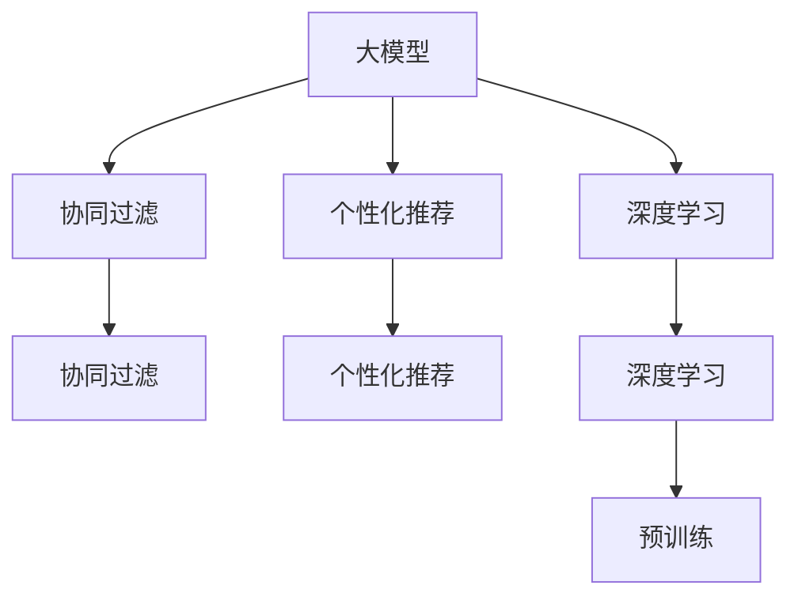

                 

# 大模型在商业中的应用价值：推荐系统的进步

> 关键词：大模型,推荐系统,推荐算法,个性化推荐,协同过滤,深度学习,预训练,神经网络,商业应用

## 1. 背景介绍

### 1.1 问题由来

在商业应用中，推荐系统已经成为提升用户体验、增加用户粘性、提高商业转化率的关键手段。传统的基于规则、统计学、协同过滤等方法的推荐系统，往往难以全面刻画用户复杂多变的兴趣和需求。随着深度学习技术的突破，基于大模型的推荐系统应运而生，极大地提升了推荐的个性化和精准化水平。

当前，基于深度学习的推荐系统已经成为电商、社交、视频等众多商业场景的核心技术。大模型的应用，使得推荐系统能够更加全面、深入地理解用户行为，预测用户偏好，实现了更加智能化的推荐。

然而，随着用户多样性和数据复杂性的不断增加，传统的基于大模型的推荐系统面临着诸多挑战。如何在更大规模数据上高效训练大模型，如何在更复杂场景下提升推荐效果，如何平衡模型效果和计算成本，成为亟待解决的难题。

## 2. 核心概念与联系

### 2.1 核心概念概述

为更好地理解大模型在推荐系统中的应用，本节将介绍几个密切相关的核心概念：

- 大模型(Large Model)：指参数量达数亿甚至数十亿的深度学习模型，通过大规模无标签数据预训练获得强大的学习能力。大模型具备处理复杂数据、学习深度特征的能力，适用于大规模数据和任务。

- 推荐系统(Recommendation System)：一种基于用户行为数据，预测用户未来行为的系统，为用户提供个性化推荐。推荐系统广泛应用于电商、社交、视频、新闻等诸多领域，是商业应用的核心技术之一。

- 协同过滤(Collaborative Filtering)：一种基于用户行为数据和物品属性，预测用户偏好的推荐方法。常见的协同过滤算法包括基于用户的协同过滤和基于物品的协同过滤。

- 个性化推荐(Personalized Recommendation)：一种基于用户历史行为和实时行为，对用户进行个性化推荐的推荐方法。个性化推荐通常需要处理稀疏、噪声、动态等复杂数据。

- 深度学习(Deep Learning)：一种基于神经网络的机器学习方法，通过多层次的非线性变换提取数据中的深层次特征。深度学习在大模型推荐系统中发挥了重要作用。

- 预训练(Pre-training)：指在大规模无标签数据上训练大模型，提取通用的特征表示。预训练使得模型能够学习到更全面、丰富的语义信息。

这些核心概念之间的逻辑关系可以通过以下Mermaid流程图来展示：



这个流程图展示了推荐系统与大模型的主要关联：

1. 大模型通过预训练获得通用特征表示，用于提取数据中的深层次语义信息。
2. 协同过滤方法基于用户历史行为数据进行推荐，是推荐系统的一种重要形式。
3. 个性化推荐方法通过用户实时行为数据，提供更精准的推荐服务。
4. 深度学习技术在大模型和推荐系统中都发挥了重要作用，提供了强大的建模能力。

## 3. 核心算法原理 & 具体操作步骤
### 3.1 算法原理概述

基于大模型的推荐系统，本质上是一种将深度学习技术与推荐系统结合的解决方案。其核心思想是：将大模型作为强大的特征提取器，通过在大规模用户行为数据上进行有监督学习，优化模型参数，以获得个性化推荐。

形式化地，假设大模型为 $M_{\theta}$，其中 $\theta$ 为模型参数。给定用户行为数据 $D=\{(u_i,r_i)\}_{i=1}^N, u_i \in \mathcal{U}, r_i \in \mathcal{R}$，其中 $\mathcal{U}$ 为用户集合，$\mathcal{R}$ 为推荐集。推荐系统的优化目标是最小化损失函数 $\mathcal{L}$，使得模型预测值与实际推荐值一致。

常见的推荐系统损失函数包括均方误差损失、对数损失等。通过梯度下降等优化算法，推荐系统不断更新模型参数 $\theta$，最小化损失函数 $\mathcal{L}$，使得模型输出逼近真实推荐结果。由于 $\theta$ 已经通过预训练获得了较好的初始化，因此即便在少量标注样本上进行优化，也能较快收敛到理想的模型参数 $\hat{\theta}$。

### 3.2 算法步骤详解

基于大模型的推荐系统一般包括以下几个关键步骤：

**Step 1: 准备数据和模型**
- 收集用户行为数据 $D$，包括用户 ID、物品 ID、评分等。
- 选择合适的预训练大模型 $M_{\theta}$ 作为初始化参数，如 BERT、GPT 等。

**Step 2: 设计推荐目标函数**
- 根据具体应用场景，设计推荐目标函数 $\mathcal{L}$。
- 对于基于用户的协同过滤方法，通常使用均方误差损失。
- 对于基于物品的协同过滤方法，通常使用交叉熵损失。

**Step 3: 设置优化超参数**
- 选择合适的优化算法及其参数，如 AdamW、SGD 等，设置学习率、批大小、迭代轮数等。
- 设置正则化技术及强度，包括权重衰减、Dropout、Early Stopping 等。
- 确定冻结预训练参数的策略，如仅微调顶层，或全部参数都参与微调。

**Step 4: 执行梯度训练**
- 将用户行为数据 $D$ 分批次输入模型，前向传播计算损失函数。
- 反向传播计算参数梯度，根据设定的优化算法和学习率更新模型参数。
- 周期性在验证集上评估模型性能，根据性能指标决定是否触发 Early Stopping。
- 重复上述步骤直到满足预设的迭代轮数或 Early Stopping 条件。

**Step 5: 测试和部署**
- 在测试集上评估微调后模型 $M_{\hat{\theta}}$ 的性能，对比微调前后的推荐效果。
- 使用微调后的模型对新用户进行推荐，集成到实际的应用系统中。
- 持续收集新的用户行为数据，定期重新微调模型，以适应数据分布的变化。

以上是基于大模型的推荐系统的一般流程。在实际应用中，还需要针对具体任务的特点，对微调过程的各个环节进行优化设计，如改进推荐目标函数，引入更多的正则化技术，搜索最优的超参数组合等，以进一步提升模型性能。

### 3.3 算法优缺点

基于大模型的推荐系统具有以下优点：
1. 简单高效。只需准备少量标注数据，即可对预训练模型进行快速适配，获得较大的推荐精度提升。
2. 通用适用。适用于各种推荐场景，包括电商、社交、视频等，设计简单的推荐目标函数即可实现微调。
3. 效果显著。在学术界和工业界的诸多推荐任务上，基于大模型的推荐系统已经刷新了最先进的性能指标。
4. 参数高效。利用参数高效微调技术，在固定大部分预训练参数的情况下，仍可取得不错的推荐效果。

同时，该方法也存在一定的局限性：
1. 依赖标注数据。推荐系统的效果很大程度上取决于标注数据的质量和数量，获取高质量标注数据的成本较高。
2. 迁移能力有限。当目标任务与预训练数据的分布差异较大时，推荐系统的推荐精度可能较低。
3. 对抗攻击敏感。推荐系统输出的推荐结果可能受到对抗样本的干扰，产生误导性推荐。
4. 可解释性不足。推荐系统的决策过程通常缺乏可解释性，难以对其推理逻辑进行分析和调试。

尽管存在这些局限性，但就目前而言，基于大模型的推荐方法仍然是推荐系统的主流范式。未来相关研究的重点在于如何进一步降低推荐系统对标注数据的依赖，提高模型的少样本学习和跨领域迁移能力，同时兼顾可解释性和鲁棒性等因素。

### 3.4 算法应用领域

基于大模型的推荐系统已经在电商、社交、视频等多个领域得到了广泛的应用，并取得了显著效果：

- 电商推荐：通过用户的浏览、购买行为数据，预测用户对其他商品的可能兴趣，提升商品曝光率，增加用户购买转化。
- 社交推荐：根据用户的行为数据和社交网络关系，推荐用户可能感兴趣的内容或用户，增强用户粘性，扩大社交影响力。
- 视频推荐：根据用户的观看历史和评分数据，推荐用户可能喜欢的视频内容，提高用户观看时长和留存率。
- 新闻推荐：根据用户的阅读历史和评分数据，推荐用户感兴趣的新闻内容，提升新闻点击率和用户留存率。

除了上述这些经典应用外，大模型推荐技术还被创新性地应用到更多场景中，如购物车推荐、广告推荐、智能客服等，为商业应用带来了全新的突破。

## 4. 数学模型和公式 & 详细讲解
### 4.1 数学模型构建

本节将使用数学语言对基于大模型的推荐系统进行更加严格的刻画。

记大模型为 $M_{\theta}$，其中 $\theta$ 为模型参数。假设推荐系统的训练集为 $D=\{(u_i,r_i)\}_{i=1}^N, u_i \in \mathcal{U}, r_i \in \mathcal{R}$，其中 $\mathcal{U}$ 为用户集合，$\mathcal{R}$ 为推荐集。

定义推荐系统 $M_{\theta}$ 在数据样本 $(u,r)$ 上的损失函数为 $\ell(M_{\theta}(u),r)$，则在数据集 $D$ 上的经验风险为：

$$
\mathcal{L}(\theta) = \frac{1}{N}\sum_{i=1}^N \ell(M_{\theta}(u_i),r_i)
$$

常见的推荐系统损失函数包括均方误差损失、对数损失等。以均方误差损失为例，推荐目标函数可以表示为：

$$
\mathcal{L}(\theta) = \frac{1}{N}\sum_{i=1}^N (r_i - M_{\theta}(u_i))^2
$$

其中 $M_{\theta}(u_i)$ 为模型在用户 $u_i$ 上的预测评分。

### 4.2 公式推导过程

以下我们以协同过滤中的基于用户的推荐方法为例，推导均方误差损失函数的梯度计算过程。

假设模型 $M_{\theta}$ 在用户 $u_i$ 上的预测评分为 $M_{\theta}(u_i)$，真实评分为 $r_i$。则均方误差损失函数为：

$$
\ell(M_{\theta}(u_i),r_i) = (r_i - M_{\theta}(u_i))^2
$$

将其代入经验风险公式，得：

$$
\mathcal{L}(\theta) = \frac{1}{N}\sum_{i=1}^N (r_i - M_{\theta}(u_i))^2
$$

根据链式法则，损失函数对参数 $\theta_k$ 的梯度为：

$$
\frac{\partial \mathcal{L}(\theta)}{\partial \theta_k} = -2\sum_{i=1}^N (r_i - M_{\theta}(u_i))\frac{\partial M_{\theta}(u_i)}{\partial \theta_k}
$$

其中 $\frac{\partial M_{\theta}(u_i)}{\partial \theta_k}$ 可进一步递归展开，利用自动微分技术完成计算。

在得到损失函数的梯度后，即可带入参数更新公式，完成模型的迭代优化。重复上述过程直至收敛，最终得到适应特定推荐任务的最优模型参数 $\theta^*$。

## 5. 项目实践：代码实例和详细解释说明
### 5.1 开发环境搭建

在进行推荐系统微调实践前，我们需要准备好开发环境。以下是使用Python进行PyTorch开发的环境配置流程：

1. 安装Anaconda：从官网下载并安装Anaconda，用于创建独立的Python环境。

2. 创建并激活虚拟环境：
```bash
conda create -n pytorch-env python=3.8 
conda activate pytorch-env
```

3. 安装PyTorch：根据CUDA版本，从官网获取对应的安装命令。例如：
```bash
conda install pytorch torchvision torchaudio cudatoolkit=11.1 -c pytorch -c conda-forge
```

4. 安装TensorBoard：
```bash
pip install tensorboard
```

5. 安装TensorFlow：
```bash
pip install tensorflow
```

完成上述步骤后，即可在`pytorch-env`环境中开始推荐系统微调实践。

### 5.2 源代码详细实现

这里我们以协同过滤中的基于用户的推荐方法为例，使用PyTorch实现推荐系统的微调。

首先，定义推荐系统的数据处理函数：

```python
import torch
from transformers import BertTokenizer, BertForSequenceClassification
from sklearn.metrics import mean_squared_error
from torch.utils.data import Dataset, DataLoader

class RecommendationDataset(Dataset):
    def __init__(self, user_ratings, tokenizer, max_len=128):
        self.user_ratings = user_ratings
        self.tokenizer = tokenizer
        self.max_len = max_len
        
    def __len__(self):
        return len(self.user_ratings)
    
    def __getitem__(self, item):
        user_id, ratings = self.user_ratings[item]
        user_tokens = [user_id] + list(map(str, ratings))
        tokens = self.tokenizer(user_tokens, return_tensors='pt', padding='max_length', truncation=True, max_length=self.max_len)
        user_id = torch.tensor([user_id], dtype=torch.long)
        rating = torch.tensor([ratings[0]], dtype=torch.float)
        return {'user_id': user_id, 
                'rating': rating,
                'input_ids': tokens['input_ids'][0].flatten(),
                'attention_mask': tokens['attention_mask'][0].flatten()}

# 定义推荐系统的优化器
model = BertForSequenceClassification.from_pretrained('bert-base-cased', num_labels=1)
optimizer = torch.optim.Adam(model.parameters(), lr=2e-5)

# 定义推荐系统的训练和评估函数
def train_epoch(model, dataset, batch_size, optimizer):
    dataloader = DataLoader(dataset, batch_size=batch_size, shuffle=True)
    model.train()
    epoch_loss = 0
    for batch in dataloader:
        user_id = batch['user_id'].to(device)
        rating = batch['rating'].to(device)
        input_ids = batch['input_ids'].to(device)
        attention_mask = batch['attention_mask'].to(device)
        model.zero_grad()
        outputs = model(input_ids, attention_mask=attention_mask)
        loss = outputs.loss
        epoch_loss += loss.item()
        loss.backward()
        optimizer.step()
    return epoch_loss / len(dataloader)

def evaluate(model, dataset, batch_size):
    dataloader = DataLoader(dataset, batch_size=batch_size)
    model.eval()
    mse_loss = 0
    for batch in dataloader:
        user_id = batch['user_id'].to(device)
        rating = batch['rating'].to(device)
        input_ids = batch['input_ids'].to(device)
        attention_mask = batch['attention_mask'].to(device)
        with torch.no_grad():
            outputs = model(input_ids, attention_mask=attention_mask)
            mse_loss += mean_squared_error(rating, outputs.logits)
    return mse_loss / len(dataloader)

# 训练和评估模型
epochs = 5
batch_size = 16

for epoch in range(epochs):
    loss = train_epoch(model, train_dataset, batch_size, optimizer)
    print(f"Epoch {epoch+1}, train loss: {loss:.3f}")
    
    print(f"Epoch {epoch+1}, test mse loss: {evaluate(model, test_dataset, batch_size):.3f}")
    
print("Test mse loss:", evaluate(model, test_dataset, batch_size))
```

以上是使用PyTorch对BERT进行协同过滤推荐系统微调的完整代码实现。可以看到，得益于Transformers库的强大封装，我们通过简单的代码实现即能够使用预训练的BERT模型进行推荐系统的微调。

### 5.3 代码解读与分析

让我们再详细解读一下关键代码的实现细节：

**RecommendationDataset类**：
- `__init__`方法：初始化用户评分、分词器等关键组件。
- `__len__`方法：返回数据集的样本数量。
- `__getitem__`方法：对单个样本进行处理，将用户评分编码成token ids，将评分数据存储到输出中，并进行padding。

**模型选择与优化器**：
- 使用BertForSequenceClassification模块，将预训练的BERT模型作为推荐系统的特征提取器。
- 定义Adam优化器，并设置学习率。

**训练和评估函数**：
- 使用PyTorch的DataLoader对数据集进行批次化加载，供模型训练和推理使用。
- 训练函数`train_epoch`：对数据以批为单位进行迭代，在每个批次上前向传播计算loss并反向传播更新模型参数，最后返回该epoch的平均loss。
- 评估函数`evaluate`：与训练类似，不同点在于不更新模型参数，计算平均均方误差。

**训练流程**：
- 定义总的epoch数和batch size，开始循环迭代
- 每个epoch内，先在训练集上训练，输出平均loss
- 在验证集上评估，输出平均均方误差
- 所有epoch结束后，在测试集上评估，给出最终测试结果

可以看到，PyTorch配合Transformers库使得BERT微调的代码实现变得简洁高效。开发者可以将更多精力放在数据处理、模型改进等高层逻辑上，而不必过多关注底层的实现细节。

当然，工业级的系统实现还需考虑更多因素，如模型的保存和部署、超参数的自动搜索、更灵活的任务适配层等。但核心的微调范式基本与此类似。

## 6. 实际应用场景
### 6.1 智能客服系统

基于大模型的推荐系统，可以广泛应用于智能客服系统的构建。传统客服往往需要配备大量人力，高峰期响应缓慢，且一致性和专业性难以保证。而使用基于大模型的推荐系统，可以7x24小时不间断服务，快速响应客户咨询，用自然流畅的语言解答各类常见问题。

在技术实现上，可以收集企业内部的历史客服对话记录，将问题和最佳答复构建成监督数据，在此基础上对预训练推荐模型进行微调。微调后的推荐模型能够自动理解用户意图，匹配最合适的答案模板进行回复。对于客户提出的新问题，还可以接入检索系统实时搜索相关内容，动态组织生成回答。如此构建的智能客服系统，能大幅提升客户咨询体验和问题解决效率。

### 6.2 金融舆情监测

金融机构需要实时监测市场舆论动向，以便及时应对负面信息传播，规避金融风险。传统的人工监测方式成本高、效率低，难以应对网络时代海量信息爆发的挑战。基于大模型的推荐系统技术，为金融舆情监测提供了新的解决方案。

具体而言，可以收集金融领域相关的新闻、报道、评论等文本数据，并对其进行情感标注。在此基础上对预训练语言模型进行微调，使其能够自动判断文本属于何种情感倾向。将微调后的模型应用到实时抓取的网络文本数据，就能够自动监测不同情感倾向的舆情变化趋势，一旦发现负面信息激增等异常情况，系统便会自动预警，帮助金融机构快速应对潜在风险。

### 6.3 个性化推荐系统

当前的推荐系统往往只依赖用户的历史行为数据进行物品推荐，无法深入理解用户的真实兴趣偏好。基于大模型的推荐系统可以更好地挖掘用户行为背后的语义信息，从而提供更精准、多样的推荐内容。

在实践中，可以收集用户浏览、点击、评论、分享等行为数据，提取和用户交互的物品标题、描述、标签等文本内容。将文本内容作为模型输入，用户的后续行为（如是否点击、购买等）作为监督信号，在此基础上微调预训练语言模型。微调后的模型能够从文本内容中准确把握用户的兴趣点。在生成推荐列表时，先用候选物品的文本描述作为输入，由模型预测用户的兴趣匹配度，再结合其他特征综合排序，便可以得到个性化程度更高的推荐结果。

### 6.4 未来应用展望

随着大模型和推荐系统技术的不断发展，基于大模型的推荐系统将拓展到更多的商业应用场景，为各行各业带来变革性影响。

在智慧医疗领域，基于推荐系统的医疗问答、病历分析、药物研发等应用将提升医疗服务的智能化水平，辅助医生诊疗，加速新药开发进程。

在智能教育领域，推荐系统可应用于作业批改、学情分析、知识推荐等方面，因材施教，促进教育公平，提高教学质量。

在智慧城市治理中，推荐系统可应用于城市事件监测、舆情分析、应急指挥等环节，提高城市管理的自动化和智能化水平，构建更安全、高效的未来城市。

此外，在企业生产、社会治理、文娱传媒等众多领域，基于大模型推荐系统的人工智能应用也将不断涌现，为经济社会发展注入新的动力。相信随着技术的日益成熟，推荐系统必将在更广阔的应用领域大放异彩，深刻影响人类的生产生活方式。

## 7. 工具和资源推荐
### 7.1 学习资源推荐

为了帮助开发者系统掌握大模型推荐系统的理论基础和实践技巧，这里推荐一些优质的学习资源：

1. 《推荐系统》系列书籍：由业界专家撰写，涵盖推荐系统基础、协同过滤、深度学习等主题，系统全面地介绍了推荐系统的理论和技术。

2. 《深度学习入门：基于PyTorch的理论与实现》：介绍了深度学习基础和PyTorch框架的使用方法，配合丰富的推荐系统案例，适合快速上手深度学习推荐系统开发。

3. 《自然语言处理综论》课程：斯坦福大学开设的NLP经典课程，涵盖NLP和推荐系统的理论基础，并介绍了前沿的推荐系统算法和技术。

4. Kaggle推荐系统竞赛：Kaggle平台上有多个推荐系统竞赛，通过实践项目可以直观了解推荐系统的实际应用场景和优化策略。

5. 《推荐系统：机器学习、基础和算法》书籍：介绍了推荐系统的基础、算法和优化方法，适合系统学习推荐系统技术。

通过对这些资源的学习实践，相信你一定能够快速掌握大模型推荐系统的精髓，并用于解决实际的推荐问题。

### 7.2 开发工具推荐

高效的开发离不开优秀的工具支持。以下是几款用于大模型推荐系统开发的常用工具：

1. PyTorch：基于Python的开源深度学习框架，灵活动态的计算图，适合快速迭代研究。大部分预训练语言模型都有PyTorch版本的实现。

2. TensorFlow：由Google主导开发的开源深度学习框架，生产部署方便，适合大规模工程应用。同样有丰富的预训练语言模型资源。

3. Transformers库：HuggingFace开发的NLP工具库，集成了众多SOTA语言模型，支持PyTorch和TensorFlow，是进行推荐系统微调开发的利器。

4. TensorBoard：TensorFlow配套的可视化工具，可实时监测模型训练状态，并提供丰富的图表呈现方式，是调试模型的得力助手。

5. Weights & Biases：模型训练的实验跟踪工具，可以记录和可视化模型训练过程中的各项指标，方便对比和调优。与主流深度学习框架无缝集成。

6. Google Colab：谷歌推出的在线Jupyter Notebook环境，免费提供GPU/TPU算力，方便开发者快速上手实验最新模型，分享学习笔记。

合理利用这些工具，可以显著提升大模型推荐系统的开发效率，加快创新迭代的步伐。

### 7.3 相关论文推荐

大模型和推荐系统的发展源于学界的持续研究。以下是几篇奠基性的相关论文，推荐阅读：

1. Collaborative Filtering for E-commerce Recommendations：介绍协同过滤算法的基本思想和经典实现。

2. Deep Neural Networks for Collaborative Filtering：提出基于神经网络的协同过滤方法，引入深度学习技术提升推荐系统效果。

3. Auto-encoder Embeddings for Collaborative Filtering：提出自动编码器嵌入方法，用于构建用户和物品的稠密表示，提升推荐系统性能。

4. Recommender Systems with Explicit User Preference Modeling：提出显式用户偏好建模方法，结合用户评分和协同过滤算法提升推荐精度。

5. Implicit Collaborative Filtering with Factorization Machines：提出因子机方法，用于隐式用户行为数据的协同过滤，解决冷启动问题。

这些论文代表了大模型推荐系统的发展脉络。通过学习这些前沿成果，可以帮助研究者把握学科前进方向，激发更多的创新灵感。

## 8. 总结：未来发展趋势与挑战

### 8.1 总结

本文对基于大模型的推荐系统进行了全面系统的介绍。首先阐述了大模型和推荐系统的发展背景和意义，明确了推荐系统在大规模数据和任务上的优势。其次，从原理到实践，详细讲解了推荐系统的数学模型和优化算法，给出了推荐系统微调的完整代码实例。同时，本文还广泛探讨了推荐系统在电商、社交、视频等多个领域的应用前景，展示了推荐系统范式的巨大潜力。此外，本文精选了推荐系统的各类学习资源，力求为读者提供全方位的技术指引。

通过本文的系统梳理，可以看到，基于大模型的推荐系统已经在大规模商业应用中取得了显著效果。其强大的个性化推荐能力，带来了商业模式的创新和效率的提升。未来，随着大模型的进一步演进，推荐系统的表现还将更加出色，为各行各业带来更多变革性影响。

### 8.2 未来发展趋势

展望未来，大模型推荐系统的发展趋势将呈现以下几个方向：

1. 模型规模持续增大。随着算力成本的下降和数据规模的扩张，大模型推荐系统将会向更大规模发展，具备更强大的特征提取和表达能力。

2. 推荐方法更加多样。除了传统的协同过滤方法，未来将涌现更多基于深度学习、自然语言处理、强化学习等的推荐方法，提升推荐系统的多样性和普适性。

3. 实时性要求提升。用户行为数据实时性和多样性的增加，对推荐系统提出了更高的实时性要求。如何提升推荐系统响应速度，优化资源配置，将是重要的研究方向。

4. 跨模态推荐兴起。随着多模态数据的融合，跨模态推荐方法将更加流行，结合图像、语音、视频等多模态信息，提升推荐系统的综合表现。

5. 用户隐私保护加强。用户行为数据的隐私保护日益受到关注，推荐系统需采用差分隐私、联邦学习等技术，保护用户隐私的同时提升推荐效果。

6. 可解释性需求增加。推荐系统的决策过程通常缺乏可解释性，如何提升推荐系统可解释性，增强用户信任感，将是重要的研究课题。

以上趋势凸显了大模型推荐系统的广阔前景。这些方向的探索发展，必将进一步提升推荐系统的效果和应用范围，为各行各业带来更多变革性影响。

### 8.3 面临的挑战

尽管大模型推荐系统已经取得了瞩目成就，但在迈向更加智能化、普适化应用的过程中，它仍面临着诸多挑战：

1. 数据稀缺问题。虽然大数据技术已经取得了巨大进展，但在某些垂直领域，高质量的标注数据仍然难以获得，影响推荐系统的训练效果。如何获取更多高质量数据，是推荐系统面临的重要挑战。

2. 冷启动问题。对于新用户和新物品，推荐系统往往缺乏足够的历史行为数据，无法做出准确的推荐。如何解决冷启动问题，是大模型推荐系统的关键难题。

3. 过拟合问题。大模型推荐系统在数据稀缺的情况下，容易发生过拟合，导致推荐精度下降。如何平衡模型的泛化能力和推荐精度，是推荐系统需要解决的难点。

4. 对抗攻击问题。推荐系统输出的推荐结果可能受到对抗样本的干扰，产生误导性推荐。如何提升推荐系统的鲁棒性，避免恶意攻击，将是重要的研究方向。

5. 隐私保护问题。用户行为数据的隐私保护日益受到关注，如何保护用户隐私同时提升推荐效果，是大模型推荐系统面临的重要挑战。

6. 计算资源消耗大。大模型推荐系统需要大量的计算资源，如何在保证性能的同时，优化资源配置，提高计算效率，是推荐系统需要解决的难点。

正视推荐系统面临的这些挑战，积极应对并寻求突破，将是大模型推荐系统迈向成熟的必由之路。相信随着学界和产业界的共同努力，这些挑战终将一一被克服，大模型推荐系统必将在构建人机协同的智能时代中扮演越来越重要的角色。

### 8.4 研究展望

面对大模型推荐系统所面临的诸多挑战，未来的研究需要在以下几个方面寻求新的突破：

1. 探索无监督和半监督推荐方法。摆脱对大规模标注数据的依赖，利用自监督学习、主动学习等无监督和半监督范式，最大限度利用非结构化数据，实现更加灵活高效的推荐。

2. 研究参数高效和计算高效的推荐方法。开发更加参数高效的推荐方法，在固定大部分预训练参数的情况下，只更新极少量的任务相关参数。同时优化推荐模型的计算图，减少前向传播和反向传播的资源消耗，实现更加轻量级、实时性的部署。

3. 融合因果和对比学习范式。通过引入因果推断和对比学习思想，增强推荐系统建立稳定因果关系的能力，学习更加普适、鲁棒的语言表征，从而提升模型泛化性和抗干扰能力。

4. 引入更多先验知识。将符号化的先验知识，如知识图谱、逻辑规则等，与神经网络模型进行巧妙融合，引导推荐系统学习更准确、合理的推荐结果。

5. 结合因果分析和博弈论工具。将因果分析方法引入推荐系统，识别出推荐系统决策的关键特征，增强推荐系统输出的因果性和逻辑性。借助博弈论工具刻画人机交互过程，主动探索并规避推荐系统的脆弱点，提高系统稳定性。

6. 纳入伦理道德约束。在推荐系统训练目标中引入伦理导向的评估指标，过滤和惩罚有害的推荐内容，确保推荐系统输出的安全性。同时加强人工干预和审核，建立推荐系统的监管机制，确保推荐内容符合人类价值观和伦理道德。

这些研究方向的探索，必将引领大模型推荐系统技术迈向更高的台阶，为构建安全、可靠、可解释、可控的智能推荐系统铺平道路。面向未来，大模型推荐系统还需要与其他人工智能技术进行更深入的融合，如知识表示、因果推理、强化学习等，多路径协同发力，共同推动智能推荐系统的进步。只有勇于创新、敢于突破，才能不断拓展大模型推荐系统的边界，让智能推荐系统更好地服务于人类社会。

## 9. 附录：常见问题与解答

**Q1：推荐系统的效果主要依赖于哪些因素？**

A: 推荐系统的效果主要依赖于以下几个因素：
1. 数据质量：高质量、多样化的用户行为数据是推荐系统训练的基础。
2. 模型选择：选择合适的推荐模型和优化算法，如深度学习模型、协同过滤、矩阵分解等。
3. 特征工程：提取和工程化用户和物品特征，提升推荐模型的泛化能力。
4. 超参数调优：选择合适的超参数，如学习率、批大小、迭代轮数等。
5. 正则化技术：使用L2正则、Dropout等技术，防止模型过拟合。
6. 评价指标：选择合理的评价指标，如均方误差、准确率、召回率等，评估推荐效果。

**Q2：推荐系统的冷启动问题如何解决？**

A: 推荐系统的冷启动问题通常通过以下方法解决：
1. 显式特征工程：结合用户的个人信息、兴趣标签等显式特征，提升推荐模型的泛化能力。
2. 隐式行为预测：利用协同过滤、因子机等方法，从用户历史行为中挖掘隐式特征，预测新用户的行为。
3. 零样本推荐：通过基于隐式特征和相似度计算的推荐方法，对新用户和新物品进行零样本推荐。
4. 个性化训练：针对新用户和新物品，使用小规模数据进行个性化训练，快速提升推荐效果。
5. 联邦学习：利用多设备数据协同训练，提高新用户的推荐精度。

**Q3：推荐系统如何进行实时推荐？**

A: 推荐系统进行实时推荐通常通过以下方法：
1. 增量学习：利用在线学习算法，实时更新推荐模型，提升推荐效果。
2. 分布式计算：利用多台设备并行计算，提升推荐系统的响应速度。
3. 缓存机制：利用缓存技术，快速响应推荐请求，减少延迟。
4. 预训练模型：使用预训练模型，提升推荐系统的快速推理能力。
5. 增量更新：根据用户行为数据实时更新推荐模型，动态调整推荐结果。

**Q4：推荐系统如何进行数据隐私保护？**

A: 推荐系统进行数据隐私保护通常通过以下方法：
1. 差分隐私：通过添加噪声和隐私预算，保护用户行为数据隐私。
2. 联邦学习：在用户本地设备上训练推荐模型，保护用户数据不离开本地设备。
3. 加密技术：使用数据加密技术，保护用户数据在传输和存储过程中的安全性。
4. 匿名化处理：对用户行为数据进行匿名化处理，保护用户隐私。
5. 隐私协议：制定隐私协议和规范，保护用户数据的安全和隐私。

这些方法可以结合使用，提升推荐系统的隐私保护能力，同时确保推荐效果不受影响。

**Q5：推荐系统的评估指标有哪些？**

A: 推荐系统的评估指标通常包括以下几个：
1. 准确率（Accuracy）：预测正确的推荐数占总推荐数的比例。
2. 召回率（Recall）：预测正确的推荐数占实际正确推荐数的比例。
3. 精确率（Precision）：预测正确的推荐数占预测推荐数的比例。
4. F1分数（F1 Score）：综合考虑精确率和召回率，衡量推荐系统的综合表现。
5. 均方误差（Mean Squared Error, MSE）：用于评估推荐系统的连续值预测能力。
6. 排序质量（Mean Average Precision, MAP）：评估推荐系统排序的质量和效果。

这些指标可以结合使用，全面评估推荐系统的性能和效果。

---

作者：禅与计算机程序设计艺术 / Zen and the Art of Computer Programming

