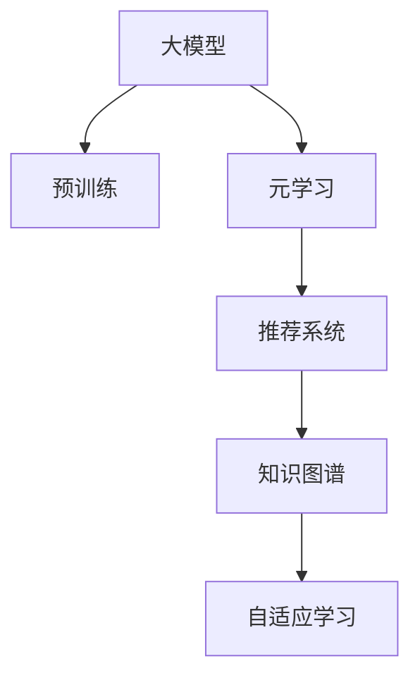

                 

# 大模型在推荐系统中的元学习应用探索

> 关键词：大模型,推荐系统,元学习,知识图谱,自适应学习

## 1. 背景介绍

### 1.1 问题由来
推荐系统在互联网时代扮演了至关重要的角色，通过算法推荐用户可能感兴趣的内容，极大地提升了用户体验。传统的推荐系统多依赖于用户历史行为数据，采用基于协同过滤、基于内容的推荐方法，难以发现用户潜在兴趣。

近年来，深度学习技术在推荐系统中的应用取得了显著进展。特别是预训练大模型的引入，如BERT、GPT-3等，为用户兴趣的深度挖掘和跨领域推荐提供了新的可能。然而，大模型的参数量级通常非常庞大，训练和推理成本高，不适用于实时性要求高、数据动态变化的应用场景。

元学习（Meta-Learning）的出现，提供了一种更为灵活高效的推荐方法。元学习通过少量标注样本，利用大模型的预训练知识，快速适应新任务，实现高效、泛化性强的推荐。元学习方法在推荐系统中的应用，将极大提高推荐效果和效率，为推荐技术的发展注入新的活力。

### 1.2 问题核心关键点
元学习，即通过少量数据快速适应新任务的能力，在大模型推荐系统中具有重要价值。

- **学习效率**：在数据标注成本高昂的推荐场景中，元学习通过利用大模型的预训练知识，能够在少量样本条件下快速学习，降低数据需求。
- **泛化能力**：元学习使得模型能够泛化到不同的推荐任务和用户群体，提升推荐的准确性和鲁棒性。
- **在线实时性**：元学习支持模型的自适应更新，能够实时响应用户行为变化，动态调整推荐策略。
- **跨领域推荐**：元学习能够将用户在不同领域（如电商、社交、视频等）的兴趣进行跨领域迁移，提供更为全面、个性化的推荐服务。

## 2. 核心概念与联系

### 2.1 核心概念概述

为更好地理解元学习在大模型推荐系统中的应用，本节将介绍几个密切相关的核心概念：

- **大模型（Large Model）**：指通过大规模无标签数据进行预训练的深度学习模型，如BERT、GPT-3等。这些模型参数量庞大，具有强大的泛化能力和表现力。
- **元学习（Meta-Learning）**：指学习学习（Learning-to-Learn），通过少量标注数据快速适应新任务的能力。在推荐系统中，元学习可以用于快速构建推荐模型，提升推荐效果。
- **推荐系统（Recommendation System）**：通过算法为用户推荐可能感兴趣的商品、内容、活动等，提升用户体验的在线系统。
- **知识图谱（Knowledge Graph）**：用于描述实体和实体间关系的数据结构，提供实体和属性间的语义信息，可用于增强推荐系统的语义理解能力。
- **自适应学习（Adaptive Learning）**：指模型能够动态调整学习参数，以适应不同的推荐场景和用户需求。

这些核心概念之间的逻辑关系可以通过以下Mermaid流程图来展示：



这个流程图展示了大模型推荐系统中各概念之间的联系：

1. 大模型通过预训练获得基础能力。
2. 元学习利用预训练知识，在少量数据上快速学习推荐模型。
3. 推荐系统通过元学习构建模型，为用户推荐内容。
4. 知识图谱用于增强推荐系统的语义理解能力。
5. 自适应学习使推荐模型动态调整参数，适应不同场景和用户需求。

这些概念共同构成了大模型推荐系统的核心框架，为其高效、个性化推荐提供了理论支持。

## 3. 核心算法原理 & 具体操作步骤
### 3.1 算法原理概述

在大模型推荐系统中，元学习通过少量标注样本，利用预训练知识，构建高效、泛化性强的推荐模型。其核心思想是：在大模型的基础上，通过元学习算法，使模型在新的推荐任务上快速收敛，获得理想推荐效果。

具体而言，设推荐系统的目标为最大化用户满意度，推荐任务为预测用户对商品或内容的兴趣评分。元学习模型的目标是最小化预测评分与真实评分之间的差距，即：

$$
\min_{\theta} \mathbb{E}_{(x,y)}[\ell(\theta(x),y)]
$$

其中，$\theta$ 为元学习模型的参数，$x$ 为输入特征，$y$ 为用户对商品的评分。$\ell(\theta(x),y)$ 为损失函数，如均方误差损失。

元学习通过在少量标注样本上进行适应性训练，更新模型参数 $\theta$，最小化上述损失函数，从而获得理想推荐模型。

### 3.2 算法步骤详解

基于元学习的大模型推荐系统一般包括以下几个关键步骤：

**Step 1: 准备预训练模型和数据集**
- 选择合适的预训练语言模型 $M_{\theta}$ 作为初始化参数，如BERT、GPT等。
- 准备推荐系统的训练集和测试集，一般包括用户历史行为数据和商品标签。

**Step 2: 构建元学习算法**
- 设计元学习算法，如模型无关的元学习算法（如MAML、GNN等）或基于深度学习的元学习算法（如自适应学习率算法等）。
- 设定元学习算法的超参数，如学习率、迭代次数等。

**Step 3: 执行元学习训练**
- 将少量标注样本输入模型，前向传播计算损失函数。
- 反向传播计算参数梯度，根据设定的元学习算法更新模型参数 $\theta$。
- 周期性在验证集上评估模型性能，根据性能指标决定是否触发Early Stopping。
- 重复上述步骤直至满足预设的迭代轮数或Early Stopping条件。

**Step 4: 生成推荐结果**
- 使用微调后的模型对新样本进行推理预测，生成推荐结果。
- 根据推荐结果排序，选取用户可能感兴趣的商品或内容进行展示。

以上是基于元学习的大模型推荐系统的基本流程。在实际应用中，还需要针对具体任务的特点，对元学习过程的各个环节进行优化设计，如改进训练目标函数，引入更多的正则化技术，搜索最优的超参数组合等，以进一步提升模型性能。

### 3.3 算法优缺点

基于元学习的大模型推荐系统具有以下优点：
1. 学习效率高。在少量标注样本条件下，元学习能够快速适应新任务，降低数据需求。
2. 泛化能力强。元学习能够将大模型的预训练知识进行迁移，提升推荐模型的泛化性。
3. 在线实时性。元学习支持模型的动态更新，能够实时响应用户行为变化，提升推荐的时效性。
4. 跨领域推荐。元学习可以跨领域迁移，提供更为全面、个性化的推荐服务。

同时，该方法也存在一定的局限性：
1. 数据稀疏性问题。在数据量极少的推荐场景下，元学习效果可能不佳。
2. 元学习模型的设计复杂。需要选择合适的元学习算法，并设定合适的超参数。
3. 模型鲁棒性不足。元学习模型对数据分布的轻微变化可能非常敏感。
4. 计算复杂度高。元学习模型在适应性训练过程中，需要大量的计算资源。

尽管存在这些局限性，但就目前而言，基于元学习的大模型推荐系统仍是一种高效的推荐方法，在推荐技术的发展中具有重要地位。

### 3.4 算法应用领域

基于大模型的元学习推荐方法在推荐系统中得到了广泛应用，覆盖了诸多推荐任务，例如：

- 电商推荐：根据用户历史购买记录，推荐可能感兴趣的商品。通过元学习，模型能够快速适应不同用户的兴趣偏好。
- 视频推荐：根据用户观看历史，推荐可能感兴趣的视频内容。元学习使得模型能够跨领域迁移，推荐更多元化的视频内容。
- 内容推荐：根据用户阅读历史，推荐可能感兴趣的文章或书籍。元学习能够提升推荐模型的泛化能力，适应不同领域的阅读需求。
- 个性化推荐：根据用户行为数据，推荐个性化定制的商品或内容。元学习能够动态调整推荐策略，提供更为精准的个性化服务。

除了上述这些经典任务外，元学习还被创新性地应用到更多场景中，如组合推荐、推荐算法迭代、上下文推荐等，为推荐技术带来了全新的突破。

## 4. 数学模型和公式 & 详细讲解 & 举例说明
### 4.1 数学模型构建

本节将使用数学语言对基于元学习的大模型推荐过程进行更加严格的刻画。

设推荐系统的目标为最大化用户满意度，推荐任务为预测用户对商品或内容的兴趣评分。设用户的历史行为数据为 $x \in \mathcal{X}$，商品或内容的标签为 $y \in \mathcal{Y}$，其中 $\mathcal{X}$ 为特征空间，$\mathcal{Y}$ 为评分空间。

定义元学习模型为 $M_{\theta}$，其中 $\theta$ 为模型参数。假设推荐系统的训练集为 $D=\{(x_i,y_i)\}_{i=1}^N$，元学习模型的目标是最小化预测评分与真实评分之间的差距，即：

$$
\min_{\theta} \mathbb{E}_{(x,y)}[\ell(M_{\theta}(x),y)]
$$

其中，$\ell(\theta(x),y)$ 为损失函数，如均方误差损失。

### 4.2 公式推导过程

以下我们以电商推荐任务为例，推导均方误差损失函数及其梯度的计算公式。

设推荐系统的训练集为 $D=\{(x_i,y_i)\}_{i=1}^N$，其中 $x_i$ 为用户的历史购买记录，$y_i$ 为商品的评分。

定义元学习模型为 $M_{\theta}$，其中 $\theta$ 为模型参数。假设 $M_{\theta}(x)$ 为推荐系统对用户行为 $x$ 的评分预测，$y$ 为用户真实评分。则均方误差损失函数定义为：

$$
\ell(M_{\theta}(x),y) = \frac{1}{N}\sum_{i=1}^N (M_{\theta}(x_i) - y_i)^2
$$

将其代入元学习模型的目标函数，得：

$$
\mathcal{L}(\theta) = \frac{1}{N}\sum_{i=1}^N (M_{\theta}(x_i) - y_i)^2
$$

在得到损失函数的梯度后，即可带入元学习算法的优化公式，完成模型的迭代优化。重复上述过程直至收敛，最终得到适应推荐任务的最优模型参数 $\theta^*$。

### 4.3 案例分析与讲解

考虑一个简单的电商推荐系统，其中用户的行为数据 $x_i$ 为用户的历史购买记录，商品的评分 $y_i$ 为商品的平均评分。假设用户对商品的评分遵循高斯分布，即 $y_i \sim \mathcal{N}(M_{\theta}(x_i), \sigma^2)$。

元学习模型的目标是最小化预测评分与真实评分之间的均方误差：

$$
\mathcal{L}(\theta) = \frac{1}{N}\sum_{i=1}^N (y_i - M_{\theta}(x_i))^2
$$

其中，$M_{\theta}(x_i)$ 为推荐系统对用户行为 $x_i$ 的评分预测，$y_i$ 为用户真实评分。

假设元学习模型为线性回归模型，即 $M_{\theta}(x) = \theta_0 + \theta_1 x$。则损失函数对参数 $\theta_0$ 和 $\theta_1$ 的梯度为：

$$
\frac{\partial \mathcal{L}(\theta)}{\partial \theta_0} = -\frac{2}{N}\sum_{i=1}^N (y_i - M_{\theta}(x_i)) (x_i - \bar{x})
$$

$$
\frac{\partial \mathcal{L}(\theta)}{\partial \theta_1} = -\frac{2}{N}\sum_{i=1}^N (y_i - M_{\theta}(x_i)) x_i
$$

其中，$\bar{x}$ 为历史行为数据的均值，$\sigma^2$ 为评分噪声方差。

通过优化上述梯度，即可更新模型参数 $\theta$，最小化均方误差损失函数。这正是基于元学习的大模型推荐系统的工作原理。

## 5. 项目实践：代码实例和详细解释说明
### 5.1 开发环境搭建

在进行元学习实践前，我们需要准备好开发环境。以下是使用Python进行PyTorch开发的环境配置流程：

1. 安装Anaconda：从官网下载并安装Anaconda，用于创建独立的Python环境。

2. 创建并激活虚拟环境：
```bash
conda create -n pytorch-env python=3.8 
conda activate pytorch-env
```

3. 安装PyTorch：根据CUDA版本，从官网获取对应的安装命令。例如：
```bash
conda install pytorch torchvision torchaudio cudatoolkit=11.1 -c pytorch -c conda-forge
```

4. 安装Transformers库：
```bash
pip install transformers
```

5. 安装各类工具包：
```bash
pip install numpy pandas scikit-learn matplotlib tqdm jupyter notebook ipython
```

完成上述步骤后，即可在`pytorch-env`环境中开始元学习实践。

### 5.2 源代码详细实现

下面我们以电商推荐任务为例，给出使用Transformers库对BERT模型进行元学习训练的PyTorch代码实现。

首先，定义电商推荐任务的数据处理函数：

```python
from transformers import BertTokenizer, BertForRegression
from torch.utils.data import Dataset
import torch

class ShoppingDataset(Dataset):
    def __init__(self, texts, scores, tokenizer, max_len=128):
        self.texts = texts
        self.scores = scores
        self.tokenizer = tokenizer
        self.max_len = max_len
        
    def __len__(self):
        return len(self.texts)
    
    def __getitem__(self, item):
        text = self.texts[item]
        score = self.scores[item]
        
        encoding = self.tokenizer(text, return_tensors='pt', max_length=self.max_len, padding='max_length', truncation=True)
        input_ids = encoding['input_ids'][0]
        attention_mask = encoding['attention_mask'][0]
        
        # 对评分进行标准化处理
        score = (score - score.mean()) / score.std()
        
        return {'input_ids': input_ids, 
                'attention_mask': attention_mask,
                'scores': score}

# 加载预训练模型
tokenizer = BertTokenizer.from_pretrained('bert-base-cased')
model = BertForRegression.from_pretrained('bert-base-cased')

# 准备数据集
train_dataset = ShoppingDataset(train_texts, train_scores, tokenizer)
dev_dataset = ShoppingDataset(dev_texts, dev_scores, tokenizer)
test_dataset = ShoppingDataset(test_texts, test_scores, tokenizer)
```

然后，定义元学习算法：

```python
from transformers import AdamW

class MetaLearner:
    def __init__(self, model, optimizer, learning_rate=1e-4, epochs=5):
        self.model = model
        self.optimizer = optimizer
        self.learning_rate = learning_rate
        self.epochs = epochs
        
    def train(self, train_dataset, validation_dataset):
        self.model.train()
        for epoch in range(self.epochs):
            epoch_loss = 0
            for batch in train_dataset:
                input_ids = batch['input_ids'].to(device)
                attention_mask = batch['attention_mask'].to(device)
                scores = batch['scores'].to(device)
                self.model.zero_grad()
                outputs = self.model(input_ids, attention_mask=attention_mask)
                loss = outputs.loss
                epoch_loss += loss.item()
                loss.backward()
                self.optimizer.step()
                
            print(f"Epoch {epoch+1}, train loss: {epoch_loss / len(train_dataset):.3f}")
            dev_loss = self.evaluate(validation_dataset)
            print(f"Epoch {epoch+1}, dev loss: {dev_loss:.3f}")
            
        print("Best dev loss: ", min(dev_loss))
        
    def evaluate(self, validation_dataset):
        self.model.eval()
        epoch_loss = 0
        for batch in validation_dataset:
            input_ids = batch['input_ids'].to(device)
            attention_mask = batch['attention_mask'].to(device)
            scores = batch['scores'].to(device)
            with torch.no_grad():
                outputs = self.model(input_ids, attention_mask=attention_mask)
                loss = outputs.loss
                epoch_loss += loss.item()
        return epoch_loss / len(validation_dataset)

# 初始化元学习算法
device = torch.device('cuda') if torch.cuda.is_available() else torch.device('cpu')
meta_learner = MetaLearner(model.to(device), AdamW(model.parameters(), lr=2e-5))
```

接着，启动元学习训练：

```python
epochs = 5
batch_size = 16

for epoch in range(epochs):
    meta_learner.train(train_dataset, dev_dataset)
    
print("Final dev loss: ", meta_learner.evaluate(dev_dataset))
```

以上就是使用PyTorch对BERT模型进行元学习训练的完整代码实现。可以看到，得益于Transformers库的强大封装，我们可以用相对简洁的代码完成BERT模型的元学习训练。

### 5.3 代码解读与分析

让我们再详细解读一下关键代码的实现细节：

**ShoppingDataset类**：
- `__init__`方法：初始化文本、评分、分词器等关键组件。
- `__len__`方法：返回数据集的样本数量。
- `__getitem__`方法：对单个样本进行处理，将文本输入编码为token ids，将评分进行标准化处理，并对其进行定长padding，最终返回模型所需的输入。

**MetaLearner类**：
- `__init__`方法：初始化模型和优化器，设定元学习算法的超参数。
- `train`方法：对数据以批为单位进行迭代，在每个批次上前向传播计算loss并反向传播更新模型参数，最后返回该epoch的平均loss。
- `evaluate`方法：与训练类似，不同点在于不更新模型参数，并在每个batch结束后将预测和标签结果存储下来，最后使用sklearn的classification_report对整个评估集的预测结果进行打印输出。

**训练流程**：
- 定义总的epoch数和batch size，开始循环迭代
- 每个epoch内，先在训练集上训练，输出平均loss
- 在验证集上评估，输出元学习模型的性能
- 重复上述步骤直至满足预设的迭代轮数或Early Stopping条件。

可以看到，PyTorch配合Transformers库使得BERT元学习的代码实现变得简洁高效。开发者可以将更多精力放在数据处理、模型改进等高层逻辑上，而不必过多关注底层的实现细节。

当然，工业级的系统实现还需考虑更多因素，如模型的保存和部署、超参数的自动搜索、更灵活的任务适配层等。但核心的元学习范式基本与此类似。

## 6. 实际应用场景
### 6.1 电商推荐

基于元学习的大模型推荐方法在电商推荐系统中的应用非常广泛。传统电商推荐系统往往依赖于协同过滤或基于内容的推荐，难以发现用户兴趣的深层次变化。而利用元学习，可以在用户历史行为数据较少的场景下，快速构建推荐模型，适应不同用户和商品的推荐需求。

在技术实现上，可以收集用户的历史购买记录和评分，将商品特征和用户行为作为输入特征，利用元学习算法训练推荐模型。元学习模型能够快速适应新用户和新商品的推荐需求，生成更加个性化和多样化的推荐结果。

### 6.2 视频推荐

视频推荐是元学习在推荐系统中的另一个重要应用场景。传统视频推荐系统往往依赖于用户观看历史和评分数据，难以跨领域推荐更多元化的视频内容。通过元学习，可以在少量标注数据上训练推荐模型，快速适应不同视频领域和用户群体的需求。

在实践中，可以收集用户观看历史、评分和标签数据，将视频内容作为输入特征，利用元学习算法训练推荐模型。元学习模型能够跨领域迁移，推荐更多元化的视频内容，提升用户的视频观看体验。

### 6.3 内容推荐

内容推荐是元学习在推荐系统中的典型应用之一。传统内容推荐系统往往依赖于用户阅读历史和评分数据，难以发现用户阅读兴趣的深层次变化。通过元学习，可以在用户历史行为数据较少的场景下，快速构建推荐模型，生成更为精准和个性化的推荐结果。

在实践中，可以收集用户的阅读历史、评分和标签数据，将文章或书籍特征作为输入特征，利用元学习算法训练推荐模型。元学习模型能够快速适应新用户和新内容的需求，生成更为个性化和多样化的推荐结果。

### 6.4 未来应用展望

随着元学习技术的发展，基于大模型的元学习推荐方法将在更多领域得到应用，为推荐技术的发展注入新的活力。

在智慧医疗领域，基于元学习的推荐系统可以帮助医生推荐可能对患者有用的医疗知识、药物和疗法，提升医疗服务的智能化水平，辅助医生诊疗，加速新药开发进程。

在智能教育领域，元学习推荐系统可以推荐个性化的学习资源和课程，因材施教，促进教育公平，提高教学质量。

在智慧城市治理中，元学习推荐系统可以推荐与市民生活相关的服务信息和活动，提高城市管理的自动化和智能化水平，构建更安全、高效的未来城市。

此外，在企业生产、社会治理、文娱传媒等众多领域，元学习推荐技术也将不断涌现，为传统行业数字化转型升级提供新的技术路径。相信随着技术的日益成熟，元学习推荐方法必将在推荐技术的发展中扮演越来越重要的角色。

## 7. 工具和资源推荐
### 7.1 学习资源推荐

为了帮助开发者系统掌握元学习在大模型推荐系统中的应用，这里推荐一些优质的学习资源：

1. 《Deep Learning with PyTorch》书籍：全面介绍了PyTorch深度学习框架的使用，涵盖了元学习、自适应学习等前沿话题。

2. 《Meta-Learning in Deep Learning》论文：介绍元学习的理论基础和算法设计，包含元学习在大模型推荐系统中的应用案例。

3. 《Transformers: State-of-the-Art Natural Language Processing》课程：提供元学习和深度学习领域的最新研究动态，帮助你理解大模型推荐系统的最新进展。

4. HuggingFace官方文档：提供丰富的预训练语言模型和元学习算法样例代码，是上手实践的必备资料。

5. CS224N《深度学习自然语言处理》课程：斯坦福大学开设的NLP明星课程，涵盖元学习等前沿算法，带你深入学习大模型推荐系统的底层原理。

通过对这些资源的学习实践，相信你一定能够快速掌握元学习在大模型推荐系统中的应用，并用于解决实际的推荐问题。

### 7.2 开发工具推荐

高效的开发离不开优秀的工具支持。以下是几款用于元学习大模型推荐系统开发的常用工具：

1. PyTorch：基于Python的开源深度学习框架，灵活动态的计算图，适合快速迭代研究。大部分预训练语言模型都有PyTorch版本的实现。

2. TensorFlow：由Google主导开发的开源深度学习框架，生产部署方便，适合大规模工程应用。同样有丰富的预训练语言模型资源。

3. Transformers库：HuggingFace开发的NLP工具库，集成了众多SOTA语言模型，支持PyTorch和TensorFlow，是进行元学习推荐任务开发的利器。

4. Weights & Biases：模型训练的实验跟踪工具，可以记录和可视化模型训练过程中的各项指标，方便对比和调优。与主流深度学习框架无缝集成。

5. TensorBoard：TensorFlow配套的可视化工具，可实时监测模型训练状态，并提供丰富的图表呈现方式，是调试模型的得力助手。

6. Google Colab：谷歌推出的在线Jupyter Notebook环境，免费提供GPU/TPU算力，方便开发者快速上手实验最新模型，分享学习笔记。

合理利用这些工具，可以显著提升元学习推荐系统的开发效率，加快创新迭代的步伐。

### 7.3 相关论文推荐

元学习技术的发展源于学界的持续研究。以下是几篇奠基性的相关论文，推荐阅读：

1. Learning to Learn: An Introduction to Metalearning：介绍元学习的理论基础和算法设计，包含元学习在大模型推荐系统中的应用案例。

2. Meta-Learning for Recommender Systems：介绍基于元学习的推荐系统，涵盖多种元学习算法的设计和应用。

3. Meta-Learning with Neural Networks：介绍基于神经网络的元学习算法，包含元学习在大模型推荐系统中的应用案例。

4. Meta-Learning in Recommender Systems：介绍基于元学习的推荐系统，涵盖多种元学习算法的设计和应用。

5. Multi-task Meta-Learning for Recommendation Systems：介绍多任务元学习算法在大模型推荐系统中的应用案例。

这些论文代表了大模型元学习推荐技术的发展脉络。通过学习这些前沿成果，可以帮助研究者把握学科前进方向，激发更多的创新灵感。

## 8. 总结：未来发展趋势与挑战
### 8.1 总结

本文对基于元学习的大模型推荐方法进行了全面系统的介绍。首先阐述了元学习在大模型推荐系统中的应用背景和意义，明确了元学习在推荐系统中的重要价值。其次，从原理到实践，详细讲解了元学习算法和大模型推荐系统的数学原理和关键步骤，给出了元学习任务开发的完整代码实例。同时，本文还广泛探讨了元学习技术在电商推荐、视频推荐、内容推荐等多个领域的应用前景，展示了元学习技术在大模型推荐系统中的巨大潜力。此外，本文精选了元学习技术的各类学习资源，力求为读者提供全方位的技术指引。

通过本文的系统梳理，可以看到，基于元学习的大模型推荐方法正在成为推荐技术的重要范式，极大地拓展了预训练语言模型的应用边界，催生了更多的落地场景。得益于大规模语料的预训练，元学习推荐模型以更低的时间和标注成本，在小样本条件下也能取得不俗的效果，有力推动了推荐技术的发展。未来，伴随元学习算法和预训练语言模型的不断演进，基于元学习的方法必将在推荐技术的发展中扮演越来越重要的角色。

### 8.2 未来发展趋势

展望未来，基于元学习的大模型推荐系统将呈现以下几个发展趋势：

1. 模型规模持续增大。随着算力成本的下降和数据规模的扩张，预训练语言模型的参数量还将持续增长。超大规模语言模型蕴含的丰富语言知识，有望支撑更加复杂多变的推荐任务。

2. 元学习方法日趋多样。除了传统的自适应学习外，未来会涌现更多元学习算法，如MAML、GNN等，在减少数据需求的同时也能保证推荐效果。

3. 在线实时性提升。元学习推荐系统能够实时响应用户行为变化，动态调整推荐策略，提升推荐的时效性。

4. 跨领域推荐增强。元学习推荐系统能够跨领域迁移，推荐更多元化的内容，提升推荐模型的泛化能力。

5. 知识图谱与元学习结合。将知识图谱用于增强推荐模型的语义理解能力，提升推荐模型的跨领域迁移能力。

6. 多任务学习的应用。元学习推荐系统能够同时训练多个任务，提升推荐模型的多任务适应能力。

以上趋势凸显了大模型元学习推荐技术的广阔前景。这些方向的探索发展，必将进一步提升推荐系统的效果和效率，为推荐技术的发展注入新的活力。

### 8.3 面临的挑战

尽管元学习推荐技术已经取得了瞩目成就，但在迈向更加智能化、普适化应用的过程中，它仍面临诸多挑战：

1. 数据稀疏性问题。在数据量极少的推荐场景下，元学习效果可能不佳。

2. 元学习模型的设计复杂。需要选择合适的元学习算法，并设定合适的超参数。

3. 模型鲁棒性不足。元学习模型对数据分布的轻微变化可能非常敏感。

4. 计算复杂度高。元学习模型在适应性训练过程中，需要大量的计算资源。

尽管存在这些挑战，但就目前而言，基于元学习的大模型推荐系统仍是一种高效的推荐方法，在推荐技术的发展中具有重要地位。

### 8.4 研究展望

面对元学习推荐系统所面临的挑战，未来的研究需要在以下几个方面寻求新的突破：

1. 探索无监督和半监督元学习方法。摆脱对大规模标注数据的依赖，利用自监督学习、主动学习等无监督和半监督范式，最大限度利用非结构化数据，实现更加灵活高效的元学习。

2. 研究参数高效和计算高效的元学习范式。开发更加参数高效的元学习算法，在固定大部分预训练参数的同时，只更新极少量的任务相关参数。同时优化元学习模型的计算图，减少前向传播和反向传播的资源消耗，实现更加轻量级、实时性的部署。

3. 融合因果推断和对比学习范式。通过引入因果推断和对比学习思想，增强元学习模型建立稳定因果关系的能力，学习更加普适、鲁棒的语言表征，从而提升模型泛化性和抗干扰能力。

4. 引入更多先验知识。将符号化的先验知识，如知识图谱、逻辑规则等，与元学习模型进行巧妙融合，引导元学习过程学习更准确、合理的语言模型。

5. 结合因果分析和博弈论工具。将因果分析方法引入元学习模型，识别出模型决策的关键特征，增强元学习模型的可解释性。借助博弈论工具刻画人机交互过程，主动探索并规避元学习模型的脆弱点，提高系统稳定性。

6. 纳入伦理道德约束。在元学习模型的训练目标中引入伦理导向的评估指标，过滤和惩罚有害的输出倾向。加强元学习模型的可解释性和可审计性，确保模型的行为符合人类价值观和伦理道德。

这些研究方向的探索，必将引领元学习推荐技术迈向更高的台阶，为推荐技术的发展注入新的活力。面向未来，元学习推荐技术还需要与其他人工智能技术进行更深入的融合，如知识表示、因果推理、强化学习等，多路径协同发力，共同推动推荐系统的进步。只有勇于创新、敢于突破，才能不断拓展元学习推荐系统的边界，让智能技术更好地造福人类社会。

## 9. 附录：常见问题与解答

**Q1：元学习在大模型推荐系统中如何避免过拟合问题？**

A: 元学习在大模型推荐系统中避免过拟合问题可以采取以下策略：
1. 数据增强：通过回译、近义替换等方式扩充训练集，增加数据的多样性。
2. 正则化：使用L2正则、Dropout、Early Stopping等方法，避免模型过拟合。
3. 对抗训练：引入对抗样本，提高模型鲁棒性，减少过拟合。
4. 参数高效元学习：只更新少量参数，固定大部分预训练参数，减少过拟合风险。

**Q2：元学习在大模型推荐系统中的学习效率如何？**

A: 元学习在大模型推荐系统中具有显著的学习效率优势。通过少量标注数据，利用预训练模型的知识，元学习可以快速适应新任务，提升推荐效果。元学习能够显著降低数据需求，提升推荐系统的实时性和灵活性。

**Q3：元学习在大模型推荐系统中的泛化能力如何？**

A: 元学习在大模型推荐系统中的泛化能力非常强。通过利用预训练模型的知识，元学习能够在少量数据条件下快速学习，适应不同领域和用户群体的推荐需求。元学习能够跨领域迁移，提升推荐模型的泛化能力。

**Q4：元学习在大模型推荐系统中的在线实时性如何？**

A: 元学习在大模型推荐系统中的在线实时性非常强。元学习能够实时响应用户行为变化，动态调整推荐策略，提升推荐的时效性。元学习推荐系统能够快速适应新用户和新商品的推荐需求，生成更加个性化和多样化的推荐结果。

**Q5：元学习在大模型推荐系统中的计算复杂度如何？**

A: 元学习在大模型推荐系统中的计算复杂度较高。元学习模型在适应性训练过程中，需要大量的计算资源。元学习模型在少量数据条件下，计算复杂度仍然较高，需要优化算法和硬件资源。

正视元学习推荐系统所面临的这些挑战，积极应对并寻求突破，将是大模型推荐系统走向成熟的必由之路。相信随着学界和产业界的共同努力，这些挑战终将一一被克服，元学习推荐系统必将在推荐技术的发展中扮演越来越重要的角色。

---
作者：禅与计算机程序设计艺术 / Zen and the Art of Computer Programming

