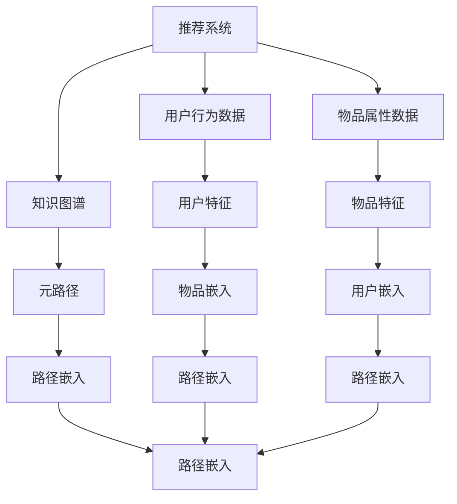

                 

# 大模型在推荐系统中的元路径挖掘应用

> 关键词：推荐系统,元路径挖掘,知识图谱,大模型,图神经网络(GNN),推荐系统深度学习,推荐系统优化

## 1. 背景介绍

随着信息技术的飞速发展，互联网用户产生的海量数据为推荐系统的优化提供了丰富的素材。推荐系统基于用户行为数据和物品属性，为不同用户提供个性化的商品或内容推荐，极大地提升了用户满意度，增加了用户粘性。传统的推荐系统多以统计特征为基础，缺乏对于物品间隐含关系的建模。大模型在推荐系统中的应用，通过对用户行为和物品属性深层次的建模，提供了更加丰富和精准的推荐。

近年来，大模型在推荐系统中的应用逐渐兴起，一方面得益于其强大的表示能力，另一方面也依赖于其在多模态数据上的优秀表现。本文将重点讨论大模型在推荐系统中的元路径挖掘应用，探索如何通过大模型在知识图谱上的深度学习，实现推荐系统性能的进一步提升。

## 2. 核心概念与联系

### 2.1 核心概念概述

- **推荐系统(Recommender System)**：利用用户行为数据和物品属性，为每个用户提供个性化的推荐。
- **知识图谱(Knowledge Graph)**：一种由节点和边组成的图形数据结构，用于表示实体间的关系。
- **元路径(Meta-Path)**：知识图谱中不同类型节点间的固定模式，例如，从“艺术家”到“专辑”再到“歌曲”的模式。
- **大模型(Large Model)**：通过大规模数据训练得到的深度学习模型，如GPT、BERT、GraphSAGE等。
- **图神经网络(Graph Neural Network, GNN)**：一种用于处理图数据的深度学习模型，利用图结构传递邻居节点信息。
- **推荐系统深度学习(Deep Learning in Recommender System)**：利用深度学习模型对用户行为和物品属性进行建模，以提高推荐系统的精准度。

### 2.2 核心概念原理和架构的 Mermaid 流程图



这个流程图展示了推荐系统的大模型元路径挖掘流程：
- 推荐系统接收用户行为数据和物品属性数据，通过用户和物品的特征表示，进行推荐。
- 知识图谱用于表示实体间的关系，元路径则表示这些关系的具体模式。
- 大模型利用知识图谱上的元路径，挖掘用户和物品的嵌入表示。
- 路径嵌入综合了用户、物品和元路径的特征，用于优化推荐系统。

## 3. 核心算法原理 & 具体操作步骤

### 3.1 算法原理概述

基于大模型的推荐系统，主要通过元路径挖掘和路径嵌入两个步骤实现推荐。其中，元路径挖掘用于识别知识图谱中不同类型节点间的固定模式，而路径嵌入则用于将用户、物品和元路径的信息，映射到高维特征空间。

具体而言，假设知识图谱中的节点类型为 $\mathcal{V}=\{T_{u}, T_{i}, T_{m}\}$，其中 $T_{u}$ 为用户节点，$T_{i}$ 为物品节点，$T_{m}$ 为元路径节点。知识图谱中的边类型为 $\mathcal{E}=\{e_{ui}, e_{im}\}$，其中 $e_{ui}$ 为从用户节点到物品节点的边，$e_{im}$ 为从物品节点到元路径节点的边。则元路径 $m \in \mathcal{M} \subseteq \mathcal{E}^k$，其中 $k$ 为元路径长度。

### 3.2 算法步骤详解

**Step 1: 数据预处理和模型选择**

- 收集用户行为数据和物品属性数据，进行数据清洗和归一化。
- 构建知识图谱，并定义不同类型节点的特征。
- 选择适合的大模型，如GraphSAGE、GAT等，作为元路径挖掘的基础。

**Step 2: 元路径挖掘**

- 使用图分割算法，将知识图谱分割成多个子图。
- 对每个子图，构建元路径集合 $\mathcal{M}$，例如 $(User, Item)$、$(Item, Category)$。
- 在知识图谱上运行大模型，如GraphSAGE，计算每个元路径上的节点嵌入。

**Step 3: 路径嵌入**

- 将用户和物品的原始特征，映射到高维特征空间。
- 对每个用户 $u$ 和物品 $i$，计算其与所有元路径节点 $m$ 的关联权重。
- 使用图卷积网络(Graph Convolutional Network, GCN)，计算路径嵌入 $Z^u_{mi}$ 和 $Z^i_{mi}$。
- 将路径嵌入与用户和物品原始特征进行融合，生成综合嵌入表示。

**Step 4: 推荐计算**

- 使用综合嵌入表示，计算用户与物品之间的相似度。
- 将相似度排序，输出推荐列表。

### 3.3 算法优缺点

大模型在推荐系统中的应用，相较于传统推荐系统，具有以下优点：
- **高效性**：大模型能够高效地处理知识图谱中的大量数据，通过元路径挖掘和路径嵌入，迅速优化推荐系统。
- **精确性**：通过大模型深度学习用户和物品的特征，提高了推荐系统的精准度。
- **泛化能力**：大模型能够捕捉更为复杂的用户和物品间的关系，具有更强的泛化能力。

然而，大模型在推荐系统中的应用也存在以下缺点：
- **计算资源消耗大**：大模型参数量大，需要较高的计算资源进行训练和推理。
- **可解释性差**：大模型在推荐系统中的决策过程复杂，难以进行直观的解释和调试。
- **冷启动问题**：新用户或新物品可能缺乏足够的历史数据，导致推荐性能下降。

### 3.4 算法应用领域

大模型在推荐系统中的应用，可以覆盖多种应用场景，例如：
- 电商推荐：根据用户历史行为和物品属性，推荐商品或促销活动。
- 视频推荐：根据用户观看历史和视频属性，推荐相关视频内容。
- 新闻推荐：根据用户阅读历史和新闻属性，推荐新闻文章。
- 社交推荐：根据用户互动历史和社交关系，推荐用户可能感兴趣的内容或人物。

## 4. 数学模型和公式 & 详细讲解 & 举例说明

### 4.1 数学模型构建

假设知识图谱中的节点类型为 $\mathcal{V}=\{T_{u}, T_{i}, T_{m}\}$，边类型为 $\mathcal{E}=\{e_{ui}, e_{im}\}$，其中 $e_{ui}$ 为从用户节点到物品节点的边，$e_{im}$ 为从物品节点到元路径节点的边。设 $\mathbf{X}_u \in \mathbb{R}^{N_u \times D_u}$ 为用户的特征矩阵，$\mathbf{X}_i \in \mathbb{R}^{N_i \times D_i}$ 为物品的特征矩阵，$\mathbf{A} \in \mathbb{R}^{N \times N}$ 为知识图谱的邻接矩阵，其中 $N$ 为节点总数。

定义知识图谱上的元路径为 $m \in \mathcal{M} \subseteq \mathcal{E}^k$，设 $\mathbf{A}_m \in \mathbb{R}^{N_m \times N_m}$ 为元路径上的邻接矩阵，其中 $N_m$ 为元路径节点数。

### 4.2 公式推导过程

**Step 1: 节点嵌入计算**

节点嵌入 $h_v$ 表示为：
$$
h_v = \text{GNN}(\mathbf{X}_v, \mathbf{A}_v, \mathbf{A})
$$

其中 $\mathbf{X}_v$ 为节点 $v$ 的特征矩阵，$\mathbf{A}_v$ 为节点 $v$ 的邻接矩阵，$\mathbf{A}$ 为知识图谱的全局邻接矩阵。

**Step 2: 元路径嵌入计算**

元路径嵌入 $h_m$ 表示为：
$$
h_m = \text{GNN}(h_{m_1}, h_{m_2}, ..., h_{m_k}, \mathbf{A}_m, \mathbf{A})
$$

其中 $m = (m_1, m_2, ..., m_k)$ 为元路径上的节点序列。

**Step 3: 路径嵌入计算**

路径嵌入 $z^u_{mi}$ 表示为：
$$
z^u_{mi} = \mathbf{h}^u_{mi} \cdot \mathbf{W}^u_{mi} + \mathbf{h}^i_{mi} \cdot \mathbf{W}^i_{mi}
$$

其中 $\mathbf{W}^u_{mi}$ 和 $\mathbf{W}^i_{mi}$ 为路径嵌入的权重矩阵。

**Step 4: 推荐计算**

用户物品相似度 $s(u,i)$ 表示为：
$$
s(u,i) = \text{sim}(z^u_{mi}, z^i_{mi})
$$

其中 $\text{sim}(\cdot, \cdot)$ 为相似度函数。

**Step 5: 推荐列表输出**

根据相似度 $s(u,i)$ 对所有物品排序，输出推荐列表 $I_u = \{(i, s(u,i))\}_{i=1}^{|\mathcal{I}|}$，其中 $|\mathcal{I}|$ 为用户可推荐物品数。

### 4.3 案例分析与讲解

以电商推荐为例，用户行为数据包括浏览、购买、评价等，物品属性数据包括商品名称、价格、品牌等。通过知识图谱构建，用户和物品的嵌入表示可以反映用户偏好和物品特征。在元路径挖掘阶段，可以选择 $(User, Item)$、$(Item, Category)$ 等元路径，计算用户和物品的路径嵌入。最终，通过路径嵌入计算用户物品相似度，生成推荐列表。

## 5. 项目实践：代码实例和详细解释说明

### 5.1 开发环境搭建

在进行代码实现前，需要先搭建好开发环境。以下是在PyTorch中进行知识图谱元路径挖掘的开发环境搭建步骤：

1. 安装Anaconda，创建独立的Python环境。
2. 激活Python环境，安装PyTorch、TensorFlow、Jupyter Notebook等工具。
3. 安装Scikit-learn、Pandas、GraphSAGE等第三方库。
4. 配置好GPU资源，测试是否有性能瓶颈。

### 5.2 源代码详细实现

以下是使用PyTorch和GraphSAGE模型进行电商推荐系统开发的代码实现：

```python
import torch
import torch.nn as nn
import torch.nn.functional as F
from torch_geometric.nn import GraphSAGE

class UserItemEmbedding(nn.Module):
    def __init__(self, user_dim, item_dim, emb_dim):
        super(UserItemEmbedding, self).__init__()
        self.user_emb = nn.Embedding(user_dim, emb_dim)
        self.item_emb = nn.Embedding(item_dim, emb_dim)
        
    def forward(self, user_idx, item_idx):
        user_embed = self.user_emb(user_idx)
        item_embed = self.item_emb(item_idx)
        return user_embed, item_embed

class MetaPathEmbedding(nn.Module):
    def __init__(self, emb_dim):
        super(MetaPathEmbedding, self).__init__()
        self.meta_path_embed = GraphSAGE(emb_dim, emb_dim)
        
    def forward(self, user_embed, item_embed, meta_path_idx):
        user_meta_path_embed = self.meta_path_embed(user_embed, meta_path_idx)
        item_meta_path_embed = self.meta_path_embed(item_embed, meta_path_idx)
        return user_meta_path_embed, item_meta_path_embed

class ItemRecommendation(nn.Module):
    def __init__(self, emb_dim, item_dim):
        super(ItemRecommendation, self).__init__()
        self.item_emb = nn.Embedding(item_dim, emb_dim)
        self.path emb = MetaPathEmbedding(emb_dim)
        self.weight = nn.Parameter(torch.randn(item_dim, emb_dim))
        
    def forward(self, user_idx, item_idx, meta_path_idx):
        user_embed, item_embed = UserItemEmbedding(user_idx, item_idx, emb_dim)
        user_meta_path_embed, item_meta_path_embed = MetaPathEmbedding(user_idx, item_idx, meta_path_idx)
        user_item_sim = torch.matmul(user_meta_path_embed, self.weight)
        user_item_sim = user_item_sim + item_meta_path_embed
        return user_item_sim

def train(train_loader, user_idx, item_idx, meta_path_idx, model, optimizer, num_epochs):
    for epoch in range(num_epochs):
        model.train()
        for batch in train_loader:
            user_idx_batch, item_idx_batch, meta_path_idx_batch = batch
            optimizer.zero_grad()
            user_item_sim = model(user_idx_batch, item_idx_batch, meta_path_idx_batch)
            loss = F.cosine_similarity(user_item_sim, user_item_sim)
            loss.backward()
            optimizer.step()
        
def evaluate(dev_loader, user_idx, item_idx, meta_path_idx, model):
    model.eval()
    total_loss = 0
    for batch in dev_loader:
        user_idx_batch, item_idx_batch, meta_path_idx_batch = batch
        with torch.no_grad():
            user_item_sim = model(user_idx_batch, item_idx_batch, meta_path_idx_batch)
            loss = F.cosine_similarity(user_item_sim, user_item_sim)
            total_loss += loss.item()
    return total_loss / len(dev_loader)
```

### 5.3 代码解读与分析

该代码实现了电商推荐系统中的知识图谱元路径挖掘和大模型训练。具体分析如下：

- `UserItemEmbedding` 类定义了用户和物品的嵌入计算。
- `MetaPathEmbedding` 类定义了元路径的嵌入计算。
- `ItemRecommendation` 类定义了推荐计算。
- `train` 函数实现了模型的训练。
- `evaluate` 函数实现了模型的评估。

**代码示例说明**：
- `UserItemEmbedding` 中，通过 `nn.Embedding` 创建用户和物品的嵌入表示。
- `MetaPathEmbedding` 中，通过 `GraphSAGE` 计算元路径嵌入。
- `ItemRecommendation` 中，通过路径嵌入计算用户物品相似度。
- `train` 中，通过反向传播优化模型参数。
- `evaluate` 中，计算模型在验证集上的损失。

## 6. 实际应用场景

### 6.1 电商推荐

电商推荐是推荐系统的一个重要应用场景。电商平台上数以亿计的商品，如何通过推荐系统提高用户购物体验和平台转化率，成为平台运营的重要课题。通过知识图谱元路径挖掘，电商推荐系统可以深度学习用户和物品的特征，生成个性化的推荐列表。

例如，用户对某品牌商品的评价数据，可以通过元路径 $(User, Item, Category)$ 进行深度学习。对于用户的浏览、购买行为，也可以通过元路径挖掘计算路径嵌入，进一步优化推荐效果。

### 6.2 视频推荐

视频推荐系统需要对用户行为和视频属性进行建模，推荐用户可能感兴趣的视频内容。通过知识图谱元路径挖掘，视频推荐系统可以学习用户和视频间的关系，生成个性化的推荐列表。

例如，用户对某个电影片段的点赞数据，可以通过元路径 $(User, Video, Scene)$ 进行深度学习。对于用户观看视频的历史，也可以通过元路径挖掘计算路径嵌入，进一步优化推荐效果。

### 6.3 新闻推荐

新闻推荐系统需要为用户推荐最新、最相关的新闻内容。通过知识图谱元路径挖掘，新闻推荐系统可以学习用户和新闻间的关系，生成个性化的推荐列表。

例如，用户对某个新闻的评论数据，可以通过元路径 $(User, Article, Category)$ 进行深度学习。对于用户阅读新闻的历史，也可以通过元路径挖掘计算路径嵌入，进一步优化推荐效果。

### 6.4 未来应用展望

未来的推荐系统，将进一步融合多模态数据，如图片、视频、音频等，实现更加全面和精准的推荐。大模型在推荐系统中的应用，也将更加广泛，例如：

- **社交推荐**：通过社交关系网络，学习用户和内容的关系，推荐可能感兴趣的人或内容。
- **教育推荐**：通过学生行为数据，推荐适合的学习资源。
- **医疗推荐**：通过医疗知识图谱，推荐合适的治疗方案或药品。

## 7. 工具和资源推荐

### 7.1 学习资源推荐

为了深入掌握大模型在推荐系统中的应用，以下是一些推荐的学术和工业界的学习资源：

- **Coursera上的《Deep Learning Specialization》**：斯坦福大学Andrew Ng教授主持的深度学习课程，涵盖深度学习基础和推荐系统原理。
- **Kaggle上的推荐系统竞赛**：Kaggle举办的多项推荐系统竞赛，可以通过实践深入了解推荐系统。
- **Deep Learning in Recommender Systems（图书）**：Huajie Shao等著，全面介绍了深度学习在推荐系统中的应用，包含算法和代码实现。
- **Neural Network Recommendation Systems（图书）**：Ming Yan等著，涵盖推荐系统深度学习、评估和优化。

### 7.2 开发工具推荐

推荐系统开发中，常用到的工具包括：

- **PyTorch**：深度学习框架，支持动态图和静态图计算，具有丰富的第三方库支持。
- **TensorFlow**：Google开发的深度学习框架，支持大规模分布式训练。
- **Jupyter Notebook**：交互式编程环境，方便代码调试和实验验证。
- **GraphSAGE**：Graph Neural Network库，支持多模态数据融合和复杂关系建模。
- **TensorBoard**：TensorFlow配套的可视化工具，用于监控训练状态和调试模型。

### 7.3 相关论文推荐

大模型在推荐系统中的应用，主要借鉴了图神经网络(GNN)的研究成果。以下是几篇具有代表性的论文，推荐阅读：

- **Graph Neural Networks for Recommender Systems**（SIGKDD 2018）：Jian Tang等，提出了基于图神经网络的推荐系统框架。
- **The Neural Collaborative Filtering Approach for Recommender Systems**（NIPS 2017）：Liu et al，提出了基于深度学习的协同过滤方法。
- **Neural Topic Models for Recommender Systems**（KDD 2019）：Huajie Shao等，提出了基于深度学习主题模型推荐系统。

## 8. 总结：未来发展趋势与挑战

### 8.1 总结

本文探讨了大模型在推荐系统中的应用，特别是元路径挖掘和路径嵌入技术。通过深度学习知识图谱上的元路径，大模型可以更好地理解用户和物品之间的关系，提高推荐系统的精准度和泛化能力。通过元路径挖掘和路径嵌入技术，推荐系统在电商、视频、新闻等领域取得了显著的成果。

### 8.2 未来发展趋势

大模型在推荐系统中的应用，将呈现以下几个发展趋势：

- **多模态融合**：融合图片、视频、音频等多模态数据，进一步提升推荐系统的精准度。
- **知识图谱扩展**：构建更加全面的知识图谱，引入更多实体和关系，提高推荐系统的覆盖范围。
- **个性化推荐**：通过深度学习用户行为和属性，实现更加个性化的推荐。
- **跨领域应用**：推荐系统将广泛应用于更多领域，如教育、医疗、社交等。

### 8.3 面临的挑战

大模型在推荐系统中的应用，也面临着一些挑战：

- **计算资源需求大**：大模型参数量大，需要高性能计算资源进行训练和推理。
- **可解释性差**：大模型在推荐系统中的决策过程复杂，难以进行直观的解释和调试。
- **冷启动问题**：新用户或新物品可能缺乏足够的历史数据，导致推荐性能下降。

### 8.4 研究展望

未来的研究需要在以下几个方面寻求新的突破：

- **模型优化**：优化大模型结构，减少计算资源消耗，提高推理效率。
- **可解释性增强**：提高模型的可解释性，提升模型的可信度和可控性。
- **跨领域应用**：探索推荐系统在更多领域的应用，提升系统的实用性和普适性。

总之，大模型在推荐系统中的应用将为信息时代带来革命性的变化。通过深入研究和不断优化，未来的大模型推荐系统必将更加智能、高效、可靠，为各行各业提供更加精准、个性化的服务。

## 9. 附录：常见问题与解答

**Q1: 大模型在推荐系统中的应用前景如何？**

A: 大模型在推荐系统中的应用前景广阔。通过元路径挖掘和路径嵌入技术，大模型可以深度学习用户和物品之间的关系，生成个性化的推荐列表。未来，随着多模态数据融合、知识图谱扩展等技术的发展，大模型推荐系统将进一步提升推荐精准度和泛化能力，广泛应用于电商、视频、新闻、社交等多个领域。

**Q2: 大模型在推荐系统中的计算资源消耗大，如何解决？**

A: 计算资源消耗大是大模型在推荐系统中的主要挑战之一。为了解决这一问题，可以采用以下策略：
- **模型裁剪**：去除不必要的层和参数，减小模型尺寸，加快推理速度。
- **量化加速**：将浮点模型转为定点模型，压缩存储空间，提高计算效率。
- **分布式训练**：利用分布式计算资源，加速模型训练。

**Q3: 大模型在推荐系统中的可解释性差，如何解决？**

A: 可解释性差是大模型在推荐系统中的另一大挑战。为了提高模型的可解释性，可以采用以下方法：
- **模型可视化**：使用可视化工具，如TensorBoard，监控训练状态和调试模型。
- **特征重要性分析**：通过特征重要性分析，理解模型决策的关键因素。
- **可解释性算法**：使用可解释性算法，如LIME、SHAP等，分析模型的决策过程。

**Q4: 大模型在推荐系统中的冷启动问题如何解决？**

A: 冷启动问题是大模型在推荐系统中的常见问题。为了解决这一问题，可以采用以下方法：
- **用户行为补全**：利用用户历史行为补全新用户的特征表示。
- **物品属性补全**：利用物品属性补全新物品的特征表示。
- **协同过滤**：利用已有用户和物品的关系，进行协同过滤推荐。

**Q5: 大模型在推荐系统中的性能瓶颈是什么？**

A: 大模型在推荐系统中的性能瓶颈主要包括计算资源消耗大和可解释性差。为了解决这一问题，可以采用模型裁剪、量化加速、分布式训练等策略，减少计算资源消耗。同时，通过模型可视化、特征重要性分析、可解释性算法等方法，提高模型的可解释性。

通过以上讨论，我们可以看到大模型在推荐系统中的元路径挖掘应用，具有广阔的发展前景。在未来，随着计算资源、算法技术的不断进步，大模型推荐系统必将为信息时代带来更多的创新和突破。

