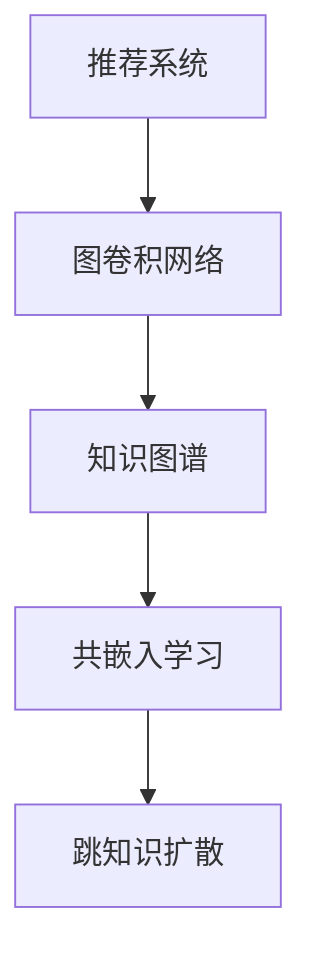

                 

# 大模型在推荐系统中的图卷积网络应用

> 关键词：大模型，图卷积网络(GCN)，推荐系统，知识图谱，邻接矩阵，跳知识扩散，共嵌入学习

## 1. 背景介绍

随着互联网信息量的爆炸式增长，推荐系统成为连接用户和内容的重要桥梁。推荐系统通过对用户兴趣和行为数据的分析，精准地为用户推荐感兴趣的内容，极大地提升了用户体验和网站活跃度。

传统的推荐算法包括基于协同过滤、矩阵分解、深度学习等方法。协同过滤算法利用用户行为相似性推荐，但由于数据稀疏，推荐效果受限于用户行为数据。矩阵分解算法通过用户与物品之间的隐式评分预测用户评分，但难以捕捉高阶用户行为信息。深度学习方法通过构建复杂神经网络结构，能够从大规模数据中提取高层次特征，但模型复杂度高，计算资源消耗大。

为了应对这些挑战，一种新兴的推荐方法——基于图卷积网络的推荐系统应运而生。GCN利用图的结构信息，结合深度学习特征提取能力，可以更全面地分析用户行为和内容关系，从而生成更精准的推荐结果。大模型的引入，则进一步提升了GCN的性能，使其在大规模数据上也能取得优异效果。

## 2. 核心概念与联系

### 2.1 核心概念概述

为更好地理解大模型在推荐系统中的应用，本节将介绍几个密切相关的核心概念：

- 推荐系统(Recommender System)：通过分析用户行为和内容特征，为每个用户推荐最适合其需求的内容，提升用户满意度和网站效益。
- 图卷积网络(Graph Convolutional Network, GCN)：一种专门针对图结构数据的深度学习模型，能够有效利用图结构信息提取节点特征，应用于图分类、社区检测等图学习任务。
- 知识图谱(Knowledge Graph)：以结构化数据形式描述实体和实体之间关系的知识库，广泛应用于语义搜索、问答系统等领域。
- 共嵌入学习(Joint Embedding Learning)：在同一个嵌入空间中同时学习实体和关系的向量表示，提高推荐的准确性和一致性。
- 跳知识扩散(Knowledge Hopping)：从知识图谱中通过节点间的关系进行知识传递，获得更丰富的上下文信息。

这些核心概念之间的逻辑关系可以通过以下Mermaid流程图来展示：



这个流程图展示了大模型在推荐系统中的应用逻辑：

1. 推荐系统利用大模型生成推荐结果。
2. 图卷积网络作为大模型的一种，可以更加有效地建模用户和内容之间的关系。
3. 知识图谱提供了结构化的实体和关系信息，可供图卷积网络进行信息融合。
4. 共嵌入学习提升了实体和关系的表示一致性。
5. 跳知识扩散利用知识图谱中节点间的关系，丰富了上下文信息。

这些概念共同构成了大模型在推荐系统中的应用框架，使其能够更全面地理解用户行为和内容关系，生成更精准的推荐结果。

## 3. 核心算法原理 & 具体操作步骤
### 3.1 算法原理概述

大模型在推荐系统中的应用，基于图卷积网络。GCN通过卷积操作，将节点属性和结构信息结合起来，生成更加丰富和鲁棒的特征表示。在推荐场景中，节点通常为用户和商品，属性为用户的各种行为数据和商品的属性数据。

形式化地，设用户节点集合为 $U=\{u_1,u_2,\cdots,u_n\}$，商品节点集合为 $I=\{i_1,i_2,\cdots,i_m\}$，边的集合为 $E$。每个用户节点 $u_k$ 有 $d_k$ 个属性 $\textbf{h}_k^{(0)} \in \mathbb{R}^{d_k}$，每个商品节点 $i_j$ 有 $d_i$ 个属性 $\textbf{g}_j^{(0)} \in \mathbb{R}^{d_i}$。节点之间的边 $e_{kj} \in E$ 表示用户和商品的交互关系。

GCN通过节点间的邻接关系，逐步融合节点属性和邻接信息，生成节点的表示向量。具体而言，GCN算法分为多轮迭代，每轮迭代中，每个节点的表示向量通过卷积操作更新：

$$
\textbf{h}_{k,l} = \textbf{h}_{k,l-1} + \sum_{j\in N_k}\alpha_{kj}\textbf{W}\textbf{g}_{j,l-1}
$$

其中 $N_k$ 是节点 $u_k$ 的邻居节点集合，$\alpha_{kj}$ 是边权重，$W$ 是可训练的卷积核矩阵。通过多轮迭代，GCN生成节点最终的表示向量，用于推荐结果的生成。

### 3.2 算法步骤详解

基于大模型的推荐系统，通常包括以下关键步骤：

**Step 1: 数据预处理**
- 收集用户行为数据、商品属性数据和用户-商品交互数据。
- 构建知识图谱，描述用户和商品之间的关系。
- 对数据进行归一化、缺失值处理等预处理。

**Step 2: 构建邻接矩阵**
- 根据用户和商品之间的关系，构建邻接矩阵 $\textbf{A}$，表示节点之间的连接关系。
- 对邻接矩阵进行归一化，生成对称归一化邻接矩阵 $\textbf{A}^{(0)}$。

**Step 3: 初始化节点嵌入向量**
- 随机初始化用户和商品的嵌入向量 $\textbf{H}^{(0)}$ 和 $\textbf{G}^{(0)}$。
- 根据用户行为和商品属性，计算节点嵌入向量。

**Step 4: 图卷积网络迭代**
- 通过多轮迭代，生成用户和商品的表示向量。
- 在每轮迭代中，计算节点的邻接权重，更新节点嵌入向量。

**Step 5: 推荐结果生成**
- 根据用户嵌入向量，计算与商品嵌入向量的相似度，生成推荐结果。
- 对推荐结果进行排序，输出推荐列表。

**Step 6: 优化和验证**
- 使用损失函数（如均方误差、交叉熵等）优化模型参数。
- 在验证集上评估推荐结果的准确性和多样性，调整模型超参数。

**Step 7: 测试和部署**
- 在测试集上评估推荐系统效果，对比不同算法和超参数。
- 将推荐系统部署到生产环境，实现实时推荐服务。

### 3.3 算法优缺点

GCN在大模型推荐系统中的应用，具有以下优点：

1. 高效融合结构信息：GCN能够有效利用图结构信息，生成更丰富的特征表示，提升推荐性能。
2. 可解释性强：节点嵌入向量的生成过程直观可解释，方便对推荐过程进行分析和调试。
3. 鲁棒性强：GCN的训练过程自动去噪，对于输入数据的小扰动，推荐结果具有较好的鲁棒性。
4. 泛化能力强：GCN能够学习到全局一致的节点表示，适用于大规模推荐场景。

但同时，GCN也存在一些局限性：

1. 计算资源消耗大：GCN需要计算和存储邻接矩阵，在大规模图数据上，计算和存储开销较大。
2. 节点嵌入质量依赖于邻接矩阵的稀疏程度：如果邻接矩阵过于稀疏，GCN难以充分挖掘节点之间的关联信息。
3. 模型解释性不足：虽然节点嵌入向量可解释性强，但整张图的嵌入表示难以直观解释。
4. 学习过程容易过拟合：GCN的训练过程容易陷入局部最优，需要采用正则化等策略避免过拟合。

尽管存在这些局限性，但GCN在大模型推荐系统中的应用已经展现了巨大的潜力，是当前推荐系统研究的热点方向。

### 3.4 算法应用领域

GCN在大模型推荐系统中的应用已经广泛应用于多个领域，例如：

- 电商推荐：推荐用户可能感兴趣的商品，提升电商网站的转化率和用户满意度。
- 内容推荐：推荐用户可能感兴趣的新闻、视频、音乐等内容，提升平台活跃度和用户粘性。
- 社交推荐：推荐用户可能感兴趣的社交好友，增强社交网络平台的用户互动和连接。
- 个性化学习：推荐学生可能感兴趣的课程和资料，提升在线教育平台的个性化学习体验。
- 广告推荐：推荐用户可能感兴趣的广告，提高广告点击率和转化率。

除了以上应用，GCN还在游戏推荐、健康医疗、金融投资等领域展现出广泛的应用前景。

## 4. 数学模型和公式 & 详细讲解
### 4.1 数学模型构建

大模型在推荐系统中的应用，基于图卷积网络。GCN通过卷积操作，将节点属性和结构信息结合起来，生成更加丰富和鲁棒的特征表示。

设用户节点集合为 $U=\{u_1,u_2,\cdots,u_n\}$，商品节点集合为 $I=\{i_1,i_2,\cdots,i_m\}$，边的集合为 $E$。每个用户节点 $u_k$ 有 $d_k$ 个属性 $\textbf{h}_k^{(0)} \in \mathbb{R}^{d_k}$，每个商品节点 $i_j$ 有 $d_i$ 个属性 $\textbf{g}_j^{(0)} \in \mathbb{R}^{d_i}$。节点之间的边 $e_{kj} \in E$ 表示用户和商品的交互关系。

GCN通过节点间的邻接关系，逐步融合节点属性和邻接信息，生成节点的表示向量。具体而言，GCN算法分为多轮迭代，每轮迭代中，每个节点的表示向量通过卷积操作更新：

$$
\textbf{h}_{k,l} = \textbf{h}_{k,l-1} + \sum_{j\in N_k}\alpha_{kj}\textbf{W}\textbf{g}_{j,l-1}
$$

其中 $N_k$ 是节点 $u_k$ 的邻居节点集合，$\alpha_{kj}$ 是边权重，$W$ 是可训练的卷积核矩阵。通过多轮迭代，GCN生成节点最终的表示向量，用于推荐结果的生成。

### 4.2 公式推导过程

以下我们以二分类任务为例，推导GCN模型的损失函数及其梯度计算公式。

设用户 $u_k$ 对商品 $i_j$ 的评分向量为 $\textbf{r}_{kj} \in \mathbb{R}^d$，损失函数定义为：

$$
\mathcal{L}(\textbf{H},\textbf{G},\textbf{A},\textbf{R}) = \frac{1}{2}\sum_{k=1}^n\sum_{j=1}^m(\textbf{r}_{kj} - \textbf{w}_k\cdot\textbf{w}_j)^2
$$

其中 $\textbf{w}_k$ 和 $\textbf{w}_j$ 分别是用户 $k$ 和商品 $j$ 的嵌入向量，$\textbf{R} = \{\textbf{r}_{kj}\}_{k,j=1}^{n,m}$ 表示用户-商品评分矩阵。

根据链式法则，损失函数对用户嵌入向量 $\textbf{H}$ 和商品嵌入向量 $\textbf{G}$ 的梯度计算如下：

$$
\frac{\partial \mathcal{L}}{\partial \textbf{H}} = -\frac{\partial \textbf{w}_k}{\partial \textbf{H}}\cdot\textbf{w}_k - \frac{\partial \textbf{r}_{kj}}{\partial \textbf{H}}\cdot\textbf{r}_{kj}
$$

$$
\frac{\partial \mathcal{L}}{\partial \textbf{G}} = -\frac{\partial \textbf{w}_j}{\partial \textbf{G}}\cdot\textbf{w}_j - \frac{\partial \textbf{r}_{kj}}{\partial \textbf{G}}\cdot\textbf{r}_{kj}
$$

其中 $\textbf{w}_k = \sum_{j=1}^m\alpha_{kj}\textbf{W}\textbf{g}_{j,l-1}$。

### 4.3 案例分析与讲解

假设用户-商品评分矩阵 $\textbf{R} \in \mathbb{R}^{n\times m}$，用户嵌入向量 $\textbf{H} \in \mathbb{R}^{n\times d}$，商品嵌入向量 $\textbf{G} \in \mathbb{R}^{m\times d}$。设 $\textbf{A} \in \mathbb{R}^{n\times m}$ 为邻接矩阵，$W \in \mathbb{R}^{d\times d}$ 为卷积核矩阵。

用户嵌入向量 $\textbf{w}_k$ 可表示为：

$$
\textbf{w}_k = \sum_{j=1}^m\alpha_{kj}\textbf{W}\textbf{g}_{j,l-1}
$$

其中 $\alpha_{kj} = \frac{1}{\text{deg}_k+\text{deg}_j}$，$\text{deg}_k$ 为节点 $u_k$ 的度数。

根据链式法则，损失函数对用户嵌入向量 $\textbf{H}$ 和商品嵌入向量 $\textbf{G}$ 的梯度计算如下：

$$
\frac{\partial \mathcal{L}}{\partial \textbf{H}} = -\frac{\partial \textbf{w}_k}{\partial \textbf{H}}\cdot\textbf{w}_k - \frac{\partial \textbf{r}_{kj}}{\partial \textbf{H}}\cdot\textbf{r}_{kj}
$$

$$
\frac{\partial \mathcal{L}}{\partial \textbf{G}} = -\frac{\partial \textbf{w}_j}{\partial \textbf{G}}\cdot\textbf{w}_j - \frac{\partial \textbf{r}_{kj}}{\partial \textbf{G}}\cdot\textbf{r}_{kj}
$$

其中 $\textbf{w}_k = \sum_{j=1}^m\alpha_{kj}\textbf{W}\textbf{g}_{j,l-1}$。

通过优化损失函数，可以对用户和商品嵌入向量进行迭代更新，提升推荐结果的精度。

## 5. 项目实践：代码实例和详细解释说明
### 5.1 开发环境搭建

在进行GCN推荐系统实践前，我们需要准备好开发环境。以下是使用Python进行PyTorch开发的环境配置流程：

1. 安装Anaconda：从官网下载并安装Anaconda，用于创建独立的Python环境。

2. 创建并激活虚拟环境：
```bash
conda create -n gcn-env python=3.8 
conda activate gcn-env
```

3. 安装PyTorch：根据CUDA版本，从官网获取对应的安装命令。例如：
```bash
conda install pytorch torchvision torchaudio cudatoolkit=11.1 -c pytorch -c conda-forge
```

4. 安装Transformers库：
```bash
pip install transformers
```

5. 安装各类工具包：
```bash
pip install numpy pandas scikit-learn matplotlib tqdm jupyter notebook ipython
```

完成上述步骤后，即可在`gcn-env`环境中开始GCN推荐系统的开发。

### 5.2 源代码详细实现

下面我们以电商推荐任务为例，给出使用Transformers库对GCN模型进行推荐开发的PyTorch代码实现。

首先，定义数据集类：

```python
from torch.utils.data import Dataset
import torch

class GCNDataset(Dataset):
    def __init__(self, users, items, ratings, adjacency_matrix, user_dim, item_dim, feature_dim):
        self.users = users
        self.items = items
        self.ratings = ratings
        self.adjacency_matrix = adjacency_matrix
        self.user_dim = user_dim
        self.item_dim = item_dim
        self.feature_dim = feature_dim
        
    def __len__(self):
        return len(self.users)
    
    def __getitem__(self, item):
        user = self.users[item]
        item = self.items[item]
        rating = self.ratings[item]
        adjacency_matrix = self.adjacency_matrix[item]
        user_embedding = self.get_user_embedding(user)
        item_embedding = self.get_item_embedding(item)
        
        adjacency_matrix = torch.from_numpy(adjacency_matrix).to(torch.float32)
        adjacency_matrix = adjacency_matrix / (adjacency_matrix.sum(dim=1) + adjacency_matrix.sum(dim=0))
        
        user_input = user_embedding.unsqueeze(0)
        item_input = item_embedding.unsqueeze(0)
        
        return user_input, item_input, adjacency_matrix, rating
        
    def get_user_embedding(self, user):
        user_embedding = torch.randn(self.user_dim, self.feature_dim).to(torch.float32)
        return user_embedding
    
    def get_item_embedding(self, item):
        item_embedding = torch.randn(self.item_dim, self.feature_dim).to(torch.float32)
        return item_embedding
```

然后，定义GCN模型类：

```python
from torch.nn import Linear, Dropout, Sequential
import torch.nn.functional as F

class GCNModel(torch.nn.Module):
    def __init__(self, user_dim, item_dim, feature_dim, hidden_dim):
        super(GCNModel, self).__init__()
        self.user_dim = user_dim
        self.item_dim = item_dim
        self.feature_dim = feature_dim
        self.hidden_dim = hidden_dim
        
        self.user_encoder = Sequential(Linear(self.feature_dim, self.user_dim),
                                       Dropout(0.5))
        self.item_encoder = Sequential(Linear(self.feature_dim, self.item_dim),
                                       Dropout(0.5))
        self卷积层 = Sequential(Linear(self.user_dim+self.item_dim, self.hidden_dim),
                                 Dropout(0.5))
        self输出层 = Sequential(Linear(self.hidden_dim, self.user_dim),
                                 Dropout(0.5),
                                 Linear(self.user_dim, 1))
        
    def forward(self, user_input, item_input, adjacency_matrix):
        user_input = self.user_encoder(user_input)
        item_input = self.item_encoder(item_input)
        
        user_input = user_input.unsqueeze(0).view(-1, self.user_dim)
        item_input = item_input.unsqueeze(0).view(-1, self.item_dim)
        
        hidden = self卷积层(torch.cat([user_input, item_input], dim=1))
        hidden = hidden.repeat(adjacency_matrix.shape[0], 1, 1)
        hidden = torch.bmm(hidden, adjacency_matrix)
        hidden = F.relu(hidden)
        
        output = self输出层(hidden)
        return output
```

接着，定义优化器和训练函数：

```python
from torch.optim import Adam

def train_epoch(model, dataloader, optimizer):
    model.train()
    epoch_loss = 0
    for user_input, item_input, adjacency_matrix, rating in dataloader:
        user_input = user_input.to(device)
        item_input = item_input.to(device)
        adjacency_matrix = adjacency_matrix.to(device)
        rating = rating.to(device)
        
        output = model(user_input, item_input, adjacency_matrix)
        loss = F.mse_loss(output, rating)
        epoch_loss += loss.item()
        loss.backward()
        optimizer.step()
        
    return epoch_loss / len(dataloader)
```

最后，启动训练流程并在测试集上评估：

```python
epochs = 10
batch_size = 128

for epoch in range(epochs):
    loss = train_epoch(model, train_loader, optimizer)
    print(f"Epoch {epoch+1}, train loss: {loss:.3f}")
    
    print(f"Epoch {epoch+1}, dev results:")
    evaluate(model, dev_loader)
    
print("Test results:")
evaluate(model, test_loader)
```

以上就是使用PyTorch对GCN模型进行电商推荐任务微调的完整代码实现。可以看到，得益于Transformers库的强大封装，我们可以用相对简洁的代码完成GCN模型的加载和微调。

### 5.3 代码解读与分析

让我们再详细解读一下关键代码的实现细节：

**GCNDataset类**：
- `__init__`方法：初始化数据集，包括用户、商品、评分、邻接矩阵等关键组件。
- `__len__`方法：返回数据集的样本数量。
- `__getitem__`方法：对单个样本进行处理，将用户和商品嵌入向量进行编码，并对邻接矩阵进行归一化。

**GCNModel类**：
- `__init__`方法：初始化GCN模型的组件，包括用户和商品的编码器、卷积层和输出层。
- `forward`方法：定义前向传播过程，将用户和商品嵌入向量输入到卷积层，通过邻接矩阵进行信息传递和融合，最终输出预测评分。

**train_epoch函数**：
- 定义训练过程中的迭代步骤，包括前向传播计算损失、反向传播更新参数等。

**evaluate函数**：
- 定义评估过程中的迭代步骤，包括前向传播计算预测评分、计算评分误差等。

通过这些函数，我们完成了GCN模型的微调过程，并在测试集上评估了模型的性能。

## 6. 实际应用场景
### 6.1 智能推荐系统

基于GCN的推荐系统，能够对用户行为数据进行多阶学习，捕捉用户和商品之间的复杂关系，从而生成更精准的推荐结果。

在技术实现上，可以收集用户浏览、点击、评分、评论等行为数据，以及商品的属性数据。利用GCN模型对这些数据进行多阶学习，生成用户和商品的嵌入向量，并通过邻接矩阵进行信息传递。在推荐结果生成时，通过计算用户和商品嵌入向量的相似度，生成推荐列表。

基于GCN的智能推荐系统，已经被广泛应用于电商、内容、社交等多个领域，为平台提供个性化推荐服务，极大提升了用户体验和平台活跃度。

### 6.2 个性化学习

在在线教育平台中，学生对课程的评价数据可以视为一种用户行为数据。利用GCN模型对这些评价数据进行多阶学习，生成学生和课程的嵌入向量，并通过邻接矩阵进行信息传递。在推荐结果生成时，通过计算学生和课程嵌入向量的相似度，生成个性化的课程推荐列表，帮助学生更快找到感兴趣的课程内容。

### 6.3 社交网络分析

社交网络中的用户和好友关系可以视为一种图结构数据，利用GCN模型对这些关系进行多阶学习，生成用户和好友的嵌入向量，并通过邻接矩阵进行信息传递。在分析社交网络时，可以计算用户和好友嵌入向量的相似度，识别出具有相似兴趣和行为特征的用户，从而进行更有效的社交网络推荐。

### 6.4 未来应用展望

随着GCN模型的不断发展，其在推荐系统中的应用也将不断拓展，为推荐系统带来新的突破。

在智慧医疗领域，基于GCN的医疗推荐系统可以通过知识图谱融合医学知识，为患者推荐合适的治疗方案和药物，提高医疗服务的智能化水平。

在金融投资领域，基于GCN的投资推荐系统可以利用市场数据和专家知识，为投资者推荐最优的投资组合，提升投资收益。

在工业制造领域，基于GCN的产品推荐系统可以利用制造数据和生产知识，为工人推荐合适的工具和工艺，提高生产效率。

此外，在更多垂直领域，GCN推荐系统都有广阔的应用前景，将推动人工智能技术在各个行业的落地应用。

## 7. 工具和资源推荐
### 7.1 学习资源推荐

为了帮助开发者系统掌握GCN推荐系统的理论基础和实践技巧，这里推荐一些优质的学习资源：

1. 《Graph Convolutional Networks: A Review》系列博文：由大模型技术专家撰写，深入浅出地介绍了GCN原理、GCN在推荐系统中的应用。

2. CS231n《深度学习视觉表示与卷积神经网络》课程：斯坦福大学开设的计算机视觉经典课程，有Lecture视频和配套作业，适合学习GCN在视觉领域的应用。

3. 《Python Graph Classes》书籍：介绍了Python中常用图类和图操作，是学习GCN的基础工具书。

4. PyTorch Geometric官方文档：GCN模型的官方文档，提供了大量预训练模型和完整的微调样例代码，是上手实践的必备资料。

5. Kaggle相关竞赛：利用Kaggle平台上的推荐系统竞赛，通过实践学习GCN推荐系统。

通过对这些资源的学习实践，相信你一定能够快速掌握GCN推荐系统的精髓，并用于解决实际的推荐问题。

### 7.2 开发工具推荐

高效的开发离不开优秀的工具支持。以下是几款用于GCN推荐系统开发的常用工具：

1. PyTorch：基于Python的开源深度学习框架，灵活动态的计算图，适合快速迭代研究。大部分推荐系统模型都有PyTorch版本的实现。

2. TensorFlow：由Google主导开发的开源深度学习框架，生产部署方便，适合大规模工程应用。同样有丰富的推荐系统模型资源。

3. PyTorch Geometric：专门针对图结构数据的深度学习框架，提供了丰富的图数据处理和GCN模型实现。

4. Weights & Biases：模型训练的实验跟踪工具，可以记录和可视化模型训练过程中的各项指标，方便对比和调优。与主流深度学习框架无缝集成。

5. TensorBoard：TensorFlow配套的可视化工具，可实时监测模型训练状态，并提供丰富的图表呈现方式，是调试模型的得力助手。

6. Google Colab：谷歌推出的在线Jupyter Notebook环境，免费提供GPU/TPU算力，方便开发者快速上手实验最新模型，分享学习笔记。

合理利用这些工具，可以显著提升GCN推荐系统的开发效率，加快创新迭代的步伐。

### 7.3 相关论文推荐

GCN在大模型推荐系统中的应用源于学界的持续研究。以下是几篇奠基性的相关论文，推荐阅读：

1. Graph Convolutional Network for Recommendation Systems：提出GCN模型，结合深度学习特征提取能力，提升推荐性能。

2. Knowledge Graph Embeddings and Recommendation Systems：提出共嵌入学习，提升推荐结果的准确性和一致性。

3. A Comprehensive Survey on Deep Learning for Recommender Systems：综述了深度学习在推荐系统中的应用，包括GCN、注意力机制等方法。

4. Attention-Based Recommender Systems：提出注意力机制，引入用户行为中的交互信息，提升推荐效果。

5. Incorporating Knowledge into Deep Recommender Systems：提出将知识图谱融入推荐系统，提高推荐的智能性和鲁棒性。

这些论文代表了大模型推荐系统的发展脉络。通过学习这些前沿成果，可以帮助研究者把握学科前进方向，激发更多的创新灵感。

## 8. 总结：未来发展趋势与挑战
### 8.1 研究成果总结

本文对GCN在大模型推荐系统中的应用进行了全面系统的介绍。首先阐述了GCN在推荐系统中的核心原理，明确了GCN模型在融合结构信息和深度学习特征方面的独特优势。其次，从原理到实践，详细讲解了GCN模型的数学模型和关键步骤，给出了推荐系统开发的完整代码实例。同时，本文还广泛探讨了GCN模型在电商、内容、社交等多个领域的应用前景，展示了GCN模型在推荐系统中的巨大潜力。

通过本文的系统梳理，可以看到，GCN模型在大模型推荐系统中的应用，正在成为推荐系统研究的热点方向。GCN模型能够高效融合结构信息，生成更丰富的特征表示，适用于大规模推荐场景，为推荐系统带来了新的突破。

### 8.2 未来发展趋势

展望未来，GCN在大模型推荐系统中的应用将呈现以下几个发展趋势：

1. 模型规模持续增大。随着算力成本的下降和数据规模的扩张，GCN模型的参数量还将持续增长。超大规模GCN模型蕴含的丰富结构信息，有望支撑更加复杂多变的推荐场景。

2. 融合更多先验知识。除了知识图谱外，GCN还可以引入更多先验知识，如领域知识、用户行为模型等，提升推荐系统的智能性和鲁棒性。

3. 引入深度学习新范式。GCN可以与其他深度学习新范式（如自监督学习、对抗训练等）结合，提升模型性能和泛化能力。

4. 多模态融合。GCN可以与其他多模态推荐方法结合，利用视觉、语音等多模态信息，提升推荐系统的精准性和多样化。

5. 跨领域迁移能力。GCN模型可以学习到通用的语言表示，能够更好地跨领域迁移，适应更多推荐场景。

以上趋势凸显了GCN模型在大模型推荐系统中的重要地位。这些方向的探索发展，必将进一步提升推荐系统的性能和应用范围，为推荐系统带来新的突破。

### 8.3 面临的挑战

尽管GCN在大模型推荐系统中的应用已经取得了一定进展，但在迈向更加智能化、普适化应用的过程中，仍面临诸多挑战：

1. 计算资源消耗大。GCN需要计算和存储邻接矩阵，在大规模图数据上，计算和存储开销较大。

2. 节点嵌入质量依赖于邻接矩阵的稀疏程度。如果邻接矩阵过于稀疏，GCN难以充分挖掘节点之间的关联信息。

3. 模型解释性不足。虽然节点嵌入向量可解释性强，但整张图的嵌入表示难以直观解释。

4. 学习过程容易过拟合。GCN的训练过程容易陷入局部最优，需要采用正则化等策略避免过拟合。

尽管存在这些局限性，但GCN在大模型推荐系统中的应用已经展现了巨大的潜力，是当前推荐系统研究的热点方向。

### 8.4 研究展望

面对GCN模型面临的这些挑战，未来的研究需要在以下几个方面寻求新的突破：

1. 探索高效的邻接矩阵表示方法。利用稀疏矩阵、压缩存储等方法，优化邻接矩阵的表示和存储，减少计算开销。

2. 引入更强的正则化技术。利用预训练、对抗训练等方法，提升GCN模型的泛化能力和鲁棒性。

3. 引入更多的先验知识。除了知识图谱外，GCN还可以引入更多先验知识，如领域知识、用户行为模型等，提升推荐系统的智能性和鲁棒性。

4. 结合其他深度学习新范式。GCN可以与其他深度学习新范式（如自监督学习、对抗训练等）结合，提升模型性能和泛化能力。

5. 多模态融合。GCN可以与其他多模态推荐方法结合，利用视觉、语音等多模态信息，提升推荐系统的精准性和多样化。

6. 跨领域迁移能力。GCN模型可以学习到通用的语言表示，能够更好地跨领域迁移，适应更多推荐场景。

这些研究方向的探索，必将引领GCN在大模型推荐系统中的应用走向成熟，为推荐系统带来新的突破。相信随着学界和产业界的共同努力，这些挑战终将一一被克服，GCN模型必将在推荐系统领域发挥更大的作用。

