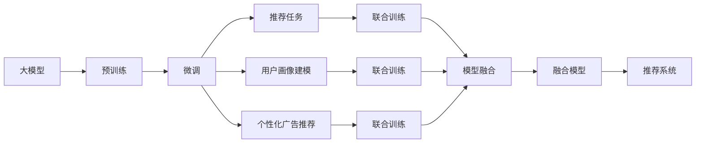

                 

## 1. 背景介绍

### 1.1 问题由来

随着互联网和数字化技术的发展，推荐系统成为了商业和学术领域的热点研究方向之一。推荐系统通过分析用户的历史行为、兴趣偏好，为用户推荐个性化的产品或内容，显著提升了用户满意度和业务效益。传统的推荐算法包括协同过滤、矩阵分解等，但随着用户行为多样性的增加，这些方法的局限性逐渐显现。

近年来，深度学习技术的迅猛发展为推荐系统带来了新的活力。基于深度神经网络的推荐模型能够自动捕捉用户行为背后的复杂关联，具有较强的泛化能力和自适应性。然而，这些模型往往需要大量的用户行为数据进行训练，难以应对实时用户行为的多变性和复杂性。

针对这一问题，大模型（Large Models）成为了推荐系统的最新研究趋势。大模型通过在大量的无标签数据上预训练，学习到通用的特征表示，然后通过微调（Fine-Tuning），适应特定推荐任务，从而取得了优异的性能。但大模型在推荐系统中面临的挑战不仅仅是如何通过微调提高推荐精度，还需要考虑模型的多任务学习能力，即在推荐任务之外，能够同时处理其他任务，如用户画像建模、个性化广告推荐等，以实现推荐系统的全域优化。

### 1.2 问题核心关键点

大模型在推荐系统中的多任务学习应用，旨在将大模型的通用特征提取能力与推荐任务的个性化需求相结合，通过多任务联合训练，提升推荐系统的整体效果。具体关键点包括：

- **多任务目标函数**：如何设计一个能够同时优化多个推荐任务的目标函数，平衡不同任务间的重要性。
- **模型架构设计**：如何将大模型的特征提取模块与推荐任务的模型模块进行无缝集成，避免过多的任务间耦合。
- **任务间迁移学习**：如何利用预训练模型的跨任务迁移能力，减少对特定任务数据的依赖，提高模型的泛化能力。
- **模型优化策略**：如何在联合训练中有效分配资源，避免某些任务对资源过度依赖，提升模型的整体性能。

## 2. 核心概念与联系

### 2.1 核心概念概述

为了更好地理解大模型在推荐系统中的多任务学习应用，本节将介绍几个关键概念：

- **大模型（Large Models）**：指参数量庞大、深度层次复杂的神经网络模型，如BERT、GPT等。通过在大规模无标签数据上预训练，学习到丰富的特征表示。
- **推荐系统（Recommender System）**：通过分析用户历史行为和兴趣偏好，为用户推荐个性化产品或内容的技术系统。
- **多任务学习（Multi-Task Learning, MTL）**：指训练多个相关任务，共享中间特征表示，提高模型在多个任务上的性能。
- **模型融合（Model Ensemble）**：将多个模型集成起来，通过加权平均、投票等策略，提升推荐系统的性能和鲁棒性。
- **知识蒸馏（Knowledge Distillation）**：通过教师模型指导学生模型学习，将教师模型的知识迁移到学生模型中。

这些核心概念通过以下Mermaid流程图来展示它们之间的联系：



这个流程图展示了从大模型预训练到推荐系统微调的流程，以及如何通过多任务学习和其他技术手段实现全域优化。

## 3. 核心算法原理 & 具体操作步骤

### 3.1 算法原理概述

大模型在推荐系统中的多任务学习应用，本质上是一种多任务联合训练（Multi-Task Joint Training）的优化问题。其核心思想是通过优化一个能够同时衡量多个任务性能的目标函数，实现模型的全域优化。

具体来说，假设推荐系统有$N$个任务$T_1, T_2, ..., T_N$，每个任务对应的损失函数为$\mathcal{L}_n$，则多任务联合训练的目标函数为：

$$
\mathcal{L}(\theta) = \sum_{n=1}^{N}\lambda_n\mathcal{L}_n(\theta)
$$

其中$\lambda_n$为任务$T_n$的权重，用于平衡不同任务的重要性。通过最小化上述目标函数，模型在多个任务上都能够取得较好的性能。

### 3.2 算法步骤详解

基于多任务学习的推荐系统，其训练流程通常包括以下几个步骤：

**Step 1: 准备数据集**

- 收集推荐系统相关的数据集，包括用户行为数据、物品属性数据、用户画像数据等。
- 将数据集分为训练集、验证集和测试集，并进行预处理，如用户行为数据的时间序列平滑、物品属性数据的归一化等。

**Step 2: 设计模型架构**

- 根据推荐系统任务的不同，设计相应的模型架构。常见的推荐模型包括矩阵分解、注意力机制、深度学习网络等。
- 将大模型的特征提取模块与推荐任务的模型模块集成，避免过多的任务间耦合。

**Step 3: 定义任务损失函数**

- 根据每个推荐任务的特点，设计对应的损失函数。例如，对于二分类推荐任务，可以使用二元交叉熵损失函数。
- 根据每个任务的重要性，设置相应的权重，构建多任务目标函数。

**Step 4: 联合训练**

- 使用梯度下降等优化算法，对模型进行联合训练，最小化多任务目标函数。
- 在联合训练过程中，可以使用随机梯度下降、Adam等优化算法，调整学习率、批大小等超参数。

**Step 5: 模型评估与优化**

- 在验证集上评估模型性能，根据评估结果调整模型参数。
- 在测试集上最终评估模型效果，选择最优模型。

**Step 6: 部署与监控**

- 将训练好的模型部署到推荐系统中，进行实时推荐。
- 定期监控推荐系统性能，及时调整模型参数和数据集，保持系统稳定性。

### 3.3 算法优缺点

大模型在推荐系统中的多任务学习应用具有以下优点：

- **泛化能力强**：通过多任务联合训练，大模型能够学习到更丰富的特征表示，提高模型泛化能力。
- **高效利用资源**：通过任务间的知识共享，减少对特定任务数据的依赖，提高模型训练效率。
- **减少过拟合**：多任务学习能够平衡不同任务的重要性，减少对单一任务的过度拟合。

但该方法也存在一些缺点：

- **模型复杂度增加**：多任务联合训练增加了模型的复杂度，可能导致训练时间变长。
- **数据需求增加**：多任务学习需要更多的数据进行训练，增加了数据收集和处理的难度。
- **超参数调参复杂**：需要平衡不同任务间的权重和损失函数，超参数调优过程较为复杂。

### 3.4 算法应用领域

大模型在推荐系统中的多任务学习应用，主要应用于以下几个领域：

- **个性化推荐**：通过多任务学习，提升推荐系统的精度和覆盖面。
- **用户画像建模**：将用户画像作为推荐系统的重要组成部分，通过多任务学习，更全面地理解用户行为和偏好。
- **个性化广告推荐**：在广告推荐系统中，通过多任务学习，提升广告的点击率和转化率。
- **推荐系统优化**：通过多任务学习，优化推荐系统中的召回率、相关性等指标。

## 4. 数学模型和公式 & 详细讲解  
### 4.1 数学模型构建

以下以二分类推荐任务为例，展示多任务学习的应用。

假设推荐系统有$N=2$个任务，分别为推荐任务$T_1$和用户画像建模任务$T_2$。推荐任务的目标是最小化二元交叉熵损失函数$\mathcal{L}_1$，用户画像建模任务的目标是最小化均方误差损失函数$\mathcal{L}_2$。

定义多任务目标函数为：

$$
\mathcal{L}(\theta) = \mathcal{L}_1(\theta) + \lambda_2\mathcal{L}_2(\theta)
$$

其中$\mathcal{L}_1$和$\mathcal{L}_2$分别表示推荐任务和用户画像建模任务的损失函数，$\lambda_2$为任务$T_2$的权重。

### 4.2 公式推导过程

以二分类推荐任务为例，二元交叉熵损失函数$\mathcal{L}_1$可表示为：

$$
\mathcal{L}_1(\theta) = -\frac{1}{N}\sum_{i=1}^{N}[y_i\log\hat{y}_i+(1-y_i)\log(1-\hat{y}_i)]
$$

其中$y_i$为真实标签，$\hat{y}_i$为模型预测的概率，$N$为训练样本数量。

对于用户画像建模任务，假设用户画像数据为$\mathbf{x}$，对应的标签为$\mathbf{y}$，均方误差损失函数$\mathcal{L}_2$可表示为：

$$
\mathcal{L}_2(\theta) = \frac{1}{N}\sum_{i=1}^{N}||\mathbf{x}_i-\mathbf{y}_i||^2
$$

其中$\mathbf{x}_i$为输入特征，$\mathbf{y}_i$为输出标签。

多任务目标函数$\mathcal{L}(\theta)$的梯度计算如下：

$$
\nabla_{\theta}\mathcal{L}(\theta) = \nabla_{\theta}\mathcal{L}_1(\theta) + \lambda_2\nabla_{\theta}\mathcal{L}_2(\theta)
$$

### 4.3 案例分析与讲解

以Amazon商品推荐为例，Amazon推荐系统包括商品推荐和用户画像建模两个任务。商品推荐任务的目标是根据用户历史行为数据，预测用户对商品的兴趣程度，生成推荐列表。用户画像建模任务的目标是根据用户行为数据，生成用户画像，用于个性化推荐和其他业务应用。

在这个案例中，可以使用两个任务共享的特征提取模块，将用户行为数据、物品属性数据等输入到特征提取模块中，提取特征向量，然后分别输入到推荐任务和用户画像建模任务的模型中进行处理。推荐任务的损失函数为二元交叉熵，用户画像建模任务的损失函数为均方误差。通过优化多任务目标函数，训练模型即可同时提高推荐精度和用户画像建模的准确性。

## 5. 项目实践：代码实例和详细解释说明

### 5.1 开发环境搭建

在进行推荐系统多任务学习开发前，我们需要准备好开发环境。以下是使用Python进行PyTorch开发的环境配置流程：

1. 安装Anaconda：从官网下载并安装Anaconda，用于创建独立的Python环境。

2. 创建并激活虚拟环境：
```bash
conda create -n recsys python=3.8 
conda activate recsys
```

3. 安装PyTorch：根据CUDA版本，从官网获取对应的安装命令。例如：
```bash
conda install pytorch torchvision torchaudio cudatoolkit=11.1 -c pytorch -c conda-forge
```

4. 安装TensorFlow：
```bash
conda install tensorflow
```

5. 安装Scikit-learn、Numpy、Pandas等工具包：
```bash
pip install scikit-learn numpy pandas matplotlib tqdm jupyter notebook ipython
```

完成上述步骤后，即可在`recsys`环境中开始推荐系统多任务学习实践。

### 5.2 源代码详细实现

这里我们以Amazon商品推荐为例，使用PyTorch实现多任务学习。

首先，定义推荐任务和用户画像建模任务的损失函数：

```python
import torch.nn as nn
import torch.nn.functional as F
from torch import nn

class Task1(nn.Module):
    def __init__(self, input_size, output_size):
        super(Task1, self).__init__()
        self.fc1 = nn.Linear(input_size, 128)
        self.fc2 = nn.Linear(128, output_size)
        
    def forward(self, x):
        x = F.relu(self.fc1(x))
        x = self.fc2(x)
        return x

class Task2(nn.Module):
    def __init__(self, input_size, output_size):
        super(Task2, self).__init__()
        self.fc1 = nn.Linear(input_size, 128)
        self.fc2 = nn.Linear(128, output_size)
        
    def forward(self, x):
        x = F.relu(self.fc1(x))
        x = self.fc2(x)
        return x
```

然后，定义多任务学习模型：

```python
class MTLModel(nn.Module):
    def __init__(self, input_size, output_size1, output_size2):
        super(MTLModel, self).__init__()
        self.task1 = Task1(input_size, output_size1)
        self.task2 = Task2(input_size, output_size2)
        
    def forward(self, x):
        x1 = self.task1(x)
        x2 = self.task2(x)
        return x1, x2
```

接着，定义训练和评估函数：

```python
def train_epoch(model, dataset, batch_size, optimizer, loss_fn1, loss_fn2, device):
    model.train()
    total_loss = 0
    for batch in dataset:
        inputs, labels1, labels2 = batch.to(device)
        outputs1, outputs2 = model(inputs)
        loss1 = loss_fn1(outputs1, labels1)
        loss2 = loss_fn2(outputs2, labels2)
        total_loss += (loss1 + loss2).item()
        optimizer.zero_grad()
        loss = loss1 + loss2
        loss.backward()
        optimizer.step()
    return total_loss / len(dataset)

def evaluate(model, dataset, batch_size, loss_fn1, loss_fn2, device):
    model.eval()
    total_loss = 0
    total_correct = 0
    for batch in dataset:
        inputs, labels1, labels2 = batch.to(device)
        outputs1, outputs2 = model(inputs)
        loss1 = loss_fn1(outputs1, labels1)
        loss2 = loss_fn2(outputs2, labels2)
        total_loss += (loss1 + loss2).item()
        total_correct += (torch.argmax(outputs1, dim=1) == labels1).sum().item()
    acc1 = total_correct / len(dataset)
    print(f"Accuracy: {acc1:.4f}")
    print(f"Loss: {total_loss / len(dataset):.4f}")
```

最后，启动训练流程并在测试集上评估：

```python
epochs = 10
batch_size = 64

for epoch in range(epochs):
    loss = train_epoch(model, train_dataset, batch_size, optimizer, loss_fn1, loss_fn2, device)
    print(f"Epoch {epoch+1}, train loss: {loss:.4f}")
    
    print(f"Epoch {epoch+1}, test results:")
    evaluate(model, test_dataset, batch_size, loss_fn1, loss_fn2, device)
```

以上就是使用PyTorch对多任务学习推荐系统进行开发的完整代码实现。可以看到，通过将推荐任务和用户画像建模任务集成到同一个多任务学习模型中，可以同时优化两个任务的目标函数，实现全域优化。

### 5.3 代码解读与分析

让我们再详细解读一下关键代码的实现细节：

**Task1和Task2类**：
- 定义了两个任务的模型，分别对应推荐任务和用户画像建模任务。
- 每个任务包含一个全连接层（Fully Connected Layer），将输入数据映射到输出空间。

**MTLModel类**：
- 将Task1和Task2集成到一个多任务学习模型中，并定义了前向传播函数。
- 在前向传播过程中，分别输出推荐任务和用户画像建模任务的特征表示。

**train_epoch和evaluate函数**：
- 定义了训练和评估函数，分别用于计算多任务目标函数的损失，更新模型参数，并评估模型性能。
- 训练函数将推荐任务和用户画像建模任务的损失求和，并使用Adam优化器更新模型参数。
- 评估函数分别计算两个任务的损失和准确率，并打印输出。

**训练流程**：
- 定义总的epoch数和batch size，开始循环迭代
- 每个epoch内，先进行训练，然后评估模型在测试集上的性能
- 重复上述过程直至模型收敛

可以看到，通过将推荐任务和用户画像建模任务集成到同一个多任务学习模型中，可以同时优化两个任务的目标函数，实现全域优化。

当然，工业级的系统实现还需考虑更多因素，如模型的保存和部署、超参数的自动搜索、更灵活的任务适配层等。但核心的多任务学习范式基本与此类似。

## 6. 实际应用场景

### 6.1 智能推荐系统

基于大模型在推荐系统中的多任务学习应用，智能推荐系统可以更好地理解用户需求，提供个性化的产品或内容推荐。

在技术实现上，可以收集用户的历史行为数据，如浏览记录、购买历史等，并提取用户画像特征。将用户画像作为推荐系统的重要组成部分，通过多任务学习，提升推荐精度和覆盖面。对于用户画像建模任务，可以使用多任务学习模型，学习用户行为特征和兴趣偏好，为推荐系统提供更准确的用户画像信息。

### 6.2 个性化广告推荐

个性化广告推荐系统需要同时考虑广告点击率和转化率两个指标，而这两个指标之间存在一定的冲突。通过多任务学习，可以在同一模型中同时优化广告点击率和转化率，实现全域优化。

在广告推荐系统中，可以使用多任务学习模型，将点击率和转化率作为任务目标函数，同时训练模型。这样可以学习到点击率和转化率之间的平衡，提升广告推荐的整体效果。

### 6.3 推荐系统优化

推荐系统优化任务通常包括召回率、相关性等指标的优化，通过多任务学习，可以在同一模型中同时优化多个指标，提升推荐系统的整体性能。

在推荐系统优化任务中，可以使用多任务学习模型，将召回率、相关性等指标作为任务目标函数，同时训练模型。这样可以学习到不同指标之间的平衡，提升推荐系统的整体效果。

### 6.4 未来应用展望

随着大模型和推荐系统技术的发展，多任务学习在推荐系统中的应用前景广阔，未来将会有更多创新应用：

1. **多目标优化**：未来推荐系统可能会同时考虑多个目标，如点击率、转化率、用户满意度等，通过多任务学习，实现多目标优化。
2. **联合训练**：多任务学习不仅可以应用于推荐系统，还可以与其他任务（如自然语言处理、计算机视觉等）联合训练，提升整体性能。
3. **异构数据融合**：未来推荐系统可能会同时处理异构数据，如文本、图像、时间序列等，通过多任务学习，实现异构数据的融合和优化。
4. **动态更新**：推荐系统需要能够动态更新用户画像和推荐结果，通过多任务学习，实现动态更新的高效实现。
5. **跨领域应用**：多任务学习在推荐系统中的应用不仅限于同一领域，还可以跨领域应用，如将推荐系统与其他业务应用联合优化。

这些趋势展示了多任务学习在推荐系统中的巨大潜力，未来将会有更多创新应用，为推荐系统的全域优化和智能化发展提供新的动力。

## 7. 工具和资源推荐

### 7.1 学习资源推荐

为了帮助开发者系统掌握多任务学习理论基础和实践技巧，这里推荐一些优质的学习资源：

1. **《Deep Learning》**：深度学习领域的经典教材，系统介绍了深度学习的基本概念和核心技术。
2. **《Multi-Task Learning for Heterogeneous Prediction Problems》**：深度学习领域的顶级会议 paper，介绍了多任务学习的最新研究进展和应用案例。
3. **《Multi-Task Learning》**：Coursera上的多任务学习课程，系统讲解了多任务学习的原理和应用。
4. **《Multi-Task Learning with PyTorch》**：PyTorch官方文档，介绍了如何使用PyTorch实现多任务学习。
5. **《Multi-Task Learning in Practice》**：NIPS 2020上发布的资源包，包含多任务学习的实践案例和代码实现。

通过对这些资源的学习实践，相信你一定能够快速掌握多任务学习的精髓，并用于解决实际的推荐系统问题。

### 7.2 开发工具推荐

高效的开发离不开优秀的工具支持。以下是几款用于多任务学习推荐系统开发的常用工具：

1. **PyTorch**：基于Python的开源深度学习框架，灵活动态的计算图，适合快速迭代研究。
2. **TensorFlow**：由Google主导开发的开源深度学习框架，生产部署方便，适合大规模工程应用。
3. **Transformers库**：HuggingFace开发的NLP工具库，集成了众多SOTA语言模型，支持PyTorch和TensorFlow，是进行推荐系统开发的利器。
4. **Weights & Biases**：模型训练的实验跟踪工具，可以记录和可视化模型训练过程中的各项指标，方便对比和调优。
5. **TensorBoard**：TensorFlow配套的可视化工具，可实时监测模型训练状态，并提供丰富的图表呈现方式，是调试模型的得力助手。
6. **Keras**：高层神经网络API，易于使用，适合快速搭建推荐系统模型。

合理利用这些工具，可以显著提升多任务学习推荐系统的开发效率，加快创新迭代的步伐。

### 7.3 相关论文推荐

多任务学习在推荐系统中的应用源于学界的持续研究。以下是几篇奠基性的相关论文，推荐阅读：

1. **Neural Multi-Task Learning with Knowledge Distillation**：提出了一种基于知识蒸馏的多任务学习算法，将教师模型的知识迁移到学生模型中。
2. **Multi-Task Learning for Recommender Systems**：介绍了一种多任务学习推荐算法，同时优化推荐精度和用户画像建模。
3. **Cross-Task Transfer Learning for Multi-Task Prediction**：提出了一种跨任务转移学习算法，在多个任务之间进行知识共享。
4. **A Review of Multi-Task Learning Approaches in Recommender Systems**：综述了多任务学习在推荐系统中的应用，提供了丰富的案例和算法。
5. **Multi-Task Learning for Recommender Systems**：介绍了一种基于深度神经网络的多任务学习推荐算法，提升了推荐系统的整体效果。

这些论文代表了大模型在推荐系统中的应用方向和研究进展，通过学习这些前沿成果，可以帮助研究者把握学科前进方向，激发更多的创新灵感。

## 8. 总结：未来发展趋势与挑战

### 8.1 总结

本文对基于大模型在推荐系统中的多任务学习应用进行了全面系统的介绍。首先阐述了多任务学习的背景和重要性，明确了多任务学习在推荐系统中的独特价值。其次，从原理到实践，详细讲解了多任务学习的数学原理和关键步骤，给出了多任务学习推荐系统的完整代码实现。同时，本文还广泛探讨了多任务学习在推荐系统中的应用场景，展示了多任务学习范式的巨大潜力。

通过本文的系统梳理，可以看到，多任务学习在推荐系统中的应用显著提升了模型的泛化能力和性能，为推荐系统带来了新的优化思路。未来，伴随大模型和推荐系统技术的不断演进，多任务学习必将在推荐系统的全域优化中发挥越来越重要的作用，推动推荐系统技术的进步。

### 8.2 未来发展趋势

展望未来，多任务学习在推荐系统中的应用将呈现以下几个发展趋势：

1. **多目标优化**：未来推荐系统可能会同时考虑多个目标，如点击率、转化率、用户满意度等，通过多任务学习，实现多目标优化。
2. **联合训练**：多任务学习不仅可以应用于推荐系统，还可以与其他任务（如自然语言处理、计算机视觉等）联合训练，提升整体性能。
3. **异构数据融合**：未来推荐系统可能会同时处理异构数据，如文本、图像、时间序列等，通过多任务学习，实现异构数据的融合和优化。
4. **动态更新**：推荐系统需要能够动态更新用户画像和推荐结果，通过多任务学习，实现动态更新的高效实现。
5. **跨领域应用**：多任务学习在推荐系统中的应用不仅限于同一领域，还可以跨领域应用，如将推荐系统与其他业务应用联合优化。

这些趋势展示了多任务学习在推荐系统中的巨大潜力，未来将会有更多创新应用，为推荐系统的全域优化和智能化发展提供新的动力。

### 8.3 面临的挑战

尽管多任务学习在推荐系统中的应用取得了一定的进展，但在实际应用中仍面临诸多挑战：

1. **数据分布不均衡**：不同任务的数据分布可能存在差异，导致模型训练不均衡，影响模型性能。
2. **模型复杂度增加**：多任务学习增加了模型的复杂度，可能导致训练时间变长，资源消耗增加。
3. **超参数调参复杂**：需要平衡不同任务间的权重和损失函数，超参数调优过程较为复杂。
4. **任务间耦合增加**：多任务学习增加了任务间的耦合，导致模型维护和部署变得复杂。
5. **模型鲁棒性不足**：多任务学习需要更多的数据进行训练，当数据量不足时，模型的鲁棒性可能会受到影响。

### 8.4 研究展望

面对多任务学习在推荐系统中面临的挑战，未来的研究需要在以下几个方面寻求新的突破：

1. **数据增强**：开发更多有效的数据增强方法，缓解数据分布不均衡的问题。
2. **模型压缩**：开发更高效的模型压缩方法，减少资源消耗，提升模型训练效率。
3. **迁移学习**：研究更多的迁移学习方法，提高模型的泛化能力和迁移能力。
4. **任务间解耦**：开发更灵活的任务间解耦方法，降低任务间的耦合，提高模型维护和部署的效率。
5. **模型集成**：研究更高效的模型集成方法，提升模型的整体性能和鲁棒性。

这些研究方向的探索，必将引领多任务学习在推荐系统中的发展，为推荐系统的全域优化和智能化发展提供新的动力。面向未来，多任务学习需要与其他人工智能技术进行更深入的融合，如知识表示、因果推理、强化学习等，多路径协同发力，共同推动推荐系统技术的进步。

## 9. 附录：常见问题与解答

**Q1：多任务学习推荐系统如何处理任务间的数据不均衡问题？**

A: 处理任务间数据不均衡问题，常见的策略包括：
1. 数据增强：通过数据增强技术，如回译、近义替换等，扩充数据量较少的任务的数据集。
2. 重采样：对数据量较多的任务进行欠采样，对数据量较少的任务进行过采样，平衡数据分布。
3. 任务权重调整：在多任务目标函数中，调整不同任务之间的权重，使模型更关注数据量较少的任务。

**Q2：多任务学习推荐系统如何进行任务间的迁移学习？**

A: 任务间的迁移学习可以通过以下步骤实现：
1. 将预训练模型（如BERT、GPT等）作为教师模型，将任务1的模型作为学生模型。
2. 在教师模型和学生模型之间建立知识蒸馏机制，如softmax层、特征映射等，将教师模型的知识迁移到学生模型中。
3. 通过微调学生模型，使其在任务2上达到更好的性能。

**Q3：多任务学习推荐系统如何进行多目标优化？**

A: 多目标优化可以通过以下步骤实现：
1. 将多个目标作为任务目标函数，同时训练模型。
2. 使用权重系数调整不同目标之间的重要性，使模型更关注重要的目标。
3. 使用多目标优化算法（如Pareto优化、遗传算法等）进行模型优化，平衡不同目标之间的冲突。

**Q4：多任务学习推荐系统如何进行异构数据融合？**

A: 异构数据融合可以通过以下步骤实现：
1. 将不同类型的输入数据（如文本、图像、时间序列等）转换为统一的特征表示。
2. 将统一的特征表示输入到多任务学习模型中，学习不同类型数据之间的关联。
3. 在推荐系统中，根据不同类型数据的特征，生成个性化的推荐结果。

**Q5：多任务学习推荐系统如何进行动态更新？**

A: 动态更新可以通过以下步骤实现：
1. 收集用户的实时行为数据，如浏览记录、购买历史等。
2. 使用多任务学习模型，实时更新用户画像和推荐结果。
3. 根据用户最新的行为数据，动态调整推荐算法和模型参数，提升推荐效果。

---

作者：禅与计算机程序设计艺术 / Zen and the Art of Computer Programming

