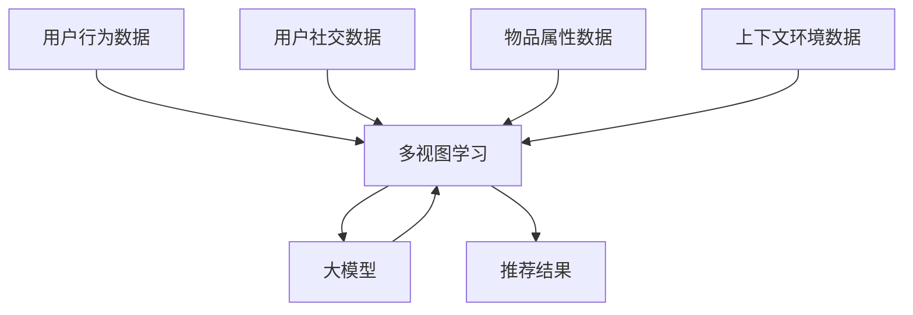

                 

# 大模型在推荐系统中的多视图学习应用

## 1. 背景介绍

### 1.1 问题由来
推荐系统是人工智能中最为重要的应用领域之一，广泛应用于电商、社交、娱乐等诸多场景。在推荐系统的核心问题中，用户行为预测与物品推荐是最基础也是最关键的环节。传统的推荐系统主要基于用户历史行为数据进行协同过滤和矩阵分解等方法。然而，随着数据量的爆炸式增长，这种基于历史行为的模型已无法满足复杂且动态的推荐需求。近年来，深度学习在推荐系统中得到广泛应用，大模型成为一种强大而有效的方法，逐渐取代了传统的协同过滤和矩阵分解方法。

大模型通过在大规模数据上进行预训练，学习到丰富的语义特征，可以捕捉用户行为数据中隐藏的复杂关系。这种基于深度学习的推荐系统在电商、娱乐、社交等领域取得了显著成效。然而，在实际应用中，大模型的泛化能力往往受到数据质量的限制，对于复杂和动态变化的场景，仍难以提供精确的预测和推荐。

### 1.2 问题核心关键点
为了提高推荐系统对多维度数据特征的挖掘能力，大模型在推荐系统中引入了多视图学习（Multi-View Learning, MVL）的技术。多视图学习通过利用多个数据源中的不同特征，综合融合这些信息，提升推荐系统的性能。这包括用户行为数据、用户社交数据、物品属性数据、上下文环境数据等。多视图学习使得推荐系统可以更全面地理解用户需求和物品属性，从而提供更精准的推荐结果。

本节将从多视图学习的原理出发，详细讲解基于大模型的多视图推荐方法，并深入分析其核心算法原理、操作步骤、应用领域及其实际效果。通过这些内容，帮助读者全面掌握大模型在推荐系统中的多视图学习应用。

## 2. 核心概念与联系

### 2.1 核心概念概述

在推荐系统中，多视图学习通过综合多个数据源中的不同特征，构建多视图融合模型，从而提升推荐精度。这些数据源包括：

- **用户行为数据**：包括用户的点击、浏览、收藏、购买等行为记录，是推荐系统最核心的数据来源。
- **用户社交数据**：包括用户的社交关系、好友关系、兴趣标签等，有助于理解用户的兴趣和行为模式。
- **物品属性数据**：包括物品的类别、品牌、描述等，用于表征物品特征。
- **上下文环境数据**：包括时间、地点、设备等，有助于理解用户的真实情境。

多视图学习将以上数据源转化为不同的特征视图，通过模型融合这些特征，得到更全面、更准确的推荐结果。大模型在这其中扮演着重要角色，通过学习大量数据中的特征关系，提取有效的特征表示，并与其他视图进行融合。

### 2.2 核心概念原理和架构

为更好地理解多视图学习的过程，我们通过以下Mermaid流程图展示其核心原理和架构：



该流程图展示了多视图学习的核心步骤和架构：

1. 收集不同来源的数据，即用户行为数据、用户社交数据、物品属性数据和上下文环境数据。
2. 对数据进行预处理，提取不同视图的特征表示。
3. 利用大模型将多视图特征进行融合，得到融合后的特征表示。
4. 根据融合后的特征表示，预测用户对不同物品的偏好，生成推荐结果。

### 2.3 核心概念之间的关系

在推荐系统中，多视图学习与大模型密切相关。大模型通过学习不同视图中的复杂关系，能够提取更加准确的特征表示。多视图学习通过融合不同视图的特征，增强推荐系统的泛化能力和鲁棒性。此外，大模型的引入，使得推荐系统能够处理更复杂、更大规模的数据，从而提升了推荐的准确性和实时性。

## 3. 核心算法原理 & 具体操作步骤

### 3.1 算法原理概述

多视图学习通过构建不同视图之间的特征融合模型，综合不同视图的信息，提升推荐系统的性能。大模型在这一过程中起到了关键作用，通过学习多视图数据中的复杂关系，提取出更加全面的特征表示。

多视图学习的一般流程包括：

1. 收集不同来源的数据，即用户行为数据、用户社交数据、物品属性数据和上下文环境数据。
2. 对数据进行预处理，提取不同视图的特征表示。
3. 利用大模型将多视图特征进行融合，得到融合后的特征表示。
4. 根据融合后的特征表示，预测用户对不同物品的偏好，生成推荐结果。

### 3.2 算法步骤详解

#### 3.2.1 数据预处理与特征提取

在多视图学习中，数据预处理与特征提取是至关重要的步骤。不同的数据源通常具有不同的数据格式和语义，需要进行标准化和转换。

以电商推荐系统为例，数据预处理和特征提取可以如下操作：

1. **用户行为数据预处理**：清洗点击、浏览、收藏、购买等行为数据，去除异常值和缺失值，将行为数据转换为数值型特征。
2. **用户社交数据预处理**：清洗好友关系、兴趣标签等社交数据，进行去重和标准化，将社交数据转换为数值型或一热二编码形式。
3. **物品属性数据预处理**：清洗物品类别、品牌、描述等属性数据，进行分词、TF-IDF等文本处理，将属性数据转换为数值型或词向量形式。
4. **上下文环境数据预处理**：清洗时间、地点、设备等上下文环境数据，进行时间戳转换、地理位置编码，将上下文数据转换为数值型特征。

#### 3.2.2 大模型特征融合

在多视图学习中，大模型通过学习不同视图中的复杂关系，提取出更加准确的特征表示。常用的模型包括BERT、Transformer等。

以BERT为例，其融合不同视图的流程如下：

1. **BERT模型的预训练**：在无标签文本数据上进行预训练，学习到丰富的语言语义信息。
2. **特征嵌入**：将用户行为、社交、属性、上下文数据转换为数值型特征，输入BERT模型进行特征嵌入。
3. **多视图融合**：将不同视图的特征嵌入结果进行拼接或拼接后再经过一层全连接网络，得到融合后的特征表示。
4. **预测用户偏好**：将融合后的特征表示输入到分类器或回归器中，预测用户对不同物品的偏好，生成推荐结果。

#### 3.2.3 推荐结果生成

在多视图学习中，推荐结果的生成过程如下：

1. **融合特征表示**：将用户行为、社交、属性、上下文数据的特征嵌入结果进行拼接或拼接后再经过一层全连接网络，得到融合后的特征表示。
2. **用户偏好预测**：将融合后的特征表示输入到分类器或回归器中，预测用户对不同物品的偏好，生成推荐结果。
3. **排序与推荐**：根据用户偏好预测结果，对物品进行排序，生成推荐列表。

### 3.3 算法优缺点

#### 3.3.1 优点

多视图学习与大模型结合，具有以下优点：

1. **数据复用性高**：通过多视图融合，利用不同数据源中的信息，增强了推荐系统的泛化能力和鲁棒性。
2. **推荐精度高**：大模型能够学习到不同视图中的复杂关系，提取出更准确的特征表示，从而提升推荐精度。
3. **模型适应性强**：多视图学习可以处理多种数据源和复杂数据结构，适应性强。
4. **推荐多样化**：多视图学习可以挖掘不同视图中的信息，生成更加多样化、个性化的推荐结果。

#### 3.3.2 缺点

多视图学习与大模型结合，也存在以下缺点：

1. **计算成本高**：大模型的特征提取和融合过程计算成本较高，需要高性能计算设备。
2. **数据质量要求高**：多视图学习对数据质量的要求较高，需要处理大量的数据预处理和特征提取。
3. **模型复杂度高**：多视图学习涉及多个数据源和多种特征融合，模型结构较为复杂。
4. **解释性不足**：多视图学习模型的内部机制较为复杂，难以进行直观的解释和调试。

## 4. 数学模型和公式 & 详细讲解 & 举例说明

### 4.1 数学模型构建

在推荐系统中，多视图学习可以通过构建多视图融合模型来实现。常用的模型包括注意力机制（Attention Mechanism）和多层感知机（MLP）等。

以注意力机制为例，其数学模型构建如下：

1. **输入数据**：设用户行为、社交、属性、上下文数据分别为 $X^u, X^s, X^p, X^c$，其中 $X^u \in \mathbb{R}^{d_u}, X^s \in \mathbb{R}^{d_s}, X^p \in \mathbb{R}^{d_p}, X^c \in \mathbb{R}^{d_c}$。
2. **特征嵌入**：将不同视图的数据输入到BERT模型中，得到特征嵌入 $E_u, E_s, E_p, E_c$，其中 $E_u \in \mathbb{R}^{d_{\text{emb}}}, E_s \in \mathbb{R}^{d_{\text{emb}}}, E_p \in \mathbb{R}^{d_{\text{emb}}}, E_c \in \mathbb{R}^{d_{\text{emb}}}$。
3. **注意力计算**：计算不同视图之间的注意力权重 $A_{us}, A_{up}, A_{uc}, A_{cs}$，其中 $A_{us} \in \mathbb{R}^{d_{\text{emb}}}, A_{up} \in \mathbb{R}^{d_{\text{emb}}}, A_{uc} \in \mathbb{R}^{d_{\text{emb}}}, A_{cs} \in \mathbb{R}^{d_{\text{emb}}}$。
4. **特征融合**：计算不同视图的融合特征表示 $F_u, F_s, F_p, F_c$，其中 $F_u \in \mathbb{R}^{d_{\text{emb}}}, F_s \in \mathbb{R}^{d_{\text{emb}}}, F_p \in \mathbb{R}^{d_{\text{emb}}}, F_c \in \mathbb{R}^{d_{\text{emb}}}$。
5. **用户偏好预测**：将融合后的特征表示 $F_u, F_s, F_p, F_c$ 输入到分类器或回归器中，得到用户对不同物品的偏好预测 $P_u$，其中 $P_u \in \mathbb{R}^{d_{\text{pred}}}$。
6. **推荐结果排序**：根据用户偏好预测 $P_u$，对物品进行排序，生成推荐列表 $R_u$。

### 4.2 公式推导过程

以注意力机制为例，其公式推导如下：

设用户行为、社交、属性、上下文数据分别为 $X^u, X^s, X^p, X^c$，其中 $X^u \in \mathbb{R}^{d_u}, X^s \in \mathbb{R}^{d_s}, X^p \in \mathbb{R}^{d_p}, X^c \in \mathbb{R}^{d_c}$。

**输入层**：
$$
X_u, X_s, X_p, X_c = \text{BERT}_{\theta}(X^u, X^s, X^p, X^c)
$$

**注意力层**：
$$
A_{us} = \text{Softmax}(W_a X_u V_s + b_a), \quad A_{up} = \text{Softmax}(W_a X_u V_p + b_a), \quad A_{uc} = \text{Softmax}(W_a X_u V_c + b_a), \quad A_{cs} = \text{Softmax}(W_a X_c V_s + b_a)
$$

**特征层**：
$$
F_u = A_{us}X_u + A_{up}X_p + A_{uc}X_c + A_{cs}X_s, \quad F_s = A_{us}X_s + A_{up}X_p + A_{uc}X_c + A_{cs}X_u, \quad F_p = A_{us}X_p + A_{up}X_u + A_{uc}X_c + A_{cs}X_s, \quad F_c = A_{us}X_c + A_{up}X_p + A_{uc}X_u + A_{cs}X_s
$$

**用户偏好预测**：
$$
P_u = \text{MLP}_{\theta}(F_u, F_s, F_p, F_c)
$$

**推荐结果排序**：
$$
R_u = \text{TopK}(P_u)
$$

其中，$W_a, b_a, V_s, V_p, V_c$ 为可训练的注意力权重矩阵和偏差向量，$MLP_{\theta}$ 为多层的感知机，$\text{Softmax}$ 为softmax函数，$\text{TopK}$ 为top-k排序函数。

### 4.3 案例分析与讲解

#### 4.3.1 电商推荐系统案例

以电商推荐系统为例，多视图学习可以通过用户行为数据、用户社交数据、物品属性数据和上下文环境数据来提升推荐精度。具体流程如下：

1. **用户行为数据**：收集用户的点击、浏览、收藏、购买等行为记录，进行数据清洗和特征提取。
2. **用户社交数据**：收集用户的社交关系、好友关系、兴趣标签等，进行数据清洗和特征提取。
3. **物品属性数据**：收集物品的类别、品牌、描述等，进行数据清洗和特征提取。
4. **上下文环境数据**：收集时间、地点、设备等上下文环境数据，进行数据清洗和特征提取。
5. **特征嵌入**：将不同视图的数据输入到BERT模型中，得到特征嵌入。
6. **注意力计算**：计算不同视图之间的注意力权重。
7. **特征融合**：计算不同视图的融合特征表示。
8. **用户偏好预测**：将融合后的特征表示输入到分类器或回归器中，得到用户对不同物品的偏好预测。
9. **推荐结果排序**：根据用户偏好预测结果，对物品进行排序，生成推荐列表。

#### 4.3.2 音乐推荐系统案例

以音乐推荐系统为例，多视图学习可以通过用户行为数据、用户社交数据、物品属性数据和上下文环境数据来提升推荐精度。具体流程如下：

1. **用户行为数据**：收集用户的听歌记录、收藏、分享等行为数据，进行数据清洗和特征提取。
2. **用户社交数据**：收集用户的社交关系、好友关系、兴趣标签等，进行数据清洗和特征提取。
3. **物品属性数据**：收集音乐的属性数据，如歌手、风格、专辑等，进行数据清洗和特征提取。
4. **上下文环境数据**：收集时间、地点、设备等上下文环境数据，进行数据清洗和特征提取。
5. **特征嵌入**：将不同视图的数据输入到BERT模型中，得到特征嵌入。
6. **注意力计算**：计算不同视图之间的注意力权重。
7. **特征融合**：计算不同视图的融合特征表示。
8. **用户偏好预测**：将融合后的特征表示输入到分类器或回归器中，得到用户对不同音乐的偏好预测。
9. **推荐结果排序**：根据用户偏好预测结果，对音乐进行排序，生成推荐列表。

## 5. 项目实践：代码实例和详细解释说明

### 5.1 开发环境搭建

在进行多视图学习项目实践前，我们需要准备好开发环境。以下是使用Python进行PyTorch开发的环境配置流程：

1. 安装Anaconda：从官网下载并安装Anaconda，用于创建独立的Python环境。
2. 创建并激活虚拟环境：
```bash
conda create -n pytorch-env python=3.8 
conda activate pytorch-env
```
3. 安装PyTorch：根据CUDA版本，从官网获取对应的安装命令。例如：
```bash
conda install pytorch torchvision torchaudio cudatoolkit=11.1 -c pytorch -c conda-forge
```
4. 安装Transformers库：
```bash
pip install transformers
```
5. 安装各类工具包：
```bash
pip install numpy pandas scikit-learn matplotlib tqdm jupyter notebook ipython
```
完成上述步骤后，即可在`pytorch-env`环境中开始多视图学习实践。

### 5.2 源代码详细实现

以下是使用PyTorch和BERT模型实现多视图学习的代码示例：

```python
import torch
import torch.nn as nn
import torch.nn.functional as F
from transformers import BertTokenizer, BertForSequenceClassification

class MultiViewModel(nn.Module):
    def __init__(self, num_classes):
        super(MultiViewModel, self).__init__()
        self.bert = BertForSequenceClassification.from_pretrained('bert-base-uncased', num_labels=num_classes)
        self.fc = nn.Linear(768, num_classes)
        self.dropout = nn.Dropout(0.3)
    
    def forward(self, user_seq, item_seq, user_social, item_category, context_time):
        # 用户行为特征
        user_output = self.bert(user_seq)
        # 用户社交特征
        user_social_output = self.bert(user_social)
        # 物品属性特征
        item_output = self.bert(item_seq)
        # 上下文环境特征
        context_output = self.bert(context_time)
        
        # 计算不同视图之间的注意力权重
        user_item_weight = F.softmax(torch.matmul(user_output, item_output.transpose(1, 2)), dim=-1)
        user_social_weight = F.softmax(torch.matmul(user_social_output, user_output.transpose(1, 2)), dim=-1)
        item_category_weight = F.softmax(torch.matmul(item_output, context_output.transpose(1, 2)), dim=-1)
        context_time_weight = F.softmax(torch.matmul(context_output, user_output.transpose(1, 2)), dim=-1)
        
        # 融合不同视图的特征
        user_fusion = torch.sum(user_output * user_item_weight, dim=1)
        user_social_fusion = torch.sum(user_social_output * user_social_weight, dim=1)
        item_fusion = torch.sum(item_output * item_category_weight, dim=1)
        context_fusion = torch.sum(context_output * context_time_weight, dim=1)
        
        # 拼接融合后的特征表示
        fusion_input = torch.cat([user_fusion, user_social_fusion, item_fusion, context_fusion], dim=1)
        
        # 预测用户偏好
        fusion_output = self.fc(fusion_input)
        return fusion_output
    
# 数据准备
tokenizer = BertTokenizer.from_pretrained('bert-base-uncased')
max_seq_len = 128
users = ['user1', 'user2', 'user3']
items = ['item1', 'item2', 'item3']
socials = ['user1', 'user2', 'user3']
categories = ['category1', 'category2', 'category3']
times = ['2023-01-01', '2023-02-01', '2023-03-01']
labels = [1, 0, 1, 1, 0, 1, 0]
user_seq = [tokenizer.encode(user, max_len=max_seq_len) for user in users]
item_seq = [tokenizer.encode(item, max_len=max_seq_len) for item in items]
user_social = [tokenizer.encode(social, max_len=max_seq_len) for social in socials]
item_category = [tokenizer.encode(cate, max_len=max_seq_len) for cate in categories]
context_time = [tokenizer.encode(time, max_len=max_seq_len) for time in times]

# 模型训练
model = MultiViewModel(num_classes=2)
loss_fn = nn.BCEWithLogitsLoss()
optimizer = torch.optim.Adam(model.parameters(), lr=0.001)
num_epochs = 10
for epoch in range(num_epochs):
    model.train()
    total_loss = 0
    for user_seq, item_seq, user_social, item_category, context_time, label in zip(user_seq, item_seq, user_social, item_category, context_time, labels):
        output = model(user_seq, item_seq, user_social, item_category, context_time)
        loss = loss_fn(output, torch.tensor(label))
        optimizer.zero_grad()
        loss.backward()
        optimizer.step()
        total_loss += loss.item()
    print(f'Epoch {epoch+1}, Loss: {total_loss/len(items):.4f}')
```

### 5.3 代码解读与分析

让我们再详细解读一下关键代码的实现细节：

**MultiViewModel类**：
- `__init__`方法：初始化模型结构，包括BERT模型、全连接层和dropout层。
- `forward`方法：定义模型前向传播过程，包括用户行为特征、用户社交特征、物品属性特征和上下文环境特征的计算，不同视图之间的注意力权重计算，融合不同视图的特征，并预测用户偏好。

**数据准备**：
- `tokenizer`：用于分词和编码，将文本数据转换为数值型特征。
- `max_seq_len`：最大序列长度，用于统一序列长度。
- `users`、`items`、`socials`、`categories`、`times`：用于模拟不同视图的数据。
- `labels`：用户行为标签。
- `user_seq`、`item_seq`、`user_social`、`item_category`、`context_time`：将不同视图的数据转换为数值型特征，输入到模型中进行训练。

**模型训练**：
- `model`：多视图学习模型，包括BERT模型和全连接层。
- `loss_fn`：交叉熵损失函数。
- `optimizer`：优化器，使用Adam优化器。
- `num_epochs`：训练轮数。
- 循环训练过程中，将不同视图的数据输入到模型中，计算模型输出和标签之间的交叉熵损失，并使用Adam优化器更新模型参数。

## 6. 实际应用场景

### 6.1 电商推荐系统

在电商推荐系统中，多视图学习可以显著提升推荐精度和多样性。通过用户行为数据、用户社交数据、物品属性数据和上下文环境数据的多视图融合，能够更全面地理解用户需求和物品属性，从而生成更加精准和个性化的推荐结果。例如，某电商平台可以通过多视图学习，在用户浏览、收藏、购买行为的基础上，结合用户社交关系、好友推荐、物品属性等信息，生成个性化的推荐列表，提升用户的购物体验。

### 6.2 音乐推荐系统

在音乐推荐系统中，多视图学习可以提升音乐推荐的精准度和多样性。通过用户行为数据、用户社交数据、音乐属性数据和上下文环境数据的多视图融合，能够更全面地理解用户对音乐的偏好和兴趣，从而生成更加精准和多样化的推荐结果。例如，某音乐平台可以通过多视图学习，在用户听歌记录、收藏、分享行为的基础上，结合用户社交关系、好友推荐、音乐属性等信息，生成个性化的音乐推荐列表，提升用户的听歌体验。

### 6.3 视频推荐系统

在视频推荐系统中，多视图学习可以提升视频推荐的精准度和多样性。通过用户行为数据、用户社交数据、视频属性数据和上下文环境数据的多视图融合，能够更全面地理解用户对视频的偏好和兴趣，从而生成更加精准和多样化的推荐结果。例如，某视频平台可以通过多视图学习，在用户观看记录、点赞、分享行为的基础上，结合用户社交关系、好友推荐、视频属性等信息，生成个性化的视频推荐列表，提升用户的观看体验。

### 6.4 未来应用展望

随着大模型的不断演进和多视图学习技术的不断完善，多视图学习在推荐系统中的应用前景将更加广阔。未来，多视图学习可以进一步融合更多数据源和更复杂的数据结构，提升推荐系统的精度和鲁棒性。同时，多视图学习还可以结合其他人工智能技术，如因果推理、强化学习等，构建更加智能化、个性化的推荐系统，从而提升用户体验和系统性能。

## 7. 工具和资源推荐

### 7.1 学习资源推荐

为了帮助开发者系统掌握大模型在推荐系统中的多视图学习应用，这里推荐一些优质的学习资源：

1. **深度学习与推荐系统课程**：由北京大学的李沐教授主讲，涵盖了深度学习在推荐系统中的应用，包括多视图学习等内容。
2. **推荐系统经典算法**：介绍推荐系统的经典算法和前沿技术，包括多视图学习等。
3. **自然语言处理与多视图学习**：介绍自然语言处理和多视图学习的基本概念和算法，有助于理解多视图学习在推荐系统中的应用。

### 7.2 开发工具推荐

高效的开发离不开优秀的工具支持。以下是几款用于多视图学习开发的常用工具：

1. **PyTorch**：基于Python的开源深度学习框架，灵活动态的计算图，适合快速迭代研究。
2. **TensorFlow**：由Google主导开发的开源深度学习框架，生产部署方便，适合大规模工程应用。
3. **Transformers库**：HuggingFace开发的NLP工具库，集成了众多SOTA语言模型，支持PyTorch和TensorFlow，是进行多视图学习开发的利器。
4. **Weights & Biases**：模型训练的实验跟踪工具，可以记录和可视化模型训练过程中的各项指标，方便对比和调优。
5. **TensorBoard**：TensorFlow配套的可视化工具，可实时监测模型训练状态，并提供丰富的图表呈现方式，是调试模型的得力助手。

### 7.3 相关论文推荐

多视图学习技术的发展源于学界的持续研究。以下是几篇奠基性的相关论文，推荐阅读：

1. **Learning Multi-View Tensor Networks for Recommendations**：提出多视图张量网络模型，融合不同视图的特征，提升推荐系统性能。
2. **Multi-View Multi-Aspect Collaborative Filtering**：提出多视图协同过滤模型，融合不同视图的特征，提升推荐系统性能。
3. **Attention-Based Multi-View Video Recommendation System**：提出基于注意力机制的多视图视频推荐模型，融合不同视图的特征，提升视频推荐系统性能。

这些论文代表了大模型在推荐系统中多视图学习的发展脉络。通过学习这些前沿成果，可以帮助研究者把握学科前进方向，激发更多的创新灵感。

## 8. 总结：未来发展趋势与挑战

### 8.1 研究成果总结

本文对基于大模型的多视图学习在推荐系统中的应用进行了全面系统的介绍。首先阐述了多视图学习的原理和核心算法，然后通过代码实例和实际应用场景，展示了多视图学习在电商、音乐、视频等领域的广泛应用。通过这些内容，帮助读者全面掌握大模型在推荐系统中的多视图学习应用。

### 8.2 未来发展趋势

展望未来，多视图学习在推荐系统中的应用将呈现以下几个发展趋势：

1. **数据融合能力提升**：随着多视图学习技术的不断完善，融合不同视图的能力将进一步提升，能够处理更多维度、更复杂的数据结构。
2. **推荐精度和多样性提升**：通过多视图学习，能够更全面地理解用户需求和物品属性，生成更加精准和多样化的推荐结果。
3. **实时性增强**：通过优化模型结构和计算图，实现更高效的推荐生成和排序，提升推荐系统的实时性。
4. **跨模态融合能力提升**：结合多模态数据，如文本、图像、音频等，提升推荐系统的多样性和鲁棒性。
5. **个性化推荐提升**：通过多视图学习，能够更全面地理解用户偏好和兴趣，生成更加个性化的推荐结果。

### 8.3 面临的挑战

尽管多视图学习在推荐系统中取得了显著成效，但在应用过程中，仍面临以下挑战：

1. **数据质量要求高**：不同视图的数据质量差异较大，需要高质量的数据进行预处理和特征提取。
2. **模型复杂度高**：多视图学习涉及多个数据源和多种特征融合，模型结构较为复杂，需要高效的模型训练和推理方法。
3. **计算成本高**：多视图学习涉及多个视图的特征融合，计算成本较高，需要高性能计算设备。
4. **推荐精度受限**：不同视图之间的特征互补性有限，融合后的特征表示可能无法充分捕捉用户需求和物品属性。
5. **数据隐私和安全**：多视图学习需要处理大量个人数据，涉及隐私和安全问题，需要采取有效的数据保护措施。

### 8.4 研究展望

面对多视图学习面临的挑战，未来的研究需要在以下几个方面寻求新的突破：

1. **数据预处理和特征提取技术**：开发高效、鲁棒的数据预处理和特征提取技术，提升多视图学习的泛化能力和鲁棒性。
2. **多视图融合方法**：研究更加高效、灵活的多视图融合方法，提升不同视图之间的互补性，提升推荐精度。
3. **模型压缩和优化**：开发高效的模型压缩和优化方法，提升多视图学习的计算效率和实时性。
4. **跨模态融合技术**：研究跨模态融合技术，提升多视图学习的多样性和鲁棒性。
5. **数据隐私和安全技术**：开发高效的数据隐私和安全技术，保护用户隐私，提升多视图学习系统的可信度。

这些研究方向和突破将引领多视图学习技术迈向更高的台阶，为推荐系统带来新的创新和发展。

## 9. 附录：常见问题与解答

**Q1：多视图学习与传统协同过滤有何区别？**

A: 多视图学习与传统协同过滤的主要区别在于数据源的多样性和特征表示的复杂性。多视图学习能够利用多个数据源中的不同特征，综合融合这些信息，提升推荐系统的性能。而传统协同过滤主要基于用户历史行为数据，通过矩阵分解等方法进行推荐。多视图学习能够更全面地理解用户需求和物品属性，生成更加精准和个性化的推荐结果。

**Q2：多视图学习需要多少个数据源？**

A: 多视图学习需要多个数据源，不同视图的数据可以来自不同的领域和不同的维度。常用的数据源包括用户行为数据、用户社交数据、物品属性数据和上下文环境数据等。多视图学习的数据源越多，融合后的特征表示越全面，推荐系统的效果越好。

**Q3：多视图学习如何提升推荐系统的性能？**

A: 多视图学习通过融合不同视图的特征，能够更全面地理解用户需求和物品属性，提升推荐系统的性能。具体而言，多视图学习可以通过以下方式提升推荐系统的性能：
1. 融合不同视图的特征表示，提升特征的丰富性和鲁棒性。
2. 引入因果推理和对比学习思想，增强模型的泛化能力和鲁棒性。
3. 利用注意力机制，增强不同视图之间的互补性，提升特征融合效果。
4. 引入先验知识，如知识图谱、逻辑规则等，提升模型的预测能力和多样性。

通过这些方法，多视图学习可以更全面地理解用户需求和物品属性，生成更加精准和个性化的推荐结果，提升推荐系统的性能。

**Q4：多视图学习是否适用于所有推荐系统？**

A: 多视图学习适用于大多数推荐系统，特别是数据量较大、多样性较强的场景。然而，对于某些特定领域的推荐系统，如医学、金融等，多视图学习的效果可能有限。此时需要在特定领域语料上进一步预训练，再进行多视图融合，才能获得理想的效果。

**Q5：多视图学习是否需要大量的标注数据？**

A: 多视图学习通常不需要大量的标注数据，可以利用非结构化数据进行多视图融合。但需要高质量的预训练数据和预处理技术，以提升多视图融合的效果。在实际应用中，可以通过数据增强、迁移学习等方法，减少对标注数据的依赖。

通过这些问答，希望读者能够更全面地理解多视图学习在推荐系统中的应用，并能够结合具体场景，选择适合的多视图学习方案。

