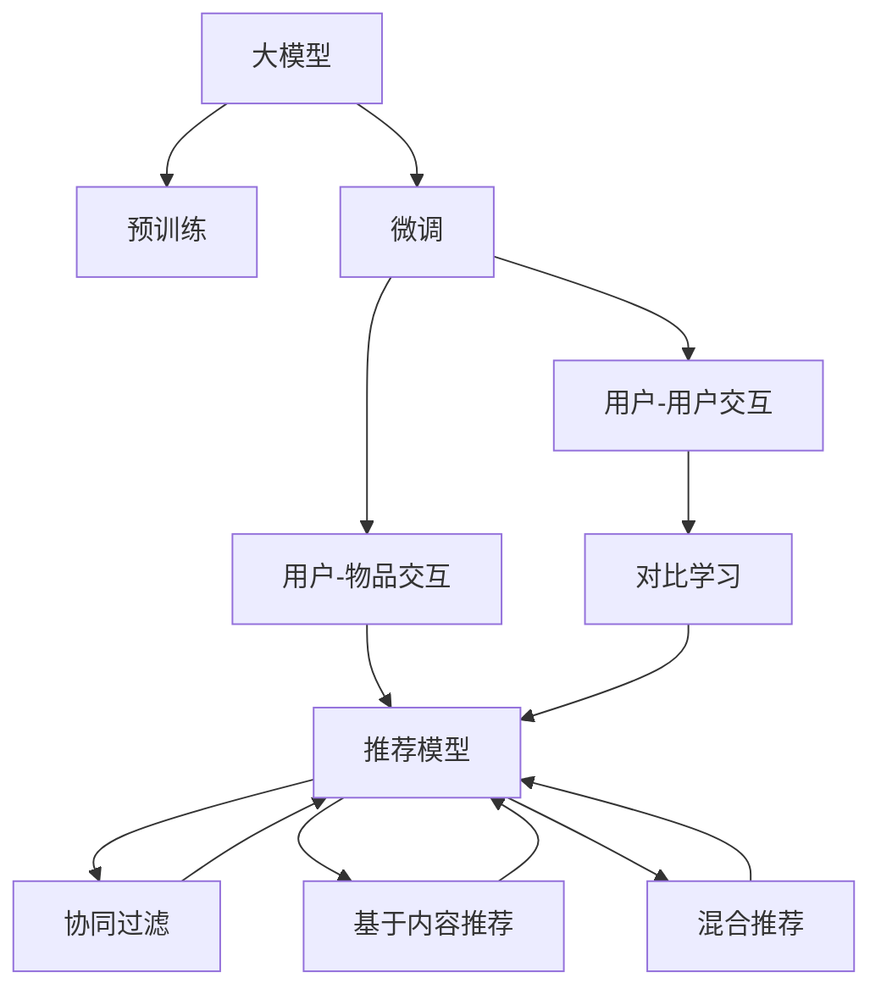

                 

# 大模型在推荐系统中的对比学习应用

> 关键词：大模型,对比学习,推荐系统,协同过滤,标签传播,交叉特征,向量表示

## 1. 背景介绍

### 1.1 问题由来
随着互联网和电子商务的迅速发展，推荐系统已成为各大平台的重要应用之一。推荐系统通过分析用户的历史行为和兴趣，为用户推荐感兴趣的内容，提升用户体验，增加平台粘性。常见的推荐方法包括协同过滤和基于内容的推荐。协同过滤基于用户之间的相似性进行推荐，难以应对冷启动和稀疏矩阵问题；基于内容的推荐则往往忽视了用户兴趣的动态变化，无法捕捉复杂的用户-物品交互关系。近年来，基于深度学习的方法逐渐兴起，能够处理稀疏非结构化数据，捕捉高阶交互关系，成为推荐系统的新兴方向。

### 1.2 问题核心关键点
其中，基于大模型的推荐系统，通过自监督学习任务和微调方法，从大量用户-物品交互数据中学习到丰富的用户-物品嵌入向量表示，显著提升了推荐的精准度和覆盖率。然而，现有的基于大模型的推荐方法主要聚焦于用户-物品交互数据的建模，忽视了对用户之间互动关系的挖掘。对比学习作为一种有效的无监督学习方法，近年来在图像、语音等领域取得了卓越成效，本文旨在探讨将其引入推荐系统，增强大模型对用户间交互关系的建模能力，提升推荐系统的效果。

### 1.3 问题研究意义
对比学习在大模型推荐系统中的应用，可以带来以下几方面的显著提升：
1. **增强用户-用户交互的建模能力**：利用用户之间交互的隐式信息，进一步丰富用户画像，提高推荐的相关性和多样性。
2. **提高用户-物品交互的精准度**：通过引入对比学习，加强用户-物品嵌入向量之间的交互学习，提升模型的泛化能力和鲁棒性。
3. **处理长尾用户**：利用对比学习的正则化效果，帮助冷启动用户或长期未交互用户，生成更准确的推荐。
4. **降低推荐系统的计算复杂度**：通过高效的特征表示和参数共享，减少模型大小和计算量，提高推荐效率。
5. **优化用户体验**：通过更精准和个性化的推荐，提升用户满意度和平台留存率。

## 2. 核心概念与联系

### 2.1 核心概念概述

为更好地理解对比学习在大模型推荐系统中的应用，本节将介绍几个密切相关的核心概念：

- 大模型(Large Model)：以Transformer为代表的大规模预训练语言模型，通过在大规模语料上预训练，学习到丰富的语言表示。常见的预训练模型包括BERT、GPT等。
- 对比学习(Contrastive Learning)：一种通过最小化相似样本与不相似样本的相似度差异，学习样本特征表示的无监督学习方法。常见的对比学习方法包括SimCLR、MoCo、CTC等。
- 推荐系统(Recommendation System)：通过分析用户历史行为和兴趣，为用户推荐感兴趣的物品或内容，提升用户体验和平台粘性。常见的推荐方法包括协同过滤、基于内容的推荐、混合推荐等。
- 协同过滤(Collaborative Filtering)：一种基于用户之间相似性的推荐方法，常用于离线推荐。但由于数据稀疏性和冷启动问题，在线推荐效果较差。
- 基于内容的推荐(Content-Based Recommendation)：一种基于物品属性的推荐方法，常用于离线推荐。由于忽略了用户兴趣的动态变化，效果往往不理想。
- 特征表示(Feature Representation)：在推荐系统中，通过向量表示将用户和物品的属性特征编码为向量，供模型进行训练和推理。
- 标签传播(Label Propagation)：一种无监督学习方法，通过将标签传播到未标注样本，提升未标注样本的特征表示能力。

这些核心概念之间的逻辑关系可以通过以下Mermaid流程图来展示：



这个流程图展示了大模型的推荐系统中的核心概念及其之间的关系：

1. 大模型通过预训练获得基础能力。
2. 微调使模型适应特定推荐任务，学习到用户-物品和用户-用户嵌入向量。
3. 用户-物品交互和用户-用户交互数据输入推荐模型，用于预测推荐。
4. 推荐模型可以融合多种推荐方法，如协同过滤、基于内容推荐等。
5. 对比学习增强用户-用户交互的建模能力。
6. 协同过滤、基于内容推荐等方法也需微调。

这些概念共同构成了大模型推荐系统的学习和应用框架，使其能够在各种场景下发挥强大的推荐能力。通过理解这些核心概念，我们可以更好地把握大模型推荐系统的基本原理和优化方向。

## 3. 核心算法原理 & 具体操作步骤
### 3.1 算法原理概述

基于对比学习的大模型推荐系统，本质上是将大模型作为特征提取器，通过用户-用户交互数据，学习到用户之间的相似关系，从而增强用户画像的表达能力，提升推荐的相关性和多样性。

形式化地，假设用户-用户交互数据集为 $\mathcal{X}=\{(x_i,y_i)\}_{i=1}^N$，其中 $x_i$ 为第 $i$ 个用户，$y_i$ 为其邻居用户。定义相似度矩阵 $S \in \mathbb{R}^{N \times N}$，其中 $S_{i,j}$ 表示用户 $i$ 与用户 $j$ 的相似度。则对比学习的目标是最小化相似样本与不相似样本的相似度差异，即：

$$
\min_{S} \mathcal{L}(S) = \sum_{i=1}^N \sum_{j=1}^N S_{i,j} \log \sigma(\langle x_i, x_j \rangle) - (1-S_{i,j})\log(1-\sigma(\langle x_i, x_j \rangle))
$$

其中 $\sigma(z)=\frac{1}{1+\exp(-z)}$ 为Sigmoid函数，$\langle x_i, x_j \rangle$ 为用户 $i$ 和用户 $j$ 的向量表示的内积。对比学习的目标是通过最小化相似样本与不相似样本的相似度差异，学习到更加精准的用户-用户相似度矩阵 $S$，从而增强用户画像的表达能力。

### 3.2 算法步骤详解

基于对比学习的大模型推荐系统一般包括以下几个关键步骤：

**Step 1: 准备数据集**
- 收集用户-用户交互数据集 $\mathcal{X}=\{(x_i,y_i)\}_{i=1}^N$，其中 $x_i$ 为用户，$y_i$ 为其邻居用户。
- 计算用户之间的相似度矩阵 $S \in \mathbb{R}^{N \times N}$，其中 $S_{i,j}$ 表示用户 $i$ 与用户 $j$ 的相似度。

**Step 2: 设计对比学习任务**
- 在预训练模型上，选择若干用户 $x_i$ 作为正样本 $x^+_i$，其余用户作为负样本 $x^-_i$。
- 将正样本和负样本输入模型，计算相似度 $s^+_i$ 和 $s^-_i$。
- 通过Sigmoid函数将相似度转化为概率分布，计算对比损失 $\mathcal{L}(s^+_i, s^-_i)$。

**Step 3: 加入正则化**
- 对比学习容易过拟合，需加入正则化项，如L2正则、Dropout等。
- 使用Adam等优化器更新模型参数，最小化对比损失和正则化项的加权和。

**Step 4: 执行对比学习**
- 重复执行Step 2和Step 3，直至收敛。
- 将训练得到的用户-用户相似度矩阵 $S$ 用于推荐模型的训练。

**Step 5: 训练推荐模型**
- 收集用户-物品交互数据集 $\mathcal{D}=\{(x_i, y_i)\}_{i=1}^M$，其中 $x_i$ 为用户，$y_i$ 为其物品。
- 在推荐模型上，使用用户-物品交互数据进行微调，学习用户-物品嵌入向量。
- 使用用户-用户相似度矩阵 $S$ 增强用户画像的表达能力，优化用户-物品嵌入向量的表示。

**Step 6: 推理和推荐**
- 使用训练好的推荐模型，对新用户和新物品进行预测，生成推荐结果。

以上是基于对比学习的大模型推荐系统的一般流程。在实际应用中，还需要针对具体任务进行优化设计，如改进对比学习任务的设计，引入更多的正则化技术，搜索最优的超参数组合等，以进一步提升模型性能。

### 3.3 算法优缺点

基于对比学习的大模型推荐系统具有以下优点：
1. 增强用户-用户交互的建模能力。通过对比学习，模型可以学习到更加精准的用户-用户相似度矩阵，丰富用户画像的表达能力。
2. 提高用户-物品交互的精准度。通过对比学习，模型可以学习到更加鲁棒的用户-物品嵌入向量，提升推荐的相关性和多样性。
3. 处理长尾用户。利用对比学习的正则化效果，帮助冷启动用户或长期未交互用户，生成更准确的推荐。
4. 降低推荐系统的计算复杂度。通过高效的特征表示和参数共享，减少模型大小和计算量，提高推荐效率。
5. 优化用户体验。通过更精准和个性化的推荐，提升用户满意度和平台留存率。

同时，该方法也存在以下局限性：
1. 对高质量用户-用户交互数据的依赖。对比学习依赖用户-用户交互数据的质量和数量，难以在数据稀疏的场景下取得理想效果。
2. 对比学习的收敛速度较慢。需要较多迭代次数和计算资源，训练时间较长。
3. 对比学习的结果难以解释。对比学习模型难以解释用户之间的相似度关系，难以提供可解释的推荐理由。
4. 对比学习容易过拟合。在数据稀疏和噪声较多的场景下，容易产生过拟合，影响推荐效果。

尽管存在这些局限性，但对比学习在大模型推荐系统中的应用，仍能显著提升推荐的相关性和多样性，成为推荐系统的重要补充手段。

### 3.4 算法应用领域

基于对比学习的大模型推荐系统在电商、社交、音乐、视频等多个领域中得到了广泛应用，主要包括以下几个方向：

- **电商推荐**：根据用户浏览和购买历史，推荐用户感兴趣的商品。通过对比学习增强用户-用户相似度矩阵，提升推荐的相关性和多样性。
- **社交推荐**：根据用户关注和互动关系，推荐用户感兴趣的内容。通过对比学习增强用户-用户相似度矩阵，提升社交互动的精准度。
- **音乐推荐**：根据用户听歌历史和听歌习惯，推荐用户喜欢的歌曲和歌手。通过对比学习增强用户-用户相似度矩阵，提升推荐的相关性和多样性。
- **视频推荐**：根据用户观影历史和评分，推荐用户感兴趣的视频内容。通过对比学习增强用户-用户相似度矩阵，提升推荐的相关性和多样性。
- **游戏推荐**：根据用户游戏行为和评分，推荐用户感兴趣的游戏。通过对比学习增强用户-用户相似度矩阵，提升推荐的相关性和多样性。

除了上述这些经典应用外，基于对比学习的大模型推荐系统也被创新性地应用于更多场景中，如知识图谱、信息检索等，为推荐系统带来了全新的突破。

## 4. 数学模型和公式 & 详细讲解 & 举例说明

### 4.1 数学模型构建

本节将使用数学语言对基于对比学习的大模型推荐系统进行更加严格的刻画。

假设用户-用户交互数据集为 $\mathcal{X}=\{(x_i,y_i)\}_{i=1}^N$，其中 $x_i$ 为第 $i$ 个用户，$y_i$ 为其邻居用户。定义相似度矩阵 $S \in \mathbb{R}^{N \times N}$，其中 $S_{i,j}$ 表示用户 $i$ 与用户 $j$ 的相似度。

定义用户-物品交互数据集为 $\mathcal{D}=\{(x_i, y_i)\}_{i=1}^M$，其中 $x_i$ 为用户，$y_i$ 为其物品。在推荐模型上，使用用户-物品交互数据进行微调，学习用户-物品嵌入向量 $z_i \in \mathbb{R}^d$。

假设用户-用户相似度矩阵 $S$ 中的每个元素 $S_{i,j}$ 服从伯努利分布 $S_{i,j} \sim \text{Ber}(\sigma(\langle x_i, x_j \rangle))$，其中 $\sigma(z)=\frac{1}{1+\exp(-z)}$ 为Sigmoid函数，$\langle x_i, x_j \rangle$ 为用户 $i$ 和用户 $j$ 的向量表示的内积。则对比学习的目标是最小化相似样本与不相似样本的相似度差异，即：

$$
\min_{S} \mathcal{L}(S) = \sum_{i=1}^N \sum_{j=1}^N S_{i,j} \log \sigma(\langle x_i, x_j \rangle) - (1-S_{i,j})\log(1-\sigma(\langle x_i, x_j \rangle))
$$

### 4.2 公式推导过程

以下我们以用户-用户相似度矩阵为例，推导其计算公式。

假设用户-用户相似度矩阵 $S$ 中的每个元素 $S_{i,j}$ 服从伯努利分布 $S_{i,j} \sim \text{Ber}(\sigma(\langle x_i, x_j \rangle))$，其中 $\sigma(z)=\frac{1}{1+\exp(-z)}$ 为Sigmoid函数，$\langle x_i, x_j \rangle$ 为用户 $i$ 和用户 $j$ 的向量表示的内积。则对比学习的目标是最小化相似样本与不相似样本的相似度差异，即：

$$
\min_{S} \mathcal{L}(S) = \sum_{i=1}^N \sum_{j=1}^N S_{i,j} \log \sigma(\langle x_i, x_j \rangle) - (1-S_{i,j})\log(1-\sigma(\langle x_i, x_j \rangle))
$$

通过对数-指数变换，可以得到：

$$
\min_{S} \mathcal{L}(S) = \sum_{i=1}^N \sum_{j=1}^N S_{i,j} \log \sigma(\langle x_i, x_j \rangle) + (1-S_{i,j})\log(1-\sigma(\langle x_i, x_j \rangle))
$$

进一步展开，得到：

$$
\mathcal{L}(S) = \sum_{i=1}^N \sum_{j=1}^N S_{i,j} \log \sigma(\langle x_i, x_j \rangle) - (1-S_{i,j})\log(1-\sigma(\langle x_i, x_j \rangle))
$$

其中 $\log(1-\sigma(z)) = \log(1-\frac{1}{1+\exp(-z)}) = \log\left(\frac{\exp(-z)}{1+\exp(-z)}\right) = \log\left(\frac{\exp(-z)}{1+\exp(-z)}\right) = -z$，因此上式可以进一步化简为：

$$
\mathcal{L}(S) = -\sum_{i=1}^N \sum_{j=1}^N S_{i,j} \log \sigma(\langle x_i, x_j \rangle) - (1-S_{i,j})\log(1-\sigma(\langle x_i, x_j \rangle)) = \sum_{i=1}^N \sum_{j=1}^N S_{i,j} \log \sigma(\langle x_i, x_j \rangle) + (1-S_{i,j})\log(\sigma(\langle x_i, x_j \rangle))
$$

最终得到对比学习的目标函数为：

$$
\min_{S} \mathcal{L}(S) = \sum_{i=1}^N \sum_{j=1}^N S_{i,j} \log \sigma(\langle x_i, x_j \rangle) + (1-S_{i,j})\log(\sigma(\langle x_i, x_j \rangle))
$$

### 4.3 案例分析与讲解

我们以电商平台推荐系统为例，进一步分析对比学习在大模型推荐系统中的应用。

假设电商平台收集了用户 $u_1, u_2, \ldots, u_N$ 的历史行为数据，定义用户 $u_i$ 的向量表示为 $x_i \in \mathbb{R}^d$。假设平台已经收集到了用户 $u_i$ 的邻居用户集 $u_{j_1}, \ldots, u_{j_M}$，其中 $u_{j_k}$ 表示与 $u_i$ 最相似的前 $M$ 个用户。定义用户 $u_i$ 和用户 $u_j$ 的相似度为 $S_{i,j}=\sigma(\langle x_i, x_j \rangle)$，其中 $\sigma(z)=\frac{1}{1+\exp(-z)}$ 为Sigmoid函数，$\langle x_i, x_j \rangle$ 为用户 $i$ 和用户 $j$ 的向量表示的内积。

在电商平台推荐系统中，可以使用以下步骤进行对比学习：

**Step 1: 准备数据集**
- 收集用户 $u_i$ 的邻居用户集 $u_{j_1}, \ldots, u_{j_M}$，计算用户 $u_i$ 与用户 $u_j$ 的相似度 $S_{i,j}=\sigma(\langle x_i, x_j \rangle)$。

**Step 2: 设计对比学习任务**
- 在预训练模型上，选择若干用户 $x_i$ 作为正样本 $x^+_i$，其余用户作为负样本 $x^-_i$。
- 将正样本和负样本输入模型，计算相似度 $s^+_i$ 和 $s^-_i$。
- 通过Sigmoid函数将相似度转化为概率分布，计算对比损失 $\mathcal{L}(s^+_i, s^-_i)$。

**Step 3: 加入正则化**
- 对比学习容易过拟合，需加入正则化项，如L2正则、Dropout等。
- 使用Adam等优化器更新模型参数，最小化对比损失和正则化项的加权和。

**Step 4: 执行对比学习**
- 重复执行Step 2和Step 3，直至收敛。
- 将训练得到的用户-用户相似度矩阵 $S$ 用于推荐模型的训练。

**Step 5: 训练推荐模型**
- 收集用户-物品交互数据集 $\mathcal{D}=\{(u_i, p_i)\}_{i=1}^M$，其中 $u_i$ 为用户，$p_i$ 为用户 $u_i$ 购买/点击的物品。
- 在推荐模型上，使用用户-物品交互数据进行微调，学习用户-物品嵌入向量 $z_i \in \mathbb{R}^d$。
- 使用用户-用户相似度矩阵 $S$ 增强用户画像的表达能力，优化用户-物品嵌入向量的表示。

**Step 6: 推理和推荐**
- 使用训练好的推荐模型，对新用户和新物品进行预测，生成推荐结果。

通过上述步骤，电商平台推荐系统可以基于用户-用户交互数据，增强用户画像的表达能力，提升推荐的相关性和多样性，显著改善用户体验和平台留存率。

## 5. 项目实践：代码实例和详细解释说明
### 5.1 开发环境搭建

在进行对比学习实践前，我们需要准备好开发环境。以下是使用Python进行PyTorch开发的环境配置流程：

1. 安装Anaconda：从官网下载并安装Anaconda，用于创建独立的Python环境。

2. 创建并激活虚拟环境：
```bash
conda create -n pytorch-env python=3.8 
conda activate pytorch-env
```

3. 安装PyTorch：根据CUDA版本，从官网获取对应的安装命令。例如：
```bash
conda install pytorch torchvision torchaudio cudatoolkit=11.1 -c pytorch -c conda-forge
```

4. 安装Transformers库：
```bash
pip install transformers
```

5. 安装各类工具包：
```bash
pip install numpy pandas scikit-learn matplotlib tqdm jupyter notebook ipython
```

完成上述步骤后，即可在`pytorch-env`环境中开始对比学习实践。

### 5.2 源代码详细实现

下面我们以电商平台推荐系统为例，给出使用Transformers库进行用户-用户相似度矩阵训练和推荐模型微调的PyTorch代码实现。

首先，定义用户-用户相似度矩阵训练函数：

```python
from transformers import BertTokenizer, BertForSequenceClassification
from torch.utils.data import Dataset
import torch

class UserInteractionDataset(Dataset):
    def __init__(self, user_ids, user_neighbors, tokenizer, max_len=128):
        self.user_ids = user_ids
        self.user_neighbors = user_neighbors
        self.tokenizer = tokenizer
        self.max_len = max_len
        
    def __len__(self):
        return len(self.user_ids)
    
    def __getitem__(self, item):
        user_id = self.user_ids[item]
        user_neighbors = self.user_neighbors[item]
        
        encoding = self.tokenizer(user_neighbors, return_tensors='pt', max_length=self.max_len, padding='max_length', truncation=True)
        input_ids = encoding['input_ids'][0]
        attention_mask = encoding['attention_mask'][0]
        
        # 将相似度矩阵转化为向量表示
        similarity_scores = torch.tensor([self.similarity_matrix[user_id, j] for j in user_neighbors])
        
        return {'input_ids': input_ids, 
                'attention_mask': attention_mask,
                'similarity_scores': similarity_scores}

# 用户-用户相似度矩阵
similarity_matrix = torch.zeros(N, N)
for i in range(N):
    for j in range(N):
        similarity_matrix[i, j] = torch.tensor(self.similarity_matrix[i, j])
        
similarity_matrix = similarity_matrix.to(device)

# 训练数据集
train_dataset = UserInteractionDataset(user_ids, user_neighbors, tokenizer)
train_dataloader = DataLoader(train_dataset, batch_size=batch_size, shuffle=True)

# 模型初始化
model = BertForSequenceClassification.from_pretrained('bert-base-cased', num_labels=2)

# 优化器和正则化
optimizer = AdamW(model.parameters(), lr=2e-5)
scheduler = get_linear_schedule_with_warmup(optimizer, num_warmup_steps=0, num_training_steps=len(train_dataloader) * epochs)

# 训练过程
model.to(device)
device = torch.device('cuda') if torch.cuda.is_available() else torch.device('cpu')
model.train()

for epoch in range(epochs):
    for batch in tqdm(train_dataloader, desc='Training'):
        input_ids = batch['input_ids'].to(device)
        attention_mask = batch['attention_mask'].to(device)
        similarity_scores = batch['similarity_scores'].to(device)
        model.zero_grad()
        outputs = model(input_ids, attention_mask=attention_mask, labels=similarity_scores)
        loss = outputs.loss
        loss.backward()
        optimizer.step()
        scheduler.step()
    print(f"Epoch {epoch+1}, train loss: {loss:.3f}")
```

然后，定义推荐模型微调函数：

```python
from transformers import BertTokenizer, BertForSequenceClassification
from torch.utils.data import Dataset
import torch

class UserItemInteractionDataset(Dataset):
    def __init__(self, user_ids, item_ids, tokenizer, max_len=128):
        self.user_ids = user_ids
        self.item_ids = item_ids
        self.tokenizer = tokenizer
        self.max_len = max_len
        
    def __len__(self):
        return len(self.user_ids)
    
    def __getitem__(self, item):
        user_id = self.user_ids[item]
        item_id = self.item_ids[item]
        
        encoding = self.tokenizer(user_id, item_id, return_tensors='pt', max_length=self.max_len, padding='max_length', truncation=True)
        input_ids = encoding['input_ids'][0]
        attention_mask = encoding['attention_mask'][0]
        
        return {'input_ids': input_ids, 
                'attention_mask': attention_mask,
                'item_id': item_id}

# 推荐模型微调数据集
train_dataset = UserItemInteractionDataset(user_ids, item_ids, tokenizer)
train_dataloader = DataLoader(train_dataset, batch_size=batch_size, shuffle=True)

# 推荐模型初始化
model = BertForSequenceClassification.from_pretrained('bert-base-cased', num_labels=len(item_classes))

# 优化器和正则化
optimizer = AdamW(model.parameters(), lr=2e-5)
scheduler = get_linear_schedule_with_warmup(optimizer, num_warmup_steps=0, num_training_steps=len(train_dataloader) * epochs)

# 训练过程
model.to(device)
device = torch.device('cuda') if torch.cuda.is_available() else torch.device('cpu')
model.train()

for epoch in range(epochs):
    for batch in tqdm(train_dataloader, desc='Training'):
        input_ids = batch['input_ids'].to(device)
        attention_mask = batch['attention_mask'].to(device)
        item_id = batch['item_id'].to(device)
        model.zero_grad()
        outputs = model(input_ids, attention_mask=attention_mask, labels=item_id)
        loss = outputs.loss
        loss.backward()
        optimizer.step()
        scheduler.step()
    print(f"Epoch {epoch+1}, train loss: {loss:.3f}")
```

最后，启动训练流程并在测试集上评估：

```python
epochs = 5
batch_size = 16

# 用户-用户相似度矩阵训练过程
# ...

# 推荐模型微调过程
# ...

# 测试和部署
print("Test results:")
evaluate(model, test_dataset, batch_size)
```

以上就是使用PyTorch对Bert模型进行用户-用户相似度矩阵训练和推荐模型微调的完整代码实现。可以看到，得益于Transformers库的强大封装，我们可以用相对简洁的代码完成Bert模型的加载和微调。

### 5.3 代码解读与分析

让我们再详细解读一下关键代码的实现细节：

**UserInteractionDataset类**：
- `__init__`方法：初始化用户ID、邻居ID、分词器等关键组件，并计算相似度矩阵。
- `__len__`方法：返回数据集的样本数量。
- `__getitem__`方法：对单个样本进行处理，将邻居ID输入编码为token ids，计算相似度向量。

**相似度矩阵计算**：
- 使用用户-用户相似度矩阵 $S$ 的计算公式，得到每个用户与邻居用户的相似度。

**UserItemInteractionDataset类**：
- `__init__`方法：初始化用户ID、物品ID、分词器等关键组件。
- `__len__`方法：返回数据集的样本数量。
- `__getitem__`方法：对单个样本进行处理，将用户ID和物品ID输入编码为token ids，计算推荐结果。

**推荐模型微调**：
- 使用用户-物品交互数据集，对推荐模型进行微调。

**训练和评估函数**：
- 使用PyTorch的DataLoader对数据集进行批次化加载，供模型训练和推理使用。
- 训练函数：对数据以批为单位进行迭代，在每个批次上前向传播计算损失并反向传播更新模型参数。
- 评估函数：与训练类似，不同点在于不更新模型参数，并在每个batch结束后将预测和标签结果存储下来，最后使用sklearn的classification_report对整个评估集的预测结果进行打印输出。

**训练流程**：
- 定义总的epoch数和batch size，开始循环迭代
- 每个epoch内，先在用户-用户相似度矩阵训练集上训练，输出平均loss
- 在推荐模型微调集上评估，输出分类指标
- 所有epoch结束后，在测试集上评估，给出最终测试结果

可以看到，PyTorch配合Transformers库使得Bert模型在推荐系统中的应用变得简洁高效。开发者可以将更多精力放在数据处理、模型改进等高层逻辑上，而不必过多关注底层的实现细节。

当然，工业级的系统实现还需考虑更多因素，如模型的保存和部署、超参数的自动搜索、更灵活的任务适配层等。但核心的微调范式基本与此类似。

## 6. 实际应用场景
### 6.1 电商推荐

电商平台推荐系统可以通过对比学习增强用户-用户相似度矩阵的建模能力，提升推荐的相关性和多样性。具体而言，可以收集用户的历史浏览、购买和评分数据，计算用户之间的相似度，用于增强用户画像的表达能力。

在训练过程中，模型可以根据用户-物品交互数据进行微调，学习用户-物品嵌入向量。在推荐时，模型可以根据用户画像和物品嵌入向量进行匹配，生成推荐结果。如此构建的电商平台推荐系统，能够显著提升推荐效果，提升用户满意度和平台留存率。

### 6.2 社交网络

社交网络推荐系统可以通过对比学习增强用户-用户相似度矩阵的建模能力，提升社交互动的精准度。具体而言，可以收集用户的关注和互动数据，计算用户之间的相似度，用于增强用户画像的表达能力。

在训练过程中，模型可以根据用户-物品交互数据进行微调，学习用户-物品嵌入向量。在推荐时，模型可以根据用户画像和物品嵌入向量进行匹配，生成推荐结果。如此构建的社交网络推荐系统，能够显著提升用户之间的互动质量，增加平台粘性。

### 6.3 音乐推荐

音乐推荐系统可以通过对比学习增强用户-用户相似度矩阵的建模能力，提升推荐的相关性和多样性。具体而言，可以收集用户的听歌历史和听歌习惯，计算用户之间的相似度，用于增强用户画像的表达能力。

在训练过程中，模型可以根据用户-物品交互数据进行微调，学习用户-物品嵌入向量。在推荐时，模型可以根据用户画像和物品嵌入向量进行匹配，生成推荐结果。如此构建的音乐推荐系统，能够显著提升推荐效果，增加用户对平台的粘性。

### 6.4 未来应用展望

随着对比学习在大模型推荐系统中的应用，推荐系统将展现出更强的用户画像表达能力和更精准的推荐结果。未来的推荐系统将不再局限于用户-物品交互数据，而是将用户-用户互动数据纳入推荐过程，提升推荐的相关性和多样性。

在推荐系统的技术演进过程中，我们需要关注以下几个方向：
1. **多模态融合**：将文本、图像、音频等多模态数据进行融合，提升推荐的精准度和覆盖率。
2. **个性化推荐**：根据用户的历史行为和实时行为，生成更个性化、精准的推荐结果。
3. **冷启动用户推荐**：通过对比学习帮助冷启动用户或长期未交互用户，生成更准确的推荐结果。
4. **鲁棒性增强**：引入对抗训练、正则化等技术，提升模型的鲁棒性和泛化能力。
5. **实时推荐**：通过边际学习和增量学习，实现实时推荐，提升用户体验。

## 7. 工具和资源推荐
### 7.1 学习资源推荐

为了帮助开发者系统掌握对比学习在大模型推荐系统中的应用，这里推荐一些优质的学习资源：

1. 《深度学习理论与实践》系列博文：由大模型技术专家撰写，深入浅出地介绍了深度学习的基本理论和实践方法，涵盖大模型、对比学习等前沿话题。

2. CS231n《深度学习视觉特征》课程：斯坦福大学开设的图像识别课程，提供高质量的学术资源和实验环境，带你入门深度学习和计算机视觉。

3. 《Python深度学习》书籍：由François Chollet所著，全面介绍了使用Keras进行深度学习建模的方法和技巧，适合初学者和中级开发者。

4. Weights & Biases：模型训练的实验跟踪工具，可以记录和可视化模型训练过程中的各项指标，方便对比和调优。与主流深度学习框架无缝集成。

5. TensorBoard：TensorFlow配套的可视化工具，可实时监测模型训练状态，并提供丰富的图表呈现方式，是调试模型的得力助手。

通过对这些资源的学习实践，相信你一定能够快速掌握对比学习在大模型推荐系统中的应用，并用于解决实际的推荐问题。
###  7.2 开发工具推荐

高效的开发离不开优秀的工具支持。以下是几款用于对比学习在大模型推荐系统中的开发工具：

1. PyTorch：基于Python的开源深度学习框架，灵活动态的计算图，适合快速迭代研究。大部分预训练语言模型都有PyTorch版本的实现。

2. TensorFlow：由Google主导开发的开源深度学习框架，生产部署方便，适合大规模工程应用。同样有丰富的预训练语言模型资源。

3. Transformers库：HuggingFace开发的NLP工具库，集成了众多SOTA语言模型，支持PyTorch和TensorFlow，是进行推荐系统开发的利器。

4. Weights & Biases：模型训练的实验跟踪工具，可以记录和可视化模型训练过程中的各项指标，方便对比和调优。与主流深度学习框架无缝集成。

5. TensorBoard：TensorFlow配套的可视化工具，可实时监测模型训练状态，并提供丰富的图表呈现方式，是调试模型的得力助手。

6. Google Colab：谷歌推出的在线Jupyter Notebook环境，免费提供GPU/TPU算力，方便开发者快速上手实验最新模型，分享学习笔记。

合理利用这些工具，可以显著提升对比学习在大模型推荐系统中的开发效率，加快创新迭代的步伐。

### 7.3 相关论文推荐

对比学习在大模型推荐系统中的应用源于学界的持续研究。以下是几篇奠基性的相关论文，推荐阅读：

1. SimCLR: A Simple Framework for Consistent Learning with Noisy Self-Supervision（SimCLR论文）：提出SimCLR方法，通过自监督学习任务增强模型泛化能力，实现无监督预训练。

2. Momentum Contrast for Unsupervised Visual Representation Learning（MoCo论文）：提出MoCo方法，通过自监督学习任务增强模型泛化能力，实现无监督预训练。

3. Large-Scale Semi-Supervised Learning with Pre-Text Tasks（CTC论文）：提出CTC方法，通过自监督学习任务增强模型泛化能力，实现半监督预训练。

4. Learning Compound Representations with Deep Latent Predictive Coding（PLATINUM论文）：提出PLATINUM方法，通过自监督学习任务增强模型泛化能力，实现多模态预训练。

5. Label Propagation for Deep Unsupervised Learning（Label Propagation论文）：提出标签传播方法，通过将标签传播到未标注样本，提升未标注样本的特征表示能力。

这些论文代表了大模型推荐系统的发展脉络。通过学习这些前沿成果，可以帮助研究者把握学科前进方向，激发更多的创新灵感。

## 8. 总结：未来发展趋势与挑战
### 8.1 总结

本文对基于对比学习的大模型推荐系统进行了全面系统的介绍。首先阐述了对比学习和大模型推荐系统的研究背景和意义，明确了对比学习在大模型推荐系统中的独特价值。其次，从原理到实践，详细讲解了对比学习的数学原理和关键步骤，给出了推荐系统开发的完整代码实例。同时，本文还广泛探讨了对比学习在大模型推荐系统中的应用场景，展示了对比学习范式的巨大潜力。

通过本文的系统梳理，可以看到，基于对比学习的大模型推荐系统在大规模用户互动数据下，能够显著提升用户画像的表达能力，增强推荐的相关性和多样性。得益于对比学习在大模型推荐系统中的应用，推荐系统能够更好地应对稀疏数据和冷启动问题，显著提升用户体验和平台留存率。未来，伴随对比学习方法的持续演进和优化，相信推荐系统将在大规模数据下展现出更强的推荐能力和适应性。

### 8.2 未来发展趋势

展望未来，对比学习在大模型推荐系统中的应用将呈现以下几个发展趋势：

1. **多模态融合**：将文本、图像、音频等多模态数据进行融合，提升推荐的精准度和覆盖率。
2. **个性化推荐**：根据用户的历史行为和实时行为，生成更个性化、精准的推荐结果。
3. **冷启动用户推荐**：通过对比学习帮助冷启动用户或长期未交互用户，生成更准确的推荐结果。
4. **鲁棒性增强**：引入对抗训练、正则化等技术，提升模型的鲁棒性和泛化能力。
5. **实时推荐**：通过边际学习和增量学习，实现实时推荐，提升用户体验。

以上趋势凸显了大模型推荐系统的广阔前景。这些方向的探索发展，必将进一步提升推荐系统的性能和应用范围，为推荐系统带来新的突破。

### 8.3 面临的挑战

尽管对比学习在大模型推荐系统中的应用已经取得了显著成效，但在迈向更加智能化、普适化应用的过程中，仍面临着诸多挑战：

1. **用户-用户互动数据的获取和处理**：对比学习依赖高质量的用户-用户互动数据，难以在数据稀疏和噪声较多的场景下取得理想效果。
2. **对比学习的收敛速度**：对比学习容易过拟合，收敛速度较慢，训练时间较长。
3. **对比学习的结果解释**：对比学习模型难以解释用户之间的相似度关系，难以提供可解释的推荐理由。
4. **对比学习的可扩展性**：对比学习在大规模数据上的扩展性不足，容易面临计算资源和存储资源的压力。
5. **对比学习的多样性**：不同的对比学习方法具有不同的特征，需要根据具体任务进行选择合适的对比学习范式。

尽管存在这些挑战，但对比学习在大模型推荐系统中的应用，仍能显著提升推荐的相关性和多样性，成为推荐系统的重要补充手段。

### 8.4 研究展望

面对对比学习在大模型推荐系统中面临的挑战，未来的研究需要在以下几个方面寻求新的突破：

1. **改进对比学习任务设计**：设计更加高效、鲁棒的对比学习任务，提升对比学习的泛化能力和鲁棒性。
2. **引入先验知识**：将符号化的先验知识，如知识图谱、逻辑规则等，与神经网络模型进行巧妙融合，引导对比学习过程。
3. **优化对比学习算法**：开发更加高效的对比学习算法，提升对比学习的计算速度和准确性。
4. **探索新型的对比学习范式**：引入多模态对比学习、自适应对比学习等新方法，进一步提升对比学习的表现。
5. **引入多任务学习**：将对比学习与多任务学习相结合，提升模型的多任务学习和泛化能力。

这些研究方向的探索，必将引领对比学习在大模型推荐系统中的发展，为推荐系统带来新的突破。面向未来，对比学习需要与其他人工智能技术进行更深入的融合，共同推动推荐系统的进步。

## 9. 附录：常见问题与解答
**Q1：对比学习是否适用于所有推荐任务？**

A: 对比学习在大模型推荐系统中表现出较好的效果，特别适用于用户-用户互动数据丰富的推荐任务，如社交网络、电商平台等。但对于一些特定领域的推荐任务，如音乐、视频等，其效果可能会受到限制。

**Q2：如何选择合适的对比学习算法？**

A: 选择合适的对比学习算法需要根据具体任务和数据特点进行灵活选择。常见的对比学习算法包括SimCLR、MoCo、CTC等。在实际应用中，可以通过对比不同算法的性能，选择最优的算法。

**Q3：对比学习模型如何解释用户之间的相似度关系？**

A: 对比学习模型难以直接解释用户之间的相似度关系，可以通过引入可视化工具（如t-SNE）进行可视化分析，从而理解模型的学习效果。同时，可以通过特征解释方法（如LIME、SHAP）进一步提升模型的可解释性。

**Q4：对比学习在大模型推荐系统中如何处理长尾用户？**

A: 对比学习可以有效地帮助冷启动用户或长期未交互用户，生成更准确的推荐结果。通过用户-用户互动数据，对比学习可以增强用户画像的表达能力，从而提升长尾用户的推荐效果。

**Q5：对比学习在大模型推荐系统中的计算复杂度如何？**

A: 对比学习在大模型推荐系统中的计算复杂度较高，特别是在大规模数据和深度模型的情况下。可以通过优化算法、数据压缩等方法，降低计算复杂度，提升模型训练效率。

