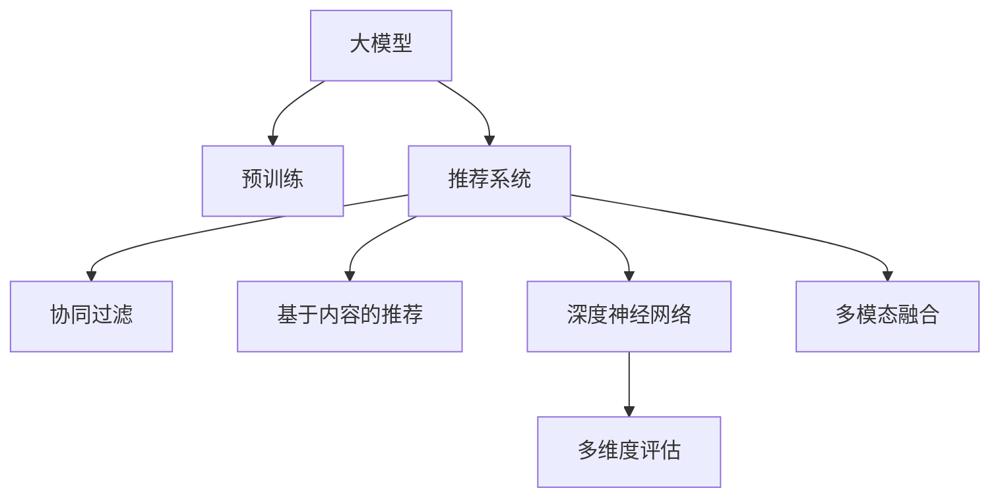

                 

# 大模型在推荐系统多维度评估中的应用

> 关键词：大模型推荐系统评估多维度评估策略深度学习

## 1. 背景介绍

### 1.1 问题由来
随着互联网技术的飞速发展和个性化需求的不断提升，推荐系统已成为各大电商、社交、媒体平台不可或缺的核心功能。其通过深度学习等先进技术，从海量用户行为数据中挖掘出隐藏的隐含关系，构建个性化推荐引擎，为用户推荐感兴趣的物品。

推荐系统的核心目标是通过对用户行为的分析和建模，预测用户未来的偏好，并按照一定策略为用户推荐物品，从而提高用户满意度、平台留存率和交易转化率。然而，推荐系统构建并非易事，其涉及到多维度的数据来源、复杂的用户行为建模、高效的推荐算法等多个环节。

### 1.2 问题核心关键点
当前推荐系统常用的技术框架主要基于深度学习模型，利用用户的历史行为数据和物品属性信息，通过监督学习或无监督学习训练推荐模型。常见的方法包括协同过滤、基于内容的推荐、深度神经网络等。

但这些模型大多依赖大量的用户行为数据，且在训练和推理时资源消耗较大。同时，推荐系统的性能评估也需要涵盖多个维度，如准确性、多样性、新颖性、公平性等。如何在保证推荐结果准确性的同时，提升推荐的多样性和新颖性，并保证推荐公平性，是一个重要且复杂的任务。

为了提升推荐系统性能，近年来大模型（Large Model）技术也逐渐被引入。大模型通过在大规模数据上进行预训练，具备较强的语言理解和生成能力，可以整合多模态信息，提升推荐系统的效果。本文将深入探讨大模型在推荐系统多维度评估中的应用，以期为推荐系统性能提升提供新的方向。

## 2. 核心概念与联系

### 2.1 核心概念概述

为更好地理解大模型在推荐系统中的应用，本节将介绍几个关键概念：

- 大模型（Large Model）：以自回归（如GPT）或自编码（如BERT）模型为代表的大规模预训练模型。通过在大规模数据上进行预训练，学习到丰富的语义表示和关联关系，具备强大的语言理解和生成能力。

- 推荐系统（Recommendation System）：通过分析用户历史行为数据和物品特征，预测用户对物品的偏好，并按照一定规则为用户推荐物品的系统。包括协同过滤、基于内容的推荐、深度学习等主流方法。

- 多维度评估策略（Multi-dimensional Evaluation）：推荐系统的性能评估需要涵盖多个维度，包括准确性、多样性、新颖性、公平性等，用以全面衡量推荐系统的效果。

- 深度学习（Deep Learning）：基于神经网络的深度学习模型在推荐系统中应用广泛，通过构建复杂网络结构，学习和抽取用户行为和物品特征的隐含关系，提升推荐效果。

- 预训练（Pre-training）：在大规模无标签数据上训练模型，学习到通用的语言表示和关联关系，然后通过微调（Fine-tuning）适配特定任务，提升模型的性能。

- 多模态融合（Multi-modal Fusion）：将图像、文本、音频等多模态信息进行整合，提升推荐系统的效果，丰富用户体验。

这些概念之间的逻辑关系可以通过以下Mermaid流程图来展示：



这个流程图展示了大模型、推荐系统与相关评估维度之间的关系：

1. 大模型通过预训练获得基础能力。
2. 推荐系统通过深度学习模型进行用户行为建模和物品推荐。
3. 多维度评估用于全面衡量推荐系统的效果。

这些概念共同构成了推荐系统和大模型评估的基本框架，使得我们能够更好地把握推荐系统的工作原理和优化方向。

## 3. 核心算法原理 & 具体操作步骤
### 3.1 算法原理概述

大模型在推荐系统中的主要应用是提升推荐结果的多样性、新颖性和公平性，同时通过多维度评估策略，全面衡量推荐系统的效果。具体算法原理如下：

1. **多维度评估策略**：
   - **准确性（Accuracy）**：推荐结果与用户实际偏好匹配度。常用指标如精、召、F1值等。
   - **多样性（Diversity）**：推荐结果覆盖范围。常用指标如Damerau-Levenshtein距离、互信息等。
   - **新颖性（Novelty）**：推荐结果的独特性。常用指标如自相关性、覆盖率等。
   - **公平性（Fairness）**：推荐结果的公平程度。常用指标如均等指数、差异指数等。

2. **大模型在推荐系统中的应用**：
   - **特征提取**：利用大模型提取用户行为和物品特征的隐含关系，提升推荐系统的准确性。
   - **推荐生成**：将提取的特征输入大模型进行推理，生成推荐结果。
   - **多模态融合**：将图像、文本、音频等多模态信息进行整合，提升推荐系统的效果。

### 3.2 算法步骤详解

大模型在推荐系统中的应用一般包括以下几个关键步骤：

**Step 1: 准备预训练模型和数据集**
- 选择合适的预训练模型，如GPT、BERT等。
- 准备推荐系统的训练集、验证集和测试集，一般要求数据与预训练数据的分布不要差异过大。

**Step 2: 添加任务适配层**
- 根据任务类型，在预训练模型顶层设计合适的输出层和损失函数。
- 对于分类任务，通常在顶层添加线性分类器和交叉熵损失函数。
- 对于生成任务，通常使用语言模型的解码器输出概率分布，并以负对数似然为损失函数。

**Step 3: 设置微调超参数**
- 选择合适的优化算法及其参数，如 AdamW、SGD 等，设置学习率、批大小、迭代轮数等。
- 设置正则化技术及强度，包括权重衰减、Dropout、Early Stopping等。
- 确定冻结预训练参数的策略，如仅微调顶层，或全部参数都参与微调。

**Step 4: 执行梯度训练**
- 将训练集数据分批次输入模型，前向传播计算损失函数。
- 反向传播计算参数梯度，根据设定的优化算法和学习率更新模型参数。
- 周期性在验证集上评估模型性能，根据性能指标决定是否触发 Early Stopping。
- 重复上述步骤直到满足预设的迭代轮数或 Early Stopping 条件。

**Step 5: 测试和部署**
- 在测试集上评估微调后模型 $M_{\hat{\theta}}$ 的性能，对比微调前后的精度提升。
- 使用微调后的模型对新样本进行推理预测，集成到实际的应用系统中。
- 持续收集新的数据，定期重新微调模型，以适应数据分布的变化。

以上是基于大模型的推荐系统微调流程的一般流程。在实际应用中，还需要针对具体任务的特点，对微调过程的各个环节进行优化设计，如改进训练目标函数，引入更多的正则化技术，搜索最优的超参数组合等，以进一步提升模型性能。

### 3.3 算法优缺点

基于大模型的推荐系统微调方法具有以下优点：
1. 简单高效。只需准备少量标注数据，即可对预训练模型进行快速适配，获得较大的性能提升。
2. 通用适用。适用于各种推荐任务，包括分类、匹配、生成等，设计简单的任务适配层即可实现微调。
3. 参数高效。利用参数高效微调技术，在固定大部分预训练权重不变的情况下，仍可取得不错的提升。
4. 效果显著。在学术界和工业界的诸多推荐任务上，基于微调的方法已经刷新了多项SOTA。

同时，该方法也存在一定的局限性：
1. 依赖标注数据。推荐系统的性能很大程度上取决于标注数据的质量和数量，获取高质量标注数据的成本较高。
2. 迁移能力有限。当目标任务与预训练数据的分布差异较大时，微调的性能提升有限。
3. 负面效果传递。预训练模型的固有偏见、有害信息等，可能通过微调传递到下游任务，造成负面影响。
4. 可解释性不足。推荐系统的决策过程通常缺乏可解释性，难以对其推理逻辑进行分析和调试。

尽管存在这些局限性，但就目前而言，基于大模型的推荐系统微调方法仍是最主流范式。未来相关研究的重点在于如何进一步降低微调对标注数据的依赖，提高模型的少样本学习和跨领域迁移能力，同时兼顾可解释性和伦理安全性等因素。

### 3.4 算法应用领域

基于大模型的推荐系统微调方法在推荐系统领域已经得到了广泛的应用，涵盖以下多个领域：

- **电商推荐**：如京东、淘宝等电商平台通过推荐系统为用户推荐商品，提升用户购买体验和平台转化率。
- **社交媒体推荐**：如Facebook、Twitter等社交平台，通过推荐系统为用户推荐朋友、内容，增强用户粘性。
- **新闻推荐**：如今日头条、知乎等平台，通过推荐系统为用户推荐新闻、文章，提升用户留存率和平台曝光率。
- **音乐、视频推荐**：如Spotify、Netflix等平台，通过推荐系统为用户推荐音乐、影片，提升用户体验和平台收益。
- **旅游、生活服务推荐**：如携程、美团等平台，通过推荐系统为用户推荐旅游产品、生活服务，提升用户满意度和平台收益。

除了上述这些经典应用外，大模型的推荐系统微调也被创新性地应用到更多场景中，如个性化推荐、内容生成、广告推荐等，为推荐系统技术带来了全新的突破。随着预训练模型和微调方法的不断进步，相信推荐系统必将在更广阔的应用领域大放异彩。

## 4. 数学模型和公式 & 详细讲解  
### 4.1 数学模型构建

本节将使用数学语言对大模型在推荐系统中的应用进行更加严格的刻画。

记大模型为 $M_{\theta}$，其中 $\theta$ 为模型参数。假设推荐系统的训练集为 $D=\{(x_i,y_i)\}_{i=1}^N$，$x_i \in \mathcal{X}, y_i \in \mathcal{Y}$，其中 $\mathcal{X}$ 为输入空间，$\mathcal{Y}$ 为输出空间。

定义模型 $M_{\theta}$ 在输入 $x$ 上的输出为 $M_{\theta}(x) \in [0,1]$，表示用户对物品的兴趣程度。真实标签 $y \in \{0,1\}$。则推荐系统的损失函数为：

$$
\ell(M_{\theta}(x),y) = -[y\log M_{\theta}(x) + (1-y)\log (1-M_{\theta}(x))]
$$

将其代入经验风险公式，得：

$$
\mathcal{L}(\theta) = -\frac{1}{N}\sum_{i=1}^N [y_i\log M_{\theta}(x_i)+(1-y_i)\log(1-M_{\theta}(x_i))]
$$

在得到损失函数的梯度后，即可带入参数更新公式，完成模型的迭代优化。重复上述过程直至收敛，最终得到适应推荐任务的最优模型参数 $\theta^*$。

### 4.2 公式推导过程

以下我们以二分类任务为例，推导交叉熵损失函数及其梯度的计算公式。

假设模型 $M_{\theta}$ 在输入 $x$ 上的输出为 $\hat{y}=M_{\theta}(x) \in [0,1]$，表示用户对物品的兴趣程度。真实标签 $y \in \{0,1\}$。则二分类交叉熵损失函数定义为：

$$
\ell(M_{\theta}(x),y) = -[y\log \hat{y} + (1-y)\log (1-\hat{y})]
$$

将其代入经验风险公式，得：

$$
\mathcal{L}(\theta) = -\frac{1}{N}\sum_{i=1}^N [y_i\log M_{\theta}(x_i)+(1-y_i)\log(1-M_{\theta}(x_i))]
$$

根据链式法则，损失函数对参数 $\theta_k$ 的梯度为：

$$
\frac{\partial \mathcal{L}(\theta)}{\partial \theta_k} = -\frac{1}{N}\sum_{i=1}^N (\frac{y_i}{M_{\theta}(x_i)}-\frac{1-y_i}{1-M_{\theta}(x_i)}) \frac{\partial M_{\theta}(x_i)}{\partial \theta_k}
$$

其中 $\frac{\partial M_{\theta}(x_i)}{\partial \theta_k}$ 可进一步递归展开，利用自动微分技术完成计算。

在得到损失函数的梯度后，即可带入参数更新公式，完成模型的迭代优化。重复上述过程直至收敛，最终得到适应推荐任务的最优模型参数 $\theta^*$。

## 5. 项目实践：代码实例和详细解释说明
### 5.1 开发环境搭建

在进行推荐系统微调实践前，我们需要准备好开发环境。以下是使用Python进行PyTorch开发的环境配置流程：

1. 安装Anaconda：从官网下载并安装Anaconda，用于创建独立的Python环境。

2. 创建并激活虚拟环境：
```bash
conda create -n pytorch-env python=3.8 
conda activate pytorch-env
```

3. 安装PyTorch：根据CUDA版本，从官网获取对应的安装命令。例如：
```bash
conda install pytorch torchvision torchaudio cudatoolkit=11.1 -c pytorch -c conda-forge
```

4. 安装Transformers库：
```bash
pip install transformers
```

5. 安装各类工具包：
```bash
pip install numpy pandas scikit-learn matplotlib tqdm jupyter notebook ipython
```

完成上述步骤后，即可在`pytorch-env`环境中开始推荐系统微调实践。

### 5.2 源代码详细实现

下面我们以电商推荐系统为例，给出使用Transformers库对BERT模型进行推荐系统微调的PyTorch代码实现。

首先，定义推荐系统的训练数据集：

```python
from torch.utils.data import Dataset, DataLoader
import torch
import numpy as np

class RecommendationDataset(Dataset):
    def __init__(self, X, Y, tokenizer, max_len=128):
        self.X = X
        self.Y = Y
        self.tokenizer = tokenizer
        self.max_len = max_len
        
    def __len__(self):
        return len(self.X)
    
    def __getitem__(self, item):
        x = self.X[item]
        y = self.Y[item]
        
        encoding = self.tokenizer(x, return_tensors='pt', max_length=self.max_len, padding='max_length', truncation=True)
        input_ids = encoding['input_ids'][0]
        attention_mask = encoding['attention_mask'][0]
        
        # 将y转化为label向量
        y = torch.tensor(y, dtype=torch.long)
        y = y.unsqueeze(0)
        
        return {'input_ids': input_ids, 
                'attention_mask': attention_mask,
                'labels': y}

# 假设X为文本特征，Y为标签
tokenizer = BertTokenizer.from_pretrained('bert-base-cased')

train_dataset = RecommendationDataset(train_X, train_Y, tokenizer)
dev_dataset = RecommendationDataset(dev_X, dev_Y, tokenizer)
test_dataset = RecommendationDataset(test_X, test_Y, tokenizer)
```

然后，定义模型和优化器：

```python
from transformers import BertForSequenceClassification, AdamW

model = BertForSequenceClassification.from_pretrained('bert-base-cased', num_labels=2)

optimizer = AdamW(model.parameters(), lr=2e-5)
```

接着，定义训练和评估函数：

```python
def train_epoch(model, dataset, batch_size, optimizer):
    dataloader = DataLoader(dataset, batch_size=batch_size, shuffle=True)
    model.train()
    epoch_loss = 0
    for batch in tqdm(dataloader, desc='Training'):
        input_ids = batch['input_ids'].to(device)
        attention_mask = batch['attention_mask'].to(device)
        labels = batch['labels'].to(device)
        model.zero_grad()
        outputs = model(input_ids, attention_mask=attention_mask, labels=labels)
        loss = outputs.loss
        epoch_loss += loss.item()
        loss.backward()
        optimizer.step()
    return epoch_loss / len(dataloader)

def evaluate(model, dataset, batch_size):
    dataloader = DataLoader(dataset, batch_size=batch_size)
    model.eval()
    preds, labels = [], []
    with torch.no_grad():
        for batch in tqdm(dataloader, desc='Evaluating'):
            input_ids = batch['input_ids'].to(device)
            attention_mask = batch['attention_mask'].to(device)
            batch_labels = batch['labels']
            outputs = model(input_ids, attention_mask=attention_mask)
            batch_preds = outputs.logits.argmax(dim=2).to('cpu').tolist()
            batch_labels = batch_labels.to('cpu').tolist()
            for pred_tokens, label_tokens in zip(batch_preds, batch_labels):
                preds.append(pred_tokens)
                labels.append(label_tokens)
                
    print(classification_report(labels, preds))
```

最后，启动训练流程并在测试集上评估：

```python
epochs = 5
batch_size = 16

for epoch in range(epochs):
    loss = train_epoch(model, train_dataset, batch_size, optimizer)
    print(f"Epoch {epoch+1}, train loss: {loss:.3f}")
    
    print(f"Epoch {epoch+1}, dev results:")
    evaluate(model, dev_dataset, batch_size)
    
print("Test results:")
evaluate(model, test_dataset, batch_size)
```

以上就是使用PyTorch对BERT进行电商推荐系统微调的完整代码实现。可以看到，得益于Transformers库的强大封装，我们可以用相对简洁的代码完成BERT模型的加载和微调。

### 5.3 代码解读与分析

让我们再详细解读一下关键代码的实现细节：

**RecommendationDataset类**：
- `__init__`方法：初始化文本、标签、分词器等关键组件。
- `__len__`方法：返回数据集的样本数量。
- `__getitem__`方法：对单个样本进行处理，将文本输入编码为token ids，将标签转化为数字，并对其进行定长padding，最终返回模型所需的输入。

**模型和优化器**：
- 使用PyTorch的BertForSequenceClassification模块，指定模型为二分类任务。
- 定义AdamW优化器，设置学习率为2e-5。

**训练和评估函数**：
- 使用PyTorch的DataLoader对数据集进行批次化加载，供模型训练和推理使用。
- 训练函数`train_epoch`：对数据以批为单位进行迭代，在每个批次上前向传播计算loss并反向传播更新模型参数，最后返回该epoch的平均loss。
- 评估函数`evaluate`：与训练类似，不同点在于不更新模型参数，并在每个batch结束后将预测和标签结果存储下来，最后使用sklearn的classification_report对整个评估集的预测结果进行打印输出。

**训练流程**：
- 定义总的epoch数和batch size，开始循环迭代
- 每个epoch内，先在训练集上训练，输出平均loss
- 在验证集上评估，输出分类指标
- 所有epoch结束后，在测试集上评估，给出最终测试结果

可以看到，PyTorch配合Transformers库使得BERT微调的代码实现变得简洁高效。开发者可以将更多精力放在数据处理、模型改进等高层逻辑上，而不必过多关注底层的实现细节。

当然，工业级的系统实现还需考虑更多因素，如模型的保存和部署、超参数的自动搜索、更灵活的任务适配层等。但核心的微调范式基本与此类似。

## 6. 实际应用场景
### 6.1 电商推荐系统

基于大模型微调的推荐系统可以广泛应用于电商平台的商品推荐。传统电商推荐系统往往依赖用户的历史点击、浏览、购买等行为数据进行推荐，难以发现用户的潜在兴趣。而使用微调后的推荐模型，可以更好地理解和预测用户需求，提高推荐的相关性和个性化程度。

在技术实现上，可以收集用户的浏览、点击、收藏、购买等行为数据，将商品标题、描述、类别等信息作为输入，在商品库上进行微调。微调后的模型能够自动学习用户对商品类别的偏好，生成个性化推荐列表。对于用户浏览但未购买的新商品，模型还可以根据用户历史偏好，进行预测推荐。如此构建的电商推荐系统，能大幅提升用户购买体验和平台转化率。

### 6.2 社交媒体推荐

社交媒体推荐系统通过分析用户的兴趣和行为，为用户推荐可能感兴趣的朋友、内容、话题等，增加用户粘性和平台活跃度。当前社交媒体推荐系统大多依赖简单的协同过滤和基于内容的推荐方法，难以全面理解用户的复杂兴趣和行为。

使用微调后的推荐模型，可以通过用户的历史互动数据（如点赞、评论、分享等）进行训练，学习用户的兴趣变化和动态行为特征。结合自然语言处理技术，模型能够理解用户评论、动态等内容，生成更加符合用户偏好的推荐结果。对于热门话题或事件，模型还可以根据用户兴趣进行动态推荐，提升用户的参与度和满意度。

### 6.3 新闻推荐

新闻推荐系统通过分析用户的历史阅读数据和新闻内容，为用户推荐可能感兴趣的新闻文章。传统的推荐系统大多依赖简单的协同过滤方法，难以全面考虑新闻的时效性和用户兴趣的动态变化。

使用微调后的推荐模型，可以通过用户的历史阅读数据和新闻内容进行训练，学习新闻和用户兴趣的隐含关系。结合自然语言处理技术，模型能够理解新闻标题、摘要等内容，生成更加符合用户偏好的推荐结果。对于热门新闻或突发事件，模型还可以根据用户兴趣进行动态推荐，提高用户的阅读体验和平台曝光率。

### 6.4 视频推荐

视频推荐系统通过分析用户的历史观看数据和视频内容，为用户推荐可能感兴趣的视频。传统的推荐系统大多依赖简单的协同过滤方法，难以全面考虑视频的类型、时长、用户兴趣等因素。

使用微调后的推荐模型，可以通过用户的历史观看数据和视频内容进行训练，学习视频的类型、时长、用户兴趣等特征。结合自然语言处理技术，模型能够理解视频标题、简介等内容，生成更加符合用户偏好的推荐结果。对于热门视频或新视频，模型还可以根据用户兴趣进行动态推荐，提高用户的观看体验和平台收益。

### 6.5 音乐推荐

音乐推荐系统通过分析用户的历史听歌数据和歌曲特征，为用户推荐可能感兴趣的歌曲。传统的推荐系统大多依赖简单的协同过滤方法，难以全面考虑歌曲的类型、时长、用户兴趣等因素。

使用微调后的推荐模型，可以通过用户的历史听歌数据和歌曲特征进行训练，学习歌曲的类型、时长、用户兴趣等特征。结合自然语言处理技术，模型能够理解歌曲的歌词、歌手信息等内容，生成更加符合用户偏好的推荐结果。对于热门歌曲或新歌曲，模型还可以根据用户兴趣进行动态推荐，提高用户的听歌体验和平台收益。

## 7. 工具和资源推荐
### 7.1 学习资源推荐

为了帮助开发者系统掌握大模型在推荐系统中的应用，这里推荐一些优质的学习资源：

1. 《深度学习推荐系统》书籍：全面介绍了推荐系统的基础理论、常用方法和实际应用，推荐系统理论的集大成之作。

2. 《推荐系统实战》课程：讲解了推荐系统的常见技术和工程实践，包括协同过滤、深度学习、多模态融合等，适合实战开发。

3. 《大规模推荐系统》论文集：收集了推荐系统领域的经典论文，涵盖了推荐算法、评价指标、推荐效果等，是推荐系统理论研究的重要参考资料。

4. HuggingFace官方文档：包含大量预训练语言模型和推荐系统的代码样例，是快速上手实践的好帮手。

5. 《推荐系统评估》博客：系统讲解了推荐系统评估的常用指标和计算方法，适合快速入门推荐系统的性能评估。

通过对这些资源的学习实践，相信你一定能够快速掌握大模型在推荐系统中的应用，并用于解决实际的推荐问题。
###  7.2 开发工具推荐

高效的开发离不开优秀的工具支持。以下是几款用于推荐系统微调开发的常用工具：

1. PyTorch：基于Python的开源深度学习框架，灵活动态的计算图，适合快速迭代研究。大部分推荐模型都有PyTorch版本的实现。

2. TensorFlow：由Google主导开发的开源深度学习框架，生产部署方便，适合大规模工程应用。同样有丰富的推荐模型资源。

3. Transformers库：HuggingFace开发的NLP工具库，集成了众多SOTA语言模型，支持PyTorch和TensorFlow，是进行推荐系统微调的重要工具。

4. Weights & Biases：模型训练的实验跟踪工具，可以记录和可视化模型训练过程中的各项指标，方便对比和调优。与主流深度学习框架无缝集成。

5. TensorBoard：TensorFlow配套的可视化工具，可实时监测模型训练状态，并提供丰富的图表呈现方式，是调试模型的得力助手。

6. Apache Spark：大数据计算框架，适合处理大规模推荐数据，提供高效的分布式计算能力。

合理利用这些工具，可以显著提升推荐系统微调的开发效率，加快创新迭代的步伐。

### 7.3 相关论文推荐

推荐系统领域的研究来源于学界的持续研究。以下是几篇奠基性的相关论文，推荐阅读：

1. Item-based Collaborative Filtering: Algorithmic Paradigms and System Design：经典的协同过滤算法，探讨了基于用户-物品矩阵的推荐方法。

2. Factorization Machines for Recommender Systems：提出Factorization Machines方法，在协同过滤推荐中取得了较好的效果。

3. Deep Learning with Libraries: A Survey: Deep Learning for Recommendation Systems：介绍了深度学习在推荐系统中的应用，包括神经网络、卷积神经网络、循环神经网络等。

4. Neural Collaborative Filtering：提出神经协同过滤方法，结合神经网络进行推荐，提升了推荐效果。

5. Multi-Task Learning for Recommendation Systems：研究了多任务学习在推荐系统中的应用，提高了推荐的多样性和公平性。

6. Attention Mechanism in Recommendation Systems：提出注意力机制在推荐系统中的应用，提升了推荐的个性化程度。

这些论文代表了大模型在推荐系统中的研究和应用脉络。通过学习这些前沿成果，可以帮助研究者把握学科前进方向，激发更多的创新灵感。

## 8. 总结：未来发展趋势与挑战

### 8.1 总结

本文对基于大模型的推荐系统多维度评估方法进行了全面系统的介绍。首先阐述了大模型和推荐系统的发展背景和意义，明确了推荐系统在大规模数据上的优势。其次，从原理到实践，详细讲解了大模型在推荐系统中的应用方法和关键步骤，给出了推荐系统微调任务开发的完整代码实例。同时，本文还广泛探讨了大模型在电商、社交媒体、新闻、音乐等多个领域的应用前景，展示了大模型在推荐系统中的巨大潜力。此外，本文精选了推荐系统的各类学习资源，力求为开发者提供全方位的技术指引。

通过本文的系统梳理，可以看到，基于大模型的推荐系统在多维度评估中展示了强大的能力，极大提升了推荐系统的性能和用户体验。大模型在推荐系统中的应用，已经成为NLP领域的一个重要范式，有望进一步推动推荐系统向更广阔的领域发展。

### 8.2 未来发展趋势

展望未来，大模型在推荐系统中的应用将呈现以下几个发展趋势：

1. 模型规模持续增大。随着算力成本的下降和数据规模的扩张，预训练语言模型的参数量还将持续增长。超大规模语言模型蕴含的丰富语言知识，有望支撑更加复杂多变的推荐任务。

2. 推荐算法日趋多样。除了传统的协同过滤和深度学习，未来还会涌现更多推荐算法，如多任务学习、多模态融合等，提升推荐系统的性能和多样化。

3. 数据利用更加高效。推荐系统将更好地利用数据，通过数据增强、对抗训练等技术，提升模型的泛化能力和鲁棒性。

4. 模型压缩和优化。随着推荐系统应用场景的广泛化，模型的计算效率和资源利用率将受到更多关注。未来的研究将进一步优化模型结构，提高推荐系统的实时性和稳定性。

5. 推荐效果评估更加全面。推荐系统将更加注重多样性、新颖性、公平性等指标，全面评估推荐效果，提升用户体验。

6. 跨领域推荐。推荐系统将更好地整合不同领域的数据，提升推荐的泛化能力和跨领域适应性。

以上趋势凸显了大模型在推荐系统中的广阔前景。这些方向的探索发展，必将进一步提升推荐系统的性能和用户体验，为推荐系统技术带来新的突破。

### 8.3 面临的挑战

尽管大模型在推荐系统中的应用已经取得了显著成果，但在迈向更加智能化、普适化应用的过程中，它仍面临诸多挑战：

1. 推荐数据的复杂性。推荐数据来源于用户行为数据，具有高维度、稀疏性等特点，难以通过简单的特征提取进行建模。如何更好地利用这些数据，提升推荐模型的性能，仍是一个重要问题。

2. 推荐系统的鲁棒性。推荐系统面对的新数据往往与历史数据分布不同，导致推荐模型的泛化性能下降。如何在保证推荐效果的同时，提升模型的鲁棒性，仍然是一个难点。

3. 推荐系统的公平性。推荐系统可能存在性别、年龄、地域等偏见，对某些用户群体造成不公平。如何构建公平的推荐系统，确保推荐结果的公正性，仍然是一个挑战。

4. 推荐系统的可解释性。推荐系统的决策过程通常缺乏可解释性，难以对其推理逻辑进行分析和调试。如何提升推荐系统的可解释性，增强用户信任感，仍然是一个重要的研究方向。

5. 推荐系统的实时性。推荐系统需要实时响应用户需求，而大模型推理时间较长，导致系统响应慢。如何在保证推荐效果的同时，提高系统的实时性，仍然是一个重要问题。

6. 推荐系统的用户隐私保护。推荐系统需要收集用户行为数据，可能涉及用户隐私信息。如何保护用户隐私，确保数据安全，仍然是一个重要问题。

尽管存在这些挑战，但大模型在推荐系统中的应用前景广阔，其不断演进和优化，将推动推荐系统向更加智能化、普适化方向发展。

### 8.4 未来突破

面对大模型在推荐系统中的应用所面临的诸多挑战，未来的研究需要在以下几个方面寻求新的突破：

1. 探索无监督和半监督推荐方法。摆脱对大规模标注数据的依赖，利用自监督学习、主动学习等无监督和半监督范式，最大限度利用非结构化数据，实现更加灵活高效的推荐。

2. 研究参数高效和计算高效的推荐范式。开发更加参数高效的推荐方法，在固定大部分预训练权重不变的情况下，只更新极少量的任务相关参数。同时优化推荐模型的计算图，减少前向传播和反向传播的资源消耗，实现更加轻量级、实时性的部署。

3. 引入更多先验知识。将符号化的先验知识，如知识图谱、逻辑规则等，与神经网络模型进行巧妙融合，引导推荐过程学习更准确、合理的推荐结果。同时加强不同模态数据的整合，实现视觉、文本、音频等多模态信息与推荐结果的协同建模。

4. 结合因果分析和博弈论工具。将因果分析方法引入推荐模型，识别出推荐决策的关键特征，增强推荐结果的因果性和逻辑性。借助博弈论工具刻画人机交互过程，主动探索并规避推荐模型的脆弱点，提高系统稳定性。

5. 纳入伦理道德约束。在推荐目标中引入伦理导向的评估指标，过滤和惩罚有偏见、有害的推荐结果。同时加强人工干预和审核，建立推荐行为的监管机制，确保推荐结果的公正性。

这些研究方向将引领大模型在推荐系统中的进一步发展，为构建安全、可靠、可解释、可控的推荐系统铺平道路。面向未来，大模型在推荐系统中的应用还需要与其他人工智能技术进行更深入的融合，如知识表示、因果推理、强化学习等，多路径协同发力，共同推动推荐系统向更广阔的领域发展。只有勇于创新、敢于突破，才能不断拓展推荐系统的边界，让推荐系统更好地服务用户和社会。

## 9. 附录：常见问题与解答

**Q1：大模型推荐系统是否适用于所有推荐任务？**

A: 大模型推荐系统在大多数推荐任务上都能取得不错的效果，特别是对于数据量较小的任务。但对于一些特定领域的任务，如医学、法律等，仅仅依靠通用语料预训练的模型可能难以很好地适应。此时需要在特定领域语料上进一步预训练，再进行微调，才能获得理想效果。此外，对于一些需要时效性、个性化很强的任务，如对话、推荐等，微调方法也需要针对性的改进优化。

**Q2：如何选择合适的推荐算法？**

A: 推荐算法的选择应综合考虑任务特点、数据规模、计算资源等因素。常用的推荐算法包括协同过滤、基于内容的推荐、深度学习等。协同过滤方法适用于数据规模较大的推荐场景，但难以处理复杂多变的推荐需求。基于内容的推荐方法适用于数据规模较小的推荐场景，但需要手动提取特征。深度学习推荐方法适用于数据规模和特征复杂度均较高的推荐场景，能够学习到隐含的特征关系，提升推荐效果。

**Q3：推荐系统多维度评估策略具体如何应用？**

A: 推荐系统多维度评估策略通常通过以下几个步骤实施：
1. 收集用户行为数据，生成训练集和测试集。
2. 选择适合的推荐算法，训练模型。
3. 设计评估指标，如准确性、多样性、新颖性、公平性等。
4. 在测试集上评估模型，生成评估报告。
5. 根据评估报告，调整模型参数，优化推荐策略。

评估指标的选择应根据具体任务和业务需求，综合考虑推荐效果和用户体验。例如，电商推荐系统应注重用户点击率、购买转化率等指标，社交媒体推荐系统应注重用户参与度、兴趣变化等指标。

**Q4：大模型推荐系统如何缓解过拟合问题？**

A: 过拟合是推荐系统面临的主要问题之一，尤其是在标注数据较少的情况下。缓解过拟合的策略包括：
1. 数据增强：通过数据扩充、回译等方式增加训练集多样性。
2. 正则化：使用L2正则、Dropout等技术，防止模型过度拟合训练数据。
3. 早停机制：在验证集上监测模型性能，及时停止训练，避免过拟合。
4. 参数共享：共享部分预训练权重，减少模型复杂度，降低过拟合风险。
5. 模型压缩：采用剪枝、量化等技术，压缩模型规模，提升推理效率。

这些策略需要根据具体任务和数据特点进行灵活组合，以进一步提升推荐系统的泛化能力和鲁棒性。

**Q5：大模型推荐系统如何在多模态融合中发挥作用？**

A: 大模型在多模态融合中的应用主要体现在以下几个方面：
1. 文本特征提取：利用大模型提取文本特征，提升推荐模型的准确性。
2. 图像特征提取：利用大模型提取图像特征，提升推荐模型的多样性。
3. 音频特征提取：利用大模型提取音频特征，提升推荐模型的新颖性。
4. 跨模态融合：将文本、图像、音频等多种模态信息进行融合，提升推荐模型的全面性和综合性。

在多模态融合中，大模型可以整合多模态信息，提升推荐模型的性能和用户体验。例如，在音乐推荐系统中，可以结合用户的历史听歌记录、歌曲的歌词、MV等视频内容，生成更加符合用户偏好的推荐结果。

**Q6：大模型推荐系统在推荐结果的公平性中如何处理？**

A: 推荐结果的公平性处理需要考虑以下几个方面：
1. 数据采样：确保训练数据和测试数据中各类用户群体的分布平衡，避免数据偏见。
2. 模型训练：在模型训练中引入公平性约束，如均等指数、差异指数等，确保推荐结果的公正性。
3. 推荐策略：在推荐策略中引入公平性调整，如优先推荐小众群体感兴趣的物品，避免推荐结果过于偏向热门群体。
4. 用户反馈：引入用户反馈机制，动态调整推荐策略，提升推荐结果的公平性。

这些策略需要根据具体任务和业务需求，综合考虑推荐效果和公平性。例如，在电商推荐系统中，可以优先推荐小众群体感兴趣的商品，提升其购物体验，同时避免热门商品的过度推荐，确保推荐结果的公正性。

通过本文的系统梳理，可以看到，大模型在推荐系统中的应用前景广阔，其在多维度评估中的效果显著。未来的研究将进一步探索大模型在推荐系统中的应用潜力，为推荐系统技术带来新的突破。

---

作者：禅与计算机程序设计艺术 / Zen and the Art of Computer Programming

