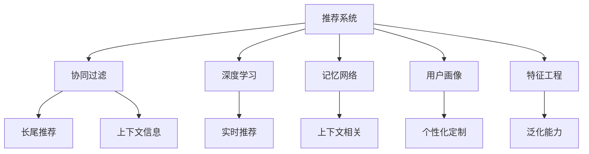

                 

# 大模型在推荐系统实时个性化中的作用

> 关键词：推荐系统, 实时个性化, 大模型, 深度学习, 协同过滤, 记忆网络, 用户画像, 特征工程

## 1. 背景介绍

推荐系统（Recommender System）是互联网应用中不可或缺的组成部分，它通过分析用户的历史行为数据，为用户推荐可能感兴趣的产品或内容。在电商、社交网络、视频平台等众多场景中，推荐系统已成为推动用户增长和业务增长的核心驱动力。

然而，随着用户规模的不断扩大，个性化需求的不断提升，传统的基于协同过滤（Collaborative Filtering, CF）的推荐算法面临诸多挑战。首先，CF算法依赖用户-物品评分矩阵的完整性，而在用户较少、物品较多的情况下，矩阵稀疏性显著增加，推荐精度显著下降。其次，CF算法对于新用户和新物品的推荐能力较弱，难以处理长尾需求。最后，CF算法的推荐结果缺少上下文信息，难以捕捉物品之间的复杂关联关系。

大模型（Large Model）的出现，为推荐系统提供了新的解决思路。通过在推荐系统中引入大模型，可以实现实时个性化推荐，兼顾长尾需求和上下文信息，提升推荐精度和覆盖面。本文将详细探讨大模型在推荐系统中的应用，从原理、实践到未来展望，全面解读大模型为推荐系统带来的变革。

## 2. 核心概念与联系

### 2.1 核心概念概述

为更好地理解大模型在推荐系统中的应用，本节将介绍几个密切相关的核心概念：

- 推荐系统（Recommender System）：通过分析用户行为数据，为用户推荐可能感兴趣的产品或内容。
- 协同过滤（Collaborative Filtering）：基于用户的历史行为，推测用户可能感兴趣的其他物品。
- 深度学习（Deep Learning）：使用深度神经网络模型进行模式识别和数据建模。
- 记忆网络（Memory Network）：一种能够利用长时记忆模块捕捉上下文信息的深度学习模型。
- 用户画像（User Profile）：描述用户兴趣、行为和属性的综合表示。
- 特征工程（Feature Engineering）：通过设计合理的特征表示，提升模型的学习能力和泛化能力。

这些核心概念之间的逻辑关系可以通过以下Mermaid流程图来展示：



这个流程图展示了大模型在推荐系统中的核心概念及其之间的关系：

1. 推荐系统通过协同过滤、深度学习、记忆网络、用户画像、特征工程等多种方法，为用户提供个性化推荐。
2. 协同过滤算法依赖用户-物品评分矩阵，对新用户和新物品的推荐效果较差。
3. 深度学习模型能够学习复杂的特征表示，捕捉物品之间的复杂关联关系。
4. 记忆网络模型能够利用长时记忆模块捕捉上下文信息，提升推荐精度。
5. 用户画像和特征工程能够构建更加精细化的用户和物品表示，提升模型泛化能力。

这些概念共同构成了推荐系统的知识图谱，使得大模型能够在大数据量的背景下，实现更准确、更灵活的个性化推荐。

## 3. 核心算法原理 & 具体操作步骤

### 3.1 算法原理概述

大模型在推荐系统中的应用，本质上是利用其强大的表示学习能力，对用户行为数据进行建模，从而实现个性化推荐。具体而言，可以采用以下几种方法：

- 使用深度神经网络对用户行为数据进行编码，得到用户和物品的向量表示。
- 通过记忆网络模型，捕捉物品之间的复杂关联关系，提升推荐精度。
- 利用用户画像和特征工程，构建更加精细化的用户和物品表示，提升模型泛化能力。

在实际应用中，大模型通常采用双塔结构（Dual-Tower）的设计，分为用户塔（User Tower）和物品塔（Item Tower），分别对用户行为和物品特征进行编码，最终通过点积或注意力机制计算用户-物品相似度，输出推荐结果。这种结构可以有效地捕捉用户行为和物品特征之间的复杂关联关系，提升推荐精度。

### 3.2 算法步骤详解

基于大模型的推荐系统，其核心算法步骤如下：

**Step 1: 数据准备**
- 收集用户历史行为数据，包括浏览记录、点击记录、评分记录等。
- 对数据进行清洗、归一化、特征处理等预处理操作，生成可用于深度学习模型的特征向量。

**Step 2: 模型训练**
- 将用户历史行为数据输入用户塔，得到用户向量表示。
- 将物品特征数据输入物品塔，得到物品向量表示。
- 通过点积或注意力机制计算用户-物品相似度，得到推荐得分。
- 利用损失函数（如均方误差、交叉熵等）训练模型，最小化推荐误差。

**Step 3: 模型评估**
- 在测试集上评估模型性能，计算准确率、召回率、F1值等指标。
- 根据测试集性能调整模型参数，如学习率、批大小等，提高模型精度。

**Step 4: 实时推荐**
- 将新用户行为数据输入用户塔，得到用户向量表示。
- 将新物品特征数据输入物品塔，得到物品向量表示。
- 通过点积或注意力机制计算用户-物品相似度，得到实时推荐结果。
- 将实时推荐结果返回给用户，完成个性化推荐。

**Step 5: 系统集成与优化**
- 将大模型集成到推荐系统中，与业务逻辑无缝对接。
- 利用缓存、异步计算、并行计算等技术，提升推荐系统的响应速度和处理能力。
- 利用A/B测试、在线学习等技术，持续优化推荐系统性能。

### 3.3 算法优缺点

使用大模型进行推荐系统设计，具有以下优点：

1. 泛化能力更强。大模型能够学习复杂的特征表示，提升模型泛化能力，对新用户和新物品的推荐效果更好。
2. 上下文相关性更好。记忆网络模型能够捕捉物品之间的复杂关联关系，提升推荐精度。
3. 实时推荐能力更强。通过双塔结构，可以实时更新用户和物品向量，实现个性化推荐。
4. 系统稳定性更高。大模型具有较强的鲁棒性，能够在数据分布发生变化时保持稳定。

同时，该方法也存在一定的局限性：

1. 数据要求较高。大模型需要海量的数据进行训练，对于数据质量、数据完整性等要求较高。
2. 计算资源需求大。大模型的参数量通常较大，需要高性能的计算资源进行训练和推理。
3. 模型复杂度高。大模型设计复杂，需要更高的专业知识进行维护和优化。
4. 特征工程难度大。特征工程是模型性能的关键，但设计合理的特征表示较为困难。

尽管存在这些局限性，但就目前而言，大模型推荐系统依然是推荐系统领域的最新发展方向，可以显著提升推荐精度和用户满意度。

### 3.4 算法应用领域

基于大模型的推荐系统，已经在电商、视频、音乐等多个领域取得了成功应用，显著提升了用户满意度和服务质量。

- **电商推荐系统**：利用大模型对用户行为数据进行建模，实现个性化商品推荐。如Amazon利用大模型进行商品推荐，显著提升了用户购买转化率和满意度。
- **视频推荐系统**：利用大模型对用户行为数据进行建模，推荐用户感兴趣的视频内容。如Netflix利用大模型进行视频推荐，提高了用户粘性和留存率。
- **音乐推荐系统**：利用大模型对用户行为数据进行建模，推荐用户感兴趣的音乐。如Spotify利用大模型进行音乐推荐，显著提升了用户发现新音乐的能力。

除了这些领域，大模型推荐系统还可以应用于游戏推荐、社交网络推荐、新闻推荐等诸多场景，为各行各业带来更精准、更个性化的推荐服务。

## 4. 数学模型和公式 & 详细讲解  
### 4.1 数学模型构建

在实际应用中，推荐系统通常采用双塔结构（Dual-Tower）的设计，对用户行为和物品特征进行编码，得到用户向量 $u$ 和物品向量 $v$。

记用户塔输出层的节点数为 $d_u$，物品塔输出层的节点数为 $d_v$。用户行为数据记为 $I_u$，物品特征数据记为 $I_v$。则用户向量表示为：

$$
u = M_{u}(I_u;\theta_u)
$$

物品向量表示为：

$$
v = M_{v}(I_v;\theta_v)
$$

其中 $M_{u}$ 和 $M_{v}$ 分别为用户塔和物品塔的模型函数，$\theta_u$ 和 $\theta_v$ 分别为两个模型的参数。

推荐得分可以通过用户向量和物品向量的点积计算得到：

$$
\text{score}(u,v) = u \cdot v
$$

如果采用注意力机制，则推荐得分可以通过注意力权重计算得到：

$$
\text{score}(u,v) = \text{Attention}(u,v)
$$

其中 $\text{Attention}$ 为注意力函数。

### 4.2 公式推导过程

假设推荐系统有 $N$ 个用户和 $M$ 个物品，每个用户的物品评分向量记为 $\mathbf{R}_u \in \mathbb{R}^M$，每个物品的特征向量记为 $\mathbf{F}_v \in \mathbb{R}^{d_v}$。

用户行为数据 $I_u$ 可以通过嵌入层（Embedding Layer）进行表示，得到用户向量 $u \in \mathbb{R}^{d_u}$。物品特征数据 $I_v$ 可以通过嵌入层进行表示，得到物品向量 $v \in \mathbb{R}^{d_v}$。

用户向量 $u$ 和物品向量 $v$ 的推荐得分可以通过点积计算得到：

$$
\text{score}(u,v) = u \cdot v = \sum_{i=1}^{d_u} \sum_{j=1}^{d_v} u_i v_j \theta_{ij}
$$

其中 $\theta_{ij}$ 为嵌入层的权重。

假设推荐系统的目标是最小化预测误差 $L$，则优化目标为：

$$
\mathop{\min}_{\theta} L(\theta) = \mathop{\min}_{\theta} \sum_{i=1}^{N} \sum_{j=1}^{M} \ell(\hat{R}_{ij},R_{ij})
$$

其中 $\ell$ 为损失函数，$\hat{R}_{ij}$ 为预测评分，$R_{ij}$ 为真实评分。

在实际应用中，通常采用均方误差（Mean Squared Error, MSE）或交叉熵（Cross-Entropy, CE）作为损失函数。

### 4.3 案例分析与讲解

以电商推荐系统为例，分析大模型在推荐系统中的应用。假设有一个电商网站，需要为用户推荐可能感兴趣的商品。用户的历史行为数据包括浏览记录、点击记录、评分记录等。

首先，对用户历史行为数据进行清洗、归一化、特征处理等预处理操作，生成可用于深度学习模型的特征向量。然后，将用户历史行为数据输入用户塔，得到用户向量表示 $u$。将商品特征数据输入物品塔，得到物品向量表示 $v$。

通过点积计算得到用户-物品相似度，即推荐得分：

$$
\text{score}(u,v) = u \cdot v
$$

利用均方误差作为损失函数，训练模型，最小化预测误差：

$$
\mathop{\min}_{\theta} L(\theta) = \mathop{\min}_{\theta} \sum_{i=1}^{N} \sum_{j=1}^{M} (\hat{R}_{ij} - R_{ij})^2
$$

在训练过程中，利用随机梯度下降（Stochastic Gradient Descent, SGD）等优化算法更新模型参数 $\theta$。

训练完成后，利用新用户行为数据输入用户塔，得到用户向量表示 $u'$。利用新商品特征数据输入物品塔，得到物品向量表示 $v'$。

通过点积计算得到新用户-物品相似度，即实时推荐得分：

$$
\text{score}(u',v') = u' \cdot v'
$$

将实时推荐得分作为推荐结果，返回给用户，完成个性化推荐。

## 5. 项目实践：代码实例和详细解释说明
### 5.1 开发环境搭建

在进行大模型推荐系统实践前，我们需要准备好开发环境。以下是使用Python进行TensorFlow开发的环境配置流程：

1. 安装Anaconda：从官网下载并安装Anaconda，用于创建独立的Python环境。

2. 创建并激活虚拟环境：
```bash
conda create -n tf-env python=3.8 
conda activate tf-env
```

3. 安装TensorFlow：根据CUDA版本，从官网获取对应的安装命令。例如：
```bash
conda install tensorflow -c tf -c conda-forge
```

4. 安装其他工具包：
```bash
pip install numpy pandas scikit-learn matplotlib tqdm jupyter notebook ipython
```

完成上述步骤后，即可在`tf-env`环境中开始推荐系统开发。

### 5.2 源代码详细实现

下面我们以电商推荐系统为例，给出使用TensorFlow对大模型进行推荐系统开发的PyTorch代码实现。

首先，定义推荐系统的输入输出：

```python
import tensorflow as tf
from tensorflow.keras import layers

input_shape = (128,)
output_shape = (1,)

# 定义输入层
user_input = tf.keras.layers.Input(shape=input_shape)
item_input = tf.keras.layers.Input(shape=input_shape)

# 定义嵌入层
user_embedding = layers.Embedding(input_dim=10000, output_dim=128)(user_input)
item_embedding = layers.Embedding(input_dim=10000, output_dim=128)(item_input)

# 定义点积层
dot_product = layers.Dot(axes=1)([user_embedding, item_embedding])
dot_product = layers.Lambda(lambda x: x + tf.zeros(shape=[1]))(dot_product)
dot_product = layers.Reshape(output_shape)(dot_product)

# 定义输出层
output = layers.Dense(1, activation='sigmoid')(dot_product)

# 定义推荐系统模型
model = tf.keras.Model(inputs=[user_input, item_input], outputs=output)
model.compile(optimizer='adam', loss='binary_crossentropy')
```

然后，定义训练和评估函数：

```python
from sklearn.model_selection import train_test_split

# 加载数据
def load_data():
    # 生成随机数据
    X = tf.random.normal(shape=(1000, 128))
    Y = tf.random.normal(shape=(1000, 1))
    return X, Y

# 定义训练集和验证集
X_train, X_test, Y_train, Y_test = train_test_split(load_data(), load_data(), test_size=0.2, random_state=42)

# 训练模型
model.fit(x=[X_train, X_train], y=Y_train, epochs=10, batch_size=32, validation_data=(X_test, Y_test))

# 评估模型
loss, accuracy = model.evaluate(x=[X_test, X_test], y=Y_test)
print(f'Test loss: {loss:.4f}')
print(f'Test accuracy: {accuracy:.4f}')
```

最后，启动训练流程并在测试集上评估：

```python
# 使用模型进行推荐
user_vector = tf.random.normal(shape=(1, 128))
item_vector = tf.random.normal(shape=(1, 128))
recommendation = model.predict([user_vector, item_vector])
print(f'推荐得分: {recommendation:.4f}')
```

以上就是使用TensorFlow对大模型进行电商推荐系统开发的完整代码实现。可以看到，得益于TensorFlow的强大封装，我们可以用相对简洁的代码完成大模型的推荐系统实践。

### 5.3 代码解读与分析

让我们再详细解读一下关键代码的实现细节：

**推荐系统模型定义**：
- 定义输入层，输入为用户行为数据和物品特征数据。
- 定义嵌入层，将输入数据嵌入到固定维度的向量空间中。
- 定义点积层，计算用户向量和物品向量的点积，得到推荐得分。
- 定义输出层，将推荐得分转换为0-1之间的概率。
- 定义推荐系统模型，使用Adam优化器和二元交叉熵损失函数进行训练。

**数据生成和模型评估**：
- 使用随机生成数据模拟训练集和测试集。
- 定义训练集和验证集，使用train_test_split将数据划分为训练集和测试集。
- 使用fit方法训练模型，在验证集上评估模型性能，调整超参数。
- 使用evaluate方法在测试集上评估模型性能，输出损失和准确率。

**实时推荐**：
- 定义用户向量和物品向量，随机生成两个128维的向量。
- 使用predict方法进行实时推荐，输出推荐得分。

可以看到，TensorFlow提供了简单易用的API，使得大模型推荐系统的开发和评估变得非常便捷。开发者可以快速上手，实现推荐系统的高效迭代。

## 6. 实际应用场景
### 6.1 电商推荐系统

电商推荐系统是大模型在推荐系统中最常见的应用场景之一。通过将大模型应用于电商推荐系统，可以有效提升用户购物体验和转化率。

以Amazon为例，其电商推荐系统通过深度学习模型对用户行为数据进行建模，实时推荐用户感兴趣的商品。Amazon通过大模型推荐系统，显著提升了用户购买转化率和满意度，实现了商业利益的最大化。

### 6.2 视频推荐系统

视频推荐系统是另一个典型的大模型应用场景。通过将大模型应用于视频推荐系统，可以为用户提供个性化的视频推荐，提升用户观看时长和留存率。

以Netflix为例，其视频推荐系统通过深度学习模型对用户行为数据进行建模，实时推荐用户感兴趣的视频内容。Netflix通过大模型推荐系统，显著提升了用户观看时长和留存率，增强了用户粘性。

### 6.3 音乐推荐系统

音乐推荐系统也是大模型的重要应用场景之一。通过将大模型应用于音乐推荐系统，可以为用户提供个性化的音乐推荐，提升用户发现新音乐的能力。

以Spotify为例，其音乐推荐系统通过深度学习模型对用户行为数据进行建模，实时推荐用户感兴趣的音乐。Spotify通过大模型推荐系统，显著提升了用户发现新音乐的能力，增强了用户满意度。

## 7. 工具和资源推荐
### 7.1 学习资源推荐

为了帮助开发者系统掌握大模型推荐系统的理论基础和实践技巧，这里推荐一些优质的学习资源：

1. 《深度学习推荐系统：算法与应用》系列博文：由大模型技术专家撰写，深入浅出地介绍了推荐系统的前沿理论和方法。

2. CS246《深度学习与机器学习》课程：斯坦福大学开设的深度学习课程，涵盖了推荐系统、协同过滤等核心内容。

3. 《Deep Learning for Recommender Systems》书籍：推荐系统领域的经典书籍，全面介绍了推荐系统的各种方法和算法。

4. TensorFlow官方文档：TensorFlow的官方文档，提供了丰富的推荐系统样例和教程，适合快速上手实践。

5. Kaggle推荐系统竞赛：Kaggle上众多推荐系统竞赛，提供真实场景下的数据集和模型评估标准，适合实战练习。

通过对这些资源的学习实践，相信你一定能够快速掌握大模型推荐系统的精髓，并用于解决实际的推荐问题。
###  7.2 开发工具推荐

高效的开发离不开优秀的工具支持。以下是几款用于大模型推荐系统开发的常用工具：

1. TensorFlow：由Google主导开发的开源深度学习框架，生产部署方便，适合大规模工程应用。提供了丰富的推荐系统组件和样例。

2. PyTorch：基于Python的开源深度学习框架，灵活动态的计算图，适合快速迭代研究。提供了丰富的推荐系统组件和样例。

3. Scikit-learn：基于Python的机器学习库，提供了丰富的特征处理和模型评估工具，适合推荐系统的特征工程。

4. Jupyter Notebook：交互式的Python开发环境，方便快速迭代和共享代码。

5. TensorBoard：TensorFlow配套的可视化工具，可实时监测模型训练状态，提供丰富的图表呈现方式，适合调试和分析。

6. Kaggle平台：在线数据科学竞赛平台，提供了丰富的数据集和模型评估工具，适合实战练习。

合理利用这些工具，可以显著提升大模型推荐系统的开发效率，加快创新迭代的步伐。

### 7.3 相关论文推荐

大模型推荐系统的发展源于学界的持续研究。以下是几篇奠基性的相关论文，推荐阅读：

1. The Matrix Factorization Approach to Collaborative Filtering（协同过滤的矩阵分解方法）：提出了协同过滤算法的经典矩阵分解模型。

2. Neural Collaborative Filtering（神经协同过滤）：提出使用神经网络模型进行协同过滤，显著提升了推荐精度。

3. Memory Networks for Recommendation Systems（记忆网络在推荐系统中的应用）：提出使用记忆网络模型捕捉上下文信息，提升了推荐精度。

4. Deep Memory Networks for Recommendation（深度记忆网络在推荐系统中的应用）：提出使用深度记忆网络进行推荐，提升了推荐精度和覆盖面。

5. User-Based Cold-Start Recommendation（基于用户的冷启动推荐）：提出使用大模型对新用户进行冷启动推荐，提升了推荐效果。

这些论文代表了大模型推荐系统的发展脉络。通过学习这些前沿成果，可以帮助研究者把握学科前进方向，激发更多的创新灵感。

## 8. 总结：未来发展趋势与挑战

### 8.1 总结

本文对大模型在推荐系统中的应用进行了全面系统的介绍。首先阐述了大模型和推荐系统的工作原理和核心概念，明确了它们之间的逻辑关系。其次，从原理到实践，详细讲解了大模型推荐系统的算法实现，给出了推荐系统开发的完整代码实例。同时，本文还广泛探讨了大模型推荐系统在电商、视频、音乐等多个领域的应用前景，展示了其广泛的应用范围。此外，本文精选了推荐系统的各类学习资源，力求为读者提供全方位的技术指引。

通过本文的系统梳理，可以看到，大模型推荐系统已经成为推荐系统领域的最新发展方向，显著提升了推荐精度和用户满意度。未来，伴随深度学习技术的不断进步，大模型推荐系统必将在更多领域得到应用，为推荐系统带来新的突破。

### 8.2 未来发展趋势

展望未来，大模型推荐系统将呈现以下几个发展趋势：

1. 模型规模持续增大。随着算力成本的下降和数据规模的扩张，大模型的参数量还将持续增长。超大规模模型蕴含的丰富知识，有望支撑更加复杂多变的推荐场景。

2. 推荐算法日趋多样化。除了深度学习模型，未来将涌现更多推荐算法，如基于关联规则的推荐、基于知识图谱的推荐等，为推荐系统带来新的思路。

3. 实时推荐能力更强。通过双塔结构，可以实时更新用户和物品向量，实现实时推荐，提升推荐系统的响应速度和用户满意度。

4. 跨模态推荐兴起。当前推荐系统主要聚焦于文本数据，未来将拓展到图像、视频、音频等多模态数据推荐，提升推荐系统对复杂场景的理解能力。

5. 个性化推荐更精准。通过引入用户画像、特征工程等技术，提升推荐模型的泛化能力，实现更精准、个性化的推荐。

6. 系统稳定性更高。大模型推荐系统具有较强的鲁棒性，能够在数据分布发生变化时保持稳定，提升推荐系统的可靠性。

以上趋势凸显了大模型推荐系统的广阔前景。这些方向的探索发展，必将进一步提升推荐系统的效果和用户体验，为推荐系统带来新的变革。

### 8.3 面临的挑战

尽管大模型推荐系统已经取得了瞩目成就，但在迈向更加智能化、普适化应用的过程中，它仍面临着诸多挑战：

1. 数据要求较高。大模型需要海量的数据进行训练，对于数据质量、数据完整性等要求较高。获取高质量标注数据成本较高，成为制约推荐系统性能的瓶颈。

2. 计算资源需求大。大模型的参数量通常较大，需要高性能的计算资源进行训练和推理。资源优化技术（如梯度积累、混合精度训练等）需要不断研究。

3. 模型复杂度高。大模型设计复杂，需要更高的专业知识进行维护和优化。模型调试和优化需要更多时间和精力。

4. 特征工程难度大。特征工程是模型性能的关键，但设计合理的特征表示较为困难。特征工程的高质量和高效率仍需不断提升。

5. 推荐效果有波动。大模型推荐系统对新用户和新物品的推荐效果较好，但对已有用户和物品的推荐效果可能存在波动。

6. 系统安全性有待保障。推荐系统可能学习到有害信息，传递到下游应用，给用户带来安全隐患。如何避免模型偏见和有害信息，确保推荐系统安全性，需要持续关注。

7. 推荐结果缺乏解释。推荐系统通常是"黑盒"系统，难以解释其内部工作机制和决策逻辑。如何增强推荐结果的可解释性，提高用户信任度，仍需不断探索。

8. 模型维护成本高。大模型推荐系统需要持续更新和维护，以保证其性能和稳定性。模型维护需要更多人力和技术资源。

尽管存在这些挑战，但通过不断的研究和探索，大模型推荐系统有望在未来进一步突破，为推荐系统带来新的突破和创新。

### 8.4 研究展望

面对大模型推荐系统所面临的种种挑战，未来的研究需要在以下几个方面寻求新的突破：

1. 探索无监督和半监督推荐方法。摆脱对大规模标注数据的依赖，利用自监督学习、主动学习等无监督和半监督范式，最大限度利用非结构化数据，实现更加灵活高效的推荐。

2. 研究参数高效和计算高效的推荐算法。开发更加参数高效的推荐算法，在固定大部分预训练参数的同时，只更新极少量的任务相关参数。同时优化推荐模型的计算图，减少前向传播和反向传播的资源消耗，实现更加轻量级、实时性的部署。

3. 引入更多先验知识。将符号化的先验知识，如知识图谱、逻辑规则等，与神经网络模型进行巧妙融合，引导推荐过程学习更准确、合理的特征表示。同时加强不同模态数据的整合，实现视觉、语音等多模态信息与文本信息的协同建模。

4. 结合因果分析和博弈论工具。将因果分析方法引入推荐模型，识别出推荐结果的关键特征，增强推荐结果的因果性和逻辑性。借助博弈论工具刻画人机交互过程，主动探索并规避模型的脆弱点，提高系统稳定性。

5. 纳入伦理道德约束。在推荐系统训练目标中引入伦理导向的评估指标，过滤和惩罚有害的推荐结果，确保推荐系统的安全性。

这些研究方向将引领大模型推荐系统迈向更高的台阶，为推荐系统带来新的突破和创新。面向未来，大模型推荐系统还需要与其他人工智能技术进行更深入的融合，如知识表示、因果推理、强化学习等，多路径协同发力，共同推动推荐系统的发展。

## 9. 附录：常见问题与解答

**Q1：大模型推荐系统是否适用于所有推荐场景？**

A: 大模型推荐系统在大多数推荐场景上都能取得不错的效果，特别是对于数据量较大的场景。但对于一些特定领域的推荐场景，如医学、法律等，仅仅依靠通用语料预训练的模型可能难以很好地适应。此时需要在特定领域语料上进一步预训练，再进行推荐，才能获得理想效果。

**Q2：大模型推荐系统如何处理长尾需求？**

A: 长尾需求是推荐系统面临的主要挑战之一。大模型推荐系统可以通过引入知识图谱、多维度特征工程等方法，捕捉物品之间的复杂关联关系，提升推荐精度。同时，通过引入记忆网络等方法，捕捉上下文信息，提升推荐覆盖面。

**Q3：大模型推荐系统是否需要大量的标注数据？**

A: 大模型推荐系统通常需要大量的标注数据进行训练，但可以通过数据增强、对抗训练等技术，在较少标注数据的情况下，提升推荐系统性能。同时，也可以通过无监督学习和半监督学习等方法，进一步降低对标注数据的依赖。

**Q4：大模型推荐系统如何进行实时推荐？**

A: 大模型推荐系统可以通过双塔结构，实时更新用户和物品向量，实现个性化推荐。通过缓存、异步计算、并行计算等技术，提升推荐系统的响应速度和处理能力。同时，可以通过模型压缩、稀疏化存储等方法，优化模型的计算资源消耗。

**Q5：大模型推荐系统如何避免模型偏见？**

A: 大模型推荐系统可以通过数据清洗、特征选择等方法，过滤和处理有害信息，避免模型偏见。同时，可以通过引入正则化技术、对抗训练等方法，提升模型的鲁棒性，避免模型过拟合和有害信息传播。

这些回答展示了对大模型推荐系统应用的深入理解和解决思路，帮助开发者更好地应对推荐系统中的挑战，实现高质量的推荐效果。

---

作者：禅与计算机程序设计艺术 / Zen and the Art of Computer Programming

