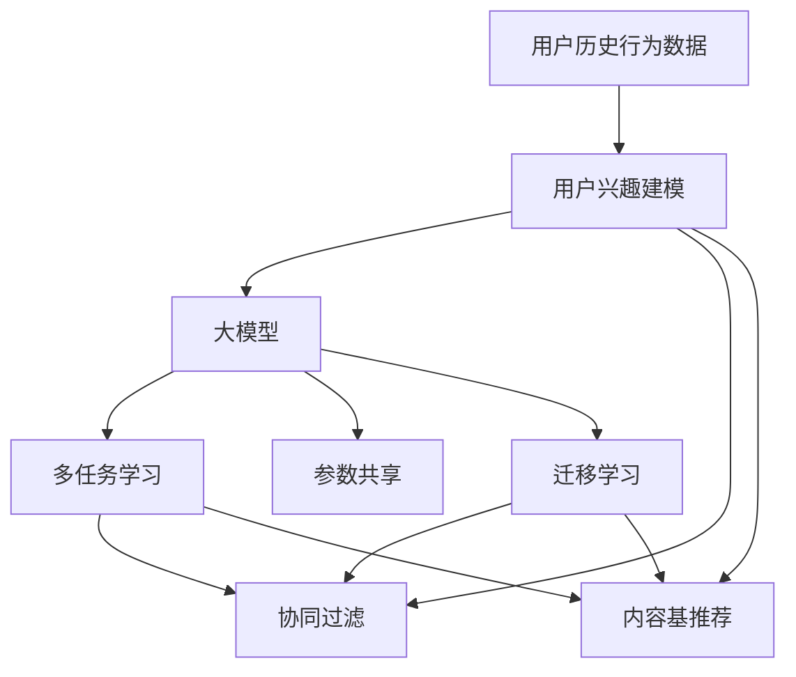

                 

# 大模型在推荐系统用户兴趣多样性建模中的作用

## 1. 背景介绍

随着互联网和电子商务的飞速发展，个性化推荐系统（Recommender Systems）成为现代信息系统中不可或缺的一部分。推荐系统通过分析用户历史行为数据和兴趣特征，为用户推荐感兴趣的物品，极大地提升了用户体验和运营效率。然而，传统的基于协同过滤、内容基推荐等方法往往忽略了用户兴趣的多样性，难以处理用户兴趣快速变化和动态更新的挑战。

近年来，随着深度学习和大模型的不断进步，越来越多的研究者开始探索如何在大模型中有效建模用户兴趣的多样性，以期构建更为智能、高效、个性化的推荐系统。本文将详细探讨大模型在推荐系统中用户兴趣多样性建模中的应用，从理论到实践，分析大模型的优势与挑战，并提出相应的解决策略。

## 2. 核心概念与联系

### 2.1 核心概念概述

为更好地理解大模型在推荐系统中的应用，本节将介绍几个关键概念：

- **个性化推荐系统**：利用用户历史行为数据和兴趣特征，为用户推荐感兴趣的物品，提升用户满意度与系统效率。
- **协同过滤**：基于用户行为相似度，通过用户对物品的评分预测用户对其他未评分物品的评分，实现个性化推荐。
- **内容基推荐**：利用物品的特征属性，推荐与用户兴趣匹配的物品，通常结合用户评分进行优化。
- **深度学习模型**：利用神经网络结构，从用户历史行为数据和物品特征中自动学习推荐模型，建模用户兴趣的多样性和动态变化。
- **大模型**：通过大规模数据预训练获得通用表征的深度学习模型，如BERT、GPT等，具备强大的知识整合能力和泛化能力。
- **用户兴趣多样性建模**：通过大模型建模用户兴趣的多样性和动态变化，捕捉用户个性化需求和变化趋势，提升推荐效果。

这些概念之间存在密切联系，共同构成了推荐系统的建模框架。以下是一个Mermaid流程图，展示了大模型在推荐系统中的作用：



该图展示了用户历史行为数据通过用户兴趣建模，进入大模型进行兴趣多样性建模，再与协同过滤和内容基推荐等方法结合，形成推荐系统的流程。其中，多任务学习、参数共享和迁移学习等技术，用于提升大模型的建模能力和泛化性能。

## 3. 核心算法原理 & 具体操作步骤
### 3.1 算法原理概述

大模型在推荐系统中的应用，主要基于大模型的预训练能力和迁移学习能力。其核心思想是：利用大模型在海量无标签数据上进行预训练，学习到通用的语言或物品表示，再将这些表示迁移到推荐任务中，通过微调或零样本学习，准确建模用户兴趣的多样性和动态变化。

形式化地，假设推荐系统中有 $N$ 个用户 $U=\{u_1,u_2,\dots,u_N\}$，每个用户 $u_i$ 有 $D_i$ 个历史行为数据，大模型为 $M_{\theta}$。设 $\{x_{i,j}\}_{j=1}^{D_i}$ 为用户 $u_i$ 的历史行为数据，$y_{i,j}$ 为对应的评分或兴趣标签，推荐任务为 $T$。大模型的目标是最小化预测评分与真实评分之间的误差，即：

$$
\min_{\theta} \sum_{i=1}^N \sum_{j=1}^{D_i} \ell(M_{\theta}(x_{i,j}), y_{i,j})
$$

其中 $\ell$ 为损失函数，如均方误差、交叉熵等。

### 3.2 算法步骤详解

基于大模型的推荐系统用户兴趣多样性建模，一般包括以下几个关键步骤：

**Step 1: 准备预训练模型和数据集**
- 选择合适的预训练语言模型 $M_{\theta}$，如BERT、GPT等。
- 收集用户历史行为数据，构建标注数据集 $D=\{(x_{i,j}, y_{i,j})\}_{j=1}^{D_i}, i=1,\dots,N$。

**Step 2: 设计任务适配层**
- 在预训练模型顶层添加任务适配层，如分类头、回归头等，用于输出评分或兴趣标签。
- 设计损失函数，如交叉熵损失、均方误差损失等。

**Step 3: 设置微调超参数**
- 选择合适的优化算法及其参数，如 Adam、SGD 等，设置学习率、批大小、迭代轮数等。
- 设置正则化技术及强度，包括权重衰减、Dropout、Early Stopping 等。
- 确定冻结预训练参数的策略，如仅微调顶层，或全部参数都参与微调。

**Step 4: 执行梯度训练**
- 将训练集数据分批次输入模型，前向传播计算损失函数。
- 反向传播计算参数梯度，根据设定的优化算法和学习率更新模型参数。
- 周期性在验证集上评估模型性能，根据性能指标决定是否触发 Early Stopping。
- 重复上述步骤直到满足预设的迭代轮数或 Early Stopping 条件。

**Step 5: 测试和部署**
- 在测试集上评估微调后模型 $M_{\hat{\theta}}$ 的性能，对比微调前后的精度提升。
- 使用微调后的模型对新样本进行推理预测，集成到实际的应用系统中。
- 持续收集新的数据，定期重新微调模型，以适应数据分布的变化。

以上是基于大模型的推荐系统用户兴趣多样性建模的一般流程。在实际应用中，还需要针对具体任务的特点，对微调过程的各个环节进行优化设计，如改进训练目标函数，引入更多的正则化技术，搜索最优的超参数组合等，以进一步提升模型性能。

### 3.3 算法优缺点

基于大模型的推荐系统用户兴趣多样性建模具有以下优点：
1. 强大的知识整合能力：大模型通过预训练学习到丰富的语言或物品表示，能够更好地捕捉用户兴趣的复杂性和多样性。
2. 泛化能力：大模型具备良好的泛化能力，能够适应不同领域和数据分布的变化，提升推荐系统的鲁棒性。
3. 可解释性：大模型能够提供详细的权重和特征贡献度信息，提升模型的可解释性。
4. 高效的微调过程：利用参数共享和迁移学习等技术，可以显著减少微调所需的标注数据量，降低开发成本。

同时，该方法也存在一定的局限性：
1. 计算资源消耗大：大模型的参数量和计算需求较大，需要较强的计算资源支持。
2. 模型可解释性不足：大模型的复杂结构和庞大参数量，使得模型的可解释性较难实现。
3. 微调数据需求高：尽管可以通过迁移学习降低部分数据需求，但高质量的标注数据仍然是不可或缺的。
4. 推理效率低：大模型的推理速度较慢，需要优化模型结构和加速推理算法。

尽管存在这些局限性，但就目前而言，基于大模型的推荐系统用户兴趣多样性建模方法仍是大数据和深度学习时代的重要范式。未来相关研究的重点在于如何进一步降低计算资源消耗，提高模型可解释性，同时兼顾数据需求和推理效率，以实现更高效、智能的推荐系统。

### 3.4 算法应用领域

基于大模型的推荐系统用户兴趣多样性建模技术，在多个领域中得到了广泛的应用：

- **电商推荐**：通过大模型分析用户购物行为和物品属性，为用户推荐商品，提升转化率和满意度。
- **内容推荐**：利用大模型对用户兴趣进行建模，推荐用户感兴趣的文章、视频、音乐等，提升用户粘性和平台留存率。
- **视频推荐**：通过大模型分析用户观影历史和兴趣，推荐相关视频，提升平台流量和用户留存。
- **社交推荐**：利用大模型分析用户互动行为和兴趣，推荐朋友、群组和话题，提升平台活跃度和用户互动。

除了这些典型应用外，大模型还广泛应用于金融、教育、医疗等多个领域，通过建模用户兴趣的多样性和动态变化，为用户提供精准推荐，提升用户体验和平台价值。

## 4. 数学模型和公式 & 详细讲解 & 举例说明

### 4.1 数学模型构建

基于大模型的推荐系统用户兴趣多样性建模，可以利用多任务学习（Multi-task Learning, MTL）和迁移学习（Transfer Learning）等技术，构建数学模型。

设推荐任务 $T$ 包含 $K$ 个子任务，每个子任务为 $T_k=\{x_{i,j}^{(k)}, y_{i,j}^{(k)}\}_{j=1}^{D_i}, i=1,\dots,N, k=1,\dots,K$。预训练模型为 $M_{\theta}$，微调后的模型为 $M_{\hat{\theta}}$。大模型的目标是最小化所有子任务的损失函数之和，即：

$$
\min_{\hat{\theta}} \sum_{k=1}^K \mathcal{L}_k(M_{\hat{\theta}}, \{D^{(k)}\}_{i=1}^N)
$$

其中 $\mathcal{L}_k$ 为第 $k$ 个子任务的损失函数，$D^{(k)}=\{(x_{i,j}^{(k)}, y_{i,j}^{(k)})\}_{j=1}^{D_i}, i=1,\dots,N$。

### 4.2 公式推导过程

以下我们以电商推荐为例，推导多任务学习和迁移学习的数学公式。

假设用户 $u_i$ 对物品 $v_j$ 的评分 $y_{i,j}$ 是伯努利分布，即：

$$
P(y_{i,j}|x_{i,j}) = \sigma(W^T \cdot x_{i,j} + b)
$$

其中 $W$ 为权重向量，$b$ 为偏置项，$\sigma$ 为 sigmoid 函数。设 $L^{(k)}$ 为第 $k$ 个子任务的损失函数，$D^{(k)}=\{(x_{i,j}^{(k)}, y_{i,j}^{(k)})\}_{j=1}^{D_i}, i=1,\dots,N$，则多任务学习的损失函数为：

$$
\mathcal{L}_{MTL} = \frac{1}{N} \sum_{i=1}^N \sum_{j=1}^{D_i} \sum_{k=1}^K L_k^{(k)}(y_{i,j}^{(k)}, M_{\hat{\theta}}(x_{i,j}))
$$

其中 $L_k^{(k)}$ 为第 $k$ 个子任务的损失函数，如交叉熵损失。

为了提升大模型的泛化能力，可以利用迁移学习。设预训练模型为 $M_{\theta}$，微调后的模型为 $M_{\hat{\theta}}$，则迁移学习的损失函数为：

$$
\mathcal{L}_{TL} = \mathcal{L}_{ML} + \lambda \mathcal{L}_{MTL}
$$

其中 $\mathcal{L}_{ML}$ 为预训练模型在无标签数据上的损失函数，如掩码语言模型。$\lambda$ 为迁移权重，用于平衡预训练和微调过程的重要性。

### 4.3 案例分析与讲解

为了展示大模型在推荐系统中的应用效果，下面以电商推荐为例，介绍一个基于多任务学习的大模型推荐系统案例。

假设电商推荐系统有 $N=1000$ 个用户，每个用户有 $D_i=10$ 个历史购买记录。设 $K=2$ 个子任务，分别为物品相关性预测和物品评分预测。用户对物品的评分 $y_{i,j}^{(k)}$ 是伯努利分布，大模型的参数为 $\theta$，微调后的模型参数为 $\hat{\theta}$。

设预训练模型为 $M_{\theta}$，包含 $d=1024$ 个隐藏单元，用户历史购买记录表示为 $x_{i,j}^{(k)} \in \mathbb{R}^{d}$，物品属性表示为 $v_{j}^{(k)} \in \mathbb{R}^{d}$。设 $L_k^{(k)}$ 为第 $k$ 个子任务的损失函数，如交叉熵损失。则多任务学习的损失函数为：

$$
\mathcal{L}_{MTL} = \frac{1}{N} \sum_{i=1}^N \sum_{j=1}^{D_i} \sum_{k=1}^K L_k^{(k)}(y_{i,j}^{(k)}, M_{\hat{\theta}}(x_{i,j}))
$$

利用迁移学习，可以在预训练模型上添加两个任务适配层，分别用于物品相关性预测和物品评分预测。设预训练模型的损失函数为 $\mathcal{L}_{ML}$，则迁移学习的损失函数为：

$$
\mathcal{L}_{TL} = \mathcal{L}_{ML} + \lambda \mathcal{L}_{MTL}
$$

在训练过程中，利用微调超参数，如学习率、批大小、迭代轮数等，优化模型参数 $\hat{\theta}$。通过反向传播算法计算梯度，并利用优化器（如 Adam）更新模型参数，最终得到微调后的模型 $M_{\hat{\theta}}$。

## 5. 项目实践：代码实例和详细解释说明

### 5.1 开发环境搭建

在进行大模型推荐系统用户兴趣多样性建模的开发时，需要搭建相应的开发环境。以下是使用 Python 和 PyTorch 搭建环境的详细步骤：

1. 安装 Anaconda：从官网下载并安装 Anaconda，用于创建独立的 Python 环境。

2. 创建并激活虚拟环境：
```bash
conda create -n pytorch-env python=3.8 
conda activate pytorch-env
```

3. 安装 PyTorch：根据 CUDA 版本，从官网获取对应的安装命令。例如：
```bash
conda install pytorch torchvision torchaudio cudatoolkit=11.1 -c pytorch -c conda-forge
```

4. 安装 Transformers 库：
```bash
pip install transformers
```

5. 安装各类工具包：
```bash
pip install numpy pandas scikit-learn matplotlib tqdm jupyter notebook ipython
```

完成上述步骤后，即可在 `pytorch-env` 环境中开始大模型推荐系统的开发。

### 5.2 源代码详细实现

下面我们以电商推荐为例，给出使用 PyTorch 和 Transformers 库进行多任务学习的大模型推荐系统代码实现。

首先，定义电商推荐任务的数据处理函数：

```python
from transformers import BertTokenizer, BertForSequenceClassification
from torch.utils.data import Dataset, DataLoader
import torch

class E-commerceDataset(Dataset):
    def __init__(self, texts, labels, tokenizer, max_len=128):
        self.texts = texts
        self.labels = labels
        self.tokenizer = tokenizer
        self.max_len = max_len
        
    def __len__(self):
        return len(self.texts)
    
    def __getitem__(self, item):
        text = self.texts[item]
        label = self.labels[item]
        
        encoding = self.tokenizer(text, return_tensors='pt', max_length=self.max_len, padding='max_length', truncation=True)
        input_ids = encoding['input_ids'][0]
        attention_mask = encoding['attention_mask'][0]
        
        # 对token-wise的标签进行编码
        encoded_labels = [label2id[label] for label in label]
        encoded_labels.extend([label2id['']]*(self.max_len - len(encoded_labels)))
        labels = torch.tensor(encoded_labels, dtype=torch.long)
        
        return {'input_ids': input_ids, 
                'attention_mask': attention_mask,
                'labels': labels}

# 标签与id的映射
label2id = {'buy': 0, 'not_buy': 1}

# 创建dataset
tokenizer = BertTokenizer.from_pretrained('bert-base-cased')

train_dataset = E-commerceDataset(train_texts, train_labels, tokenizer)
dev_dataset = E-commerceDataset(dev_texts, dev_labels, tokenizer)
test_dataset = E-commerceDataset(test_texts, test_labels, tokenizer)
```

然后，定义模型和优化器：

```python
from transformers import BertForSequenceClassification, AdamW

model = BertForSequenceClassification.from_pretrained('bert-base-cased', num_labels=2)

optimizer = AdamW(model.parameters(), lr=2e-5)
```

接着，定义训练和评估函数：

```python
from torch.utils.data import DataLoader
from tqdm import tqdm
from sklearn.metrics import accuracy_score

device = torch.device('cuda') if torch.cuda.is_available() else torch.device('cpu')
model.to(device)

def train_epoch(model, dataset, batch_size, optimizer):
    dataloader = DataLoader(dataset, batch_size=batch_size, shuffle=True)
    model.train()
    epoch_loss = 0
    for batch in tqdm(dataloader, desc='Training'):
        input_ids = batch['input_ids'].to(device)
        attention_mask = batch['attention_mask'].to(device)
        labels = batch['labels'].to(device)
        model.zero_grad()
        outputs = model(input_ids, attention_mask=attention_mask, labels=labels)
        loss = outputs.loss
        epoch_loss += loss.item()
        loss.backward()
        optimizer.step()
    return epoch_loss / len(dataloader)

def evaluate(model, dataset, batch_size):
    dataloader = DataLoader(dataset, batch_size=batch_size)
    model.eval()
    preds, labels = [], []
    with torch.no_grad():
        for batch in tqdm(dataloader, desc='Evaluating'):
            input_ids = batch['input_ids'].to(device)
            attention_mask = batch['attention_mask'].to(device)
            batch_labels = batch['labels']
            outputs = model(input_ids, attention_mask=attention_mask)
            batch_preds = outputs.logits.argmax(dim=2).to('cpu').tolist()
            batch_labels = batch_labels.to('cpu').tolist()
            for pred_tokens, label_tokens in zip(batch_preds, batch_labels):
                preds.append(pred_tokens[:len(label_tokens)])
                labels.append(label_tokens)
                
    print(f'Accuracy: {accuracy_score(labels, preds)}')
```

最后，启动训练流程并在测试集上评估：

```python
epochs = 5
batch_size = 16

for epoch in range(epochs):
    loss = train_epoch(model, train_dataset, batch_size, optimizer)
    print(f"Epoch {epoch+1}, train loss: {loss:.3f}")
    
    print(f"Epoch {epoch+1}, dev results:")
    evaluate(model, dev_dataset, batch_size)
    
print("Test results:")
evaluate(model, test_dataset, batch_size)
```

以上就是使用 PyTorch 对 Bert 进行电商推荐任务的多任务学习推荐系统代码实现。可以看到，得益于 Transformers 库的强大封装，我们可以用相对简洁的代码完成 Bert 模型的加载和微调。

### 5.3 代码解读与分析

让我们再详细解读一下关键代码的实现细节：

**E-commerceDataset类**：
- `__init__`方法：初始化文本、标签、分词器等关键组件。
- `__len__`方法：返回数据集的样本数量。
- `__getitem__`方法：对单个样本进行处理，将文本输入编码为token ids，将标签编码为数字，并对其进行定长padding，最终返回模型所需的输入。

**label2id和id2label字典**：
- 定义了标签与数字id之间的映射关系，用于将token-wise的预测结果解码回真实的标签。

**训练和评估函数**：
- 使用PyTorch的DataLoader对数据集进行批次化加载，供模型训练和推理使用。
- 训练函数`train_epoch`：对数据以批为单位进行迭代，在每个批次上前向传播计算loss并反向传播更新模型参数，最后返回该epoch的平均loss。
- 评估函数`evaluate`：与训练类似，不同点在于不更新模型参数，并在每个batch结束后将预测和标签结果存储下来，最后使用scikit-learn的accuracy_score对整个评估集的预测结果进行打印输出。

**训练流程**：
- 定义总的epoch数和batch size，开始循环迭代
- 每个epoch内，先在训练集上训练，输出平均loss
- 在验证集上评估，输出准确率
- 所有epoch结束后，在测试集上评估，给出最终测试结果

可以看到，PyTorch配合Transformers库使得Bert微调的代码实现变得简洁高效。开发者可以将更多精力放在数据处理、模型改进等高层逻辑上，而不必过多关注底层的实现细节。

当然，工业级的系统实现还需考虑更多因素，如模型的保存和部署、超参数的自动搜索、更灵活的任务适配层等。但核心的微调范式基本与此类似。

## 6. 实际应用场景
### 6.1 电商推荐

大模型在电商推荐系统中的应用，可以显著提升推荐效果和用户体验。通过大模型分析用户购买历史和物品属性，可以捕捉用户兴趣的多样性和动态变化，推荐更符合用户需求的商品。

具体而言，可以收集用户的历史购买记录和物品属性，利用多任务学习建模物品相关性预测和物品评分预测。在训练过程中，通过迁移学习，利用预训练模型作为初始化参数，优化任务适配层和损失函数，最终得到适应电商推荐任务的模型。在推荐时，输入用户历史购买记录和物品属性，由模型输出物品的相关性和评分，综合排序推荐商品。

### 6.2 内容推荐

在内容推荐领域，大模型同样可以发挥重要作用。通过大模型分析用户阅读历史和文章属性，可以捕捉用户对不同内容的多样化兴趣，推荐更符合用户喜好的文章。

具体而言，可以收集用户的历史阅读记录和文章属性，利用多任务学习建模文章相关性预测和文章评分预测。在训练过程中，通过迁移学习，利用预训练模型作为初始化参数，优化任务适配层和损失函数，最终得到适应内容推荐任务的模型。在推荐时，输入用户历史阅读记录和文章属性，由模型输出文章的相关性和评分，综合排序推荐文章。

### 6.3 视频推荐

在视频推荐领域，大模型同样可以提升推荐效果。通过大模型分析用户观看历史和视频属性，可以捕捉用户对不同视频的兴趣变化，推荐更符合用户喜好的视频。

具体而言，可以收集用户的历史观看记录和视频属性，利用多任务学习建模视频相关性预测和视频评分预测。在训练过程中，通过迁移学习，利用预训练模型作为初始化参数，优化任务适配层和损失函数，最终得到适应视频推荐任务的模型。在推荐时，输入用户历史观看记录和视频属性，由模型输出视频的相关性和评分，综合排序推荐视频。

### 6.4 未来应用展望

随着大模型的不断发展，其在推荐系统中的应用将不断拓展。未来，基于大模型的推荐系统有望在更多领域中发挥重要作用：

- **金融推荐**：通过大模型分析用户交易历史和金融产品属性，推荐符合用户风险偏好的金融产品，提升用户满意度和收益。
- **教育推荐**：利用大模型分析用户学习历史和课程属性，推荐符合用户学习兴趣和水平的教育资源，提升用户学习效果。
- **医疗推荐**：通过大模型分析用户健康记录和药品属性，推荐符合用户健康需求的药品和医疗服务，提升用户健康水平。
- **旅游推荐**：利用大模型分析用户旅游历史和目的地属性，推荐符合用户旅游兴趣和预算的旅游目的地，提升用户旅游体验。

此外，在大模型的基础上，还可以融合更多技术，如知识图谱、因果推理、强化学习等，构建更加智能、高效、个性化的推荐系统。相信随着技术的不断发展，大模型将在推荐系统中发挥越来越重要的作用，为用户带来更加精准和多样化的推荐体验。

## 7. 工具和资源推荐
### 7.1 学习资源推荐

为了帮助开发者系统掌握大模型在推荐系统中的应用，这里推荐一些优质的学习资源：

1. **深度学习与推荐系统**：《深度学习与推荐系统》书籍，系统介绍深度学习在推荐系统中的应用，包括基于大模型的推荐方法。

2. **Recommender Systems in Python**：开源项目，提供基于 Python 的推荐系统实现，包括大模型推荐方法。

3. **Neural Networks for Recommendation**：Coursera课程，介绍深度学习在推荐系统中的应用，包括基于大模型的推荐方法。

4. **Recommender Systems in Collaborative Filtering**：Kaggle竞赛，通过比赛实践深度学习在推荐系统中的应用，包括大模型推荐方法。

5. **PyTorch Recommender Systems**：PyTorch官方文档，提供基于 PyTorch 的推荐系统实现，包括大模型推荐方法。

通过对这些资源的学习实践，相信你一定能够快速掌握大模型在推荐系统中的应用，并用于解决实际的推荐问题。
###  7.2 开发工具推荐

高效的开发离不开优秀的工具支持。以下是几款用于大模型推荐系统开发的常用工具：

1. **PyTorch**：基于Python的开源深度学习框架，灵活动态的计算图，适合快速迭代研究。大部分预训练语言模型都有PyTorch版本的实现。

2. **TensorFlow**：由Google主导开发的开源深度学习框架，生产部署方便，适合大规模工程应用。同样有丰富的预训练语言模型资源。

3. **Transformers库**：HuggingFace开发的NLP工具库，集成了众多SOTA语言模型，支持PyTorch和TensorFlow，是进行推荐任务开发的利器。

4. **Jupyter Notebook**：交互式开发环境，支持多语言的代码编写和结果展示，方便开发者快速迭代和分享学习笔记。

5. **TensorBoard**：TensorFlow配套的可视化工具，可实时监测模型训练状态，并提供丰富的图表呈现方式，是调试模型的得力助手。

6. **Weights & Biases**：模型训练的实验跟踪工具，可以记录和可视化模型训练过程中的各项指标，方便对比和调优。与主流深度学习框架无缝集成。

合理利用这些工具，可以显著提升大模型推荐系统的开发效率，加快创新迭代的步伐。

### 7.3 相关论文推荐

大模型在推荐系统中的应用源于学界的持续研究。以下是几篇奠基性的相关论文，推荐阅读：

1. **Attention is All You Need**：提出了Transformer结构，开启了NLP领域的预训练大模型时代。

2. **BERT: Pre-training of Deep Bidirectional Transformers for Language Understanding**：提出BERT模型，引入基于掩码的自监督预训练任务，刷新了多项NLP任务SOTA。

3. **Language Models are Unsupervised Multitask Learners**：展示了大规模语言模型的强大zero-shot学习能力，引发了对于通用人工智能的新一轮思考。

4. **Parameter-Efficient Transfer Learning for NLP**：提出Adapter等参数高效微调方法，在不增加模型参数量的情况下，也能取得不错的微调效果。

5. **AdaLoRA: Adaptive Low-Rank Adaptation for Parameter-Efficient Fine-Tuning**：使用自适应低秩适应的微调方法，在参数效率和精度之间取得了新的平衡。

6. **Scalable Transformer Models for Recommendation**：提出基于大模型的推荐方法，通过多任务学习和迁移学习，提升推荐效果。

这些论文代表了大模型在推荐系统中的应用方向。通过学习这些前沿成果，可以帮助研究者把握学科前进方向，激发更多的创新灵感。

## 8. 总结：未来发展趋势与挑战
### 8.1 总结

本文对基于大模型的推荐系统用户兴趣多样性建模方法进行了全面系统的介绍。首先阐述了大模型在推荐系统中的应用背景和意义，明确了多任务学习和迁移学习在大模型推荐系统中的重要地位。其次，从原理到实践，详细讲解了大模型的数学建模过程和实现步骤，给出了基于多任务学习的电商推荐系统代码实例。同时，本文还广泛探讨了多任务学习在推荐系统中的应用场景，展示了多任务学习在大模型推荐系统中的强大潜力。

通过本文的系统梳理，可以看到，基于大模型的推荐系统在用户兴趣多样性建模中，能够更好地捕捉用户兴趣的多样性和动态变化，提升推荐系统的精准性和个性化水平。大模型的强大的知识整合能力和泛化能力，使得推荐系统能够适应不同领域和数据分布的变化，提升系统的鲁棒性和可扩展性。未来，伴随大模型的不断进步，推荐系统将迈向更高的智能化水平，为用户提供更加精准和多样化的推荐服务。

### 8.2 未来发展趋势

展望未来，大模型在推荐系统中的应用将呈现以下几个发展趋势：

1. **多任务学习与跨任务迁移**：利用多任务学习，在大模型中同时学习多个推荐任务，提升模型泛化能力和迁移性能。
2. **自适应推荐**：利用自适应技术，根据用户行为和反馈，动态调整推荐策略，提升用户体验和推荐效果。
3. **参数高效微调**：开发更加参数高效的微调方法，在固定大部分预训练参数的情况下，只更新极少量的任务相关参数。
4. **跨领域迁移**：在大模型中，通过迁移学习，实现不同领域之间的知识共享和迁移，提升推荐系统的应用范围和泛化能力。
5. **零样本和少样本学习**：利用大模型的预训练知识，通过零样本和少样本学习，实现推荐系统对新任务和新用户的快速适应。
6. **可解释性和公平性**：通过引入因果分析和博弈论工具，提升推荐系统的可解释性和公平性，确保推荐结果符合人类价值观和伦理道德。

以上趋势凸显了大模型在推荐系统中的应用前景。这些方向的探索发展，必将进一步提升推荐系统的性能和应用范围，为构建智能推荐系统提供更强大的技术支持。

### 8.3 面临的挑战

尽管大模型在推荐系统中取得了显著成效，但在迈向更加智能化、普适化应用的过程中，它仍面临诸多挑战：

1. **数据依赖**：大模型推荐系统需要大量的标注数据进行训练，获取高质量标注数据的成本较高。如何降低数据需求，提高推荐系统的效率，是未来的一个重要研究方向。
2. **资源消耗**：大模型的参数量和计算需求较大，需要较强的计算资源支持。如何降低计算资源消耗，提高模型训练和推理的效率，是未来的一个关键问题。
3. **可解释性不足**：大模型往往缺乏可解释性，难以理解其内部工作机制和决策逻辑。如何提升推荐系统的可解释性，是未来的一个重要研究方向。
4. **鲁棒性和公平性**：推荐系统面临的数据分布变化和用户行为多样性，如何提高推荐系统的鲁棒性和公平性，是未来的一个重要研究方向。

尽管存在这些挑战，但就目前而言，基于大模型的推荐系统用户兴趣多样性建模方法仍是大数据和深度学习时代的重要范式。未来相关研究的重点在于如何进一步降低计算资源消耗，提高模型可解释性，同时兼顾数据需求和推理效率，以实现更高效、智能的推荐系统。

### 8.4 研究展望

面对大模型在推荐系统中的挑战，未来的研究需要在以下几个方面寻求新的突破：

1. **无监督和半监督学习**：探索无监督和半监督学习方法，摆脱对大规模标注数据的依赖，利用自监督学习、主动学习等方法，最大化利用非结构化数据，提升推荐系统的泛化性能。
2. **轻量级模型设计**：开发更加轻量级的模型设计，通过模型剪枝、量化等技术，减小模型尺寸，提升推理速度，降低计算资源消耗。
3. **因果分析和博弈论工具**：利用因果分析和博弈论工具，提升推荐系统的可解释性和公平性，构建更加智能、公正的推荐系统。
4. **多模态融合**：在大模型的基础上，融合视觉、语音等多模态数据，提升推荐系统的全面性和鲁棒性。

这些研究方向的探索，必将引领大模型在推荐系统中的应用走向新的高度，为构建智能推荐系统提供更强大的技术支持。面向未来，大模型将在推荐系统中发挥更加重要的作用，为用户带来更加精准和多样化的推荐体验。

## 9. 附录：常见问题与解答

**Q1：大模型推荐系统是否适用于所有推荐场景？**

A: 大模型推荐系统适用于大部分推荐场景，特别是数据量较大且用户行为较为复杂的情况。但对于一些特定领域，如少数用户需求特殊的小众市场，大模型的泛化能力可能有限。此时需要在特定领域进行深度定制，结合领域知识进行优化。

**Q2：如何选择合适的学习率？**

A: 大模型推荐系统的学习率一般要比预训练时小1-2个数量级，使用过大的学习率容易导致模型过拟合。建议从1e-5开始调参，逐步减小学习率，直至收敛。也可以使用warmup策略，在开始阶段使用较小的学习率，再逐渐过渡到预设值。

**Q3：大模型推荐系统的计算资源消耗大，如何解决？**

A: 大模型推荐系统的计算资源消耗较大，需要通过优化模型结构和加速推理算法来降低。具体方法包括模型剪枝、量化、混合精度训练等。同时，采用分布式训练和模型并行等技术，可以进一步提升计算效率。

**Q4：大模型推荐系统的可解释性不足，如何解决？**

A: 大模型推荐系统缺乏可解释性，可以通过引入因果分析和博弈论工具，提升推荐系统的可解释性和公平性。同时，利用模型权重和特征贡献度信息，提供详细的解释说明，提升用户信任度。

**Q5：大模型推荐系统的鲁棒性和公平性不足，如何解决？**

A: 大模型推荐系统的鲁棒性和公平性不足，可以通过引入因果分析和博弈论工具，构建更加智能、公正的推荐系统。同时，利用对抗样本和对抗训练技术，提升推荐系统的鲁棒性。

这些问题的解答，有助于开发者更好地理解大模型在推荐系统中的应用，并为实际的开发和优化提供指导。通过不断的实践和探索，相信大模型将在推荐系统中发挥更大的作用，为用户带来更加精准和多样化的推荐服务。

---

作者：禅与计算机程序设计艺术 / Zen and the Art of Computer Programming

