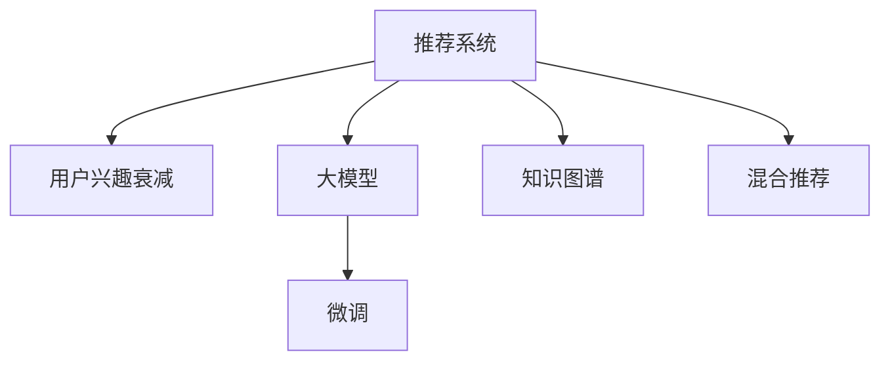

                 

# 大模型在推荐系统用户兴趣衰减建模中的应用

## 1. 背景介绍

在快速发展的互联网时代，推荐系统作为连接用户与信息的桥梁，其重要性日益凸显。推荐系统的目标是帮助用户发现感兴趣的内容，提升用户体验，同时增加平台收益。然而，随着用户长期交互数据的积累，推荐系统往往面临着用户兴趣衰减的问题。用户对内容的互动频率降低，兴趣点迁移，导致推荐系统推荐效果变差，用户体验下降。如何有效捕捉用户兴趣的变化，以及及时调整推荐策略，是当前推荐系统面临的重大挑战。

近年来，大模型技术在自然语言处理(NLP)、计算机视觉(CV)等领域取得了突破性进展。大模型能够通过海量的预训练数据，学习丰富的语言或视觉表征，展现出强大的泛化能力和迁移学习能力。在大规模推荐系统中，通过将大模型与推荐系统相结合，可以显著提升用户兴趣衰减建模的精度，优化推荐效果，提高用户体验。本文将详细探讨大模型在推荐系统中捕捉用户兴趣衰减的原理与方法，并提出具体的应用策略。

## 2. 核心概念与联系

### 2.1 核心概念概述

为了更好地理解大模型在推荐系统中的应用，本节将介绍几个关键概念：

- **推荐系统**：通过分析用户历史行为数据，预测用户对未交互内容的兴趣，并推荐给用户。常见的推荐方法包括协同过滤、基于内容的推荐、矩阵分解等。

- **用户兴趣衰减**：用户在长期与推荐系统交互中，对特定内容或类型的兴趣逐渐降低，导致推荐系统推荐的相关性和个性化下降。

- **大模型**：如BERT、GPT-3、DALL-E等大规模预训练模型，通过海量的自监督或监督数据进行训练，学习到丰富的特征表示。

- **微调**：在预训练模型的基础上，使用推荐系统中的标注数据，进行有监督的学习，以适应特定推荐场景的需求。

- **知识图谱**：通过语义化的结构化信息，构建实体、关系、属性之间的关系网络，辅助推荐系统进行更准确的推荐。

- **混合推荐**：将多个推荐算法进行组合，取长补短，提高推荐效果。

这些概念之间的逻辑关系可以通过以下Mermaid流程图来展示：



这个流程图展示了大模型在推荐系统中的应用场景：

1. 推荐系统首先分析用户历史行为，捕捉用户兴趣衰减。
2. 大模型通过微调学习用户兴趣特征，提升推荐精度。
3. 知识图谱辅助大模型提取更深层次的语义信息，提高推荐效果。
4. 混合推荐方法结合多个推荐算法，综合优化推荐结果。

## 3. 核心算法原理 & 具体操作步骤

### 3.1 算法原理概述

大模型在推荐系统中的核心作用在于捕捉和表达用户兴趣衰减的特征。具体而言，大模型通过微调学习用户历史行为和兴趣变化的关系，建立兴趣衰减模型，用于预测用户的未来行为。该过程可以形式化为以下数学模型：

设 $D = \{(x_i, y_i)\}_{i=1}^N$ 为推荐系统中的标注数据集，其中 $x_i$ 为用户历史行为序列， $y_i$ 为用户未来行为标签（如是否点击、是否购买等）。定义大模型 $M_{\theta}$ 通过微调更新参数 $\theta$，学习用户兴趣衰减模型 $f: \mathcal{X} \rightarrow \mathcal{Y}$。目标是找到最优的模型参数 $\hat{\theta}$，使得模型在推荐系统上的损失函数 $\mathcal{L}(f, D)$ 最小化。

$$
\hat{\theta} = \arg\min_{\theta} \mathcal{L}(f_{\theta}, D)
$$

其中 $f_{\theta}$ 为参数化模型，$D$ 为标注数据集，$\mathcal{L}$ 为损失函数。

### 3.2 算法步骤详解

大模型在推荐系统中捕捉用户兴趣衰减的过程，可以分为以下几个关键步骤：

**Step 1: 准备预训练模型和数据集**

- 选择合适的预训练语言模型（如BERT、GPT-3等），作为初始化参数。
- 收集推荐系统中的历史行为数据，并将其转化为文本序列。
- 划分标注数据集 $D$ 为训练集、验证集和测试集。

**Step 2: 添加任务适配层**

- 在预训练模型顶层设计用户兴趣衰减模型的适配层，包括嵌入层、全连接层、输出层等。
- 使用适当的损失函数（如交叉熵损失、均方误差损失等），设计模型输出与标签的映射关系。

**Step 3: 设置微调超参数**

- 选择合适的优化算法及其参数，如 AdamW、SGD 等，设置学习率、批大小、迭代轮数等。
- 设置正则化技术及强度，包括权重衰减、Dropout、Early Stopping 等。
- 确定冻结预训练参数的策略，如仅微调顶层，或全部参数都参与微调。

**Step 4: 执行梯度训练**

- 将训练集数据分批次输入模型，前向传播计算损失函数。
- 反向传播计算参数梯度，根据设定的优化算法和学习率更新模型参数。
- 周期性在验证集上评估模型性能，根据性能指标决定是否触发 Early Stopping。
- 重复上述步骤直到满足预设的迭代轮数或 Early Stopping 条件。

**Step 5: 测试和部署**

- 在测试集上评估微调后模型 $f_{\hat{\theta}}$ 的性能，对比微调前后的精度提升。
- 使用微调后的模型对新样本进行推理预测，集成到实际的应用系统中。
- 持续收集新的用户行为数据，定期重新微调模型，以适应数据分布的变化。

### 3.3 算法优缺点

大模型在推荐系统中的应用，具有以下优点：

- **泛化能力强大**：大模型通过大规模预训练，学习到丰富的特征表示，能够适应不同用户和场景的需求。
- **高效捕捉兴趣变化**：大模型能够捕捉用户长期兴趣的变化，提高推荐系统的准确性和及时性。
- **减少标注需求**：相比传统的推荐方法，大模型在微调过程中对标注数据的需求较低，能够从海量的非结构化数据中学习用户兴趣特征。
- **可扩展性强**：大模型具有很强的可扩展性，能够适应不同规模的推荐系统，支持动态调整推荐策略。

同时，该方法也存在一定的局限性：

- **训练复杂度高**：大模型参数量庞大，训练复杂度高，需要高性能计算资源。
- **模型解释性差**：大模型通过复杂的深度学习结构进行训练，难以解释模型的决策过程。
- **数据依赖性强**：大模型的效果很大程度上依赖于数据质量，需要高质量、多样化的用户行为数据。
- **过拟合风险高**：大模型在微调过程中容易发生过拟合，特别是在数据量较少的情况下。

## 4. 数学模型和公式 & 详细讲解 & 举例说明

### 4.1 数学模型构建

假设推荐系统中的用户历史行为数据 $D = \{(x_i, y_i)\}_{i=1}^N$，其中 $x_i = (x_{i,1}, x_{i,2}, \cdots, x_{i,T})$ 为用户在 $T$ 个时间步的历史行为序列，$y_i \in \{0, 1\}$ 为用户的未来行为标签，$y_i = 1$ 表示用户会对下一个行为进行点击、购买等互动，$y_i = 0$ 表示用户不会进行互动。

定义用户兴趣衰减模型 $f: \mathcal{X} \rightarrow \mathcal{Y}$，其中 $\mathcal{X}$ 为用户历史行为序列，$\mathcal{Y}$ 为未来行为标签。模型的输出可以表示为：

$$
f_{\theta}(x) = \sigma(W^T\operatorname{ReLU}(XW_1) + b)
$$

其中 $X = [x_{i,1}, x_{i,2}, \cdots, x_{i,T}]$，$W_1$ 和 $W$ 为模型参数，$\sigma$ 为激活函数。

目标是最小化经验风险：

$$
\mathcal{L}(\theta) = -\frac{1}{N}\sum_{i=1}^N \ell(f_{\theta}(x_i), y_i)
$$

其中 $\ell(\cdot,\cdot)$ 为损失函数。

### 4.2 公式推导过程

假设使用交叉熵损失函数 $\ell(f_{\theta}(x_i), y_i) = -y_i \log f_{\theta}(x_i) - (1-y_i) \log (1 - f_{\theta}(x_i))$，则模型在训练集 $D$ 上的损失函数为：

$$
\mathcal{L}(\theta) = -\frac{1}{N}\sum_{i=1}^N [y_i \log f_{\theta}(x_i) + (1-y_i) \log (1 - f_{\theta}(x_i))]
$$

利用链式法则，求导得到模型参数 $\theta$ 的梯度：

$$
\nabla_{\theta} \mathcal{L}(\theta) = \frac{1}{N} \sum_{i=1}^N \left[ y_i \nabla_{\theta} f_{\theta}(x_i) - (1-y_i) \nabla_{\theta} (1 - f_{\theta}(x_i)) \right]
$$

根据模型输出，得到梯度的计算公式：

$$
\nabla_{\theta} f_{\theta}(x_i) = W \operatorname{ReLU}'(XW_1) W_1^T
$$

其中 $\operatorname{ReLU}'(\cdot)$ 为ReLU激活函数的导数。

通过反向传播算法，计算梯度并更新模型参数：

$$
\theta \leftarrow \theta - \eta \nabla_{\theta} \mathcal{L}(\theta)
$$

其中 $\eta$ 为学习率。

### 4.3 案例分析与讲解

以电商平台推荐系统为例，用户行为数据包括浏览记录、点击记录、购买记录等。假设某用户在最近七天内浏览了5个商品，点击了2个商品，购买了1个商品。大模型通过微调学习用户兴趣衰减模型，预测该用户在接下来一天是否会对某个商品进行点击或购买。

具体实现步骤如下：

1. 收集用户历史行为数据，并将其转化为文本序列。
2. 在BERT模型基础上，设计用户兴趣衰减模型的适配层。
3. 设置优化器、学习率、批大小等超参数。
4. 执行梯度训练，更新模型参数。
5. 在验证集上评估模型性能，调整超参数。
6. 在测试集上测试模型效果，部署到推荐系统中。

## 5. 项目实践：代码实例和详细解释说明

### 5.1 开发环境搭建

在进行大模型微调实践前，我们需要准备好开发环境。以下是使用Python进行PyTorch开发的环境配置流程：

1. 安装Anaconda：从官网下载并安装Anaconda，用于创建独立的Python环境。

2. 创建并激活虚拟环境：
```bash
conda create -n pytorch-env python=3.8 
conda activate pytorch-env
```

3. 安装PyTorch：根据CUDA版本，从官网获取对应的安装命令。例如：
```bash
conda install pytorch torchvision torchaudio cudatoolkit=11.1 -c pytorch -c conda-forge
```

4. 安装Transformers库：
```bash
pip install transformers
```

5. 安装各类工具包：
```bash
pip install numpy pandas scikit-learn matplotlib tqdm jupyter notebook ipython
```

完成上述步骤后，即可在`pytorch-env`环境中开始微调实践。

### 5.2 源代码详细实现

这里我们以电商平台推荐系统为例，给出使用Transformers库对BERT模型进行用户兴趣衰减微调的PyTorch代码实现。

首先，定义用户行为数据的处理函数：

```python
from transformers import BertTokenizer
from torch.utils.data import Dataset
import torch

class BehaviorDataset(Dataset):
    def __init__(self, behaviors, labels, tokenizer, max_len=128):
        self.behaviors = behaviors
        self.labels = labels
        self.tokenizer = tokenizer
        self.max_len = max_len
        
    def __len__(self):
        return len(self.behaviors)
    
    def __getitem__(self, item):
        behavior = self.behaviors[item]
        label = self.labels[item]
        
        encoding = self.tokenizer(behavior, return_tensors='pt', max_length=self.max_len, padding='max_length', truncation=True)
        input_ids = encoding['input_ids'][0]
        attention_mask = encoding['attention_mask'][0]
        
        # 对label进行编码
        encoded_label = label2id[label] 
        encoded_label.extend([label2id['O']] * (self.max_len - len(encoded_label)))
        labels = torch.tensor(encoded_label, dtype=torch.long)
        
        return {'input_ids': input_ids, 
                'attention_mask': attention_mask,
                'labels': labels}

# 标签与id的映射
label2id = {'0': 0, '1': 1}
id2label = {v: k for k, v in label2id.items()}

# 创建dataset
tokenizer = BertTokenizer.from_pretrained('bert-base-cased')

train_dataset = BehaviorDataset(train_behaviors, train_labels, tokenizer)
dev_dataset = BehaviorDataset(dev_behaviors, dev_labels, tokenizer)
test_dataset = BehaviorDataset(test_behaviors, test_labels, tokenizer)
```

然后，定义模型和优化器：

```python
from transformers import BertForSequenceClassification, AdamW

model = BertForSequenceClassification.from_pretrained('bert-base-cased', num_labels=len(label2id))

optimizer = AdamW(model.parameters(), lr=2e-5)
```

接着，定义训练和评估函数：

```python
from torch.utils.data import DataLoader
from tqdm import tqdm
from sklearn.metrics import classification_report

device = torch.device('cuda') if torch.cuda.is_available() else torch.device('cpu')
model.to(device)

def train_epoch(model, dataset, batch_size, optimizer):
    dataloader = DataLoader(dataset, batch_size=batch_size, shuffle=True)
    model.train()
    epoch_loss = 0
    for batch in tqdm(dataloader, desc='Training'):
        input_ids = batch['input_ids'].to(device)
        attention_mask = batch['attention_mask'].to(device)
        labels = batch['labels'].to(device)
        model.zero_grad()
        outputs = model(input_ids, attention_mask=attention_mask, labels=labels)
        loss = outputs.loss
        epoch_loss += loss.item()
        loss.backward()
        optimizer.step()
    return epoch_loss / len(dataloader)

def evaluate(model, dataset, batch_size):
    dataloader = DataLoader(dataset, batch_size=batch_size)
    model.eval()
    preds, labels = [], []
    with torch.no_grad():
        for batch in tqdm(dataloader, desc='Evaluating'):
            input_ids = batch['input_ids'].to(device)
            attention_mask = batch['attention_mask'].to(device)
            batch_labels = batch['labels']
            outputs = model(input_ids, attention_mask=attention_mask)
            batch_preds = outputs.logits.argmax(dim=2).to('cpu').tolist()
            batch_labels = batch_labels.to('cpu').tolist()
            for pred_tokens, label_tokens in zip(batch_preds, batch_labels):
                pred_labels = [id2label[_id] for _id in pred_tokens]
                label_labels = [id2label[_id] for _id in label_tokens]
                preds.append(pred_labels[:len(label_labels)])
                labels.append(label_labels)
                
    print(classification_report(labels, preds))
```

最后，启动训练流程并在测试集上评估：

```python
epochs = 5
batch_size = 16

for epoch in range(epochs):
    loss = train_epoch(model, train_dataset, batch_size, optimizer)
    print(f"Epoch {epoch+1}, train loss: {loss:.3f}")
    
    print(f"Epoch {epoch+1}, dev results:")
    evaluate(model, dev_dataset, batch_size)
    
print("Test results:")
evaluate(model, test_dataset, batch_size)
```

以上就是使用PyTorch对BERT进行用户兴趣衰减微调的完整代码实现。可以看到，得益于Transformers库的强大封装，我们可以用相对简洁的代码完成BERT模型的加载和微调。

### 5.3 代码解读与分析

让我们再详细解读一下关键代码的实现细节：

**BehaviorDataset类**：
- `__init__`方法：初始化用户行为序列、标签、分词器等关键组件。
- `__len__`方法：返回数据集的样本数量。
- `__getitem__`方法：对单个样本进行处理，将行为序列输入编码为token ids，将标签编码为数字，并对其进行定长padding，最终返回模型所需的输入。

**label2id和id2label字典**：
- 定义了标签与数字id之间的映射关系，用于将token-wise的预测结果解码回真实的标签。

**训练和评估函数**：
- 使用PyTorch的DataLoader对数据集进行批次化加载，供模型训练和推理使用。
- 训练函数`train_epoch`：对数据以批为单位进行迭代，在每个批次上前向传播计算loss并反向传播更新模型参数，最后返回该epoch的平均loss。
- 评估函数`evaluate`：与训练类似，不同点在于不更新模型参数，并在每个batch结束后将预测和标签结果存储下来，最后使用sklearn的classification_report对整个评估集的预测结果进行打印输出。

**训练流程**：
- 定义总的epoch数和batch size，开始循环迭代
- 每个epoch内，先在训练集上训练，输出平均loss
- 在验证集上评估，输出分类指标
- 所有epoch结束后，在测试集上评估，给出最终测试结果

可以看到，PyTorch配合Transformers库使得BERT微调的代码实现变得简洁高效。开发者可以将更多精力放在数据处理、模型改进等高层逻辑上，而不必过多关注底层的实现细节。

当然，工业级的系统实现还需考虑更多因素，如模型的保存和部署、超参数的自动搜索、更灵活的任务适配层等。但核心的微调范式基本与此类似。

## 6. 实际应用场景

### 6.1 电商平台推荐系统

在大模型微调的帮助下，电商平台推荐系统可以更好地捕捉用户兴趣的变化，提升推荐效果。具体来说，推荐系统通过大模型学习用户历史行为和兴趣变化的特征，预测用户未来行为，生成个性化推荐列表。随着用户长期互动，兴趣点发生变化，推荐系统通过微调模型重新学习用户兴趣特征，及时调整推荐策略，减少用户流失。

### 6.2 在线视频平台

在线视频平台推荐系统面临用户兴趣快速变化的问题。用户长时间观看某个视频后，兴趣点可能会发生转移。大模型通过微调学习用户历史行为和兴趣变化的特征，捕捉用户的兴趣变化趋势，生成多样化、高质量的推荐内容，提升用户体验。

### 6.3 新闻媒体推荐系统

新闻媒体推荐系统要求在短时间内为用户推荐多样化的新闻内容。用户长时间浏览某个主题的新闻后，兴趣点可能发生转移。大模型通过微调学习用户历史行为和兴趣变化的特征，生成及时、精准的新闻推荐，满足用户多样化的信息需求。

### 6.4 未来应用展望

随着大模型和微调方法的不断发展，基于大模型推荐系统将呈现以下几个发展趋势：

1. **多模态推荐**：未来的推荐系统将结合文本、图像、视频等多种模态数据，提升推荐效果的全面性和准确性。

2. **个性化推荐**：通过大模型微调，推荐系统能够更好地捕捉用户兴趣的变化，实现个性化推荐。

3. **动态推荐**：推荐系统能够实时调整推荐策略，动态更新推荐内容，提升用户体验。

4. **混合推荐**：将大模型与协同过滤、基于内容的推荐等多种方法进行结合，综合优化推荐效果。

5. **实时推荐**：通过大模型微调，推荐系统能够实时捕捉用户兴趣变化，生成个性化推荐内容。

6. **交互推荐**：推荐系统能够与用户进行实时交互，根据用户反馈动态调整推荐策略。

## 7. 工具和资源推荐

### 7.1 学习资源推荐

为了帮助开发者系统掌握大模型微调的理论基础和实践技巧，这里推荐一些优质的学习资源：

1. 《Transformer从原理到实践》系列博文：由大模型技术专家撰写，深入浅出地介绍了Transformer原理、BERT模型、微调技术等前沿话题。

2. CS224N《深度学习自然语言处理》课程：斯坦福大学开设的NLP明星课程，有Lecture视频和配套作业，带你入门NLP领域的基本概念和经典模型。

3. 《Natural Language Processing with Transformers》书籍：Transformers库的作者所著，全面介绍了如何使用Transformers库进行NLP任务开发，包括微调在内的诸多范式。

4. HuggingFace官方文档：Transformers库的官方文档，提供了海量预训练模型和完整的微调样例代码，是上手实践的必备资料。

5. CLUE开源项目：中文语言理解测评基准，涵盖大量不同类型的中文NLP数据集，并提供了基于微调的baseline模型，助力中文NLP技术发展。

通过对这些资源的学习实践，相信你一定能够快速掌握大模型微调的精髓，并用于解决实际的NLP问题。

### 7.2 开发工具推荐

高效的开发离不开优秀的工具支持。以下是几款用于大模型微调开发的常用工具：

1. PyTorch：基于Python的开源深度学习框架，灵活动态的计算图，适合快速迭代研究。大部分预训练语言模型都有PyTorch版本的实现。

2. TensorFlow：由Google主导开发的开源深度学习框架，生产部署方便，适合大规模工程应用。同样有丰富的预训练语言模型资源。

3. Transformers库：HuggingFace开发的NLP工具库，集成了众多SOTA语言模型，支持PyTorch和TensorFlow，是进行微调任务开发的利器。

4. Weights & Biases：模型训练的实验跟踪工具，可以记录和可视化模型训练过程中的各项指标，方便对比和调优。与主流深度学习框架无缝集成。

5. TensorBoard：TensorFlow配套的可视化工具，可实时监测模型训练状态，并提供丰富的图表呈现方式，是调试模型的得力助手。

6. Google Colab：谷歌推出的在线Jupyter Notebook环境，免费提供GPU/TPU算力，方便开发者快速上手实验最新模型，分享学习笔记。

合理利用这些工具，可以显著提升大模型微调任务的开发效率，加快创新迭代的步伐。

### 7.3 相关论文推荐

大模型和微调技术的发展源于学界的持续研究。以下是几篇奠基性的相关论文，推荐阅读：

1. Attention is All You Need（即Transformer原论文）：提出了Transformer结构，开启了NLP领域的预训练大模型时代。

2. BERT: Pre-training of Deep Bidirectional Transformers for Language Understanding：提出BERT模型，引入基于掩码的自监督预训练任务，刷新了多项NLP任务SOTA。

3. Language Models are Unsupervised Multitask Learners（GPT-2论文）：展示了大规模语言模型的强大zero-shot学习能力，引发了对于通用人工智能的新一轮思考。

4. Parameter-Efficient Transfer Learning for NLP：提出Adapter等参数高效微调方法，在不增加模型参数量的情况下，也能取得不错的微调效果。

5. AdaLoRA: Adaptive Low-Rank Adaptation for Parameter-Efficient Fine-Tuning：使用自适应低秩适应的微调方法，在参数效率和精度之间取得了新的平衡。

这些论文代表了大模型微调技术的发展脉络。通过学习这些前沿成果，可以帮助研究者把握学科前进方向，激发更多的创新灵感。

## 8. 总结：未来发展趋势与挑战

### 8.1 总结

本文对大模型在推荐系统中捕捉用户兴趣衰减的原理与方法进行了详细探讨。首先阐述了大语言模型和微调技术的研究背景和意义，明确了大模型在推荐系统中的核心作用。其次，从原理到实践，详细讲解了推荐系统中的用户兴趣衰减模型和大模型微调方法，给出了微调任务开发的完整代码实例。同时，本文还广泛探讨了大模型在推荐系统中的实际应用场景，展示了其广阔的前景和潜力。

通过本文的系统梳理，可以看到，大模型微调方法在大规模推荐系统中展现出强大的潜力，能够显著提升推荐效果，优化用户体验。未来，随着大模型和微调方法的不断演进，基于大模型的推荐系统必将在更多领域得到应用，为人类提供更加个性化、精准的推荐服务。

### 8.2 未来发展趋势

展望未来，大模型在推荐系统中的应用将呈现以下几个趋势：

1. **多模态推荐**：未来的推荐系统将结合文本、图像、视频等多种模态数据，提升推荐效果的全面性和准确性。

2. **个性化推荐**：通过大模型微调，推荐系统能够更好地捕捉用户兴趣的变化，实现个性化推荐。

3. **动态推荐**：推荐系统能够实时调整推荐策略，动态更新推荐内容，提升用户体验。

4. **混合推荐**：将大模型与协同过滤、基于内容的推荐等多种方法进行结合，综合优化推荐效果。

5. **实时推荐**：通过大模型微调，推荐系统能够实时捕捉用户兴趣变化，生成个性化推荐内容。

6. **交互推荐**：推荐系统能够与用户进行实时交互，根据用户反馈动态调整推荐策略。

### 8.3 面临的挑战

尽管大模型在推荐系统中的应用取得了显著进展，但在迈向更加智能化、普适化应用的过程中，仍面临以下挑战：

1. **数据质量问题**：大模型的效果很大程度上依赖于数据质量，需要高质量、多样化的用户行为数据。如何获取并处理高质量数据，是大规模推荐系统面临的重大挑战。

2. **计算资源需求高**：大模型参数量庞大，训练复杂度高，需要高性能计算资源。如何在资源有限的条件下进行高效训练，是大模型应用的关键。

3. **模型复杂度高**：大模型通过复杂的深度学习结构进行训练，难以解释模型的决策过程。如何提高模型的可解释性，增强用户信任，是大模型应用的重要课题。

4. **泛化能力不足**：大模型在微调过程中容易发生过拟合，特别是在数据量较少的情况下。如何提高模型的泛化能力，防止过拟合，是大模型应用的重要研究方向。

5. **隐私和安全问题**：用户行为数据涉及隐私保护，如何在大模型训练和应用中保证数据安全，是大模型应用的重要考虑。

6. **伦理道德问题**：大模型的决策过程可能存在偏见、歧视等问题，如何构建公平、透明的推荐系统，是大模型应用的重要课题。

正视大模型推荐系统面临的这些挑战，积极应对并寻求突破，将是大模型推荐系统走向成熟的必由之路。

### 8.4 研究展望

面对大模型推荐系统所面临的挑战，未来的研究需要在以下几个方面寻求新的突破：

1. **数据增强和预处理**：通过数据增强和预处理技术，提高数据质量，增强模型的泛化能力。

2. **分布式训练**：利用分布式训练技术，提高大模型的训练效率，降低计算资源需求。

3. **模型压缩和量化**：通过模型压缩和量化技术，降低模型复杂度，提高推理速度，优化资源占用。

4. **交互式推荐**：通过交互式推荐技术，实时捕捉用户兴趣变化，动态调整推荐策略，提升用户体验。

5. **多模态融合**：结合文本、图像、视频等多种模态数据，提升推荐效果的全面性和准确性。

6. **公平性和可解释性**：构建公平、透明的推荐系统，提高模型的可解释性，增强用户信任。

这些研究方向将推动大模型推荐系统向更加智能化、普适化、安全化的方向发展，为用户带来更加优质的推荐服务。

## 9. 附录：常见问题与解答

**Q1：大模型微调是否适用于所有推荐系统？**

A: 大模型微调在大多数推荐系统上都能取得不错的效果，特别是对于数据量较小的推荐系统。但对于一些特定领域的推荐系统，如医疗、金融等，仅仅依靠通用语料预训练的模型可能难以很好地适应。此时需要在特定领域语料上进一步预训练，再进行微调，才能获得理想效果。此外，对于一些需要时效性、个性化很强的推荐系统，如在线视频、新闻媒体等，微调方法也需要针对性的改进优化。

**Q2：微调过程中如何选择合适的学习率？**

A: 微调的学习率一般要比预训练时小1-2个数量级，如果使用过大的学习率，容易破坏预训练权重，导致过拟合。一般建议从1e-5开始调参，逐步减小学习率，直至收敛。也可以使用warmup策略，在开始阶段使用较小的学习率，再逐渐过渡到预设值。需要注意的是，不同的优化器(如AdamW、Adafactor等)以及不同的学习率调度策略，可能需要设置不同的学习率阈值。

**Q3：采用大模型微调时会面临哪些资源瓶颈？**

A: 目前主流的预训练大模型动辄以亿计的参数规模，对算力、内存、存储都提出了很高的要求。GPU/TPU等高性能设备是必不可少的，但即便如此，超大批次的训练和推理也可能遇到显存不足的问题。因此需要采用一些资源优化技术，如梯度积累、混合精度训练、模型并行等，来突破硬件瓶颈。同时，模型的存储和读取也可能占用大量时间和空间，需要采用模型压缩、稀疏化存储等方法进行优化。

**Q4：如何缓解微调过程中的过拟合问题？**

A: 过拟合是微调面临的主要挑战，尤其是在标注数据不足的情况下。常见的缓解策略包括：

1. 数据增强：通过回译、近义替换等方式扩充训练集

2. 正则化：使用L2正则、Dropout、Early Stopping等避免过拟合

3. 对抗训练：引入对抗样本，提高模型鲁棒性

4. 参数高效微调：只调整少量参数(如Adapter、Prefix等)，减小过拟合风险

5. 多模型集成：训练多个微调模型，取平均输出，抑制过拟合

这些策略往往需要根据具体任务和数据特点进行灵活组合。只有在数据、模型、训练、推理等各环节进行全面优化，才能最大限度地发挥大模型微调的威力。

**Q5：微调模型在落地部署时需要注意哪些问题？**

A: 将微调模型转化为实际应用，还需要考虑以下因素：

1. 模型裁剪：去除不必要的层和参数，减小模型尺寸，加快推理速度

2. 量化加速：将浮点模型转为定点模型，压缩存储空间，提高计算效率

3. 服务化封装：将模型封装为标准化服务接口，便于集成调用

4. 弹性伸缩：根据请求流量动态调整资源配置，平衡服务质量和成本

5. 监控告警：实时采集系统指标，设置异常告警阈值，确保服务稳定性

6. 安全防护：采用访问鉴权、数据脱敏等措施，保障数据和模型安全

大语言模型微调为推荐系统提供了强大的支持，但如何将强大的性能转化为稳定、高效、安全的业务价值，还需要工程实践的不断打磨。唯有从数据、算法、工程、业务等多个维度协同发力，才能真正实现人工智能技术在推荐系统中的应用。总之，微调需要开发者根据具体任务，不断迭代和优化模型、数据和算法，方能得到理想的效果。

---

作者：禅与计算机程序设计艺术 / Zen and the Art of Computer Programming

