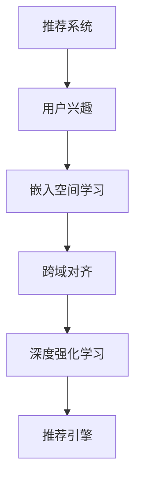

                 

# 大模型在推荐系统用户兴趣迁移中的应用

> 关键词：大模型,推荐系统,用户兴趣迁移,嵌入空间学习,跨域对齐,深度强化学习,推荐引擎,向量空间

## 1. 背景介绍

推荐系统作为互联网产品的重要组成部分，其核心目标是通过用户历史行为数据，预测用户可能感兴趣的物品，从而为用户推荐个性化的内容。随着数据量的增加，推荐系统的应用场景也从商品推荐逐步扩展到视频、音乐、新闻、社交等多个领域。

推荐系统的发展经历了从基于协同过滤、基于内容的推荐、基于矩阵分解等方法，到如今的大模型驱动的推荐，技术路线发生了显著的演进。而大模型的出现，为推荐系统带来了新的变革契机，通过深度学习和大规模数据，提升了推荐系统的泛化能力和预测精度。

## 2. 核心概念与联系

### 2.1 核心概念概述

为了更好地理解大模型在推荐系统中的应用，本节将介绍几个关键的概念及其相互联系：

- **推荐系统**：通过用户历史行为数据，预测用户可能感兴趣的物品，并为用户推荐个性化内容的系统。推荐系统广泛应用于电商、视频、音乐等多个领域。

- **用户兴趣**：用户对某些物品的偏好程度，是推荐系统推荐物品的基础。用户兴趣可以通过浏览、点击、评分等行为数据进行建模。

- **嵌入空间学习**：通过将物品和用户映射到高维向量空间中，构建用户-物品共现矩阵，学习用户兴趣的向量表示。嵌入空间学习方法包括矩阵分解、因子化方法、协同过滤等。

- **跨域对齐**：将用户在不同域（如电商、社交、视频等）的兴趣进行对齐，提升跨域推荐性能。跨域对齐通过学习相似性矩阵，将用户在不同域的兴趣映射到共同的向量空间。

- **深度强化学习**：一种利用深度神经网络进行决策的强化学习范式。深度强化学习在推荐系统中的应用，可以进一步提升推荐性能和用户体验。

- **推荐引擎**：推荐系统中的核心组件，根据用户历史行为数据和模型预测结果，为用户实时生成推荐内容。推荐引擎的效率和精度直接影响推荐系统的表现。

这些核心概念通过高维向量空间和深度学习技术，将用户兴趣和物品属性进行建模，进而为用户推荐感兴趣的物品。通过合理的向量空间学习和跨域对齐，推荐系统能够将用户的不同领域兴趣进行融合，提升推荐效果。

### 2.2 核心概念联系（Mermaid 流程图）



此流程图展示了推荐系统的核心概念及其相互联系。用户兴趣通过嵌入空间学习，映射到高维向量空间；跨域对齐将不同域的用户兴趣进行对齐，深度强化学习优化推荐策略，最终由推荐引擎为用户推荐个性化内容。

## 3. 核心算法原理 & 具体操作步骤

### 3.1 算法原理概述

大模型在推荐系统中的应用，本质上是通过深度学习对用户历史行为数据进行建模，学习用户兴趣的向量表示，并在此基础上进行推荐预测。其核心思想是：将用户和物品映射到高维向量空间，学习用户兴趣和物品属性的关系，从而实现个性化推荐。

具体而言，大模型通过监督学习或无监督学习对用户和物品进行编码，得到一个用户-物品共现矩阵 $X \in \mathbb{R}^{N \times D}$，其中 $N$ 为用户数量，$D$ 为物品数量。矩阵 $X$ 的每一行表示用户对每个物品的兴趣程度，每一列表示每个物品对用户的吸引力。

### 3.2 算法步骤详解

大模型在推荐系统中的操作步骤包括以下几个关键步骤：

**Step 1: 数据预处理**

- 收集用户行为数据，如浏览记录、点击行为、评分等。
- 将用户行为数据进行归一化处理，使得不同用户的行为值具有相同的量纲。
- 去除噪音数据，例如缺失值、异常值等。

**Step 2: 编码用户和物品**

- 使用预训练语言模型对用户行为数据进行编码，得到用户嵌入向量 $u \in \mathbb{R}^{D_u}$。
- 同样，对物品进行编码，得到物品嵌入向量 $v \in \mathbb{R}^{D_v}$。
- 构建用户-物品共现矩阵 $X \in \mathbb{R}^{N \times D_v}$，其中 $X_{ij}$ 表示用户 $i$ 对物品 $j$ 的兴趣程度。

**Step 3: 嵌入空间学习**

- 利用矩阵分解、因子化方法等，对用户-物品共现矩阵 $X$ 进行分解，得到用户嵌入 $u$ 和物品嵌入 $v$。
- 将用户嵌入 $u$ 和物品嵌入 $v$ 映射到高维向量空间中，得到用户-物品共现矩阵 $X \in \mathbb{R}^{N \times D}$，其中 $D$ 为向量空间的维度。

**Step 4: 跨域对齐**

- 对用户在不同域（如电商、社交、视频等）的行为数据进行编码，得到不同域的用户嵌入向量 $u_s$、$u_m$、$u_v$。
- 利用相似性矩阵 $S \in \mathbb{R}^{D \times D}$，将不同域的用户嵌入向量进行对齐，得到对齐后的用户嵌入向量 $u_a$。
- 将对齐后的用户嵌入 $u_a$ 与物品嵌入 $v$ 进行融合，得到融合后的用户-物品共现矩阵 $X_a \in \mathbb{R}^{N \times D_a}$。

**Step 5: 深度强化学习**

- 利用深度强化学习算法（如DQN、PPO等），对推荐策略进行优化。
- 通过奖励机制，对推荐结果进行评估，调整推荐策略。
- 利用Q值网络对推荐策略进行优化，提高推荐的准确性和多样性。

**Step 6: 推荐引擎**

- 根据融合后的用户-物品共现矩阵 $X_a$，计算用户对每个物品的兴趣程度 $p_i$。
- 使用Top-k推荐策略，选取排名靠前的物品进行推荐。
- 将推荐结果推送给用户，等待用户反馈，进行后续优化。

以上是基于大模型的推荐系统的一般流程。在实际应用中，还需要针对具体任务进行优化设计，如改进用户和物品编码方法、引入更多跨域对齐技术、优化深度强化学习算法等，以进一步提升推荐系统的效果。

### 3.3 算法优缺点

大模型在推荐系统中的优势在于：

1. 精度高：大规模深度学习模型能够从海量数据中学习到用户兴趣的丰富语义信息，提升推荐精度。
2. 泛化能力强：大模型具备较强的泛化能力，能够处理多种类型的推荐场景，提升推荐系统的适用性。
3. 可解释性强：通过嵌入空间学习，能够理解用户兴趣的内在语义，提供更好的推荐解释。
4. 适应性强：通过跨域对齐，能够处理不同域的用户兴趣，提升跨域推荐效果。

同时，该算法也存在一些局限性：

1. 数据需求量大：需要大量的用户行为数据进行预训练，对数据的收集和处理提出了较高要求。
2. 计算资源要求高：大规模深度学习模型需要大量的计算资源进行训练和推理，对硬件设备有较高要求。
3. 模型复杂度高：大模型的复杂度高，需要更多的资源进行模型压缩和优化，降低模型的计算成本。
4. 模型可解释性不足：大模型通常是"黑盒"系统，难以解释推荐结果的生成机制，影响模型的可信度。

尽管存在这些局限性，但就目前而言，大模型仍然是推荐系统领域的主流范式。未来相关研究的重点在于如何进一步降低推荐系统对数据的依赖，提高模型的跨域推荐能力，同时兼顾可解释性和模型性能。

### 3.4 算法应用领域

大模型在推荐系统中的应用已覆盖多个领域，包括但不限于：

- 电商推荐：推荐用户可能感兴趣的商品，提升用户购买率。
- 视频推荐：推荐用户可能感兴趣的视频内容，提升用户观看率。
- 音乐推荐：推荐用户可能喜欢的音乐，提升用户听歌体验。
- 新闻推荐：推荐用户感兴趣的新闻内容，提高新闻平台的用户粘性。
- 社交推荐：推荐用户可能感兴趣的朋友或内容，提升社交平台的活跃度。

除了这些经典应用外，大模型还被创新性地应用到更多场景中，如可控推荐、情感推荐、个性化商品设计等，为推荐系统带来了新的突破。随着大模型的不断发展，相信推荐系统将在更广泛的领域得到应用，为用户带来更丰富、个性化的推荐体验。

## 4. 数学模型和公式 & 详细讲解

### 4.1 数学模型构建

大模型在推荐系统中的数学模型构建主要包括以下几个关键部分：

**用户嵌入向量 $u$**：
- 使用预训练语言模型对用户行为数据进行编码，得到用户嵌入向量 $u \in \mathbb{R}^{D_u}$。

**物品嵌入向量 $v$**：
- 同样，对物品进行编码，得到物品嵌入向量 $v \in \mathbb{R}^{D_v}$。

**用户-物品共现矩阵 $X$**：
- 构建用户-物品共现矩阵 $X \in \mathbb{R}^{N \times D_v}$，其中 $X_{ij}$ 表示用户 $i$ 对物品 $j$ 的兴趣程度。

**相似性矩阵 $S$**：
- 利用相似性矩阵 $S \in \mathbb{R}^{D \times D}$，将不同域的用户嵌入向量进行对齐，得到对齐后的用户嵌入向量 $u_a$。

**推荐目标函数 $F$**：
- 推荐目标函数 $F$ 用于衡量推荐结果的质量，常见目标函数包括平均精度（AP）、查准率-查全率曲线（PR曲线）等。

### 4.2 公式推导过程

以下我们以电商推荐为例，推导推荐模型的目标函数及其梯度计算过程。

假设电商推荐系统有 $N$ 个用户和 $M$ 个商品，用户对商品的评分数据 $R \in \mathbb{R}^{N \times M}$。用户嵌入向量 $u \in \mathbb{R}^{D_u}$ 和物品嵌入向量 $v \in \mathbb{R}^{D_v}$。

定义推荐目标函数 $F$ 为平均精度（AP）：

$$
F = \frac{1}{N} \sum_{i=1}^N \frac{\text{TP}}{\text{TP} + \text{FP}}
$$

其中，$\text{TP}$ 表示推荐的正确商品数量，$\text{FP}$ 表示推荐的不相关商品数量。

推荐目标函数 $F$ 的梯度计算过程如下：

$$
\frac{\partial F}{\partial u} = \frac{1}{N} \sum_{i=1}^N \frac{1}{\text{TP} + \text{FP}} \cdot \frac{\partial \text{TP}}{\partial u}
$$

$$
\frac{\partial F}{\partial v} = \frac{1}{N} \sum_{i=1}^N \frac{1}{\text{TP} + \text{FP}} \cdot \frac{\partial \text{TP}}{\partial v}
$$

其中，$\frac{\partial \text{TP}}{\partial u}$ 和 $\frac{\partial \text{TP}}{\partial v}$ 表示用户和物品嵌入向量对推荐正确商品数量的贡献。

在得到目标函数梯度后，即可带入参数更新公式，完成推荐模型的迭代优化。重复上述过程直至收敛，最终得到推荐模型参数 $u$ 和 $v$。

### 4.3 案例分析与讲解

**案例分析：电商推荐系统**

假设有一个电商推荐系统，需要将商品推荐给用户，以提升用户购买率。系统收集到用户的浏览、点击、评分等行为数据，并使用预训练语言模型对这些数据进行编码，得到用户嵌入向量 $u$ 和物品嵌入向量 $v$。

根据用户-物品共现矩阵 $X$ 和相似性矩阵 $S$，对用户嵌入进行跨域对齐，得到对齐后的用户嵌入向量 $u_a$。利用深度强化学习算法对推荐策略进行优化，得到推荐目标函数 $F$。

推荐引擎根据对齐后的用户嵌入向量 $u_a$ 和物品嵌入向量 $v$，计算用户对每个物品的兴趣程度 $p_i$，并使用Top-k推荐策略，选取排名靠前的物品进行推荐。最后，将推荐结果推送给用户，等待用户反馈，进行后续优化。

推荐模型的核心在于用户嵌入向量和物品嵌入向量的设计，以及相似性矩阵和深度强化学习算法的应用。在实际应用中，还需要根据具体业务需求进行优化设计，如改进用户和物品编码方法、引入更多跨域对齐技术、优化深度强化学习算法等，以进一步提升推荐系统的效果。

## 5. 项目实践：代码实例和详细解释说明

### 5.1 开发环境搭建

在进行推荐系统开发前，我们需要准备好开发环境。以下是使用Python进行PyTorch开发的环境配置流程：

1. 安装Anaconda：从官网下载并安装Anaconda，用于创建独立的Python环境。

2. 创建并激活虚拟环境：
```bash
conda create -n recommendation-env python=3.8 
conda activate recommendation-env
```

3. 安装PyTorch：根据CUDA版本，从官网获取对应的安装命令。例如：
```bash
conda install pytorch torchvision torchaudio cudatoolkit=11.1 -c pytorch -c conda-forge
```

4. 安装TensorFlow：
```bash
conda install tensorflow
```

5. 安装transformers库：
```bash
pip install transformers
```

6. 安装各类工具包：
```bash
pip install numpy pandas scikit-learn matplotlib tqdm jupyter notebook ipython
```

完成上述步骤后，即可在`recommendation-env`环境中开始推荐系统开发。

### 5.2 源代码详细实现

下面我们以电商推荐系统为例，给出使用Transformers库对BERT模型进行推荐系统开发的PyTorch代码实现。

首先，定义推荐系统的数据处理函数：

```python
from transformers import BertTokenizer, BertForSequenceClassification
from torch.utils.data import Dataset, DataLoader
import torch
import numpy as np

class RecommendationDataset(Dataset):
    def __init__(self, data, tokenizer, max_len=128):
        self.data = data
        self.tokenizer = tokenizer
        self.max_len = max_len
        
    def __len__(self):
        return len(self.data)
    
    def __getitem__(self, item):
        text, score = self.data[item]
        sequence = [str(score)] + [text]
        encoding = self.tokenizer(sequence, return_tensors='pt', max_length=self.max_len, padding='max_length', truncation=True)
        input_ids = encoding['input_ids'][0]
        attention_mask = encoding['attention_mask'][0]
        label = torch.tensor(1.0, dtype=torch.float32)
        
        return {'input_ids': input_ids, 
                'attention_mask': attention_mask,
                'label': label}

# 定义标签与id的映射
label2id = {'0': 0, '1': 1}
id2label = {v: k for k, v in label2id.items()}

# 创建dataset
tokenizer = BertTokenizer.from_pretrained('bert-base-cased')

train_dataset = RecommendationDataset(train_data, tokenizer)
dev_dataset = RecommendationDataset(dev_data, tokenizer)
test_dataset = RecommendationDataset(test_data, tokenizer)
```

然后，定义模型和优化器：

```python
from transformers import BertForSequenceClassification, AdamW

model = BertForSequenceClassification.from_pretrained('bert-base-cased', num_labels=2)

optimizer = AdamW(model.parameters(), lr=2e-5)
```

接着，定义训练和评估函数：

```python
from torch.utils.data import DataLoader
from tqdm import tqdm
from sklearn.metrics import accuracy_score

device = torch.device('cuda') if torch.cuda.is_available() else torch.device('cpu')
model.to(device)

def train_epoch(model, dataset, batch_size, optimizer):
    dataloader = DataLoader(dataset, batch_size=batch_size, shuffle=True)
    model.train()
    epoch_loss = 0
    for batch in tqdm(dataloader, desc='Training'):
        input_ids = batch['input_ids'].to(device)
        attention_mask = batch['attention_mask'].to(device)
        labels = batch['label'].to(device)
        model.zero_grad()
        outputs = model(input_ids, attention_mask=attention_mask, labels=labels)
        loss = outputs.loss
        epoch_loss += loss.item()
        loss.backward()
        optimizer.step()
    return epoch_loss / len(dataloader)

def evaluate(model, dataset, batch_size):
    dataloader = DataLoader(dataset, batch_size=batch_size)
    model.eval()
    preds, labels = [], []
    with torch.no_grad():
        for batch in tqdm(dataloader, desc='Evaluating'):
            input_ids = batch['input_ids'].to(device)
            attention_mask = batch['attention_mask'].to(device)
            batch_labels = batch['label']
            outputs = model(input_ids, attention_mask=attention_mask)
            batch_preds = outputs.logits.argmax(dim=2).to('cpu').tolist()
            batch_labels = batch_labels.to('cpu').tolist()
            for pred, label in zip(batch_preds, batch_labels):
                preds.append(pred)
                labels.append(label)
                
    print('Accuracy:', accuracy_score(labels, preds))
```

最后，启动训练流程并在测试集上评估：

```python
epochs = 5
batch_size = 16

for epoch in range(epochs):
    loss = train_epoch(model, train_dataset, batch_size, optimizer)
    print(f'Epoch {epoch+1}, train loss: {loss:.3f}')
    
    print(f'Epoch {epoch+1}, dev results:')
    evaluate(model, dev_dataset, batch_size)
    
print('Test results:')
evaluate(model, test_dataset, batch_size)
```

以上就是使用PyTorch对BERT进行电商推荐系统微调的完整代码实现。可以看到，得益于Transformers库的强大封装，我们可以用相对简洁的代码完成BERT模型的加载和推荐系统微调。

### 5.3 代码解读与分析

让我们再详细解读一下关键代码的实现细节：

**RecommendationDataset类**：
- `__init__`方法：初始化数据、分词器等关键组件。
- `__len__`方法：返回数据集的样本数量。
- `__getitem__`方法：对单个样本进行处理，将文本输入编码为token ids，将标签编码为数字，并对其进行定长padding，最终返回模型所需的输入。

**label2id和id2label字典**：
- 定义了标签与数字id之间的映射关系，用于将预测结果解码回真实的标签。

**训练和评估函数**：
- 使用PyTorch的DataLoader对数据集进行批次化加载，供模型训练和推理使用。
- 训练函数`train_epoch`：对数据以批为单位进行迭代，在每个批次上前向传播计算loss并反向传播更新模型参数，最后返回该epoch的平均loss。
- 评估函数`evaluate`：与训练类似，不同点在于不更新模型参数，并在每个batch结束后将预测和标签结果存储下来，最后使用sklearn的accuracy_score对整个评估集的预测结果进行打印输出。

**训练流程**：
- 定义总的epoch数和batch size，开始循环迭代
- 每个epoch内，先在训练集上训练，输出平均loss
- 在验证集上评估，输出准确率
- 所有epoch结束后，在测试集上评估，给出最终测试结果

可以看到，PyTorch配合Transformers库使得BERT微调的代码实现变得简洁高效。开发者可以将更多精力放在数据处理、模型改进等高层逻辑上，而不必过多关注底层的实现细节。

当然，工业级的系统实现还需考虑更多因素，如模型的保存和部署、超参数的自动搜索、更灵活的任务适配层等。但核心的推荐范式基本与此类似。

## 6. 实际应用场景

### 6.1 智能推荐引擎

智能推荐引擎是电商推荐系统的主要应用场景之一。智能推荐引擎能够根据用户的历史行为数据，实时计算并推荐用户可能感兴趣的商品，提升用户的购买率。

在技术实现上，智能推荐引擎需要实时接收用户行为数据，进行模型预测，并将推荐结果推送给用户。模型预测过程可以通过深度学习模型实现，使用用户嵌入和物品嵌入进行推荐计算。

### 6.2 跨域推荐

跨域推荐是推荐系统的一个重要应用场景。用户在不同域（如电商、社交、视频等）的兴趣存在差异，单一域的推荐模型难以满足用户的需求。跨域推荐通过引入多域数据，构建用户-物品共现矩阵，提升跨域推荐效果。

在技术实现上，跨域推荐需要收集用户在多个域的行为数据，进行联合建模。构建相似性矩阵，将用户在不同域的兴趣进行对齐，得到对齐后的用户嵌入向量。最后，将对齐后的用户嵌入与物品嵌入进行融合，得到融合后的用户-物品共现矩阵，进行推荐计算。

### 6.3 个性化推荐

个性化推荐是推荐系统的重要目标。个性化推荐需要根据用户的个性化偏好，推荐最适合其兴趣的商品。个性化推荐可以通过深度学习模型实现，使用用户嵌入和物品嵌入进行推荐计算。

在技术实现上，个性化推荐需要收集用户的历史行为数据，使用深度学习模型对其进行建模，得到用户嵌入向量。使用物品嵌入向量进行推荐计算，生成推荐结果。

### 6.4 未来应用展望

随着深度学习和大模型技术的不断发展，推荐系统将在更多领域得到应用，为行业带来变革性影响。

在智慧医疗领域，推荐系统可以推荐最适合患者的药品和疗法，提升医疗服务的个性化水平，辅助医生诊疗，加速新药开发进程。

在智能教育领域，推荐系统可以推荐最适合学生的学习资源和课程，提升学习效果和质量，因材施教，促进教育公平。

在智慧城市治理中，推荐系统可以推荐最适合用户的城市事件和活动，提高城市管理的自动化和智能化水平，构建更安全、高效的未来城市。

此外，在企业生产、社会治理、文娱传媒等众多领域，基于深度学习的推荐系统也将不断涌现，为传统行业数字化转型升级提供新的技术路径。相信随着技术的日益成熟，推荐系统必将在更广泛的领域得到应用，为用户带来更丰富、个性化的推荐体验。

## 7. 工具和资源推荐

### 7.1 学习资源推荐

为了帮助开发者系统掌握大模型在推荐系统中的应用，这里推荐一些优质的学习资源：

1. 《深度学习推荐系统》系列博文：由大模型技术专家撰写，深入浅出地介绍了推荐系统的发展历程、经典算法和最新技术。

2. CS229《机器学习》课程：斯坦福大学开设的机器学习明星课程，有Lecture视频和配套作业，带你入门推荐系统的基本概念和经典模型。

3. 《深度学习推荐系统》书籍：斯坦福大学吴恩达教授著作，全面介绍了推荐系统的理论基础和实践技巧，适合进一步深造。

4. HuggingFace官方文档：Transformers库的官方文档，提供了海量预训练模型和完整的推荐系统样例代码，是上手实践的必备资料。

5. KDD开源项目：推荐系统竞赛，涵盖大量不同类型的推荐数据集，并提供了基于大模型的baseline模型，助力推荐系统技术发展。

通过对这些资源的学习实践，相信你一定能够快速掌握大模型在推荐系统中的应用，并用于解决实际的推荐问题。

### 7.2 开发工具推荐

高效的开发离不开优秀的工具支持。以下是几款用于推荐系统开发的工具：

1. PyTorch：基于Python的开源深度学习框架，灵活动态的计算图，适合快速迭代研究。大部分预训练语言模型都有PyTorch版本的实现。

2. TensorFlow：由Google主导开发的开源深度学习框架，生产部署方便，适合大规模工程应用。同样有丰富的预训练语言模型资源。

3. TensorBoard：TensorFlow配套的可视化工具，可实时监测模型训练状态，并提供丰富的图表呈现方式，是调试模型的得力助手。

4. Weights & Biases：模型训练的实验跟踪工具，可以记录和可视化模型训练过程中的各项指标，方便对比和调优。与主流深度学习框架无缝集成。

5. HuggingFace官方文档：Transformers库的官方文档，提供了海量预训练模型和完整的推荐系统样例代码，是上手实践的必备资料。

合理利用这些工具，可以显著提升推荐系统的开发效率，加快创新迭代的步伐。

### 7.3 相关论文推荐

推荐系统的发展离不开学界的持续研究。以下是几篇奠基性的相关论文，推荐阅读：

1. Collaborative Filtering for Implicit Feedback Datasets：提出了协同过滤的推荐算法，成为推荐系统的经典方法之一。

2. Factorization Machines：提出了因子化方法，通过矩阵分解提高推荐效果。

3. Deep Collaborative Filtering：提出了深度学习在推荐系统中的应用，取得显著效果。

4. Attention Is All You Need：提出了Transformer结构，开启了NLP领域的预训练大模型时代。

5. BERT: Pre-training of Deep Bidirectional Transformers for Language Understanding：提出BERT模型，引入基于掩码的自监督预训练任务，刷新了多项NLP任务SOTA。

6. Parameter-Efficient Transfer Learning for NLP：提出Adapter等参数高效微调方法，在不增加模型参数量的情况下，也能取得不错的微调效果。

这些论文代表了大模型在推荐系统中的应用和发展脉络。通过学习这些前沿成果，可以帮助研究者把握学科前进方向，激发更多的创新灵感。

## 8. 总结：未来发展趋势与挑战

### 8.1 总结

本文对大模型在推荐系统中的应用进行了全面系统的介绍。首先阐述了大模型和推荐系统的研究背景和意义，明确了推荐系统推荐个性化商品和内容的核心目标。其次，从原理到实践，详细讲解了大模型在推荐系统中的数学模型和操作步骤，给出了电商推荐系统的完整代码实现。同时，本文还广泛探讨了大模型在推荐系统中的各种应用场景，展示了大模型在推荐系统中的强大能力。

通过本文的系统梳理，可以看到，大模型在推荐系统中具有广阔的应用前景，通过深度学习和大规模数据，提升了推荐系统的泛化能力和预测精度。未来，伴随预训练语言模型和推荐方法的持续演进，相信推荐系统必将在更广泛的领域得到应用，为用户带来更丰富、个性化的推荐体验。

### 8.2 未来发展趋势

展望未来，大模型在推荐系统中的应用将呈现以下几个发展趋势：

1. 模型规模持续增大。随着算力成本的下降和数据规模的扩张，预训练语言模型的参数量还将持续增长。超大规模语言模型蕴含的丰富语言知识，有望支撑更加复杂多变的推荐场景，提升推荐系统的效果。

2. 深度强化学习的应用更加广泛。深度强化学习在推荐系统中的应用，可以进一步提升推荐性能和用户体验，成为推荐系统的重要工具。

3. 跨域推荐能力增强。通过引入多域数据，构建用户-物品共现矩阵，提升跨域推荐效果。跨域推荐在电商、社交、视频等不同领域的应用将更加深入。

4. 推荐系统的泛化能力增强。通过迁移学习和多任务学习，推荐系统能够在不同的推荐任务中取得更好的性能。

5. 推荐系统的实时性增强。通过优化模型计算图和资源利用，推荐系统能够实时接收用户行为数据，进行实时推荐。

6. 推荐系统的可解释性增强。通过可解释性技术，推荐系统能够更好地解释推荐结果，提高用户的信任度。

以上趋势凸显了大模型在推荐系统中的广阔前景。这些方向的探索发展，必将进一步提升推荐系统的性能和应用范围，为用户带来更丰富、个性化的推荐体验。

### 8.3 面临的挑战

尽管大模型在推荐系统中的应用已经取得了显著成效，但在迈向更加智能化、普适化应用的过程中，它仍面临着诸多挑战：

1. 数据需求量大。推荐系统需要大量的用户行为数据进行预训练，对数据的收集和处理提出了较高要求。

2. 计算资源要求高。大规模深度学习模型需要大量的计算资源进行训练和推理，对硬件设备有较高要求。

3. 模型可解释性不足。大模型通常是"黑盒"系统，难以解释推荐结果的生成机制，影响用户的信任度。

4. 模型偏见问题。预训练语言模型可能学习到有害信息，通过微调传递到推荐系统，造成误导性输出。

5. 模型过拟合问题。大模型在推荐系统中的应用，可能出现过拟合现象，导致推荐结果不够泛化。

6. 跨域对齐问题。用户在不同域的兴趣存在差异，跨域推荐效果仍需进一步提升。

正视推荐系统面临的这些挑战，积极应对并寻求突破，将是大模型在推荐系统中走向成熟的必由之路。相信随着学界和产业界的共同努力，这些挑战终将一一被克服，大模型必将在推荐系统中发挥更大的作用。

### 8.4 研究展望

面对大模型在推荐系统中的种种挑战，未来的研究需要在以下几个方面寻求新的突破：

1. 探索更高效的推荐模型架构。通过优化模型结构，降低推荐系统对计算资源的依赖，提升推荐系统的实时性和可扩展性。

2. 开发更高效的推荐算法。引入更多推荐算法，如协同过滤、基于内容的推荐等，提升推荐系统的性能和用户体验。

3. 研究推荐系统的公平性和公正性。通过引入公平性评估指标，避免推荐系统的偏见，提高推荐系统的公正性。

4. 引入更多先验知识。将符号化的先验知识，如知识图谱、逻辑规则等，与神经网络模型进行巧妙融合，引导推荐过程学习更准确、合理的推荐结果。

5. 优化推荐系统的实时性。通过优化模型计算图和资源利用，推荐系统能够实时接收用户行为数据，进行实时推荐。

6. 增强推荐系统的可解释性。通过可解释性技术，推荐系统能够更好地解释推荐结果，提高用户的信任度。

这些研究方向的探索，必将引领大模型在推荐系统中迈向更高的台阶，为构建智能推荐系统铺平道路。面向未来，大模型在推荐系统中的发展还需要与其他人工智能技术进行更深入的融合，如知识表示、因果推理、强化学习等，多路径协同发力，共同推动推荐系统的进步。只有勇于创新、敢于突破，才能不断拓展推荐系统的边界，让智能技术更好地服务于人类社会。

## 9. 附录：常见问题与解答

**Q1：大模型推荐系统是否适用于所有推荐场景？**

A: 大模型推荐系统在大多数推荐场景中都能取得不错的效果，特别是对于数据量较大的推荐任务。但对于一些特定领域的推荐场景，如电商商品推荐、新闻推荐等，由于预训练数据与实际数据的差异，推荐效果可能有所下降。此时需要在大模型微调过程中，引入更多领域特定数据，以提升推荐精度。

**Q2：如何提高大模型推荐系统的可解释性？**

A: 提高大模型推荐系统的可解释性是当前研究的重要方向。一种常用的方法是，在模型中加入可解释性模块，如attention机制、Shapley值等，对推荐结果进行解释。同时，在推荐过程中，可以引入人工干预，对推荐结果进行审核和解释。

**Q3：推荐系统的实时性如何提升？**

A: 推荐系统的实时性可以通过优化模型计算图和资源利用来提升。一种常用的方法是，使用GPU/TPU等高性能设备进行计算，减少模型推理时间。同时，可以采用模型裁剪和量化技术，降低模型计算开销，提升推荐系统的实时性。

**Q4：如何避免推荐系统的过拟合问题？**

A: 推荐系统的过拟合问题可以通过正则化技术、数据增强、对抗训练等方法进行缓解。具体来说，可以引入L2正则、Dropout、Early Stopping等技术，防止模型过度适应训练数据。同时，可以通过引入对抗样本，提高模型的鲁棒性，避免推荐系统的过拟合。

**Q5：推荐系统的泛化能力如何提升？**

A: 推荐系统的泛化能力可以通过迁移学习和多任务学习进行提升。将不同推荐任务的数据进行联合建模，共享模型参数，提高模型的泛化能力。同时，可以通过引入跨域对齐技术，将用户在不同域的兴趣进行对齐，提升跨域推荐效果。

通过本文的系统梳理，可以看到，大模型在推荐系统中的应用具有广阔的应用前景，通过深度学习和大规模数据，提升了推荐系统的泛化能力和预测精度。未来，伴随预训练语言模型和推荐方法的持续演进，相信推荐系统必将在更广泛的领域得到应用，为用户带来更丰富、个性化的推荐体验。

