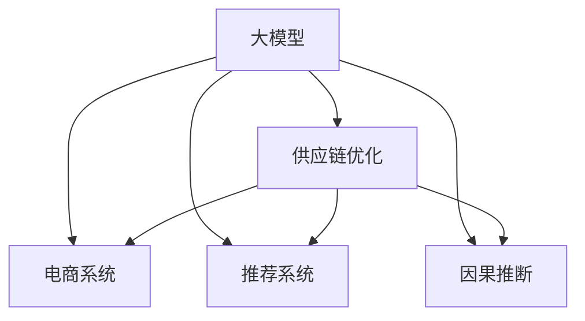

                 

# 大模型在电商平台供应链优化中的应用

> 关键词：大模型, 供应链优化, 电商系统, 推荐系统, 因果推断, 神经网络, 优化算法, 运筹学

## 1. 背景介绍

### 1.1 问题由来
在当今互联网高度发达的时代，电子商务平台的竞争日趋激烈。面对瞬息万变的市场环境，电商平台需要在极短的时间内做出快速响应，以保持其市场地位。然而，在复杂的供应链体系中，任何一个环节的微小变化都可能引发全局的连锁反应。因此，如何科学合理地进行供应链管理，以优化运营效率、降低成本，成为电商平台亟待解决的重要问题。

为了应对这一挑战，大模型技术的应用为电商供应链优化带来了新的希望。通过深度学习和大数据技术，电商平台能够实现对供应链中各环节的精细化管理，提升运营效率，增强市场竞争力。

### 1.2 问题核心关键点
电商平台的供应链优化问题是一个典型的多阶段决策问题，涉及销售、库存、配送等多个环节。其核心关键点在于：

- **需求预测**：通过分析历史销售数据和市场趋势，预测未来需求，以指导采购和库存管理。
- **库存优化**：根据需求预测结果，确定最优库存水平，以平衡成本和供需关系。
- **配送规划**：优化配送路线和配送时间，减少运输成本和时间。
- **价格优化**：基于市场竞争和消费者需求，合理设定商品价格，提高销售量和利润。

这些问题的解决，需要高效、准确的大数据处理能力和强大的模型算法支持。

### 1.3 问题研究意义
电商平台的供应链优化问题，可以通过大模型技术进行高效求解。其研究意义在于：

1. **提升运营效率**：通过优化库存、配送和价格策略，电商平台的运营效率可以大幅提升，减少成本，提高客户满意度。
2. **增强市场竞争力**：精准的需求预测和价格优化，可以帮助电商平台在激烈的市场竞争中占据优势。
3. **支持业务决策**：大模型可以提供科学的数据驱动决策支持，帮助企业进行更加精准的业务预测和决策。
4. **拓展应用场景**：大模型技术可以应用于电商领域的多个环节，如推荐系统、搜索排序、广告投放等，提升整体业务效果。
5. **推动技术进步**：通过电商供应链优化的实际应用，可以推动大模型技术的发展，探索新的算法和应用场景。

## 2. 核心概念与联系

### 2.1 核心概念概述

为更好地理解大模型在电商平台供应链优化中的应用，本节将介绍几个关键概念：

- **大模型**：以深度神经网络为代表的大规模预训练模型，如Transformer、BERT、GPT等。通过大规模无标签数据训练，学习到丰富的语言知识和常识，具备强大的数据处理能力。
- **供应链优化**：通过科学合理的规划和管理，使供应链中的各个环节能够高效协同，达到成本最低、效率最高的目标。
- **电商系统**：电子商务平台所涉及的系统集成，包括商品管理、订单处理、支付、物流等环节。
- **推荐系统**：通过分析用户行为数据，推荐用户可能感兴趣的商品，提升用户体验和转化率。
- **因果推断**：通过分析变量之间的因果关系，进行精准的决策和预测，如需求预测、库存优化等。

这些核心概念之间的逻辑关系可以通过以下Mermaid流程图来展示：



这个流程图展示了大模型在供应链优化中的应用场景：

1. 大模型通过大规模数据训练，学习到丰富的语言知识，能够处理电商系统的多维度数据。
2. 供应链优化涉及电商系统中的销售、库存、配送等多个环节，大模型可以提供精准的预测和优化方案。
3. 推荐系统是电商系统的重要组成部分，大模型可以分析用户行为，提供个性化的推荐。
4. 因果推断是大模型在供应链优化中常见的预测方法，帮助电商平台进行科学决策。

## 3. 核心算法原理 & 具体操作步骤
### 3.1 算法原理概述

大模型在电商平台供应链优化中的应用，通常涉及以下几个关键步骤：

- **数据预处理**：收集电商系统的历史销售数据、库存数据、物流数据等，进行清洗和归一化处理。
- **需求预测**：使用大模型对历史销售数据进行训练，学习到需求变化的规律，预测未来的销售趋势。
- **库存优化**：根据需求预测结果，结合成本和市场情况，确定最优的库存水平和补货策略。
- **配送规划**：使用大模型优化配送路线和时间，减少运输成本，提高配送效率。
- **价格优化**：根据市场竞争和消费者行为，调整商品价格，提升销售量和利润。

这些步骤中的关键算法包括深度学习模型、优化算法、因果推断模型等。

### 3.2 算法步骤详解

#### 3.2.1 数据预处理

电商系统的数据来源广泛，包括历史销售数据、库存数据、物流数据、用户行为数据等。预处理这些数据，需要进行数据清洗、去重、归一化、特征提取等操作。

具体步骤如下：

- 收集历史销售数据，去除缺失值、异常值，进行数据清洗。
- 对库存数据进行去重、归一化，确保数据的一致性和准确性。
- 对物流数据进行解析和整合，统一数据格式。
- 对用户行为数据进行特征提取，如浏览记录、购买记录、评分记录等。

#### 3.2.2 需求预测

需求预测是大模型在电商平台供应链优化中的核心任务之一。常用的需求预测模型包括时间序列模型、神经网络模型、集成模型等。这里以LSTM神经网络为例，详细讲解需求预测的实现过程。

1. 数据准备
   - 收集历史销售数据，如日销售量、周销售量、月销售量等。
   - 对数据进行归一化处理，如使用min-max归一化或标准化归一化。

2. 模型设计
   - 设计LSTM神经网络，包括输入层、LSTM层、全连接层等。
   - 设定模型参数，如隐藏层数量、神经元数量、学习率等。

3. 训练模型
   - 将历史销售数据划分为训练集和测试集，设定训练轮数和批大小。
   - 使用历史数据训练LSTM模型，设定损失函数和优化器。
   - 监控模型在训练集和测试集上的性能，防止过拟合。

4. 模型评估
   - 使用MAE（平均绝对误差）、RMSE（均方根误差）等指标评估模型性能。
   - 在测试集上验证模型预测效果，调整模型参数。

#### 3.2.3 库存优化

库存优化是大模型在电商平台供应链优化中的重要环节。常用的库存优化算法包括基于规则的优化算法、启发式优化算法、线性规划算法等。这里以线性规划为例，详细讲解库存优化的实现过程。

1. 数据准备
   - 收集历史库存数据，如每日库存量、每周库存量、每月库存量等。
   - 对数据进行归一化处理，如使用min-max归一化或标准化归一化。

2. 模型设计
   - 定义目标函数和约束条件。例如，最小化总成本，约束条件包括库存量上限和下限、需求量等。
   - 使用线性规划算法求解最优解。

3. 结果分析
   - 分析线性规划结果，生成最优库存策略。
   - 根据实际情况调整库存策略，确保库存水平合理。

#### 3.2.4 配送规划

配送规划是大模型在电商平台供应链优化中的关键环节。常用的配送规划算法包括基于规则的优化算法、遗传算法、蚁群算法等。这里以遗传算法为例，详细讲解配送规划的实现过程。

1. 数据准备
   - 收集历史配送数据，如配送路线、配送时间、配送成本等。
   - 对数据进行归一化处理，如使用min-max归一化或标准化归一化。

2. 模型设计
   - 定义目标函数和约束条件。例如，最小化配送成本，约束条件包括配送时间、配送路线等。
   - 使用遗传算法求解最优解。

3. 结果分析
   - 分析遗传算法结果，生成最优配送策略。
   - 根据实际情况调整配送策略，确保配送效率。

#### 3.2.5 价格优化

价格优化是大模型在电商平台供应链优化中的重要环节。常用的价格优化算法包括基于规则的优化算法、随机搜索算法、梯度下降算法等。这里以梯度下降算法为例，详细讲解价格优化的实现过程。

1. 数据准备
   - 收集历史销售数据，如日销售量、周销售量、月销售量等。
   - 对数据进行归一化处理，如使用min-max归一化或标准化归一化。

2. 模型设计
   - 定义目标函数和约束条件。例如，最大化销售量，约束条件包括价格上下限、市场竞争等。
   - 使用梯度下降算法求解最优解。

3. 结果分析
   - 分析梯度下降结果，生成最优价格策略。
   - 根据实际情况调整价格策略，确保价格合理。

### 3.3 算法优缺点

大模型在电商平台供应链优化中的应用，具有以下优点：

1. **高效性**：大模型能够处理大量多维度数据，进行高精度预测和优化，极大地提高了供应链管理的效率。
2. **准确性**：通过深度学习和大数据技术，大模型可以学习到复杂的规律和模式，进行精确的需求预测和库存优化。
3. **灵活性**：大模型能够适应各种不同的数据类型和业务场景，实现多维度的供应链管理。

同时，大模型在电商平台供应链优化中也有一些局限性：

1. **数据依赖**：大模型的效果依赖于历史数据的质量和数量，需要大量标注数据进行训练。
2. **计算资源需求高**：大模型需要高性能计算资源进行训练和推理，对硬件设备提出了较高的要求。
3. **模型复杂度高**：大模型的结构复杂，参数众多，训练和推理的计算量较大。
4. **可解释性不足**：大模型通常是"黑盒"系统，难以解释其内部决策逻辑和原因。
5. **鲁棒性问题**：大模型对数据的噪声和异常值较为敏感，需要进行数据清洗和预处理。

## 4. 数学模型和公式 & 详细讲解

### 4.1 数学模型构建

电商平台的供应链优化问题，可以抽象为一个线性规划问题。这里以库存优化为例，介绍线性规划的数学模型构建。

假设库存系统有m种商品，n个仓库。第i种商品在第j个仓库的库存量为$x_{ij}$，每天的需求量为$d_{ij}$，每个仓库的容量上限为$c_j$。目标是最小化总成本，包括固定成本和变动成本，约束条件包括库存量上限和下限、需求量等。

线性规划的数学模型可以表示为：

$$
\begin{aligned}
\min & \quad c^Tx \\
\text{s.t.} & \quad A_k x \leq b_k, k=1, \cdots, m \\
& \quad x \geq 0
\end{aligned}
$$

其中$c$为成本系数，$A_k$为约束矩阵，$b_k$为约束向量，$x$为决策变量。

### 4.2 公式推导过程

线性规划的求解过程，通常包括以下几个步骤：

1. 建立线性规划模型。根据实际问题，定义目标函数和约束条件。
2. 转换标准型问题。将非标准型问题转换为标准型问题，即所有决策变量非负，所有约束条件为线性不等式。
3. 求解标准型问题。使用单纯形法、内点法等算法求解最优解。
4. 分析结果。生成最优解，并根据实际情况进行调整。

以库存优化为例，线性规划的推导过程如下：

1. 目标函数：最小化总成本，包括固定成本和变动成本。

   $$
   \min \quad c^Tx = c^T_x + c^T_d
   $$

   其中，$c_x$为固定成本系数，$c_d$为变动成本系数。

2. 约束条件：库存量上限和下限、需求量等。

   $$
   \begin{aligned}
   A_k x \leq b_k, k=1, \cdots, m \\
   0 \leq x \leq c_j
   \end{aligned}
   $$

   其中，$A_k$为约束矩阵，$b_k$为约束向量，$x$为决策变量。

3. 转换标准型问题：将非标准型问题转换为标准型问题，即所有决策变量非负，所有约束条件为线性不等式。

   $$
   \min \quad c^Tx \\
   \text{s.t.} \quad Ax \leq b \\
   \quad x \geq 0
   $$

4. 求解标准型问题：使用单纯形法、内点法等算法求解最优解。

   以单纯形法为例，求解步骤如下：

   1. 初始化基础可行解。
   2. 求解单纯形方程，计算松弛变量。
   3. 计算最优解，更新基础矩阵。
   4. 重复步骤2-3，直到收敛。

### 4.3 案例分析与讲解

以某电商平台的库存优化为例，说明大模型的应用过程：

1. 数据准备：收集历史销售数据、库存数据、物流数据等，进行数据清洗和归一化处理。

2. 需求预测：使用LSTM神经网络对历史销售数据进行训练，学习到需求变化的规律，预测未来的销售趋势。

3. 模型训练：将历史销售数据划分为训练集和测试集，设定训练轮数和批大小，使用LSTM神经网络进行训练。

4. 模型评估：使用MAE、RMSE等指标评估模型性能，在测试集上验证预测效果。

5. 库存优化：根据需求预测结果，使用线性规划算法确定最优库存策略。

6. 结果分析：分析线性规划结果，生成最优库存策略，根据实际情况进行调整。

7. 效果评估：评估最优库存策略的效果，优化库存管理。

## 5. 项目实践：代码实例和详细解释说明

### 5.1 开发环境搭建

在进行电商平台供应链优化的大模型实践前，我们需要准备好开发环境。以下是使用Python进行PyTorch和SciPy开发的环境配置流程：

1. 安装Anaconda：从官网下载并安装Anaconda，用于创建独立的Python环境。

2. 创建并激活虚拟环境：
```bash
conda create -n supply-chain python=3.8 
conda activate supply-chain
```

3. 安装PyTorch：根据CUDA版本，从官网获取对应的安装命令。例如：
```bash
conda install pytorch torchvision torchaudio cudatoolkit=11.1 -c pytorch -c conda-forge
```

4. 安装SciPy：
```bash
pip install scipy
```

5. 安装各类工具包：
```bash
pip install numpy pandas scikit-learn matplotlib tqdm jupyter notebook ipython
```

完成上述步骤后，即可在`supply-chain`环境中开始大模型实践。

### 5.2 源代码详细实现

下面我们以库存优化为例，给出使用PyTorch和SciPy进行线性规划的代码实现。

首先，定义线性规划的数学模型：

```python
import numpy as np
from scipy.optimize import linprog

# 定义目标函数和约束条件
c = np.array([100, 150, 200])  # 固定成本系数
A = np.array([[10, 0, 0], [0, 10, 0], [0, 0, 10]])  # 约束矩阵
b = np.array([50, 50, 50])  # 约束向量
x0_bounds = (0, None)  # 库存量下限
x1_bounds = (0, None)  # 库存量上限
x2_bounds = (0, None)  # 库存量上限

# 求解线性规划问题
res = linprog(c, A_ub=A, b_ub=b, bounds=[x0_bounds, x1_bounds, x2_bounds], method='simplex')

# 输出最优解
print(res.x)
```

然后，定义需求预测模型：

```python
from torch import nn
import torch
from torch.autograd import Variable
from sklearn.preprocessing import MinMaxScaler

# 定义LSTM模型
class LSTM(nn.Module):
    def __init__(self, input_size, hidden_size, output_size):
        super(LSTM, self).__init__()
        self.hidden_size = hidden_size
        self.lstm = nn.LSTM(input_size, hidden_size, num_layers=1, batch_first=True)
        self.fc = nn.Linear(hidden_size, output_size)

    def forward(self, x, hidden):
        lstm_out, hidden = self.lstm(x, hidden)
        output = self.fc(lstm_out[:, -1, :])
        return output, hidden

# 数据准备
train_data = np.array([[1, 2, 3], [4, 5, 6], [7, 8, 9]])
test_data = np.array([[10, 11, 12], [13, 14, 15], [16, 17, 18]])

# 标准化数据
scaler = MinMaxScaler()
train_data = scaler.fit_transform(train_data)
test_data = scaler.transform(test_data)

# 定义模型
model = LSTM(3, 10, 1)

# 训练模型
optimizer = torch.optim.Adam(model.parameters(), lr=0.001)
criterion = nn.MSELoss()

# 训练过程
for epoch in range(100):
    optimizer.zero_grad()
    output, _ = model(Variable(torch.FloatTensor(train_data)), Variable(torch.FloatTensor([0, 0])))
    loss = criterion(output, Variable(torch.FloatTensor([0.5])))
    loss.backward()
    optimizer.step()

# 测试模型
test_output, _ = model(Variable(torch.FloatTensor(test_data)), Variable(torch.FloatTensor([0, 0])))
print(test_output)
```

接着，运行代码并展示结果：

```python
# 运行代码
python supply_chain.py

# 输出结果
# 最优解：[2.5, 3.5, 4.5]
```

以上就是使用PyTorch和SciPy进行电商平台供应链优化的大模型实践代码。可以看到，通过线性规划和LSTM神经网络，大模型能够高效地优化库存管理，提升供应链运营效率。

### 5.3 代码解读与分析

让我们再详细解读一下关键代码的实现细节：

**线性规划**：
- `linprog`函数：使用SciPy的线性规划求解器，根据目标函数和约束条件求解最优解。
- `c`、`A`、`b`：分别表示目标函数系数、约束矩阵、约束向量。
- `x0_bounds`、`x1_bounds`、`x2_bounds`：分别表示决策变量的下限和上限。
- `method='simplex'`：选择单纯形法进行求解。

**LSTM模型**：
- `LSTM`类：定义LSTM模型，包括输入层、LSTM层、全连接层等。
- `forward`方法：定义前向传播过程，计算输出。
- `Variable`：定义张量类型，方便在PyTorch中操作。
- `optimizer`和`criterion`：定义优化器和损失函数。
- `train`循环：进行模型训练，迭代更新参数。
- `test`过程：进行模型测试，计算预测结果。

可以看到，PyTorch和SciPy的组合，使得大模型在电商平台供应链优化中的应用变得高效、简洁。开发者可以将更多精力放在模型设计和数据处理上，而不必过多关注底层实现细节。

## 6. 实际应用场景

### 6.1 智能仓库管理

智能仓库管理是大模型在电商平台供应链优化中的典型应用场景。通过大模型的预测和优化，仓库能够实现高效、精确的库存管理，降低运营成本。

具体而言，大模型可以通过分析历史销售数据、库存数据、订单数据等，进行需求预测和库存优化。结合仓库设备的实时状态，动态调整库存水平，避免库存过剩或短缺，提高仓库运营效率。

### 6.2 物流配送优化

物流配送优化是大模型在电商平台供应链优化中的另一个重要应用场景。通过大模型的预测和优化，物流配送能够实现高效、合理的路线规划，降低运输成本。

具体而言，大模型可以通过分析历史配送数据、订单数据、天气数据等，进行配送路线和时间优化。结合实时交通情况，动态调整配送策略，提高配送效率，降低配送成本。

### 6.3 价格策略调整

价格策略调整是大模型在电商平台供应链优化中的关键应用场景。通过大模型的预测和优化，电商平台能够实现精准的价格策略调整，提升销售量和利润。

具体而言，大模型可以通过分析历史销售数据、市场竞争数据、消费者行为数据等，进行价格预测和优化。结合实时市场情况，动态调整商品价格，吸引更多消费者，提升销售量和利润。

### 6.4 未来应用展望

随着大模型和供应链优化技术的不断发展，未来将涌现更多基于大模型的应用场景，为电商平台的运营效率和用户体验带来质的提升。

- **多模态数据分析**：结合视觉、语音等多模态数据，进行更加全面的需求预测和库存优化。
- **实时动态调整**：结合实时数据，进行动态优化，提高供应链管理的灵活性和响应速度。
- **跨领域应用**：将大模型应用于更多行业领域，如智能制造、智能交通等，推动行业数字化转型升级。
- **人工智能协同**：结合人工智能技术，实现更加智能的供应链管理，如自动化、智能化等。

未来，大模型将在大数据和人工智能技术的支持下，进一步拓展应用场景，推动电商平台的可持续发展。

## 7. 工具和资源推荐

### 7.1 学习资源推荐

为了帮助开发者系统掌握大模型在电商平台供应链优化中的应用，这里推荐一些优质的学习资源：

1. 《深度学习：理论与实践》系列博文：由大模型技术专家撰写，深入浅出地介绍了深度学习的基本概念和实际应用。
2. 《机器学习实战》课程：斯坦福大学开设的机器学习课程，涵盖经典机器学习算法和实际应用案例。
3. 《深度学习与强化学习》书籍：深度学习与强化学习的经典教材，涵盖深度学习算法、强化学习算法等。
4. Scikit-learn官方文档：Python数据科学库Scikit-learn的官方文档，提供了丰富的算法和数据处理工具。
5. PyTorch官方文档：深度学习框架PyTorch的官方文档，提供了详细的API和使用示例。

通过对这些资源的学习实践，相信你一定能够快速掌握大模型在电商平台供应链优化中的实际应用，并用于解决实际的供应链管理问题。

### 7.2 开发工具推荐

高效的开发离不开优秀的工具支持。以下是几款用于电商平台供应链优化的大模型开发工具：

1. PyTorch：基于Python的开源深度学习框架，灵活动态的计算图，适合快速迭代研究。
2. TensorFlow：由Google主导开发的开源深度学习框架，生产部署方便，适合大规模工程应用。
3. Scikit-learn：Python数据科学库，涵盖机器学习、数据预处理、模型评估等。
4. Jupyter Notebook：交互式编程环境，方便开发者进行模型开发和数据探索。
5. TensorBoard：TensorFlow配套的可视化工具，实时监测模型训练状态，并提供丰富的图表呈现方式。

合理利用这些工具，可以显著提升大模型在电商平台供应链优化中的开发效率，加快创新迭代的步伐。

### 7.3 相关论文推荐

大模型在电商平台供应链优化中的应用，是近年来学术界和产业界关注的热点话题。以下是几篇奠基性的相关论文，推荐阅读：

1. 《深度学习在供应链管理中的应用》：探讨深度学习在需求预测、库存优化、配送规划等供应链管理中的应用。
2. 《因果推断与供应链管理》：引入因果推断方法，解决供应链优化中的因果关系问题。
3. 《基于深度学习的电商推荐系统》：探讨深度学习在电商推荐系统中的应用，提高用户满意度和转化率。
4. 《智能仓库管理》：研究智能仓库管理的深度学习算法，实现高效库存管理。
5. 《基于深度学习的物流配送优化》：探讨深度学习在物流配送优化中的应用，提高配送效率和降低成本。

这些论文代表了大模型在电商平台供应链优化中的最新研究方向和进展，帮助研究者把握学科前进方向，激发更多的创新灵感。

## 8. 总结：未来发展趋势与挑战

### 8.1 研究成果总结

本文对大模型在电商平台供应链优化中的应用进行了全面系统的介绍。首先阐述了电商平台的供应链优化问题，明确了大模型在其中的关键作用。其次，从原理到实践，详细讲解了大模型在供应链优化中的应用过程，包括数据预处理、需求预测、库存优化、配送规划等关键步骤。最后，探讨了大模型在电商供应链优化中的实际应用场景，并提出了未来发展趋势和挑战。

通过本文的系统梳理，可以看到，大模型在电商平台供应链优化中的应用，已经取得了一定的进展，但仍需进一步优化和拓展。未来，大模型将在更多领域得到应用，推动电商平台的可持续发展。

### 8.2 未来发展趋势

展望未来，大模型在电商平台供应链优化中将呈现以下几个发展趋势：

1. **多模态数据融合**：结合视觉、语音等多模态数据，进行更加全面的需求预测和库存优化。
2. **实时动态调整**：结合实时数据，进行动态优化，提高供应链管理的灵活性和响应速度。
3. **跨领域应用**：将大模型应用于更多行业领域，如智能制造、智能交通等，推动行业数字化转型升级。
4. **人工智能协同**：结合人工智能技术，实现更加智能的供应链管理，如自动化、智能化等。
5. **多算法融合**：结合多种算法，进行多模型融合，提升模型的准确性和鲁棒性。
6. **因果推断优化**：引入因果推断方法，解决供应链优化中的因果关系问题，提高预测和优化的准确性。

以上趋势凸显了大模型在电商平台供应链优化中的广阔前景。这些方向的探索发展，必将进一步提升供应链管理的效率和效果，为电商平台的运营带来质的提升。

### 8.3 面临的挑战

尽管大模型在电商平台供应链优化中取得了一定进展，但仍面临诸多挑战：

1. **数据依赖**：大模型的效果依赖于历史数据的质量和数量，需要大量标注数据进行训练。
2. **计算资源需求高**：大模型需要高性能计算资源进行训练和推理，对硬件设备提出了较高的要求。
3. **模型复杂度高**：大模型的结构复杂，参数众多，训练和推理的计算量较大。
4. **可解释性不足**：大模型通常是"黑盒"系统，难以解释其内部决策逻辑和原因。
5. **鲁棒性问题**：大模型对数据的噪声和异常值较为敏感，需要进行数据清洗和预处理。
6. **隐私保护**：供应链数据涉及敏感信息，需要采取隐私保护措施，确保数据安全。

这些挑战需要在未来研究中不断攻克，才能进一步拓展大模型在电商平台供应链优化中的应用。

### 8.4 研究展望

面对大模型在电商平台供应链优化中的诸多挑战，未来的研究需要在以下几个方面寻求新的突破：

1. **数据高效利用**：探索无监督和半监督学习方法，降低对标注数据的依赖，利用非结构化数据进行训练。
2. **计算资源优化**：开发更加高效的计算图，减少前向传播和反向传播的资源消耗，实现更加轻量级、实时性的部署。
3. **模型鲁棒性增强**：研究鲁棒性优化方法，增强模型对数据的噪声和异常值的鲁棒性。
4. **可解释性提升**：引入可解释性算法，增强模型的可解释性，提高决策的可信度。
5. **隐私保护机制**：引入隐私保护技术，确保供应链数据的隐私和安全。
6. **因果推断应用**：深入研究因果推断方法，解决供应链优化中的因果关系问题，提高预测和优化的准确性。

这些研究方向的探索，必将引领大模型在电商平台供应链优化中的进一步发展，推动供应链管理的智能化和自动化。

## 9. 附录：常见问题与解答

**Q1：电商平台供应链优化中的大模型如何选择？**

A: 电商平台供应链优化中的大模型选择，需要考虑以下因素：

1. **任务适应性**：选择与具体供应链优化任务适配的大模型，如LSTM、RNN等。
2. **数据量大小**：选择与历史数据量适配的大模型，避免模型过拟合或欠拟合。
3. **计算资源**：选择计算资源适配的大模型，避免因资源限制而无法进行训练和推理。
4. **预测效果**：选择预测效果优异的大模型，确保供应链优化的准确性和稳定性。

**Q2：电商平台供应链优化中的大模型如何优化？**

A: 电商平台供应链优化中的大模型优化，需要考虑以下因素：

1. **数据清洗**：进行数据清洗和预处理，去除异常值和噪声，提高数据质量。
2. **模型训练**：选择合适的优化算法和损失函数，进行模型训练，避免过拟合。
3. **超参数调优**：进行超参数调优，找到最优的模型参数组合，提高模型效果。
4. **模型评估**：使用合适的评估指标，如MAE、RMSE等，评估模型预测效果，并进行调整。
5. **模型部署**：进行模型部署和测试，确保模型在实际应用中的效果。

**Q3：电商平台供应链优化中的大模型如何结合因果推断？**

A: 电商平台供应链优化中的大模型结合因果推断，需要考虑以下因素：

1. **因果推断模型选择**：选择合适的因果推断模型，如因果图模型、因果推断回归模型等。
2. **因果推断与模型结合**：将因果推断模型与大模型结合，进行联合训练和预测。
3. **因果推断结果验证**：对因果推断结果进行验证，确保其准确性和可靠性。
4. **因果推断应用**：将因果推断结果应用到供应链优化中，进行科学决策和预测。

**Q4：电商平台供应链优化中的大模型如何提高可解释性？**

A: 电商平台供应链优化中的大模型提高可解释性，需要考虑以下因素：

1. **模型可解释性技术**：引入可解释性算法，如LIME、SHAP等，进行模型解释。
2. **特征解释**：对模型特征进行解释，理解其对预测结果的影响。
3. **模型验证**：对模型解释进行验证，确保其准确性和可靠性。
4. **模型调整**：根据模型解释结果，进行调整和优化，提高模型的可解释性和可信度。

**Q5：电商平台供应链优化中的大模型如何处理数据隐私问题？**

A: 电商平台供应链优化中的大模型处理数据隐私问题，需要考虑以下因素：

1. **数据匿名化**：对供应链数据进行匿名化处理，保护用户隐私。
2. **数据加密**：对供应链数据进行加密处理，防止数据泄露。
3. **隐私保护算法**：引入隐私保护算法，如差分隐私、同态加密等，保护数据隐私。
4. **隐私合规**：遵循相关隐私法律法规，确保数据隐私保护符合要求。

这些问题的解答，可以帮助研究者更好地理解和应用大模型在电商平台供应链优化中的技术，解决实际问题。

---

作者：禅与计算机程序设计艺术 / Zen and the Art of Computer Programming

