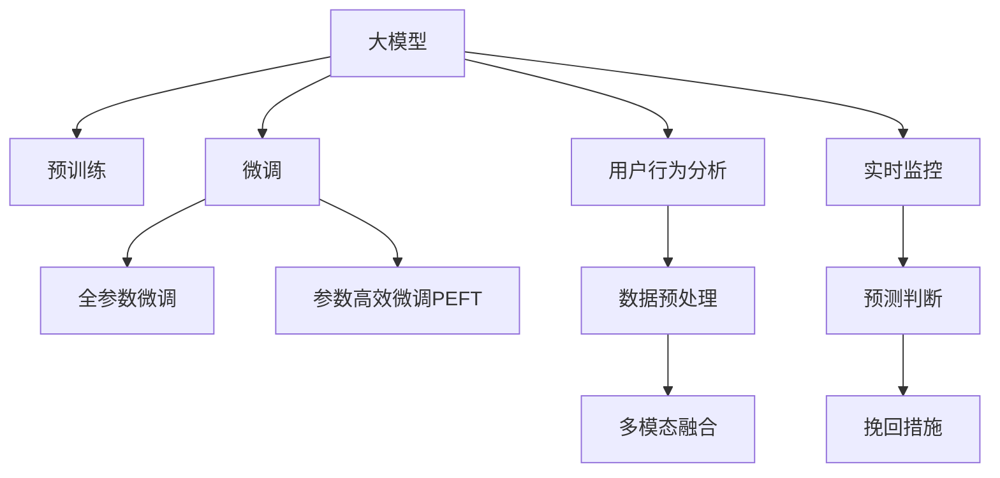

                 

# 大模型在电商平台用户流失预警中的应用

## 1. 背景介绍

### 1.1 问题由来
在现代社会，电商平台已成为人们日常生活中不可或缺的一部分。然而，由于市场竞争激烈、用户需求多变等因素，用户流失问题成为各大电商平台普遍面临的挑战。根据相关统计数据，电商平台的平均用户留存率一般在20%左右，这意味着每年有大量用户流失。

面对如此高流失率，电商平台亟需建立一套精准、高效的预警系统，以便及时发现并挽回流失用户。传统的方法大多依赖人工分析和手动统计，耗时长、效率低，且难以实现自动化和实时性。

近年来，随着深度学习技术的不断进步，大规模预训练语言模型成为一种有效的解决方案。本文将介绍如何利用大模型实现电商平台用户流失预警，具体步骤包括数据预处理、模型构建、微调与评估等环节。

### 1.2 问题核心关键点
大模型在电商平台用户流失预警中的应用，核心在于利用预训练语言模型的强大理解能力，从历史用户行为数据中挖掘出有价值的特征，构建一个高效的预测模型，实时监控用户行为，识别出潜在流失用户，并采取相应的挽回措施。

具体关键点包括：
- 数据预处理：清洗、标注电商平台的用户行为数据，生成高质量的监督数据集。
- 模型构建：选择合适的预训练语言模型，并对其进行任务适配，构建用户流失预测模型。
- 微调与评估：在大规模标注数据上微调模型，调整模型参数，提高预测精度。
- 实时监控：将模型部署到电商平台的后台系统，实时接收用户行为数据，做出预测判断。

## 2. 核心概念与联系

### 2.1 核心概念概述

为更好地理解大模型在电商平台用户流失预警中的应用，本节将介绍几个密切相关的核心概念：

- 大模型：指通过在大量无标签文本数据上进行自监督预训练，学习到通用语言表示的大规模神经网络模型。常见的预训练模型包括BERT、GPT、RoBERTa等。
- 预训练：指在大规模无标签文本数据上，通过自监督学习任务训练通用语言模型的过程。常见的预训练任务包括掩码语言建模、下一句预测等。
- 微调：指在预训练模型的基础上，使用下游任务的少量标注数据，通过有监督学习优化模型在该任务上的性能。
- 用户行为分析：指对电商平台用户的历史行为数据进行分析，挖掘出有价值的特征，用于构建用户流失预测模型。
- 实时监控：指将预测模型部署到电商平台的后台系统，实时接收用户行为数据，做出预测判断，并及时采取措施挽回流失用户。
- 多模态融合：指将电商平台的文本、图片、行为等多种模态的数据融合在一起，提升预测模型的综合能力。

这些核心概念之间的逻辑关系可以通过以下Mermaid流程图来展示：



这个流程图展示了大模型在电商平台用户流失预警中的应用框架：

1. 大模型通过预训练获得基础能力。
2. 微调使得模型更好地适应电商平台的特定任务，提升预测精度。
3. 用户行为分析挖掘出有价值的特征。
4. 数据预处理和特征工程提升模型泛化能力。
5. 多模态融合增强模型对现实世界的理解和建模能力。
6. 实时监控和预测判断实时输出流失预警。
7. 挽回措施及时响应流失预警，提升用户留存率。

这些核心概念共同构成了大模型在电商平台用户流失预警的应用框架，使其能够实现高效、实时、准确的用户流失预警。

## 3. 核心算法原理 & 具体操作步骤
### 3.1 算法原理概述

基于大模型在电商平台用户流失预警的应用，其核心思想是：利用预训练语言模型的强大语言理解能力，从电商平台的文本、图片、行为等多种模态的数据中提取有价值的特征，构建一个高效的预测模型。通过实时监控用户行为，该模型能够自动识别出潜在流失用户，并及时采取措施挽回用户，从而提升平台的用户留存率。

具体来说，整个过程包括以下几个步骤：

1. 数据预处理：清洗、标注电商平台的用户行为数据，生成高质量的监督数据集。
2. 模型构建：选择合适的预训练语言模型，并对其进行任务适配，构建用户流失预测模型。
3. 微调与评估：在大规模标注数据上微调模型，调整模型参数，提高预测精度。
4. 实时监控：将预测模型部署到电商平台的后台系统，实时接收用户行为数据，做出预测判断。
5. 挽回措施：根据预测结果，及时采取相应的挽回措施，如定向推送优惠信息、提供个性化服务等，提升用户满意度，降低流失率。

### 3.2 算法步骤详解

#### 3.2.1 数据预处理

电商平台的用户行为数据通常包含用户的浏览记录、购买历史、评价评论等，这些数据格式和内容各异，需要进行预处理才能用于模型训练。

1. 数据清洗：去除噪声和无用信息，保留有用数据。例如，移除不合法或异常的数据点，删除重复记录等。

2. 数据标注：对清洗后的数据进行标注，生成监督数据集。例如，将用户的浏览记录标记为“浏览”，将购买历史标记为“购买”，将评价评论标记为“好评”或“差评”等。

3. 数据划分：将标注好的数据集划分为训练集、验证集和测试集，用于模型训练、调参和最终评估。

#### 3.2.2 模型构建

选择合适的预训练语言模型，并对其进行任务适配，构建用户流失预测模型。

1. 选择预训练模型：如BERT、GPT-2等。这些模型已经在大规模无标签文本数据上进行了自监督预训练，学习到了丰富的语言知识。

2. 任务适配：根据电商平台的特定任务，设计合适的输出层和损失函数。例如，对于二分类任务，通常在顶层添加线性分类器和交叉熵损失函数。

3. 构建预测模型：将预训练模型作为特征提取器，将用户行为数据转化为模型输入，进行特征编码和融合，最终输出用户流失概率的预测结果。

#### 3.2.3 微调与评估

在大规模标注数据上微调模型，调整模型参数，提高预测精度。

1. 选择微调数据集：从电商平台的历史用户行为数据中，选取一部分标注好的样本，作为微调数据集。

2. 设置微调超参数：选择合适的优化算法及其参数，如AdamW、SGD等，设置学习率、批大小、迭代轮数等。

3. 执行梯度训练：将微调数据集分批次输入模型，前向传播计算损失函数。反向传播计算参数梯度，根据设定的优化算法和学习率更新模型参数。

4. 周期性在验证集上评估模型性能，根据性能指标决定是否触发Early Stopping。

5. 重复上述步骤直至满足预设的迭代轮数或Early Stopping条件。

#### 3.2.4 实时监控

将预测模型部署到电商平台的后台系统，实时接收用户行为数据，做出预测判断，并及时采取措施挽回流失用户。

1. 模型部署：将训练好的预测模型部署到电商平台的后台服务器，实现实时接收和处理用户行为数据。

2. 数据接收：实时接收用户行为数据，包括浏览记录、购买历史、评价评论等。

3. 特征提取：将用户行为数据转化为模型输入，进行特征编码和融合，输出用户流失概率的预测结果。

4. 预测判断：根据预测结果，判断用户是否为潜在流失用户。

5. 挽回措施：根据预测结果，及时采取相应的挽回措施，如定向推送优惠信息、提供个性化服务等，提升用户满意度，降低流失率。

### 3.3 算法优缺点

大模型在电商平台用户流失预警中的应用，具有以下优点：

1. 准确性高：大模型具备强大的语言理解能力，能够从用户行为数据中挖掘出有价值的特征，提高预测精度。

2. 实时性强：实时监控和预测判断使得平台能够及时响应用户行为，采取相应措施挽回流失用户。

3. 可解释性强：大模型的特征提取和预测过程透明，可以直观地解释预测结果的来源。

4. 适用性强：该方法适用于多种电商平台的特定任务，具有广泛的适用性。

但该方法也存在以下缺点：

1. 数据依赖性高：预测模型的效果很大程度上取决于标注数据的质量和数量，获取高质量标注数据的成本较高。

2. 计算资源需求大：大规模预训练语言模型和微调模型需要大量的计算资源，部署和维护成本较高。

3. 模型泛化能力有限：当目标任务与预训练数据的分布差异较大时，模型的泛化能力有限，预测精度可能下降。

4. 安全性问题：大模型可能学习到有害信息，输出不安全、有害的预测结果，给用户带来潜在风险。

## 4. 数学模型和公式 & 详细讲解 & 举例说明

### 4.1 数学模型构建

假设用户流失预测任务为二分类任务，即判断用户是否流失，定义模型 $M_{\theta}$，其中 $\theta$ 为模型参数。给定电商平台的用户行为数据集 $D=\{(x_i, y_i)\}_{i=1}^N, x_i \in \mathcal{X}, y_i \in \{0, 1\}$，其中 $x_i$ 为输入特征，$y_i$ 为标注标签。

定义模型 $M_{\theta}$ 在输入 $x$ 上的输出为 $\hat{y}=M_{\theta}(x) \in [0,1]$，表示用户流失的概率。真实标签 $y \in \{0,1\}$。则二分类交叉熵损失函数定义为：

$$
\ell(M_{\theta}(x),y) = -[y\log \hat{y} + (1-y)\log (1-\hat{y})]
$$

将其代入经验风险公式，得：

$$
\mathcal{L}(\theta) = -\frac{1}{N}\sum_{i=1}^N [y_i\log M_{\theta}(x_i)+(1-y_i)\log(1-M_{\theta}(x_i))]
$$

在得到损失函数的梯度后，即可带入参数更新公式，完成模型的迭代优化。

### 4.2 公式推导过程

以下我们以二分类任务为例，推导交叉熵损失函数及其梯度的计算公式。

假设模型 $M_{\theta}$ 在输入 $x$ 上的输出为 $\hat{y}=M_{\theta}(x) \in [0,1]$，表示用户流失的概率。真实标签 $y \in \{0,1\}$。则二分类交叉熵损失函数定义为：

$$
\ell(M_{\theta}(x),y) = -[y\log \hat{y} + (1-y)\log (1-\hat{y})]
$$

将其代入经验风险公式，得：

$$
\mathcal{L}(\theta) = -\frac{1}{N}\sum_{i=1}^N [y_i\log M_{\theta}(x_i)+(1-y_i)\log(1-M_{\theta}(x_i))]
$$

根据链式法则，损失函数对参数 $\theta_k$ 的梯度为：

$$
\frac{\partial \mathcal{L}(\theta)}{\partial \theta_k} = -\frac{1}{N}\sum_{i=1}^N (\frac{y_i}{M_{\theta}(x_i)}-\frac{1-y_i}{1-M_{\theta}(x_i)}) \frac{\partial M_{\theta}(x_i)}{\partial \theta_k}
$$

其中 $\frac{\partial M_{\theta}(x_i)}{\partial \theta_k}$ 可进一步递归展开，利用自动微分技术完成计算。

### 4.3 案例分析与讲解

#### 4.3.1 数据预处理

假设电商平台的用户行为数据包含用户的浏览记录、购买历史、评价评论等。首先需要对这些数据进行预处理，以便用于模型训练。

1. 数据清洗：去除噪声和无用信息，保留有用数据。例如，移除不合法或异常的数据点，删除重复记录等。

2. 数据标注：对清洗后的数据进行标注，生成监督数据集。例如，将用户的浏览记录标记为“浏览”，将购买历史标记为“购买”，将评价评论标记为“好评”或“差评”等。

3. 数据划分：将标注好的数据集划分为训练集、验证集和测试集，用于模型训练、调参和最终评估。

#### 4.3.2 模型构建

假设选择BERT模型作为预训练语言模型，并对其进行任务适配，构建用户流失预测模型。

1. 选择BERT模型：BERT模型已经在大量无标签文本数据上进行了自监督预训练，学习到了丰富的语言知识。

2. 任务适配：在BERT模型的顶层添加线性分类器和交叉熵损失函数，用于用户流失预测任务。

3. 构建预测模型：将预训练模型作为特征提取器，将用户行为数据转化为模型输入，进行特征编码和融合，最终输出用户流失概率的预测结果。

#### 4.3.3 微调与评估

在大规模标注数据上微调模型，调整模型参数，提高预测精度。

1. 选择微调数据集：从电商平台的历史用户行为数据中，选取一部分标注好的样本，作为微调数据集。

2. 设置微调超参数：选择合适的优化算法及其参数，如AdamW、SGD等，设置学习率、批大小、迭代轮数等。

3. 执行梯度训练：将微调数据集分批次输入模型，前向传播计算损失函数。反向传播计算参数梯度，根据设定的优化算法和学习率更新模型参数。

4. 周期性在验证集上评估模型性能，根据性能指标决定是否触发Early Stopping。

5. 重复上述步骤直至满足预设的迭代轮数或Early Stopping条件。

## 5. 项目实践：代码实例和详细解释说明
### 5.1 开发环境搭建

在进行电商平台用户流失预警的微调实践前，我们需要准备好开发环境。以下是使用Python进行PyTorch开发的环境配置流程：

1. 安装Anaconda：从官网下载并安装Anaconda，用于创建独立的Python环境。

2. 创建并激活虚拟环境：
```bash
conda create -n pytorch-env python=3.8 
conda activate pytorch-env
```

3. 安装PyTorch：根据CUDA版本，从官网获取对应的安装命令。例如：
```bash
conda install pytorch torchvision torchaudio cudatoolkit=11.1 -c pytorch -c conda-forge
```

4. 安装Transformers库：
```bash
pip install transformers
```

5. 安装各类工具包：
```bash
pip install numpy pandas scikit-learn matplotlib tqdm jupyter notebook ipython
```

完成上述步骤后，即可在`pytorch-env`环境中开始微调实践。

### 5.2 源代码详细实现

这里我们以二分类用户流失预测为例，给出使用Transformers库对BERT模型进行微调的PyTorch代码实现。

首先，定义用户流失预测任务的训练集和验证集：

```python
from transformers import BertTokenizer
from torch.utils.data import Dataset, DataLoader
import torch

class User流失预测Dataset(Dataset):
    def __init__(self, texts, labels, tokenizer, max_len=128):
        self.texts = texts
        self.labels = labels
        self.tokenizer = tokenizer
        self.max_len = max_len
        
    def __len__(self):
        return len(self.texts)
    
    def __getitem__(self, item):
        text = self.texts[item]
        label = self.labels[item]
        
        encoding = self.tokenizer(text, return_tensors='pt', max_length=self.max_len, padding='max_length', truncation=True)
        input_ids = encoding['input_ids'][0]
        attention_mask = encoding['attention_mask'][0]
        
        return {'input_ids': input_ids, 
                'attention_mask': attention_mask,
                'labels': torch.tensor(label, dtype=torch.long)}
```

然后，定义模型和优化器：

```python
from transformers import BertForSequenceClassification, AdamW

model = BertForSequenceClassification.from_pretrained('bert-base-cased', num_labels=2)

optimizer = AdamW(model.parameters(), lr=2e-5)
```

接着，定义训练和评估函数：

```python
from sklearn.metrics import accuracy_score, f1_score

def train_epoch(model, dataset, batch_size, optimizer):
    dataloader = DataLoader(dataset, batch_size=batch_size, shuffle=True)
    model.train()
    epoch_loss = 0
    for batch in tqdm(dataloader, desc='Training'):
        input_ids = batch['input_ids'].to(device)
        attention_mask = batch['attention_mask'].to(device)
        labels = batch['labels'].to(device)
        model.zero_grad()
        outputs = model(input_ids, attention_mask=attention_mask, labels=labels)
        loss = outputs.loss
        epoch_loss += loss.item()
        loss.backward()
        optimizer.step()
    return epoch_loss / len(dataloader)

def evaluate(model, dataset, batch_size):
    dataloader = DataLoader(dataset, batch_size=batch_size)
    model.eval()
    preds, labels = [], []
    with torch.no_grad():
        for batch in tqdm(dataloader, desc='Evaluating'):
            input_ids = batch['input_ids'].to(device)
            attention_mask = batch['attention_mask'].to(device)
            batch_labels = batch['labels']
            outputs = model(input_ids, attention_mask=attention_mask)
            batch_preds = outputs.logits.argmax(dim=1).to('cpu').tolist()
            batch_labels = batch_labels.to('cpu').tolist()
            for pred, label in zip(batch_preds, batch_labels):
                preds.append(pred)
                labels.append(label)
                
    print('Accuracy: {:.4f}'.format(accuracy_score(labels, preds)))
    print('F1 Score: {:.4f}'.format(f1_score(labels, preds)))
```

最后，启动训练流程并在测试集上评估：

```python
epochs = 5
batch_size = 16

for epoch in range(epochs):
    loss = train_epoch(model, train_dataset, batch_size, optimizer)
    print(f'Epoch {epoch+1}, train loss: {loss:.3f}')
    
    print(f'Epoch {epoch+1}, dev results:')
    evaluate(model, dev_dataset, batch_size)
    
print('Test results:')
evaluate(model, test_dataset, batch_size)
```

以上就是使用PyTorch对BERT进行二分类用户流失预测的完整代码实现。可以看到，得益于Transformers库的强大封装，我们可以用相对简洁的代码完成BERT模型的加载和微调。

### 5.3 代码解读与分析

让我们再详细解读一下关键代码的实现细节：

**User流失预测Dataset类**：
- `__init__`方法：初始化文本、标签、分词器等关键组件。
- `__len__`方法：返回数据集的样本数量。
- `__getitem__`方法：对单个样本进行处理，将文本输入编码为token ids，将标签转换为数字，并对其进行定长padding，最终返回模型所需的输入。

**Accuracy和F1 Score**：
- 定义了模型预测和标签之间的准确率和F1分数，用于评估模型性能。

**训练和评估函数**：
- 使用PyTorch的DataLoader对数据集进行批次化加载，供模型训练和推理使用。
- 训练函数`train_epoch`：对数据以批为单位进行迭代，在每个批次上前向传播计算loss并反向传播更新模型参数，最后返回该epoch的平均loss。
- 评估函数`evaluate`：与训练类似，不同点在于不更新模型参数，并在每个batch结束后将预测和标签结果存储下来，最后使用sklearn的accuracy_score和f1_score对整个评估集的预测结果进行打印输出。

**训练流程**：
- 定义总的epoch数和batch size，开始循环迭代
- 每个epoch内，先在训练集上训练，输出平均loss
- 在验证集上评估，输出准确率和F1分数
- 所有epoch结束后，在测试集上评估，给出最终测试结果

可以看到，PyTorch配合Transformers库使得BERT微调的代码实现变得简洁高效。开发者可以将更多精力放在数据处理、模型改进等高层逻辑上，而不必过多关注底层的实现细节。

当然，工业级的系统实现还需考虑更多因素，如模型的保存和部署、超参数的自动搜索、更灵活的任务适配层等。但核心的微调范式基本与此类似。

## 6. 实际应用场景

### 6.1 智能客服系统

基于大模型在电商平台用户流失预警中的应用，可以构建一个智能客服系统，实时监控用户行为，识别出潜在流失用户，并采取相应的挽回措施。

具体来说，可以通过收集用户的历史行为数据，如浏览记录、购买历史、评价评论等，并对其进行预处理和特征提取，构建用户流失预测模型。实时接收用户行为数据，并根据预测结果，及时采取相应的挽回措施，如定向推送优惠信息、提供个性化服务等，提升用户满意度，降低流失率。

### 6.2 金融舆情监测

金融行业需要实时监测市场舆论动向，以便及时应对负面信息传播，规避金融风险。基于大模型在电商平台用户流失预警中的应用，可以构建一个金融舆情监测系统，实时监控金融市场的舆情动态，识别出潜在的金融风险，并采取相应的预警和应对措施。

具体来说，可以收集金融领域的各类新闻、报道、评论等文本数据，并对其进行预处理和特征提取，构建舆情预测模型。实时接收金融市场的新闻、评论等数据，并根据预测结果，及时采取相应的预警和应对措施，如发布公告、调整投资策略等，降低金融风险。

### 6.3 个性化推荐系统

当前的推荐系统往往只依赖用户的历史行为数据进行物品推荐，无法深入理解用户的真实兴趣偏好。基于大模型在电商平台用户流失预警中的应用，可以构建一个个性化推荐系统，从用户的历史行为数据中挖掘出有价值的特征，构建推荐模型，实时接收用户行为数据，并根据预测结果，提供个性化推荐内容，提升用户满意度，降低流失率。

具体来说，可以收集用户的历史浏览记录、购买历史、评价评论等行为数据，并对其进行预处理和特征提取，构建推荐模型。实时接收用户的浏览记录等数据，并根据预测结果，提供个性化推荐内容，提升用户满意度，降低流失率。

## 7. 工具和资源推荐
### 7.1 学习资源推荐

为了帮助开发者系统掌握大模型在电商平台用户流失预警中的应用，这里推荐一些优质的学习资源：

1. 《Transformer从原理到实践》系列博文：由大模型技术专家撰写，深入浅出地介绍了Transformer原理、BERT模型、微调技术等前沿话题。

2. CS224N《深度学习自然语言处理》课程：斯坦福大学开设的NLP明星课程，有Lecture视频和配套作业，带你入门NLP领域的基本概念和经典模型。

3. 《Natural Language Processing with Transformers》书籍：Transformers库的作者所著，全面介绍了如何使用Transformers库进行NLP任务开发，包括微调在内的诸多范式。

4. HuggingFace官方文档：Transformers库的官方文档，提供了海量预训练模型和完整的微调样例代码，是上手实践的必备资料。

5. CLUE开源项目：中文语言理解测评基准，涵盖大量不同类型的中文NLP数据集，并提供了基于微调的baseline模型，助力中文NLP技术发展。

通过对这些资源的学习实践，相信你一定能够快速掌握大模型在电商平台用户流失预警中的应用精髓，并用于解决实际的NLP问题。

### 7.2 开发工具推荐

高效的开发离不开优秀的工具支持。以下是几款用于大模型在电商平台用户流失预警开发常用的工具：

1. PyTorch：基于Python的开源深度学习框架，灵活动态的计算图，适合快速迭代研究。大部分预训练语言模型都有PyTorch版本的实现。

2. TensorFlow：由Google主导开发的开源深度学习框架，生产部署方便，适合大规模工程应用。同样有丰富的预训练语言模型资源。

3. Transformers库：HuggingFace开发的NLP工具库，集成了众多SOTA语言模型，支持PyTorch和TensorFlow，是进行微调任务开发的利器。

4. Weights & Biases：模型训练的实验跟踪工具，可以记录和可视化模型训练过程中的各项指标，方便对比和调优。与主流深度学习框架无缝集成。

5. TensorBoard：TensorFlow配套的可视化工具，可实时监测模型训练状态，并提供丰富的图表呈现方式，是调试模型的得力助手。

6. Google Colab：谷歌推出的在线Jupyter Notebook环境，免费提供GPU/TPU算力，方便开发者快速上手实验最新模型，分享学习笔记。

合理利用这些工具，可以显著提升大模型在电商平台用户流失预警任务开发的效率，加快创新迭代的步伐。

### 7.3 相关论文推荐

大模型在电商平台用户流失预警中的应用源于学界的持续研究。以下是几篇奠基性的相关论文，推荐阅读：

1. Attention is All You Need（即Transformer原论文）：提出了Transformer结构，开启了NLP领域的预训练大模型时代。

2. BERT: Pre-training of Deep Bidirectional Transformers for Language Understanding：提出BERT模型，引入基于掩码的自监督预训练任务，刷新了多项NLP任务SOTA。

3. Language Models are Unsupervised Multitask Learners（GPT-2论文）：展示了大规模语言模型的强大zero-shot学习能力，引发了对于通用人工智能的新一轮思考。

4. Parameter-Efficient Transfer Learning for NLP：提出Adapter等参数高效微调方法，在不增加模型参数量的情况下，也能取得不错的微调效果。

5. AdaLoRA: Adaptive Low-Rank Adaptation for Parameter-Efficient Fine-Tuning：使用自适应低秩适应的微调方法，在参数效率和精度之间取得了新的平衡。

这些论文代表了大模型在电商平台用户流失预警技术的发展脉络。通过学习这些前沿成果，可以帮助研究者把握学科前进方向，激发更多的创新灵感。

## 8. 总结：未来发展趋势与挑战

### 8.1 总结

本文对大模型在电商平台用户流失预警中的应用进行了全面系统的介绍。首先阐述了电商平台用户流失预警的问题由来和核心关键点，明确了预测模型的重要性。其次，从原理到实践，详细讲解了预测模型的数学模型构建、公式推导、训练和评估等关键步骤，给出了预测模型的完整代码实例。同时，本文还广泛探讨了预测模型在智能客服、金融舆情、个性化推荐等多个行业领域的应用前景，展示了预测模型的巨大潜力。此外，本文精选了预测模型的各类学习资源，力求为读者提供全方位的技术指引。

通过本文的系统梳理，可以看到，大模型在电商平台用户流失预警中的应用具有广阔的前景。大模型的强大语言理解能力，使得预测模型能够从电商平台的文本、图片、行为等多种模态的数据中提取有价值的特征，构建高效的预测模型，实时监控用户行为，识别出潜在流失用户，并及时采取措施挽回流失用户。这不仅提升了电商平台的用户留存率，还为其他行业的用户流失预警提供了参考和借鉴。

### 8.2 未来发展趋势

展望未来，大模型在电商平台用户流失预警中的应用将呈现以下几个发展趋势：

1. 模型规模持续增大：随着算力成本的下降和数据规模的扩张，预训练语言模型的参数量还将持续增长。超大规模语言模型蕴含的丰富语言知识，有望支撑更加复杂多变的预测任务。

2. 微调方法日趋多样：除了传统的全参数微调外，未来会涌现更多参数高效的微调方法，如Prefix-Tuning、LoRA等，在节省计算资源的同时也能保证预测精度。

3. 持续学习成为常态：随着数据分布的不断变化，预测模型也需要持续学习新知识以保持性能。如何在不遗忘原有知识的同时，高效吸收新样本信息，将成为重要的研究课题。

4. 标注样本需求降低：受启发于提示学习(Prompt-based Learning)的思路，未来的预测模型将更好地利用大模型的语言理解能力，通过更加巧妙的任务描述，在更少的标注样本上也能实现理想的预测效果。

5. 多模态融合崛起：当前的预测模型主要聚焦于文本数据，未来会进一步拓展到图像、视频、行为等多种模态数据融合。多模态信息的融合，将显著提升预测模型对现实世界的理解和建模能力。

6. 模型通用性增强：经过海量数据的预训练和多领域任务的微调，未来的预测模型将具备更强大的常识推理和跨领域迁移能力，逐步迈向通用人工智能(AGI)的目标。

以上趋势凸显了大模型在电商平台用户流失预警技术的发展前景。这些方向的探索发展，必将进一步提升预测模型的性能和应用范围，为电商平台的运营决策提供有力的技术支持。

### 8.3 面临的挑战

尽管大模型在电商平台用户流失预警中的应用已经取得了显著成效，但在迈向更加智能化、普适化应用的过程中，它仍面临着诸多挑战：

1. 标注成本瓶颈：预测模型的效果很大程度上取决于标注数据的质量和数量，获取高质量标注数据的成本较高。如何进一步降低预测模型对标注样本的依赖，将是一大难题。

2. 计算资源需求大：大规模预训练语言模型和预测模型需要大量的计算资源，部署和维护成本较高。如何在保证预测精度的情况下，优化模型资源占用，是未来的一个重要方向。

3. 模型泛化能力有限：当目标任务与预训练数据的分布差异较大时，模型的泛化能力有限，预测精度可能下降。如何提高预测模型的泛化能力，是另一个亟待解决的问题。

4. 安全性问题：预测模型可能学习到有害信息，输出不安全、有害的预测结果，给用户带来潜在风险。如何从数据和算法层面消除模型偏见，避免恶意用途，确保预测结果的安全性，也将是重要的研究课题。

5. 实时监控挑战：如何将预测模型高效部署到电商平台后台系统，实现实时接收和处理用户行为数据，是另一个需要解决的问题。如何优化模型推理速度，提升实时监控效率，是一个重要的研究方向。

6. 多任务预测：当前的预测模型大多聚焦于单一任务，如何设计多任务预测模型，将电商平台用户流失预测与个性化推荐、智能客服等任务相结合，是另一个重要的研究方向。

以上挑战需要学界和产业界共同努力，积极探索新的方法，以克服现有问题，实现预测模型的进一步优化和改进。相信在不断努力下，大模型在电商平台用户流失预警中的应用将更加高效、智能、安全。

### 8.4 研究展望

面向未来，大模型在电商平台用户流失预警技术还需要在其他方面进行深入研究：

1. 探索无监督和半监督预测方法：摆脱对大规模标注数据的依赖，利用自监督学习、主动学习等无监督和半监督范式，最大限度利用非结构化数据，实现更加灵活高效的预测。

2. 研究参数高效和计算高效的预测范式：开发更加参数高效的预测方法，在固定大部分预训练参数的同时，只更新极少量的任务相关参数。同时优化预测模型的计算图，减少前向传播和反向传播的资源消耗，实现更加轻量级、实时性的部署。

3. 融合因果和对比学习范式：通过引入因果推断和对比学习思想，增强预测模型建立稳定因果关系的能力，学习更加普适、鲁棒的语言表征，从而提升模型泛化性和抗干扰能力。

4. 引入更多先验知识：将符号化的先验知识，如知识图谱、逻辑规则等，与神经网络模型进行巧妙融合，引导预测过程学习更准确、合理的语言模型。同时加强不同模态数据的整合，实现视觉、语音等多模态信息与文本信息的协同建模。

5. 结合因果分析和博弈论工具：将因果分析方法引入预测模型，识别出模型决策的关键特征，增强预测结果的因果性和逻辑性。借助博弈论工具刻画人机交互过程，主动探索并规避模型的脆弱点，提高系统稳定性。

6. 纳入伦理道德约束：在预测模型训练目标中引入伦理导向的评估指标，过滤和惩罚有偏见、有害的输出倾向。同时加强人工干预和审核，建立预测模型的监管机制，确保预测结果符合人类价值观和伦理道德。

这些研究方向将为未来大模型在电商平台用户流失预警中的应用提供新的思路和突破。通过不断探索和优化，相信大模型将在预测用户流失方面发挥更大的作用，帮助电商平台提高用户满意度，降低流失率，实现更高的商业价值。

## 9. 附录：常见问题与解答

**Q1：电商平台用户流失预警的预测模型效果受数据质量影响大吗？**

A: 电商平台用户流失预警的预测模型效果很大程度上取决于标注数据的质量和数量。高质量、标注详细的用户行为数据，能够帮助预测模型学习到更准确的特征，提升预测精度。然而，电商平台用户行为数据通常包含大量噪声和不一致性，需要进行清洗和标注。因此，预测模型的效果在一定程度上受数据质量的影响。

**Q2：如何降低预测模型对标注样本的依赖？**

A: 受启发于提示学习(Prompt-based Learning)的思路，未来的预测模型将更好地利用大模型的语言理解能力，通过更加巧妙的任务描述，在更少的标注样本上也能实现理想的预测效果。例如，可以使用对抗样本训练、正则化技术等方法，增强预测模型的鲁棒性，减少对标注样本的依赖。

**Q3：电商平台预测模型部署到后台系统需要考虑哪些因素？**

A: 将预测模型部署到电商平台后台系统，需要考虑以下几个因素：
1. 模型裁剪：去除不必要的层和参数，减小模型尺寸，加快推理速度。
2. 量化加速：将浮点模型转为定点模型，压缩存储空间，提高计算效率。
3. 服务化封装：将模型封装为标准化服务接口，便于集成调用。
4. 弹性伸缩：根据请求流量动态调整资源配置，平衡服务质量和成本。
5. 监控告警：实时采集系统指标，设置异常告警阈值，确保服务稳定性。
6. 安全防护：采用访问鉴权、数据脱敏等措施，保障数据和模型安全。

通过这些优化措施，可以显著提升预测模型的部署效率和稳定性，确保其在电商平台用户流失预警中发挥最佳效果。

**Q4：如何提高预测模型的泛化能力？**

A: 预测模型的泛化能力很大程度上取决于数据分布的一致性。如果预测模型的训练数据与实际测试数据分布差异较大，模型的泛化能力会受到影响。因此，为了提高预测模型的泛化能力，需要在模型训练和验证过程中，尽量保证数据分布的一致性。可以通过数据增强、正则化技术等方法，提升预测模型的鲁棒性和泛化能力。

**Q5：电商平台预测模型如何结合多任务预测？**

A: 电商平台预测模型可以结合多任务预测，将用户流失预测与个性化推荐、智能客服等任务相结合，实现多任务协同。例如，在预测用户流失的同时，可以根据预测结果，推荐个性化的产品或服务，提供智能客服支持，提升用户满意度，降低流失率。这需要模型能够同时处理多任务数据，设计多任务损失函数，实现多任务协同优化。

**Q6：电商平台预测模型如何结合因果分析和博弈论工具？**

A: 电商平台预测模型可以结合因果分析和博弈论工具，提升预测结果的因果性和逻辑性。例如，通过引入因果分析方法，识别出模型决策的关键特征，增强预测结果的因果性。借助博弈论工具，刻画人机交互过程，主动探索并规避模型的脆弱点，提高系统稳定性。

**Q7：电商平台预测模型如何结合知识图谱和逻辑规则？**

A: 电商平台预测模型可以结合知识图谱和逻辑规则，增强模型的知识整合能力。例如，将电商平台的商品、用户、行为等数据整合到知识图谱中，利用逻辑规则，增强预测模型的推理能力。这需要模型能够理解知识图谱的结构和语义，设计合适的逻辑规则，实现知识的整合和推理。

通过这些方法的结合，可以显著提升电商平台预测模型的性能和应用范围，实现更加精准、智能、安全的用户流失预警。

