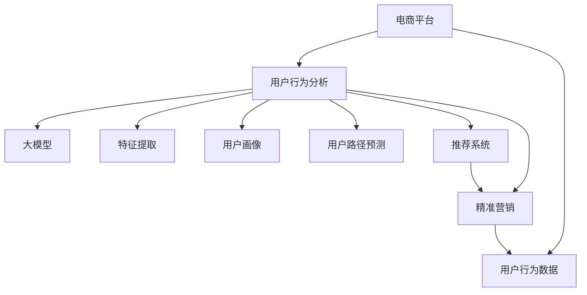

                 

# 大模型在电商平台用户购买路径分析中的应用

> 关键词：电商平台,用户行为分析,大模型,机器学习,深度学习,用户画像,用户路径预测,推荐系统,精准营销

## 1. 背景介绍

### 1.1 问题由来

随着电商平台的迅猛发展，用户行为数据日益成为企业决策的重要依据。电商平台通过收集用户的浏览记录、点击行为、购买历史等数据，尝试从中挖掘用户的潜在需求，以提升用户体验、优化商品推荐、增强用户粘性，实现精准营销。用户购买路径分析作为用户行为分析的一个重要方向，其目的在于梳理和理解用户从关注到购买的整个决策过程，找出其中的关键节点和影响因素，从而为平台提供科学的决策支持。

在传统的用户行为分析中，多采用统计学、规则匹配等方法，但这些方法在数据量较小、复杂度较高的情况下，难以实现准确、全面的分析。随着深度学习技术的发展，大模型(如BERT、GPT等)在自然语言处理任务中取得了卓越的成果，逐渐应用于电商平台的用户购买路径分析。利用大模型的强大表征能力和泛化能力，可以从大规模的数据集中挖掘出隐含的规律，更全面、准确地理解用户行为，为电商平台的精准营销提供强有力的支持。

### 1.2 问题核心关键点

大模型在电商平台用户购买路径分析中的核心关键点包括以下几个方面：

1. **数据预处理**：电商平台的数据量庞大且格式复杂，需要进行数据清洗、归一化等预处理工作，确保数据的有效性。

2. **特征提取**：电商平台用户行为数据包含了文本、时间序列等多种形式，需要选择合适的特征提取方式，提取有助于模型分析的特征。

3. **模型训练**：选择合适的模型结构及训练算法，在电商平台用户行为数据上训练模型，进行路径预测、用户画像生成等任务。

4. **路径分析**：利用训练好的模型，分析用户从浏览到购买的具体路径，识别出关键节点和决策因素。

5. **应用部署**：将训练好的模型部署到电商平台的实际业务场景中，实时处理用户行为数据，提供个性化的推荐和服务。

6. **效果评估**：定期评估模型的效果，确保其在实际应用中能够持续优化和改进。

这些关键点共同构成了电商平台用户购买路径分析的基础，通过逐一解决这些关键点，可以构建一个准确、高效的用户行为分析系统。

## 2. 核心概念与联系

### 2.1 核心概念概述

为更好地理解大模型在电商平台用户购买路径分析中的应用，本节将介绍几个密切相关的核心概念：

- **电商平台(E-commerce Platform)**：指通过互联网进行商品交易的虚拟商店，包括B2B、B2C、C2C等多种模式。
- **用户行为分析(User Behavior Analysis)**：通过分析用户在使用电商平台时的行为数据，理解用户的购买偏好、行为模式等信息，优化用户体验，提升营销效果。
- **大模型(Large Model)**：指具有亿级参数规模的深度学习模型，如BERT、GPT等，能够学习到丰富的语言和特征表示。
- **特征提取(Feature Extraction)**：从原始数据中提取有用的特征，用于模型的训练和分析。
- **机器学习(Machine Learning)**：利用数据和算法，训练模型进行预测、分类、回归等任务。
- **深度学习(Deep Learning)**：基于神经网络的机器学习方法，可以处理复杂的数据结构，提高模型的泛化能力。
- **用户画像(User Persona)**：通过分析用户行为数据，构建用户的虚拟形象，用于个性化的推荐和服务。
- **用户路径预测(Predicting User Path)**：利用模型预测用户从进入电商平台到完成购买的完整路径，找出其中的关键节点和影响因素。
- **推荐系统(Recommendation System)**：根据用户行为数据和历史偏好，向用户推荐商品，提升用户满意度，增加销售额。
- **精准营销(Accurate Marketing)**：通过精准的用户画像和推荐系统，实现对目标用户的精准营销，提高营销效果。

这些核心概念之间的逻辑关系可以通过以下Mermaid流程图来展示：



这个流程图展示了大模型在电商平台用户购买路径分析中各个环节的逻辑关系：

1. 电商平台收集用户行为数据。
2. 数据预处理和特征提取。
3. 使用大模型进行训练，生成用户画像。
4. 路径预测和推荐系统优化。
5. 精准营销的实施。

这些环节共同构成了一个完整的大模型在电商平台用户购买路径分析的应用框架。

## 3. 核心算法原理 & 具体操作步骤
### 3.1 算法原理概述

大模型在电商平台用户购买路径分析中，主要利用机器学习和深度学习的原理，通过对用户行为数据进行建模，预测用户从进入电商平台到完成购买的全路径。具体流程如下：

1. **数据预处理**：清洗、归一化电商平台用户行为数据，提取出有用的特征。
2. **特征提取**：使用大模型对文本、时间序列等不同形式的数据进行特征提取，生成高维的特征向量。
3. **模型训练**：选择合适的模型结构，如LSTM、GRU、BERT等，在标注数据上训练模型，生成用户画像。
4. **路径预测**：使用训练好的模型对新用户行为数据进行预测，生成用户购买路径。
5. **路径分析**：分析预测出的路径，找出其中的关键节点和决策因素。
6. **应用部署**：将模型部署到实际业务场景中，实时处理用户行为数据，提供个性化的推荐和服务。

### 3.2 算法步骤详解

以下详细介绍大模型在电商平台用户购买路径分析的具体操作步骤：

**Step 1: 数据预处理**

电商平台的原始数据包含了多种格式和类型，如文本、时间戳、数值等。在进行分析前，需要进行以下预处理步骤：

1. **数据清洗**：去除缺失、异常值和重复数据，确保数据的完整性和一致性。
2. **文本归一化**：对文本数据进行分词、去除停用词、词干化等预处理，将其转换为模型可接受的格式。
3. **时间戳转换**：将时间戳数据转换为模型可接受的时间序列数据格式。
4. **数值归一化**：对数值数据进行归一化处理，确保数据分布的合理性。

**Step 2: 特征提取**

电商平台的用户行为数据包含了丰富的特征，如浏览记录、点击行为、购买历史、用户画像等。选择合适的特征提取方式，提取有助于模型分析的特征：

1. **文本特征提取**：使用大模型对文本数据进行特征提取，生成高维的文本特征向量。
2. **时间序列特征提取**：将时间戳数据转换为时间序列，提取时间相关的特征，如日均浏览次数、连续浏览时长等。
3. **数值特征提取**：对数值数据进行统计分析，提取有用的数值特征，如平均浏览时长、复购率等。
4. **图像特征提取**：对商品图片进行特征提取，生成图像特征向量。

**Step 3: 模型训练**

选择适当的模型结构，如LSTM、GRU、BERT等，在标注数据上训练模型，生成用户画像。训练过程包括：

1. **模型选择**：根据数据类型和任务需求，选择合适的模型结构，如LSTM用于处理时间序列数据，BERT用于处理文本数据。
2. **数据划分**：将数据集划分为训练集、验证集和测试集，进行模型训练、验证和测试。
3. **模型训练**：使用训练集数据对模型进行训练，调整模型参数，最小化损失函数。
4. **模型验证**：在验证集上评估模型性能，调整超参数，防止过拟合。
5. **模型测试**：在测试集上评估模型泛化能力，确定最终模型。

**Step 4: 路径预测**

使用训练好的模型对新用户行为数据进行路径预测，生成用户购买路径。预测过程包括：

1. **输入准备**：将新用户行为数据转换为模型可接受的输入格式。
2. **模型预测**：使用训练好的模型对输入数据进行预测，生成路径概率分布。
3. **路径分析**：分析预测出的路径概率分布，找出其中的关键节点和决策因素。

**Step 5: 路径分析**

分析预测出的路径，找出其中的关键节点和决策因素，具体流程如下：

1. **路径划分**：将预测出的路径按照关键节点划分为多个阶段，如浏览、点击、添加到购物车、下单等。
2. **节点分析**：对每个关键节点进行详细分析，找出影响用户决策的因素，如商品价格、用户评价、促销活动等。
3. **决策因素提取**：根据节点分析结果，提取影响用户决策的关键因素，用于后续的精准营销。

**Step 6: 应用部署**

将训练好的模型部署到实际业务场景中，实时处理用户行为数据，提供个性化的推荐和服务。部署过程包括：

1. **API接口设计**：设计API接口，提供模型的预测和分析功能。
2. **数据接入**：将电商平台的用户行为数据接入到模型API中，实现实时处理。
3. **服务集成**：将模型API集成到电商平台的推荐系统中，实现实时推荐。
4. **效果评估**：定期评估模型的效果，确保其在实际应用中能够持续优化和改进。

### 3.3 算法优缺点

大模型在电商平台用户购买路径分析中，具有以下优点：

1. **泛化能力强**：大模型能够学习到丰富的语言和特征表示，具备较强的泛化能力，能够在复杂的数据上取得优异的效果。
2. **特征提取能力强**：大模型能够处理多种形式的数据，包括文本、时间序列、数值等，能够提取有用的特征，提高模型的分析能力。
3. **实时处理能力强**：大模型在GPU或TPU等高性能设备上训练和推理，能够实现实时处理，满足电商平台对实时性的要求。
4. **路径分析能力强**：大模型能够对用户购买路径进行详细分析，找出关键节点和决策因素，帮助电商平台优化营销策略。

同时，大模型也存在以下缺点：

1. **计算资源需求高**：大模型的训练和推理需要大量的计算资源，包括GPU/TPU等高性能设备，对硬件要求较高。
2. **模型复杂度高**：大模型具有亿级参数规模，模型结构复杂，训练和推理过程较为耗时。
3. **数据依赖性强**：大模型的训练和分析需要大量的标注数据，对数据的依赖性强，数据质量直接影响模型效果。
4. **模型解释性差**：大模型通常被视为"黑盒"系统，难以解释其内部工作机制和决策逻辑，对模型解释性要求高的场景不适用。

### 3.4 算法应用领域

大模型在电商平台用户购买路径分析中，具有广泛的应用领域，包括但不限于：

1. **用户行为分析**：通过分析用户行为数据，理解用户的购买偏好、行为模式等信息，优化用户体验，提升营销效果。
2. **用户画像生成**：利用大模型生成用户的虚拟形象，用于个性化的推荐和服务。
3. **路径预测**：预测用户从进入电商平台到完成购买的完整路径，找出其中的关键节点和影响因素。
4. **推荐系统优化**：利用路径预测结果，优化推荐系统的推荐策略，提高推荐效果。
5. **精准营销**：通过精准的用户画像和推荐系统，实现对目标用户的精准营销，提高营销效果。
6. **异常行为检测**：分析用户行为数据，检测异常购买行为，防止欺诈行为。

这些应用领域共同构成了大模型在电商平台用户购买路径分析中的广泛应用，通过不断优化和改进，大模型将为电商平台带来更大的价值。

## 4. 数学模型和公式 & 详细讲解 & 举例说明

### 4.1 数学模型构建

大模型在电商平台用户购买路径分析中，主要利用深度学习模型进行建模，常用的模型结构包括LSTM、GRU、BERT等。以下以LSTM模型为例，介绍数学模型的构建过程。

设电商平台用户行为数据为 $X=\{x_i\}_{i=1}^N$，其中 $x_i$ 表示用户行为数据的时间序列，可以表示为 $\{x_i^{(t)}\}_{t=1}^{T}$。令 $y_i$ 表示用户是否购买了该商品，$y_i \in \{0,1\}$。

定义LSTM模型的隐状态为 $h_i$，输出为 $\hat{y}_i$，则LSTM模型的损失函数定义为：

$$
\mathcal{L}(\hat{y}_i, y_i) = -\log P(\hat{y}_i | X)
$$

其中 $P(\hat{y}_i | X)$ 表示在输入数据 $X$ 下，预测 $\hat{y}_i$ 的条件概率。

### 4.2 公式推导过程

以下详细推导LSTM模型的训练过程：

1. **模型定义**：
   - 输入层 $x_i^{(t)}$ 到隐状态 $h_i^{(t)}$ 的转换函数为：
   $$
   h_i^{(t)} = \sigma(W_i^{(t)}x_i^{(t)} + U_i^{(t)}h_i^{(t-1)})
   $$
   - 隐状态 $h_i^{(t)}$ 到输出层的转换函数为：
   $$
   \hat{y}_i = \sigma(V_ih_i^{(t)} + b)
   $$
   其中 $\sigma$ 表示sigmoid函数，$W_i^{(t)}, U_i^{(t)}, V_i, b$ 为模型参数。

2. **损失函数计算**：
   - 对损失函数 $\mathcal{L}(\hat{y}_i, y_i)$ 进行反向传播，计算梯度：
   $$
   \frac{\partial \mathcal{L}}{\partial W_i^{(t)}} = \frac{\partial \mathcal{L}}{\partial \hat{y}_i} \frac{\partial \hat{y}_i}{\partial h_i^{(t)}} \frac{\partial h_i^{(t)}}{\partial x_i^{(t)}} \frac{\partial x_i^{(t)}}{\partial W_i^{(t)}}
   $$
   $$
   \frac{\partial \mathcal{L}}{\partial U_i^{(t)}} = \frac{\partial \mathcal{L}}{\partial h_i^{(t)}} \frac{\partial h_i^{(t)}}{\partial h_i^{(t-1)}} \frac{\partial h_i^{(t-1)}}{\partial x_i^{(t)}} \frac{\partial x_i^{(t)}}{\partial U_i^{(t)}}
   $$
   $$
   \frac{\partial \mathcal{L}}{\partial V_i} = \frac{\partial \mathcal{L}}{\partial \hat{y}_i} \frac{\partial \hat{y}_i}{\partial h_i^{(t)}} \frac{\partial h_i^{(t)}}{\partial x_i^{(t)}} \frac{\partial x_i^{(t)}}{\partial V_i}
   $$
   $$
   \frac{\partial \mathcal{L}}{\partial b} = \frac{\partial \mathcal{L}}{\partial \hat{y}_i} \frac{\partial \hat{y}_i}{\partial h_i^{(t)}} \frac{\partial h_i^{(t)}}{\partial x_i^{(t)}} \frac{\partial x_i^{(t)}}{\partial b}
   $$

3. **优化算法选择**：
   - 常用的优化算法包括Adam、SGD等，可以设置合适的学习率和迭代次数，进行模型训练。
   - 训练过程可以划分为多个epoch，每个epoch中，随机选取一批数据 $(x_i^{(t)}, y_i)$ 进行训练，更新模型参数。

### 4.3 案例分析与讲解

以电商平台的用户购买路径预测为例，以下是具体的案例分析与讲解：

假设电商平台收集了10000名用户的历史行为数据，包括浏览、点击、购买等行为。选取其中一部分数据作为训练集，另一部分作为测试集。使用LSTM模型对训练集数据进行训练，预测新用户的行为路径。

1. **数据预处理**：对原始数据进行清洗和归一化处理，提取有用的特征，如浏览记录、点击行为、购买历史等。
2. **模型选择**：选择LSTM模型进行训练，设置合适的网络结构和学习率。
3. **模型训练**：将训练集数据输入模型，进行前向传播和反向传播，更新模型参数。
4. **路径预测**：使用训练好的模型对测试集数据进行预测，生成用户购买路径。
5. **路径分析**：分析预测出的路径，找出其中的关键节点和决策因素。

### 4.4 案例分析与讲解

假设电商平台收集了10000名用户的历史行为数据，包括浏览、点击、购买等行为。选取其中一部分数据作为训练集，另一部分作为测试集。使用LSTM模型对训练集数据进行训练，预测新用户的行为路径。

1. **数据预处理**：对原始数据进行清洗和归一化处理，提取有用的特征，如浏览记录、点击行为、购买历史等。
2. **模型选择**：选择LSTM模型进行训练，设置合适的网络结构和学习率。
3. **模型训练**：将训练集数据输入模型，进行前向传播和反向传播，更新模型参数。
4. **路径预测**：使用训练好的模型对测试集数据进行预测，生成用户购买路径。
5. **路径分析**：分析预测出的路径，找出其中的关键节点和决策因素。

通过以上案例分析，可以看到大模型在电商平台用户购买路径分析中的具体应用流程，包括数据预处理、模型训练、路径预测和路径分析等步骤。

## 5. 项目实践：代码实例和详细解释说明
### 5.1 开发环境搭建

在进行大模型在电商平台用户购买路径分析的实践时，需要搭建好相应的开发环境。以下是使用Python进行Keras开发的环境配置流程：

1. 安装Anaconda：从官网下载并安装Anaconda，用于创建独立的Python环境。

2. 创建并激活虚拟环境：
```bash
conda create -n pytorch-env python=3.8 
conda activate pytorch-env
```

3. 安装TensorFlow：根据CUDA版本，从官网获取对应的安装命令。例如：
```bash
conda install tensorflow-gpu=2.6 -c conda-forge
```

4. 安装Keras：
```bash
pip install keras
```

5. 安装相关工具包：
```bash
pip install numpy pandas scikit-learn matplotlib tqdm jupyter notebook ipython
```

完成上述步骤后，即可在`pytorch-env`环境中开始实践。

### 5.2 源代码详细实现

我们以LSTM模型为例，给出使用Keras进行电商平台用户购买路径分析的代码实现。

首先，定义LSTM模型的参数和超参数：

```python
from tensorflow.keras.models import Sequential
from tensorflow.keras.layers import LSTM, Dense, Dropout, Embedding

model = Sequential()
model.add(Embedding(input_dim=vocab_size, output_dim=embedding_dim, input_length=max_seq_length))
model.add(LSTM(units=64, return_sequences=True))
model.add(Dropout(0.2))
model.add(LSTM(units=64))
model.add(Dropout(0.2))
model.add(Dense(units=1, activation='sigmoid'))
```

其中，`vocab_size`表示词汇表的大小，`embedding_dim`表示嵌入向量的维度，`max_seq_length`表示时间序列的长度，`units`表示LSTM层的神经元个数。

然后，定义损失函数和优化器：

```python
model.compile(loss='binary_crossentropy', optimizer='adam', metrics=['accuracy'])
```

接着，加载和预处理数据：

```python
from tensorflow.keras.preprocessing.text import Tokenizer
from tensorflow.keras.preprocessing.sequence import pad_sequences

tokenizer = Tokenizer(num_words=vocab_size, oov_token=OOV_TOKEN)
tokenizer.fit_on_texts(texts)

sequences = tokenizer.texts_to_sequences(texts)
padded_sequences = pad_sequences(sequences, maxlen=max_seq_length, padding='post', truncating='post')
labels = pad_sequences(labels, maxlen=max_seq_length, padding='post', truncating='post')
```

最后，训练模型并进行预测：

```python
epochs = 10
batch_size = 64

model.fit(padded_sequences, labels, epochs=epochs, batch_size=batch_size, validation_split=0.2)
```

得到训练好的模型后，即可在测试集上进行预测，生成用户购买路径：

```python
test_sequences = tokenizer.texts_to_sequences(tests)
padded_test_sequences = pad_sequences(test_sequences, maxlen=max_seq_length, padding='post', truncating='post')
predictions = model.predict(padded_test_sequences)
```

以上就是使用Keras对LSTM模型进行电商平台用户购买路径分析的完整代码实现。可以看到，Keras的简洁高效使得模型训练和预测变得相对简单。

### 5.3 代码解读与分析

让我们再详细解读一下关键代码的实现细节：

**模型定义**：
- `Embedding`层：将文本数据转换为高维向量，表示词汇表中的每个单词。
- `LSTM`层：对时间序列数据进行建模，生成隐状态。
- `Dropout`层：防止过拟合，随机丢弃一部分神经元。
- `Dense`层：将隐状态转换为输出，进行二分类预测。

**损失函数选择**：
- 选择`binary_crossentropy`作为损失函数，适用于二分类任务。

**数据预处理**：
- `Tokenizer`类：用于文本数据的编码和解码。
- `pad_sequences`函数：将文本数据转换为固定长度的序列，用于模型训练。

**模型训练**：
- `fit`方法：对模型进行训练，指定训练次数、批次大小和验证集。

**模型预测**：
- `predict`方法：对新数据进行预测，生成用户购买路径。

通过以上代码，可以看到Keras框架的强大和灵活，能够高效地构建和训练深度学习模型，进行用户购买路径分析。

## 6. 实际应用场景
### 6.1 智能推荐

电商平台的智能推荐系统需要根据用户行为数据，生成个性化的商品推荐。利用大模型对用户行为数据进行分析和预测，可以生成更精准、全面的用户画像，优化推荐策略，提升推荐效果。

**应用场景**：
- 用户浏览历史分析：通过分析用户的浏览记录，预测其购买意向，推荐相关的商品。
- 用户点击行为预测：利用用户点击行为数据，预测其下一步操作，推荐更合适的商品。
- 用户购买路径分析：通过分析用户从浏览到购买的完整路径，找出关键节点和决策因素，优化推荐策略。

**技术实现**：
- 收集用户浏览、点击、购买等行为数据。
- 使用大模型对数据进行特征提取和分析，生成用户画像。
- 利用用户画像，进行个性化的商品推荐。
- 实时更新用户画像，动态调整推荐策略。

通过以上技术实现，可以构建一个高效、精准的推荐系统，提升用户满意度和平台销售额。

### 6.2 用户行为预测

电商平台的精准营销需要理解用户的真实需求和行为模式，预测其购买意向，进行有针对性的营销活动。利用大模型对用户行为数据进行分析和预测，可以生成更准确、全面的用户画像，优化营销策略，提高营销效果。

**应用场景**：
- 用户行为预测：利用用户历史数据，预测其未来的购买行为，进行有针对性的营销。
- 用户流失预测：通过分析用户行为数据，预测其流失概率，进行挽留措施。
- 用户细分分析：利用用户行为数据，进行用户细分，实现个性化营销。

**技术实现**：
- 收集用户浏览、点击、购买等行为数据。
- 使用大模型对数据进行特征提取和分析，生成用户画像。
- 利用用户画像，进行有针对性的营销活动。
- 实时更新用户画像，动态调整营销策略。

通过以上技术实现，可以构建一个高效、精准的营销系统，提升用户满意度和平台销售额。

### 6.3 异常行为检测

电商平台的欺诈行为检测需要实时监控用户行为数据，识别出异常购买行为，防止欺诈行为发生。利用大模型对用户行为数据进行分析和预测，可以生成更准确、全面的用户画像，识别出异常行为，进行实时预警。

**应用场景**：
- 异常购买行为检测：通过分析用户行为数据，识别出异常购买行为，进行实时预警。
- 欺诈行为检测：利用用户行为数据，识别出欺诈行为，进行及时制止。
- 异常交易检测：通过分析交易数据，识别出异常交易行为，进行实时预警。

**技术实现**：
- 收集用户浏览、点击、购买等行为数据。
- 使用大模型对数据进行特征提取和分析，生成用户画像。
- 利用用户画像，进行实时行为检测。
- 实时更新用户画像，动态调整检测策略。

通过以上技术实现，可以构建一个高效、精准的欺诈行为检测系统，保障平台交易安全。

### 6.4 未来应用展望

随着大模型和深度学习技术的发展，电商平台的智能推荐和用户行为预测将更加精准和高效。未来的大模型在电商平台用户购买路径分析中，将具有以下趋势：

1. **多模态数据融合**：将文本、图像、视频等多种数据源进行融合，提高用户行为分析的全面性。
2. **实时性增强**：利用GPU/TPU等高性能设备，实现实时处理，满足电商平台对实时性的要求。
3. **个性化推荐优化**：通过深度学习模型，实现个性化推荐，提高用户满意度。
4. **异常行为检测升级**：利用大模型对用户行为数据进行实时检测，识别出异常行为，提升平台安全。
5. **精准营销提升**：通过深度学习模型，进行精准营销，提升平台销售额。

这些趋势将推动电商平台的智能化进程，为用户提供更好的购物体验。

## 7. 工具和资源推荐
### 7.1 学习资源推荐

为了帮助开发者系统掌握大模型在电商平台用户购买路径分析的理论基础和实践技巧，这里推荐一些优质的学习资源：

1. **《深度学习》书籍**：由Yoshua Bengio等编写的经典教材，系统介绍了深度学习的原理和应用，包括自然语言处理、计算机视觉等多个领域。
2. **Coursera《深度学习专项课程》**：由斯坦福大学、DeepMind等机构开设的深度学习课程，涵盖深度学习的基本概念、模型结构、优化算法等多个方面。
3. **Kaggle竞赛**：Kaggle平台上提供了大量的数据集和竞赛，可以通过参与竞赛，学习和实践深度学习模型。
4. **GitHub代码库**：GitHub上提供了大量的深度学习项目和代码库，可以通过学习开源项目，了解深度学习模型在实际应用中的实现。
5. **Google AI博客**：Google AI博客上发布了大量的深度学习研究成果和技术文章，可以获取最新的深度学习动态和技术进展。

通过对这些资源的学习实践，相信你一定能够快速掌握大模型在电商平台用户购买路径分析的精髓，并用于解决实际的NLP问题。

### 7.2 开发工具推荐

高效的开发离不开优秀的工具支持。以下是几款用于大模型在电商平台用户购买路径分析开发的常用工具：

1. **TensorFlow**：由Google主导开发的开源深度学习框架，生产部署方便，适合大规模工程应用。
2. **Keras**：Keras是一个高级神经网络API，可以运行在TensorFlow、Theano等后端上，支持快速构建和训练深度学习模型。
3. **PyTorch**：由Facebook主导开发的开源深度学习框架，灵活高效，适合研究型项目。
4. **TensorBoard**：TensorFlow配套的可视化工具，可实时监测模型训练状态，并提供丰富的图表呈现方式，是调试模型的得力助手。
5. **Weights & Biases**：模型训练的实验跟踪工具，可以记录和可视化模型训练过程中的各项指标，方便对比和调优。

合理利用这些工具，可以显著提升大模型在电商平台用户购买路径分析任务的开发效率，加快创新迭代的步伐。

### 7.3 相关论文推荐

大模型在电商平台用户购买路径分析领域的研究始于学界的持续探索。以下是几篇奠基性的相关论文，推荐阅读：

1. **《A Survey on Deep Learning Models for Recommendation Systems》**：一篇综述论文，总结了深度学习模型在推荐系统中的应用，包括LSTM、GRU、BERT等。
2. **《Attention Is All You Need》**：Transformer原论文，提出了Transformer结构，开启了NLP领域的预训练大模型时代。
3. **《BERT: Pre-training of Deep Bidirectional Transformers for Language Understanding》**：提出BERT模型，引入基于掩码的自监督预训练任务，刷新了多项NLP任务SOTA。
4. **《Deep Learning for Recommendation Systems》**：一篇综述论文，总结了深度学习在推荐系统中的应用，包括LSTM、GRU、BERT等。
5. **《Recurrent Neural Network-Based Recommendation Systems: A Survey》**：一篇综述论文，总结了RNN在推荐系统中的应用，包括LSTM、GRU等。

这些论文代表了大模型在电商平台用户购买路径分析领域的研究进展，通过学习这些前沿成果，可以帮助研究者把握学科前进方向，激发更多的创新灵感。

## 8. 总结：未来发展趋势与挑战

### 8.1 总结

本文对大模型在电商平台用户购买路径分析中的应用进行了全面系统的介绍。首先阐述了大模型和深度学习技术在电商平台用户行为分析中的研究背景和应用意义，明确了大模型在电商平台用户购买路径分析中的应用方向。其次，从原理到实践，详细讲解了大模型在电商平台用户购买路径分析中的数学模型和实现步骤，给出了具体的代码实例和详细解释。同时，本文还广泛探讨了微调方法在智能推荐、用户行为预测、异常行为检测等多个场景中的具体应用，展示了微调范式的强大潜力。

通过本文的系统梳理，可以看到，大模型在电商平台用户购买路径分析中具有广阔的应用前景，能够从多维度提升电商平台的智能化水平，为用户和平台带来更大的价值。

### 8.2 未来发展趋势

展望未来，大模型在电商平台用户购买路径分析中，将呈现以下几个发展趋势：

1. **多模态数据融合**：将文本、图像、视频等多种数据源进行融合，提高用户行为分析的全面性。
2. **实时性增强**：利用GPU/TPU等高性能设备，实现实时处理，满足电商平台对实时性的要求。
3. **个性化推荐优化**：通过深度学习模型，实现个性化推荐，提高用户满意度。
4. **异常行为检测升级**：利用大模型对用户行为数据进行实时检测，识别出异常行为，提升平台安全。
5. **精准营销提升**：通过深度学习模型，进行精准营销，提升平台销售额。

这些趋势凸显了大模型在电商平台用户购买路径分析中的广泛应用前景，将进一步推动电商平台的智能化进程，为用户和平台带来更大的价值。

### 8.3 面临的挑战

尽管大模型在电商平台用户购买路径分析中取得了显著成果，但在实际应用中也面临诸多挑战：

1. **数据依赖性强**：大模型的训练和分析需要大量的标注数据，数据质量直接影响模型效果。
2. **模型复杂度高**：大模型具有亿级参数规模，模型结构复杂，训练和推理过程较为耗时。
3. **模型解释性差**：大模型通常被视为"黑盒"系统，难以解释其内部工作机制和决策逻辑，对模型解释性要求高的场景不适用。
4. **计算资源需求高**：大模型的训练和推理需要大量的计算资源，包括GPU/TPU等高性能设备，对硬件要求较高。

### 8.4 研究展望

面对大模型在电商平台用户购买路径分析中面临的挑战，未来的研究需要在以下几个方面寻求新的突破：

1. **数据增强**：利用数据增强技术，生成更多的标注数据，提高模型的泛化能力。
2. **模型压缩**：采用模型压缩技术，减小模型规模，提高模型推理效率。
3. **模型解释**：引入可解释性技术，解释模型的决策逻辑，提高模型的可解释性。
4. **多模态融合**：将不同模态的数据进行融合，提高用户行为分析的全面性。
5. **实时处理**：利用高性能设备，实现实时处理，满足电商平台对实时性的要求。

这些研究方向的探索，必将引领大模型在电商平台用户购买路径分析技术迈向更高的台阶，为电商平台带来更大的价值。

## 9. 附录：常见问题与解答

**Q1: 大模型在电商平台用户购买路径分析中的优点和缺点有哪些？**

A: 大模型在电商平台用户购买路径分析中的优点包括：
- 泛化能力强：大模型能够学习到丰富的语言和特征表示，具备较强的泛化能力。
- 特征提取能力强：大模型能够处理多种形式的数据，包括文本、时间序列、数值等，能够提取有用的特征。
- 实时处理能力强：大模型在GPU或TPU等高性能设备上训练和推理，能够实现实时处理。

缺点包括：
- 计算资源需求高：大模型的训练和推理需要大量的计算资源，包括GPU/TPU等高性能设备，对硬件要求较高。
- 模型复杂度高：大模型具有亿级参数规模，模型结构复杂，训练和推理过程较为耗时。
- 数据依赖性强：大模型的训练和分析需要大量的标注数据，数据质量直接影响模型效果。
- 模型解释性差：大模型通常被视为"黑盒"系统，难以解释其内部工作机制和决策逻辑。

**Q2: 电商平台用户购买路径分析中常用的深度学习模型有哪些？**

A: 电商平台用户购买路径分析中常用的深度学习模型包括：
- LSTM（长短期记忆网络）：适用于处理时间序列数据，能够捕捉长期依赖关系。
- GRU（门控循环单元）：与LSTM类似，但结构更简单，训练速度更快。
- BERT（双向编码器表示）：预训练语言模型，能够捕捉上下文语义信息，适用于自然语言处理任务。
- Transformer：基于自注意力机制，适用于处理大规模序列数据。
- Attention机制：用于增强模型的泛化能力，适用于多种任务。

**Q3: 电商平台的异常行为检测如何实现？**

A: 电商平台的异常行为检测可以通过以下步骤实现：
1. 收集用户浏览、点击、购买等行为数据。
2. 使用大模型对数据进行特征提取和分析，生成用户画像。
3. 利用用户画像，进行实时行为检测。
4. 实时更新用户画像，动态调整检测策略。
5. 设置异常行为阈值，进行实时预警。

**Q4: 电商平台的智能推荐系统如何优化？**

A: 电商平台的智能推荐系统可以通过以下步骤优化：
1. 收集用户浏览、点击、购买等行为数据。
2. 使用大模型对数据进行特征提取和分析，生成用户画像。
3. 利用用户画像，进行个性化的商品推荐。
4. 实时更新用户画像，动态调整推荐策略。
5. 利用多模态数据融合技术，提高推荐效果。

**Q5: 电商平台的精准营销如何实现？**

A: 电商平台的精准营销可以通过以下步骤实现：
1. 收集用户浏览、点击、购买等行为数据。
2. 使用大模型对数据进行特征提取和分析，生成用户画像。
3. 利用用户画像，进行有针对性的营销活动。
4. 实时更新用户画像，动态调整营销策略。
5. 利用多模态数据融合技术，提高营销效果。

通过以上问答，可以看到大模型在电商平台用户购买路径分析中面临的常见问题和应对策略，可以帮助开发者更好地理解和大规模部署。

