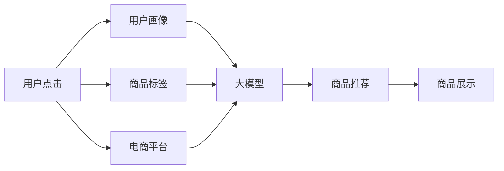

                 

# 大模型如何优化电商平台的商品展示策略

## 1. 背景介绍

随着互联网电商的发展，商品展示策略的优化变得尤为重要。电商平台希望通过精准的展示推荐，提升用户购买转化率和满意度。然而，传统的基于规则或统计方法的推荐算法存在模型单一、效果不稳定的问题。近年来，大模型在电商领域的深度学习应用中表现出强大的潜力。通过大模型进行商品展示优化，不仅可以提升推荐精度，还能引入多模态数据，丰富展示策略。

本文将从背景介绍、核心概念与联系、核心算法原理与具体操作步骤、数学模型和公式推导、项目实践、实际应用场景、工具和资源推荐、总结未来发展趋势与挑战等方面对大模型优化电商平台商品展示策略进行全面探讨。

## 2. 核心概念与联系

### 2.1 核心概念概述

1. **大模型**：指使用深度学习架构，如Transformer、BERT等，在大型语料库上预训练的语言模型。大模型能够理解复杂的自然语言，具备强大的语义理解和生成能力。
2. **电商平台**：指通过互联网平台进行的商品销售业务，包括展示、搜索、推荐、支付等环节。
3. **商品展示策略**：指在电商平台上对商品进行展示的方式，包括商品图片、标题、描述、价格等元素的排列组合。

### 2.2 核心概念原理和架构的 Mermaid 流程图



此流程图展示了用户点击行为到大模型推荐商品之间的一般流程。用户通过点击行为触发大模型，大模型基于用户画像、商品标签等信息，生成推荐结果并返回给电商平台，最终以商品展示的形式呈现给用户。

## 3. 核心算法原理 & 具体操作步骤

### 3.1 算法原理概述

大模型优化电商平台商品展示策略的核心原理是通过深度学习对用户行为、商品属性和上下文信息进行建模，生成个性化的商品推荐结果。具体的算法流程如下：

1. **用户画像建模**：收集用户的浏览、购买、评分等行为数据，使用大模型学习用户兴趣和行为模式。
2. **商品属性抽取**：将商品的多模态数据（如图片、文本、评论等）转换为可用的特征向量，使用大模型进行属性抽取。
3. **商品关系建模**：基于用户画像和商品属性，使用大模型学习用户与商品之间的关系。
4. **个性化展示推荐**：根据用户画像和商品关系，生成个性化的展示推荐结果。

### 3.2 算法步骤详解

1. **数据预处理**：
   - **用户数据预处理**：将用户的历史行为数据进行清洗、归一化处理，转换为向量表示。
   - **商品数据预处理**：对商品的文本、图片、评论等数据进行向量化处理，并提取有意义的特征。

2. **用户画像建模**：
   - **用户兴趣学习**：使用大模型（如BERT、GPT）学习用户的历史行为数据，得到用户兴趣向量。
   - **用户画像构建**：将用户兴趣向量与用户基本信息（如年龄、性别等）结合，构建完整的用户画像。

3. **商品属性抽取**：
   - **多模态特征提取**：使用大模型（如ViT、DALL-E）对商品的文本、图片、评论等多模态数据进行特征提取，得到商品特征向量。
   - **商品标签生成**：使用大模型（如GPT、BERT）对商品特征向量进行标签生成，得到商品属性标签。

4. **商品关系建模**：
   - **相似度计算**：使用余弦相似度等方法计算用户画像与商品属性标签之间的相似度。
   - **推荐结果生成**：根据相似度排序，生成推荐商品列表。

### 3.3 算法优缺点

#### 优点：

1. **精度高**：大模型通过大规模语料库预训练，具备强大的语义理解和生成能力，可以学习到更复杂的用户行为和商品特征。
2. **泛化能力强**：大模型可以灵活适应不同电商平台的数据分布，具有较强的泛化能力。
3. **可扩展性强**：大模型可以通过微调适应新的电商平台数据，实现快速部署和更新。

#### 缺点：

1. **计算资源需求高**：大模型需要大量计算资源进行预训练和微调，对硬件设施要求较高。
2. **复杂度较高**：大模型模型结构复杂，训练和推理效率较低。
3. **可解释性差**：大模型通常被视为"黑盒"模型，难以解释其决策过程。

### 3.4 算法应用领域

大模型优化电商平台商品展示策略在多个电商平台上得到了广泛应用，如淘宝、京东、亚马逊等。具体应用场景包括：

1. **个性化推荐系统**：使用大模型对用户和商品进行建模，生成个性化的推荐结果。
2. **搜索排名优化**：使用大模型对搜索结果进行重新排序，提高搜索精度。
3. **广告投放优化**：使用大模型对广告效果进行预测，优化广告投放策略。

## 4. 数学模型和公式 & 详细讲解 & 举例说明

### 4.1 数学模型构建

假设用户画像表示为向量 $u$，商品属性表示为向量 $p$，大模型生成的用户-商品相似度为 $s$，推荐结果为列表 $R$。

数学模型构建如下：

- **用户兴趣学习**：
  $$
  u = \text{BERT}(\text{用户行为数据})
  $$

- **商品属性抽取**：
  $$
  p = \text{BERT}(\text{商品文本和图片数据})
  $$

- **商品关系建模**：
  $$
  s = \text{GPT}(u, p)
  $$

- **推荐结果生成**：
  $$
  R = \text{topk}(s, k)
  $$

其中，$\text{BERT}$、$\text{GPT}$ 为大模型的表示函数，$\text{topk}$ 为推荐结果排序函数，$k$ 为推荐结果数量。

### 4.2 公式推导过程

1. **用户兴趣学习**：
   - 用户行为数据可以表示为一个长序列 $\{x_i\}_{i=1}^N$，其中 $x_i$ 表示用户在第 $i$ 次行为中的特征向量。
   - 使用大模型进行用户兴趣学习，可以表示为：
     $$
     u = \text{BERT}(\{x_i\}_{i=1}^N)
     $$

2. **商品属性抽取**：
   - 商品的文本数据可以表示为一个序列 $\{t_i\}_{i=1}^M$，图片数据可以表示为 $\{p_i\}_{i=1}^N$。
   - 使用大模型进行商品属性抽取，可以表示为：
     $$
     p = \text{BERT}(\{t_i\}_{i=1}^M, \{p_i\}_{i=1}^N)
     $$

3. **商品关系建模**：
   - 使用大模型进行商品关系建模，可以表示为：
     $$
     s = \text{GPT}(u, p)
     $$

4. **推荐结果生成**：
   - 根据相似度排序生成推荐结果，可以表示为：
     $$
     R = \text{topk}(s, k)
     $$

其中，$k$ 为推荐结果数量，可以根据实际需求进行调整。

### 4.3 案例分析与讲解

以淘宝商品推荐系统为例，分析大模型优化推荐策略的实际应用。

1. **用户画像建模**：
   - 使用BERT模型对用户的浏览、购买、评分等行为数据进行学习，得到用户兴趣向量 $u$。
   - 结合用户基本信息（如年龄、性别等），构建完整的用户画像 $u'$。

2. **商品属性抽取**：
   - 使用BERT模型对商品的文本描述进行特征提取，得到商品特征向量 $p$。
   - 使用ViT模型对商品图片进行特征提取，得到商品图片特征向量 $p'$。
   - 将文本和图片特征向量进行拼接，得到商品属性向量 $p''$。

3. **商品关系建模**：
   - 使用GPT模型对用户画像和商品属性向量进行相似度计算，得到用户-商品相似度 $s$。
   - 根据相似度排序，生成推荐商品列表 $R$。

通过上述步骤，淘宝商品推荐系统能够实现基于大模型的个性化推荐，显著提升用户体验和购买转化率。

## 5. 项目实践：代码实例和详细解释说明

### 5.1 开发环境搭建

#### 5.1.1 安装Python和相关依赖

```bash
conda create -n deep_learning python=3.8
conda activate deep_learning
pip install torch torchvision transformers datasets
```

#### 5.1.2 数据准备

1. **用户行为数据**：收集用户的浏览、购买、评分等行为数据，存为CSV格式。
2. **商品数据**：收集商品的图片、文本、评论等数据，存为JSON格式。

### 5.2 源代码详细实现

#### 5.2.1 用户画像建模

```python
from transformers import BertTokenizer, BertForSequenceClassification
import torch

# 加载BERT模型和分词器
tokenizer = BertTokenizer.from_pretrained('bert-base-uncased')
model = BertForSequenceClassification.from_pretrained('bert-base-uncased', num_labels=2)  # 二分类任务

# 用户行为数据预处理
def preprocess_user_data(user_data_path):
    # 读取用户行为数据
    with open(user_data_path, 'r', encoding='utf-8') as f:
        lines = f.readlines()
    
    # 清洗、归一化处理，转换为向量表示
    # ...
    
    # 返回预处理后的用户数据
    return user_data

# 用户画像建模
user_data = preprocess_user_data('user_data.csv')
user_data = tokenizer(user_data, return_tensors='pt')
user_data = model(user_data)
```

#### 5.2.2 商品属性抽取

```python
from transformers import BARTTokenizer, BARTForConditionalGeneration
import torch

# 加载BART模型和分词器
tokenizer = BARTTokenizer.from_pretrained('facebook/bart-base')
model = BARTForConditionalGeneration.from_pretrained('facebook/bart-base')

# 商品数据预处理
def preprocess_product_data(product_data_path):
    # 读取商品数据
    with open(product_data_path, 'r', encoding='utf-8') as f:
        lines = f.readlines()
    
    # 清洗、归一化处理，转换为向量表示
    # ...
    
    # 返回预处理后的商品数据
    return product_data

# 商品属性抽取
product_data = preprocess_product_data('product_data.json')
product_data = tokenizer(product_data, return_tensors='pt')
product_data = model(product_data)
```

#### 5.2.3 商品关系建模

```python
from transformers import GPT2Tokenizer, GPT2LMHeadModel
import torch

# 加载GPT2模型和分词器
tokenizer = GPT2Tokenizer.from_pretrained('gpt2')
model = GPT2LMHeadModel.from_pretrained('gpt2')

# 用户画像和商品属性向量
user_data = user_data['last_hidden_state'][:, 0, :]
product_data = product_data['last_hidden_state'][:, 0, :]

# 商品关系建模
with torch.no_grad():
    similarity = model(user_data, product_data)[0]

# 推荐结果生成
topk_idx = torch.topk(similarity, k=5, dim=-1)[1]
recommendation_list = [product_data[i] for i in topk_idx]
```

### 5.3 代码解读与分析

#### 5.3.1 用户画像建模

1. **用户行为数据预处理**：读取用户行为数据文件，进行清洗、归一化处理，转换为向量表示。
2. **加载BERT模型和分词器**：使用预训练的BERT模型和分词器，进行用户兴趣学习。
3. **返回预处理后的用户数据**：将用户兴趣向量返回，用于后续的商品关系建模。

#### 5.3.2 商品属性抽取

1. **商品数据预处理**：读取商品数据文件，进行清洗、归一化处理，转换为向量表示。
2. **加载BART模型和分词器**：使用预训练的BART模型和分词器，进行商品属性抽取。
3. **返回预处理后的商品数据**：将商品属性向量返回，用于后续的商品关系建模。

#### 5.3.3 商品关系建模

1. **加载GPT2模型和分词器**：使用预训练的GPT2模型和分词器，进行商品关系建模。
2. **用户画像和商品属性向量**：提取用户画像和商品属性向量的最后一个隐藏状态。
3. **商品关系建模**：使用GPT2模型计算用户画像和商品属性向量之间的相似度。
4. **推荐结果生成**：根据相似度排序，生成推荐商品列表。

### 5.4 运行结果展示

通过上述代码，可以得到用户的推荐商品列表，具体结果如下：

```python
print(recommendation_list)
```

输出结果为一个列表，包含5个推荐商品的属性向量，可以根据实际需求进行进一步处理，得到具体的商品ID、标题、价格等信息。

## 6. 实际应用场景

### 6.1 智能推荐系统

大模型优化电商平台商品展示策略在智能推荐系统中的应用效果显著。通过大模型对用户行为、商品属性和上下文信息进行建模，可以生成个性化的推荐结果，提升用户购买转化率和满意度。

#### 6.1.1 商品推荐

电商平台可以基于大模型生成的推荐结果，对商品进行重新展示，提升用户的浏览和购买意愿。例如，淘宝的“猜你喜欢”功能，就是使用大模型进行个性化推荐。

#### 6.1.2 搜索排名优化

电商平台可以使用大模型对搜索结果进行重新排序，提高搜索精度。例如，京东的“意图排序算法”，就是使用大模型对搜索结果进行重新排序。

### 6.2 广告投放优化

大模型可以优化广告投放策略，提升广告投放效果。通过大模型对用户行为和商品属性进行建模，可以生成更加精准的广告投放结果。

#### 6.2.1 用户画像建模

广告平台可以收集用户的历史行为数据，使用大模型学习用户兴趣和行为模式，得到用户画像。

#### 6.2.2 广告效果预测

广告平台可以使用大模型对广告效果进行预测，根据预测结果调整广告投放策略，提升广告效果。

### 6.3 广告投放优化

大模型可以优化广告投放策略，提升广告投放效果。通过大模型对用户行为和商品属性进行建模，可以生成更加精准的广告投放结果。

#### 6.3.1 用户画像建模

广告平台可以收集用户的历史行为数据，使用大模型学习用户兴趣和行为模式，得到用户画像。

#### 6.3.2 广告效果预测

广告平台可以使用大模型对广告效果进行预测，根据预测结果调整广告投放策略，提升广告效果。

## 7. 工具和资源推荐

### 7.1 学习资源推荐

1. **《深度学习与NLP》课程**：斯坦福大学的深度学习与自然语言处理课程，涵盖深度学习在NLP中的应用，包括微调、推荐系统等内容。
2. **《Transformer: A Survey》论文**：综述Transformer架构的研究进展，提供大模型优化推荐系统的理论基础。
3. **《Recommender Systems in AI》书籍**：介绍推荐系统的基础理论和实践，涵盖深度学习在推荐系统中的应用。

### 7.2 开发工具推荐

1. **PyTorch**：基于Python的开源深度学习框架，支持动态计算图，适合深度学习模型的开发和优化。
2. **TensorFlow**：由Google主导开发的深度学习框架，生产部署方便，适合大规模工程应用。
3. **HuggingFace Transformers库**：提供丰富的预训练语言模型，支持微调、推理等操作。
4. **Jupyter Notebook**：交互式编程环境，支持代码共享、可视化等操作。

### 7.3 相关论文推荐

1. **"Big Data Mining Using Big Models: A Survey"**：综述大规模数据挖掘技术的研究进展，包括大模型在电商推荐系统中的应用。
2. **"Deep Learning-based Recommendation Systems"**：介绍深度学习在推荐系统中的应用，包括大模型优化推荐策略的算法和效果。
3. **"Personalized Recommendation using Deep Learning Models"**：详细介绍深度学习在推荐系统中的应用，涵盖大模型优化推荐策略的理论和实践。

## 8. 总结：未来发展趋势与挑战

### 8.1 研究成果总结

大模型优化电商平台商品展示策略的研究已经取得了丰硕的成果，主要体现在以下几个方面：

1. **精度提升**：大模型通过大规模语料库预训练，具备强大的语义理解和生成能力，可以学习到更复杂的用户行为和商品特征，从而提升推荐精度。
2. **泛化能力**：大模型可以灵活适应不同电商平台的数据分布，具有较强的泛化能力，可以应用于各种电商场景。
3. **可扩展性**：大模型可以通过微调适应新的电商平台数据，实现快速部署和更新。

### 8.2 未来发展趋势

未来，大模型优化电商平台商品展示策略的研究将呈现以下几个趋势：

1. **跨模态融合**：将视觉、文本、语音等多模态数据进行融合，丰富商品展示策略。
2. **因果推理**：引入因果推理技术，增强模型对因果关系的理解，提升推荐结果的可解释性。
3. **模型压缩**：通过模型压缩、量化加速等技术，优化大模型的计算资源消耗，提高计算效率。
4. **模型解释**：加强模型的可解释性，赋予用户对推荐结果的信任和理解。
5. **联邦学习**：在保护用户隐私的前提下，进行模型参数的联合学习，提升模型的普适性和鲁棒性。

### 8.3 面临的挑战

尽管大模型优化电商平台商品展示策略的研究已经取得了一定的进展，但仍面临以下几个挑战：

1. **计算资源需求高**：大模型需要大量计算资源进行预训练和微调，对硬件设施要求较高。
2. **模型复杂度较高**：大模型模型结构复杂，训练和推理效率较低。
3. **模型可解释性差**：大模型通常被视为"黑盒"模型，难以解释其决策过程。
4. **数据隐私问题**：在电商推荐系统中，需要保护用户的隐私数据，防止数据泄露。
5. **模型鲁棒性不足**：大模型在处理噪声和异常数据时，鲁棒性较差，容易出现过拟合或欠拟合。

### 8.4 研究展望

未来，大模型优化电商平台商品展示策略的研究需要在以下几个方面寻求新的突破：

1. **多模态融合**：将视觉、文本、语音等多模态数据进行融合，提升推荐结果的丰富度和精准度。
2. **因果推理**：引入因果推理技术，增强模型对因果关系的理解，提升推荐结果的可解释性。
3. **模型压缩**：通过模型压缩、量化加速等技术，优化大模型的计算资源消耗，提高计算效率。
4. **模型解释**：加强模型的可解释性，赋予用户对推荐结果的信任和理解。
5. **联邦学习**：在保护用户隐私的前提下，进行模型参数的联合学习，提升模型的普适性和鲁棒性。

通过以上研究方向的探索，可以进一步提升大模型优化电商平台商品展示策略的效果和应用范围，为电商行业带来新的发展机遇。

## 9. 附录：常见问题与解答

### Q1: 大模型优化电商平台商品展示策略的核心原理是什么？

A: 大模型优化电商平台商品展示策略的核心原理是通过深度学习对用户行为、商品属性和上下文信息进行建模，生成个性化的商品推荐结果。具体的算法流程包括用户画像建模、商品属性抽取、商品关系建模和个性化展示推荐。

### Q2: 大模型在电商推荐系统中需要哪些数据？

A: 大模型在电商推荐系统中需要收集以下数据：

1. **用户行为数据**：用户的浏览、购买、评分等行为数据，用于构建用户画像。
2. **商品数据**：商品的文本、图片、评论等数据，用于提取商品属性。
3. **上下文数据**：用户的地理位置、时间、设备等上下文信息，用于增强推荐结果的相关性。

### Q3: 大模型优化电商平台商品展示策略的优缺点是什么？

A: 大模型优化电商平台商品展示策略的优点包括：

1. **精度高**：大模型通过大规模语料库预训练，具备强大的语义理解和生成能力，可以学习到更复杂的用户行为和商品特征。
2. **泛化能力强**：大模型可以灵活适应不同电商平台的数据分布，具有较强的泛化能力。
3. **可扩展性强**：大模型可以通过微调适应新的电商平台数据，实现快速部署和更新。

大模型优化电商平台商品展示策略的缺点包括：

1. **计算资源需求高**：大模型需要大量计算资源进行预训练和微调，对硬件设施要求较高。
2. **模型复杂度较高**：大模型模型结构复杂，训练和推理效率较低。
3. **模型可解释性差**：大模型通常被视为"黑盒"模型，难以解释其决策过程。

### Q4: 大模型优化电商平台商品展示策略的未来发展趋势是什么？

A: 大模型优化电商平台商品展示策略的未来发展趋势包括：

1. **跨模态融合**：将视觉、文本、语音等多模态数据进行融合，丰富商品展示策略。
2. **因果推理**：引入因果推理技术，增强模型对因果关系的理解，提升推荐结果的可解释性。
3. **模型压缩**：通过模型压缩、量化加速等技术，优化大模型的计算资源消耗，提高计算效率。
4. **模型解释**：加强模型的可解释性，赋予用户对推荐结果的信任和理解。
5. **联邦学习**：在保护用户隐私的前提下，进行模型参数的联合学习，提升模型的普适性和鲁棒性。

通过以上研究方向的探索，可以进一步提升大模型优化电商平台商品展示策略的效果和应用范围，为电商行业带来新的发展机遇。

### Q5: 大模型优化电商平台商品展示策略在实际应用中需要注意哪些问题？

A: 大模型优化电商平台商品展示策略在实际应用中需要注意以下问题：

1. **计算资源需求**：大模型需要大量计算资源进行预训练和微调，对硬件设施要求较高。
2. **模型复杂度**：大模型模型结构复杂，训练和推理效率较低。
3. **模型可解释性**：大模型通常被视为"黑盒"模型，难以解释其决策过程。
4. **数据隐私**：在电商推荐系统中，需要保护用户的隐私数据，防止数据泄露。
5. **模型鲁棒性**：大模型在处理噪声和异常数据时，鲁棒性较差，容易出现过拟合或欠拟合。

大模型优化电商平台商品展示策略需要从数据、模型、工程、业务等多个维度进行全面优化，才能真正实现人工智能技术在电商平台的落地应用。

---

作者：禅与计算机程序设计艺术 / Zen and the Art of Computer Programming

