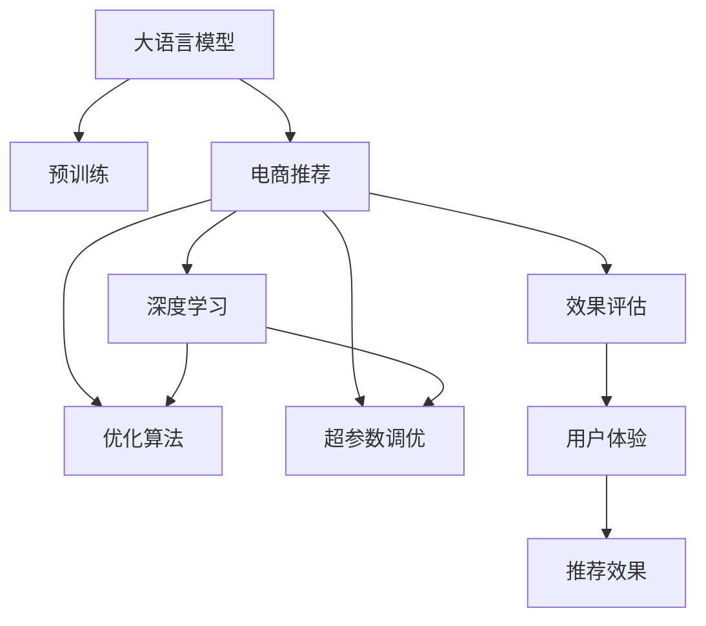
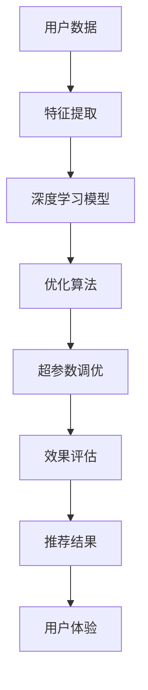

                 

# 大模型如何优化电商平台的实时推荐系统

> 关键词：大语言模型,推荐系统,电商,用户行为,深度学习,优化算法,超参数调优,效果评估

## 1. 背景介绍

### 1.1 问题由来
随着电子商务的蓬勃发展，电商平台面临的是愈发激烈的市场竞争。如何为消费者提供个性化、精准的购物推荐，已经成为各大电商平台提升用户满意度和转化率的关键问题。传统的基于规则和统计的推荐方法往往难以捕捉用户深层次的需求和行为特征，无法实现高效的个性化推荐。

近年来，深度学习技术，特别是基于大语言模型的推荐系统，成为了电商领域的新宠。这种基于大模型的推荐系统通过预训练语言模型学习用户的广泛语义知识，再通过微调学习特定的电商推荐任务，能够提供更加精准、智能的推荐服务。

然而，大语言模型在电商推荐中的实际应用效果，依然面临着模型选择、数据处理、优化算法、超参数调优等一系列挑战。本文将全面介绍大语言模型在电商推荐中的应用，探讨如何通过合理的算法和实践优化电商平台的用户推荐系统。

### 1.2 问题核心关键点
- 大语言模型：以自回归或自编码模型为代表的大规模预训练语言模型。通过在大规模无标签文本语料上进行预训练，学习通用的语言表示，具备强大的语言理解和生成能力。
- 推荐系统：通过用户行为数据训练推荐模型，预测用户可能感兴趣的商品，并推荐给用户的技术体系。
- 电商推荐：针对电商场景，利用大语言模型优化推荐算法，提升个性化推荐效果。
- 深度学习：通过神经网络模型进行推荐任务的学习，利用模型参数进行特征提取和预测。
- 优化算法：通过梯度下降等方法优化模型参数，提高模型效果。
- 超参数调优：通过搜索和调整模型超参数，寻找最优的模型配置。

这些核心概念之间的逻辑关系可以通过以下Mermaid流程图来展示：



这个流程图展示了从预训练到电商推荐的全流程：

1. 大语言模型通过预训练获得基础能力。
2. 电商推荐任务中，深度学习模型基于用户行为数据，进行特征提取和预测。
3. 优化算法通过梯度下降等方法，不断调整模型参数，提升模型效果。
4. 超参数调优通过搜索和调整模型超参数，找到最优的模型配置。
5. 通过效果评估，量化推荐模型的性能，最终优化用户体验和推荐效果。

## 2. 核心概念与联系

### 2.1 核心概念概述

为了更好地理解大语言模型在电商推荐中的应用，本节将介绍几个密切相关的核心概念：

- **大语言模型**：以自回归(如GPT)或自编码(如BERT)模型为代表的大规模预训练语言模型。通过在大规模无标签文本语料上进行预训练，学习通用的语言表示，具备强大的语言理解和生成能力。
- **电商推荐系统**：根据用户的购物行为、浏览记录、搜索历史等数据，预测用户可能感兴趣的商品，进行个性化推荐。
- **深度学习**：利用神经网络模型进行推荐任务的学习，利用模型参数进行特征提取和预测。
- **优化算法**：通过梯度下降等方法优化模型参数，提高模型效果。
- **超参数调优**：通过搜索和调整模型超参数，找到最优的模型配置。
- **效果评估**：通过预设指标，如召回率、准确率、覆盖率等，量化推荐模型的性能。
- **用户体验**：通过推荐模型输出的商品列表，提升用户满意度和转化率。

这些核心概念共同构成了电商推荐系统的技术框架，使其能够为电商平台提供智能、精准的推荐服务。

### 2.2 核心概念原理和架构的 Mermaid 流程图

以下是一个简单的Mermaid流程图，展示了电商推荐系统中的各个关键组件及其工作流程：



这个流程图展示了电商推荐系统的主要组件和流程：

1. **用户数据**：收集用户的购物行为、浏览记录、搜索历史等数据。
2. **特征提取**：利用深度学习模型对用户数据进行特征提取，生成用户特征向量。
3. **深度学习模型**：基于用户特征向量，进行推荐任务的学习，预测用户可能感兴趣的商品。
4. **优化算法**：通过梯度下降等方法，不断调整模型参数，提升模型效果。
5. **超参数调优**：通过搜索和调整模型超参数，找到最优的模型配置。
6. **效果评估**：通过预设指标，量化推荐模型的性能。
7. **推荐结果**：根据推荐模型的输出，为用户生成商品推荐列表。
8. **用户体验**：通过推荐列表提升用户满意度和转化率。

## 3. 核心算法原理 & 具体操作步骤

### 3.1 算法原理概述

电商推荐系统中的大语言模型，本质上是基于深度学习技术进行推荐任务的学习。其核心思想是：通过预训练语言模型学习用户的广泛语义知识，再通过微调学习特定的电商推荐任务，从而提供个性化推荐服务。

形式化地，假设大语言模型为 $M_{\theta}$，其中 $\theta$ 为预训练得到的模型参数。电商推荐任务为 $T$，其中 $T$ 可以是一个分类任务（如商品分类）或回归任务（如价格预测）。电商推荐任务的标注数据集为 $D=\{(x_i, y_i)\}_{i=1}^N$，其中 $x_i$ 为用户的行为数据，$y_i$ 为推荐的商品标签或价格等目标变量。微调的目标是找到新的模型参数 $\hat{\theta}$，使得：

$$
\hat{\theta}=\mathop{\arg\min}_{\theta} \mathcal{L}(M_{\theta},D)
$$

其中 $\mathcal{L}$ 为针对电商推荐任务设计的损失函数，用于衡量模型预测输出与真实标签之间的差异。常见的损失函数包括交叉熵损失、均方误差损失等。

### 3.2 算法步骤详解

电商推荐系统中的大语言模型微调一般包括以下几个关键步骤：

**Step 1: 准备预训练模型和数据集**
- 选择合适的预训练语言模型 $M_{\theta}$ 作为初始化参数，如 BERT、GPT 等。
- 准备电商推荐任务 $T$ 的标注数据集 $D$，划分为训练集、验证集和测试集。一般要求标注数据与预训练数据的分布不要差异过大。

**Step 2: 设计任务适配层**
- 根据电商推荐任务的类型，在预训练模型顶层设计合适的输出层和损失函数。
- 对于分类任务，通常在顶层添加线性分类器和交叉熵损失函数。
- 对于回归任务，通常使用均方误差损失函数。

**Step 3: 设置微调超参数**
- 选择合适的优化算法及其参数，如 AdamW、SGD 等，设置学习率、批大小、迭代轮数等。
- 设置正则化技术及强度，包括权重衰减、Dropout、Early Stopping 等。
- 确定冻结预训练参数的策略，如仅微调顶层，或全部参数都参与微调。

**Step 4: 执行梯度训练**
- 将训练集数据分批次输入模型，前向传播计算损失函数。
- 反向传播计算参数梯度，根据设定的优化算法和学习率更新模型参数。
- 周期性在验证集上评估模型性能，根据性能指标决定是否触发 Early Stopping。
- 重复上述步骤直到满足预设的迭代轮数或 Early Stopping 条件。

**Step 5: 测试和部署**
- 在测试集上评估微调后模型 $M_{\hat{\theta}}$ 的性能，对比微调前后的精度提升。
- 使用微调后的模型对新样本进行推理预测，集成到实际的应用系统中。
- 持续收集新的数据，定期重新微调模型，以适应数据分布的变化。

以上是电商推荐系统中基于大语言模型的微调范式的一般流程。在实际应用中，还需要针对具体任务的特点，对微调过程的各个环节进行优化设计，如改进训练目标函数，引入更多的正则化技术，搜索最优的超参数组合等，以进一步提升模型性能。

### 3.3 算法优缺点

电商推荐系统中的基于大语言模型的微调方法具有以下优点：
1. 能够利用大语言模型的广泛语义知识，提升推荐准确性和个性化程度。
2. 数据需求相对较少，可以处理大量非结构化数据，提升推荐系统覆盖率。
3. 可以灵活设计任务适配层，适应不同类型的电商推荐任务。
4. 微调过程较为简单，可以在短时间内完成模型适配，提升部署效率。

同时，该方法也存在一定的局限性：
1. 依赖标注数据。微调的效果很大程度上取决于标注数据的质量和数量，获取高质量标注数据的成本较高。
2. 迁移能力有限。当目标任务与预训练数据的分布差异较大时，微调的性能提升有限。
3. 可解释性不足。微调模型的决策过程通常缺乏可解释性，难以对其推理逻辑进行分析和调试。
4. 模型复杂度高。大语言模型的参数量较大，导致模型训练和推理所需计算资源较多。

尽管存在这些局限性，但就目前而言，基于大语言模型的微调方法仍是目前电商推荐系统中的主流范式。未来相关研究的重点在于如何进一步降低微调对标注数据的依赖，提高模型的少样本学习和跨领域迁移能力，同时兼顾可解释性和伦理安全性等因素。

### 3.4 算法应用领域

基于大语言模型微调的电商推荐方法，已经在商品分类、价格预测、推荐排序等诸多电商推荐任务上取得了优异的效果，成为电商推荐系统的重要技术手段。具体应用场景包括：

- **商品分类**：根据用户浏览记录和购物历史，预测用户可能感兴趣的商品类别。
- **价格预测**：根据商品的历史价格数据，预测未来价格趋势。
- **推荐排序**：对推荐结果进行排序，提高推荐列表的相关性和准确性。
- **个性化推荐**：结合用户画像和行为数据，进行个性化的商品推荐。
- **用户意图理解**：利用用户输入的查询词，理解用户意图，进行更精准的推荐。

除了上述这些经典任务外，大语言模型微调也被创新性地应用到更多场景中，如跨品类推荐、商品展示优化、用户行为预测等，为电商推荐系统带来了全新的突破。

## 4. 数学模型和公式 & 详细讲解 & 举例说明

### 4.1 数学模型构建

本节将使用数学语言对基于大语言模型的大规模电商推荐系统进行更加严格的刻画。

记电商推荐任务为 $T$，标注数据集为 $D=\{(x_i,y_i)\}_{i=1}^N$，其中 $x_i$ 为用户行为数据，$y_i$ 为推荐标签或价格。假设模型为 $M_{\theta}$，则其在新数据 $x_{new}$ 上的预测结果为 $y_{pred}=M_{\theta}(x_{new})$。

定义模型 $M_{\theta}$ 在数据样本 $(x,y)$ 上的损失函数为 $\ell(M_{\theta}(x),y)$，则在数据集 $D$ 上的经验风险为：

$$
\mathcal{L}(\theta) = \frac{1}{N}\sum_{i=1}^N \ell(M_{\theta}(x_i),y_i)
$$

微调的优化目标是最小化经验风险，即找到最优参数：

$$
\theta^* = \mathop{\arg\min}_{\theta} \mathcal{L}(\theta)
$$

在实践中，我们通常使用基于梯度的优化算法（如SGD、Adam等）来近似求解上述最优化问题。设 $\eta$ 为学习率，$\lambda$ 为正则化系数，则参数的更新公式为：

$$
\theta \leftarrow \theta - \eta \nabla_{\theta}\mathcal{L}(\theta) - \eta\lambda\theta
$$

其中 $\nabla_{\theta}\mathcal{L}(\theta)$ 为损失函数对参数 $\theta$ 的梯度，可通过反向传播算法高效计算。

### 4.2 公式推导过程

以下我们以二分类任务为例，推导交叉熵损失函数及其梯度的计算公式。

假设模型 $M_{\theta}$ 在输入 $x$ 上的输出为 $\hat{y}=M_{\theta}(x) \in [0,1]$，表示用户点击商品的概率。真实标签 $y \in \{0,1\}$。则二分类交叉熵损失函数定义为：

$$
\ell(M_{\theta}(x),y) = -[y\log \hat{y} + (1-y)\log (1-\hat{y})]
$$

将其代入经验风险公式，得：

$$
\mathcal{L}(\theta) = -\frac{1}{N}\sum_{i=1}^N [y_i\log M_{\theta}(x_i)+(1-y_i)\log(1-M_{\theta}(x_i))]
$$

根据链式法则，损失函数对参数 $\theta_k$ 的梯度为：

$$
\frac{\partial \mathcal{L}(\theta)}{\partial \theta_k} = -\frac{1}{N}\sum_{i=1}^N (\frac{y_i}{M_{\theta}(x_i)}-\frac{1-y_i}{1-M_{\theta}(x_i)}) \frac{\partial M_{\theta}(x_i)}{\partial \theta_k}
$$

其中 $\frac{\partial M_{\theta}(x_i)}{\partial \theta_k}$ 可进一步递归展开，利用自动微分技术完成计算。

在得到损失函数的梯度后，即可带入参数更新公式，完成模型的迭代优化。重复上述过程直至收敛，最终得到适应电商推荐任务的最优模型参数 $\theta^*$。

## 5. 项目实践：代码实例和详细解释说明

### 5.1 开发环境搭建

在进行电商推荐系统的大语言模型微调实践前，我们需要准备好开发环境。以下是使用Python进行PyTorch开发的环境配置流程：

1. 安装Anaconda：从官网下载并安装Anaconda，用于创建独立的Python环境。

2. 创建并激活虚拟环境：
```bash
conda create -n pytorch-env python=3.8 
conda activate pytorch-env
```

3. 安装PyTorch：根据CUDA版本，从官网获取对应的安装命令。例如：
```bash
conda install pytorch torchvision torchaudio cudatoolkit=11.1 -c pytorch -c conda-forge
```

4. 安装Transformers库：
```bash
pip install transformers
```

5. 安装各类工具包：
```bash
pip install numpy pandas scikit-learn matplotlib tqdm jupyter notebook ipython
```

完成上述步骤后，即可在`pytorch-env`环境中开始微调实践。

### 5.2 源代码详细实现

这里我们以商品分类任务为例，给出使用Transformers库对BERT模型进行电商推荐任务微调的PyTorch代码实现。

首先，定义商品分类的数据处理函数：

```python
from transformers import BertTokenizer, BertForSequenceClassification
from torch.utils.data import Dataset, DataLoader
import torch

class商品分类Dataset(Dataset):
    def __init__(self, texts, labels, tokenizer, max_len=128):
        self.texts = texts
        self.labels = labels
        self.tokenizer = tokenizer
        self.max_len = max_len
        
    def __len__(self):
        return len(self.texts)
    
    def __getitem__(self, item):
        text = self.texts[item]
        label = self.labels[item]
        
        encoding = self.tokenizer(text, return_tensors='pt', max_length=self.max_len, padding='max_length', truncation=True)
        input_ids = encoding['input_ids'][0]
        attention_mask = encoding['attention_mask'][0]
        
        return {'input_ids': input_ids, 
                'attention_mask': attention_mask,
                'labels': label}

# 定义标签与id的映射
label2id = {'商品A': 0, '商品B': 1, '商品C': 2, '商品D': 3}
id2label = {v: k for k, v in label2id.items()}

# 创建dataset
tokenizer = BertTokenizer.from_pretrained('bert-base-cased')

train_dataset = 商品分类Dataset(train_texts, train_labels, tokenizer)
dev_dataset = 商品分类Dataset(dev_texts, dev_labels, tokenizer)
test_dataset = 商品分类Dataset(test_texts, test_labels, tokenizer)
```

然后，定义模型和优化器：

```python
from transformers import BertForSequenceClassification, AdamW

model = BertForSequenceClassification.from_pretrained('bert-base-cased', num_labels=len(label2id))

optimizer = AdamW(model.parameters(), lr=2e-5)
```

接着，定义训练和评估函数：

```python
from sklearn.metrics import accuracy_score

device = torch.device('cuda') if torch.cuda.is_available() else torch.device('cpu')
model.to(device)

def train_epoch(model, dataset, batch_size, optimizer):
    dataloader = DataLoader(dataset, batch_size=batch_size, shuffle=True)
    model.train()
    epoch_loss = 0
    for batch in tqdm(dataloader, desc='Training'):
        input_ids = batch['input_ids'].to(device)
        attention_mask = batch['attention_mask'].to(device)
        labels = batch['labels'].to(device)
        model.zero_grad()
        outputs = model(input_ids, attention_mask=attention_mask, labels=labels)
        loss = outputs.loss
        epoch_loss += loss.item()
        loss.backward()
        optimizer.step()
    return epoch_loss / len(dataloader)

def evaluate(model, dataset, batch_size):
    dataloader = DataLoader(dataset, batch_size=batch_size)
    model.eval()
    preds, labels = [], []
    with torch.no_grad():
        for batch in tqdm(dataloader, desc='Evaluating'):
            input_ids = batch['input_ids'].to(device)
            attention_mask = batch['attention_mask'].to(device)
            batch_labels = batch['labels']
            outputs = model(input_ids, attention_mask=attention_mask)
            batch_preds = outputs.logits.argmax(dim=1).to('cpu').tolist()
            batch_labels = batch_labels.to('cpu').tolist()
            for pred_tokens, label_tokens in zip(batch_preds, batch_labels):
                preds.append(pred_tokens)
                labels.append(label_tokens)
                
    print('商品分类准确率：', accuracy_score(labels, preds))
```

最后，启动训练流程并在测试集上评估：

```python
epochs = 5
batch_size = 16

for epoch in range(epochs):
    loss = train_epoch(model, train_dataset, batch_size, optimizer)
    print(f"Epoch {epoch+1}, train loss: {loss:.3f}")
    
    print(f"Epoch {epoch+1}, dev results:")
    evaluate(model, dev_dataset, batch_size)
    
print("测试结果:")
evaluate(model, test_dataset, batch_size)
```

以上就是使用PyTorch对BERT进行电商推荐系统商品分类任务微调的完整代码实现。可以看到，得益于Transformers库的强大封装，我们可以用相对简洁的代码完成BERT模型的加载和微调。

### 5.3 代码解读与分析

让我们再详细解读一下关键代码的实现细节：

**商品分类Dataset类**：
- `__init__`方法：初始化文本、标签、分词器等关键组件。
- `__len__`方法：返回数据集的样本数量。
- `__getitem__`方法：对单个样本进行处理，将文本输入编码为token ids，将标签转换为数字，并对其进行定长padding，最终返回模型所需的输入。

**label2id和id2label字典**：
- 定义了标签与数字id之间的映射关系，用于将预测结果解码回真实的标签。

**训练和评估函数**：
- 使用PyTorch的DataLoader对数据集进行批次化加载，供模型训练和推理使用。
- 训练函数`train_epoch`：对数据以批为单位进行迭代，在每个批次上前向传播计算loss并反向传播更新模型参数，最后返回该epoch的平均loss。
- 评估函数`evaluate`：与训练类似，不同点在于不更新模型参数，并在每个batch结束后将预测和标签结果存储下来，最后使用sklearn的accuracy_score计算分类准确率。

**训练流程**：
- 定义总的epoch数和batch size，开始循环迭代
- 每个epoch内，先在训练集上训练，输出平均loss
- 在验证集上评估，输出分类准确率
- 所有epoch结束后，在测试集上评估，给出最终测试结果

可以看到，PyTorch配合Transformers库使得BERT微调的代码实现变得简洁高效。开发者可以将更多精力放在数据处理、模型改进等高层逻辑上，而不必过多关注底层的实现细节。

当然，工业级的系统实现还需考虑更多因素，如模型的保存和部署、超参数的自动搜索、更灵活的任务适配层等。但核心的微调范式基本与此类似。

## 6. 实际应用场景

### 6.1 智能推荐系统

基于大语言模型微调的电商推荐系统，已经广泛应用于智能推荐场景。传统的推荐系统往往只能根据用户的历史行为数据进行推荐，难以捕捉用户深层次的兴趣和需求。而通过大语言模型微调，推荐系统能够更准确地理解用户意图，提供更个性化的推荐服务。

在技术实现上，可以收集用户的历史浏览记录、购买记录、评论数据等，将这些文本数据作为输入，训练大语言模型进行微调。微调后的模型能够从用户文本数据中提取关键词、情感等信息，结合用户画像和行为数据，进行更精准的推荐。

### 6.2 实时监控和预警

电商推荐系统中的大语言模型微调，还可以用于实时监控和预警。通过收集用户在线行为数据，利用微调后的模型进行分析和预测，及时发现异常情况，发出预警信号，帮助电商平台及时处理和应对突发事件。

例如，某电商平台发现某个时间段的点击率突然大幅下降，可以通过微调模型分析用户输入的查询词和评论内容，识别出可能的原因，如系统故障、物流延迟等，并立即通知相关部门进行处理，从而降低用户流失率。

### 6.3 用户行为预测

电商推荐系统中的大语言模型微调，还可以用于用户行为预测。通过收集用户的历史行为数据，利用微调后的模型进行预测，可以提前预判用户可能感兴趣的商品，提前进行推荐，提升用户的购物体验和转化率。

例如，某电商平台希望预测用户在未来一段时间内的购买行为，可以通过微调模型分析用户的浏览记录和搜索行为，预测其可能感兴趣的商品类别和价格区间，提前进行个性化推荐，增加用户的购买机会。

## 7. 工具和资源推荐

### 7.1 学习资源推荐

为了帮助开发者系统掌握大语言模型在电商推荐中的应用，这里推荐一些优质的学习资源：

1. 《深度学习与电商推荐系统》书籍：全面介绍了电商推荐系统的基本概念和经典算法，涵盖了大语言模型微调、深度学习等前沿技术。

2. 《推荐系统：算法与实现》课程：由清华大学开设的推荐系统在线课程，系统讲解了推荐系统原理和实现方法，包括大语言模型微调。

3. PyTorch官方文档：详细介绍了PyTorch框架的使用方法，提供了丰富的模型和工具库，适合电商推荐系统开发。

4. HuggingFace官方文档：详细介绍了Transformers库的使用方法，提供了丰富的预训练模型和微调样例代码，适合电商推荐系统开发。

5. Kaggle竞赛：参加Kaggle上的电商推荐系统竞赛，通过实战练习提升技能，积累经验。

通过对这些资源的学习实践，相信你一定能够快速掌握大语言模型在电商推荐系统中的应用，并用于解决实际的电商推荐问题。

### 7.2 开发工具推荐

高效的开发离不开优秀的工具支持。以下是几款用于电商推荐系统开发的大语言模型微调工具：

1. PyTorch：基于Python的开源深度学习框架，灵活动态的计算图，适合快速迭代研究。大部分预训练语言模型都有PyTorch版本的实现。

2. TensorFlow：由Google主导开发的开源深度学习框架，生产部署方便，适合大规模工程应用。同样有丰富的预训练语言模型资源。

3. Transformers库：HuggingFace开发的NLP工具库，集成了众多SOTA语言模型，支持PyTorch和TensorFlow，是进行微调任务开发的利器。

4. Weights & Biases：模型训练的实验跟踪工具，可以记录和可视化模型训练过程中的各项指标，方便对比和调优。与主流深度学习框架无缝集成。

5. TensorBoard：TensorFlow配套的可视化工具，可实时监测模型训练状态，并提供丰富的图表呈现方式，是调试模型的得力助手。

6. Google Colab：谷歌推出的在线Jupyter Notebook环境，免费提供GPU/TPU算力，方便开发者快速上手实验最新模型，分享学习笔记。

合理利用这些工具，可以显著提升电商推荐系统的开发效率，加快创新迭代的步伐。

### 7.3 相关论文推荐

大语言模型在电商推荐系统中的应用源于学界的持续研究。以下是几篇奠基性的相关论文，推荐阅读：

1. Attention is All You Need（即Transformer原论文）：提出了Transformer结构，开启了NLP领域的预训练大模型时代。

2. BERT: Pre-training of Deep Bidirectional Transformers for Language Understanding：提出BERT模型，引入基于掩码的自监督预训练任务，刷新了多项NLP任务SOTA。

3. Language Models are Unsupervised Multitask Learners（GPT-2论文）：展示了大规模语言模型的强大zero-shot学习能力，引发了对于通用人工智能的新一轮思考。

4. Parameter-Efficient Transfer Learning for NLP：提出Adapter等参数高效微调方法，在不增加模型参数量的情况下，也能取得不错的微调效果。

5. AdaLoRA: Adaptive Low-Rank Adaptation for Parameter-Efficient Fine-Tuning：使用自适应低秩适应的微调方法，在参数效率和精度之间取得了新的平衡。

这些论文代表了大语言模型在电商推荐系统中的应用发展脉络。通过学习这些前沿成果，可以帮助研究者把握学科前进方向，激发更多的创新灵感。

## 8. 总结：未来发展趋势与挑战

### 8.1 总结

本文对基于大语言模型的大规模电商推荐系统进行了全面系统的介绍。首先阐述了电商推荐系统的背景和重要性，明确了电商推荐系统的目标和挑战。其次，从原理到实践，详细讲解了大语言模型在电商推荐系统中的应用，探讨了如何通过合理的算法和实践优化电商平台的用户推荐系统。

通过本文的系统梳理，可以看到，基于大语言模型的电商推荐系统能够提供更加智能、精准的推荐服务，为电商平台带来了显著的业务价值。未来，伴随大语言模型和推荐算法的持续演进，相信电商推荐系统将更加高效、智能，成为电商平台的核心竞争力。

### 8.2 未来发展趋势

展望未来，基于大语言模型的电商推荐系统将呈现以下几个发展趋势：

1. **模型规模持续增大**：随着算力成本的下降和数据规模的扩张，预训练语言模型的参数量还将持续增长。超大规模语言模型蕴含的丰富语言知识，有望支撑更加复杂多变的电商推荐任务。

2. **推荐算法的多样化**：除了传统的基于深度学习的推荐方法外，未来的电商推荐系统还将融合更多元化的算法，如基于图神经网络的推荐、基于贝叶斯推理的推荐等，提升推荐系统的表现和覆盖率。

3. **实时性提升**：电商推荐系统中的大语言模型微调，将逐渐从离线处理转向实时处理，支持毫秒级的推荐响应，提升用户体验和系统效率。

4. **跨领域推荐**：基于大语言模型的推荐系统，将能够跨领域进行推荐，如跨品类推荐、跨渠道推荐等，提升用户的多样化需求满足率。

5. **个性化推荐**：利用大语言模型的广泛语义知识，电商推荐系统将能够实现更加精准、个性化的推荐，提升用户的满意度和转化率。

6. **多模态融合**：除了文本数据外，未来的电商推荐系统还将融合图像、视频、语音等多模态数据，实现更全面、更智能的推荐。

以上趋势凸显了大语言模型在电商推荐系统中的应用前景。这些方向的探索发展，必将进一步提升电商推荐系统的性能和应用范围，为电商平台带来更大的业务价值。

### 8.3 面临的挑战

尽管基于大语言模型的电商推荐系统已经取得了显著成效，但在迈向更加智能化、普适化应用的过程中，它仍面临着诸多挑战：

1. **标注数据依赖**：大语言模型微调的效果很大程度上取决于标注数据的质量和数量，获取高质量标注数据的成本较高。如何进一步降低微调对标注样本的依赖，将是一大难题。

2. **鲁棒性和泛化能力**：大语言模型在面对复杂和多样化的问题时，泛化性能可能有所下降。如何提高模型的鲁棒性和泛化能力，仍是一个重要的研究方向。

3. **计算资源消耗**：大语言模型的参数量较大，导致模型训练和推理所需计算资源较多。如何在保证性能的前提下，优化模型计算资源的使用，提升系统效率，也是一个亟待解决的问题。

4. **可解释性和可控性**：电商推荐系统中的大语言模型微调，通常缺乏可解释性，难以对其决策逻辑进行解释和控制。如何提升模型的可解释性和可控性，将是一个重要的研究方向。

5. **隐私和安全性**：电商推荐系统中的大语言模型微调，涉及到用户的隐私数据，如何保护用户隐私，避免数据泄露，也是一个亟待解决的问题。

尽管存在这些挑战，但大语言模型在电商推荐系统中的应用前景广阔，相信在学界和产业界的共同努力下，这些挑战终将一一被克服，大语言模型在电商推荐系统中将发挥更大的作用。

### 8.4 研究展望

面向未来，大语言模型在电商推荐系统中的应用将更加多样化和智能化。研究者可以在以下几个方向寻求新的突破：

1. **跨模态推荐**：融合图像、视频、语音等多模态数据，实现更全面、更智能的推荐。

2. **因果推荐**：利用因果推断方法，提高电商推荐系统的鲁棒性和可解释性。

3. **知识融合**：将符号化的先验知识，如知识图谱、逻辑规则等，与神经网络模型进行融合，提升推荐的精准度和个性化程度。

4. **可控推荐**：通过可解释性和可控性的提升，使电商推荐系统更加透明和可控，避免推荐过程中的偏差和误导。

5. **隐私保护**：采用差分隐私等技术，保护用户隐私，同时提升电商推荐系统的公平性和透明度。

这些研究方向的探索，必将引领大语言模型在电商推荐系统中的应用迈向新的高度，为电商平台带来更大的业务价值。面向未来，大语言模型在电商推荐系统中的应用需要与深度学习、图神经网络、知识表示等多种技术进行深度融合，共同推动电商推荐系统向更高层次发展。

## 9. 附录：常见问题与解答

**Q1：大语言模型微调是否适用于所有电商推荐任务？**

A: 大语言模型微调在大多数电商推荐任务上都能取得不错的效果，特别是对于数据量较小的任务。但对于一些特定领域的任务，如个性化推荐、跨品类推荐等，仅仅依靠通用语料预训练的模型可能难以很好地适应。此时需要在特定领域语料上进一步预训练，再进行微调，才能获得理想效果。

**Q2：微调过程中如何选择合适的学习率？**

A: 微调的学习率一般要比预训练时小1-2个数量级，如果使用过大的学习率，容易破坏预训练权重，导致过拟合。一般建议从1e-5开始调参，逐步减小学习率，直至收敛。也可以使用warmup策略，在开始阶段使用较小的学习率，再逐渐过渡到预设值。需要注意的是，不同的优化器(如AdamW、Adafactor等)以及不同的学习率调度策略，可能需要设置不同的学习率阈值。

**Q3：采用大模型微调时会面临哪些资源瓶颈？**

A: 目前主流的预训练大模型动辄以亿计的参数规模，导致模型训练和推理所需计算资源较多。GPU/TPU等高性能设备是必不可少的，但即便如此，超大批次的训练和推理也可能遇到显存不足的问题。因此需要采用一些资源优化技术，如梯度积累、混合精度训练、模型并行等，来突破硬件瓶颈。同时，模型的存储和读取也可能占用大量时间和空间，需要采用模型压缩、稀疏化存储等方法进行优化。

**Q4：如何缓解微调过程中的过拟合问题？**

A: 过拟合是微调面临的主要挑战，尤其是在标注数据不足的情况下。常见的缓解策略包括：

1. 数据增强：通过回译、近义替换等方式扩充训练集
2. 正则化：使用L2正则、Dropout、Early Stopping等避免过拟合
3. 对抗训练：引入对抗样本，提高模型鲁棒性
4. 参数高效微调：只调整少量参数(如Adapter、Prefix等)，减小过拟合风险
5. 多模型集成：训练多个微调模型，取平均输出，抑制过拟合

这些策略往往需要根据具体任务和数据特点进行灵活组合。只有在数据、模型、训练、推理等各环节进行全面优化，才能最大限度地发挥大模型微调的威力。

**Q5：大语言模型在电商推荐系统中如何优化推荐效果？**

A: 大语言模型在电商推荐系统中的优化，可以从以下几个方面入手：

1. 选择适合电商任务的预训练模型，并进行微调。
2. 使用多任务学习、知识图谱等方法，增强推荐模型的泛化能力和鲁棒性。
3. 利用超参数调优、模型压缩等技术，提升推荐系统的性能和效率。
4. 引入因果推理、对抗训练等方法，增强推荐系统的可解释性和鲁棒性。
5. 将推荐系统与用户行为分析、个性化推荐等技术结合，提升推荐精准度和用户满意度。

通过多方面的优化，大语言模型在电商推荐系统中的应用效果将更加显著，为用户提供更智能、精准的购物推荐服务。

---

作者：禅与计算机程序设计艺术 / Zen and the Art of Computer Programming

