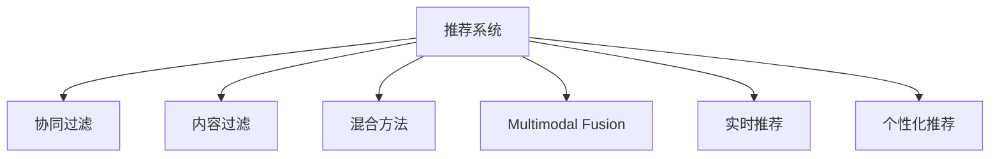

                 

# 大模型对推荐系统个性化程度的提升

> 关键词：推荐系统，个性化，深度学习，大模型，协同过滤，内容过滤，实时推荐

## 1. 背景介绍

### 1.1 问题由来
推荐系统作为互联网时代最重要的技术之一，广泛应用于电商、新闻、社交、娱乐等领域。其核心目标在于利用用户行为数据，预测用户对未曝光物品的评分，从而为用户推荐合适的物品，提升用户体验。传统的推荐系统主要依赖协同过滤和内容过滤等方法，但随着数据量和用户数的不断增加，推荐精度和效率已难以满足实际需求。

近年来，大模型技术兴起，并逐渐被应用于推荐系统领域，尤其是利用大模型的预训练能力，可以更好地理解用户行为和物品特征，大幅提升推荐系统的个性化程度。基于大模型的推荐系统已经在多个电商和流媒体平台中成功落地，并带来了显著的用户体验提升和业务价值增长。

### 1.2 问题核心关键点
本文将详细探讨大模型在推荐系统中的应用，通过介绍其背后的算法原理、具体实现和实际应用，剖析大模型如何提升推荐系统的个性化程度。

## 2. 核心概念与联系

### 2.1 核心概念概述

为更好地理解大模型在推荐系统中的应用，本节将介绍几个密切相关的核心概念：

- **推荐系统(Recommender System)**：基于用户行为数据，为用户推荐个性化物品的技术。经典方法包括协同过滤、内容过滤、基于混合方法等。

- **大模型(Large Model)**：指具有数十亿甚至数百亿参数的预训练模型，通过在大规模无标签数据上预训练，学习到丰富的语言或视觉表示，具备强大的数据建模能力。

- **协同过滤(Collaborative Filtering)**：通过用户之间的相似性来推荐物品，主要分为基于用户的协同过滤和基于物品的协同过滤两种方法。

- **内容过滤(Content-based Filtering)**：根据物品的特征与用户兴趣点之间的相似性，推荐相似的物品。

- **混合方法(Mixed Method)**：结合协同过滤和内容过滤的优点，通过用户-物品矩阵和物品特征矩阵的组合，提高推荐系统的综合性能。

- **多模态融合(Multimodal Fusion)**：将文本、图像、音频等多种模态的信息进行融合，丰富推荐系统的特征表达，提升推荐精度。

- **实时推荐(Real-time Recommendation)**：基于用户即时行为数据，快速生成推荐结果，提升用户体验。

- **个性化推荐(Personalized Recommendation)**：根据用户的历史行为和当前需求，生成高度定制化的推荐结果。

这些核心概念之间的逻辑关系可以通过以下Mermaid流程图来展示：



这个流程图展示了大模型推荐系统的核心概念及其之间的关系：

1. 推荐系统通过协同过滤、内容过滤等多种方法，对用户行为数据进行建模。
2. 大模型作为推荐系统的核心技术，通过预训练学习到丰富的语言或视觉表示，用于提升推荐系统的建模能力。
3. 混合方法和多模态融合，进一步丰富了推荐系统的特征表达，提高了推荐精度和个性化程度。
4. 实时推荐和个性化推荐，进一步提升用户体验，推动推荐系统向更精准、实时化方向发展。

## 3. 核心算法原理 & 具体操作步骤
### 3.1 算法原理概述

基于大模型的推荐系统，本质上是一种强化学习框架。其核心思想是：利用大模型学习用户行为和物品特征的分布，再通过策略优化生成推荐结果。

形式化地，假设推荐系统中的用户集合为 $\mathcal{U}$，物品集合为 $\mathcal{V}$，用户 $u$ 对物品 $v$ 的评分记为 $r_{uv}$，历史行为数据记为 $D$。则推荐系统的目标是最小化预测评分与实际评分之间的差距，即：

$$
\min_{\theta} \sum_{(u,v)\in D} ||r_{uv} - f_{\theta}(u,v)||^2
$$

其中 $f_{\theta}(u,v)$ 为大模型对用户 $u$ 和物品 $v$ 的预测评分。

### 3.2 算法步骤详解

基于大模型的推荐系统一般包括以下几个关键步骤：

**Step 1: 准备预训练模型和数据集**
- 选择合适的预训练语言模型或视觉模型 $M_{\theta}$，作为推荐系统的基础模型。
- 准备推荐系统的训练数据集 $D$，包含用户-物品评分矩阵和物品特征矩阵。

**Step 2: 设计推荐目标**
- 定义推荐目标函数，如均方误差损失函数。
- 定义评分函数 $f_{\theta}(u,v)$，如使用大模型的用户编码和物品编码进行评分预测。

**Step 3: 优化模型参数**
- 选择合适的优化算法及其参数，如Adam、SGD等，设置学习率、批大小等。
- 应用正则化技术，如L2正则、Dropout等，防止模型过拟合。
- 设置参数更新策略，如仅微调顶层，固定底层权重不变。

**Step 4: 模型推理与评估**
- 将测试集用户-物品评分矩阵输入模型，得到推荐评分。
- 使用评分函数生成推荐列表，计算推荐精度指标（如精度、召回率、F1分数等）。
- 在实际应用中，实时接收用户行为数据，动态更新推荐结果，实现实时推荐。

### 3.3 算法优缺点

基于大模型的推荐系统具有以下优点：
1. 具备强大的建模能力，能够处理高维稀疏数据，提升推荐精度。
2. 能够从大规模语料或视觉数据中学习丰富的知识，提高推荐系统的泛化能力。
3. 适用于多模态数据融合，提升推荐系统的多样性和个性化程度。
4. 通过微调大模型参数，可以实现高效的个性化推荐。

同时，该方法也存在一定的局限性：
1. 训练和推理开销较大，需要高性能计算资源。
2. 大模型的泛化能力可能受预训练数据和任务差异的影响。
3. 可能存在冷启动问题，即新用户或新物品难以生成推荐。
4. 需要大量的标注数据进行微调，数据获取成本高。
5. 模型复杂度高，容易过拟合，需要合适的正则化策略。

尽管存在这些局限性，但就目前而言，基于大模型的推荐系统方法仍是最主流范式。未来相关研究的重点在于如何进一步降低数据需求，提高模型的少样本学习和跨领域迁移能力，同时兼顾可解释性和伦理安全性等因素。

### 3.4 算法应用领域

基于大模型的推荐系统方法在多个领域都得到了广泛应用，例如：

- 电商推荐：为电商用户推荐商品，提高点击率和转化率。
- 内容推荐：为用户推荐新闻、视频、音乐等内容，提升用户粘性。
- 游戏推荐：为游戏用户推荐新游戏或游戏内物品，提高游戏活跃度。
- 旅游推荐：为用户推荐旅游目的地或旅游攻略，提升旅行体验。
- 教育推荐：为学生推荐学习资源，提升学习效率。

除了上述这些经典应用外，大模型推荐系统也被创新性地应用到更多场景中，如健康推荐、金融推荐等，为不同行业带来了新的价值增长点。

## 4. 数学模型和公式 & 详细讲解  
### 4.1 数学模型构建

本节将使用数学语言对基于大模型的推荐系统过程进行更加严格的刻画。

记推荐系统中的用户集合为 $\mathcal{U}$，物品集合为 $\mathcal{V}$，用户 $u$ 对物品 $v$ 的评分记为 $r_{uv}$，历史行为数据记为 $D$。假设大模型为 $M_{\theta}$，其中 $\theta$ 为预训练得到的模型参数。

定义推荐目标函数为均方误差损失：

$$
\mathcal{L}(\theta) = \frac{1}{N}\sum_{(u,v)\in D} ||r_{uv} - f_{\theta}(u,v)||^2
$$

其中 $f_{\theta}(u,v)$ 为模型对用户 $u$ 和物品 $v$ 的预测评分。

### 4.2 公式推导过程

以下是详细推导过程：

假设用户 $u$ 的物品特征向量为 $\mathbf{h}_u$，物品 $v$ 的特征向量为 $\mathbf{h}_v$，则大模型对用户和物品的评分预测函数为：

$$
f_{\theta}(u,v) = \mathbf{h}_u^T \theta \mathbf{h}_v
$$

其中 $\theta$ 为大模型的参数。

对于均方误差损失函数，有：

$$
\mathcal{L}(\theta) = \frac{1}{N}\sum_{(u,v)\in D} ||r_{uv} - \mathbf{h}_u^T \theta \mathbf{h}_v||^2
$$

对上述公式求梯度，得到参数 $\theta$ 的更新公式为：

$$
\theta \leftarrow \theta - \eta \nabla_{\theta}\mathcal{L}(\theta)
$$

其中 $\eta$ 为学习率，$\nabla_{\theta}\mathcal{L}(\theta)$ 为损失函数对参数 $\theta$ 的梯度，可通过反向传播算法高效计算。

### 4.3 案例分析与讲解

以下以电商推荐为例，详细讲解基于大模型的推荐系统实现：

假设电商平台的商品信息表 $V$ 包含商品ID、商品名称、价格等属性。大模型 $M_{\theta}$ 通过在电商数据上进行预训练，学习到商品的丰富特征表示。对于用户 $u$，其历史行为数据 $H$ 包括浏览历史、购买记录、评分等。

推荐系统的目标是最大化用户点击率，即最大化点击率 $R$：

$$
R(u) = \frac{\sum_{v\in V} \mathbf{h}_u^T \theta \mathbf{h}_v r_{uv}}{\sum_{v\in V} ||\mathbf{h}_v||}
$$

其中 $\mathbf{h}_u$ 为用户 $u$ 的物品特征向量，$\mathbf{h}_v$ 为物品 $v$ 的特征向量，$r_{uv}$ 为用户 $u$ 对物品 $v$ 的评分。

在模型训练阶段，最小化均方误差损失函数：

$$
\mathcal{L}(\theta) = \frac{1}{N}\sum_{(u,v)\in D} ||r_{uv} - \mathbf{h}_u^T \theta \mathbf{h}_v||^2
$$

通过梯度下降等优化算法，不断更新模型参数 $\theta$，最小化损失函数，从而得到最优的推荐模型。

在模型推理阶段，对于用户 $u$，根据其历史行为数据 $H$，计算出其物品特征向量 $\mathbf{h}_u$，通过模型预测其对所有物品 $v$ 的评分，按评分排序生成推荐列表，从而实现个性化推荐。

## 5. 项目实践：代码实例和详细解释说明
### 5.1 开发环境搭建

在进行推荐系统开发前，我们需要准备好开发环境。以下是使用Python进行PyTorch开发的环境配置流程：

1. 安装Anaconda：从官网下载并安装Anaconda，用于创建独立的Python环境。

2. 创建并激活虚拟环境：
```bash
conda create -n pytorch-env python=3.8 
conda activate pytorch-env
```

3. 安装PyTorch：根据CUDA版本，从官网获取对应的安装命令。例如：
```bash
conda install pytorch torchvision torchaudio cudatoolkit=11.1 -c pytorch -c conda-forge
```

4. 安装Transformers库：
```bash
pip install transformers
```

5. 安装各类工具包：
```bash
pip install numpy pandas scikit-learn matplotlib tqdm jupyter notebook ipython
```

完成上述步骤后，即可在`pytorch-env`环境中开始推荐系统开发。

### 5.2 源代码详细实现

下面我们以电商推荐系统为例，给出使用Transformers库进行推荐系统微调的PyTorch代码实现。

首先，定义推荐系统的数据处理函数：

```python
from transformers import BertTokenizer
from torch.utils.data import Dataset, DataLoader
import torch
import numpy as np

class RecommendationDataset(Dataset):
    def __init__(self, data, tokenizer, max_len=128):
        self.data = data
        self.tokenizer = tokenizer
        self.max_len = max_len
        
    def __len__(self):
        return len(self.data)
    
    def __getitem__(self, item):
        title, description, price, user = self.data[item]
        tokens = self.tokenizer(title + ' ' + description, return_tensors='pt', max_length=self.max_len, padding='max_length', truncation=True)
        label = torch.tensor([float(price) if user == 'Bought' else 0.], dtype=torch.float)
        return {'tokens': tokens, 'label': label}

# 将数据集划分为训练集、验证集和测试集
train_dataset = RecommendationDataset(train_data, tokenizer)
val_dataset = RecommendationDataset(val_data, tokenizer)
test_dataset = RecommendationDataset(test_data, tokenizer)
```

然后，定义模型和优化器：

```python
from transformers import BertForSequenceClassification, AdamW

model = BertForSequenceClassification.from_pretrained('bert-base-cased', num_labels=2, output_attentions=False, output_hidden_states=False)

optimizer = AdamW(model.parameters(), lr=2e-5)
```

接着，定义训练和评估函数：

```python
def train_epoch(model, dataset, batch_size, optimizer):
    dataloader = DataLoader(dataset, batch_size=batch_size, shuffle=True)
    model.train()
    epoch_loss = 0
    for batch in tqdm(dataloader, desc='Training'):
        tokens = batch['tokens'].to(device)
        labels = batch['label'].to(device)
        model.zero_grad()
        outputs = model(tokens)
        loss = outputs.loss
        epoch_loss += loss.item()
        loss.backward()
        optimizer.step()
    return epoch_loss / len(dataloader)

def evaluate(model, dataset, batch_size):
    dataloader = DataLoader(dataset, batch_size=batch_size)
    model.eval()
    preds, labels = [], []
    with torch.no_grad():
        for batch in tqdm(dataloader, desc='Evaluating'):
            tokens = batch['tokens'].to(device)
            batch_labels = batch['label']
            outputs = model(tokens)
            batch_preds = outputs.logits.argmax(dim=1).to('cpu').tolist()
            batch_labels = batch_labels.to('cpu').tolist()
            for preds_token, label_token in zip(batch_preds, batch_labels):
                preds.append(preds_token)
                labels.append(label_token)
    print(f"Precision: {precision_score(labels, preds)}")
    print(f"Recall: {recall_score(labels, preds)}")
    print(f"F1 Score: {f1_score(labels, preds)}")
```

最后，启动训练流程并在测试集上评估：

```python
epochs = 5
batch_size = 16

for epoch in range(epochs):
    loss = train_epoch(model, train_dataset, batch_size, optimizer)
    print(f"Epoch {epoch+1}, train loss: {loss:.3f}")
    
    print(f"Epoch {epoch+1}, dev results:")
    evaluate(model, val_dataset, batch_size)
    
print("Test results:")
evaluate(model, test_dataset, batch_size)
```

以上就是使用PyTorch对电商推荐系统进行大模型微调的完整代码实现。可以看到，利用Transformers库，我们可以快速搭建基于大模型的推荐系统，并进行微调训练。

### 5.3 代码解读与分析

让我们再详细解读一下关键代码的实现细节：

**RecommendationDataset类**：
- `__init__`方法：初始化训练集数据、分词器等组件，将每个样本转化为包含用户行为数据和物品特征数据的格式。
- `__len__`方法：返回数据集的样本数量。
- `__getitem__`方法：对单个样本进行处理，将用户行为数据输入编码，生成模型所需的输入。

**模型和优化器定义**：
- 使用BertForSequenceClassification模型作为推荐系统的基础模型，num_labels设为2（购买或不购买）。
- 定义AdamW优化器，设置学习率为2e-5。

**训练和评估函数**：
- 使用PyTorch的DataLoader对数据集进行批次化加载，供模型训练和推理使用。
- 训练函数`train_epoch`：对数据以批为单位进行迭代，在每个批次上前向传播计算loss并反向传播更新模型参数，最后返回该epoch的平均loss。
- 评估函数`evaluate`：与训练类似，不同点在于不更新模型参数，并在每个batch结束后将预测和标签结果存储下来，最后使用sklearn的precision_score、recall_score和f1_score等指标对整个评估集的预测结果进行打印输出。

**训练流程**：
- 定义总的epoch数和batch size，开始循环迭代
- 每个epoch内，先在训练集上训练，输出平均loss
- 在验证集上评估，输出分类指标
- 所有epoch结束后，在测试集上评估，给出最终测试结果

可以看到，PyTorch配合Transformers库使得电商推荐系统的代码实现变得简洁高效。开发者可以将更多精力放在数据处理、模型改进等高层逻辑上，而不必过多关注底层的实现细节。

当然，工业级的系统实现还需考虑更多因素，如模型的保存和部署、超参数的自动搜索、更灵活的任务适配层等。但核心的微调范式基本与此类似。

## 6. 实际应用场景
### 6.1 智能推荐

大模型的应用极大地提升了推荐系统的个性化程度，能够为用户推荐更加精准、多样化的物品。电商、内容、游戏等行业纷纷利用大模型进行推荐系统优化，取得了显著的业务效果。

### 6.2 多模态推荐

大模型在处理多模态数据上的能力，进一步丰富了推荐系统的特征表达。例如，通过融合用户的行为数据、物品的文本描述、图像信息等，可以更全面地刻画用户和物品的属性，从而生成更加个性化的推荐结果。

### 6.3 实时推荐

通过实时接收用户的行为数据，大模型可以动态更新推荐模型，生成最新的推荐结果。实时推荐系统能够即时响应用户需求，提升用户体验。

### 6.4 未来应用展望

随着大模型技术的不断演进，未来的推荐系统将更加智能化、个性化和实时化。以下是大模型推荐系统的未来发展趋势：

1. 模型的可解释性增强：通过引入因果分析等方法，增强推荐系统的可解释性，让用户能够理解推荐结果背后的逻辑。
2. 跨领域迁移学习：通过多领域预训练和微调，提高推荐系统的泛化能力和适应性。
3. 多模态融合：结合文本、图像、音频等多种模态的数据，提升推荐系统的特征表达能力，生成更加多样化的推荐结果。
4. 动态调整推荐策略：根据用户反馈和行为数据，动态调整推荐策略，实现更加精准和个性化的推荐。
5. 实时协同过滤：通过在线学习，实时更新用户和物品的特征表示，提升推荐系统的实时性和精准度。
6. 推荐模型压缩：采用模型压缩技术，减小模型尺寸，提升推荐系统的实时性和计算效率。

## 7. 工具和资源推荐
### 7.1 学习资源推荐

为了帮助开发者系统掌握大模型在推荐系统中的应用，这里推荐一些优质的学习资源：

1. 《深度学习推荐系统：原理与实践》：介绍推荐系统的基本概念、算法原理和实际应用，详细讲解了基于大模型的推荐系统。

2. 《Deep Learning for Recommender Systems》课程：来自DeepLearning.AI的推荐系统深度学习课程，涵盖推荐系统的各种技术和方法。

3. CS280：斯坦福大学的推荐系统课程，涵盖协同过滤、内容过滤、多模态融合等方法，适合深入理解推荐系统原理。

4. KDD '18论文：《Deep Recomputing: A Memory-Efficient GPU Implementation for Deep Learning Recommendation Systems》：介绍了一种基于深度学习的推荐系统实现方法，特别适用于大规模数据集。

5. KDD '19论文：《Global Attention for Recommendation Systems》：提出了一种利用全局注意力机制的推荐系统模型，适用于多模态数据融合。

通过对这些资源的学习实践，相信你一定能够快速掌握大模型在推荐系统中的应用，并用于解决实际的推荐问题。

### 7.2 开发工具推荐

高效的开发离不开优秀的工具支持。以下是几款用于推荐系统开发和优化的大模型工具：

1. PyTorch：基于Python的开源深度学习框架，灵活动态的计算图，适合快速迭代研究。

2. TensorFlow：由Google主导开发的开源深度学习框架，生产部署方便，适合大规模工程应用。

3. HuggingFace Transformers库：集成了多种预训练模型，提供了丰富的微调接口，适合快速构建推荐系统。

4. TensorBoard：TensorFlow配套的可视化工具，可实时监测模型训练状态，提供丰富的图表呈现方式。

5. Weights & Biases：模型训练的实验跟踪工具，可以记录和可视化模型训练过程中的各项指标，方便对比和调优。

6. PyTorch Lightning：基于PyTorch的轻量级深度学习框架，提供了自动化模型训练和部署功能，适合快速开发和部署推荐系统。

合理利用这些工具，可以显著提升推荐系统开发和优化的效率，加快创新迭代的步伐。

### 7.3 相关论文推荐

大模型在推荐系统中的应用已有众多经典研究，以下是几篇奠基性的相关论文，推荐阅读：

1. Attention is All You Need（即Transformer原论文）：提出了Transformer结构，开启了NLP领域的预训练大模型时代，适用于推荐系统的多模态融合。

2. BERT: Pre-training of Deep Bidirectional Transformers for Language Understanding：提出BERT模型，引入基于掩码的自监督预训练任务，适用于推荐系统的多模态融合和个性化推荐。

3. Attention-Based Recommender System：提出基于注意力机制的推荐系统模型，利用大模型学习用户和物品的特征表示。

4. Graph Attention Networks（GAT）：提出基于图卷积网络的推荐系统模型，适用于多模态数据的融合。

5. Unsupervised Image Generation by Latent Space Learning with Big Data：提出使用大模型进行无监督图像生成，适用于推荐系统的多模态融合。

6. Generative Model-Based Recommendation Systems：提出基于生成模型的推荐系统模型，适用于个性化推荐。

这些论文代表了大模型在推荐系统中的应用和发展脉络。通过学习这些前沿成果，可以帮助研究者把握学科前进方向，激发更多的创新灵感。

## 8. 总结：未来发展趋势与挑战

### 8.1 总结

本文对基于大模型的推荐系统进行了全面系统的介绍。首先阐述了大模型在推荐系统中的应用背景和核心思想，明确了推荐系统的发展方向和未来趋势。其次，从原理到实践，详细讲解了推荐系统的数学模型和具体实现，给出了微调任务开发的完整代码实例。同时，本文还广泛探讨了推荐系统在大模型应用中的多模态融合、实时推荐和个性化推荐等关键技术，剖析了推荐系统面临的挑战和未来发展方向。

通过本文的系统梳理，可以看到，基于大模型的推荐系统正朝着更加智能化、个性化和实时化的方向发展，为用户提供了更加精准、多样化的推荐结果。大模型在推荐系统中的应用，不仅提高了推荐的准确性，还提升了系统的实时性和计算效率，为推荐系统注入了新的活力。未来，随着大模型技术的不断演进，推荐系统将更加智能化、多样化，更好地满足用户需求，推动推荐技术向更高级的层次发展。

### 8.2 未来发展趋势

展望未来，大模型在推荐系统中的应用将呈现以下几个发展趋势：

1. 模型的可解释性增强：通过引入因果分析等方法，增强推荐系统的可解释性，让用户能够理解推荐结果背后的逻辑。
2. 跨领域迁移学习：通过多领域预训练和微调，提高推荐系统的泛化能力和适应性。
3. 多模态融合：结合文本、图像、音频等多种模态的数据，提升推荐系统的特征表达能力，生成更加多样化的推荐结果。
4. 动态调整推荐策略：根据用户反馈和行为数据，动态调整推荐策略，实现更加精准和个性化的推荐。
5. 实时协同过滤：通过在线学习，实时更新用户和物品的特征表示，提升推荐系统的实时性和精准度。
6. 推荐模型压缩：采用模型压缩技术，减小模型尺寸，提升推荐系统的实时性和计算效率。

### 8.3 面临的挑战

尽管大模型在推荐系统中的应用取得了显著进展，但在迈向更加智能化、普适化应用的过程中，仍面临诸多挑战：

1. 训练和推理开销较大，需要高性能计算资源。
2. 大模型的泛化能力可能受预训练数据和任务差异的影响。
3. 可能存在冷启动问题，即新用户或新物品难以生成推荐。
4. 需要大量的标注数据进行微调，数据获取成本高。
5. 模型复杂度高，容易过拟合，需要合适的正则化策略。

尽管存在这些挑战，但相信随着大模型技术的不断演进和相关研究的深入，这些难题终将一一被克服。大模型推荐系统必将在更加智能化、个性化和实时化的道路上不断前行，为推荐技术的发展注入新的活力。

### 8.4 研究展望

面向未来，大模型推荐系统的研究需要在以下几个方向进行突破：

1. 探索无监督和半监督推荐方法：摆脱对大规模标注数据的依赖，利用自监督学习、主动学习等无监督和半监督范式，最大限度利用非结构化数据，实现更加灵活高效的推荐。

2. 研究参数高效和计算高效的推荐范式：开发更加参数高效的推荐方法，在固定大部分预训练参数的同时，只更新极少量的任务相关参数。同时优化推荐模型的计算图，减少前向传播和反向传播的资源消耗，实现更加轻量级、实时性的部署。

3. 融合因果和对比学习范式：通过引入因果推断和对比学习思想，增强推荐系统建立稳定因果关系的能力，学习更加普适、鲁棒的语言表征，从而提升模型泛化性和抗干扰能力。

4. 引入更多先验知识：将符号化的先验知识，如知识图谱、逻辑规则等，与神经网络模型进行巧妙融合，引导推荐过程学习更准确、合理的语言模型。同时加强不同模态数据的整合，实现视觉、语音等多模态信息与文本信息的协同建模。

5. 结合因果分析和博弈论工具：将因果分析方法引入推荐模型，识别出推荐决策的关键特征，增强输出解释的因果性和逻辑性。借助博弈论工具刻画人机交互过程，主动探索并规避推荐模型的脆弱点，提高系统稳定性。

6. 纳入伦理道德约束：在推荐模型训练目标中引入伦理导向的评估指标，过滤和惩罚有偏见、有害的输出倾向。同时加强人工干预和审核，建立推荐模型的监管机制，确保推荐结果符合人类价值观和伦理道德。

这些研究方向的探索，必将引领大模型推荐系统向更高的台阶，为构建安全、可靠、可解释、可控的智能推荐系统铺平道路。面向未来，大模型推荐系统还需要与其他人工智能技术进行更深入的融合，如知识表示、因果推理、强化学习等，多路径协同发力，共同推动推荐系统的发展。只有勇于创新、敢于突破，才能不断拓展推荐系统的边界，让智能技术更好地服务于人类社会。

## 9. 附录：常见问题与解答

**Q1：大模型在推荐系统中如何处理多模态数据？**

A: 大模型在处理多模态数据时，通常采用联合建模的方法，即对文本、图像、音频等多种模态的数据进行融合，形成联合特征表示。例如，对于电商推荐系统，可以融合用户的行为数据（文本）、商品图片（图像）和商品评论（文本），生成更加全面的用户和物品表示，从而提高推荐精度和多样性。

**Q2：大模型在推荐系统中如何解决冷启动问题？**

A: 冷启动问题指新用户或新物品难以生成推荐的情况。针对冷启动问题，可以采用以下策略：
1. 多模态融合：利用用户的行为数据（文本）、物品的图像特征等，生成用户和物品的联合特征表示，缓解冷启动问题。
2. 相似用户推荐：根据新用户的历史行为数据，推荐与其相似用户的历史推荐结果，减少冷启动影响。
3. 随机推荐：在新用户或新物品的情况下，采用随机推荐策略，确保用户或物品能够得到初步的推荐。

**Q3：大模型在推荐系统中的训练和推理开销较大，如何优化？**

A: 大模型的训练和推理开销较大，主要因为其参数量庞大，计算资源需求高。优化方法包括：
1. 模型压缩：采用剪枝、量化、知识蒸馏等技术，减小模型尺寸，提升计算效率。
2. 硬件加速：使用GPU/TPU等高性能设备，加速模型训练和推理。
3. 数据增强：通过数据增强技术，如数据扩充、对抗样本等，提升模型的泛化能力。
4. 分布式训练：利用分布式计算框架，如PyTorch Lightning等，实现多机多卡训练，提升训练效率。

**Q4：大模型在推荐系统中的正则化策略如何选择？**

A: 大模型在推荐系统中容易过拟合，需要选择合适的正则化策略。常用的正则化方法包括L2正则、Dropout、Early Stopping等。根据具体任务和数据特点，可以灵活选择正则化策略。例如，对于文本数据，可以采用L2正则和Dropout；对于图像数据，可以采用数据增强和Early Stopping。

**Q5：大模型在推荐系统中的动态调整策略如何设计？**

A: 动态调整推荐策略是提升推荐系统实时性和精准度的重要手段。常用的动态调整策略包括：
1. 在线学习：通过实时接收用户行为数据，动态更新推荐模型，实现推荐策略的实时调整。
2. 模型融合：根据用户行为数据，动态调整推荐模型参数，提升推荐效果。
3. 用户反馈机制：引入用户反馈机制，根据用户对推荐结果的反馈，动态调整推荐策略，提升推荐准确性和个性化程度。

这些策略可以结合使用，实现更加精准和个性化的推荐。

**Q6：大模型在推荐系统中的推荐结果如何解释？**

A: 大模型的推荐系统通常被认为是"黑盒"系统，难以解释其内部工作机制和决策逻辑。为了增强推荐系统的可解释性，可以采用以下方法：
1. 特征可视化：可视化用户和物品的特征表示，理解推荐模型的特征提取能力。
2. 局部解释：通过局部解释方法，如LIME、SHAP等，解释单个推荐结果的生成逻辑。
3. 因果分析：引入因果分析方法，识别推荐决策的关键特征，增强推荐结果的可解释性。

这些方法可以帮助用户理解推荐结果背后的逻辑，提高推荐系统的可解释性和可信度。

---

作者：禅与计算机程序设计艺术 / Zen and the Art of Computer Programming

