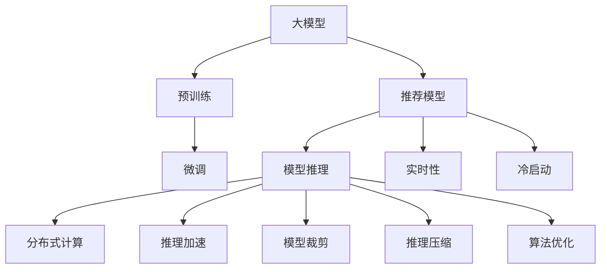

                 

# 大模型对推荐系统实时性的影响

在数字时代，个性化推荐系统成为各大平台不可或缺的核心功能之一。它们通过深入分析用户行为和偏好，为用户量身定制内容推荐，极大地提升了用户体验和平台黏性。然而，随着推荐系统规模的扩大和复杂度的提升，如何确保其在实时性方面的表现，成为了一个重要的挑战。

本博文将深入探讨大模型在推荐系统中的应用，重点分析大模型对推荐系统实时性可能产生的影响，并讨论如何优化其性能以实现实时推荐。

## 1. 背景介绍

### 1.1 推荐系统的发展历程

推荐系统（Recommender System）起源于商品推荐，旨在通过分析用户行为，推荐最符合其兴趣的商品或服务。随着互联网的发展，推荐系统在新闻、音乐、视频、社交等多个领域得到广泛应用。

1980年代，协同过滤（Collaborative Filtering）成为推荐系统的主流技术。协同过滤依赖用户的历史行为数据，通过分析相似用户的行为来推荐相关物品。然而，协同过滤在处理冷启动（Cold Start）问题、大规模数据处理等方面存在局限性。

2006年，伯克利大学发表了著名的《Netflix Prize》论文，推动了推荐系统研究的进步。该论文首次将机器学习模型引入推荐系统中，提出基于内容的推荐、基于协同过滤的推荐等方法，并引入了模型评估指标，如精度、召回率、F1-score等。

随后，深度学习技术进一步推动了推荐系统的演进。2014年，Google推出了神经协同过滤（Neural Collaborative Filtering, NCF）模型，使用深度神经网络提升协同过滤的效果。2016年，雅虎推出了DeepFM模型，首次引入交叉特征表示，大幅提升了推荐系统的性能。

### 1.2 大模型的兴起

2013年，Google发布了预训练语言模型BERT，大幅提升了自然语言处理（NLP）模型的性能。BERT通过在大规模无标签文本数据上进行预训练，学习到强大的语言表征能力。2018年，OpenAI发布了GPT-2模型，开创了基于自回归的预训练大模型。

大模型的兴起推动了推荐系统的发展，使得推荐系统不再依赖于单一特征或单一算法，而是可以通过大模型学习用户隐式行为和语义信息，提供更为个性化和精准的推荐。

## 2. 核心概念与联系

### 2.1 核心概念概述

在分析大模型对推荐系统实时性的影响前，我们先介绍一些关键概念：

- **大模型**：指的是参数量巨大、结构复杂的深度学习模型。例如BERT、GPT等预训练语言模型，或者DeepFM、NeuralFM等深度推荐模型。

- **实时性**：指推荐系统能够根据用户的实时行为或环境变化，即时提供推荐的性能指标。实时性是推荐系统用户体验的关键，直接影响用户的满意度和留存率。

- **冷启动问题**：指新用户或新物品加入系统时，由于缺乏历史数据，推荐系统无法为其提供推荐的困境。

- **模型推理**：指将训练好的模型应用于新数据，进行预测推断的过程。

- **分布式计算**：指通过多台计算机协同工作，提升模型推理速度和计算能力。

### 2.2 核心概念关系图

以下是一个Mermaid流程图，展示了推荐系统中大模型的关键概念及其相互关系：



该图表示了大模型在推荐系统中的基本流程：

1. **预训练**：大模型通过在大量无标签数据上进行训练，学习到通用的语言或物品表示。
2. **微调**：根据推荐任务的具体需求，在大模型基础上进行微调，适配推荐任务。
3. **模型推理**：将微调后的模型应用于实时数据，进行推荐预测。
4. **实时性**：模型推理需要快速响应用户请求，保证实时性。
5. **冷启动问题**：对于新用户或物品，需要特殊处理以保证推荐效果。
6. **分布式计算**：通过多台计算机协同工作，加速模型推理过程。
7. **推理加速**：通过模型裁剪、压缩、算法优化等手段，提升模型推理速度。

接下来，我们将详细分析大模型对推荐系统实时性的影响，并讨论优化方法。

## 3. 核心算法原理 & 具体操作步骤

### 3.1 算法原理概述

在大模型推荐系统中，通过预训练和微调学习到强大的用户表示和物品表示。在模型推理阶段，将用户和物品的表示输入模型，得到推荐结果。然而，大模型的推理过程往往计算密集、内存占用大，影响推荐系统的实时性。

### 3.2 算法步骤详解

以下是推荐系统中大模型推理的具体步骤：

1. **输入准备**：将用户和物品的特征向量（如ID、评分、词向量等）转换为模型可处理的格式。
   
2. **模型输入**：将转换后的特征向量输入到微调后的推荐模型中。
   
3. **模型推理**：通过前向传播计算模型输出，即推荐结果的评分或概率分布。
   
4. **结果排序**：根据评分或概率分布，对推荐结果进行排序，生成推荐列表。
   
5. **结果返回**：将推荐列表返回给前端，供用户查看和选择。

### 3.3 算法优缺点

大模型推荐系统具有以下优点：

- **高精度**：大模型学习到了丰富的用户和物品表示，能够提供精准的推荐结果。
- **可解释性**：通过预训练和微调，模型学习到了可解释的特征表示，有助于理解推荐过程。
- **鲁棒性**：大模型对噪声和异常数据的鲁棒性较强，能够适应不同的推荐场景。

但同时也存在以下缺点：

- **计算复杂度高**：大模型的计算复杂度高，推理速度较慢，难以满足实时性的要求。
- **内存占用大**：大模型的参数量大，内存占用高，可能导致系统负载过重。
- **部署难度大**：大模型需要高性能的计算资源和硬件支持，部署难度较大。

### 3.4 算法应用领域

大模型推荐系统在电子商务、媒体内容推荐、社交网络等多个领域得到了广泛应用，提升了用户体验和平台收益。例如：

- **电商平台**：通过大模型推荐商品，提高用户转化率和复购率。
- **媒体内容**：推荐新闻、视频、文章等内容，提高用户的参与度和留存率。
- **社交网络**：推荐朋友、群组、话题等，增强用户粘性和互动。

## 4. 数学模型和公式 & 详细讲解

### 4.1 数学模型构建

假设推荐系统采用深度神经网络模型，输入为用户的特征向量 $x$ 和物品的特征向量 $y$，输出为推荐评分 $z$。推荐模型的数学模型为：

$$
z = f_\theta(x,y)
$$

其中 $f_\theta$ 是模型函数，$\theta$ 是模型参数。

### 4.2 公式推导过程

以深度神经网络模型为例，假设模型包含 $h$ 个隐藏层，每个隐藏层 $l$ 的神经元数量为 $d_l$，输出层神经元数量为 $d$，模型的参数数量为 $\theta$。

模型的前向传播过程为：

$$
z_0 = x, \quad z_l = W_l \cdot z_{l-1} + b_l, \quad l=1,2,\dots,h
$$

其中 $W_l$ 和 $b_l$ 是隐藏层 $l$ 的权重和偏置。

输出层为：

$$
z_h = W_h \cdot z_{h-1} + b_h
$$

其中 $W_h$ 和 $b_h$ 是输出层的权重和偏置。

推荐评分 $z$ 通过 Softmax 函数计算：

$$
z = \sigma(z_h)
$$

其中 $\sigma$ 是 Softmax 函数。

### 4.3 案例分析与讲解

以协同过滤和基于内容的推荐为例，分析大模型在推荐系统中的应用。

- **协同过滤**：协同过滤通过用户和物品的评分数据训练模型，预测用户对未评分物品的评分。大模型可以通过预训练和微调，学习到更为精确的用户和物品表示，提升协同过滤的效果。

- **基于内容的推荐**：基于内容的推荐通过物品的特征（如标签、描述等）和用户的特征（如历史评分、浏览行为等）进行推荐。大模型可以学习到更丰富的语义信息，提升推荐的精度和多样性。

## 5. 项目实践：代码实例和详细解释说明

### 5.1 开发环境搭建

大模型推荐系统开发需要高性能计算资源和软件工具。以下是推荐的开发环境：

1. **硬件**：高性能的GPU或TPU。
2. **软件**：TensorFlow、PyTorch、TF-Slim、Keras等深度学习框架。
3. **环境配置**：搭建虚拟环境，安装依赖库和工具。

以下是一个简单的TensorFlow环境搭建示例：

```bash
# 创建虚拟环境
conda create -n tf_env python=3.7

# 激活虚拟环境
conda activate tf_env

# 安装TensorFlow
pip install tensorflow
```

### 5.2 源代码详细实现

以下是一个基于TensorFlow的深度神经网络模型的代码实现：

```python
import tensorflow as tf
from tensorflow.keras.layers import Input, Dense, Embedding, Flatten

# 定义输入层
user_input = Input(shape=(64,))
item_input = Input(shape=(64,))

# 定义隐藏层
hidden_layers = [
    Dense(128, activation='relu'),
    Dense(64, activation='relu')
]

# 定义输出层
output_layer = Dense(1, activation='sigmoid')

# 定义模型
model = tf.keras.Sequential([
    Embedding(input_dim=1000, output_dim=128, mask_zero=True),
    Flatten(),
    hidden_layers,
    output_layer
])

# 编译模型
model.compile(optimizer='adam', loss='binary_crossentropy', metrics=['accuracy'])

# 训练模型
model.fit(x_train, y_train, batch_size=32, epochs=10)

# 使用模型进行推荐
y_pred = model.predict([user_input, item_input])
```

### 5.3 代码解读与分析

1. **输入层**：定义用户和物品的特征输入。
2. **隐藏层**：定义多个全连接层，每层使用ReLU激活函数。
3. **输出层**：定义一个神经元，使用Sigmoid激活函数，输出二元评分。
4. **模型编译**：指定优化器、损失函数和评估指标。
5. **模型训练**：使用训练集数据训练模型。
6. **模型预测**：使用模型进行推荐预测。

### 5.4 运行结果展示

在训练完成后，可以使用以下代码进行模型预测：

```python
# 预测评分
user_input = ... # 用户特征向量
item_input = ... # 物品特征向量
y_pred = model.predict([user_input, item_input])
```

预测结果将是一个二元评分，表示用户对物品的兴趣程度。

## 6. 实际应用场景

### 6.1 电商平台推荐

电商平台可以通过大模型推荐系统，向用户推荐商品。用户的历史浏览、评分、购买行为等数据，可以作为模型的输入特征。

例如，用户浏览了鞋类、服装等商品，系统可以通过大模型预测用户对这些商品的评分，并推荐相关商品。

### 6.2 媒体内容推荐

媒体平台可以通过大模型推荐系统，向用户推荐新闻、视频、文章等内容。用户的点击、点赞、评论等行为数据，可以作为模型的输入特征。

例如，用户对某类视频内容产生了互动，系统可以通过大模型预测用户对类似内容的兴趣，并推荐相关视频。

### 6.3 社交网络推荐

社交平台可以通过大模型推荐系统，向用户推荐朋友、群组、话题等。用户的互动、好友关系、关注等数据，可以作为模型的输入特征。

例如，用户关注了某个话题，系统可以通过大模型预测用户对相关话题的兴趣，并推荐相关话题。

## 7. 工具和资源推荐

### 7.1 学习资源推荐

以下是一些推荐的深度学习资源，帮助理解大模型在推荐系统中的应用：

1. **《深度学习》（Ian Goodfellow等）**：经典深度学习教材，介绍了深度神经网络的基本原理和应用。
2. **《TensorFlow官方文档》**：TensorFlow官方文档，提供了深度学习框架的使用教程和示例。
3. **《深度学习与推荐系统》（Wenqi Cui等）**：介绍了深度学习在推荐系统中的应用，包括协同过滤、基于内容的推荐等。
4. **《Python深度学习》（Francois Chollet）**：介绍使用Keras进行深度学习开发的最佳实践。
5. **《推荐系统实战》（Bruce Mason等）**：介绍了推荐系统的实现和优化，包括协同过滤、基于内容的推荐等。

### 7.2 开发工具推荐

以下是一些推荐的开发工具，帮助加速大模型推荐系统的开发：

1. **TensorFlow**：深度学习框架，支持分布式计算和多GPU训练。
2. **PyTorch**：深度学习框架，支持动态图和自动微分。
3. **TF-Slim**：TensorFlow的简化版，提供了高级API和优化工具。
4. **Keras**：高层次API，支持快速搭建和训练深度神经网络。
5. **Jupyter Notebook**：交互式开发环境，支持代码块和数学公式的展示。

### 7.3 相关论文推荐

以下是几篇关于大模型在推荐系统中应用的重要论文：

1. **DeepFM: A Neural Network Approach for Recommender Systems**：提出了DeepFM模型，使用深度神经网络提升推荐系统的效果。
2. **AdaLogit: Adaptive Logit Layer for Logistic Regression-based Recommendation**：提出了AdaLogit模型，使用可调整的logit层提升推荐精度。
3. **Neural Collaborative Filtering with Sequential Information for Recommendation**：提出了NCF模型，使用神经网络进行协同过滤。
4. **LSTM-Net: An LSTM-based Model for User Intent Prediction and Recommendation**：提出了LSTM-Net模型，使用LSTM网络提升推荐系统的效果。
5. **BERT: Pre-training of Deep Bidirectional Transformers for Language Understanding**：提出了BERT模型，使用预训练语言模型提升推荐系统的效果。

## 8. 总结：未来发展趋势与挑战

### 8.1 研究成果总结

本文详细探讨了大模型在推荐系统中的应用，分析了其对实时性的影响，并讨论了优化方法。大模型推荐系统通过学习用户和物品的语义表示，提升了推荐系统的精度和可解释性。然而，计算复杂度高、内存占用大等问题，影响了系统的实时性和可部署性。

### 8.2 未来发展趋势

未来，大模型推荐系统将呈现以下发展趋势：

1. **分布式计算**：通过多台计算机协同工作，提升模型的推理速度和计算能力。
2. **推理加速**：通过模型裁剪、压缩、算法优化等手段，提升模型推理速度。
3. **在线学习**：通过在线学习技术，保持模型的最新状态，提高推荐精度。
4. **自适应推荐**：根据用户的实时行为和环境变化，动态调整推荐策略。
5. **混合推荐**：结合协同过滤和基于内容的推荐，提升推荐系统的鲁棒性和多样性。

### 8.3 面临的挑战

尽管大模型推荐系统在推荐精度和可解释性方面取得了巨大进展，但仍面临以下挑战：

1. **计算资源**：大模型的计算复杂度高，需要高性能的计算资源和硬件支持。
2. **部署难度**：大模型需要大量内存和存储空间，部署难度较大。
3. **实时性**：大模型的推理速度较慢，难以满足实时性的要求。
4. **数据稀疏**：新用户或物品的特征数据较少，导致推荐效果不佳。
5. **冷启动问题**：新用户或物品的推荐效果较差，难以快速获得推荐。

### 8.4 研究展望

未来，大模型推荐系统需要在以下几个方面进行深入研究：

1. **优化分布式计算**：通过高效的分布式算法和架构，提升推荐系统的实时性和可扩展性。
2. **加速推理过程**：通过模型压缩、量化等技术，优化模型推理过程，提升计算效率。
3. **引入在线学习**：通过在线学习技术，保持模型的最新状态，提升推荐精度。
4. **改进推荐策略**：结合多模态信息，使用更先进的推荐算法，提升推荐系统的鲁棒性和多样性。
5. **增强模型可解释性**：通过可解释性技术，提升模型的可信度和透明性。

## 9. 附录：常见问题与解答

### Q1：大模型推荐系统如何提高实时性？

A: 提高实时性的方法包括：

1. **分布式计算**：通过多台计算机协同工作，提升模型的推理速度和计算能力。
2. **推理加速**：通过模型裁剪、压缩、算法优化等手段，提升模型推理速度。
3. **在线学习**：通过在线学习技术，保持模型的最新状态，提高推荐精度。

### Q2：大模型推荐系统面临哪些挑战？

A: 大模型推荐系统面临以下挑战：

1. **计算资源**：大模型的计算复杂度高，需要高性能的计算资源和硬件支持。
2. **部署难度**：大模型需要大量内存和存储空间，部署难度较大。
3. **实时性**：大模型的推理速度较慢，难以满足实时性的要求。
4. **数据稀疏**：新用户或物品的特征数据较少，导致推荐效果不佳。
5. **冷启动问题**：新用户或物品的推荐效果较差，难以快速获得推荐。

### Q3：如何选择合适的大模型推荐系统？

A: 选择合适的大模型推荐系统需要考虑以下几个因素：

1. **应用场景**：根据具体应用场景选择合适的推荐算法。
2. **数据规模**：根据数据规模选择合适的模型规模。
3. **计算资源**：根据计算资源选择合适的框架和硬件。
4. **实时性需求**：根据实时性需求选择合适的优化策略。
5. **精度要求**：根据精度要求选择合适的模型和算法。

### Q4：大模型推荐系统如何提升推荐精度？

A: 提升推荐精度的方法包括：

1. **特征工程**：通过改进特征提取方法，提升推荐精度。
2. **模型优化**：通过优化模型结构和算法，提升推荐精度。
3. **数据预处理**：通过数据清洗和特征选择，提升推荐精度。
4. **在线学习**：通过在线学习技术，保持模型的最新状态，提高推荐精度。

### Q5：如何优化大模型推荐系统的内存使用？

A: 优化大模型推荐系统的内存使用方法包括：

1. **模型裁剪**：去除不必要的层和参数，减小模型尺寸。
2. **模型压缩**：通过量化、剪枝等技术，压缩模型参数。
3. **分布式存储**：使用分布式存储系统，分散存储模型参数和中间结果。
4. **延迟加载**：通过延迟加载技术，动态加载模型参数，减小内存占用。

---

作者：禅与计算机程序设计艺术 / Zen and the Art of Computer Programming

