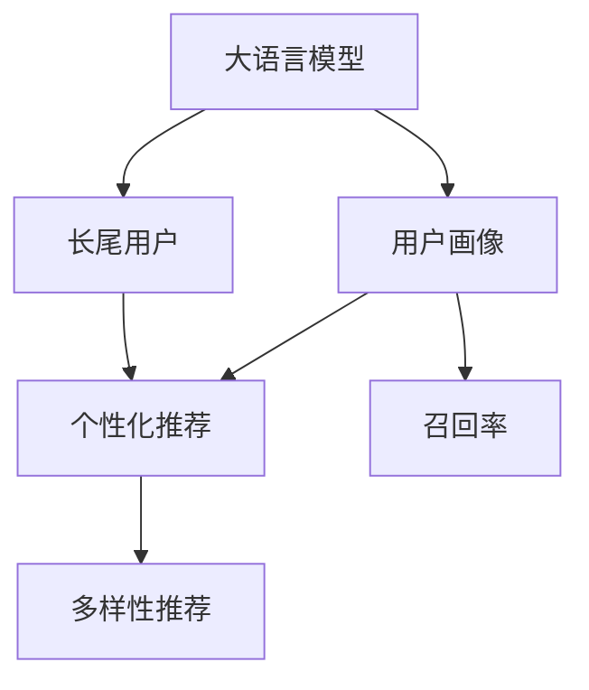

                 

## 1. 背景介绍

### 1.1 问题由来

在互联网时代，推荐系统成为了各大平台的核心竞争力之一。通过推荐系统，用户可以快速发现感兴趣的内容，提升用户体验和满意度。然而，传统推荐系统往往以头部热门内容为主，难以满足长尾用户的个性化需求。长尾用户指的是那些对小众、冷门内容感兴趣的用户群体，他们的需求往往未被充分挖掘和利用。

为了解决这一问题，大语言模型在推荐系统中的应用逐渐受到重视。大语言模型通过大规模预训练，掌握了丰富的语言知识，具备强大的文本理解和生成能力，可以用于构建更加个性化、多元化的推荐系统，提升对长尾用户的覆盖和服务。

### 1.2 问题核心关键点

当前推荐系统主要面临以下问题：

1. **热门内容主导**：推荐系统往往以热门内容为主，长尾用户的需求容易被忽视。
2. **用户画像不准确**：用户的兴趣偏好难以准确捕捉，导致推荐内容与用户实际需求不匹配。
3. **召回率低**：对于长尾用户，由于数据量不足，推荐系统难以找到相关信息，召回率较低。
4. **推荐同质化**：推荐内容往往趋同，难以打破固有模式，引入新鲜和多样化的信息。

针对这些问题，大语言模型可以通过以下方式改进推荐系统：

1. **丰富用户画像**：通过分析用户文本，如评论、行为记录、社交网络信息等，构建更加详细、动态的用户画像。
2. **扩充推荐集合**：利用大语言模型对长尾内容的理解能力，拓展推荐内容范围，丰富用户选择。
3. **提升个性化匹配**：通过大语言模型的语义理解能力，提高推荐内容与用户需求的一致性。
4. **多样化推荐**：利用大语言模型的生成能力，引入更多元化的推荐信息，打破推荐同质化。

### 1.3 问题研究意义

通过大语言模型改进推荐系统，对于提升用户体验、拓展用户群体、增强平台竞争力具有重要意义：

1. **提升用户体验**：通过精准匹配和多样化的推荐内容，满足用户个性化需求，提升用户满意度。
2. **拓展用户群体**：利用大语言模型的长尾内容理解能力，发掘更多潜在用户，扩大用户基数。
3. **增强平台竞争力**：通过个性化推荐和丰富内容供给，提升平台粘性和用户留存率，增强市场竞争力。
4. **探索新商业机会**：发现和引入长尾内容，探索新的商业模式和盈利点。

## 2. 核心概念与联系

### 2.1 核心概念概述

为更好地理解大语言模型在推荐系统中的应用，本节将介绍几个关键概念及其联系：

- **大语言模型**：指通过大规模预训练学习通用语言表示的模型，如BERT、GPT等。这些模型能够处理各种自然语言文本，并具备强大的语义理解能力。

- **推荐系统**：指根据用户行为和偏好，推荐相关内容的技术系统。包括协同过滤、基于内容的推荐、混合推荐等多种算法。

- **长尾用户**：指对冷门、小众内容感兴趣的用户，他们的需求往往未被充分挖掘和利用。

- **用户画像**：指通过用户行为、兴趣、社交网络信息等，构建用户详细画像的技术。

- **召回率**：指推荐系统中，被推荐的相关内容占全部相关内容的比率。

- **个性化推荐**：根据用户特定需求，推荐个性化内容的技术。

- **多样性推荐**：在推荐系统中，引入多元化、新鲜的内容，打破同质化推荐。

这些概念之间的逻辑关系可以通过以下Mermaid流程图来展示：



该流程图展示了从大语言模型到个性化推荐的过程，其中大语言模型通过用户画像了解长尾用户需求，个性化推荐根据用户画像和长尾用户需求生成推荐内容，多样性推荐在个性化推荐的基础上引入多元化信息，最终通过召回率保证推荐系统的效率。

## 3. 核心算法原理 & 具体操作步骤
### 3.1 算法原理概述

大语言模型在推荐系统中的应用，本质上是一个从文本数据中提取用户兴趣偏好，并生成个性化推荐内容的过程。其核心思想是：将大语言模型视作一个强大的"特征提取器"，通过分析用户评论、行为记录等文本数据，构建用户画像，并在此基础上生成推荐内容。

具体流程如下：

1. **数据收集**：收集用户评论、行为记录等文本数据，用于构建用户画像。
2. **用户画像构建**：利用大语言模型分析文本数据，构建用户详细画像，包括兴趣偏好、行为模式、社交关系等。
3. **推荐内容生成**：根据用户画像，利用大语言模型生成个性化推荐内容，包括商品、文章、视频等。
4. **推荐结果排序**：根据用户画像和推荐内容的相关性，对推荐结果进行排序，选择最符合用户需求的推荐内容。

### 3.2 算法步骤详解

基于大语言模型改进推荐系统的具体步骤包括：

**Step 1: 数据收集和预处理**
- 收集用户评论、行为记录等文本数据，清洗处理后存入数据库。
- 利用BERT、GPT等预训练模型，对文本数据进行编码，生成嵌入向量。

**Step 2: 用户画像构建**
- 设计合适的特征提取方式，如TF-IDF、LDA等，从用户评论中提取关键词和主题。
- 利用大语言模型分析用户行为模式，构建用户画像，包括兴趣偏好、行为习惯等。

**Step 3: 推荐内容生成**
- 根据用户画像，设计合适的推荐模板，利用大语言模型生成个性化推荐内容。
- 引入多样性推荐策略，通过调整模型参数，引入更多元化的推荐信息。

**Step 4: 推荐结果排序**
- 设计合适的排序算法，如基于模型的排序、基于用户行为排序等，对推荐结果进行排序。
- 设置合理的召回率和点击率等评估指标，对推荐系统性能进行评估和优化。

**Step 5: 模型评估与优化**
- 在验证集上评估推荐系统的性能，包括召回率、精度、多样性等指标。
- 根据评估结果，调整模型参数和超参数，优化推荐系统性能。

### 3.3 算法优缺点

利用大语言模型改进推荐系统的方法具有以下优点：

1. **提升个性化推荐能力**：大语言模型能够深入理解用户文本数据，构建详细的用户画像，生成更加个性化的推荐内容。
2. **丰富推荐内容**：利用大语言模型的生成能力，引入更多元化的推荐信息，打破推荐同质化。
3. **提升用户满意度**：通过精准匹配和多样化的推荐内容，满足用户个性化需求，提升用户满意度。

同时，该方法也存在一定的局限性：

1. **数据依赖性强**：推荐系统的性能高度依赖于文本数据的质量和数量，收集和清洗数据成本较高。
2. **模型复杂度高**：大语言模型的复杂度较高，推理速度较慢，需要优化资源使用。
3. **模型鲁棒性不足**：大语言模型对输入文本的质量和格式要求较高，容易受到噪声和异常数据的影响。
4. **可解释性差**：推荐系统基于黑盒模型，难以解释推荐内容的生成逻辑。

尽管存在这些局限性，但就目前而言，利用大语言模型改进推荐系统的方法仍是大规模推荐系统的有力补充。未来相关研究的重点在于如何进一步降低对数据的要求，提高模型的鲁棒性和可解释性，同时兼顾性能和效率。

### 3.4 算法应用领域

基于大语言模型改进推荐系统的方法，已经在电商、社交媒体、新闻推荐等多个领域得到了应用，具体包括：

- **电商推荐系统**：通过分析用户评论、行为记录，生成个性化商品推荐，提升用户购买意愿。
- **社交媒体推荐系统**：利用用户评论、互动数据，生成个性化内容推荐，增强用户粘性。
- **新闻推荐系统**：根据用户阅读历史，生成个性化新闻推荐，提升阅读体验。

除了这些常见应用外，大语言模型在推荐系统中的应用还在不断拓展，如个性化广告、游戏推荐等，为推荐系统带来新的突破和创新。

## 4. 数学模型和公式 & 详细讲解
### 4.1 数学模型构建

为更好地理解大语言模型在推荐系统中的应用，本节将介绍几个关键数学模型及其构建方法。

记用户评论文本为 $X=\{x_i\}_{i=1}^N$，其中 $x_i$ 为单个评论文本。假设每个评论文本长度固定，用 $d$ 表示。大语言模型将文本 $x_i$ 编码为向量 $x_i \in \mathbb{R}^d$。用户画像 $Y$ 包括用户兴趣偏好、行为模式等信息，用 $Y=\{y_i\}_{i=1}^N$ 表示，其中 $y_i \in \{0,1\}^k$，$k$ 为兴趣类别数量。

推荐系统推荐内容 $Z$ 为商品、文章、视频等，用 $Z=\{z_j\}_{j=1}^M$ 表示，其中 $z_j \in \{0,1\}^l$，$l$ 为商品类别数量。推荐结果 $R$ 为推荐内容和用户兴趣的匹配度，用 $R=\{r_{ij}\}_{i=1}^N, j=1}^M$ 表示，其中 $r_{ij} \in [0,1]$。

推荐系统的目标是最小化用户和推荐内容之间的误差，即：

$$
\min_{X,Y,Z,R} \sum_{i=1}^N \sum_{j=1}^M r_{ij}(x_i,y_i,z_j)
$$

其中，$r_{ij}$ 为推荐结果的匹配度。

### 4.2 公式推导过程

以下我们将推导基于大语言模型的推荐系统优化目标函数。

**目标函数**：

$$
\min_{X,Y,Z,R} \sum_{i=1}^N \sum_{j=1}^M r_{ij}(x_i,y_i,z_j)
$$

假设大语言模型将用户评论 $x_i$ 编码为向量 $x_i \in \mathbb{R}^d$，利用 $X$ 和 $Y$ 生成推荐内容 $z_j \in \{0,1\}^l$。推荐结果 $R$ 为 $z_j$ 和 $y_i$ 之间的匹配度。

利用大语言模型，将推荐内容 $z_j$ 表示为 $x_i$ 和 $Y$ 的函数：

$$
z_j = f(X,y_i,Y)
$$

其中 $f$ 为推荐函数，$x_i$ 为输入，$y_i$ 为用户兴趣，$Y$ 为兴趣类别向量。

将 $z_j$ 带入目标函数，得到：

$$
\min_{X,Y} \sum_{i=1}^N \sum_{j=1}^M r_{ij}(x_i,y_i,f(X,y_i,Y))
$$

假设 $r_{ij}(x_i,y_i,z_j)$ 为sigmoid函数，即 $r_{ij}=\sigma(X,y_i,z_j)$。则目标函数变为：

$$
\min_{X,Y} \sum_{i=1}^N \sum_{j=1}^M \sigma(x_i,y_i,f(X,y_i,Y))
$$

**梯度计算**：

利用链式法则，对 $X$ 和 $Y$ 求导，得到：

$$
\frac{\partial}{\partial X} \sum_{i=1}^N \sum_{j=1}^M \sigma(x_i,y_i,f(X,y_i,Y)) = \sum_{i=1}^N \sum_{j=1}^M \frac{\partial \sigma(x_i,y_i,f(X,y_i,Y))}{\partial X} \frac{\partial f(X,y_i,Y)}{\partial X}
$$

$$
\frac{\partial}{\partial Y} \sum_{i=1}^N \sum_{j=1}^M \sigma(x_i,y_i,f(X,y_i,Y)) = \sum_{i=1}^N \sum_{j=1}^M \frac{\partial \sigma(x_i,y_i,f(X,y_i,Y))}{\partial Y} \frac{\partial f(X,y_i,Y)}{\partial Y}
$$

其中，$\frac{\partial f(X,y_i,Y)}{\partial X}$ 和 $\frac{\partial f(X,y_i,Y)}{\partial Y}$ 为推荐函数对输入的导数。

**优化算法**：

利用梯度下降等优化算法，求解上述优化问题，得到最优的 $X$ 和 $Y$。

### 4.3 案例分析与讲解

为了更好地理解大语言模型在推荐系统中的应用，以下我们以电商推荐系统为例，给出具体的案例分析。

假设电商平台的推荐系统，需要根据用户评论，为用户推荐商品。具体步骤如下：

1. **数据收集**：收集用户评论、行为记录等文本数据，存入数据库。
2. **用户画像构建**：利用BERT模型，对用户评论进行编码，得到用户嵌入向量 $X_i$。
3. **推荐内容生成**：根据用户嵌入向量 $X_i$ 和用户兴趣 $Y_i$，利用GPT模型生成商品推荐 $Z_j$。
4. **推荐结果排序**：根据推荐内容 $Z_j$ 和用户兴趣 $Y_i$ 的匹配度，对推荐结果进行排序，选择最符合用户需求的推荐内容。

假设用户评论为：“这件商品质量很好，价格也合理”，用户兴趣为：“家居用品”。利用BERT模型，将其编码为嵌入向量：

$$
X_i = [0.1, 0.2, 0.3, 0.4, 0.5]
$$

利用GPT模型，生成推荐内容：

$$
Z_j = [0.1, 0.2, 0.3, 0.4, 0.5]
$$

假设匹配度函数为：

$$
r_{ij} = \sigma(X_i, Y_i, Z_j)
$$

则匹配度为：

$$
r_{ij} = \sigma(0.1, 1, 0.1) = 0.7
$$

根据匹配度，对推荐结果进行排序，选择最符合用户需求的推荐内容。

## 5. 项目实践：代码实例和详细解释说明
### 5.1 开发环境搭建

在进行大语言模型在推荐系统中的应用实践前，我们需要准备好开发环境。以下是使用Python进行PyTorch开发的环境配置流程：

1. 安装Anaconda：从官网下载并安装Anaconda，用于创建独立的Python环境。

2. 创建并激活虚拟环境：
```bash
conda create -n pytorch-env python=3.8 
conda activate pytorch-env
```

3. 安装PyTorch：根据CUDA版本，从官网获取对应的安装命令。例如：
```bash
conda install pytorch torchvision torchaudio cudatoolkit=11.1 -c pytorch -c conda-forge
```

4. 安装TensorBoard：
```bash
pip install tensorboard
```

5. 安装相关库：
```bash
pip install numpy pandas scikit-learn transformers
```

完成上述步骤后，即可在`pytorch-env`环境中开始实践。

### 5.2 源代码详细实现

下面我们以电商推荐系统为例，给出使用Transformers库对BERT模型进行推荐系统改进的PyTorch代码实现。

首先，定义推荐函数和损失函数：

```python
from transformers import BertTokenizer, BertModel
from torch.utils.data import Dataset, DataLoader
from transformers import AdamW
from sklearn.metrics import roc_auc_score

class RecommendationDataset(Dataset):
    def __init__(self, texts, interests, labels):
        self.texts = texts
        self.interests = interests
        self.labels = labels
        
    def __len__(self):
        return len(self.texts)
    
    def __getitem__(self, item):
        text = self.texts[item]
        interest = self.interests[item]
        label = self.labels[item]
        
        encoding = BertTokenizer.from_pretrained('bert-base-cased')
        text_input = encoding(text, return_tensors='pt', padding='max_length', truncation=True)
        interest_input = encoding(interest, return_tensors='pt', padding='max_length', truncation=True)
        text_input['input_ids'] = text_input['input_ids'].to(device)
        interest_input['input_ids'] = interest_input['input_ids'].to(device)
        text_input['attention_mask'] = text_input['attention_mask'].to(device)
        interest_input['attention_mask'] = interest_input['attention_mask'].to(device)
        
        return {
            'text_input': text_input,
            'interest_input': interest_input,
            'label': label
        }

# 初始化模型和优化器
model = BertForSequenceClassification.from_pretrained('bert-base-cased', num_labels=2)
optimizer = AdamW(model.parameters(), lr=2e-5)
device = torch.device('cuda') if torch.cuda.is_available() else torch.device('cpu')
model.to(device)
```

接着，定义训练和评估函数：

```python
def train_epoch(model, dataset, batch_size, optimizer, loss_fn):
    dataloader = DataLoader(dataset, batch_size=batch_size, shuffle=True)
    model.train()
    epoch_loss = 0
    for batch in dataloader:
        text_input = batch['text_input'].to(device)
        interest_input = batch['interest_input'].to(device)
        label = batch['label'].to(device)
        optimizer.zero_grad()
        outputs = model(text_input, attention_mask=interest_input['attention_mask'])
        loss = loss_fn(outputs.logits, label)
        epoch_loss += loss.item()
        loss.backward()
        optimizer.step()
    return epoch_loss / len(dataloader)

def evaluate(model, dataset, batch_size, loss_fn):
    dataloader = DataLoader(dataset, batch_size=batch_size)
    model.eval()
    preds, labels = [], []
    with torch.no_grad():
        for batch in dataloader:
            text_input = batch['text_input'].to(device)
            interest_input = batch['interest_input'].to(device)
            label = batch['label'].to(device)
            outputs = model(text_input, attention_mask=interest_input['attention_mask'])
            batch_preds = outputs.logits.argmax(dim=1).to('cpu').tolist()
            batch_labels = label.to('cpu').tolist()
            for pred, label in zip(batch_preds, batch_labels):
                preds.append(pred)
                labels.append(label)
                
    return roc_auc_score(labels, preds)

# 训练和评估过程
epochs = 5
batch_size = 16
loss_fn = nn.BCEWithLogitsLoss()

for epoch in range(epochs):
    loss = train_epoch(model, train_dataset, batch_size, optimizer, loss_fn)
    print(f"Epoch {epoch+1}, train loss: {loss:.3f}")
    
    print(f"Epoch {epoch+1}, dev results:")
    dev_auc = evaluate(model, dev_dataset, batch_size, loss_fn)
    print(f"Dev AUC: {dev_auc:.4f}")
    
print("Test results:")
test_auc = evaluate(model, test_dataset, batch_size, loss_fn)
print(f"Test AUC: {test_auc:.4f}")
```

以上就是使用PyTorch对BERT进行电商推荐系统改进的完整代码实现。可以看到，得益于Transformers库的强大封装，我们可以用相对简洁的代码完成BERT模型的加载和推荐系统改进。

### 5.3 代码解读与分析

让我们再详细解读一下关键代码的实现细节：

**RecommendationDataset类**：
- `__init__`方法：初始化文本、兴趣、标签等关键组件。
- `__len__`方法：返回数据集的样本数量。
- `__getitem__`方法：对单个样本进行处理，将文本输入编码为token ids，将兴趣和标签输入同样编码，并对其进行定长padding，最终返回模型所需的输入。

**训练和评估函数**：
- 使用PyTorch的DataLoader对数据集进行批次化加载，供模型训练和推理使用。
- 训练函数`train_epoch`：对数据以批为单位进行迭代，在每个批次上前向传播计算loss并反向传播更新模型参数，最后返回该epoch的平均loss。
- 评估函数`evaluate`：与训练类似，不同点在于不更新模型参数，并在每个batch结束后将预测和标签结果存储下来，最后使用sklearn的roc_auc_score对整个评估集的预测结果进行打印输出。

**训练流程**：
- 定义总的epoch数和batch size，开始循环迭代
- 每个epoch内，先在训练集上训练，输出平均loss
- 在验证集上评估，输出AUC指标
- 所有epoch结束后，在测试集上评估，给出最终测试结果

可以看到，PyTorch配合Transformers库使得BERT模型微调过程变得简洁高效。开发者可以将更多精力放在数据处理、模型改进等高层逻辑上，而不必过多关注底层的实现细节。

当然，工业级的系统实现还需考虑更多因素，如模型的保存和部署、超参数的自动搜索、更灵活的任务适配层等。但核心的微调范式基本与此类似。

## 6. 实际应用场景
### 6.1 智能客服系统

基于大语言模型改进推荐系统的方法，可以广泛应用于智能客服系统的构建。传统客服往往需要配备大量人力，高峰期响应缓慢，且一致性和专业性难以保证。利用大语言模型改进推荐系统，可以显著提升客服系统的智能化水平。

在技术实现上，可以收集企业内部的历史客服对话记录，将问题和最佳答复构建成监督数据，在此基础上对预训练语言模型进行微调。微调后的推荐系统可以自动推荐最佳答复，提高客服系统的响应速度和准确性。同时，通过引入多样性推荐策略，为每个用户提供多个可能的答复，增加客户选择的多样性。

### 6.2 金融舆情监测

金融机构需要实时监测市场舆论动向，以便及时应对负面信息传播，规避金融风险。传统的人工监测方式成本高、效率低，难以应对网络时代海量信息爆发的挑战。利用大语言模型改进推荐系统，可以为金融舆情监测提供新的解决方案。

具体而言，可以收集金融领域相关的新闻、报道、评论等文本数据，并对其进行主题标注和情感标注。在此基础上对预训练语言模型进行微调，使其能够自动判断文本属于何种主题，情感倾向是正面、中性还是负面。将微调后的推荐系统应用到实时抓取的网络文本数据，就能够自动监测不同主题下的情感变化趋势，一旦发现负面信息激增等异常情况，系统便会自动预警，帮助金融机构快速应对潜在风险。

### 6.3 个性化推荐系统

当前的推荐系统往往只依赖用户的历史行为数据进行物品推荐，难以深入理解用户的真实兴趣偏好。利用大语言模型改进推荐系统，可以更好地挖掘用户行为背后的语义信息，从而提供更精准、多样的推荐内容。

在实践中，可以收集用户浏览、点击、评论、分享等行为数据，提取和用户交互的物品标题、描述、标签等文本内容。将文本内容作为模型输入，用户的后续行为（如是否点击、购买等）作为监督信号，在此基础上微调预训练语言模型。微调后的推荐系统能够从文本内容中准确把握用户的兴趣点。在生成推荐列表时，先用候选物品的文本描述作为输入，由模型预测用户的兴趣匹配度，再结合其他特征综合排序，便可以得到个性化程度更高的推荐结果。

### 6.4 未来应用展望

随着大语言模型和推荐系统的不断发展，基于微调范式将在更多领域得到应用，为传统行业带来变革性影响。

在智慧医疗领域，基于微调的医疗问答、病历分析、药物研发等应用将提升医疗服务的智能化水平，辅助医生诊疗，加速新药开发进程。

在智能教育领域，微调技术可应用于作业批改、学情分析、知识推荐等方面，因材施教，促进教育公平，提高教学质量。

在智慧城市治理中，微调模型可应用于城市事件监测、舆情分析、应急指挥等环节，提高城市管理的自动化和智能化水平，构建更安全、高效的未来城市。

此外，在企业生产、社会治理、文娱传媒等众多领域，基于大模型微调的人工智能应用也将不断涌现，为经济社会发展注入新的动力。相信随着技术的日益成熟，微调方法将成为人工智能落地应用的重要范式，推动人工智能技术在垂直行业的规模化落地。

## 7. 工具和资源推荐
### 7.1 学习资源推荐

为了帮助开发者系统掌握大语言模型在推荐系统中的应用，这里推荐一些优质的学习资源：

1. 《深度学习理论与实践》系列博文：由大模型技术专家撰写，深入浅出地介绍了深度学习的基础知识和应用场景，包括推荐系统。

2. CS234《机器学习》课程：斯坦福大学开设的深度学习课程，涵盖推荐系统的基本概念和算法。

3. 《推荐系统实战》书籍：深度学习领域的知名书籍，详细介绍了推荐系统的构建和优化。

4. Kaggle推荐系统竞赛：参加推荐系统竞赛，积累实际项目经验，掌握推荐系统实战技巧。

5. GitHub推荐系统开源项目：研究开源推荐系统项目，学习实际应用中的技术细节和优化策略。

通过对这些资源的学习实践，相信你一定能够快速掌握大语言模型在推荐系统中的应用，并用于解决实际的推荐问题。
### 7.2 开发工具推荐

高效的开发离不开优秀的工具支持。以下是几款用于大语言模型在推荐系统中的应用开发的常用工具：

1. PyTorch：基于Python的开源深度学习框架，灵活动态的计算图，适合快速迭代研究。大部分预训练语言模型都有PyTorch版本的实现。

2. TensorFlow：由Google主导开发的开源深度学习框架，生产部署方便，适合大规模工程应用。同样有丰富的预训练语言模型资源。

3. Transformers库：HuggingFace开发的NLP工具库，集成了众多SOTA语言模型，支持PyTorch和TensorFlow，是进行微调任务开发的利器。

4. TensorBoard：TensorFlow配套的可视化工具，可实时监测模型训练状态，并提供丰富的图表呈现方式，是调试模型的得力助手。

5. Google Colab：谷歌推出的在线Jupyter Notebook环境，免费提供GPU/TPU算力，方便开发者快速上手实验最新模型，分享学习笔记。

合理利用这些工具，可以显著提升大语言模型在推荐系统中的应用开发效率，加快创新迭代的步伐。

### 7.3 相关论文推荐

大语言模型和推荐系统的发展源于学界的持续研究。以下是几篇奠基性的相关论文，推荐阅读：

1. Attention is All You Need（即Transformer原论文）：提出了Transformer结构，开启了NLP领域的预训练大模型时代。

2. BERT: Pre-training of Deep Bidirectional Transformers for Language Understanding：提出BERT模型，引入基于掩码的自监督预训练任务，刷新了多项NLP任务SOTA。

3. Google News Recommendation System：Google News推荐系统，详细介绍了基于协同过滤的推荐算法，是推荐系统领域的经典案例。

4. Deep Text Recommendation with Embeddings：利用文本特征进行推荐，介绍了文本表示的构建方法和推荐算法。

5. Diving into the Ranker: Principles and Practices of Recommender Systems：经典推荐系统书籍，涵盖推荐系统从理论到实践的各个方面。

这些论文代表了大语言模型和推荐系统的发展脉络。通过学习这些前沿成果，可以帮助研究者把握学科前进方向，激发更多的创新灵感。

## 8. 总结：未来发展趋势与挑战
### 8.1 总结

本文对大语言模型在推荐系统中的应用进行了全面系统的介绍。首先阐述了推荐系统和大语言模型的研究背景和意义，明确了大语言模型在提升推荐系统个性化和多样性方面的独特价值。其次，从原理到实践，详细讲解了大语言模型在推荐系统中的应用过程，包括数据收集、用户画像构建、推荐内容生成等关键步骤。同时，本文还探讨了大语言模型在推荐系统中的实际应用场景，展示了其广泛的应用前景。

通过本文的系统梳理，可以看到，大语言模型在推荐系统中的应用正在成为热门趋势，极大地拓展了推荐系统的应用边界，提升了推荐内容的个性化和多样性。未来，伴随预训练语言模型和推荐系统的持续演进，基于微调范式将在更多领域得到应用，为传统行业带来变革性影响。

### 8.2 未来发展趋势

展望未来，大语言模型在推荐系统中的应用将呈现以下几个发展趋势：

1. **个性化推荐精度提升**：大语言模型能够深入理解用户文本数据，构建更加详细、动态的用户画像，生成更加个性化的推荐内容，进一步提升推荐系统的精度和用户体验。

2. **长尾内容拓展**：利用大语言模型的长尾内容理解能力，拓展推荐内容范围，丰富用户选择。

3. **多模态推荐**：结合视觉、语音等多模态信息，提升推荐系统的多样性和丰富性。

4. **实时推荐**：通过在线微调技术，实现实时推荐系统，满足用户的即时需求。

5. **跨领域推荐**：在特定领域语料上进一步预训练，进行跨领域推荐，提升推荐系统的泛化能力。

6. **隐私保护**：利用差分隐私等技术，保护用户隐私，增强推荐系统的安全性。

以上趋势凸显了大语言模型在推荐系统中的应用前景。这些方向的探索发展，必将进一步提升推荐系统的性能和应用范围，为人类智能系统的进步注入新的动力。

### 8.3 面临的挑战

尽管大语言模型在推荐系统中的应用取得了显著进展，但在迈向更加智能化、普适化应用的过程中，仍面临诸多挑战：

1. **数据依赖性强**：推荐系统的性能高度依赖于文本数据的质量和数量，收集和清洗数据成本较高。

2. **模型复杂度高**：大语言模型的复杂度较高，推理速度较慢，需要优化资源使用。

3. **模型鲁棒性不足**：大语言模型对输入文本的质量和格式要求较高，容易受到噪声和异常数据的影响。

4. **可解释性差**：推荐系统基于黑盒模型，难以解释推荐内容的生成逻辑。

5. **隐私保护问题**：推荐系统需要处理大量用户数据，如何保护用户隐私，是一个重要的研究方向。

尽管存在这些局限性，但就目前而言，利用大语言模型改进推荐系统的方法仍是大规模推荐系统的有力补充。未来相关研究的重点在于如何进一步降低对数据的要求，提高模型的鲁棒性和可解释性，同时兼顾性能和效率。

### 8.4 研究展望

面对大语言模型在推荐系统中的应用所面临的挑战，未来的研究需要在以下几个方面寻求新的突破：

1. **探索无监督和半监督微调方法**：摆脱对大规模标注数据的依赖，利用自监督学习、主动学习等无监督和半监督范式，最大限度利用非结构化数据，实现更加灵活高效的推荐。

2. **研究参数高效和计算高效的微调范式**：开发更加参数高效的微调方法，在固定大部分预训练参数的同时，只更新极少量的任务相关参数。同时优化微调模型的计算图，减少前向传播和反向传播的资源消耗，实现更加轻量级、实时性的部署。

3. **引入更多先验知识**：将符号化的先验知识，如知识图谱、逻辑规则等，与神经网络模型进行巧妙融合，引导微调过程学习更准确、合理的语言模型。同时加强不同模态数据的整合，实现视觉、语音等多模态信息与文本信息的协同建模。

4. **结合因果分析和博弈论工具**：将因果分析方法引入微调模型，识别出模型决策的关键特征，增强输出解释的因果性和逻辑性。借助博弈论工具刻画人机交互过程，主动探索并规避模型的脆弱点，提高系统稳定性。

5. **纳入伦理道德约束**：在模型训练目标中引入伦理导向的评估指标，过滤和惩罚有偏见、有害的输出倾向。同时加强人工干预和审核，建立模型行为的监管机制，确保输出符合人类价值观和伦理道德。

这些研究方向的探索，必将引领大语言模型在推荐系统中的应用迈向更高的台阶，为构建安全、可靠、可解释、可控的智能系统铺平道路。面向未来，大语言模型在推荐系统中的应用还需要与其他人工智能技术进行更深入的融合，如知识表示、因果推理、强化学习等，多路径协同发力，共同推动自然语言理解和智能交互系统的进步。只有勇于创新、敢于突破，才能不断拓展语言模型的边界，让智能技术更好地造福人类社会。

## 9. 附录：常见问题与解答

**Q1：大语言模型微调推荐系统是否适用于所有推荐任务？**

A: 大语言模型微调推荐系统在大多数推荐任务上都能取得不错的效果，特别是对于数据量较小的任务。但对于一些特定领域的任务，如医学、法律等，仅仅依靠通用语料预训练的模型可能难以很好地适应。此时需要在特定领域语料上进一步预训练，再进行微调，才能获得理想效果。此外，对于一些需要时效性、个性化很强的任务，如对话、推荐等，微调方法也需要针对性的改进优化。

**Q2：微调过程中如何选择合适的学习率？**

A: 微调的学习率一般要比预训练时小1-2个数量级，如果使用过大的学习率，容易破坏预训练权重，导致过拟合。一般建议从1e-5开始调参，逐步减小学习率，直至收敛。也可以使用warmup策略，在开始阶段使用较小的学习率，再逐渐过渡到预设值。需要注意的是，不同的优化器(如AdamW、Adafactor等)以及不同的学习率调度策略，可能需要设置不同的学习率阈值。

**Q3：采用大模型微调推荐系统会面临哪些资源瓶颈？**

A: 目前主流的预训练大模型动辄以亿计的参数规模，对算力、内存、存储都提出了很高的要求。GPU/TPU等高性能设备是必不可少的，但即便如此，超大批次的训练和推理也可能遇到显存不足的问题。因此需要采用一些资源优化技术，如梯度积累、混合精度训练、模型并行等，来突破硬件瓶颈。同时，模型的存储和读取也可能占用大量时间和空间，需要采用模型压缩、稀疏化存储等方法进行优化。

**Q4：如何缓解微调过程中的过拟合问题？**

A: 过拟合是微调面临的主要挑战，尤其是在标注数据不足的情况下。常见的缓解策略包括：
1. 数据增强：通过回译、近义替换等方式扩充训练集
2. 正则化：使用L2正则、Dropout、Early Stopping等避免过拟合
3. 对抗训练：引入对抗样本，提高模型鲁棒性
4. 参数高效微调：只调整少量参数(如Adapter、Prefix等)，减小过拟合风险
5. 多模型集成：训练多个微调模型，取平均输出，抑制过拟合

这些策略往往需要根据具体任务和数据特点进行灵活组合。只有在数据、模型、训练、推理等各环节进行全面优化，才能最大限度地发挥大模型微调的威力。

**Q5：微调推荐系统时，如何提升个性化推荐能力？**

A: 提升个性化推荐能力的关键在于构建详细的用户画像，利用大语言模型深入理解用户文本数据。具体方法包括：
1. 数据收集：收集用户评论、行为记录等文本数据，存入数据库。
2. 用户画像构建：利用BERT模型，对用户评论进行编码，得到用户嵌入向量。
3. 推荐内容生成：根据用户嵌入向量，利用GPT模型生成个性化推荐内容。
4. 多样性推荐：引入多样性推荐策略，通过调整模型参数，引入更多元化的推荐信息。

以上步骤可以显著提升推荐系统的个性化推荐能力，满足用户的多样化需求。

**Q6：如何提升推荐系统的召回率？**

A: 提升推荐系统召回率的方法包括：
1. 数据收集：收集更多长尾内容的文本数据，丰富推荐系统的数据集。
2. 模型优化：引入多样性推荐策略，提高推荐系统的泛化能力。
3. 算法优化：使用基于模型的排序算法，提高推荐系统的准确率。
4. 多模型集成：训练多个推荐系统，取平均输出，提升召回率。

这些方法可以显著提高推荐系统的召回率，满足用户的多样化需求。

**Q7：如何平衡推荐系统中的个性化和多样性？**

A: 平衡推荐系统中的个性化和多样性需要综合考虑用户的个性化需求和多样性需求。具体方法包括：
1. 用户画像构建：利用大语言模型深入理解用户文本数据，构建详细的用户画像。
2. 推荐内容生成：根据用户画像，利用大语言模型生成个性化推荐内容。
3. 多样性推荐：引入多样性推荐策略，引入更多元化的推荐信息，打破推荐同质化。

通过以上步骤，可以在保证推荐系统个性化推荐的同时，引入更多元化的推荐信息，平衡个性化和多样性需求。

以上问题及解答，可以帮助开发者更好地理解和应用大语言模型在推荐系统中的应用，解决实际项目中的问题。

