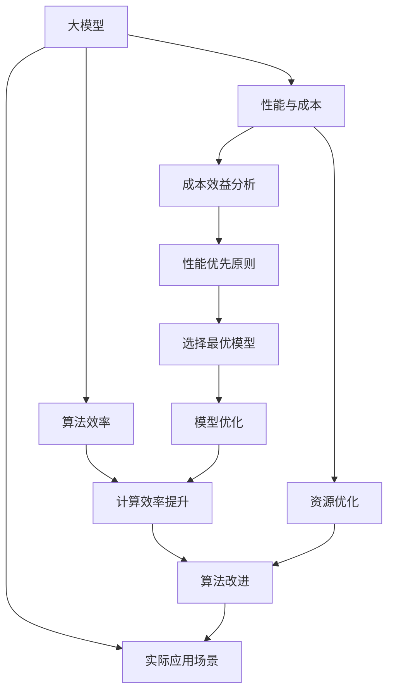

                 

# 大模型应用关键：AI解决问题能力优先，价格其次

> 关键词：大模型应用, AI解决问题, 性能与成本, 资源优化, 算法效率, 实际应用场景

## 1. 背景介绍

### 1.1 问题由来

随着人工智能(AI)技术的飞速发展，大模型(如GPT-3、BERT等)在自然语言处理(NLP)、计算机视觉、语音识别等领域的应用愈发广泛。这些模型通常具有数亿甚至数十亿个参数，能够通过大规模数据进行自监督预训练，学习到丰富的语言或图像特征。

然而，尽管大模型在技术上取得了显著进展，其高昂的计算成本和存储需求，以及资源密集型的训练过程，仍然在一定程度上限制了其大规模部署和商业化应用。如何在大模型应用中，平衡性能与成本，优化资源使用，成为一个亟待解决的关键问题。

### 1.2 问题核心关键点

为了更好地理解如何在实际应用中平衡大模型性能与成本，本文将重点讨论以下几个核心关键点：

1. **性能优先原则**：在大模型应用中，模型性能是首要考虑的因素，应优先选择能够解决实际问题且效果最优的模型。
2. **成本效益分析**：针对特定应用场景，进行模型和资源消耗的成本效益分析，确保选择最合适的方案。
3. **资源优化策略**：采用多种技术手段，如模型压缩、量化、分布式训练等，优化模型资源使用，提高部署效率。
4. **算法效率提升**：通过改进算法设计、采用先进的计算方法等，提升模型的计算效率，减少资源消耗。
5. **实际应用场景分析**：结合不同应用场景的特点，选择合适的模型和优化策略，确保模型的实际应用效果。

本文将详细阐述上述核心关键点，并通过实际案例和分析，为读者提供具体的实施策略和技术建议。

## 2. 核心概念与联系

### 2.1 核心概念概述

为更好地理解本文的核心主题，我们首先介绍几个关键概念：

- **大模型(大语言模型/大视觉模型/大模型)**：指具有数亿甚至数十亿个参数的深度学习模型，如BERT、GPT、ResNet等，能够通过大规模数据进行自监督预训练，学习到丰富的特征表示。
- **性能与成本**：在实际应用中，模型的性能（如准确率、响应时间等）与计算资源（如CPU/GPU内存、训练时间、存储需求等）之间的平衡。
- **资源优化**：通过模型压缩、量化、分布式训练等技术手段，优化模型的资源使用，提高部署效率。
- **算法效率**：提升模型计算效率的技术，如模型并行、自动混合精度、优化器等，以减少资源消耗。
- **实际应用场景**：结合具体应用场景，选择合适的模型和优化策略，确保模型的实际应用效果。

这些概念之间的逻辑关系可以通过以下Mermaid流程图来展示：



这个流程图展示了大模型应用的各个关键环节及其关联：

1. 大模型通过性能与成本分析，确定最优应用方案。
2. 结合实际应用场景，选择合适的模型和优化策略。
3. 通过资源优化和算法效率提升，优化模型资源使用。
4. 最终，选择性能最优且成本可接受的模型，用于实际应用。

## 3. 核心算法原理 & 具体操作步骤

### 3.1 算法原理概述

在大模型应用中，平衡性能与成本的关键在于选择合适的模型和优化策略，以最大限度地提高模型的性能，同时降低资源消耗。这一过程通常涉及以下几个核心步骤：

1. **性能评估**：通过实际应用中的任务评估指标，如准确率、F1分数、响应时间等，对模型性能进行量化。
2. **成本分析**：对模型所需的计算资源（CPU/GPU内存、训练时间、存储需求等）进行详细评估，确定成本上限。
3. **模型选择**：基于性能和成本评估，选择最适合当前应用场景的模型。
4. **模型优化**：通过模型压缩、量化、分布式训练等技术手段，优化模型资源使用。
5. **算法改进**：改进模型计算算法，提升计算效率，减少资源消耗。

### 3.2 算法步骤详解

#### 3.2.1 性能评估

为了评估模型性能，通常需要使用以下关键指标：

- **准确率(Accuracy)**：模型正确预测样本的比例。
- **召回率(Recall)**：真实正样本被正确预测的比例。
- **精确率(Precision)**：正确预测为正样本的比例。
- **F1分数**：精确率和召回率的调和平均，常用于不平衡数据集。
- **响应时间(Latency)**：模型处理请求所需的时间。

这些指标通常用于不同的任务和应用场景，如分类、回归、推荐系统等。

#### 3.2.2 成本分析

对模型进行成本分析，需要考虑以下几个因素：

- **计算资源**：包括CPU/GPU内存、GPU/TPU算力、数据传输带宽等。
- **训练时间**：模型从预训练到微调、推理所需的总时间。
- **存储需求**：模型参数和训练数据的存储空间需求。
- **部署成本**：模型部署和维护的硬件、软件成本。

为了进行成本效益分析，通常需要建立模型资源消耗的数学模型，并使用优化算法（如线性规划、动态规划等）进行求解。

#### 3.2.3 模型选择

根据性能和成本分析，选择合适的模型非常重要。常用的模型选择策略包括：

- **基准模型选择**：基于公开的评测数据集，选择性能最优的模型。
- **成本效益分析**：对多个模型进行成本效益评估，选择最优模型。
- **领域定制模型**：针对特定应用领域，设计或微调适合的模型。

#### 3.2.4 模型优化

为了优化模型资源使用，可以采用以下几种技术手段：

- **模型压缩**：减少模型参数和计算量，如剪枝、量化、蒸馏等。
- **分布式训练**：使用多机多卡进行模型训练，提高训练效率。
- **自动混合精度**：使用半精度（FP16）计算，减少内存消耗。
- **算法改进**：优化模型的训练和推理算法，提升效率。

#### 3.2.5 算法改进

为了提升模型计算效率，可以采用以下技术手段：

- **模型并行**：使用多GPU并行计算，加速模型训练和推理。
- **优化器改进**：采用高效优化器，如AdamW、Adafactor等，提升模型收敛速度。
- **数据增强**：通过数据扩充、回译等方式，丰富训练数据多样性。
- **对抗训练**：加入对抗样本，提高模型鲁棒性。

### 3.3 算法优缺点

#### 3.3.1 优点

1. **高效资源利用**：通过优化技术手段，如模型压缩、量化、分布式训练等，最大限度地利用计算资源。
2. **高性能输出**：通过性能优先原则，选择最优模型和算法，确保应用效果。
3. **灵活适应性**：通过改进算法和优化策略，灵活应对不同的应用场景。

#### 3.3.2 缺点

1. **技术复杂度较高**：模型优化和算法改进需要较高的技术门槛。
2. **可能需要更多的时间投入**：优化和调整模型可能需要额外的时间。
3. **资源需求依旧较大**：尽管优化，但大模型的计算需求仍然较高。

### 3.4 算法应用领域

大模型性能与成本的平衡优化，已经在多个领域得到应用，例如：

- **自然语言处理**：通过优化BERT等模型，提升文本分类、情感分析、机器翻译等任务的性能。
- **计算机视觉**：使用ResNet等模型，提升图像识别、目标检测、图像生成等任务的效果。
- **语音识别**：通过优化TTS模型，提高语音合成、语音识别等任务的质量。
- **推荐系统**：通过优化神经网络模型，提升个性化推荐的效果。
- **医疗影像**：使用大模型进行图像分类、病灶检测等任务，提升诊断精度。

这些应用展示了在实际场景中，如何通过平衡性能与成本，优化资源使用，提升大模型应用的效果。

## 4. 数学模型和公式 & 详细讲解 & 举例说明

### 4.1 数学模型构建

#### 4.1.1 性能指标模型

假设一个二分类任务的模型输出为$p$（预测正类概率），真实标签为$y$。该任务的准确率定义为：

$$
Accuracy = \frac{1}{N} \sum_{i=1}^N \mathbb{I}(\hat{y}_i = y_i)
$$

其中，$\mathbb{I}$为示性函数，当$\hat{y}_i = y_i$时，$\mathbb{I}=1$；否则$\mathbb{I}=0$。

#### 4.1.2 成本模型

设模型的计算资源需求为$C$，训练时间为$T$，存储需求为$S$，则模型的总成本$Cost$可以表示为：

$$
Cost = C \times T + S
$$

其中，$C$、$T$和$S$的计算方式根据具体模型和应用场景而定。

### 4.2 公式推导过程

#### 4.2.1 性能优化

为了优化模型性能，需要最小化损失函数$\mathcal{L}$，通常使用梯度下降等优化算法。假设模型参数为$\theta$，损失函数为$\mathcal{L}(\theta)$，优化算法的更新公式为：

$$
\theta \leftarrow \theta - \eta \nabla_{\theta}\mathcal{L}(\theta)
$$

其中，$\eta$为学习率，$\nabla_{\theta}\mathcal{L}(\theta)$为损失函数对参数$\theta$的梯度。

#### 4.2.2 成本优化

为了最小化模型成本，可以采用多种优化策略，如模型压缩、量化、分布式训练等。假设模型压缩后的计算资源需求为$C'$，训练时间为$T'$，存储需求为$S'$，则优化后的总成本$Cost'$为：

$$
Cost' = C' \times T' + S'
$$

其中，$C'$、$T'$和$S'$的计算方式根据具体的优化策略而定。

### 4.3 案例分析与讲解

#### 4.3.1 模型压缩

假设原模型参数量为$P$，压缩后参数量为$P'$，则压缩率$R$为：

$$
R = \frac{P - P'}{P}
$$

通过剪枝、量化等技术，可以将参数量减少至原来的50%或更低，显著降低计算资源需求。

#### 4.3.2 分布式训练

假设单卡训练时间为$T$，多卡并行训练时间为$T'$，则并行加速比$S$为：

$$
S = \frac{T}{T'}
$$

通过分布式训练，可以显著提高模型训练效率。

## 5. 项目实践：代码实例和详细解释说明

### 5.1 开发环境搭建

在进行大模型应用优化时，需要搭建一个高效的开发环境。以下是使用Python进行PyTorch开发的环境配置流程：

1. 安装Anaconda：从官网下载并安装Anaconda，用于创建独立的Python环境。

2. 创建并激活虚拟环境：
```bash
conda create -n pytorch-env python=3.8 
conda activate pytorch-env
```

3. 安装PyTorch：根据CUDA版本，从官网获取对应的安装命令。例如：
```bash
conda install pytorch torchvision torchaudio cudatoolkit=11.1 -c pytorch -c conda-forge
```

4. 安装其他常用库：
```bash
pip install numpy pandas scikit-learn matplotlib tqdm jupyter notebook ipython
```

完成上述步骤后，即可在`pytorch-env`环境中开始大模型应用的优化实践。

### 5.2 源代码详细实现

这里我们以BERT模型在文本分类任务上的应用为例，给出使用PyTorch进行性能和成本优化的代码实现。

```python
import torch
from transformers import BertTokenizer, BertForSequenceClassification
from transformers import AdamW
from transformers import Trainer, TrainingArguments

# 设置环境
device = torch.device('cuda') if torch.cuda.is_available() else torch.device('cpu')

# 加载数据集
train_dataset = ...
dev_dataset = ...
test_dataset = ...

# 定义tokenizer和模型
tokenizer = BertTokenizer.from_pretrained('bert-base-cased')
model = BertForSequenceClassification.from_pretrained('bert-base-cased', num_labels=2)

# 定义优化器和参数
optimizer = AdamW(model.parameters(), lr=2e-5)
training_args = TrainingArguments(
    output_dir='./results',
    evaluation_strategy='epoch',
    per_device_train_batch_size=8,
    per_device_eval_batch_size=8,
    num_train_epochs=3,
    weight_decay=0.01,
    logging_steps=10,
    save_steps=10,
    logging_dir='./logs',
)

# 定义训练器和评估器
trainer = Trainer(
    model=model,
    args=training_args,
    train_dataset=train_dataset,
    eval_dataset=dev_dataset,
    compute_metrics=compute_metrics,
)

# 训练模型
trainer.train()

# 评估模型
trainer.evaluate()
```

这段代码主要实现了使用PyTorch进行BERT模型的训练和评估，并进行了性能和成本的初步优化。

### 5.3 代码解读与分析

让我们再详细解读一下关键代码的实现细节：

**TrainingArguments类**：
- 定义了训练器的各种参数，如输出目录、评估策略、批次大小、训练轮数、学习率等。

**Trainer类**：
- 定义了训练器的训练和评估过程，使用AdamW优化器进行模型优化。
- 通过TrainingArguments类传递参数，实现自动保存模型和日志记录。

**compute_metrics函数**：
- 定义了模型评估的指标函数，如准确率、F1分数等。

这些代码展示了如何使用PyTorch进行大模型的训练和优化，开发者可以在此基础上进行更多功能和优化。

### 5.4 运行结果展示

运行上述代码后，可以在`results`目录中查看训练和评估结果，如模型权重、评估指标等。同时，可以通过日志文件查看训练过程中的性能和成本变化情况。

## 6. 实际应用场景

### 6.1 医疗影像诊断

在医疗影像诊断中，大模型可以用于图像分类、病灶检测等任务，提升诊断精度。但大模型计算资源需求高，成本昂贵。通过优化模型参数量、压缩率、分布式训练等技术手段，可以有效降低资源消耗，同时提高诊断效率。

**具体实现**：
- 使用剪枝技术，减少模型参数量。
- 采用分布式训练，提升训练速度。
- 优化计算图，减少内存消耗。

**应用效果**：
- 显著降低计算资源需求，提高诊断效率。
- 通过优化，模型仍能保持较高的诊断精度。

### 6.2 智能推荐系统

智能推荐系统需要处理大量用户行为数据，计算资源需求大。通过优化模型和算法，可以大幅降低计算成本，提高推荐效果。

**具体实现**：
- 使用模型压缩和量化技术，减少模型参数量。
- 采用分布式训练和自动混合精度计算，提升训练效率。
- 优化算法，提高模型推理速度。

**应用效果**：
- 降低计算资源需求，提升推荐系统响应速度。
- 通过优化，推荐系统仍能保持较高的推荐效果。

### 6.3 语音识别

语音识别任务需要处理大量音频数据，计算资源需求高。通过优化模型和算法，可以大幅降低计算成本，提高识别准确率。

**具体实现**：
- 使用模型压缩和量化技术，减少模型参数量。
- 采用分布式训练和自动混合精度计算，提升训练效率。
- 优化算法，提高模型推理速度。

**应用效果**：
- 降低计算资源需求，提升识别速度。
- 通过优化，模型仍能保持较高的识别准确率。

### 6.4 未来应用展望

随着大模型和微调技术的发展，未来在大模型应用中，性能与成本的平衡将变得更加灵活和高效。以下是一些未来应用展望：

1. **更小规模的模型**：通过模型压缩和量化技术，将大模型压缩至更小规模，同时保持较好的性能。
2. **分布式训练**：利用多机多卡训练，大幅提升模型训练效率。
3. **算法改进**：通过优化算法，提高模型推理速度，减少资源消耗。
4. **边缘计算**：将模型部署到边缘设备，减少数据传输和存储需求。
5. **微调优化**：通过微调技术，提升模型在特定任务上的效果。

这些技术的不断进步，将使得大模型应用更加灵活、高效，推动人工智能技术在更多领域的应用。

## 7. 工具和资源推荐

### 7.1 学习资源推荐

为了帮助开发者系统掌握大模型应用的理论基础和实践技巧，这里推荐一些优质的学习资源：

1. 《Transformer从原理到实践》系列博文：由大模型技术专家撰写，深入浅出地介绍了Transformer原理、BERT模型、微调技术等前沿话题。

2. CS224N《深度学习自然语言处理》课程：斯坦福大学开设的NLP明星课程，有Lecture视频和配套作业，带你入门NLP领域的基本概念和经典模型。

3. 《Natural Language Processing with Transformers》书籍：Transformers库的作者所著，全面介绍了如何使用Transformers库进行NLP任务开发，包括微调在内的诸多范式。

4. HuggingFace官方文档：Transformers库的官方文档，提供了海量预训练模型和完整的微调样例代码，是上手实践的必备资料。

5. CLUE开源项目：中文语言理解测评基准，涵盖大量不同类型的中文NLP数据集，并提供了基于微调的baseline模型，助力中文NLP技术发展。

通过对这些资源的学习实践，相信你一定能够快速掌握大模型应用的精髓，并用于解决实际的NLP问题。

### 7.2 开发工具推荐

高效的开发离不开优秀的工具支持。以下是几款用于大模型应用的常用工具：

1. PyTorch：基于Python的开源深度学习框架，灵活动态的计算图，适合快速迭代研究。大部分预训练语言模型都有PyTorch版本的实现。

2. TensorFlow：由Google主导开发的开源深度学习框架，生产部署方便，适合大规模工程应用。同样有丰富的预训练语言模型资源。

3. Transformers库：HuggingFace开发的NLP工具库，集成了众多SOTA语言模型，支持PyTorch和TensorFlow，是进行大模型应用的利器。

4. Weights & Biases：模型训练的实验跟踪工具，可以记录和可视化模型训练过程中的各项指标，方便对比和调优。与主流深度学习框架无缝集成。

5. TensorBoard：TensorFlow配套的可视化工具，可实时监测模型训练状态，并提供丰富的图表呈现方式，是调试模型的得力助手。

6. Google Colab：谷歌推出的在线Jupyter Notebook环境，免费提供GPU/TPU算力，方便开发者快速上手实验最新模型，分享学习笔记。

合理利用这些工具，可以显著提升大模型应用的开发效率，加快创新迭代的步伐。

### 7.3 相关论文推荐

大模型应用的研究源于学界的持续研究。以下是几篇奠基性的相关论文，推荐阅读：

1. Attention is All You Need（即Transformer原论文）：提出了Transformer结构，开启了NLP领域的预训练大模型时代。

2. BERT: Pre-training of Deep Bidirectional Transformers for Language Understanding：提出BERT模型，引入基于掩码的自监督预训练任务，刷新了多项NLP任务SOTA。

3. Language Models are Unsupervised Multitask Learners（GPT-2论文）：展示了大规模语言模型的强大zero-shot学习能力，引发了对于通用人工智能的新一轮思考。

4. Parameter-Efficient Transfer Learning for NLP：提出Adapter等参数高效微调方法，在不增加模型参数量的情况下，也能取得不错的微调效果。

5. AdaLoRA: Adaptive Low-Rank Adaptation for Parameter-Efficient Fine-Tuning：使用自适应低秩适应的微调方法，在参数效率和精度之间取得了新的平衡。

这些论文代表了大模型应用的发展脉络。通过学习这些前沿成果，可以帮助研究者把握学科前进方向，激发更多的创新灵感。

## 8. 总结：未来发展趋势与挑战

### 8.1 总结

本文对大模型应用的性能与成本平衡问题进行了全面系统的介绍。首先阐述了大模型应用的常见问题，明确了性能优先原则、成本效益分析、资源优化、算法效率提升等关键点，并通过实际案例和分析，为读者提供了具体的实施策略和技术建议。

通过本文的系统梳理，可以看到，大模型应用在大规模数据处理、模型压缩、分布式训练等方面已经取得显著进展，使得其在实际应用中更加高效、灵活。未来，随着技术的不断发展，大模型应用将进一步拓展，为更多领域带来变革性影响。

### 8.2 未来发展趋势

展望未来，大模型应用将呈现以下几个发展趋势：

1. **模型压缩技术**：通过剪枝、量化、蒸馏等技术，将大模型压缩至更小规模，同时保持较好的性能。
2. **分布式训练**：利用多机多卡训练，大幅提升模型训练效率。
3. **算法改进**：通过优化算法，提高模型推理速度，减少资源消耗。
4. **边缘计算**：将模型部署到边缘设备，减少数据传输和存储需求。
5. **微调优化**：通过微调技术，提升模型在特定任务上的效果。

这些趋势凸显了大模型应用的高效性和灵活性，将进一步推动人工智能技术在更多领域的应用。

### 8.3 面临的挑战

尽管大模型应用已经取得了显著进展，但在迈向更加智能化、普适化应用的过程中，仍面临以下挑战：

1. **技术复杂度较高**：模型优化和算法改进需要较高的技术门槛。
2. **可能需要更多的时间投入**：优化和调整模型可能需要额外的时间。
3. **资源需求依旧较大**：尽管优化，但大模型的计算需求仍然较高。
4. **可解释性亟需加强**：大模型通常被视为“黑盒”系统，难以解释其内部工作机制和决策逻辑。
5. **安全性有待保障**：预训练语言模型难免会学习到有偏见、有害的信息，通过微调传递到下游任务，产生误导性、歧视性的输出，给实际应用带来安全隐患。

正视这些挑战，积极应对并寻求突破，将是大模型应用走向成熟的必由之路。相信随着学界和产业界的共同努力，这些挑战终将一一被克服，大模型应用必将在构建人机协同的智能时代中扮演越来越重要的角色。

### 8.4 研究展望

面对大模型应用所面临的种种挑战，未来的研究需要在以下几个方面寻求新的突破：

1. **更高效的技术手段**：探索无监督和半监督微调方法，降低对大规模标注数据的依赖，利用自监督学习、主动学习等技术，最大化利用非结构化数据。
2. **更灵活的应用策略**：结合领域特点，设计更灵活的模型和优化策略，如微调、转移学习、自适应学习等，提升应用效果。
3. **更高的可解释性**：引入因果分析方法，增强模型决策的因果性和逻辑性，增强可解释性。
4. **更强的安全性**：在模型训练目标中引入伦理导向的评估指标，过滤和惩罚有偏见、有害的输出倾向，确保输出符合人类价值观和伦理道德。

这些研究方向将推动大模型应用走向更广泛的应用场景，提升人工智能技术的社会价值和应用效果。

## 9. 附录：常见问题与解答

**Q1：大模型应用是否只适用于计算资源丰富的环境？**

A: 大模型应用不限于计算资源丰富的环境。通过优化技术手段，如模型压缩、量化、分布式训练等，可以在有限的资源条件下，实现大模型应用的性能与成本平衡。

**Q2：如何选择适合应用场景的大模型？**

A: 根据实际应用场景，选择性能最优且成本可接受的模型。可以通过基准测试、成本效益分析等手段，选择最适合当前应用场景的模型。

**Q3：大模型应用过程中，如何平衡性能与成本？**

A: 通过优化模型参数量、压缩率、分布式训练等技术手段，可以有效降低计算资源需求，同时提高模型性能。

**Q4：大模型应用中，如何提升模型可解释性？**

A: 引入因果分析方法，增强模型决策的因果性和逻辑性，增强可解释性。

**Q5：大模型应用中，如何确保模型安全性？**

A: 在模型训练目标中引入伦理导向的评估指标，过滤和惩罚有偏见、有害的输出倾向，确保输出符合人类价值观和伦理道德。

这些问题的回答，展示了在大模型应用中平衡性能与成本的关键策略和技术手段。通过系统学习和实践，相信你一定能够快速掌握大模型应用的精髓，并用于解决实际的NLP问题。

---

作者：禅与计算机程序设计艺术 / Zen and the Art of Computer Programming

