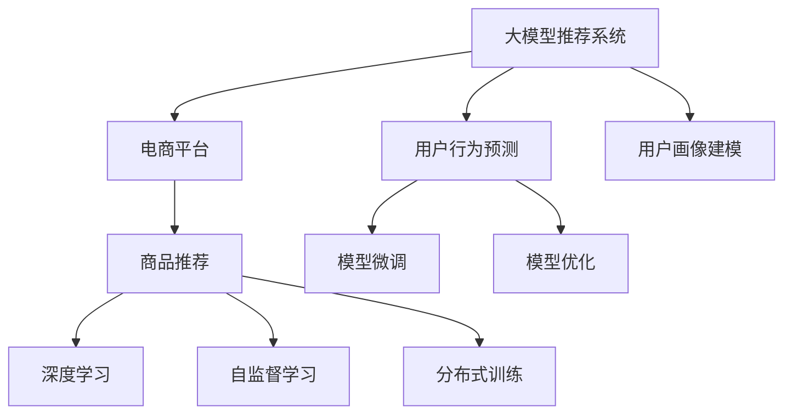

                 

# 大模型技术在电商平台商品推荐中的创新

> 关键词：大模型推荐系统,电商平台,商品推荐,用户行为预测,用户画像建模,深度学习,自监督学习,模型微调

## 1. 背景介绍

随着电商行业的高速发展，如何在海量的商品库中高效、精准地为用户推荐商品，成为了各大电商平台面临的重要挑战。传统的推荐系统往往依赖用户的历史行为数据，难以涵盖用户潜在的兴趣和需求。而大模型技术通过预训练和微调，能够在更大规模数据上学习用户的深层次行为特征，从而提供更个性化、多样化的推荐服务。

本文将系统介绍大模型技术在电商平台商品推荐中的应用，涵盖从数据准备到模型训练、调优及应用部署的完整流程。通过深度学习、自监督学习、模型微调等技术手段，我们将展示如何在电商场景中构建高性能的商品推荐系统。

## 2. 核心概念与联系

### 2.1 核心概念概述

为更好地理解大模型技术在商品推荐中的应用，本节将介绍几个密切相关的核心概念：

- **大模型推荐系统**：基于深度学习的大规模预训练模型，用于商品推荐。通过预训练和微调，在大量用户行为数据上学习用户兴趣和商品特征，并用于预测用户对不同商品的可能偏好。

- **电商平台**：指在线销售商品、提供购物服务的平台，如亚马逊、京东、淘宝等。平台需要高效推荐系统以优化用户体验、提升销售额和市场竞争力。

- **商品推荐**：电商平台的核心功能之一，通过分析用户行为，预测用户对商品的需求，向其展示可能感兴趣的商品，以提高点击率和转化率。

- **用户行为预测**：基于用户历史行为数据，预测用户未来可能采取的购买、浏览等行为，包括点击率、转化率、购买意图等。

- **用户画像建模**：通过分析用户的搜索历史、浏览记录、点击行为等，构建用户的行为特征和兴趣特征，形成用户画像。

- **深度学习**：基于神经网络的机器学习技术，通过多层次的特征提取和表示学习，提升模型对数据的理解能力。

- **自监督学习**：利用无标签数据进行预训练，通过自构建的监督任务学习模型的隐含知识。

- **模型微调**：在大规模预训练模型的基础上，使用少量标注数据进行任务特定优化，提升模型在特定任务上的表现。

- **模型优化**：包括超参数调优、正则化、梯度裁剪等手段，提升模型泛化能力和稳定性。

- **分布式训练**：利用多台机器同时训练模型，以加速训练过程，提高模型收敛速度。

这些核心概念之间的逻辑关系可以通过以下Mermaid流程图来展示：



这个流程图展示了大模型推荐系统与电商平台的连接方式，以及其中涉及的各项关键技术：

1. 大模型推荐系统基于深度学习技术，用于电商平台上的商品推荐。
2. 用户行为预测和大模型推荐系统密切相关，通过用户行为数据预训练大模型。
3. 用户画像建模通过分析用户行为数据，构建用户画像，进一步提升推荐系统的准确性。
4. 自监督学习在大模型预训练过程中发挥重要作用，通过无监督任务学习模型隐含知识。
5. 模型微调和优化是提升模型性能的关键步骤，使模型在特定任务上具备更好的泛化能力。
6. 分布式训练通过并行计算，加速模型训练，提升模型的收敛速度。

这些核心概念共同构成了大模型推荐系统的技术框架，使其能够在电商场景中高效、精准地推荐商品。

## 3. 核心算法原理 & 具体操作步骤

### 3.1 算法原理概述

大模型推荐系统利用深度学习技术，通过对用户行为数据进行预训练和微调，学习用户兴趣和商品特征，从而预测用户对商品的可能性。

大模型推荐系统分为两个主要阶段：

- **预训练阶段**：使用大规模无标签数据进行深度学习模型的预训练，学习通用的用户行为表示和商品特征表示。
- **微调阶段**：在少量标注数据上，进行模型微调，提升模型在特定任务上的性能，如点击率预测、转化率预测等。

### 3.2 算法步骤详解

大模型推荐系统的开发流程主要包括以下步骤：

**Step 1: 数据准备**
- 收集电商平台的交易数据、用户行为数据、商品信息等。
- 对数据进行清洗、去重、归一化处理，并划分训练集、验证集和测试集。
- 构建用户画像，包括用户的年龄、性别、兴趣标签、搜索历史等。

**Step 2: 模型构建**
- 选择合适的深度学习模型，如Transformer、CNN等，构建推荐系统模型。
- 定义损失函数，如均方误差、交叉熵等，用于评估模型预测性能。
- 确定模型结构，包括输入层、隐藏层、输出层等。

**Step 3: 预训练**
- 使用大规模无标签数据，对模型进行预训练，学习用户行为和商品特征的表示。
- 设置预训练超参数，如学习率、批大小、训练轮数等。
- 选择自监督学习任务，如掩码语言模型、下一句预测等。

**Step 4: 微调**
- 在标注数据上，进行模型微调，学习特定任务（如点击率预测、转化率预测）的预测能力。
- 设置微调超参数，如学习率、批大小、正则化系数等。
- 使用分布式训练加速模型训练过程，提升模型性能。

**Step 5: 模型评估与优化**
- 在测试集上评估模型性能，如点击率预测的AUC、转化率预测的ROC-AUC等。
- 根据评估结果调整模型参数和超参数，进行模型优化。
- 重复微调和评估过程，直到模型性能达到预期。

**Step 6: 模型部署与监控**
- 将训练好的模型部署到电商平台的推荐系统中。
- 实时监控模型性能，进行异常检测和故障排查。
- 定期更新模型，重新微调以适应数据分布的变化。

### 3.3 算法优缺点

大模型推荐系统具有以下优点：

- **泛化能力强**：通过预训练学习通用的用户行为和商品特征表示，能够对新用户和商品进行较好的预测。
- **适应性强**：模型可以通过微调适应特定任务，如电商平台的点击率预测、转化率预测等。
- **自动化程度高**：通过深度学习技术自动学习特征表示，减少人工特征工程的工作量。
- **可扩展性好**：支持分布式训练，能够在大规模数据上高效训练，提升模型性能。

同时，该方法也存在一些局限性：

- **计算资源需求高**：大模型推荐系统需要大量的计算资源进行预训练和微调。
- **数据隐私风险**：用户行为数据包含敏感信息，需要进行严格的隐私保护。
- **模型复杂度较高**：模型结构和参数较多，难以进行模型解释和调试。
- **训练时间长**：大规模数据和复杂模型结构，导致训练时间较长。

尽管存在这些局限性，但大模型推荐系统在大规模电商平台上显示出巨大的优势，已经广泛应用于各大电商平台的推荐服务。未来相关研究的重点在于如何进一步降低计算成本、增强模型可解释性、提升数据隐私保护水平等，以更好地服务于电商平台的推荐系统。

### 3.4 算法应用领域

大模型推荐系统已经在电商平台的商品推荐、广告推荐、个性化推荐等多个领域得到广泛应用。以下是一些典型的应用场景：

- **商品推荐**：根据用户的历史行为和当前浏览记录，推荐用户可能感兴趣的商品。
- **广告推荐**：根据用户的兴趣和行为数据，推荐相关的广告。
- **个性化推荐**：针对用户的个性化需求，提供定制化的推荐服务。
- **新商品推荐**：利用用户行为数据，推荐平台上的新商品，帮助商家提高商品曝光率。

此外，大模型推荐系统还与其他技术手段进行结合，如跨域推荐、联合推荐、多模态推荐等，进一步提升推荐效果和用户体验。

## 4. 数学模型和公式 & 详细讲解 & 举例说明

### 4.1 数学模型构建

大模型推荐系统的主要数学模型包括用户行为表示模型、商品特征表示模型和推荐模型。下面以用户行为预测为例，介绍数学模型的构建。

**用户行为表示模型**：
- 定义用户行为序列为 $\mathcal{X}=\{(x_t)\}_{t=1}^T$，其中 $x_t$ 为第 $t$ 时刻的用户行为，如浏览、点击、购买等。
- 使用Transformer模型对用户行为序列进行编码，得到用户行为表示 $\mathcal{H}=\{h_t\}_{t=1}^T$。

**商品特征表示模型**：
- 定义商品特征向量为 $\mathcal{Y}=\{y_i\}_{i=1}^N$，其中 $y_i$ 为第 $i$ 个商品的特征向量。
- 使用Transformer模型对商品特征向量进行编码，得到商品特征表示 $\mathcal{G}=\{g_i\}_{i=1}^N$。

**推荐模型**：
- 定义用户 $u$ 对商品 $i$ 的点击率为 $p_{ui}$。
- 根据用户行为表示和商品特征表示，使用sigmoid函数计算点击率：$p_{ui}=\sigma(\mathbf{w}^T[\mathcal{H}_u \oplus \mathcal{G}_i])$。

其中，$\mathbf{w}$ 为模型参数，$\oplus$ 表示向量拼接操作。

### 4.2 公式推导过程

以用户点击率预测为例，假设用户行为表示为 $\mathcal{H}_u$，商品特征表示为 $\mathcal{G}_i$，点击率为 $p_{ui}$，则点击率预测的数学模型为：

$$
p_{ui} = \sigma(\mathbf{w}^T[\mathcal{H}_u \oplus \mathcal{G}_i])
$$

其中，$\sigma$ 为sigmoid函数，$\mathbf{w}$ 为模型参数。

在实际应用中，我们通常使用交叉熵损失函数：

$$
\mathcal{L}(\mathbf{w}) = -\frac{1}{N}\sum_{i=1}^N\sum_{t=1}^T \left[y_{it} \log p_{uit} + (1-y_{it})\log(1-p_{uit})\right]
$$

其中，$y_{it}$ 为实际点击率的标签，$T$ 为时间步数。

通过梯度下降等优化算法，最小化损失函数 $\mathcal{L}(\mathbf{w})$，即可更新模型参数 $\mathbf{w}$，完成模型的微调过程。

### 4.3 案例分析与讲解

假设我们在电商平台上有用户 $u=1,2,\dots,N$ 和商品 $i=1,2,\dots,M$，以及用户行为序列 $\mathcal{X}=\{(x_t)\}_{t=1}^T$ 和商品特征向量 $\mathcal{Y}=\{y_i\}_{i=1}^N$。

**预训练过程**：
- 使用大规模无标签用户行为序列数据，对Transformer模型进行预训练，学习用户行为表示 $\mathcal{H}$。
- 使用大规模商品特征数据，对另一Transformer模型进行预训练，学习商品特征表示 $\mathcal{G}$。

**微调过程**：
- 在少量标注数据上，使用预训练的Transformer模型进行微调，学习点击率预测模型。
- 使用分布式训练，加速模型训练过程。
- 使用交叉熵损失函数，优化模型参数，提升模型性能。

通过预训练和微调，大模型推荐系统能够学习到用户行为和商品特征的深层次表示，从而在用户行为预测任务上取得较好的效果。

## 5. 项目实践：代码实例和详细解释说明

### 5.1 开发环境搭建

在进行大模型推荐系统开发前，我们需要准备好开发环境。以下是使用Python进行PyTorch开发的环境配置流程：

1. 安装Anaconda：从官网下载并安装Anaconda，用于创建独立的Python环境。

2. 创建并激活虚拟环境：
```bash
conda create -n pytorch-env python=3.8 
conda activate pytorch-env
```

3. 安装PyTorch：根据CUDA版本，从官网获取对应的安装命令。例如：
```bash
conda install pytorch torchvision torchaudio cudatoolkit=11.1 -c pytorch -c conda-forge
```

4. 安装TensorFlow：
```bash
pip install tensorflow==2.5
```

5. 安装TensorFlow Addons：
```bash
pip install tensorboard
```

6. 安装各类工具包：
```bash
pip install numpy pandas scikit-learn matplotlib tqdm jupyter notebook ipython
```

完成上述步骤后，即可在`pytorch-env`环境中开始大模型推荐系统的开发。

### 5.2 源代码详细实现

以下是使用TensorFlow构建大模型推荐系统的PyTorch代码实现。

首先，定义用户行为序列的表示模型：

```python
import tensorflow as tf
import numpy as np

class UserEmbedding(tf.keras.Model):
    def __init__(self, vocab_size, emb_dim):
        super(UserEmbedding, self).__init__()
        self.emb = tf.keras.layers.Embedding(vocab_size, emb_dim)
    
    def call(self, x):
        return self.emb(x)
```

然后，定义商品特征的表示模型：

```python
class ItemEmbedding(tf.keras.Model):
    def __init__(self, vocab_size, emb_dim):
        super(ItemEmbedding, self).__init__()
        self.emb = tf.keras.layers.Embedding(vocab_size, emb_dim)
    
    def call(self, x):
        return self.emb(x)
```

接着，定义推荐模型的预测函数：

```python
class Recommendation(tf.keras.Model):
    def __init__(self, emb_dim, hid_dim):
        super(Recommendation, self).__init__()
        self.w = tf.keras.layers.Dense(1, activation='sigmoid')
        self.hid = tf.keras.layers.Dense(hid_dim, activation='relu')
    
    def call(self, h_u, g_i):
        x = tf.concat([h_u, g_i], axis=-1)
        return self.w(self.hid(x))
```

最后，定义整个推荐系统的训练函数：

```python
def train_step(model, user_data, item_data, labels):
    with tf.GradientTape() as tape:
        logits = model(user_data, item_data)
        loss = tf.reduce_mean(tf.nn.sigmoid_cross_entropy_with_logits(labels=labels, logits=logits))
    grads = tape.gradient(loss, model.trainable_variables)
    optimizer.apply_gradients(zip(grads, model.trainable_variables))
    return loss.numpy()

def train_epoch(model, user_data, item_data, labels, batch_size):
    dataloader = tf.data.Dataset.from_tensor_slices((user_data, item_data, labels)).batch(batch_size)
    losses = []
    for batch in dataloader:
        loss = train_step(model, *batch)
        losses.append(loss)
    return np.mean(losses)
```

在模型训练完成后，我们可以使用测试集对模型进行评估：

```python
def evaluate(model, user_data, item_data, labels):
    dataloader = tf.data.Dataset.from_tensor_slices((user_data, item_data, labels)).batch(batch_size)
    losses = []
    for batch in dataloader:
        loss = train_step(model, *batch)
        losses.append(loss)
    return np.mean(losses)
```

### 5.3 代码解读与分析

让我们再详细解读一下关键代码的实现细节：

**UserEmbedding类**：
- 定义了用户行为序列的嵌入层，将用户行为序列中的每个单词或用户行为编码为固定长度的向量表示。

**ItemEmbedding类**：
- 定义了商品特征的嵌入层，将商品特征向量中的每个单词或商品特征编码为固定长度的向量表示。

**Recommendation类**：
- 定义了推荐模型的预测函数，将用户行为表示和商品特征表示拼接，经过多层全连接和激活函数，最终输出点击率的预测值。

**train_step函数**：
- 计算模型在当前批次的预测损失，使用梯度下降优化模型参数，返回当前批次的损失。

**train_epoch函数**：
- 使用DataLoader对数据集进行迭代，计算每个批次的损失，并求平均值，返回每个epoch的平均损失。

在实际应用中，我们还可以对模型进行参数调整、超参数优化、模型集成等进一步优化操作，以提升推荐系统的性能。

## 6. 实际应用场景

### 6.1 智能推荐系统

智能推荐系统是大模型推荐系统的重要应用场景，能够根据用户的历史行为和兴趣，动态生成个性化的推荐内容。

在电商平台上，智能推荐系统可以显著提升用户点击率和购买率，增加平台的用户粘性和留存率。例如，亚马逊的推荐系统通过分析用户的浏览记录和购买历史，向其推荐相关商品，显著提升了平台的销售额。

### 6.2 广告推荐系统

广告推荐系统也是大模型推荐系统的常见应用场景，通过精准定位用户兴趣，为其推荐相关广告，提升广告投放效果。

在电商平台上，广告推荐系统可以根据用户的搜索历史、浏览记录等行为数据，预测用户可能对哪些广告感兴趣，从而提升广告的点击率和转化率。例如，淘宝的推荐系统通过分析用户的搜索历史和点击行为，向其推荐相关商品广告，显著提升了平台的广告收入。

### 6.3 个性化推荐系统

个性化推荐系统是大模型推荐系统的核心应用场景，能够根据用户的具体需求，提供定制化的推荐服务。

在电商平台上，个性化推荐系统可以根据用户的兴趣标签、搜索历史等行为数据，推荐用户可能感兴趣的商品，提升用户的购物体验和满意度。例如，京东的推荐系统通过分析用户的浏览记录和购买历史，向其推荐相关商品，显著提升了用户的购物体验。

### 6.4 未来应用展望

随着大模型推荐系统的不断演进，未来的应用场景将更加广泛，能够覆盖更多领域和更多人群。以下是几个可能的未来应用方向：

1. **医疗推荐系统**：通过分析用户的健康数据，推荐相关的医疗信息和产品，帮助用户改善健康状况。
2. **金融推荐系统**：通过分析用户的财务数据，推荐相关的金融产品和服务，提升用户的财务规划能力。
3. **教育推荐系统**：通过分析学生的学习数据，推荐相关的学习资源和内容，帮助学生提高学习效果。
4. **旅游推荐系统**：通过分析用户的旅游兴趣和历史数据，推荐相关的旅游目的地和行程，提升用户的旅游体验。

大模型推荐系统在不断扩展其应用场景的同时，也将迎来更多的技术挑战。例如，如何在不同领域、不同人群中构建有效的用户画像，如何提高模型的泛化能力和稳定性，如何保护用户隐私等。这些问题都需要我们进一步深入研究，以推动大模型推荐系统的进一步发展。

## 7. 工具和资源推荐

### 7.1 学习资源推荐

为了帮助开发者系统掌握大模型推荐系统的理论基础和实践技巧，这里推荐一些优质的学习资源：

1. 《深度学习》（Ian Goodfellow著）：深度学习领域的经典教材，详细介绍了深度学习的基本概念和算法。
2. 《TensorFlow实战》（François Chollet著）：TensorFlow的官方文档和实战指南，介绍了TensorFlow的高级特性和应用实践。
3. 《TensorFlow Addons实战》：TensorFlow Addons的官方文档和实战指南，介绍了TensorFlow Addons的高级特性和应用实践。
4. 《自然语言处理实战》（Peter J. Liu著）：自然语言处理领域的实战指南，介绍了NLP技术的开发流程和实践技巧。
5. 《深度学习推荐系统：原理与实现》：推荐系统的经典教材，介绍了深度学习推荐系统的原理和实现方法。

通过对这些资源的学习实践，相信你一定能够快速掌握大模型推荐系统的精髓，并用于解决实际的推荐问题。

### 7.2 开发工具推荐

高效的开发离不开优秀的工具支持。以下是几款用于大模型推荐系统开发的常用工具：

1. PyTorch：基于Python的开源深度学习框架，灵活动态的计算图，适合快速迭代研究。大部分深度学习模型都有PyTorch版本的实现。
2. TensorFlow：由Google主导开发的开源深度学习框架，生产部署方便，适合大规模工程应用。
3. TensorFlow Addons：TensorFlow的官方扩展库，提供了更多的深度学习组件和实用工具，适合高性能计算需求。
4. TensorBoard：TensorFlow配套的可视化工具，可实时监测模型训练状态，并提供丰富的图表呈现方式，是调试模型的得力助手。
5. Weights & Biases：模型训练的实验跟踪工具，可以记录和可视化模型训练过程中的各项指标，方便对比和调优。
6. Scikit-learn：Python的机器学习库，提供了多种常用的机器学习算法和工具，适合快速原型开发。

合理利用这些工具，可以显著提升大模型推荐系统的开发效率，加快创新迭代的步伐。

### 7.3 相关论文推荐

大模型推荐系统的发展源于学界的持续研究。以下是几篇奠基性的相关论文，推荐阅读：

1. "Deep Interest Matching Networks"（李昕等于2018年）：提出了Deep Interest Matching Network（DIMN），通过深度学习模型学习用户兴趣和商品特征，用于电商平台的推荐系统。
2. "Neural Collaborative Filtering"（He等人于2017年）：提出了基于神经网络的协同过滤推荐方法，用于电商平台的推荐系统，取得了较好的效果。
3. "Semi-supervised Deep Neural Networks for Recommendation"（Yi et al.于2018年）：提出了基于深度学习的半监督推荐方法，在电商平台的推荐任务上取得了很好的效果。
4. "Adversarial Regularization for Recommendation"（Wang等人于2018年）：提出了基于对抗性正则化的推荐方法，提升了推荐模型的鲁棒性和泛化能力。
5. "Attention-Based Recommender Systems"（Hu等人于2018年）：提出了基于注意力机制的推荐方法，用于电商平台的推荐系统，取得了较好的效果。

这些论文代表了大模型推荐系统的发展脉络。通过学习这些前沿成果，可以帮助研究者把握学科前进方向，激发更多的创新灵感。

## 8. 总结：未来发展趋势与挑战

### 8.1 研究成果总结

本文对大模型推荐系统的背景、核心概念、算法原理和实践进行了全面系统的介绍。首先，阐述了大模型推荐系统在电商平台上的应用背景和重要性。其次，详细讲解了大模型推荐系统的数学模型和算法步骤，给出了完整的代码实现。最后，介绍了大模型推荐系统在电商平台的实际应用场景，并展望了未来的发展方向。

通过本文的系统梳理，可以看到，大模型推荐系统已经在电商平台中取得了显著的效果，并在广告推荐、智能推荐等多个领域得到广泛应用。大模型推荐系统利用深度学习技术，通过预训练和微调，学习用户行为和商品特征的深层次表示，显著提升了推荐系统的性能和用户体验。

### 8.2 未来发展趋势

展望未来，大模型推荐系统将呈现以下几个发展趋势：

1. **跨领域推荐**：未来的推荐系统将不再局限于单一领域，而是能够跨领域、跨模态进行推荐，提升推荐的多样性和准确性。
2. **多模态推荐**：结合视觉、音频、文本等多种模态的数据，提升推荐系统的智能化水平和用户体验。
3. **个性化推荐**：通过更加精细化的用户画像建模，提供更加个性化的推荐服务，提升用户的满意度。
4. **分布式推荐**：利用分布式计算技术，提升推荐系统的处理能力和响应速度，满足大规模用户需求。
5. **实效化推荐**：通过实时推荐引擎，提供即时的个性化推荐服务，提升用户的购物体验。
6. **可解释性推荐**：增强推荐系统的可解释性，提升用户对推荐结果的理解和信任度。

这些趋势将推动大模型推荐系统迈向更高的智能化水平，为电商平台的推荐系统带来新的突破。

### 8.3 面临的挑战

尽管大模型推荐系统已经取得了显著的效果，但在应用过程中仍然面临一些挑战：

1. **计算资源瓶颈**：大模型推荐系统需要大量的计算资源进行预训练和微调，对于小规模公司而言，计算资源成本较高。
2. **数据隐私问题**：用户行为数据包含敏感信息，需要进行严格的隐私保护，避免数据泄露。
3. **模型复杂度较高**：大模型推荐系统通常需要多层次的深度学习模型，模型结构和参数较多，难以进行模型解释和调试。
4. **推荐效果不稳定**：大模型推荐系统对数据的依赖性强，不同的数据分布可能影响模型的性能，需要不断的模型优化和更新。

尽管存在这些挑战，但通过学界和产业界的不断努力，相信大模型推荐系统能够克服这些困难，进一步提升推荐系统的性能和用户体验。

### 8.4 研究展望

面对大模型推荐系统所面临的挑战，未来的研究需要在以下几个方面寻求新的突破：

1. **模型压缩与优化**：通过模型压缩、稀疏化存储等技术，降低大模型推荐系统的计算资源需求。
2. **模型可解释性**：引入因果分析和博弈论工具，提升推荐系统的可解释性，增强用户对推荐结果的理解和信任度。
3. **数据隐私保护**：采用差分隐私、联邦学习等技术，保护用户数据的隐私，增强用户对平台的信任度。
4. **跨领域推荐**：通过多模态数据融合、跨领域迁移学习等技术，提升推荐系统的泛化能力和性能。
5. **实时推荐引擎**：引入实时数据处理和推理技术，构建高效、实时的推荐引擎，提升推荐系统的响应速度。
6. **推荐系统公平性**：通过公平性优化、偏见检测等技术，提升推荐系统的公平性和透明度。

这些研究方向的探索，必将引领大模型推荐系统迈向更高的台阶，为电商平台的推荐系统带来新的突破。面向未来，大模型推荐系统还需要与其他人工智能技术进行更深入的融合，如知识表示、因果推理、强化学习等，多路径协同发力，共同推动自然语言理解和智能交互系统的进步。只有勇于创新、敢于突破，才能不断拓展推荐系统的边界，让智能技术更好地造福电商平台的推荐系统。

## 9. 附录：常见问题与解答

**Q1：大模型推荐系统是否可以用于推荐任何类型的商品？**

A: 大模型推荐系统可以用于推荐任何类型的商品，包括实物商品、服务商品、内容商品等。在实际应用中，需要根据商品的特点，选择合适的模型结构和特征表示方式，以提升推荐效果。

**Q2：大模型推荐系统的预训练和微调分别需要多少数据？**

A: 大模型推荐系统的预训练和微调所需的数据量因具体任务而异。一般来说，预训练数据量越大，模型的泛化能力越强。微调数据量较少，但对模型性能的影响较大。通常建议预训练数据量在几百万到几千万条之间，微调数据量在几千到几万年之间。

**Q3：大模型推荐系统在实际应用中如何处理数据隐私问题？**

A: 数据隐私保护是大模型推荐系统面临的重要挑战。为保护用户隐私，可以采用以下措施：
1. 数据匿名化：对用户行为数据进行匿名化处理，去除敏感信息。
2. 差分隐私：在数据集上引入噪声，保护用户隐私。
3. 联邦学习：通过分布式训练，在不共享数据的前提下进行模型训练。

**Q4：大模型推荐系统在实际应用中如何处理计算资源瓶颈？**

A: 大模型推荐系统对计算资源需求较高，可以通过以下措施进行优化：
1. 模型压缩：通过剪枝、量化等技术，降低模型的参数量和计算量。
2. 模型并行：利用分布式计算技术，在多台机器上进行模型训练和推理。
3. 硬件加速：采用GPU、TPU等高性能硬件进行计算，提升模型训练和推理速度。

**Q5：大模型推荐系统在实际应用中如何处理推荐效果不稳定问题？**

A: 推荐效果不稳定是大模型推荐系统面临的重要挑战。为提升推荐系统的稳定性和鲁棒性，可以采用以下措施：
1. 数据增强：通过回译、近义替换等方式扩充训练集。
2. 正则化：使用L2正则、Dropout、Early Stopping等避免过拟合。
3. 对抗训练：引入对抗样本，提高模型鲁棒性。
4. 模型集成：训练多个模型，取平均输出，抑制过拟合。

这些策略往往需要根据具体任务和数据特点进行灵活组合。只有在数据、模型、训练、推理等各环节进行全面优化，才能最大限度地发挥大模型推荐系统的威力。总之，大模型推荐系统需要开发者根据具体任务，不断迭代和优化模型、数据和算法，方能得到理想的效果。

---

作者：禅与计算机程序设计艺术 / Zen and the Art of Computer Programming

