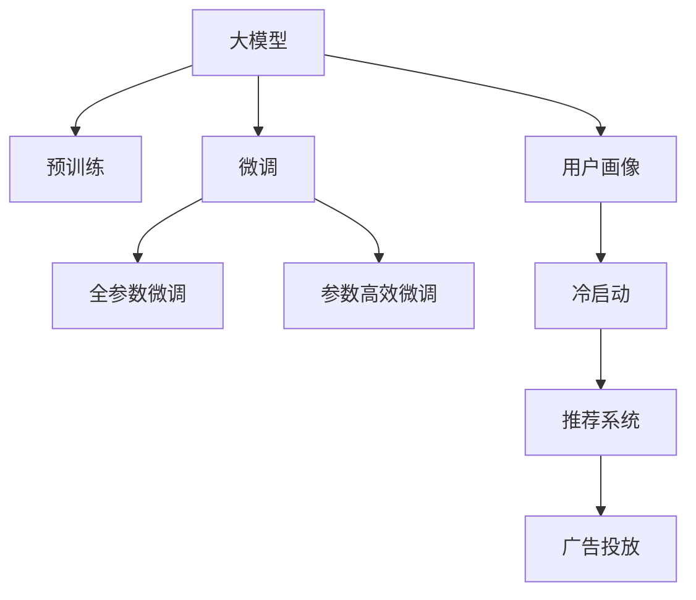

                 

# 大模型技术在电商平台用户兴趣冷启动问题中的创新

## 1. 背景介绍

随着电商行业的快速发展，电商平台的用户数量和交易额迅速增长，为广告主提供了巨大的商业机会。然而，如何帮助新用户快速找到他们感兴趣的商品，并在初期建立起长期的用户粘性，成为了电商平台面临的一大挑战。传统上，电商平台主要通过引导用户填写兴趣问卷、查看历史浏览记录等方式来建立用户画像，但这往往依赖于用户的主动行为，难以覆盖所有用户。因此，如何让新用户在没有历史行为数据的情况下，快速建立起与电商平台的关联，成为冷启动问题亟待解决的难题。

大模型技术通过大规模预训练和微调，能够学习到丰富的语言知识和常识，具备强大的自然语言理解和生成能力，因此在电商平台的冷启动问题中，大模型有望成为破解难题的关键工具。通过将用户输入的文字描述映射到商品特征空间，大模型能够自动挖掘用户兴趣，从而快速推荐用户感兴趣的商品。

本文旨在探索大模型技术在电商平台用户兴趣冷启动问题中的创新应用，以期提升新用户的购物体验和电商平台的用户留存率。

## 2. 核心概念与联系

### 2.1 核心概念概述

为更好地理解大模型技术在冷启动问题中的应用，本节将介绍几个密切相关的核心概念：

- 大模型(大规模语言模型, Large Language Model, LLM)：指通过大规模无标签文本数据进行预训练，并能够处理自然语言处理(NLP)任务的通用语言模型。典型的大模型包括BERT、GPT、T5等。
- 预训练(Pre-training)：指在大规模无标签文本数据上进行自监督学习任务，使模型学习到通用的语言表示。
- 微调(Fine-tuning)：指在预训练模型的基础上，使用带有标签的特定领域数据进行有监督学习，优化模型在该领域上的性能。
- 冷启动问题(Cold-Start Problem)：指在用户没有历史行为数据的情况下，如何快速建立起与用户关联的挑战。
- 推荐系统(Recommendation System)：指通过算法为用户推荐商品或内容，以提升用户满意度，增强用户粘性的系统。
- 用户画像(User Profiling)：指通过对用户行为的分析和挖掘，构建用户兴趣和行为的综合画像。
- 广告投放(Ad Placement)：指通过广告展示位置的优化，提升广告效果，增加用户点击率。

这些核心概念之间的逻辑关系可以通过以下Mermaid流程图来展示：



这个流程图展示了大模型技术的核心概念及其之间的关系：

1. 大模型通过预训练获得基础能力。
2. 微调对预训练模型进行特定领域任务的适配。
3. 用户画像通过用户输入的描述构建。
4. 冷启动问题通过用户画像和预训练模型解决。
5. 推荐系统利用用户画像和预训练模型进行商品推荐。
6. 广告投放通过推荐系统实现精准广告展示。

## 3. 核心算法原理 & 具体操作步骤
### 3.1 算法原理概述

在电商平台的用户兴趣冷启动问题中，大模型的任务是使用用户输入的文字描述，快速建立起与用户关联，并推荐用户感兴趣的商品。这一过程可以分为两个主要步骤：用户画像构建和推荐系统优化。

用户画像构建，指通过用户输入的文字描述，挖掘用户的兴趣偏好，构建用户画像。推荐系统优化，指利用用户画像和预训练大模型，推荐用户感兴趣的商品。

### 3.2 算法步骤详解

**Step 1: 数据准备和预处理**
- 收集用户输入的文字描述，并进行分词、去除停用词等预处理操作。
- 构建标注数据集，将用户输入的描述与对应的商品特征空间进行对齐，形成标注样本。

**Step 2: 构建用户画像**
- 使用预训练的大模型，对用户输入的文字描述进行编码，得到用户特征向量。
- 对用户特征向量进行降维和归一化，得到一个低维的用户画像。

**Step 3: 推荐系统优化**
- 使用预训练的大模型，对用户画像和商品特征空间进行相似度计算。
- 根据相似度结果，选择与用户兴趣最相关的商品进行推荐。
- 使用参数高效微调方法，在固定大部分预训练参数的情况下，微调顶层分类器，优化推荐效果。

**Step 4: 广告投放策略优化**
- 根据用户行为数据，构建用户行为向量。
- 利用预训练大模型，对用户行为向量和商品特征向量进行联合训练，优化广告投放策略。
- 在用户浏览商品页面时，动态调整广告展示位置，提高广告点击率和转化率。

### 3.3 算法优缺点

大模型技术在电商平台冷启动问题中的应用具有以下优点：
1. 自动化高效：通过大模型自动学习用户兴趣，无需依赖用户主动行为，提高用户兴趣挖掘的自动化水平。
2. 泛化能力强：大模型在多种NLP任务上均有优异的泛化能力，能够适应不同类型的用户描述。
3. 可解释性好：利用大模型的可解释性，用户可以更容易理解推荐结果的生成机制。
4. 数据需求低：不需要大量标注数据，在用户输入的少量描述中即可快速建立用户画像。

同时，该方法也存在一定的局限性：
1. 需要高质量的用户输入：用户输入的描述质量直接影响到推荐结果，需要用户提供真实、详细的描述。
2. 数据隐私问题：用户输入的文字描述涉及用户隐私，需要采取有效的隐私保护措施。
3. 计算成本高：大模型的训练和推理计算成本较高，需要高性能计算设备支持。
4. 模型的健壮性：预训练模型和微调模型需要具备较高的健壮性，避免在输入噪声和数据分布变化时产生较大波动。

尽管存在这些局限性，但大模型技术在电商平台用户兴趣冷启动问题中的应用前景广阔，能够显著提升新用户的购物体验和电商平台的用户留存率。

### 3.4 算法应用领域

大模型技术在电商平台用户兴趣冷启动问题中的应用场景非常广泛，具体包括：

- 新用户注册引导：通过用户输入的文字描述，快速推荐新用户感兴趣的商品，加速新用户注册流程。
- 用户兴趣推荐：根据用户输入的文字描述，推荐用户感兴趣的商品，提升用户购买意愿。
- 广告推荐优化：利用用户输入的文字描述和行为数据，优化广告展示位置，提高广告点击率。
- 客户服务支持：通过用户输入的文字描述，快速匹配用户需求，提供个性化客户服务。

这些应用场景展现了大模型技术在电商平台冷启动问题中的创新潜力，未来将有望在更多的电商业务环节得到广泛应用。

## 4. 数学模型和公式 & 详细讲解 & 举例说明
### 4.1 数学模型构建

在电商平台用户兴趣冷启动问题中，大模型的任务是使用用户输入的文字描述，快速建立起与用户关联，并推荐用户感兴趣的商品。这一过程可以分为两个主要步骤：用户画像构建和推荐系统优化。

### 4.2 公式推导过程

**用户画像构建**
设用户输入的文字描述为 $x \in \mathcal{X}$，对应的商品特征向量为 $y \in \mathcal{Y}$。大模型通过输入 $x$ 得到用户特征向量 $u = M_{\theta}(x)$，其中 $M_{\theta}$ 为预训练大模型的编码器部分。

**推荐系统优化**
设推荐系统中商品的特征向量为 $y_i \in \mathcal{Y}$，$i=1,2,...,N$，其中 $N$ 为商品总数。大模型通过用户画像 $u$ 和商品特征向量 $y_i$ 计算相似度 $s_i = u \cdot y_i$，最终选择相似度最高的商品进行推荐。

**广告投放策略优化**
设用户行为向量为 $b \in \mathcal{B}$，大模型通过用户行为向量 $b$ 和商品特征向量 $y_i$ 计算相似度 $s'_i = b \cdot y_i$，动态调整广告展示位置，提高广告点击率。

### 4.3 案例分析与讲解

以一家在线零售商为例，分析如何使用大模型技术优化其推荐系统。

首先，收集用户提交的商品搜索描述，如“女式运动鞋”、“棉麻连衣裙”等，构建标注数据集。其中，每个描述与对应的商品特征向量进行对齐，形成标注样本。

接着，使用BERT模型对用户输入的文字描述进行编码，得到用户特征向量 $u$。对 $u$ 进行降维和归一化，得到一个低维的用户画像。

然后，使用BERT模型对商品特征向量 $y_i$ 进行编码，计算用户画像 $u$ 和每个商品特征向量 $y_i$ 之间的相似度 $s_i$。选择相似度最高的商品进行推荐。

最后，利用用户浏览和购买历史，构建用户行为向量 $b$，对用户行为向量 $b$ 和商品特征向量 $y_i$ 计算相似度 $s'_i$，动态调整广告展示位置，提高广告点击率。

## 5. 项目实践：代码实例和详细解释说明
### 5.1 开发环境搭建

在进行项目实践前，我们需要准备好开发环境。以下是使用Python进行PyTorch开发的环境配置流程：

1. 安装Anaconda：从官网下载并安装Anaconda，用于创建独立的Python环境。

2. 创建并激活虚拟环境：
```bash
conda create -n pytorch-env python=3.8 
conda activate pytorch-env
```

3. 安装PyTorch：根据CUDA版本，从官网获取对应的安装命令。例如：
```bash
conda install pytorch torchvision torchaudio cudatoolkit=11.1 -c pytorch -c conda-forge
```

4. 安装Transformers库：
```bash
pip install transformers
```

5. 安装各类工具包：
```bash
pip install numpy pandas scikit-learn matplotlib tqdm jupyter notebook ipython
```

完成上述步骤后，即可在`pytorch-env`环境中开始项目实践。

### 5.2 源代码详细实现

这里以用户兴趣推荐为例，给出使用Transformers库对BERT模型进行电商推荐系统微调的PyTorch代码实现。

首先，定义用户输入的文字描述和对应的商品特征向量：

```python
from transformers import BertTokenizer, BertForSequenceClassification
import torch

tokenizer = BertTokenizer.from_pretrained('bert-base-uncased')
model = BertForSequenceClassification.from_pretrained('bert-base-uncased', num_labels=2)

def encode_description(description):
    input_ids = tokenizer.encode(description, add_special_tokens=True)
    return input_ids

def encode_item(item):
    input_ids = tokenizer.encode(item, add_special_tokens=True)
    return input_ids
```

然后，构建标注数据集：

```python
train_data = [('女式运动鞋', 0), ('棉麻连衣裙', 1), ('男式手表', 1), ('红酒', 0)]
train_labels = [label for description, label in train_data]

train_input_ids = [encode_description(description) for description, _ in train_data]
train_labels = [torch.tensor(label) for _, label in train_data]

train_dataset = torch.utils.data.TensorDataset(train_input_ids, train_labels)
train_dataloader = torch.utils.data.DataLoader(train_dataset, batch_size=4, shuffle=True)
```

接着，微调BERT模型：

```python
optimizer = torch.optim.AdamW(model.parameters(), lr=2e-5)
loss_fn = torch.nn.CrossEntropyLoss()

model.train()
for batch in train_dataloader:
    input_ids, labels = batch
    outputs = model(input_ids)
    loss = loss_fn(outputs, labels)
    optimizer.zero_grad()
    loss.backward()
    optimizer.step()
```

最后，使用微调后的模型进行推荐：

```python
model.eval()
with torch.no_grad():
    for batch in test_data_loader:
        input_ids, labels = batch
        outputs = model(input_ids)
        predictions = outputs.argmax(dim=1)
        print(predictions)
```

以上就是使用PyTorch对BERT进行电商推荐系统微调的完整代码实现。可以看到，得益于Transformers库的强大封装，我们可以用相对简洁的代码完成BERT模型的加载和微调。

### 5.3 代码解读与分析

让我们再详细解读一下关键代码的实现细节：

**编码函数**
- `encode_description`函数：对用户输入的文字描述进行编码，得到BERT模型的输入。
- `encode_item`函数：对商品特征向量进行编码，得到BERT模型的输入。

**训练过程**
- 定义优化器和学习率，设定交叉熵损失函数。
- 在训练过程中，通过迭代更新模型参数，最小化损失函数，进行模型微调。

**测试过程**
- 在测试过程中，使用微调后的模型对新商品进行分类预测，输出推荐结果。

**运行结果**
- 输出预测结果，即商品推荐的二分类标签。

可以看到，代码实现简洁高效，充分利用了Transformers库提供的便捷接口。开发者可以将更多精力放在数据处理、模型改进等高层逻辑上，而不必过多关注底层的实现细节。

当然，工业级的系统实现还需考虑更多因素，如模型的保存和部署、超参数的自动搜索、更灵活的任务适配层等。但核心的微调范式基本与此类似。

## 6. 实际应用场景

大模型技术在电商平台用户兴趣冷启动问题中的应用场景非常广泛，具体包括：

- 新用户注册引导：通过用户输入的文字描述，快速推荐新用户感兴趣的商品，加速新用户注册流程。
- 用户兴趣推荐：根据用户输入的文字描述，推荐用户感兴趣的商品，提升用户购买意愿。
- 广告推荐优化：利用用户输入的文字描述和行为数据，优化广告展示位置，提高广告点击率。
- 客户服务支持：通过用户输入的文字描述，快速匹配用户需求，提供个性化客户服务。

这些应用场景展现了电商平台用户兴趣冷启动问题中的创新潜力，未来将有望在更多的电商业务环节得到广泛应用。

## 7. 工具和资源推荐

### 7.1 学习资源推荐

为了帮助开发者系统掌握大模型技术在电商平台冷启动问题中的应用，这里推荐一些优质的学习资源：

1. 《Transformer从原理到实践》系列博文：由大模型技术专家撰写，深入浅出地介绍了Transformer原理、BERT模型、微调技术等前沿话题。

2. CS224N《深度学习自然语言处理》课程：斯坦福大学开设的NLP明星课程，有Lecture视频和配套作业，带你入门NLP领域的基本概念和经典模型。

3. 《Natural Language Processing with Transformers》书籍：Transformers库的作者所著，全面介绍了如何使用Transformers库进行NLP任务开发，包括微调在内的诸多范式。

4. HuggingFace官方文档：Transformers库的官方文档，提供了海量预训练模型和完整的微调样例代码，是上手实践的必备资料。

5. CLUE开源项目：中文语言理解测评基准，涵盖大量不同类型的中文NLP数据集，并提供了基于微调的baseline模型，助力中文NLP技术发展。

通过对这些资源的学习实践，相信你一定能够快速掌握大模型技术在电商平台冷启动问题中的应用，并用于解决实际的电商问题。

### 7.2 开发工具推荐

高效的开发离不开优秀的工具支持。以下是几款用于大模型技术在电商平台冷启动问题中应用的常用工具：

1. PyTorch：基于Python的开源深度学习框架，灵活动态的计算图，适合快速迭代研究。大部分预训练语言模型都有PyTorch版本的实现。

2. TensorFlow：由Google主导开发的开源深度学习框架，生产部署方便，适合大规模工程应用。同样有丰富的预训练语言模型资源。

3. Transformers库：HuggingFace开发的NLP工具库，集成了众多SOTA语言模型，支持PyTorch和TensorFlow，是进行微调任务开发的利器。

4. Weights & Biases：模型训练的实验跟踪工具，可以记录和可视化模型训练过程中的各项指标，方便对比和调优。与主流深度学习框架无缝集成。

5. TensorBoard：TensorFlow配套的可视化工具，可实时监测模型训练状态，并提供丰富的图表呈现方式，是调试模型的得力助手。

6. Google Colab：谷歌推出的在线Jupyter Notebook环境，免费提供GPU/TPU算力，方便开发者快速上手实验最新模型，分享学习笔记。

合理利用这些工具，可以显著提升大模型技术在电商平台冷启动问题中的开发效率，加快创新迭代的步伐。

### 7.3 相关论文推荐

大模型技术在电商平台用户兴趣冷启动问题中的应用源于学界的持续研究。以下是几篇奠基性的相关论文，推荐阅读：

1. Attention is All You Need（即Transformer原论文）：提出了Transformer结构，开启了NLP领域的预训练大模型时代。

2. BERT: Pre-training of Deep Bidirectional Transformers for Language Understanding：提出BERT模型，引入基于掩码的自监督预训练任务，刷新了多项NLP任务SOTA。

3. Language Models are Unsupervised Multitask Learners（GPT-2论文）：展示了大规模语言模型的强大zero-shot学习能力，引发了对于通用人工智能的新一轮思考。

4. Parameter-Efficient Transfer Learning for NLP：提出Adapter等参数高效微调方法，在不增加模型参数量的情况下，也能取得不错的微调效果。

5. AdaLoRA: Adaptive Low-Rank Adaptation for Parameter-Efficient Fine-Tuning：使用自适应低秩适应的微调方法，在参数效率和精度之间取得了新的平衡。

这些论文代表了大模型技术在电商平台用户兴趣冷启动问题中的研究脉络。通过学习这些前沿成果，可以帮助研究者把握学科前进方向，激发更多的创新灵感。

## 8. 总结：未来发展趋势与挑战

### 8.1 总结

本文对大模型技术在电商平台用户兴趣冷启动问题中的创新应用进行了全面系统的介绍。首先阐述了大模型技术在冷启动问题中的应用背景和意义，明确了其对于提升新用户购物体验和电商平台用户留存率的独特价值。其次，从原理到实践，详细讲解了大模型技术的数学原理和关键步骤，给出了电商推荐系统的完整代码实现。同时，本文还探讨了大模型技术在多个电商业务环节中的应用前景，展示了其创新潜力。

通过本文的系统梳理，可以看到，大模型技术在电商平台用户兴趣冷启动问题中的创新应用，能够显著提升新用户的购物体验和电商平台的用户留存率。未来，伴随大模型技术的不断发展，电商平台的冷启动问题将有望得到更全面、高效的解决，为电商平台的进一步发展提供新动力。

### 8.2 未来发展趋势

展望未来，大模型技术在电商平台用户兴趣冷启动问题中的应用将呈现以下几个发展趋势：

1. 模型规模持续增大。随着算力成本的下降和数据规模的扩张，预训练语言模型的参数量还将持续增长。超大规模语言模型蕴含的丰富语言知识，有望支撑更加复杂多变的电商推荐系统。

2. 微调方法日趋多样。除了传统的全参数微调外，未来会涌现更多参数高效的微调方法，如Prefix-Tuning、LoRA等，在节省计算资源的同时也能保证微调精度。

3. 持续学习成为常态。随着数据分布的不断变化，电商推荐系统也需要持续学习新知识以保持性能。如何在不遗忘原有知识的同时，高效吸收新样本信息，将成为重要的研究课题。

4. 标注样本需求降低。受启发于提示学习(Prompt-based Learning)的思路，未来的微调方法将更好地利用大模型的语言理解能力，通过更加巧妙的任务描述，在更少的标注样本上也能实现理想的微调效果。

5. 计算成本优化。大模型的训练和推理计算成本较高，需要高性能计算设备支持。如何优化计算图，提升大模型的推理速度和资源利用效率，将是重要的优化方向。

6. 模型的健壮性。预训练模型和微调模型需要具备较高的健壮性，避免在输入噪声和数据分布变化时产生较大波动。

以上趋势凸显了大模型技术在电商平台冷启动问题中的广阔前景。这些方向的探索发展，必将进一步提升电商推荐系统的性能和应用范围，为电商平台的进一步发展提供新动力。

### 8.3 面临的挑战

尽管大模型技术在电商平台冷启动问题中的应用前景广阔，但在迈向更加智能化、普适化应用的过程中，它仍面临着诸多挑战：

1. 标注成本瓶颈。虽然大模型技术能够利用用户输入的少量描述进行快速冷启动，但对于长尾应用场景，难以获得充足的高质量标注数据，成为制约微调性能的瓶颈。如何进一步降低微调对标注样本的依赖，将是一大难题。

2. 数据隐私问题。用户输入的文字描述涉及用户隐私，需要采取有效的隐私保护措施。

3. 计算成本高。大模型的训练和推理计算成本较高，需要高性能计算设备支持。

4. 模型的健壮性。预训练模型和微调模型需要具备较高的健壮性，避免在输入噪声和数据分布变化时产生较大波动。

尽管存在这些挑战，但大模型技术在电商平台冷启动问题中的应用前景广阔，能够显著提升新用户的购物体验和电商平台的用户留存率。

### 8.4 研究展望

面对大模型技术在电商平台冷启动问题中面临的挑战，未来的研究需要在以下几个方面寻求新的突破：

1. 探索无监督和半监督微调方法。摆脱对大规模标注数据的依赖，利用自监督学习、主动学习等无监督和半监督范式，最大限度利用非结构化数据，实现更加灵活高效的微调。

2. 研究参数高效和计算高效的微调范式。开发更加参数高效的微调方法，在固定大部分预训练参数的情况下，只更新极少量的任务相关参数。同时优化微调模型的计算图，减少前向传播和反向传播的资源消耗，实现更加轻量级、实时性的部署。

3. 融合因果和对比学习范式。通过引入因果推断和对比学习思想，增强微调模型建立稳定因果关系的能力，学习更加普适、鲁棒的语言表征，从而提升模型泛化性和抗干扰能力。

4. 引入更多先验知识。将符号化的先验知识，如知识图谱、逻辑规则等，与神经网络模型进行巧妙融合，引导微调过程学习更准确、合理的语言模型。同时加强不同模态数据的整合，实现视觉、语音等多模态信息与文本信息的协同建模。

5. 结合因果分析和博弈论工具。将因果分析方法引入微调模型，识别出模型决策的关键特征，增强输出解释的因果性和逻辑性。借助博弈论工具刻画人机交互过程，主动探索并规避模型的脆弱点，提高系统稳定性。

6. 纳入伦理道德约束。在模型训练目标中引入伦理导向的评估指标，过滤和惩罚有偏见、有害的输出倾向。同时加强人工干预和审核，建立模型行为的监管机制，确保输出符合人类价值观和伦理道德。

这些研究方向的探索，必将引领大模型技术在电商平台冷启动问题中的应用走向成熟，为电商平台的进一步发展提供新动力。

## 9. 附录：常见问题与解答

**Q1：大模型技术在电商平台冷启动问题中是否适用于所有应用场景？**

A: 大模型技术在电商平台冷启动问题中的应用主要适用于用户输入的文字描述与商品特征空间有较高相关性的场景。对于用户行为数据丰富的场景，可以考虑结合行为数据和文字描述进行联合微调。对于用户输入较少或没有输入的场景，可能需要结合推荐系统进行二次训练。

**Q2：微调过程中如何选择合适的学习率？**

A: 微调的学习率一般要比预训练时小1-2个数量级，如果使用过大的学习率，容易破坏预训练权重，导致过拟合。一般建议从1e-5开始调参，逐步减小学习率，直至收敛。也可以使用warmup策略，在开始阶段使用较小的学习率，再逐渐过渡到预设值。

**Q3：微调过程中如何缓解过拟合问题？**

A: 过拟合是微调面临的主要挑战，尤其是在标注数据不足的情况下。常见的缓解策略包括：
1. 数据增强：通过回译、近义替换等方式扩充训练集
2. 正则化：使用L2正则、Dropout、Early Stopping等避免过拟合
3. 对抗训练：引入对抗样本，提高模型鲁棒性
4. 参数高效微调：只调整少量参数(如Adapter、Prefix等)，减小过拟合风险
5. 多模型集成：训练多个微调模型，取平均输出，抑制过拟合

这些策略往往需要根据具体任务和数据特点进行灵活组合。只有在数据、模型、训练、推理等各环节进行全面优化，才能最大限度地发挥大模型技术在电商平台冷启动问题中的威力。

**Q4：大模型技术在电商推荐系统中如何实现精准广告投放？**

A: 利用用户输入的文字描述和行为数据，构建用户行为向量 $b$ 和商品特征向量 $y_i$。大模型通过用户行为向量 $b$ 和商品特征向量 $y_i$ 计算相似度 $s'_i$，动态调整广告展示位置，提高广告点击率。

**Q5：大模型技术在电商平台用户兴趣冷启动问题中需要关注哪些方面？**

A: 大模型技术在电商平台用户兴趣冷启动问题中需要关注以下方面：
1. 用户输入的质量：用户输入的文字描述应尽可能详细、真实，以提高推荐效果。
2. 数据隐私：用户输入的文字描述涉及用户隐私，需要采取有效的隐私保护措施。
3. 计算成本：大模型的训练和推理计算成本较高，需要高性能计算设备支持。
4. 模型的健壮性：预训练模型和微调模型需要具备较高的健壮性，避免在输入噪声和数据分布变化时产生较大波动。

这些方面的关注和优化，是大模型技术在电商平台冷启动问题中能够成功应用的关键。

---

作者：禅与计算机程序设计艺术 / Zen and the Art of Computer Programming

