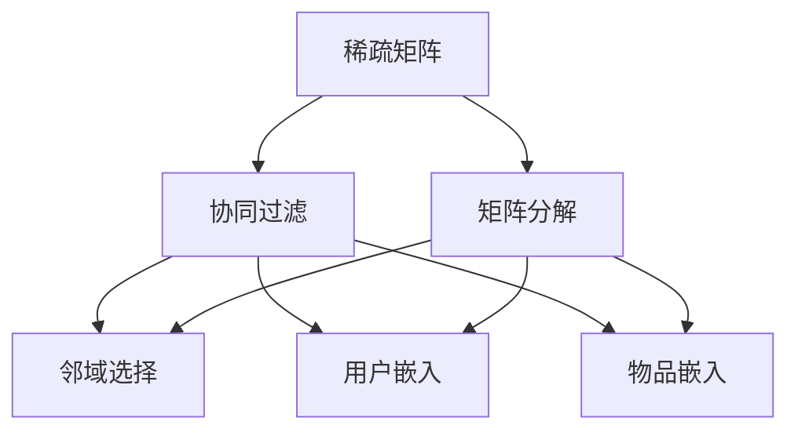

                 

## 1. 背景介绍

在互联网时代，推荐系统（Recommender Systems）已成为提升用户体验、驱动业务增长的重要工具。从电商平台的商品推荐，到视频网站的个性化内容推荐，推荐系统已经被广泛应用于众多领域。然而，推荐系统在发展过程中，也面临诸多挑战，其中最显著的即是数据稀疏性问题。

### 1.1 问题由来

推荐系统通常依赖用户和物品的互动数据（如评分、点击、浏览等）构建模型。但实际应用中，这些互动数据往往非常稀疏，即大部分用户和物品之间没有交互记录。如何从稀疏数据中学习出高精度的推荐模型，是一个极具挑战性的问题。

数据稀疏性不仅影响推荐精度，还可能导致冷启动问题，即新物品或新用户难以获得推荐，用户难以发现感兴趣的内容，进而影响系统粘性和业务效果。因此，如何有效应对数据稀疏性，成为推荐系统研究和应用的重点方向之一。

### 1.2 问题核心关键点

在推荐系统中，数据稀疏性问题通常通过以下三种方式来描述：

1. **用户-物品（User-Item）稀疏性**：用户和物品之间互动的稀疏性，大部分用户或物品没有其他用户或物品的交互数据。
2. **物品-物品（Item-Item）稀疏性**：物品之间的关联数据稀疏，无法构建出完整的物品相似性矩阵。
3. **用户-用户（User-User）稀疏性**：用户之间的关联数据稀疏，难以构建用户兴趣的相似性图。

## 2. 核心概念与联系

### 2.1 核心概念概述

为更好地理解如何应对推荐系统中的数据稀疏性，本节将介绍几个关键概念：

- **稀疏矩阵**：在推荐系统中，用户和物品的交互矩阵往往非常稀疏，大部分位置是0，表示没有互动。
- **协同过滤（Collaborative Filtering, CF）**：一种基于用户和物品互动数据的推荐方法，通过预测未互动过物品的用户评分或预测未互动过用户的物品评分，从而推荐相似物品。
- **矩阵分解（Matrix Factorization, MF）**：将用户-物品矩阵分解为两个低维矩阵（用户特征矩阵和物品特征矩阵），以降低维度、捕捉隐含的用户-物品关联。
- **邻域选择（Neighborhood Selection）**：在协同过滤中，如何选择用户或物品的“邻居”，对推荐性能有重要影响。
- **用户嵌入（User Embedding）**：将用户映射到低维空间中的向量表示，便于计算相似性、捕捉用户兴趣。
- **物品嵌入（Item Embedding）**：将物品映射到低维空间中的向量表示，便于计算相似性、捕捉物品属性。

这些核心概念之间的逻辑关系可以通过以下Mermaid流程图来展示：



这个流程图展示了几类推荐方法的基本流程：

1. 稀疏矩阵是推荐系统的核心输入。
2. 协同过滤和矩阵分解是两种常用的推荐方法，可以通过分解稀疏矩阵来降低维度。
3. 邻域选择、用户嵌入和物品嵌入，是在协同过滤和矩阵分解中常用的技术手段。

## 3. 核心算法原理 & 具体操作步骤
### 3.1 算法原理概述

推荐系统中的数据稀疏性问题，本质上是如何在有限的数据下学习出准确的推荐模型。常见的推荐方法包括基于协同过滤、矩阵分解、基于内容的推荐等。这些方法通过不同技术手段，试图从稀疏数据中捕捉用户-物品间的关联性。

### 3.2 算法步骤详解

#### 3.2.1 协同过滤

协同过滤（Collaborative Filtering, CF）是推荐系统中最早提出的方法之一，通过预测用户对未交互物品的评分，来推荐相似物品。其基本步骤如下：

1. **用户和物品的评分矩阵**：构建用户-物品评分矩阵 $R$，其中 $R_{ui} = r_{ui}$ 表示用户 $u$ 对物品 $i$ 的评分。

2. **用户相似性计算**：对于用户 $u$，计算其与所有其他用户 $v$ 的相似度，通常使用余弦相似度或皮尔逊相关系数等。

3. **物品相似性计算**：对于物品 $i$，计算其与所有其他物品 $j$ 的相似度。

4. **预测用户评分**：对于未交互过的物品 $i$，根据用户 $u$ 的相似用户 $v$ 对该物品的评分，通过加权平均得到预测评分。

5. **推荐物品**：根据预测评分从高到低排序，选取前 $k$ 个物品进行推荐。

#### 3.2.2 矩阵分解

矩阵分解（Matrix Factorization, MF）是另一种常用的推荐方法，其基本思想是将用户-物品矩阵 $R$ 分解为两个低维矩阵 $P$ 和 $Q$，从而降低维度、捕捉隐含的关联。具体步骤如下：

1. **初始化参数**：设置用户特征矩阵 $P$ 和物品特征矩阵 $Q$，并随机初始化其值。

2. **预测用户评分**：通过矩阵 $P$ 和 $Q$ 计算用户 $u$ 对物品 $i$ 的预测评分 $p_{ui} = P_{ui} \times Q_{iu}$。

3. **优化损失函数**：使用均方误差等损失函数，最小化预测评分与实际评分之间的差距。

4. **参数更新**：通过梯度下降等优化算法更新矩阵 $P$ 和 $Q$ 的参数。

5. **推荐物品**：根据预测评分从高到低排序，选取前 $k$ 个物品进行推荐。

#### 3.2.3 邻域选择

邻域选择（Neighborhood Selection）是协同过滤中的重要步骤，用于确定用户或物品的“邻居”。常见的邻域选择方法包括基于相似度的方法、基于图论的方法等。

1. **基于相似度的方法**：根据用户和物品的评分数据，选择与目标用户或物品评分最接近的其他用户或物品作为邻居。

2. **基于图论的方法**：构建用户相似性图或物品相似性图，使用邻接矩阵表示。在图论方法中，可以应用PageRank等算法计算用户或物品的权重，从而选择邻居。

### 3.3 算法优缺点

协同过滤和矩阵分解方法各有优缺点：

**协同过滤的优点**：
1. 能够捕捉用户和物品间的隐含关联。
2. 不需要任何领域知识，简单易实现。

**协同过滤的缺点**：
1. 冷启动问题：新用户或新物品没有足够的历史互动数据，无法进行推荐。
2. 数据稀疏性：大部分用户和物品之间没有互动，导致推荐精度下降。
3. 可解释性差：协同过滤模型通常被视为“黑盒”，难以解释其内部决策过程。

**矩阵分解的优点**：
1. 能够有效降低数据维度，减少计算复杂度。
2. 能够捕捉用户和物品间的隐含关联。

**矩阵分解的缺点**：
1. 需要预定义特征维度，难以确定最优维度。
2. 需要较多计算资源，训练时间长。
3. 对噪声数据敏感，容易过拟合。

### 3.4 算法应用领域

协同过滤和矩阵分解方法在推荐系统中的应用非常广泛，覆盖了几乎所有类型的推荐场景。

1. **电商推荐**：电商平台上，通过用户浏览、点击、购买等行为数据，推荐用户可能感兴趣的商品。
2. **内容推荐**：视频网站、新闻平台等，根据用户的历史观看、阅读行为，推荐相关视频、文章等。
3. **社交推荐**：社交网络平台，根据用户的社交关系和行为数据，推荐用户可能感兴趣的朋友、内容等。
4. **音乐推荐**：音乐平台上，根据用户的听歌历史和行为数据，推荐用户可能喜欢的歌曲、歌单等。

除了这些传统应用外，协同过滤和矩阵分解方法也在不断扩展应用领域，如广告推荐、游戏推荐等。

## 4. 数学模型和公式 & 详细讲解 & 举例说明
### 4.1 数学模型构建

本节将使用数学语言对协同过滤和矩阵分解方法进行更加严格的刻画。

假设用户-物品评分矩阵 $R$ 为 $n \times m$ 的稀疏矩阵，其中 $n$ 为物品数量，$m$ 为用户数量。

协同过滤方法通过预测用户对未交互物品的评分，进行推荐。其损失函数通常定义为均方误差：

$$
L = \frac{1}{2} \sum_{(i,j) \in R_{ui}} (r_{ui} - \hat{r}_{ui})^2
$$

其中 $r_{ui}$ 为实际评分，$\hat{r}_{ui}$ 为预测评分。

### 4.2 公式推导过程

#### 4.2.1 协同过滤

在协同过滤中，预测用户对未交互物品的评分，通常使用基于用户的协同过滤方法。其基本公式为：

$$
\hat{r}_{ui} = \sum_{j=1}^m \alpha_j r_{uj} - \frac{1}{2} \alpha^2 \sum_{i=1}^m \sum_{j=1}^m r_{ij} r_{uj}
$$

其中 $\alpha_j$ 为用户的权重，$r_{uj}$ 为用户 $u$ 对物品 $j$ 的评分。

基于用户的协同过滤方法，可通过优化损失函数 $L$，求解 $\alpha$ 的矩阵形式：

$$
\hat{R} = \alpha R
$$

其中 $\hat{R}$ 为预测评分矩阵。

#### 4.2.2 矩阵分解

矩阵分解方法通过将用户-物品评分矩阵 $R$ 分解为两个低维矩阵 $P$ 和 $Q$，捕捉用户和物品的隐含关联。其基本公式为：

$$
R \approx P \times Q^T
$$

其中 $P$ 为用户特征矩阵，$Q$ 为物品特征矩阵。矩阵 $P$ 和 $Q$ 的维度通常小于 $R$ 的维度。

在矩阵分解中，通常使用均方误差损失函数：

$$
L = \frac{1}{2} \sum_{(i,j) \in R_{ui}} (r_{ui} - p_{ui} \times q_{iu})^2
$$

其中 $p_{ui}$ 为用户 $u$ 对物品 $i$ 的预测评分，$q_{iu}$ 为物品 $i$ 的预测评分。

通过梯度下降等优化算法，最小化损失函数 $L$，求得矩阵 $P$ 和 $Q$ 的参数。

### 4.3 案例分析与讲解

以电商推荐为例，分析协同过滤和矩阵分解方法的具体应用。

**协同过滤案例**：
假设某电商平台上，用户 $u$ 对物品 $i$ 的实际评分为 $r_{ui}=4$。通过协同过滤方法，选取与用户 $u$ 相似度最高的用户 $v$ 的评分数据，计算出用户 $u$ 对物品 $i$ 的预测评分 $\hat{r}_{ui} = 4$。假设用户 $u$ 对物品 $i$ 的评分数据不足，则无法使用协同过滤方法进行推荐。

**矩阵分解案例**：
假设电商平台上，用户 $u$ 对物品 $i$ 的实际评分为 $r_{ui}=4$。通过矩阵分解方法，将用户-物品评分矩阵 $R$ 分解为两个低维矩阵 $P$ 和 $Q$，分别表示用户和物品的特征。假设 $P$ 和 $Q$ 的维度为 $10 \times 10$，则可以通过计算 $\hat{r}_{ui} = p_{ui} \times q_{iu}$ 得到用户 $u$ 对物品 $i$ 的预测评分。矩阵分解方法在电商推荐中广泛应用，能够有效降低维度、捕捉隐含关联，且计算复杂度较低。

## 5. 项目实践：代码实例和详细解释说明
### 5.1 开发环境搭建

在进行推荐系统微调实践前，我们需要准备好开发环境。以下是使用Python进行Scikit-learn开发的环境配置流程：

1. 安装Anaconda：从官网下载并安装Anaconda，用于创建独立的Python环境。

2. 创建并激活虚拟环境：
```bash
conda create -n recommendation-env python=3.8 
conda activate recommendation-env
```

3. 安装Scikit-learn：
```bash
pip install scikit-learn
```

4. 安装相关库：
```bash
pip install pandas numpy matplotlib seaborn scikit-learn jupyter notebook ipython
```

完成上述步骤后，即可在`recommendation-env`环境中开始推荐系统微调实践。

### 5.2 源代码详细实现

这里以矩阵分解方法为例，使用Scikit-learn库进行电商推荐系统的微调。

首先，定义数据集处理函数：

```python
from sklearn.model_selection import train_test_split
import pandas as pd

def load_data(file_path):
    data = pd.read_csv(file_path)
    return train_test_split(data, test_size=0.2, random_state=42)

def preprocess_data(data, max_features):
    data = data[['user_id', 'item_id', 'rating']]
    data['user_id'] = data['user_id'].astype(int)
    data['item_id'] = data['item_id'].astype(int)
    data['rating'] = data['rating'].astype(float)
    data = data.rename(columns={'user_id': 'user', 'item_id': 'item', 'rating': 'rating'})
    data = data.dropna()
    return data, max_features

def split_train_test(data, max_features):
    train_data, test_data = load_data(data)
    train_data, val_data = train_test_split(train_data, test_size=0.1, random_state=42)
    train_data, test_data = preprocess_data(train_data, max_features)
    val_data, test_data = preprocess_data(val_data, max_features)
    return train_data, val_data, test_data
```

然后，定义模型训练和评估函数：

```python
from sklearn.decomposition import TruncatedSVD
from sklearn.metrics import mean_squared_error
import numpy as np

def train_model(data, max_features, num_factors):
    X = data[['user', 'item']]
    Y = data['rating']
    X_train, val_data, test_data = train_test_split(X, Y, test_size=0.1, random_state=42)
    X_train, val_data = preprocess_data(val_data, max_features)
    X_train, val_data = preprocess_data(X_train, max_features)
    
    svd = TruncatedSVD(n_components=num_factors)
    svd.fit(X_train)
    val_pred = svd.transform(val_data) @ svd.components_
    test_pred = svd.transform(X_train) @ svd.components_
    val_mse = mean_squared_error(val_data['rating'], val_pred)
    test_mse = mean_squared_error(test_data['rating'], test_pred)
    return val_mse, test_mse

def evaluate_model(val_mse, test_mse):
    print(f'Validation MSE: {val_mse:.3f}')
    print(f'Test MSE: {test_mse:.3f}')
```

最后，启动训练流程并在测试集上评估：

```python
from sklearn.decomposition import TruncatedSVD
from sklearn.metrics import mean_squared_error
import numpy as np

max_features = 100
num_factors = 10

val_mse, test_mse = train_model('data.csv', max_features, num_factors)
evaluate_model(val_mse, test_mse)
```

以上就是使用Scikit-learn对电商推荐系统进行矩阵分解微调的完整代码实现。可以看到，Scikit-learn库提供了丰富的机器学习算法和模型评估工具，可以方便地进行推荐系统的开发和评估。

### 5.3 代码解读与分析

让我们再详细解读一下关键代码的实现细节：

**load_data函数**：
- 加载数据集，使用train_test_split函数将其划分为训练集、验证集和测试集。
- 数据预处理，去除缺失值，转换为数值类型，并重命名列名。

**preprocess_data函数**：
- 对数据进行进一步预处理，将其转换为适合矩阵分解的形式。
- 数据标准化，将其转化为[0, 1]范围内的数值，方便后续计算。

**train_model函数**：
- 构建用户-物品矩阵 $X$ 和评分矩阵 $Y$。
- 将数据划分为训练集、验证集和测试集。
- 对验证集和测试集进行预处理。
- 使用TruncatedSVD算法进行矩阵分解，得到用户和物品的特征矩阵。
- 在验证集和测试集上计算均方误差（MSE），评估模型性能。

**evaluate_model函数**：
- 输出验证集和测试集的均方误差。

在实际应用中，还需要对推荐系统进行更全面的优化，如模型参数调优、特征工程、模型集成等。同时，需要考虑推荐系统的工程部署、性能优化、用户体验等问题，确保推荐系统的高效、稳定运行。

## 6. 实际应用场景
### 6.1 智能推荐系统

基于矩阵分解的推荐系统，能够广泛应用于电商、视频、音乐等智能推荐领域。通过用户和物品的评分数据，为用户推荐可能感兴趣的内容，提升用户体验和业务效果。

在技术实现上，可以收集用户和物品的互动数据，构建稀疏矩阵，使用矩阵分解方法进行推荐。推荐系统可以根据用户的历史行为，预测用户对未互动过物品的评分，进行推荐。

### 6.2 金融风险控制

在金融领域，推荐系统可以用于风险控制和反欺诈。通过收集用户的行为数据，构建用户画像，预测用户可能的风险行为，从而进行风险预警和控制。

在技术实现上，可以使用协同过滤或矩阵分解方法，构建用户和物品之间的关联矩阵。根据用户的行为数据，预测用户对潜在风险行为的评分，进行风险预警。

### 6.3 广告投放优化

广告投放是互联网公司的重要业务之一。通过推荐系统，可以为用户推荐更符合其兴趣的广告内容，提升广告投放的效果和转化率。

在技术实现上，可以收集用户的行为数据，构建用户-物品矩阵。使用协同过滤或矩阵分解方法，预测用户对未互动过广告的评分，进行广告投放优化。

### 6.4 未来应用展望

随着推荐系统的发展，未来的应用场景将更加多样化。

1. **个性化健康推荐**：在医疗领域，推荐系统可以为用户推荐个性化的健康方案、用药建议等，提升用户的健康水平。
2. **教育个性化学习**：在教育领域，推荐系统可以为用户推荐个性化的学习内容、课程推荐等，提升学习效果。
3. **内容动态生成**：在内容创作领域，推荐系统可以用于生成动态内容推荐列表，提升用户的阅读体验。

## 7. 工具和资源推荐
### 7.1 学习资源推荐

为了帮助开发者系统掌握推荐系统的理论基础和实践技巧，这里推荐一些优质的学习资源：

1. 《Recommender Systems: Advanced Topics》：这是一本系统介绍推荐系统理论和方法的书籍，内容涵盖协同过滤、矩阵分解、深度学习推荐等前沿内容。
2. 《Python for Recommendation Systems》：这是一本介绍推荐系统开发的Python实践书籍，提供了大量实际应用案例和代码示例。
3. 《Neural Network Recommendation Systems》：这是一本介绍深度学习推荐系统的书籍，详细讲解了基于深度神经网络的推荐方法。
4. Coursera上的《Recommender Systems》课程：由斯坦福大学开设的推荐系统课程，涵盖了推荐系统的基础理论和实践技巧。
5. Kaggle上的推荐系统竞赛：Kaggle平台上有多个推荐系统竞赛，通过实践竞赛数据，可以迅速提升推荐系统开发能力。

通过对这些资源的学习实践，相信你一定能够快速掌握推荐系统的精髓，并用于解决实际的推荐问题。

### 7.2 开发工具推荐

高效的开发离不开优秀的工具支持。以下是几款用于推荐系统微调开发的常用工具：

1. Scikit-learn：一个强大的机器学习库，提供了丰富的算法和模型评估工具，适合快速原型开发。
2. TensorFlow：由Google主导开发的深度学习框架，支持分布式训练和多种算法实现，适合大规模应用。
3. PyTorch：Facebook开发的深度学习框架，易于使用，支持动态图，适合研究型开发。
4. Jupyter Notebook：一个开源的交互式编程环境，方便进行代码开发和可视化展示。
5. Apache Spark：一个基于内存的分布式计算框架，支持大规模数据处理和推荐系统开发。

合理利用这些工具，可以显著提升推荐系统微调任务的开发效率，加快创新迭代的步伐。

### 7.3 相关论文推荐

推荐系统的发展离不开学界的持续研究。以下是几篇奠基性的相关论文，推荐阅读：

1. "Collaborative Filtering for Implicit Feedback Datasets"：由Sarwar等人提出，介绍了协同过滤的几种方法，包括基于用户、基于物品、基于混合等。
2. "Matrix Factorization Techniques for Recommender Systems"：由Koren等人提出，详细讲解了矩阵分解的方法，包括奇异值分解、矩阵梯度下降等。
3. "Factors of Influence on Serendipity in Recommendation Systems"：由Chen等人提出，介绍了推荐系统中的推荐兴趣与意外发现的关系，提出了基于隐含兴趣的多元推荐模型。
4. "Deep Matrix Factorization"：由Wang等人提出，介绍了基于深度学习的矩阵分解方法，利用卷积神经网络进行特征提取。
5. "Adaptive Matrix Factorization"：由Zhang等人提出，介绍了自适应矩阵分解方法，可以动态调整特征矩阵的维度。

这些论文代表了大推荐系统的发展脉络。通过学习这些前沿成果，可以帮助研究者把握学科前进方向，激发更多的创新灵感。

## 8. 总结：未来发展趋势与挑战
### 8.1 总结

本文对推荐系统中的数据稀疏性问题进行了全面系统的介绍。首先阐述了推荐系统在数据稀疏性问题上所面临的挑战，明确了推荐系统研究和应用的重点方向。其次，从原理到实践，详细讲解了协同过滤和矩阵分解方法的数学原理和关键步骤，给出了推荐系统微调任务开发的完整代码实例。同时，本文还广泛探讨了推荐系统在智能推荐、金融风险控制、广告投放等多个领域的应用前景，展示了推荐系统技术的广阔前景。

通过本文的系统梳理，可以看到，推荐系统中的数据稀疏性问题虽然具有挑战性，但通过协同过滤、矩阵分解等技术手段，已经在各个应用场景中取得了显著效果。未来，随着深度学习、自监督学习等技术的发展，推荐系统的表现将更加卓越。

### 8.2 未来发展趋势

展望未来，推荐系统的发展将呈现以下几个趋势：

1. **深度学习推荐**：深度学习推荐系统将进一步优化，以提升推荐精度和多样性。利用深度神经网络，可以捕捉更加复杂的数据关联，提升推荐效果。
2. **自监督学习推荐**：自监督学习推荐系统将逐步取代协同过滤，成为推荐系统的主流范式。自监督学习可以从大规模未标注数据中学习到隐含的关联，提升推荐系统的泛化能力。
3. **混合推荐系统**：混合推荐系统将结合协同过滤、矩阵分解、深度学习等多种推荐方法，形成更高效、稳定的推荐模型。
4. **联邦推荐系统**：联邦推荐系统将通过分布式协同，利用多方数据进行推荐，提升推荐精度，保护用户隐私。
5. **多模态推荐系统**：多模态推荐系统将结合文本、图像、语音等多种数据源，提升推荐系统的表现。

以上趋势凸显了推荐系统技术的持续演进和广泛应用，未来推荐系统将更加智能、高效、个性化。

### 8.3 面临的挑战

尽管推荐系统取得了巨大成功，但在迈向更加智能化、普适化应用的过程中，它仍面临诸多挑战：

1. **数据隐私保护**：推荐系统需要大量用户数据，如何在保护用户隐私的同时，获取高精度推荐数据，仍是一个难题。
2. **冷启动问题**：新用户或新物品难以获得推荐，需要更高效、鲁棒的冷启动策略。
3. **计算资源消耗**：深度学习推荐系统需要大量的计算资源，如何在保证性能的同时，降低计算成本，仍是一个挑战。
4. **模型可解释性**：推荐系统通常被视为“黑盒”，难以解释其内部决策过程，需要更多可解释性技术支持。
5. **系统安全性**：推荐系统可能被恶意利用，导致安全风险，需要在算法设计和系统设计上加强安全性。

正视推荐系统面临的这些挑战，积极应对并寻求突破，将使推荐系统技术不断成熟，为推荐系统应用的深入发展提供有力支持。

### 8.4 研究展望

面对推荐系统所面临的种种挑战，未来的研究需要在以下几个方面寻求新的突破：

1. **深度学习推荐系统**：利用深度神经网络，捕捉更加复杂的数据关联，提升推荐精度和多样性。
2. **自监督学习推荐系统**：从大规模未标注数据中学习隐含关联，提升推荐系统的泛化能力。
3. **联邦推荐系统**：通过分布式协同，利用多方数据进行推荐，提升推荐精度，保护用户隐私。
4. **多模态推荐系统**：结合多种数据源，提升推荐系统的表现。
5. **推荐系统可解释性**：引入可解释性技术，提升推荐系统的透明度和可信度。

这些研究方向的探索，将引领推荐系统技术迈向更高的台阶，为推荐系统应用的深入发展提供有力支持。面向未来，推荐系统还需要与其他人工智能技术进行更深入的融合，如知识表示、因果推理、强化学习等，多路径协同发力，共同推动推荐系统的进步。只有勇于创新、敢于突破，才能不断拓展推荐系统的边界，让智能推荐技术更好地造福人类社会。

## 9. 附录：常见问题与解答

**Q1：推荐系统如何应对数据稀疏性问题？**

A: 推荐系统通常采用协同过滤、矩阵分解等方法来应对数据稀疏性问题。协同过滤通过预测用户对未交互物品的评分，进行推荐；矩阵分解通过将用户-物品评分矩阵分解为两个低维矩阵，捕捉隐含的关联。这些方法能够有效处理数据稀疏性问题，提升推荐精度。

**Q2：协同过滤和矩阵分解方法各有什么优缺点？**

A: 协同过滤和矩阵分解方法各有优缺点：

**协同过滤的优点**：
1. 能够捕捉用户和物品间的隐含关联。
2. 不需要任何领域知识，简单易实现。

**协同过滤的缺点**：
1. 冷启动问题：新用户或新物品没有足够的历史互动数据，无法进行推荐。
2. 数据稀疏性：大部分用户和物品之间没有互动，导致推荐精度下降。
3. 可解释性差：协同过滤模型通常被视为“黑盒”，难以解释其内部决策过程。

**矩阵分解的优点**：
1. 能够有效降低数据维度，减少计算复杂度。
2. 能够捕捉用户和物品间的隐含关联。

**矩阵分解的缺点**：
1. 需要预定义特征维度，难以确定最优维度。
2. 需要较多计算资源，训练时间长。
3. 对噪声数据敏感，容易过拟合。

**Q3：推荐系统中的自监督学习方法有哪些？**

A: 推荐系统中的自监督学习方法主要包括：

1. **隐含语义建模（LSM）**：通过用户和物品的隐含语义向量，构建用户-物品关联矩阵。
2. **三元组嵌入（Triple Embedding）**：将用户、物品和评分构成三元组，通过深度神经网络学习向量表示。
3. **关系图神经网络（GNN）**：通过图神经网络，捕捉用户和物品之间的复杂关系，提升推荐精度。

自监督学习方法能够利用大规模未标注数据，提升推荐系统的泛化能力，但相对于协同过滤和矩阵分解，其算法复杂度较高，需要更多的计算资源。

**Q4：推荐系统中的用户嵌入和物品嵌入有什么作用？**

A: 用户嵌入和物品嵌入在推荐系统中起到了重要的作用，其作用主要包括：

1. **捕捉用户兴趣和物品属性**：通过向量表示，能够更好地捕捉用户的兴趣偏好和物品的属性特征。
2. **提高推荐精度**：通过相似性计算，能够推荐更符合用户兴趣和物品属性的推荐结果。
3. **降低计算复杂度**：通过将高维数据映射到低维空间，能够降低计算复杂度，提升系统效率。

用户嵌入和物品嵌入是推荐系统中的关键组件，能够显著提升推荐系统的表现。

**Q5：推荐系统中的推荐精度如何衡量？**

A: 推荐系统中的推荐精度通常通过以下指标进行衡量：

1. **准确率（Accuracy）**：推荐系统正确推荐的数量与总推荐数量的比例。
2. **召回率（Recall）**：推荐系统正确推荐的数量与总正样本数量的比例。
3. **F1值（F1-score）**：准确率和召回率的调和平均，综合衡量推荐系统的性能。
4. **平均绝对误差（MAE）**：预测评分与真实评分的绝对误差，用于衡量推荐系统的均方误差。
5. **均方根误差（RMSE）**：预测评分与真实评分的平方误差，用于衡量推荐系统的均方误差。

以上指标能够全面评估推荐系统的推荐精度和效果。

---

作者：禅与计算机程序设计艺术 / Zen and the Art of Computer Programming

