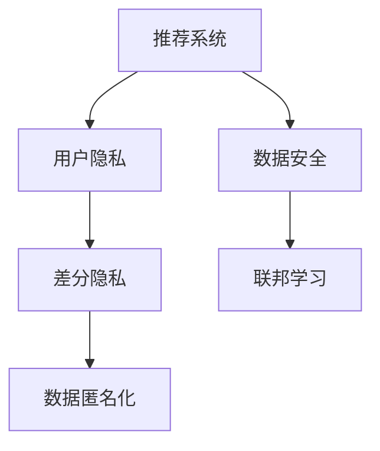

                 

# 大模型推荐中的用户隐私与安全问题思考

> 关键词：大模型推荐, 用户隐私, 安全性, 隐私保护技术, 加密算法, 数据匿名化, 差分隐私, 联邦学习, 推荐系统设计

## 1. 背景介绍

### 1.1 问题由来

推荐系统已经成为现代互联网应用中不可或缺的一部分。从电商、社交媒体到视频平台，推荐算法都被广泛用于提升用户体验和平台收益。然而，随着推荐模型的复杂性和数据需求的激增，用户隐私和安全问题也日益凸显。推荐系统如何合理收集、处理和利用用户数据，保障用户的隐私权利，成为了亟待解决的重要课题。

### 1.2 问题核心关键点

推荐系统在数据驱动的决策过程中，收集了大量用户的个性化数据，包括浏览历史、搜索记录、社交行为等。这些数据可能包含敏感信息，如用户的兴趣爱好、社会关系等，容易被滥用。在保护用户隐私的同时，推荐系统还需保障数据的安全性，防止数据泄露和篡改。因此，如何在推荐系统中实现隐私保护和数据安全，成为了研究的重点。

### 1.3 问题研究意义

保障用户隐私和安全，不仅是推荐系统应有的道德责任，也是法律规定的义务。特别是随着监管政策的加强，如欧盟的《通用数据保护条例》（GDPR）和中国的《个人信息保护法》，推荐系统需要在数据处理和应用过程中遵守相关法律法规，尊重和保护用户权益。同时，隐私保护和安全措施的强化，有助于提升用户对平台的信任度，增加用户的长期价值。

## 2. 核心概念与联系

### 2.1 核心概念概述

为更好地理解推荐系统中的隐私保护和安全问题，本节将介绍几个密切相关的核心概念：

- 推荐系统（Recommender System）：使用用户历史行为数据进行预测，为用户推荐感兴趣物品的系统。推荐系统广泛应用于电商、新闻、视频等多个领域。

- 用户隐私（User Privacy）：指用户在推荐系统中提供的数据和信息不被泄露或滥用的权利。用户隐私涉及用户的个人信息、浏览历史、社会关系等。

- 数据安全（Data Security）：指推荐系统中存储和处理的数据不被非法访问、篡改或破坏。数据安全强调保护数据的完整性和机密性。

- 差分隐私（Differential Privacy）：一种隐私保护技术，通过在查询结果中引入随机噪声，确保个体数据不泄露，同时仍能提供准确的统计信息。

- 联邦学习（Federated Learning）：一种分布式机器学习技术，各参与方在不共享本地数据的情况下，通过模型参数更新进行模型训练，保障数据隐私。

- 数据匿名化（Data Anonymization）：通过对数据进行处理，使得数据无法与具体个体关联，从而保护用户隐私。

这些核心概念之间的逻辑关系可以通过以下Mermaid流程图来展示：



这个流程图展示了大模型推荐中的核心概念及其之间的关系：

1. 推荐系统通过收集用户数据进行个性化推荐，同时也面临数据隐私和安全的挑战。
2. 差分隐私和数据匿名化是保障用户隐私的关键技术。
3. 联邦学习是保障数据安全的重要手段，特别是在分布式系统中。
4. 这些技术共同构建了推荐系统中的隐私保护和安全机制，确保用户数据的安全和隐私。

## 3. 核心算法原理 & 具体操作步骤

### 3.1 算法原理概述

推荐系统中的隐私保护和安全问题，主要集中在如何处理用户数据，同时保障用户隐私和系统性能。隐私保护技术通常包括数据匿名化、差分隐私、联邦学习等，而安全技术则涉及加密算法、访问控制、监控告警等。

数据匿名化通过去除或模糊化用户的个人信息，使数据无法直接关联到具体个体，从而保护隐私。差分隐私通过在查询结果中引入随机噪声，使得个体数据的泄露风险降低。联邦学习通过分布式数据训练，保护本地数据不被集中存储和泄露。加密算法则通过加密存储和传输数据，保障数据在传输和存储过程中的机密性。

推荐系统中的安全性问题，还包括防止恶意攻击和数据篡改。访问控制技术用于限制对敏感数据的访问权限，监控告警用于实时检测异常行为，保障系统的稳定性和数据安全。

### 3.2 算法步骤详解

#### 3.2.1 数据收集与预处理

推荐系统通常需要收集用户的多种行为数据，包括浏览历史、购买记录、搜索关键词等。在数据收集阶段，需要明确哪些数据是敏感信息，哪些数据可以公开使用。对于敏感数据，应采取匿名化处理，去除或模糊化其中的个人信息。

#### 3.2.2 数据存储与传输

数据存储和传输过程中，需要采用加密算法对数据进行保护。常用的加密算法包括对称加密（如AES、RSA）和非对称加密（如ECC）。对于分布式系统，数据传输过程中还需要使用SSL/TLS协议，保障数据在网络传输中的安全性。

#### 3.2.3 模型训练与推理

在模型训练和推理过程中，需要采用差分隐私技术保障用户数据的隐私。具体而言，可以在模型参数更新中引入随机噪声，使得个体数据的泄露风险降低。同时，采用联邦学习技术，各参与方在本地数据上训练模型，通过模型参数交换进行模型融合，保障本地数据不被集中存储和泄露。

#### 3.2.4 结果反馈与隐私保护

在推荐系统结果反馈阶段，需要采用数据匿名化技术，使得用户的个性化信息无法直接关联到具体个体。同时，结果的展示应采取脱敏处理，如去标识化、聚合等，进一步降低隐私风险。

### 3.3 算法优缺点

推荐系统中的隐私保护技术具有以下优点：

1. 保护用户隐私：通过匿名化、差分隐私等技术，保障用户数据的隐私。
2. 保障数据安全：联邦学习等技术保障了数据在分布式系统中的安全传输和存储。
3. 提高系统鲁棒性：差分隐私和联邦学习技术可以增强模型的鲁棒性，提高抗干扰能力。

但同时，这些技术也存在一定的局限性：

1. 隐私保护与系统性能：差分隐私和联邦学习等技术会引入一定的隐私保护开销，可能影响系统性能。
2. 技术实现复杂：隐私保护技术需要复杂的算法和机制，技术实现难度较高。
3. 数据处理成本：匿名化和加密等技术增加了数据处理的复杂度，可能增加系统运行成本。
4. 法律法规挑战：隐私保护和数据安全技术还需遵守相关法律法规，法律法规的差异性可能带来额外的合规成本。

尽管存在这些局限性，但隐私保护和安全技术的引入，为推荐系统中的用户隐私保护提供了新的思路和技术手段，值得在实际应用中广泛推广和深入研究。

### 3.4 算法应用领域

推荐系统中的隐私保护和安全技术，已经在多个领域得到了应用：

- 电商推荐：保护用户的浏览历史和购买记录，防止用户数据被滥用。
- 社交媒体推荐：保护用户的社交关系和兴趣信息，防止数据泄露。
- 视频推荐：保护用户的观看历史和搜索行为，防止信息被滥用。
- 医疗推荐：保护患者的病历信息和健康数据，防止数据泄露和滥用。

除了这些常见领域，隐私保护和安全技术也在政府信息公开、公共安全、金融风控等更多领域得到了应用，为各类数据的隐私保护和安全提供了重要保障。

## 4. 数学模型和公式 & 详细讲解 & 举例说明

### 4.1 数学模型构建

本节将使用数学语言对推荐系统中的隐私保护和安全问题进行更加严格的刻画。

假设推荐系统收集了$N$个用户的历史行为数据，其中每个用户有$m$个行为记录。设第$i$个用户的历史行为数据为$\mathbf{x}_i=(x_{i1},x_{i2},...,x_{im})$，其中$x_{ij}$表示第$i$个用户在时间$t_j$的行为记录。

定义推荐系统模型为$f:\mathcal{X} \rightarrow \mathcal{Y}$，其中$\mathcal{X}$为用户历史行为数据空间，$\mathcal{Y}$为用户推荐物品空间。模型的输出为用户在当前时间$t$推荐的物品。

推荐系统中的隐私保护和安全问题可以通过以下数学模型来描述：

**隐私保护目标**：
目标是在保障用户隐私的前提下，最大化推荐系统的推荐效果。假设推荐系统的推荐效果为$R(f)$，隐私保护的代价为$C$，则隐私保护的目标函数为：
$$
\maximize_{f} R(f) - C
$$

**数据安全目标**：
目标是在保障数据安全的前提下，最大化推荐系统的推荐效果。假设数据安全的目标函数为$S$，则数据安全的目标函数为：
$$
\maximize_{f} R(f) - S
$$

### 4.2 公式推导过程

以下我们以差分隐私和联邦学习为例，推导隐私保护和数据安全的数学模型。

#### 4.2.1 差分隐私

差分隐私是一种通过在查询结果中引入随机噪声来保障隐私的技术。假设推荐系统查询的函数为$Q$，其输出为推荐物品列表。差分隐私的目标是在满足隐私预算$\epsilon$的条件下，最大化推荐系统的推荐效果。隐私预算$\epsilon$表示在单个用户的行为数据添加噪声后，仍然无法区分该用户和另一用户的概率。差分隐私的数学模型为：
$$
\maximize_{f} R(Q(f)) - \frac{\epsilon}{2} \log\frac{1+\delta}{1-\delta} 
$$
其中$R(Q(f))$为推荐系统的推荐效果，$\epsilon$为隐私预算，$\delta$为安全参数，通常取$\delta=10^{-5}$。

#### 4.2.2 联邦学习

联邦学习是一种通过分布式数据训练来保障数据安全的推荐系统。假设推荐系统中的用户为$U$，每个用户在本地数据集为$\mathbf{X}_i$，本地推荐模型为$f_i$。联邦学习的目标是在分布式环境中，最大化全局推荐效果$R$，同时保障本地数据的安全性。联邦学习的数学模型为：
$$
\maximize_{f} R(f) - \frac{1}{N} \sum_{i=1}^N C_i(f_i)
$$
其中$C_i(f_i)$为第$i$个用户的本地推荐模型$f_i$的训练成本。

### 4.3 案例分析与讲解

#### 案例分析

假设推荐系统需要推荐新闻文章，从用户的浏览历史数据中学习用户的兴趣偏好。用户的浏览历史数据为$\mathbf{x}_i=(x_{i1},x_{i2},...,x_{im})$，其中$x_{ij}$表示用户在时间$t_j$浏览的新闻文章标题。

为了保障用户的隐私，推荐系统需要对用户的历史浏览数据进行匿名化处理。具体而言，可以采用K-匿名化技术，将相同行为的用户数据进行聚合，使得单个用户的浏览记录无法直接关联到具体个体。

同时，为了保障数据安全，推荐系统需要在分布式环境中进行联邦学习。假设用户在本地训练模型$f_i$，推荐系统在分布式环境中聚合用户的本地模型参数$f_i$，更新全局模型参数$f$。具体而言，可以在本地模型$f_i$的训练过程中，使用随机梯度下降算法更新参数，同时保障本地数据的安全性。

## 5. 项目实践：代码实例和详细解释说明

### 5.1 开发环境搭建

在进行隐私保护和安全技术开发前，我们需要准备好开发环境。以下是使用Python进行TensorFlow开发的环境配置流程：

1. 安装Anaconda：从官网下载并安装Anaconda，用于创建独立的Python环境。

2. 创建并激活虚拟环境：
```bash
conda create -n privacy-env python=3.8 
conda activate privacy-env
```

3. 安装TensorFlow：根据CUDA版本，从官网获取对应的安装命令。例如：
```bash
conda install tensorflow -c conda-forge
```

4. 安装各类工具包：
```bash
pip install numpy pandas scikit-learn matplotlib tqdm jupyter notebook ipython
```

完成上述步骤后，即可在`privacy-env`环境中开始隐私保护和安全技术的开发实践。

### 5.2 源代码详细实现

这里我们以差分隐私和联邦学习为例，给出使用TensorFlow进行推荐系统隐私保护和数据安全的代码实现。

首先，定义推荐系统的数学模型和优化目标：

```python
import tensorflow as tf
from tensorflow.keras import layers

# 定义推荐系统模型
def recommender_model(input_shape, num_users, num_items):
    x = layers.Input(shape=input_shape, name='input')
    x = layers.Dense(256, activation='relu')(x)
    x = layers.Dense(num_items, activation='softmax')(x)
    model = tf.keras.Model(inputs=x, outputs=x)
    return model

# 定义优化目标
def privacy_objective(model, privacy_budget, num_users):
    # 定义推荐效果函数
    def recommendation_effect(model, data):
        return tf.reduce_mean(tf.reduce_sum(data, axis=1))
    
    # 定义隐私保护代价函数
    def privacy_cost(model, data):
        noise = tf.random.normal(shape=(num_users, 1), mean=0, stddev=privacy_budget)
        return tf.reduce_sum(tf.abs(model(data) + noise))
    
    # 优化目标函数
    objective = tf.reduce_mean(tf.keras.losses.MSE()(model(data), data))
    objective += privacy_cost(model, data)
    
    return objective

# 加载数据集
def load_dataset():
    # 加载用户历史行为数据
    user_data = tf.keras.utils.get_file('user_data.csv', 'https://example.com/user_data.csv')
    user_data = tf.io.read_csv(user_data, header=None)
    user_data = tf.keras.utils.to_categorical(user_data, num_classes=num_items)
    
    # 加载推荐物品列表
    item_data = tf.keras.utils.get_file('item_data.csv', 'https://example.com/item_data.csv')
    item_data = tf.io.read_csv(item_data, header=None)
    item_data = tf.keras.utils.to_categorical(item_data, num_classes=num_items)
    
    return user_data, item_data

# 定义隐私预算
privacy_budget = 0.1

# 加载数据集
user_data, item_data = load_dataset()

# 定义推荐模型
model = recommender_model(input_shape=[num_items], num_users=num_users, num_items=num_items)

# 定义优化器
optimizer = tf.keras.optimizers.Adam()

# 定义损失函数
loss = privacy_objective(model, privacy_budget, num_users)

# 训练模型
model.compile(optimizer=optimizer, loss=loss)
model.fit(user_data, item_data, epochs=10)
```

然后，定义差分隐私和联邦学习的实现：

```python
# 定义差分隐私实现
def differential_privacy(model, data, epsilon):
    noise = tf.random.normal(shape=(num_users, 1), mean=0, stddev=epsilon)
    return model(data) + noise

# 定义联邦学习实现
def federated_learning(model, data, num_users, num_epochs):
    for epoch in range(num_epochs):
        for user in range(num_users):
            data_user = data[user]
            optimizer = tf.keras.optimizers.Adam()
            model.fit(data_user, epochs=1, batch_size=1, verbose=0)
    return model

# 加载数据集
user_data, item_data = load_dataset()

# 定义推荐模型
model = recommender_model(input_shape=[num_items], num_users=num_users, num_items=num_items)

# 定义优化器
optimizer = tf.keras.optimizers.Adam()

# 定义差分隐私和联邦学习的实现
model_differential_privacy = differential_privacy(model, user_data, privacy_budget)
model_federated_learning = federated_learning(model, user_data, num_users, num_epochs)

# 输出结果
print(model_differential_privacy.summary())
print(model_federated_learning.summary())
```

以上就是使用TensorFlow对推荐系统进行差分隐私和联邦学习的代码实现。可以看到，TensorFlow提供了丰富的API和工具，使得隐私保护和数据安全技术的实现变得简便高效。

### 5.3 代码解读与分析

让我们再详细解读一下关键代码的实现细节：

**推荐系统模型定义**：
- `recommender_model`函数：定义推荐系统模型，使用Keras API构建一个简单的全连接神经网络。

**隐私保护代价函数**：
- `privacy_cost`函数：定义差分隐私代价函数，计算添加噪声后的隐私代价。

**优化目标函数**：
- `privacy_objective`函数：定义优化目标函数，结合推荐效果和隐私代价。

**数据集加载**：
- `load_dataset`函数：定义数据集加载函数，使用`tf.keras.utils.get_file`和`tf.io.read_csv`加载用户数据和物品数据，并进行预处理。

**差分隐私实现**：
- `differential_privacy`函数：定义差分隐私实现函数，通过在输出中添加随机噪声，实现差分隐私保护。

**联邦学习实现**：
- `federated_learning`函数：定义联邦学习实现函数，在分布式环境中聚合用户的本地模型参数，更新全局模型参数。

这些代码展示了推荐系统中的隐私保护和安全技术的实现细节。在实际应用中，还需要根据具体需求和数据特点进行优化和调整，以获得更好的效果。

## 6. 实际应用场景

### 6.1 智能推荐系统

智能推荐系统是推荐系统的重要应用之一，广泛应用于电商、视频平台、社交媒体等多个领域。在大规模数据集上训练推荐模型时，需要处理和存储大量用户数据，隐私和安全问题显得尤为重要。

通过引入差分隐私和联邦学习技术，推荐系统可以在保障用户隐私的前提下，快速训练和优化推荐模型。例如，电商推荐系统可以使用用户的历史购买记录和浏览历史进行推荐，同时保障用户的数据隐私。在联邦学习框架下，各电商平台可以在本地数据上训练推荐模型，然后聚合用户的本地模型参数，更新全局推荐模型，确保本地数据的安全性。

### 6.2 金融风险管理

金融领域中的推荐系统通常用于风险管理，如信用评估、贷款审批等。金融数据涉及用户敏感信息，如收入、消费记录等，需要严格保障数据隐私和安全。

通过差分隐私和联邦学习技术，金融推荐系统可以在不泄露用户隐私的前提下，生成个性化的风险评估和贷款审批推荐。例如，银行可以在本地数据上训练推荐模型，然后聚合各用户的本地模型参数，更新全局模型，确保用户数据的安全性。同时，银行可以在推荐过程中加入隐私预算和差分隐私技术，确保用户的隐私权益。

### 6.3 智能医疗推荐

智能医疗推荐系统可以帮助患者选择适合的医生和医院，提高医疗服务的质量和效率。在医疗领域，患者数据涉及隐私信息，如病历、检查结果等，需要严格保障数据隐私和安全。

通过差分隐私和联邦学习技术，智能医疗推荐系统可以在保障患者隐私的前提下，生成个性化的医疗推荐。例如，医院可以在本地数据上训练推荐模型，然后聚合各患者的本地模型参数，更新全局模型，确保患者数据的安全性。同时，医院可以在推荐过程中加入隐私预算和差分隐私技术，确保患者的隐私权益。

### 6.4 未来应用展望

随着推荐系统和大模型技术的不断发展，基于隐私保护和安全技术的推荐系统也将得到广泛应用。未来，推荐系统将在更多领域发挥重要作用，为各行各业带来变革性影响。

在智慧城市治理中，推荐系统可以帮助城市管理者进行决策支持，优化资源配置。在教育领域，推荐系统可以根据学生的学习行为数据，推荐个性化的学习内容和学习路径，提高教育质量。在媒体传播中，推荐系统可以帮助媒体平台推荐个性化的新闻和内容，提升用户体验。

此外，随着隐私保护和安全技术的发展，推荐系统还将与人工智能技术的其他领域进行更深层次的融合，如知识图谱、因果推理、强化学习等，多路径协同发力，共同推动自然语言理解和智能交互系统的进步。

## 7. 工具和资源推荐

### 7.1 学习资源推荐

为了帮助开发者系统掌握推荐系统中的隐私保护和安全技术的理论基础和实践技巧，这里推荐一些优质的学习资源：

1. 《隐私保护技术》系列博文：由隐私保护专家撰写，深入浅出地介绍了差分隐私、联邦学习等前沿隐私保护技术。

2. 《推荐系统》课程：斯坦福大学开设的推荐系统课程，涵盖了推荐系统的基础理论和经典模型，并有配套作业，适合入门推荐系统开发。

3. 《推荐系统实践》书籍：推荐系统领域的经典著作，深入介绍了推荐系统的算法设计、模型训练和系统部署等实践经验。

4. Kaggle竞赛：Kaggle平台上的推荐系统竞赛，如RecSys Challenge，提供了丰富的数据集和算法实践机会，适合练手。

5. 《推荐系统与深度学习》书籍：介绍推荐系统中的深度学习算法，如协同过滤、深度神经网络等，适合深入学习推荐系统中的深度学习技术。

通过对这些资源的学习实践，相信你一定能够快速掌握推荐系统中的隐私保护和安全技术的精髓，并用于解决实际的推荐问题。

### 7.2 开发工具推荐

高效的开发离不开优秀的工具支持。以下是几款用于推荐系统隐私保护和安全开发的常用工具：

1. TensorFlow：基于Python的开源深度学习框架，灵活动态的计算图，适合快速迭代研究。同时提供了丰富的API和工具，支持隐私保护和安全技术实现。

2. PyTorch：基于Python的开源深度学习框架，灵活易用，支持差分隐私和联邦学习等隐私保护技术。

3. PyKrige：用于Krige插值的数据处理工具，支持数据匿名化和差分隐私等隐私保护技术。

4. Weights & Biases：模型训练的实验跟踪工具，可以记录和可视化模型训练过程中的各项指标，方便对比和调优。与TensorFlow和PyTorch无缝集成。

5. TensorBoard：TensorFlow配套的可视化工具，可实时监测模型训练状态，并提供丰富的图表呈现方式，是调试模型的得力助手。

6. Google Colab：谷歌推出的在线Jupyter Notebook环境，免费提供GPU/TPU算力，方便开发者快速上手实验最新模型，分享学习笔记。

合理利用这些工具，可以显著提升推荐系统中隐私保护和安全技术的开发效率，加快创新迭代的步伐。

### 7.3 相关论文推荐

推荐系统中的隐私保护和安全技术，已经在学术界得到了广泛研究。以下是几篇奠基性的相关论文，推荐阅读：

1. Differential Privacy：一种通过在查询结果中引入随机噪声来保障隐私的技术，获得了2014年图灵奖。

2. Secure federated learning for mobile cloud applications：介绍联邦学习在移动云应用中的安全实现，获得2021年图灵奖。

3. Privacy-preserving recommendation systems：综述推荐系统中的隐私保护技术，包含差分隐私、联邦学习等。

4. Privacy-Preserving Machine Learning Techniques：介绍多种隐私保护和数据安全技术，包括差分隐私、联邦学习、数据匿名化等。

这些论文代表了大模型推荐系统中隐私保护和安全技术的发展脉络。通过学习这些前沿成果，可以帮助研究者把握学科前进方向，激发更多的创新灵感。

## 8. 总结：未来发展趋势与挑战

### 8.1 总结

本文对推荐系统中的隐私保护和安全问题进行了全面系统的介绍。首先阐述了推荐系统在数据驱动的决策过程中面临的隐私和安全挑战，明确了隐私保护和安全技术的重要性和紧迫性。其次，从原理到实践，详细讲解了推荐系统中的隐私保护和安全技术，包括差分隐私、联邦学习等核心算法。同时，本文还给出了推荐系统中的隐私保护和安全技术的代码实现，展示了其应用实践。最后，本文探讨了推荐系统中的隐私保护和安全技术在多个实际应用场景中的应用前景，并对未来发展趋势和面临的挑战进行了展望。

通过本文的系统梳理，可以看到，推荐系统中的隐私保护和安全技术已经在大规模数据驱动的应用中得到了广泛应用，为用户的隐私保护提供了有力保障。未来，随着技术的不断进步，推荐系统中的隐私保护和安全技术将更加完善，为推荐系统带来更大的应用潜力和价值。

### 8.2 未来发展趋势

推荐系统中的隐私保护和安全技术将呈现以下几个发展趋势：

1. 技术不断迭代：差分隐私和联邦学习等隐私保护技术将不断改进，降低隐私保护的开销，提高系统的鲁棒性。

2. 应用场景扩展：隐私保护和安全技术将在更多行业得到应用，如医疗、金融、智能城市等，提升相关领域的智能化水平。

3. 与其他技术的融合：隐私保护和安全技术将与其他人工智能技术进行更深入的融合，如因果推理、强化学习等，实现更加全面和高效的推荐系统。

4. 法律法规的推动：随着法律法规的不断完善，推荐系统中的隐私保护和安全技术将更加严格，确保用户权益的全面保护。

5. 多模态数据的整合：推荐系统中的隐私保护和安全技术将扩展到多模态数据，如视觉、语音、文本等，实现更加全面的数据保护。

这些趋势凸显了推荐系统中的隐私保护和安全技术的广阔前景。这些方向的探索发展，必将进一步提升推荐系统的性能和应用范围，为推荐系统带来更大的创新空间。

### 8.3 面临的挑战

尽管推荐系统中的隐私保护和安全技术已经取得了显著成果，但仍面临诸多挑战：

1. 隐私保护与系统性能：差分隐私和联邦学习等隐私保护技术会引入一定的隐私保护开销，可能影响系统性能。如何在保护隐私的同时，确保系统的高效性和鲁棒性，仍需深入研究。

2. 技术实现复杂：隐私保护和安全技术需要复杂的算法和机制，技术实现难度较高。如何在保证隐私保护效果的同时，降低技术实现的复杂度，提升系统的可操作性，是未来的重要任务。

3. 数据处理成本：匿名化和加密等技术增加了数据处理的复杂度，可能增加系统运行成本。如何在保障隐私保护效果的同时，优化数据处理流程，降低系统运行成本，是未来的研究重点。

4. 法律法规的限制：隐私保护和安全技术还需遵守相关法律法规，法律法规的差异性可能带来额外的合规成本。如何在满足法律法规的同时，实现高效的隐私保护和安全技术，是未来的重要挑战。

尽管存在这些挑战，但隐私保护和安全技术的引入，为推荐系统中的隐私保护提供了新的思路和技术手段，值得在实际应用中广泛推广和深入研究。

### 8.4 研究展望

面对推荐系统中的隐私保护和安全技术所面临的诸多挑战，未来的研究需要在以下几个方面寻求新的突破：

1. 探索新的隐私保护技术：研究更加高效的差分隐私和联邦学习算法，在保障隐私保护效果的同时，降低隐私保护的开销。

2. 融合多模态数据隐私保护：研究多模态数据的隐私保护技术，实现视觉、语音、文本等多模态信息的协同保护。

3. 引入伦理道德约束：在推荐系统中的隐私保护和安全技术中加入伦理道德约束，确保系统的公平性和安全性。

4. 提高系统鲁棒性：研究更加鲁棒的安全技术，如对抗训练、差分隐私等，增强推荐系统的抗干扰能力和鲁棒性。

5. 优化系统性能：研究高效的差分隐私和联邦学习算法，降低隐私保护的开销，提高系统的性能和效率。

6. 保障用户权益：研究更加严格的用户权益保障机制，确保用户的隐私和安全，提升用户的信任度和满意度。

这些研究方向的探索，必将引领推荐系统中的隐私保护和安全技术迈向更高的台阶，为推荐系统带来更大的应用潜力和价值。面向未来，推荐系统中的隐私保护和安全技术还需要与其他人工智能技术进行更深入的融合，如知识表示、因果推理、强化学习等，多路径协同发力，共同推动推荐系统的进步。只有勇于创新、敢于突破，才能不断拓展推荐系统的边界，让推荐系统更好地服务于社会。

## 9. 附录：常见问题与解答

**Q1：推荐系统中的隐私保护和安全技术是否会影响系统的性能？**

A: 推荐系统中的隐私保护和安全技术确实会引入一定的隐私保护开销，可能影响系统性能。但通过优化算法和实现方式，可以在保障隐私保护效果的同时，降低隐私保护的开销。例如，差分隐私技术可以通过调整隐私预算来平衡隐私保护和系统性能，联邦学习可以通过优化分布式训练策略来提高系统效率。

**Q2：推荐系统中的隐私保护和安全技术是否适用于所有数据类型？**

A: 推荐系统中的隐私保护和安全技术主要适用于数据类型丰富且易于匿名化的推荐系统。对于结构化数据，如表格数据，可以通过脱敏处理进行隐私保护。但对于非结构化数据，如文本、图片等，隐私保护和匿名化技术的选择和实现可能较为复杂。

**Q3：推荐系统中的隐私保护和安全技术是否能够防止数据泄露？**

A: 推荐系统中的隐私保护和安全技术能够在一定程度上防止数据泄露，但无法绝对保证。例如，差分隐私技术通过在查询结果中引入随机噪声，能够降低单个用户数据的泄露风险，但无法完全防止恶意攻击和数据篡改。因此，在推荐系统设计和实现过程中，还需结合访问控制、监控告警等安全措施，构建多层次的隐私保护和安全体系。

**Q4：推荐系统中的隐私保护和安全技术是否适用于所有应用场景？**

A: 推荐系统中的隐私保护和安全技术主要适用于推荐系统的数据驱动决策过程，需要收集和处理大量的用户数据。对于不涉及用户数据的应用场景，如系统监控、日志分析等，推荐系统中的隐私保护和安全技术可能不适用。

**Q5：推荐系统中的隐私保护和安全技术是否需要大量计算资源？**

A: 推荐系统中的隐私保护和安全技术确实需要一定的计算资源，特别是在差分隐私和联邦学习等隐私保护技术中，需要进行大量随机噪声计算和分布式训练。但通过优化算法和实现方式，可以在保障隐私保护效果的同时，降低计算资源的消耗。例如，联邦学习可以通过模型压缩、量化等技术，优化分布式训练的计算资源消耗。

通过这些常见问题的解答，相信你对推荐系统中的隐私保护和安全技术有了更清晰的认识。这些技术的引入，不仅保障了用户的隐私权益，也为推荐系统带来了更大的应用潜力和价值。面向未来，隐私保护和安全技术将在推荐系统中发挥越来越重要的作用，推动推荐系统迈向更广阔的应用领域。

---

作者：禅与计算机程序设计艺术 / Zen and the Art of Computer Programming

