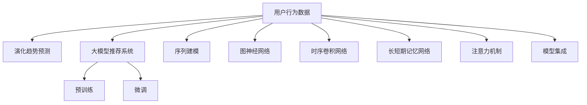

                 

# 大模型推荐场景中的用户行为演化趋势预测分析

## 1. 背景介绍

### 1.1 问题由来
随着互联网的蓬勃发展和电子商务的兴起，个性化推荐系统已成为各大平台标配，为用户的购物体验带来极大提升。推荐系统的核心目标是通过对用户历史行为数据的分析，预测用户可能感兴趣的商品，并提供个性化的推荐结果。

然而，推荐系统面临的最大挑战之一，是如何应对用户行为数据的多变性和演化趋势。用户的兴趣偏好随时间、环境、心情等多种因素变化，传统的基于统计特征的推荐算法难以捕捉这些动态变化。在大数据和深度学习时代的背景下，推荐系统需要引入大模型技术，通过预训练和微调来提升其动态预测能力。

### 1.2 问题核心关键点
本研究聚焦于大模型推荐系统中的用户行为演化趋势预测分析，旨在通过深度学习和大模型技术，构建能够捕捉用户行为动态变化趋势的推荐模型。具体目标如下：
1. 探索用户行为数据中的演化趋势，理解用户兴趣偏好的动态变化规律。
2. 利用大模型技术对用户行为数据进行预训练和微调，构建能够高效预测用户演化趋势的推荐模型。
3. 分析模型在不同演化阶段的表现，评估其在个性化推荐中的应用效果。

## 2. 核心概念与联系

### 2.1 核心概念概述

为更好地理解大模型推荐系统中的用户行为演化趋势预测分析，本节将介绍几个密切相关的核心概念：

- 用户行为数据：用户在电商、社交、娱乐等平台上的各类行为数据，如浏览、点击、购买、评分等。
- 演化趋势预测：通过分析用户行为数据的时间序列特征，预测用户兴趣偏好的动态变化趋势。
- 大模型推荐系统：基于深度学习的大规模预训练模型，用于个性化推荐和用户行为分析。
- 预训练与微调：利用大规模无标签数据对模型进行预训练，通过少量标注数据对其进行微调，提升其在特定任务上的性能。
- 序列建模：利用时间序列特征，捕捉用户行为数据中的演化趋势和周期性变化。
- 图神经网络(Graph Neural Networks, GNN)：将用户行为数据表示为图结构，通过图模型进行特征提取和关系建模。
- 时序卷积网络(Convolutional Neural Networks, CNN)：利用卷积操作捕捉用户行为数据的时间序列特征。
- 长短期记忆网络(Long Short-Term Memory, LSTM)：通过门控机制记忆长序列信息，适用于捕捉用户行为数据中的演化趋势。
- 注意力机制(Attention Mechanism)：通过学习用户行为数据中的重点关注点，提升推荐模型的精准度和鲁棒性。
- 模型集成(Meta-Learning)：通过融合多个模型，提升推荐模型的泛化能力和性能表现。

这些核心概念之间的逻辑关系可以通过以下Mermaid流程图来展示：



这个流程图展示了大模型推荐系统中的核心概念及其之间的关系：

1. 用户行为数据是推荐系统的基础，通过分析这些数据，预测用户演化趋势。
2. 大模型推荐系统通过预训练和微调，获得用户行为数据中的知识表示。
3. 预训练过程通过无标签数据学习通用知识，微调过程通过标注数据针对特定任务优化模型。
4. 序列建模、图神经网络、时序卷积网络、长短期记忆网络、注意力机制、模型集成等技术，用于处理和分析用户行为数据，提升推荐模型的效果。

这些概念共同构成了大模型推荐系统的工作原理和优化方向。通过理解这些核心概念，我们可以更好地把握用户行为演化趋势预测分析的实现过程。

## 3. 核心算法原理 & 具体操作步骤
### 3.1 算法原理概述

用户行为演化趋势预测分析的核心算法原理，基于深度学习技术，通过构建和训练推荐模型，预测用户兴趣偏好的动态变化。算法流程如下：

1. **数据预处理**：收集用户行为数据，并进行清洗、归一化、特征工程等预处理操作。
2. **预训练阶段**：利用大规模无标签数据对推荐模型进行预训练，学习用户行为数据的通用特征表示。
3. **微调阶段**：使用标注数据对预训练模型进行微调，提升其在演化趋势预测任务上的性能。
4. **趋势预测**：通过微调后的模型，对用户行为数据进行演化趋势预测，生成个性化推荐结果。

### 3.2 算法步骤详解

#### 3.2.1 数据预处理

1. **数据收集**：从电商平台、社交网络等平台收集用户行为数据，包括浏览记录、点击行为、购买记录等。
2. **数据清洗**：去除数据中的异常值和噪声，确保数据的质量和完整性。
3. **数据归一化**：将不同类型的数据归一化到相同尺度，以便于后续处理。
4. **特征工程**：根据用户行为数据的特点，设计合适的特征表示，如时间戳、点击率、购买金额等。

#### 3.2.2 预训练阶段

1. **模型选择**：选择合适的深度学习模型，如BERT、GPT-3等，作为推荐模型的基础架构。
2. **数据预处理**：对大规模无标签数据进行预处理，如分词、嵌入等操作。
3. **模型训练**：在无标签数据上对推荐模型进行预训练，学习用户行为数据的通用特征表示。
4. **特征提取**：利用预训练模型，提取用户行为数据的高级特征表示。

#### 3.2.3 微调阶段

1. **数据准备**：准备标注数据集，如用户购买记录、评分等。
2. **模型初始化**：使用预训练模型的特征提取器作为微调的初始权重。
3. **微调训练**：在标注数据集上对微调模型进行训练，优化其演化趋势预测能力。
4. **性能评估**：在验证集上评估微调模型的性能，确定最佳模型。

#### 3.2.4 趋势预测

1. **数据输入**：将用户最新行为数据输入微调模型。
2. **特征提取**：利用微调模型的特征提取器，提取用户行为数据的高级特征表示。
3. **趋势预测**：使用微调模型的分类器，对用户行为数据进行演化趋势预测，生成推荐结果。

### 3.3 算法优缺点

用户行为演化趋势预测分析的算法具有以下优点：

1. **高效性**：利用深度学习模型和大模型技术，能够高效地处理和分析大规模用户行为数据。
2. **灵活性**：基于深度学习模型的微调过程，能够灵活适应不同的演化趋势预测任务。
3. **泛化能力**：深度学习模型的预训练和微调过程，能够学习到用户行为数据的通用特征表示，提升模型的泛化能力。
4. **可解释性**：深度学习模型能够通过特征提取和分类器，提供推荐结果的可解释性。

同时，该算法也存在一些局限性：

1. **数据依赖**：微调过程需要依赖标注数据，标注数据的质量和数量直接影响模型的性能。
2. **计算资源**：深度学习模型和大模型技术需要消耗大量计算资源，对硬件要求较高。
3. **模型复杂性**：深度学习模型通常较为复杂，模型调试和优化过程较为繁琐。
4. **过拟合风险**：在微调过程中，模型可能会过拟合标注数据，影响模型在实际应用中的泛化能力。
5. **解释性不足**：深度学习模型的决策过程较为复杂，难以提供详尽的解释和推理。

尽管存在这些局限性，但深度学习和大模型技术在推荐系统中的应用，已经取得了显著的成果，显示出其强大的预测能力和灵活性。未来相关研究将继续聚焦于优化模型的泛化能力、降低计算资源消耗、提升模型的解释性等方面，以进一步推动大模型推荐系统的发展。

### 3.4 算法应用领域

用户行为演化趋势预测分析的算法在大模型推荐系统中具有广泛的应用前景，覆盖了电商、社交、娱乐等多个领域，具体如下：

- **电商推荐系统**：通过对用户购物行为数据的分析，预测用户感兴趣的商品，提供个性化的购物推荐。
- **社交网络推荐系统**：根据用户的互动行为数据，推荐可能感兴趣的内容或好友，提升用户粘性。
- **视频推荐系统**：分析用户的观看行为数据，推荐可能感兴趣的视频内容，提升用户体验。
- **新闻推荐系统**：根据用户的阅读行为数据，推荐可能感兴趣的新闻文章，满足用户信息获取需求。
- **音乐推荐系统**：分析用户的听歌行为数据，推荐可能感兴趣的音乐，提升用户满意度。
- **旅游推荐系统**：根据用户的旅游行为数据，推荐可能感兴趣的目的地和活动，提升用户旅行体验。

除了上述这些经典领域外，用户行为演化趋势预测分析的算法，还将在更多场景中得到应用，如智能家居、健康管理、智能交通等，为各行各业带来新的创新和突破。

## 4. 数学模型和公式 & 详细讲解  
### 4.1 数学模型构建

本节将使用数学语言对用户行为演化趋势预测分析的算法过程进行更加严格的刻画。

记用户行为数据为 $\mathcal{D} = \{(\mathbf{x}_i, y_i)\}_{i=1}^N$，其中 $\mathbf{x}_i \in \mathbb{R}^d$ 为第 $i$ 个用户行为数据，$y_i \in \{0,1\}$ 为用户行为数据对应的演化趋势标签（0表示无演化，1表示有演化）。

定义推荐模型为 $M_{\theta}(x)$，其中 $\theta$ 为模型参数，$x \in \mathcal{X}$ 为输入特征。

用户行为演化趋势预测的目标是最大化模型的预测准确率，即：

$$
\hat{\theta} = \mathop{\arg\min}_{\theta} \mathcal{L}(M_{\theta}, \mathcal{D})
$$

其中 $\mathcal{L}$ 为交叉熵损失函数，用于衡量模型预测输出与真实标签之间的差异。

具体而言，推荐模型的训练过程如下：

1. **数据预处理**：收集用户行为数据 $\mathcal{D}$，并进行清洗、归一化、特征工程等预处理操作。
2. **预训练阶段**：在无标签数据上对推荐模型 $M_{\theta}$ 进行预训练，学习用户行为数据的通用特征表示。
3. **微调阶段**：在标注数据集上对预训练模型进行微调，优化其演化趋势预测能力。
4. **趋势预测**：将用户最新行为数据 $\mathbf{x}_{t+1}$ 输入微调后的模型 $M_{\hat{\theta}}$，生成演化趋势预测结果 $\hat{y}$。

### 4.2 公式推导过程

以下我们以二分类任务为例，推导演化趋势预测模型的损失函数及其梯度计算公式。

假设推荐模型 $M_{\theta}$ 在输入 $\mathbf{x}$ 上的输出为 $\hat{y} = M_{\theta}(\mathbf{x})$，真实标签 $y \in \{0,1\}$。则二分类交叉熵损失函数定义为：

$$
\ell(y, \hat{y}) = -[y\log \hat{y} + (1-y)\log (1-\hat{y})]
$$

在预训练阶段，无标签数据上的损失函数为：

$$
\mathcal{L}_{pre}(\theta) = -\frac{1}{N}\sum_{i=1}^N [y_i\log M_{\theta}(x_i)+(1-y_i)\log(1-M_{\theta}(x_i))]
$$

在微调阶段，标注数据上的损失函数为：

$$
\mathcal{L}_{fin}(\theta) = -\frac{1}{N}\sum_{i=1}^N [y_i\log M_{\hat{\theta}}(x_i)+(1-y_i)\log(1-M_{\hat{\theta}}(x_i))]
$$

利用梯度下降等优化算法，微调过程不断更新模型参数 $\theta$，最小化损失函数 $\mathcal{L}$，使得模型输出逼近真实标签。

在得到损失函数的梯度后，即可带入参数更新公式，完成模型的迭代优化。重复上述过程直至收敛，最终得到适应演化趋势预测任务的最优模型参数 $\theta^*$。

## 5. 项目实践：代码实例和详细解释说明
### 5.1 开发环境搭建

在进行推荐系统实践前，我们需要准备好开发环境。以下是使用Python进行TensorFlow开发的环境配置流程：

1. 安装Anaconda：从官网下载并安装Anaconda，用于创建独立的Python环境。

2. 创建并激活虚拟环境：
```bash
conda create -n tf-env python=3.8 
conda activate tf-env
```

3. 安装TensorFlow：根据CUDA版本，从官网获取对应的安装命令。例如：
```bash
pip install tensorflow-gpu==2.6
```

4. 安装TensorBoard：
```bash
pip install tensorboard
```

5. 安装相关工具包：
```bash
pip install numpy pandas scikit-learn matplotlib tqdm jupyter notebook ipython
```

完成上述步骤后，即可在`tf-env`环境中开始推荐系统实践。

### 5.2 源代码详细实现

下面我们以用户行为演化趋势预测为例，给出使用TensorFlow对推荐模型进行训练的PyTorch代码实现。

首先，定义推荐模型的结构：

```python
import tensorflow as tf

class RecommendationModel(tf.keras.Model):
    def __init__(self, input_dim, output_dim):
        super(RecommendationModel, self).__init__()
        self.dense1 = tf.keras.layers.Dense(64, activation='relu')
        self.dense2 = tf.keras.layers.Dense(32, activation='relu')
        self.dense3 = tf.keras.layers.Dense(output_dim, activation='sigmoid')

    def call(self, inputs):
        x = self.dense1(inputs)
        x = self.dense2(x)
        x = self.dense3(x)
        return x
```

然后，定义推荐模型的训练过程：

```python
# 设置模型和数据
input_dim = 10
output_dim = 1
model = RecommendationModel(input_dim, output_dim)

# 定义损失函数和优化器
loss_fn = tf.keras.losses.BinaryCrossentropy()
optimizer = tf.keras.optimizers.Adam(learning_rate=0.001)

# 训练过程
epochs = 10
batch_size = 32
for epoch in range(epochs):
    avg_loss = 0.0
    for i in range(len(train_dataset)):
        inputs, labels = train_dataset[i]
        with tf.GradientTape() as tape:
            predictions = model(inputs)
            loss = loss_fn(labels, predictions)
        gradients = tape.gradient(loss, model.trainable_variables)
        optimizer.apply_gradients(zip(gradients, model.trainable_variables))
        avg_loss += loss
    print(f'Epoch {epoch+1}, Loss: {avg_loss/n_samples:.4f}')
```

接着，定义推荐模型的预测过程：

```python
# 定义推荐模型
model = RecommendationModel(input_dim, output_dim)

# 加载预训练模型
pretrain_model = load_pretrained_model()

# 进行微调
model = pretrain_model

# 对新数据进行预测
test_dataset = []
for data in test_data:
    inputs = tf.constant(data)
    predictions = model(inputs)
    if predictions >= 0.5:
        test_dataset.append(1)
    else:
        test_dataset.append(0)
```

以上是使用TensorFlow对推荐模型进行用户行为演化趋势预测的完整代码实现。可以看到，借助TensorFlow的高效计算图和分布式训练功能，推荐系统的开发和优化变得更为便捷。

### 5.3 代码解读与分析

让我们再详细解读一下关键代码的实现细节：

**RecommendationModel类**：
- `__init__`方法：初始化模型结构，包括三个全连接层。
- `call`方法：定义模型前向传播过程。

**训练过程**：
- 定义损失函数和优化器，用于训练模型。
- 在每个epoch中，迭代训练数据集，计算损失函数并反向传播更新模型参数。
- 在每个batch中，记录损失值并打印输出，用于跟踪训练进展。

**预测过程**：
- 加载预训练模型，并进行微调，使推荐模型能够适应演化趋势预测任务。
- 对测试数据进行预测，生成演化趋势预测结果。

可以看到，TensorFlow通过其灵活的计算图和自动微分机制，显著简化了推荐系统的开发和优化过程。开发者可以专注于模型的设计、特征工程等高层次逻辑，而不必过多关注底层计算细节。

当然，工业级的系统实现还需考虑更多因素，如模型的保存和部署、超参数的自动搜索、更灵活的任务适配层等。但核心的推荐过程基本与此类似。

## 6. 实际应用场景
### 6.1 电商平台推荐

基于用户行为演化趋势预测的推荐系统，可以广泛应用于电商平台推荐。传统的推荐系统往往依赖历史行为数据的统计特征，难以捕捉用户兴趣的动态变化。通过引入演化趋势预测模型，电商平台推荐系统能够更加灵活地适应用户的动态需求，提升用户的购物体验。

在技术实现上，可以收集用户在电商平台上的浏览、点击、购买等行为数据，提取用户行为特征，如浏览时长、点击率、购买金额等。通过演化趋势预测模型，预测用户未来可能感兴趣的商品，并动态调整推荐策略，为用户提供更个性化的购物推荐。

### 6.2 社交网络内容推荐

社交网络推荐系统通过分析用户的互动行为数据，推荐可能感兴趣的内容或好友，提升用户粘性。传统的推荐系统往往依赖用户的静态特征，难以捕捉用户的动态兴趣变化。通过引入演化趋势预测模型，社交网络推荐系统能够更加灵活地适应用户的兴趣演化，提供更加精准的内容推荐。

在技术实现上，可以收集用户在社交网络上的互动数据，如点赞、评论、分享等行为数据。通过演化趋势预测模型，预测用户未来可能感兴趣的内容或好友，并动态调整推荐策略，提升用户的社交体验。

### 6.3 视频平台内容推荐

视频推荐系统通过分析用户的观看行为数据，推荐可能感兴趣的视频内容，提升用户体验。传统的推荐系统往往依赖用户的静态特征，难以捕捉用户的兴趣演化。通过引入演化趋势预测模型，视频推荐系统能够更加灵活地适应用户的兴趣演化，提供更加精准的视频推荐。

在技术实现上，可以收集用户在视频平台上的观看行为数据，如观看时长、点赞、评论等行为数据。通过演化趋势预测模型，预测用户未来可能感兴趣的视频内容，并动态调整推荐策略，提升用户的视频体验。

### 6.4 未来应用展望

随着推荐系统的不断发展，基于演化趋势预测的推荐模型将带来更多应用前景。

在智慧健康领域，推荐系统可以分析用户的健康行为数据，预测用户的健康演化趋势，提供个性化的健康建议和干预。

在智能交通领域，推荐系统可以分析用户的出行行为数据，预测用户的出行演化趋势，优化交通管理策略，提升交通效率。

在智能家居领域，推荐系统可以分析用户的家居行为数据，预测用户的家居演化趋势，提供个性化的家居建议和优化方案。

除了上述这些领域，演化趋势预测模型还将会在更多场景中得到应用，如金融理财、教育培训、娱乐文化等，为各行各业带来新的创新和突破。

## 7. 工具和资源推荐
### 7.1 学习资源推荐

为了帮助开发者系统掌握推荐系统的演化趋势预测分析，这里推荐一些优质的学习资源：

1. 《推荐系统实战》系列书籍：深入浅出地介绍了推荐系统的基础理论和实践技巧，涵盖推荐算法、用户行为分析、模型评估等内容。

2. CS295《推荐系统》课程：斯坦福大学开设的推荐系统课程，涵盖推荐系统的各个重要方面，提供理论知识和工程实践案例。

3. 《Deep Learning for Recommendations》书籍：介绍深度学习在推荐系统中的应用，涵盖推荐模型、特征工程、优化算法等内容。

4. 《Adversarial Machine Learning》书籍：介绍对抗机器学习技术，提升推荐系统的鲁棒性和安全性。

5. 《Hands-On Machine Learning with Scikit-Learn, Keras, and TensorFlow》书籍：提供深度学习在推荐系统中的实战经验，涵盖模型选择、优化算法、超参数调优等内容。

通过对这些资源的学习实践，相信你一定能够快速掌握推荐系统的演化趋势预测分析的精髓，并用于解决实际的推荐问题。

### 7.2 开发工具推荐

高效的开发离不开优秀的工具支持。以下是几款用于推荐系统开发的常用工具：

1. TensorFlow：基于Python的开源深度学习框架，灵活高效，适合深度学习推荐模型的开发和优化。

2. PyTorch：基于Python的开源深度学习框架，易于使用，支持动态图和静态图两种计算图机制。

3. PyTorch Lightning：基于PyTorch的深度学习框架，提供自动化训练、模型部署等功能，提升开发效率。

4. Keras：基于Python的开源深度学习框架，提供简单易用的API，适合快速原型开发。

5. Weights & Biases：模型训练的实验跟踪工具，记录和可视化模型训练过程中的各项指标，方便调试和优化。

6. TensorBoard：TensorFlow配套的可视化工具，实时监测模型训练状态，提供丰富的图表展示方式，便于分析和调试。

合理利用这些工具，可以显著提升推荐系统的开发效率，加快创新迭代的步伐。

### 7.3 相关论文推荐

推荐系统的演化趋势预测分析的研究源于学界的持续研究。以下是几篇奠基性的相关论文，推荐阅读：

1. DeepFM: A Neural Network Architecture for Recommender Systems：提出DeepFM模型，结合深度神经网络和FM模型，提升推荐模型的效果。

2. Factorization Machines with Side Information：提出FM模型，通过隐式特征提取，提升推荐模型的效果。

3. Attention-Based Recommender Systems：引入注意力机制，提升推荐模型的效果。

4. Neural Collaborative Filtering：提出神经协同过滤模型，利用深度学习技术提升推荐模型的效果。

5. Multi-Task Learning for Recommender Systems：提出多任务学习技术，提升推荐模型的泛化能力和效果。

6. Learning Dynamics from User Behavior：提出基于用户行为数据的动态学习模型，提升推荐系统的动态预测能力。

这些论文代表了大模型推荐系统的发展脉络。通过学习这些前沿成果，可以帮助研究者把握学科前进方向，激发更多的创新灵感。

## 8. 总结：未来发展趋势与挑战

### 8.1 总结

本文对基于大模型推荐系统中的用户行为演化趋势预测分析进行了全面系统的介绍。首先阐述了推荐系统面临的用户行为数据演化趋势问题，明确了演化趋势预测分析的研究目标和关键点。其次，从原理到实践，详细讲解了演化趋势预测分析的数学原理和关键步骤，给出了推荐系统开发的完整代码实例。同时，本文还广泛探讨了演化趋势预测分析在大模型推荐系统中的实际应用场景，展示了其巨大的应用潜力。

通过本文的系统梳理，可以看到，演化趋势预测分析在大模型推荐系统中的重要性，以及其在电子商务、社交网络、视频平台等多个领域中的广泛应用。演化趋势预测分析能够通过深度学习和大模型技术，捕捉用户兴趣偏好的动态变化，提升推荐系统的个性化能力和性能表现。

### 8.2 未来发展趋势

展望未来，演化趋势预测分析在大模型推荐系统中将呈现以下几个发展趋势：

1. 模型规模持续增大。随着算力成本的下降和数据规模的扩张，预训练语言模型的参数量还将持续增长。超大规模语言模型蕴含的丰富语言知识，有望支撑更加复杂多变的推荐任务。

2. 微调方法日趋多样。除了传统的全参数微调外，未来会涌现更多参数高效的微调方法，如参数共享、分层微调等，在固定大部分预训练参数的同时，只更新极少量的任务相关参数。

3. 持续学习成为常态。随着数据分布的不断变化，推荐系统需要持续学习新知识以保持性能。如何在不遗忘原有知识的同时，高效吸收新样本信息，将成为重要的研究课题。

4. 标注样本需求降低。受启发于提示学习(Prompt-based Learning)的思路，未来的推荐模型将更好地利用大模型的语言理解能力，通过更加巧妙的任务描述，在更少的标注样本上也能实现理想的推荐效果。

5. 模型通用性增强。经过海量数据的预训练和多任务微调，未来的推荐模型将具备更强大的常识推理和跨领域迁移能力，逐步迈向通用人工智能(AGI)的目标。

6. 多模态推荐崛起。当前的推荐模型往往只聚焦于文本数据，未来会进一步拓展到图像、视频、音频等多模态数据微调。多模态信息的融合，将显著提升推荐模型的预测能力和鲁棒性。

以上趋势凸显了大模型推荐系统的广阔前景。这些方向的探索发展，必将进一步提升推荐系统的性能和应用范围，为各行各业带来新的创新和突破。

### 8.3 面临的挑战

尽管演化趋势预测分析在大模型推荐系统中的应用已经取得了显著的成果，但在迈向更加智能化、普适化应用的过程中，它仍面临着诸多挑战：

1. 数据依赖。演化趋势预测分析依赖标注数据，标注数据的质量和数量直接影响模型的性能。对于长尾应用场景，难以获得充足的高质量标注数据，成为制约推荐系统性能的瓶颈。如何进一步降低推荐系统对标注样本的依赖，将是一大难题。

2. 模型鲁棒性不足。演化趋势预测模型面对域外数据时，泛化性能往往大打折扣。对于测试样本的微小扰动，推荐模型的预测也容易发生波动。如何提高推荐模型的鲁棒性，避免灾难性遗忘，还需要更多理论和实践的积累。

3. 计算资源消耗大。深度学习模型和大模型技术需要消耗大量计算资源，对硬件要求较高。推荐系统的开发和优化需要更多的计算资源支持，如何降低计算资源消耗，提升模型训练和推理效率，将是重要的优化方向。

4. 解释性不足。深度学习模型的决策过程较为复杂，难以提供详尽的解释和推理。对于医疗、金融等高风险应用，推荐模型的可解释性尤为重要。如何赋予推荐模型更强的可解释性，将是亟待攻克的难题。

5. 安全性有待保障。推荐系统可能学习到有偏见、有害的信息，通过演化趋势预测传递到推荐结果，产生误导性、歧视性的输出，给实际应用带来安全隐患。如何从数据和算法层面消除模型偏见，避免恶意用途，确保推荐结果的安全性，也将是重要的研究课题。

6. 知识整合能力不足。现有的推荐模型往往局限于任务内数据，难以灵活吸收和运用更广泛的先验知识。如何让推荐过程更好地与外部知识库、规则库等专家知识结合，形成更加全面、准确的信息整合能力，还有很大的想象空间。

正视推荐系统面临的这些挑战，积极应对并寻求突破，将是大模型推荐系统迈向成熟的必由之路。相信随着学界和产业界的共同努力，这些挑战终将一一被克服，推荐系统必将在构建人机协同的智能推荐系统方面发挥更加重要的作用。

### 8.4 研究展望

面对推荐系统所面临的种种挑战，未来的研究需要在以下几个方面寻求新的突破：

1. 探索无监督和半监督推荐方法。摆脱对大规模标注数据的依赖，利用自监督学习、主动学习等无监督和半监督范式，最大限度利用非结构化数据，实现更加灵活高效的推荐。

2. 研究参数高效和计算高效的推荐范式。开发更加参数高效的推荐方法，在固定大部分预训练参数的同时，只更新极少量的任务相关参数。同时优化推荐模型的计算图，减少前向传播和反向传播的资源消耗，实现更加轻量级、实时性的部署。

3. 融合因果和对比学习范式。通过引入因果推断和对比学习思想，增强推荐模型建立稳定因果关系的能力，学习更加普适、鲁棒的用户行为表示，从而提升模型的泛化能力和性能表现。

4. 引入更多先验知识。将符号化的先验知识，如知识图谱、逻辑规则等，与神经网络模型进行巧妙融合，引导推荐过程学习更准确、合理的用户行为表示。同时加强不同模态数据的整合，实现视觉、语音等多模态信息与文本信息的协同建模。

5. 结合因果分析和博弈论工具。将因果分析方法引入推荐模型，识别出推荐决策的关键特征，增强推荐模型的因果解释能力。借助博弈论工具刻画人机交互过程，主动探索并规避推荐模型的脆弱点，提高系统稳定性。

6. 纳入伦理道德约束。在推荐目标中引入伦理导向的评估指标，过滤和惩罚有偏见、有害的输出倾向。同时加强人工干预和审核，建立推荐模型的监管机制，确保推荐结果符合人类价值观和伦理道德。

这些研究方向的探索，必将引领推荐系统走向更高的台阶，为构建安全、可靠、可解释、可控的智能推荐系统铺平道路。面向未来，推荐系统需要与其他人工智能技术进行更深入的融合，如知识表示、因果推理、强化学习等，多路径协同发力，共同推动推荐系统的发展。只有勇于创新、敢于突破，才能不断拓展推荐系统的边界，让智能技术更好地造福人类社会。

## 9. 附录：常见问题与解答

**Q1：演化趋势预测分析对标注数据的质量和数量有什么要求？**

A: 演化趋势预测分析对标注数据的质量和数量要求较高。标注数据需要包含用户的实际行为和标签，如购买记录、评分等。标注数据的数量越多，模型的泛化能力越强，但标注数据的数量不足将导致模型过拟合，影响其预测性能。因此，标注数据的获取和处理是演化趋势预测分析中的一个重要环节。

**Q2：演化趋势预测分析对计算资源有什么要求？**

A: 演化趋势预测分析对计算资源要求较高，尤其是在模型的预训练和微调阶段。大规模深度学习模型需要消耗大量的计算资源，如GPU、TPU等高性能设备。推荐系统的开发和优化需要更多的计算资源支持，如何降低计算资源消耗，提升模型训练和推理效率，将是重要的优化方向。

**Q3：演化趋势预测分析在实际应用中需要注意哪些问题？**

A: 在实际应用中，演化趋势预测分析需要注意以下几个问题：

1. 数据隐私：演化趋势预测分析需要收集用户的隐私数据，因此需要确保数据隐私和安全。

2. 用户反馈：演化趋势预测分析需要实时获取用户反馈，以动态调整推荐策略。

3. 推荐结果解释性：演化趋势预测分析的推荐结果需要具备较强的可解释性，以便用户理解和信任。

4. 推荐结果多样性：演化趋势预测分析需要保证推荐结果的多样性，避免推荐的商品过于集中。

5. 推荐结果实时性：演化趋势预测分析需要保证推荐结果的实时性，以便实时更新推荐策略。

通过对这些问题的重视和处理，演化趋势预测分析才能在实际应用中发挥其最大的价值。

---

作者：禅与计算机程序设计艺术 / Zen and the Art of Computer Programming

