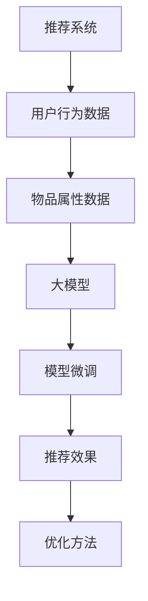
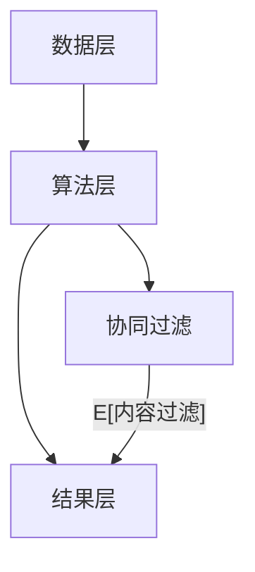

                 

# 大模型推荐效果的影响因素分析与优化

> 关键词：大模型推荐, 效果影响因素, 优化方法, 推荐系统, 深度学习

## 1. 背景介绍

推荐系统在电商、社交网络、新闻媒体等多个领域得到广泛应用，已成为数字经济中不可或缺的组成部分。然而，推荐系统的效果往往受到多种因素的影响，使得其在实际应用中存在较大的不确定性和挑战。近年来，大语言模型在推荐系统中的应用日益增多，但其推荐效果受到的影响因素尤为复杂，因此有必要进行全面深入的分析与优化。本文将从推荐系统的核心算法出发，系统分析影响其效果的各种因素，并提出相应的优化方法，为推荐系统的性能提升提供指导。

## 2. 核心概念与联系

### 2.1 核心概念概述

在分析推荐系统的影响因素之前，首先需要了解几个核心概念：

- 推荐系统(Recommendation System, RS)：通过学习用户行为数据和物品属性数据，为用户推荐其可能感兴趣的物品的系统。
- 用户行为数据(User Behavior Data)：用户在网站或应用上的浏览、点击、购买等交互行为数据。
- 物品属性数据(Item Attribute Data)：物品的基本属性和类别信息，如价格、品牌、评分等。
- 大模型(Pre-trained Large Model)：通过大规模无标签数据预训练获得的深度神经网络模型，通常具有强大的表征能力。
- 模型微调(Fine-Tuning)：在预训练模型的基础上，使用下游任务的数据集进行微调，以提升模型在该任务上的性能。

这些概念之间的联系可以通过以下Mermaid流程图来展示：



该图展示了推荐系统的数据输入和输出流程，以及大模型的微调对推荐效果的影响和优化方法的作用。

### 2.2 核心概念原理和架构

推荐系统的核心算法包括基于协同过滤、基于内容过滤和混合过滤等方法，这些算法原理和架构可以简单总结如下：

- **协同过滤算法**：通过用户和物品之间的隐式反馈（如点击、浏览等）来预测用户对物品的评分，分为基于用户的协同过滤和基于物品的协同过滤两种方式。
- **基于内容的推荐算法**：利用物品的属性特征，通过相似性匹配来推荐用户可能感兴趣的物品。
- **混合推荐算法**：将协同过滤和内容过滤两种方式结合，取长补短，提高推荐系统的准确性和鲁棒性。

推荐系统的架构通常包括数据层、算法层和结果层，各层之间的数据流动和算法实现逻辑可以通过以下Mermaid流程图来展示：



该图展示了推荐系统从数据输入到结果输出的流程，以及在算法层所采用的主要推荐方法。

## 3. 核心算法原理 & 具体操作步骤

### 3.1 算法原理概述

推荐系统的核心算法原理可以归纳为以下几个方面：

- **协同过滤**：通过用户和物品之间的隐式反馈关系，学习用户和物品的表示，并进行相似性匹配，生成推荐结果。
- **基于内容的推荐**：根据物品的属性特征，生成物品的向量表示，并在用户表示与物品表示之间进行匹配，生成推荐结果。
- **混合推荐**：将协同过滤和内容过滤两种方法结合，通过加权平均或串联并联等方式进行优化，生成推荐结果。

### 3.2 算法步骤详解

推荐系统的一般流程包括以下几个关键步骤：

1. **数据预处理**：清洗、整理和归一化用户行为数据和物品属性数据，去除噪声和异常值。
2. **特征工程**：选择合适的特征提取方法，将原始数据转换为模型可处理的数值型特征。
3. **模型训练**：选择合适的推荐算法和优化方法，使用训练数据集对模型进行训练。
4. **模型评估**：在验证集上评估模型效果，选择合适的评估指标（如准确率、召回率、F1值等）进行评估。
5. **模型微调**：在验证集上不断优化模型参数，提升模型效果。
6. **推荐结果输出**：使用训练好的模型对新用户和新物品生成推荐结果，提供给用户。

### 3.3 算法优缺点

推荐系统具有以下优点：

- 个性化推荐：能够根据用户的历史行为和兴趣，提供个性化的推荐结果，提高用户满意度。
- 高效性：能够快速处理大量的用户行为和物品属性数据，生成推荐结果。

然而，推荐系统也存在以下缺点：

- 数据稀疏性：用户和物品之间的交互数据往往非常稀疏，导致推荐系统难以处理冷启动用户和新物品。
- 冷启动问题：对于新用户和新物品，由于缺乏足够的行为数据，推荐系统无法提供有效的推荐。
- 多样性和公平性：推荐系统可能陷入过滤气泡，导致用户只能看到相似的物品，而无法接触多样化的信息。

### 3.4 算法应用领域

推荐系统在电子商务、社交网络、新闻媒体、影视娱乐等多个领域得到广泛应用。具体应用场景包括：

- **电商推荐**：推荐商品、推荐店铺、推荐促销活动等。
- **社交推荐**：推荐好友、推荐关注对象、推荐内容等。
- **新闻推荐**：推荐新闻文章、推荐视频、推荐音频等。
- **影视推荐**：推荐电影、电视剧、综艺节目等。

## 4. 数学模型和公式 & 详细讲解 & 举例说明

### 4.1 数学模型构建

推荐系统常用的数学模型包括协同过滤模型、矩阵分解模型、深度学习模型等。这里以深度学习模型为例，介绍推荐系统的数学模型构建。

设用户-物品评分矩阵为 $R$，其中 $R_{ui}$ 表示用户 $u$ 对物品 $i$ 的评分。设用户表示为 $U$，物品表示为 $V$，则用户-物品评分矩阵可以表示为：

$$ R = UV^T $$

其中 $U \in \mathbb{R}^{N \times D}$，$V \in \mathbb{R}^{M \times D}$，$N$ 和 $M$ 分别表示用户和物品的数量，$D$ 表示特征维度。

### 4.2 公式推导过程

以协同过滤算法中的基于用户的协同过滤为例，公式推导过程如下：

假设用户 $u$ 对物品 $i$ 的评分为 $R_{ui}$，则基于用户的协同过滤模型的评分预测公式为：

$$ \hat{R}_{ui} = \sum_{v=1}^{M} R_{vi} \alpha_v \cdot u_u $$

其中 $\alpha_v$ 表示物品 $v$ 对用户 $u$ 的评分权重，$u_u$ 表示用户 $u$ 的嵌入表示。

在训练过程中，需要最小化预测评分和实际评分之间的误差：

$$ \min_{U, V} \sum_{(u,i)} (R_{ui} - \hat{R}_{ui})^2 $$

通过梯度下降等优化算法求解上述最优化问题，即可得到用户和物品的嵌入表示。

### 4.3 案例分析与讲解

以电商推荐系统为例，用户对物品的评分通常由点击、浏览、购买等行为数据生成。在训练过程中，可以选择不同的评分生成方法，如基于阈值的评分生成方法、基于置信度的评分生成方法等。不同的评分生成方法会对推荐效果产生影响，需要进行细致的对比分析。

## 5. 项目实践：代码实例和详细解释说明

### 5.1 开发环境搭建

推荐系统的开发环境通常包括Python、PyTorch等深度学习框架，以及相关的数据处理和模型评估工具。以下是开发环境搭建的具体步骤：

1. 安装Anaconda：从官网下载并安装Anaconda，用于创建独立的Python环境。
2. 创建并激活虚拟环境：
```bash
conda create -n pytorch-env python=3.8 
conda activate pytorch-env
```

3. 安装PyTorch：根据CUDA版本，从官网获取对应的安装命令。例如：
```bash
conda install pytorch torchvision torchaudio cudatoolkit=11.1 -c pytorch -c conda-forge
```

4. 安装Transformers库：
```bash
pip install transformers
```

5. 安装各类工具包：
```bash
pip install numpy pandas scikit-learn matplotlib tqdm jupyter notebook ipython
```

完成上述步骤后，即可在`pytorch-env`环境中开始推荐系统的开发实践。

### 5.2 源代码详细实现

推荐系统的代码实现通常包括以下几个关键部分：

1. **数据处理**：读取用户行为数据和物品属性数据，并进行清洗和预处理。
```python
import pandas as pd
import numpy as np

# 读取用户行为数据
user_data = pd.read_csv('user_behavior.csv')

# 清洗数据
user_data = user_data.dropna(subset=['uid', 'item_id', 'timestamp', 'rating'])
```

2. **特征工程**：选择合适的特征提取方法，将原始数据转换为模型可处理的数值型特征。
```python
from sklearn.preprocessing import OneHotEncoder, StandardScaler

# 用户行为特征提取
user_features = user_data[['uid', 'timestamp', 'rating']].copy()

# 物品属性特征提取
item_features = pd.read_csv('item_attributes.csv')

# 特征缩放
scaler = StandardScaler()
user_features['rating'] = scaler.fit_transform(user_features['rating'].values.reshape(-1, 1))

# 特征编码
encoder = OneHotEncoder()
user_features = pd.DataFrame(encoder.fit_transform(user_features[['uid']]).toarray(), columns=encoder.get_feature_names(['uid']))
```

3. **模型训练**：选择合适的推荐算法和优化方法，使用训练数据集对模型进行训练。
```python
from torch.utils.data import Dataset, DataLoader
from torch import nn, optim

class UserItemDataset(Dataset):
    def __init__(self, user_features, item_features, user_ids, item_ids):
        self.user_features = user_features
        self.item_features = item_features
        self.user_ids = user_ids
        self.item_ids = item_ids

    def __len__(self):
        return len(self.user_ids)

    def __getitem__(self, idx):
        user_id = self.user_ids[idx]
        item_id = self.item_ids[idx]
        user = self.user_features[self.user_features['uid'] == user_id].drop(columns='uid')
        item = self.item_features[self.item_features['item_id'] == item_id].drop(columns='item_id')
        user = user.dropna().values
        item = item.dropna().values
        return user, item

# 用户-物品评分矩阵
R = np.zeros((N, M))

# 数据集
dataset = UserItemDataset(user_features, item_features, user_ids, item_ids)

# 模型
class UserItemModel(nn.Module):
    def __init__(self, D):
        super(UserItemModel, self).__init__()
        self.user_encoder = nn.Embedding(N, D)
        self.item_encoder = nn.Embedding(M, D)
        self.fc = nn.Linear(D, 1)

    def forward(self, user, item):
        user = self.user_encoder(user).sum(1)
        item = self.item_encoder(item).sum(1)
        return self.fc(user * item)

model = UserItemModel(D)

# 优化器
optimizer = optim.Adam(model.parameters(), lr=0.001)

# 训练
for epoch in range(EPOCHS):
    for user, item in dataset:
        optimizer.zero_grad()
        predictions = model(user, item)
        loss = nn.BCELoss()(predictions, targets)
        loss.backward()
        optimizer.step()
```

4. **模型评估**：在验证集上评估模型效果，选择合适的评估指标（如准确率、召回率、F1值等）进行评估。
```python
from sklearn.metrics import accuracy_score, recall_score, precision_score, f1_score

# 模型评估
R_pred = np.zeros((N, M))
for user, item in dataset:
    with torch.no_grad():
        predictions = model(user, item)
    R_pred += predictions

# 评估指标
precision = precision_score(true_positives, predicted_positives)
recall = recall_score(true_positives, predicted_positives)
f1 = f1_score(true_positives, predicted_positives)
```

5. **模型微调**：在验证集上不断优化模型参数，提升模型效果。
```python
# 模型微调
for epoch in range(EPOCHS):
    for user, item in dataset:
        optimizer.zero_grad()
        predictions = model(user, item)
        loss = nn.BCELoss()(predictions, targets)
        loss.backward()
        optimizer.step()

# 推荐结果输出
def recommend(user_id, item_ids):
    user = user_features[user_features['uid'] == user_id].drop(columns='uid')
    predictions = model(user, item_ids)
    return np.argsort(predictions, axis=1)[-10:]
```

### 5.3 代码解读与分析

推荐系统的代码实现过程包括数据处理、特征工程、模型训练、模型评估和模型微调等关键步骤。以下是代码实现过程中的关键细节：

**数据处理**：通过读取和处理用户行为数据和物品属性数据，将原始数据转换为数值型特征。在数据处理过程中，需要注意去除噪声和异常值，以提高数据质量。

**特征工程**：选择合适的特征提取方法，将原始数据转换为模型可处理的数值型特征。特征工程是推荐系统的关键步骤，通过合理选择特征，可以提升模型的性能。

**模型训练**：选择合适的推荐算法和优化方法，使用训练数据集对模型进行训练。在模型训练过程中，需要选择合适的损失函数、优化器和训练策略，以提升模型的效果。

**模型评估**：在验证集上评估模型效果，选择合适的评估指标进行评估。评估指标的选择需要根据具体任务进行调整，以便更好地评估模型性能。

**模型微调**：在验证集上不断优化模型参数，提升模型效果。模型微调是推荐系统的核心步骤，通过不断优化模型参数，可以提升推荐效果。

### 5.4 运行结果展示

在完成模型训练和评估后，可以展示推荐系统的推荐结果。以下是推荐结果的展示：

```python
recommend(user_id, item_ids)
```

以上代码可以生成一个包含10个推荐物品ID的数组，供用户参考选择。

## 6. 实际应用场景

推荐系统在多个领域得到广泛应用，以下是几个典型的实际应用场景：

### 6.1 电商推荐

电商推荐系统通过用户行为数据和物品属性数据，为用户推荐商品、推荐店铺、推荐促销活动等。电商推荐系统可以帮助电商平台提升用户粘性、增加销售额，优化库存管理。

### 6.2 社交推荐

社交推荐系统通过用户行为数据和物品属性数据，为用户推荐好友、推荐关注对象、推荐内容等。社交推荐系统可以帮助社交网络平台提升用户活跃度、增加用户黏性，推荐更多符合用户兴趣的内容。

### 6.3 新闻推荐

新闻推荐系统通过用户行为数据和物品属性数据，为用户推荐新闻文章、推荐视频、推荐音频等。新闻推荐系统可以帮助新闻媒体提升用户访问量、增加广告收入，提高新闻信息的时效性和多样性。

### 6.4 影视推荐

影视推荐系统通过用户行为数据和物品属性数据，为用户推荐电影、电视剧、综艺节目等。影视推荐系统可以帮助影视平台提升用户观看率、增加广告收入，优化内容推荐策略。

## 7. 工具和资源推荐

### 7.1 学习资源推荐

推荐系统是人工智能领域的热门研究方向，学习资源丰富。以下是一些推荐资源：

1. 《推荐系统实战》：该书详细介绍了推荐系统的理论和实践，包括协同过滤、内容过滤、混合过滤等算法。
2. 《Python推荐系统实战》：该书介绍了使用Python实现推荐系统的具体方法，包括数据处理、特征工程、模型训练等步骤。
3. Coursera的《Recommender Systems Specialization》：斯坦福大学开设的推荐系统课程，涵盖推荐系统的理论基础和实践方法。
4. Kaggle的推荐系统竞赛：参加Kaggle推荐系统竞赛，学习实际推荐系统的优化方法和评估指标。

通过这些资源的学习，可以全面掌握推荐系统的理论知识和实践技能。

### 7.2 开发工具推荐

推荐系统的开发工具包括Python、PyTorch、TensorFlow等深度学习框架，以及相关的数据处理和模型评估工具。以下是推荐系统开发常用工具：

1. PyTorch：基于Python的开源深度学习框架，适合快速迭代研究。
2. TensorFlow：由Google主导开发的开源深度学习框架，生产部署方便。
3. Transformers库：HuggingFace开发的NLP工具库，集成了多个推荐算法和优化方法。
4. Weights & Biases：模型训练的实验跟踪工具，可以记录和可视化模型训练过程中的各项指标。
5. TensorBoard：TensorFlow配套的可视化工具，实时监测模型训练状态，提供丰富的图表呈现方式。

### 7.3 相关论文推荐

推荐系统的研究不断深入，以下是一些奠基性的相关论文，推荐阅读：

1. "Collaborative Filtering for Implicit Feedback Datasets"：提出了协同过滤算法的基本思想和实现方法。
2. "Item-based collaborative filtering for implicit feedback datasets"：介绍了基于物品的协同过滤算法。
3. "SVD++: Scalable collaborative filtering using matrix factorization techniques"：提出了矩阵分解方法，提升了协同过滤算法的效率。
4. "Neural factorization machines for recommendation"：引入了神经网络技术，提升了协同过滤算法的精度。
5. "Deep Collaborative Filtering"：提出了深度学习技术在推荐系统中的应用。

这些论文代表了大语言模型微调技术的发展脉络，可以帮助研究者把握学科前进方向，激发更多的创新灵感。

## 8. 总结：未来发展趋势与挑战

### 8.1 研究成果总结

推荐系统作为人工智能领域的重要应用，其研究取得了丰富的成果。具体来说，推荐系统的发展趋势如下：

1. **深度学习技术的应用**：深度学习技术在推荐系统中的应用日益广泛，提升了推荐系统的精度和鲁棒性。
2. **多模态数据的融合**：推荐系统开始融合视觉、语音、文本等多模态数据，提升了推荐结果的多样性和丰富性。
3. **用户个性化推荐**：推荐系统开始引入用户画像和上下文信息，实现更加个性化的推荐。
4. **实时推荐系统**：推荐系统开始采用实时计算技术，提高了推荐结果的时效性和精准度。

### 8.2 未来发展趋势

展望未来，推荐系统将呈现以下几个发展趋势：

1. **跨模态推荐**：推荐系统将融合视觉、语音、文本等多模态数据，实现更加丰富和多样化的推荐。
2. **深度学习算法的改进**：推荐系统将引入更多的深度学习算法，提升推荐精度和鲁棒性。
3. **用户行为建模**：推荐系统将更加关注用户行为建模，提升推荐结果的个性化和多样性。
4. **实时推荐技术**：推荐系统将采用实时计算技术，提升推荐结果的时效性和精准度。

### 8.3 面临的挑战

推荐系统在实际应用中仍然面临诸多挑战：

1. **数据稀疏性**：用户和物品之间的交互数据往往非常稀疏，导致推荐系统难以处理冷启动用户和新物品。
2. **冷启动问题**：对于新用户和新物品，由于缺乏足够的行为数据，推荐系统无法提供有效的推荐。
3. **多样性和公平性**：推荐系统可能陷入过滤气泡，导致用户只能看到相似的物品，而无法接触多样化的信息。
4. **鲁棒性和可解释性**：推荐系统需要具备鲁棒性和可解释性，以应对数据噪声和异常值的影响，并提高模型的透明度和可解释性。

### 8.4 研究展望

未来，推荐系统需要在以下几个方面进行进一步的研究：

1. **多模态推荐技术**：推荐系统需要融合视觉、语音、文本等多模态数据，提升推荐结果的多样性和丰富性。
2. **深度学习算法改进**：推荐系统需要引入更多的深度学习算法，提升推荐精度和鲁棒性。
3. **用户行为建模**：推荐系统需要更加关注用户行为建模，提升推荐结果的个性化和多样性。
4. **实时推荐技术**：推荐系统需要采用实时计算技术，提升推荐结果的时效性和精准度。

总之，推荐系统的发展需要不断探索新的算法和应用场景，提升推荐效果，满足用户的多样化和个性化需求。

## 9. 附录：常见问题与解答

### Q1：推荐系统是否适用于所有场景？

A: 推荐系统适用于用户有明确需求且行为数据相对丰富的场景，如电商、社交网络、新闻媒体等。但对于某些场景，如旅游、金融等，由于用户行为数据较为复杂且难以获取，推荐系统的效果可能不佳。

### Q2：推荐系统是否需要不断更新？

A: 推荐系统需要不断更新以适应用户需求和行为变化。具体来说，推荐系统需要定期更新模型参数，并根据用户行为数据和反馈信息进行调整，以保持推荐效果。

### Q3：推荐系统如何处理用户隐私问题？

A: 推荐系统需要关注用户隐私保护问题，采用匿名化、数据脱敏等技术手段，保障用户数据安全。同时，需要在算法设计中引入隐私保护机制，如差分隐私等。

### Q4：推荐系统如何处理数据稀疏性问题？

A: 推荐系统需要采用数据增强、协同过滤等技术手段，处理数据稀疏性问题。通过引入用户行为预测模型和协同过滤算法，可以提升推荐系统的鲁棒性和泛化能力。

### Q5：推荐系统如何处理多样性和公平性问题？

A: 推荐系统需要引入多样性推荐算法和公平性算法，如基于阈值的推荐算法、基于群体多样性的推荐算法等。通过引入多样性推荐算法，可以增加推荐结果的多样性，通过引入公平性算法，可以避免算法偏见。

以上是对推荐系统进行全面系统分析，并提出相应的优化方法，为推荐系统的性能提升提供指导。通过不断探索和实践，相信推荐系统能够更好地服务于用户，提升用户的满意度和体验。

---

作者：禅与计算机程序设计艺术 / Zen and the Art of Computer Programming

