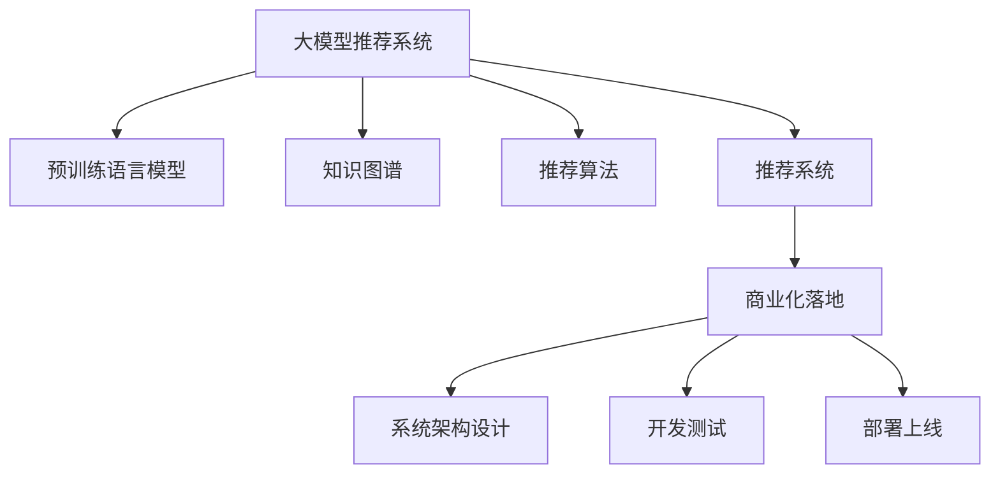

                 

# 大模型推荐系统的商业化落地

## 1. 背景介绍

在数字化时代，推荐系统已经成为各大互联网公司实现精准用户画像、提升用户体验、增加收入的重要手段。然而，传统的协同过滤推荐算法在面对海量数据和高维稀疏性时，面临诸多挑战，难以满足个性化推荐的需求。近年来，以深度学习为代表的大模型推荐系统逐渐崭露头角，通过预训练语言模型和大规模知识图谱等数据，构建了强大的语义理解能力和模式识别能力，成为推荐算法领域的研究热点。

但如何将大模型推荐系统从学术研究走向商业应用，实现落地部署，成为了一大难题。本文将深入探讨大模型推荐系统的核心概念、核心算法原理和具体操作步骤，并结合实际应用场景，给出详细的代码实例和优化建议，希望能为推荐系统的大模型应用提供全面指导。

## 2. 核心概念与联系

### 2.1 核心概念概述

为更好地理解大模型推荐系统的商业化落地，本节将介绍几个密切相关的核心概念：

- 大模型推荐系统：以大规模预训练语言模型和知识图谱为代表的新型推荐系统，具备更强大的语义理解能力和推荐效果。
- 预训练语言模型：通过在海量文本数据上进行自监督学习，获得通用的语言表示和语言模式。
- 知识图谱：由实体、关系和属性构成的语义网络，用于提供推荐系统所需的事实和逻辑推理能力。
- 推荐算法：根据用户行为数据和模型预测结果，推荐个性化的产品、内容或服务。
- 推荐系统：由数据、模型和算法组成的完整系统，为用户提供个性化推荐服务。
- 商业化落地：将推荐系统从实验室研究部署到实际业务场景中的过程，包括系统架构设计、开发测试、部署上线等环节。

这些概念之间的逻辑关系可以通过以下Mermaid流程图来展示：



这个流程图展示了大模型推荐系统的核心概念及其之间的关系：

1. 大模型推荐系统基于预训练语言模型和知识图谱。
2. 预训练语言模型提供语义理解能力，知识图谱提供逻辑推理能力。
3. 推荐算法根据模型预测结果生成推荐结果。
4. 推荐系统由数据、模型和算法组成，为用户提供推荐服务。
5. 商业化落地涉及系统架构设计、开发测试和部署上线等多个环节。

这些概念共同构成了大模型推荐系统的构建框架，使其能够高效、精准地为用户提供个性化推荐服务。通过理解这些核心概念，我们可以更好地把握大模型推荐系统的技术原理和优化方向。

## 3. 核心算法原理 & 具体操作步骤

### 3.1 算法原理概述

大模型推荐系统的核心算法原理可以概括为"预训练+微调"，即先在大规模文本数据上对预训练语言模型进行自监督学习，然后在推荐任务数据上通过有监督微调获得推荐模型。该方法不仅能充分利用预训练模型的通用语义知识，还能在小样本数据上快速适应特定推荐任务，从而提升推荐效果。

具体的算法步骤如下：

1. 准备预训练语言模型和知识图谱数据。
2. 在大规模文本数据上对预训练语言模型进行预训练。
3. 收集推荐任务的数据，包括用户行为和产品/内容信息。
4. 设计推荐模型，在推荐任务数据上对预训练模型进行微调。
5. 在商业化环境中，将微调后的推荐模型部署上线，并进行系统架构设计和开发测试。

### 3.2 算法步骤详解

#### 3.2.1 数据准备

推荐系统的数据准备包括数据收集和数据清洗两个步骤。数据收集需要涵盖用户的浏览、点击、评分、购买等行为数据，以及产品/内容的属性、关系等描述信息。数据清洗主要涉及数据缺失处理、异常值检测和去重等操作。

#### 3.2.2 预训练模型

预训练模型的选择和训练是推荐系统构建的第一步。通常采用在大规模无标签文本数据上预训练的Transformer模型，如BERT、GPT等。预训练过程通过自监督任务，如掩码语言模型、文本分类等，学习通用的语言表示和语言模式。预训练模型的参数量通常很大，需要在GPU/TPU等高性能设备上进行训练，训练时间可长达数周。

#### 3.2.3 任务微调

任务微调是推荐系统构建的关键步骤。根据具体的推荐任务，如商品推荐、内容推荐等，将预训练模型作为初始化参数，使用推荐任务的数据对模型进行微调。微调过程使用推荐任务设计的损失函数，通过反向传播算法，更新模型参数以匹配推荐任务的目标。微调过程通常采用AdamW等优化器，设置较小的学习率，以避免破坏预训练权重。

#### 3.2.4 系统架构设计

推荐系统部署上线前，需要进行系统的架构设计。系统架构设计包括数据存储、分布式计算、在线服务、离线模型训练等多个方面。常见的系统架构包括流批一体架构、消息队列架构等。

#### 3.2.5 开发测试

系统架构设计完成后，需要进行开发测试。开发测试主要涉及代码实现、单元测试、集成测试等环节，确保系统各组件正常运行，且符合设计要求。开发测试过程中，还需进行性能测试、负载测试等，确保系统具备足够的扩展性和稳定性。

#### 3.2.6 部署上线

完成开发测试后，推荐系统可以部署上线。部署上线过程中，需要考虑系统的可扩展性、可用性和弹性设计，确保系统能够平稳运行。常见的部署方案包括云服务部署、容器化部署等。

### 3.3 算法优缺点

大模型推荐系统具有以下优点：

1. 通用性强。预训练模型具备较强的通用语义表示能力，可以适应多种推荐任务。
2. 推荐效果显著。预训练模型在大规模数据上预训练后，能够通过微调快速适应特定任务，提升推荐精度。
3. 可解释性好。大模型推荐系统的推荐过程可以基于模型参数和任务目标进行解释，提高透明度。
4. 适应性强。微调过程可以根据推荐任务的需求进行定制化设计，适应不同业务场景。

但大模型推荐系统也存在以下局限性：

1. 计算资源需求高。预训练模型和微调过程需要大量的计算资源，对硬件要求较高。
2. 数据需求大。微调过程需要大量的推荐任务数据，数据收集和处理成本高。
3. 模型复杂度高。大模型推荐系统的模型结构复杂，维护和调优难度较大。
4. 推荐结果不稳定。推荐结果受到模型参数和数据分布的影响较大，易受到模型过拟合的影响。

尽管存在这些局限性，但就目前而言，大模型推荐系统仍是最先进、最有效的推荐算法之一。未来相关研究的重点在于如何进一步优化预训练模型，降低计算资源需求，同时提高微调的效率和精度，确保推荐结果的稳定性和可解释性。

### 3.4 算法应用领域

大模型推荐系统已经在诸多领域得到了广泛的应用，例如：

- 电商推荐：通过分析用户的浏览、点击、购买行为，为用户推荐商品。
- 内容推荐：根据用户的历史阅读、观看行为，推荐新闻、视频、音乐等内容。
- 个性化广告：通过分析用户兴趣，为用户推荐个性化广告。
- 金融推荐：根据用户的历史交易行为，推荐理财产品和投资策略。
- 娱乐推荐：根据用户的兴趣，推荐电影、游戏、图书等娱乐产品。

除了上述这些经典应用外，大模型推荐系统还被创新性地应用到更多场景中，如智能客服、智能家居、智能城市等，为各行各业带来了新的应用可能性。随着大模型推荐技术的不断进步，相信在更多领域中，大模型推荐系统将发挥更大的作用。

## 4. 数学模型和公式 & 详细讲解 & 举例说明

### 4.1 数学模型构建

假设推荐任务的数据集为 $D=\{(x_i,y_i)\}_{i=1}^N, x_i \in \mathbb{R}^d, y_i \in \{0,1\}$，其中 $x_i$ 表示用户行为数据，$y_i$ 表示推荐结果（是否为用户感兴趣）。假设预训练模型为 $M_{\theta}$，其中 $\theta$ 为模型参数。推荐任务的目标是最大化目标函数：

$$
\max_{\theta} \sum_{i=1}^N L(M_{\theta}(x_i), y_i)
$$

其中 $L$ 为推荐任务设计的损失函数。

### 4.2 公式推导过程

以商品推荐为例，推荐任务的目标是预测用户对每个商品感兴趣的概率，设计损失函数为交叉熵损失函数：

$$
L(M_{\theta}(x_i), y_i) = -y_i \log M_{\theta}(x_i) - (1-y_i) \log (1-M_{\theta}(x_i))
$$

在推荐任务数据集 $D$ 上，经验风险最小化目标为：

$$
\min_{\theta} \frac{1}{N} \sum_{i=1}^N L(M_{\theta}(x_i), y_i)
$$

通过反向传播算法，计算目标函数对参数 $\theta$ 的梯度，使用 AdamW 等优化器更新参数：

$$
\theta \leftarrow \theta - \eta \nabla_{\theta} \mathcal{L}(\theta)
$$

其中 $\eta$ 为学习率。

### 4.3 案例分析与讲解

以电商推荐为例，具体实现步骤如下：

1. 数据准备：收集用户的浏览、点击、购买等行为数据，以及商品的描述、属性等描述信息，进行数据清洗和特征提取。
2. 预训练模型：在大规模文本数据上预训练 BERT 模型，获得通用的语言表示。
3. 任务微调：在电商推荐数据上对预训练模型进行微调，设计交叉熵损失函数，进行反向传播优化。
4. 系统架构设计：设计流批一体架构，使用 Flink 进行数据流处理，使用 Spark 进行批处理。
5. 开发测试：实现商品推荐服务，进行单元测试、集成测试、性能测试和负载测试。
6. 部署上线：使用 Kubernetes 进行容器化部署，使用 TensorFlow Serving 进行模型服务部署。

## 5. 项目实践：代码实例和详细解释说明

### 5.1 开发环境搭建

在进行大模型推荐系统的开发实践前，我们需要准备好开发环境。以下是使用 Python 进行 PyTorch 开发的环境配置流程：

1. 安装 Anaconda：从官网下载并安装 Anaconda，用于创建独立的 Python 环境。

2. 创建并激活虚拟环境：
```bash
conda create -n pytorch-env python=3.8 
conda activate pytorch-env
```

3. 安装 PyTorch：根据 CUDA 版本，从官网获取对应的安装命令。例如：
```bash
conda install pytorch torchvision torchaudio cudatoolkit=11.1 -c pytorch -c conda-forge
```

4. 安装 Transformers 库：
```bash
pip install transformers
```

5. 安装各类工具包：
```bash
pip install numpy pandas scikit-learn matplotlib tqdm jupyter notebook ipython
```

完成上述步骤后，即可在 `pytorch-env` 环境中开始推荐系统开发实践。

### 5.2 源代码详细实现

下面我们以电商推荐为例，给出使用 PyTorch 对 BERT 模型进行微调的 PyTorch 代码实现。

首先，定义电商推荐任务的数据处理函数：

```python
from transformers import BertTokenizer
from torch.utils.data import Dataset
import torch

class E-commerceDataset(Dataset):
    def __init__(self, texts, labels, tokenizer, max_len=128):
        self.texts = texts
        self.labels = labels
        self.tokenizer = tokenizer
        self.max_len = max_len
        
    def __len__(self):
        return len(self.texts)
    
    def __getitem__(self, item):
        text = self.texts[item]
        label = self.labels[item]
        
        encoding = self.tokenizer(text, return_tensors='pt', max_length=self.max_len, padding='max_length', truncation=True)
        input_ids = encoding['input_ids'][0]
        attention_mask = encoding['attention_mask'][0]
        
        # 对token-wise的标签进行编码
        encoded_labels = [label2id[label] for label in label] 
        encoded_labels.extend([label2id['O']] * (self.max_len - len(encoded_labels)))
        labels = torch.tensor(encoded_labels, dtype=torch.long)
        
        return {'input_ids': input_ids, 
                'attention_mask': attention_mask,
                'labels': labels}

# 标签与id的映射
label2id = {'O': 0, 'Buy': 1}
id2label = {v: k for k, v in label2id.items()}

# 创建dataset
tokenizer = BertTokenizer.from_pretrained('bert-base-cased')

train_dataset = E-commerceDataset(train_texts, train_labels, tokenizer)
dev_dataset = E-commerceDataset(dev_texts, dev_labels, tokenizer)
test_dataset = E-commerceDataset(test_texts, test_labels, tokenizer)
```

然后，定义模型和优化器：

```python
from transformers import BertForTokenClassification, AdamW

model = BertForTokenClassification.from_pretrained('bert-base-cased', num_labels=len(label2id))

optimizer = AdamW(model.parameters(), lr=2e-5)
```

接着，定义训练和评估函数：

```python
from torch.utils.data import DataLoader
from tqdm import tqdm
from sklearn.metrics import classification_report

device = torch.device('cuda') if torch.cuda.is_available() else torch.device('cpu')
model.to(device)

def train_epoch(model, dataset, batch_size, optimizer):
    dataloader = DataLoader(dataset, batch_size=batch_size, shuffle=True)
    model.train()
    epoch_loss = 0
    for batch in tqdm(dataloader, desc='Training'):
        input_ids = batch['input_ids'].to(device)
        attention_mask = batch['attention_mask'].to(device)
        labels = batch['labels'].to(device)
        model.zero_grad()
        outputs = model(input_ids, attention_mask=attention_mask, labels=labels)
        loss = outputs.loss
        epoch_loss += loss.item()
        loss.backward()
        optimizer.step()
    return epoch_loss / len(dataloader)

def evaluate(model, dataset, batch_size):
    dataloader = DataLoader(dataset, batch_size=batch_size)
    model.eval()
    preds, labels = [], []
    with torch.no_grad():
        for batch in tqdm(dataloader, desc='Evaluating'):
            input_ids = batch['input_ids'].to(device)
            attention_mask = batch['attention_mask'].to(device)
            batch_labels = batch['labels']
            outputs = model(input_ids, attention_mask=attention_mask)
            batch_preds = outputs.logits.argmax(dim=2).to('cpu').tolist()
            batch_labels = batch_labels.to('cpu').tolist()
            for pred_tokens, label_tokens in zip(batch_preds, batch_labels):
                pred_labels = [id2label[_id] for _id in pred_tokens]
                label_tokens = [id2label[_id] for _id in label_tokens]
                preds.append(pred_labels[:len(label_tokens)])
                labels.append(label_tokens)
                
    print(classification_report(labels, preds))
```

最后，启动训练流程并在测试集上评估：

```python
epochs = 5
batch_size = 16

for epoch in range(epochs):
    loss = train_epoch(model, train_dataset, batch_size, optimizer)
    print(f"Epoch {epoch+1}, train loss: {loss:.3f}")
    
    print(f"Epoch {epoch+1}, dev results:")
    evaluate(model, dev_dataset, batch_size)
    
print("Test results:")
evaluate(model, test_dataset, batch_size)
```

以上就是使用 PyTorch 对 BERT 进行电商推荐任务微调的完整代码实现。可以看到，得益于 Transformers 库的强大封装，我们可以用相对简洁的代码完成 BERT 模型的加载和微调。

### 5.3 代码解读与分析

让我们再详细解读一下关键代码的实现细节：

**E-commerceDataset类**：
- `__init__`方法：初始化文本、标签、分词器等关键组件。
- `__len__`方法：返回数据集的样本数量。
- `__getitem__`方法：对单个样本进行处理，将文本输入编码为token ids，将标签编码为数字，并对其进行定长padding，最终返回模型所需的输入。

**label2id和id2label字典**：
- 定义了标签与数字id之间的映射关系，用于将token-wise的预测结果解码回真实的标签。

**训练和评估函数**：
- 使用PyTorch的DataLoader对数据集进行批次化加载，供模型训练和推理使用。
- 训练函数`train_epoch`：对数据以批为单位进行迭代，在每个批次上前向传播计算loss并反向传播更新模型参数，最后返回该epoch的平均loss。
- 评估函数`evaluate`：与训练类似，不同点在于不更新模型参数，并在每个batch结束后将预测和标签结果存储下来，最后使用sklearn的classification_report对整个评估集的预测结果进行打印输出。

**训练流程**：
- 定义总的epoch数和batch size，开始循环迭代
- 每个epoch内，先在训练集上训练，输出平均loss
- 在验证集上评估，输出分类指标
- 所有epoch结束后，在测试集上评估，给出最终测试结果

可以看到，PyTorch配合Transformers库使得BERT微调的代码实现变得简洁高效。开发者可以将更多精力放在数据处理、模型改进等高层逻辑上，而不必过多关注底层的实现细节。

当然，工业级的系统实现还需考虑更多因素，如模型的保存和部署、超参数的自动搜索、更灵活的任务适配层等。但核心的微调范式基本与此类似。

## 6. 实际应用场景

### 6.1 智能客服系统

基于大模型推荐系统的智能客服系统，可以通过推荐算法为用户推荐最合适的客服回答。传统客服系统往往依赖人工客服，难以满足用户即时需求。使用智能客服系统，可以24小时不间断服务，快速响应用户咨询，提升客户满意度。

在技术实现上，可以收集企业内部的历史客服对话记录，将问题和最佳答复构建成监督数据，在此基础上对预训练模型进行微调。微调后的模型能够自动理解用户意图，匹配最合适的客服回答。对于用户提出的新问题，还可以接入检索系统实时搜索相关内容，动态组织生成回答。如此构建的智能客服系统，能大幅提升客户咨询体验和问题解决效率。

### 6.2 金融舆情监测

金融机构需要实时监测市场舆论动向，以便及时应对负面信息传播，规避金融风险。传统的人工监测方式成本高、效率低，难以应对网络时代海量信息爆发的挑战。基于大模型推荐系统的文本分类和情感分析技术，为金融舆情监测提供了新的解决方案。

具体而言，可以收集金融领域相关的新闻、报道、评论等文本数据，并对其进行主题标注和情感标注。在此基础上对预训练语言模型进行微调，使其能够自动判断文本属于何种主题，情感倾向是正面、中性还是负面。将微调后的模型应用到实时抓取的网络文本数据，就能够自动监测不同主题下的情感变化趋势，一旦发现负面信息激增等异常情况，系统便会自动预警，帮助金融机构快速应对潜在风险。

### 6.3 个性化推荐系统

当前的推荐系统往往只依赖用户的历史行为数据进行物品推荐，无法深入理解用户的真实兴趣偏好。基于大模型推荐系统的个性化推荐系统，可以更好地挖掘用户行为背后的语义信息，从而提供更精准、多样的推荐内容。

在实践中，可以收集用户浏览、点击、评论、分享等行为数据，提取和用户交互的物品标题、描述、标签等文本内容。将文本内容作为模型输入，用户的后续行为（如是否点击、购买等）作为监督信号，在此基础上微调预训练语言模型。微调后的模型能够从文本内容中准确把握用户的兴趣点。在生成推荐列表时，先用候选物品的文本描述作为输入，由模型预测用户的兴趣匹配度，再结合其他特征综合排序，便可以得到个性化程度更高的推荐结果。

### 6.4 未来应用展望

随着大模型推荐技术的不断发展，基于微调范式将在更多领域得到应用，为传统行业带来变革性影响。

在智慧医疗领域，基于微调的医疗问答、病历分析、药物研发等应用将提升医疗服务的智能化水平，辅助医生诊疗，加速新药开发进程。

在智能教育领域，微调技术可应用于作业批改、学情分析、知识推荐等方面，因材施教，促进教育公平，提高教学质量。

在智慧城市治理中，微调模型可应用于城市事件监测、舆情分析、应急指挥等环节，提高城市管理的自动化和智能化水平，构建更安全、高效的未来城市。

此外，在企业生产、社会治理、文娱传媒等众多领域，基于大模型推荐系统的智能应用也将不断涌现，为经济社会发展注入新的动力。相信随着技术的日益成熟，微调方法将成为推荐系统的重要范式，推动人工智能技术在各行业的应用。

## 7. 工具和资源推荐

### 7.1 学习资源推荐

为了帮助开发者系统掌握大模型推荐系统的理论基础和实践技巧，这里推荐一些优质的学习资源：

1. 《推荐系统》课程：由北京大学的李航教授主讲，系统讲解了推荐系统的理论基础、经典算法和实际应用。
2. 《深度学习基础》课程：由吴恩达教授主讲，介绍深度学习的基本原理和应用，为推荐系统的实现打下基础。
3. 《Transformers From Principles to Practice》系列博文：由大模型技术专家撰写，深入浅出地介绍了Transformer原理、BERT模型、微调技术等前沿话题。
4. 《Deep Learning for Recommendation Systems》书籍：介绍深度学习在推荐系统中的应用，包括模型设计、特征工程、优化算法等。
5. Kaggle：提供丰富的推荐系统数据集和竞赛平台，可供开发者学习和实践。

通过对这些资源的学习实践，相信你一定能够快速掌握大模型推荐系统的精髓，并用于解决实际的推荐问题。

### 7.2 开发工具推荐

高效的开发离不开优秀的工具支持。以下是几款用于大模型推荐系统开发的常用工具：

1. PyTorch：基于Python的开源深度学习框架，灵活动态的计算图，适合快速迭代研究。大部分预训练语言模型都有PyTorch版本的实现。
2. TensorFlow：由Google主导开发的开源深度学习框架，生产部署方便，适合大规模工程应用。同样有丰富的预训练语言模型资源。
3. Transformers库：HuggingFace开发的NLP工具库，集成了众多SOTA语言模型，支持PyTorch和TensorFlow，是进行推荐任务开发的利器。
4. Weights & Biases：模型训练的实验跟踪工具，可以记录和可视化模型训练过程中的各项指标，方便对比和调优。与主流深度学习框架无缝集成。
5. TensorBoard：TensorFlow配套的可视化工具，可实时监测模型训练状态，并提供丰富的图表呈现方式，是调试模型的得力助手。
6. Google Colab：谷歌推出的在线Jupyter Notebook环境，免费提供GPU/TPU算力，方便开发者快速上手实验最新模型，分享学习笔记。

合理利用这些工具，可以显著提升大模型推荐系统的开发效率，加快创新迭代的步伐。

### 7.3 相关论文推荐

大模型推荐系统的发展源于学界的持续研究。以下是几篇奠基性的相关论文，推荐阅读：

1. Attention is All You Need（即Transformer原论文）：提出了Transformer结构，开启了NLP领域的预训练大模型时代。
2. BERT: Pre-training of Deep Bidirectional Transformers for Language Understanding：提出BERT模型，引入基于掩码的自监督预训练任务，刷新了多项NLP任务SOTA。
3. Recommender Systems Handbook：系统介绍推荐系统的理论基础、算法设计和实际应用，涵盖多个经典推荐算法。
4. Learning Deep Architectures for Recommender Systems：介绍深度神经网络在推荐系统中的应用，包括各种深度学习架构和优化策略。
5. A Survey on Deep Learning for Recommender Systems：综述深度学习在推荐系统中的应用现状和未来发展方向，涵盖经典算法和前沿技术。

这些论文代表了大模型推荐系统的发展脉络。通过学习这些前沿成果，可以帮助研究者把握学科前进方向，激发更多的创新灵感。

## 8. 总结：未来发展趋势与挑战

### 8.1 研究成果总结

本文对大模型推荐系统的商业化落地进行了全面系统的介绍。首先阐述了大模型推荐系统的核心概念和理论基础，明确了推荐系统从实验室研究到商业部署的全过程。其次，从原理到实践，详细讲解了大模型推荐系统的数学模型、核心算法和具体操作步骤，给出了微调的完整代码实例和优化建议。同时，本文还结合实际应用场景，给出了具体的落地策略和未来展望。

通过本文的系统梳理，可以看到，大模型推荐系统正在成为推荐算法领域的重要范式，显著提升了推荐系统的效果和覆盖范围。得益于深度学习和预训练模型的强大能力，大模型推荐系统有望在更多行业和应用场景中发挥重要作用，推动推荐系统向更加智能化和高效化的方向发展。

### 8.2 未来发展趋势

展望未来，大模型推荐系统将呈现以下几个发展趋势：

1. 模型规模持续增大。随着算力成本的下降和数据规模的扩张，预训练模型和微调模型的参数量还将持续增长。超大规模模型蕴含的丰富知识，有望支撑更加复杂多变的推荐任务。
2. 推荐效果显著提升。通过进一步优化预训练模型和微调过程，推荐系统的推荐精度将显著提升，能够更好地满足用户个性化需求。
3. 推荐过程透明化。大模型推荐系统将通过可解释的推荐模型和透明的推荐过程，提高用户的信任度和满意度。
4. 推荐结果多样化。基于大模型推荐系统的推荐系统将能够提供多样化的推荐结果，帮助用户做出更全面、多维度的决策。
5. 跨领域推荐普及。随着知识图谱和跨领域推荐模型的发展，大模型推荐系统将能够跨越不同领域，为用户推荐跨领域的推荐结果。

以上趋势凸显了大模型推荐系统的广阔前景。这些方向的探索发展，必将进一步提升推荐系统的性能和应用范围，为人类智能化生活带来更多可能性。

### 8.3 面临的挑战

尽管大模型推荐系统已经取得了瞩目成就，但在迈向更加智能化、普适化应用的过程中，它仍面临着诸多挑战：

1. 数据成本高昂。尽管微调过程需要的数据量较小，但高质量的标注数据依然难以获得，数据收集和处理成本较高。
2. 模型资源需求大。预训练模型和微调过程需要大量的计算资源，硬件成本较高。
3. 推荐结果不稳定。推荐结果受到模型参数和数据分布的影响较大，易受到模型过拟合的影响。
4. 推荐过程透明性不足。推荐过程缺乏可解释性，用户难以理解和信任推荐结果。
5. 伦理和隐私问题。推荐系统中的数据隐私和用户隐私保护需要特别关注，以避免数据滥用和隐私泄露。

尽管存在这些挑战，但就目前而言，大模型推荐系统仍是最先进、最有效的推荐算法之一。未来相关研究的重点在于如何进一步优化预训练模型，降低计算资源需求，同时提高微调的效率和精度，确保推荐结果的稳定性和可解释性。

### 8.4 研究展望

面对大模型推荐系统面临的种种挑战，未来的研究需要在以下几个方面寻求新的突破：

1. 探索无监督和半监督推荐方法。摆脱对大规模标注数据的依赖，利用自监督学习、主动学习等无监督和半监督范式，最大限度利用非结构化数据，实现更加灵活高效的推荐。
2. 研究参数高效和计算高效的推荐算法。开发更加参数高效的推荐方法，在固定大部分预训练参数的情况下，只更新极少量的任务相关参数。同时优化推荐模型的计算图，减少前向传播和反向传播的资源消耗，实现更加轻量级、实时性的部署。
3. 融合因果和对比学习范式。通过引入因果推断和对比学习思想，增强推荐系统建立稳定因果关系的能力，学习更加普适、鲁棒的用户行为模式。
4. 引入更多先验知识。将符号化的先验知识，如知识图谱、逻辑规则等，与神经网络模型进行巧妙融合，引导推荐过程学习更准确、合理的用户行为模式。
5. 结合因果分析和博弈论工具。将因果分析方法引入推荐系统，识别出推荐结果的关键特征，增强推荐过程的因果性和逻辑性。借助博弈论工具刻画人机交互过程，主动探索并规避推荐系统的脆弱点，提高系统稳定性。
6. 纳入伦理道德约束。在推荐系统训练目标中引入伦理导向的评估指标，过滤和惩罚有偏见、有害的推荐结果，确保推荐系统的公平性和安全性。

这些研究方向的探索，必将引领大模型推荐系统迈向更高的台阶，为构建安全、可靠、可解释、可控的智能推荐系统铺平道路。面向未来，大模型推荐系统还需要与其他人工智能技术进行更深入的融合，如知识表示、因果推理、强化学习等，多路径协同发力，共同推动推荐系统向更加智能化、普适化和高效化的方向发展。只有勇于创新、敢于突破，才能不断拓展推荐系统的边界，让智能推荐技术更好地服务于人类生活。

## 9. 附录：常见问题与解答

**Q1：大模型推荐系统是否适用于所有推荐任务？**

A: 大模型推荐系统在大多数推荐任务上都能取得不错的效果，特别是对于数据量较小的任务。但对于一些特定领域的任务，如医学、法律等，仅仅依靠通用语料预训练的模型可能难以很好地适应。此时需要在特定领域语料上进一步预训练，再进行微调，才能获得理想效果。此外，对于一些需要时效性、个性化很强的任务，如对话、推荐等，微调方法也需要针对性的改进优化。

**Q2：微调过程中如何选择合适的学习率？**

A: 微调的学习率一般要比预训练时小1-2个数量级，如果使用过大的学习率，容易破坏预训练权重，导致过拟合。一般建议从1e-5开始调参，逐步减小学习率，直至收敛。也可以使用warmup策略，在开始阶段使用较小的学习率，再逐渐过渡到预设值。需要注意的是，不同的优化器(如AdamW、Adafactor等)以及不同的学习率调度策略，可能需要设置不同的学习率阈值。

**Q3：采用大模型推荐时会面临哪些资源瓶颈？**

A: 目前主流的预训练大模型动辄以亿计的参数规模，对算力、内存、存储都提出了很高的要求。GPU/TPU等高性能设备是必不可少的，但即便如此，超大批次的训练和推理也可能遇到显存不足的问题。因此需要采用一些资源优化技术，如梯度积累、混合精度训练、模型并行等，来突破硬件瓶颈。同时，模型的存储和读取也可能占用大量时间和空间，需要采用模型压缩、稀疏化存储等方法进行优化。

**Q4：如何缓解微调过程中的过拟合问题？**

A: 过拟合是微调面临的主要挑战，尤其是在标注数据不足的情况下。常见的缓解策略包括：
1. 数据增强：通过回译、近义替换等方式扩充训练集
2. 正则化：使用L2正则、Dropout、Early Stopping等避免过拟合
3. 对抗训练：引入对抗样本，提高模型鲁棒性
4. 参数高效微调：只调整少量参数(如Adapter、Prefix等)，减小过拟合风险
5. 多模型集成：训练多个微调模型，取平均输出，抑制过拟合

这些策略往往需要根据具体任务和数据特点进行灵活组合。只有在数据、模型、训练、推理等各环节进行全面优化，才能最大限度地发挥大模型推荐系统的威力。

**Q5：推荐系统在落地部署时需要注意哪些问题？**

A: 将微调后的推荐系统转化为实际应用，还需要考虑以下因素：
1. 模型裁剪：去除不必要的层和参数，减小模型尺寸，加快推理速度
2. 量化加速：将浮点模型转为定点模型，压缩存储空间，提高计算效率
3. 服务化封装：将推荐服务封装为标准化服务接口，便于集成调用
4. 弹性伸缩：根据请求流量动态调整资源配置，平衡服务质量和成本
5. 监控告警：实时采集系统指标，设置异常告警阈值，确保服务稳定性
6. 安全防护：采用访问鉴权、数据脱敏等措施，保障数据和模型安全

大模型推荐系统的大规模应用带来了更多的挑战，需要系统架构师和开发人员共同协作，确保推荐系统的稳定性、安全性和高效性。

---

作者：禅与计算机程序设计艺术 / Zen and the Art of Computer Programming

