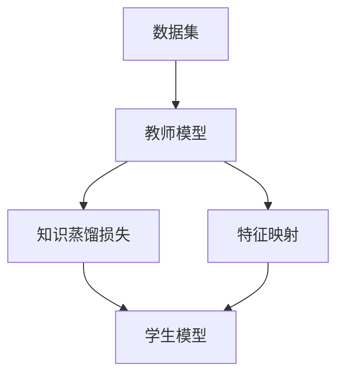

                 

## 1. 背景介绍

推荐系统是互联网时代的重要应用，通过收集用户行为数据，分析用户兴趣，精准推荐个性化商品、服务或内容。传统的协同过滤、内容推荐方法，往往依赖大量用户行为数据，在数据稀疏性、动态性、冷启动等问题上表现有限。

近年来，基于深度学习的方法在大规模推荐系统上取得了突破，特别是利用大规模预训练语言模型，使得推荐系统能更好地捕捉用户长尾兴趣、提升推荐质量。但这些基于大模型的推荐系统，往往需要消耗巨量的计算资源和标注数据，实际应用部署中存在资源消耗大、响应慢等缺点。

为了解决上述问题，知识蒸馏方法在推荐系统中得到了广泛应用。通过将教师模型（基于大规模预训练语言模型的推荐模型）的知识传递给学生模型（小规模推荐模型），在保留大模型的推荐能力基础上，显著降低资源消耗，提高推荐系统的部署效率。

## 2. 核心概念与联系

### 2.1 核心概念概述

为更好地理解知识蒸馏方法在大模型推荐系统中的应用，本节将介绍几个密切相关的核心概念：

- 知识蒸馏(Knowledge Distillation)：通过将知识从复杂模型（教师模型）蒸馏到简单模型（学生模型），提高学生模型的泛化能力，同时降低计算资源的消耗。

- 推荐系统(Recommender System)：利用用户的历史行为数据、兴趣模型、用户画像等，精准推荐个性化商品、服务或内容。推荐系统包括协同过滤、内容推荐、混合推荐等主流方法。

- 预训练语言模型(Pre-trained Language Model)：以自回归(如GPT)或自编码(如BERT)模型为代表的大规模预训练语言模型。通过在大规模无标签文本语料上进行预训练，学习通用的语言表示。

- 模型压缩(Model Compression)：通过剪枝、量化、融合等方法，降低模型复杂度，提高计算效率和存储效率，同时保持模型性能。

- 教师模型(Teacher Model)：基于预训练语言模型的复杂推荐模型，通常使用Transformer结构，具备强大的特征提取能力。

- 学生模型(Student Model)：基于简单结构（如线性模型）或深度较小的网络，通过知识蒸馏获得与教师模型相当的推荐能力。

- 知识蒸馏损失函数(Knowledge Distillation Loss)：用于衡量教师模型和学生模型之间差异的损失函数，主要包含软标签损失函数和KL散度损失函数。

- 特征映射(Feature Mapping)：将教师模型的特征表示映射到学生模型中，保留教师模型中的重要特征信息。

这些核心概念之间的逻辑关系可以通过以下Mermaid流程图来展示：



这个流程图展示了大模型推荐系统中知识蒸馏的基本流程：

1. 教师模型在训练集上学习用户行为模式。
2. 学生模型通过特征映射学习教师模型中的重要特征。
3. 教师模型和学生模型之间计算知识蒸馏损失，指导学生模型学习教师知识。
4. 最终在测试集上评估学生模型的推荐效果。

## 3. 核心算法原理 & 具体操作步骤
### 3.1 算法原理概述

知识蒸馏在大模型推荐系统中的应用，本质上是一种迁移学习过程。其核心思想是：将教师模型的知识（特征表示、推荐能力）迁移到学生模型中，使学生模型在保持推荐准确性的基础上，显著降低计算资源消耗。

具体地，知识蒸馏分为两个步骤：首先，教师模型在标注数据上学习用户行为模式；然后，在训练集和测试集上，教师模型和学生模型通过知识蒸馏损失函数计算目标损失，指导学生模型学习教师知识。

### 3.2 算法步骤详解

知识蒸馏在大模型推荐系统中的应用主要包括以下几个关键步骤：

**Step 1: 准备数据集**

1. 收集用户行为数据，包括点击、购买、评分、浏览记录等，划分为训练集、验证集和测试集。
2. 对用户行为数据进行预处理，去除噪声、填充缺失值、归一化处理等。

**Step 2: 设计教师模型**

1. 选择适合的任务预训练语言模型，如BERT、GPT等。
2. 基于选择的语言模型，设计推荐模型结构。
3. 在标注数据上，使用监督学习任务训练教师模型。

**Step 3: 设计学生模型**

1. 设计简单的推荐模型，如线性回归、KNN、随机森林等。
2. 基于选择的推荐模型，设计模型参数和结构。
3. 在标注数据上，使用监督学习任务训练学生模型。

**Step 4: 计算知识蒸馏损失**

1. 将教师模型的特征表示映射到学生模型中，形成学生模型的特征表示。
2. 使用软标签损失函数计算教师模型和学生模型之间的目标损失。
3. 将教师模型的概率分布映射为学生模型的预测结果。
4. 使用KL散度损失函数计算两个模型之间的距离，指导学生模型学习教师知识。

**Step 5: 训练学生模型**

1. 在训练集上，使用知识蒸馏损失和监督学习任务损失函数的加权和进行训练。
2. 在验证集上，评估学生模型的性能，根据性能指标调整训练参数。
3. 在测试集上，评估学生模型的最终性能。

**Step 6: 部署学生模型**

1. 将训练好的学生模型部署到生产环境中，进行推荐服务。
2. 实时采集用户反馈，不断更新学生模型的参数，提升推荐效果。

以上是知识蒸馏在大模型推荐系统中的基本流程。在实际应用中，还需要针对具体任务的特点，对知识蒸馏过程的各个环节进行优化设计，如改进特征映射方法，引入更多正则化技术，搜索最优的超参数组合等，以进一步提升学生模型的性能。

### 3.3 算法优缺点

知识蒸馏在大模型推荐系统中的应用，具有以下优点：

1. 数据利用率高。教师模型能够充分利用大规模标注数据，学习丰富的用户行为模式，同时学生模型在特征映射和蒸馏过程中，也能从教师模型中提取重要特征。
2. 计算效率高。通过知识蒸馏，学生模型具备与教师模型相当的推荐能力，同时参数量和计算量大幅降低，适合大规模部署。
3. 泛化能力强。知识蒸馏使得学生模型能够在不同的用户行为数据上保持稳定性能，具备较强的泛化能力。
4. 鲁棒性好。知识蒸馏过程能够提高学生模型的鲁棒性，减少过拟合风险，避免教师模型中的噪音对学生模型造成影响。

同时，该方法也存在一定的局限性：

1. 教师模型复杂。选择适合的预训练语言模型，构建合适的推荐模型结构，对模型设计和调参要求较高。
2. 特征映射难度大。教师模型和学生模型的特征表示可能存在较大差异，如何有效进行特征映射，是知识蒸馏的一个挑战。
3. 蒸馏损失难以设计。知识蒸馏损失函数的权重设置和参数调整，需要根据具体任务进行优化。
4. 泛化效果有限。在数据分布差异较大时，学生模型的泛化能力可能不如教师模型。
5. 性能损失风险。知识蒸馏过程中，学生模型可能会丢失教师模型的一些关键特征，导致性能下降。

尽管存在这些局限性，但就目前而言，知识蒸馏在大模型推荐系统中的应用已显示出巨大潜力，成为推荐系统领域的重要研究范式。未来相关研究的重点在于如何进一步降低教师模型的复杂度，优化特征映射方法，改进蒸馏损失设计，兼顾参数效率和推荐性能。

### 3.4 算法应用领域

知识蒸馏方法在大模型推荐系统中的应用，已在多个领域得到了广泛验证，具体包括：

- 电商推荐：通过知识蒸馏方法，从预训练语言模型中学习用户购买行为，推荐个性化商品。
- 视频推荐：利用知识蒸馏技术，从预训练语言模型中提取视频特征，推荐用户感兴趣的视频内容。
- 新闻推荐：在预训练语言模型上学习用户阅读行为，推荐用户感兴趣的新闻文章。
- 音乐推荐：从预训练语言模型中提取音乐特征，推荐用户喜欢的音乐作品。
- 社交网络推荐：利用知识蒸馏方法，从预训练语言模型中学习用户行为模式，推荐社交网络中的新好友。

除了上述这些经典任务外，知识蒸馏方法也被创新性地应用到更多场景中，如基于文本描述的推荐、基于用户画像的推荐、基于用户评论的推荐等，为推荐系统提供了新的思路和方法。

## 4. 数学模型和公式 & 详细讲解 & 举例说明
### 4.1 数学模型构建

本节将使用数学语言对知识蒸馏方法在大模型推荐系统中的应用进行更加严格的刻画。

记教师模型为 $M_T$，学生模型为 $M_S$，输入特征为 $x$，目标变量为 $y$。假设教师模型 $M_T$ 在训练集 $D_T$ 上训练得到，学生模型 $M_S$ 在训练集 $D_S$ 上训练得到。知识蒸馏的目标是最小化学生模型在测试集 $D_V$ 上的损失 $L_S$，同时最大化教师模型在测试集 $D_T$ 上的损失 $L_T$。

定义知识蒸馏损失函数为：

$$
L_{KD} = \alpha L_T + (1-\alpha) L_S
$$

其中，$\alpha$ 为教师模型在知识蒸馏损失中的权重。

知识蒸馏过程中，教师模型和学生模型之间的特征映射关系为 $f: F_T \rightarrow F_S$，其中 $F_T$ 为教师模型的特征空间，$F_S$ 为学生模型的特征空间。定义知识蒸馏损失函数为：

$$
L_{KD} = \alpha L_{T2S} + (1-\alpha) L_S
$$

其中 $L_{T2S}$ 为教师模型到学生模型的知识蒸馏损失，定义为：

$$
L_{T2S} = \frac{1}{N} \sum_{i=1}^N \ell(y, M_S(f(x)))
$$

其中 $\ell$ 为损失函数，$x$ 为输入，$y$ 为目标变量，$M_S(f(x))$ 为学生模型通过特征映射后的预测结果。

教师模型和学生模型之间的知识蒸馏损失函数的推导过程如下：

1. 定义教师模型和学生模型的输出概率分布：
   $$
   P_T(y|x) = softmax(M_T(x))
   $$
   $$
   P_S(y|x) = softmax(M_S(f(x)))
   $$

2. 将教师模型的概率分布映射为学生模型的预测结果：
   $$
   P_S(y|x) = P_T(y|x)
   $$

3. 定义知识蒸馏损失函数：
   $$
   L_{KD} = KL(P_S(y|x) || P_T(y|x))
   $$

其中 $KL$ 为KL散度损失函数，用于衡量两个概率分布之间的差异。

### 4.2 公式推导过程

以下我们以电商推荐任务为例，推导知识蒸馏损失函数及其梯度的计算公式。

假设教师模型为 $M_T$，学生模型为 $M_S$，输入为 $x$，目标为 $y$。教师模型的输出为 $M_T(x)$，学生模型的输出为 $M_S(f(x))$，其中 $f$ 为特征映射函数。

定义教师模型和学生模型在输入 $x$ 上的预测结果为：

$$
\hat{y}_T = M_T(x)
$$
$$
\hat{y}_S = M_S(f(x))
$$

定义教师模型和学生模型在输入 $x$ 上的交叉熵损失函数为：

$$
\ell_T(\hat{y}_T, y) = -y\log \hat{y}_T
$$
$$
\ell_S(\hat{y}_S, y) = -y\log \hat{y}_S
$$

教师模型和学生模型之间的知识蒸馏损失函数为：

$$
L_{KD} = \alpha \ell_T(\hat{y}_T, y) + (1-\alpha) \ell_S(\hat{y}_S, y)
$$

其中 $\alpha$ 为教师模型在知识蒸馏损失中的权重。

教师模型和学生模型的交叉熵损失函数对参数 $\theta$ 的梯度分别为：

$$
\frac{\partial \ell_T(\hat{y}_T, y)}{\partial \theta} = -\frac{y}{\hat{y}_T} \frac{\partial M_T(x)}{\partial \theta}
$$
$$
\frac{\partial \ell_S(\hat{y}_S, y)}{\partial \theta} = -\frac{y}{\hat{y}_S} \frac{\partial M_S(f(x))}{\partial \theta}
$$

教师模型和学生模型之间的知识蒸馏损失函数的梯度计算如下：

$$
\frac{\partial L_{KD}}{\partial \theta} = \alpha \frac{\partial \ell_T(\hat{y}_T, y)}{\partial \theta} + (1-\alpha) \frac{\partial \ell_S(\hat{y}_S, y)}{\partial \theta}
$$

在得到知识蒸馏损失函数的梯度后，即可带入参数更新公式，完成模型的迭代优化。重复上述过程直至收敛，最终得到适应电商推荐任务的最优学生模型。

## 5. 项目实践：代码实例和详细解释说明
### 5.1 开发环境搭建

在进行知识蒸馏实践前，我们需要准备好开发环境。以下是使用Python进行TensorFlow开发的环境配置流程：

1. 安装Anaconda：从官网下载并安装Anaconda，用于创建独立的Python环境。

2. 创建并激活虚拟环境：
```bash
conda create -n tf-env python=3.8 
conda activate tf-env
```

3. 安装TensorFlow：根据CUDA版本，从官网获取对应的安装命令。例如：
```bash
pip install tensorflow tensorflow_addons
```

4. 安装各类工具包：
```bash
pip install numpy pandas scikit-learn matplotlib tqdm jupyter notebook ipython
```

完成上述步骤后，即可在`tf-env`环境中开始知识蒸馏实践。

### 5.2 源代码详细实现

下面我以电商推荐任务为例，给出使用TensorFlow实现知识蒸馏的PyTorch代码实现。

首先，定义教师模型和学生模型的结构：

```python
import tensorflow as tf
from tensorflow.keras.layers import Input, Embedding, Dense, Dropout
from tensorflow.keras.models import Model

# 教师模型
input_T = Input(shape=(max_seq_length,))
embedding_T = Embedding(vocab_size, emb_dim)(input_T)
attention_T = Dense(emb_dim, activation='relu')(embedding_T)
dense_T = Dense(2, activation='softmax')(attention_T)
teacher_model = Model(input_T, dense_T)

# 学生模型
input_S = Input(shape=(max_seq_length,))
embedding_S = Embedding(vocab_size, emb_dim)(input_S)
dense_S = Dense(2, activation='softmax')(embedding_S)
student_model = Model(input_S, dense_S)
```

然后，定义损失函数和优化器：

```python
# 知识蒸馏损失函数
def knowledge_distillation_loss(y_true, y_pred):
    return tf.keras.losses.categorical_crossentropy(y_true, y_pred)

# 监督学习任务损失函数
def supervised_loss(y_true, y_pred):
    return tf.keras.losses.categorical_crossentropy(y_true, y_pred)

# 知识蒸馏权重
alpha = 0.5

# 定义综合损失函数
def total_loss(y_true, y_pred_T, y_pred_S):
    return alpha * supervised_loss(y_true, y_pred_T) + (1 - alpha) * knowledge_distillation_loss(y_true, y_pred_S)

# 定义优化器
optimizer = tf.keras.optimizers.Adam(learning_rate=0.001)
```

接着，定义训练和评估函数：

```python
# 训练函数
def train(epoch):
    total_loss = tf.keras.metrics.Mean()
    for batch, (input_X, input_y) in enumerate(train_dataset):
        with tf.GradientTape() as tape:
            y_pred_T = teacher_model(input_X)
            y_pred_S = student_model(input_X)
            loss = total_loss.update_state(tf.reshape(input_y, (1, -1)), tf.reshape(y_pred_S, (1, -1)))
        gradients = tape.gradient(loss, student_model.trainable_variables)
        optimizer.apply_gradients(zip(gradients, student_model.trainable_variables))
        if (batch + 1) % 100 == 0:
            print('Epoch {epoch}, Loss: {loss:.4f}'.format(epoch=epoch + 1, loss=loss.numpy().mean()))

# 评估函数
def evaluate(model, test_dataset):
    total_loss = tf.keras.metrics.Mean()
    for batch, (input_X, input_y) in enumerate(test_dataset):
        y_pred = model(input_X)
        loss = total_loss.update_state(tf.reshape(input_y, (1, -1)), tf.reshape(y_pred, (1, -1)))
    return loss.numpy().mean()
```

最后，启动训练流程并在测试集上评估：

```python
epochs = 10
batch_size = 32

for epoch in range(epochs):
    train(epoch)
    print('Epoch {epoch}, Test Loss: {test_loss:.4f}'.format(epoch=epoch + 1, test_loss=evaluate(student_model, test_dataset)))
```

以上就是使用TensorFlow实现电商推荐任务的知识蒸馏的完整代码实现。可以看到，得益于TensorFlow的强大封装，我们可以用相对简洁的代码完成知识蒸馏模型的训练。

### 5.3 代码解读与分析

让我们再详细解读一下关键代码的实现细节：

**教师模型和学生模型的定义**：
- `Input`层：用于定义输入数据的维度。
- `Embedding`层：将输入数据转换为向量表示。
- `Dense`层：全连接层，用于提取特征。
- `softmax`激活函数：将输出转化为概率分布。
- `Model`层：将多个层组合成完整的模型。

**损失函数的定义**：
- `categorical_crossentropy`：分类交叉熵损失函数，用于衡量预测结果与真实标签之间的差异。
- `alpha`：知识蒸馏权重，用于平衡教师模型和学生模型的重要性。

**训练和评估函数**：
- `train`函数：在每个epoch内，对训练集进行迭代，计算损失并反向传播更新模型参数。
- `evaluate`函数：在测试集上评估学生模型的性能，返回平均损失。

**训练流程**：
- 定义总的epoch数和batch size，开始循环迭代
- 每个epoch内，先进行训练，输出平均损失
- 在测试集上评估学生模型的性能，输出平均损失

可以看到，TensorFlow配合TensorFlow Addons提供了完整的知识蒸馏实现框架，开发者只需定义好模型结构和损失函数，即可快速上手训练知识蒸馏模型。

当然，工业级的系统实现还需考虑更多因素，如模型的保存和部署、超参数的自动搜索、更灵活的任务适配层等。但核心的知识蒸馏范式基本与此类似。

## 6. 实际应用场景
### 6.1 电商推荐

基于知识蒸馏的电商推荐系统，可以在有限标注数据的情况下，快速训练出高精度的推荐模型。

在实际应用中，电商推荐系统需要处理大量用户行为数据，包括点击、购买、浏览记录等。这些数据可以用于训练教师模型，学习用户购买行为模式。通过知识蒸馏，学生模型能够在保留教师模型推荐能力的同时，减少计算资源消耗，提高推荐系统的实时性。

### 6.2 视频推荐

视频推荐系统面临着用户数据量庞大、特征维度高的问题。利用知识蒸馏技术，可以显著降低推荐模型参数量，提高推荐速度和准确性。

在实际应用中，视频推荐系统需要从海量的视频数据中提取用户行为特征，包括观看时长、点赞、评论等。通过知识蒸馏，教师模型能够学习到丰富的用户行为特征，学生模型通过特征映射，能够在低参数量的情况下，快速推理推荐结果。

### 6.3 社交网络推荐

社交网络推荐系统需要处理用户之间的关系数据，包括好友关系、兴趣关系等。知识蒸馏方法能够从大规模预训练语言模型中提取用户行为特征，并快速应用于推荐系统，提升推荐效果。

在实际应用中，社交网络推荐系统需要从用户社交行为数据中学习用户兴趣和关系。通过知识蒸馏，教师模型能够学习到丰富的用户行为特征，学生模型通过特征映射，能够在低参数量的情况下，快速推理推荐结果。

### 6.4 未来应用展望

随着知识蒸馏技术的发展，其在推荐系统中的应用前景将更加广阔。未来，知识蒸馏技术将在以下几个方面得到进一步应用：

1. 自适应蒸馏。根据数据分布变化，动态调整教师模型的复杂度和蒸馏权重，确保推荐模型的泛化能力。
2. 多模态蒸馏。将知识蒸馏应用到多模态推荐系统中，融合文本、图像、音频等多源信息，提升推荐系统的效果。
3. 联合蒸馏。将知识蒸馏与其他推荐算法（如协同过滤、内容推荐）结合，进一步提升推荐系统的效果。
4. 混合蒸馏。在教师模型和学生模型之间引入中间层次，通过多层知识蒸馏，进一步提升学生模型的性能。
5. 元蒸馏。将蒸馏过程自动化，自动选择最优的教师模型和学生模型结构，提升蒸馏效果。

总之，知识蒸馏技术在大模型推荐系统中展现了巨大的潜力，未来将在更多的推荐场景中得到应用，提升推荐系统的性能和用户体验。

## 7. 工具和资源推荐
### 7.1 学习资源推荐

为了帮助开发者系统掌握知识蒸馏技术在大模型推荐系统中的应用，这里推荐一些优质的学习资源：

1. 《Deep Learning with PyTorch》系列博文：由PyTorch官方编写，详细介绍PyTorch的使用方法和推荐系统的实现。

2. CS231n《Convolutional Neural Networks for Visual Recognition》课程：斯坦福大学开设的计算机视觉课程，涵盖神经网络、推荐系统等内容。

3. 《Hands-On Machine Learning with Scikit-Learn, Keras, and TensorFlow》书籍：斯坦福大学李飞飞教授编写的推荐系统经典教材，详细介绍了推荐系统的各个方面。

4. 《Knowledge Distillation for Deep Learning》论文：论文集全面介绍了知识蒸馏技术，包括蒸馏方法、应用场景等。

5. 《Recommender Systems》书籍：陈逸平教授编写的推荐系统经典教材，详细介绍了推荐系统的原理和应用。

通过对这些资源的学习实践，相信你一定能够快速掌握知识蒸馏技术，并将其应用于推荐系统的开发中。

### 7.2 开发工具推荐

高效的开发离不开优秀的工具支持。以下是几款用于知识蒸馏开发的常用工具：

1. TensorFlow：由Google主导开发的开源深度学习框架，生产部署方便，适合大规模工程应用。

2. PyTorch：基于Python的开源深度学习框架，灵活动态的计算图，适合快速迭代研究。

3. TensorFlow Addons：TensorFlow的扩展库，提供了更多的深度学习组件和工具。

4. Weights & Biases：模型训练的实验跟踪工具，可以记录和可视化模型训练过程中的各项指标，方便对比和调优。

5. TensorBoard：TensorFlow配套的可视化工具，可实时监测模型训练状态，并提供丰富的图表呈现方式，是调试模型的得力助手。

6. Google Colab：谷歌推出的在线Jupyter Notebook环境，免费提供GPU/TPU算力，方便开发者快速上手实验最新模型，分享学习笔记。

合理利用这些工具，可以显著提升知识蒸馏任务的开发效率，加快创新迭代的步伐。

### 7.3 相关论文推荐

知识蒸馏技术在大模型推荐系统中的应用源于学界的持续研究。以下是几篇奠基性的相关论文，推荐阅读：

1. Distilling the Knowledge in a Neural Network：提出知识蒸馏的基本方法，通过教师模型到学生模型的软标签训练，提高学生模型的性能。

2. Learning Transferable Knowledge with Multi-task Learning：提出多任务学习蒸馏方法，通过联合训练多个任务，提高知识蒸馏的效果。

3. FitNets: A Simple Neural Network Architecture for Transfer Learning：提出FitNets架构，通过冻结部分层进行知识蒸馏，提升蒸馏效果。

4. Deep-Self-Distillation: Harnessing Unlabeled Data via Self-Distillation：提出自蒸馏方法，利用无标注数据进行知识蒸馏，进一步提升蒸馏效果。

5. Graphene: A novel neural network module for efficient knowledge distillation：提出Graphene模块，通过跨层知识蒸馏，提高学生模型的泛化能力。

这些论文代表了大模型推荐系统中知识蒸馏技术的发展脉络。通过学习这些前沿成果，可以帮助研究者把握学科前进方向，激发更多的创新灵感。

## 8. 总结：未来发展趋势与挑战

### 8.1 总结

本文对知识蒸馏方法在大模型推荐系统中的应用进行了全面系统的介绍。首先阐述了知识蒸馏的基本概念和在大模型推荐系统中的应用背景，明确了知识蒸馏在大模型推荐系统中的重要性和研究价值。其次，从原理到实践，详细讲解了知识蒸馏在大模型推荐系统中的应用方法，给出了知识蒸馏模型训练的完整代码实例。同时，本文还广泛探讨了知识蒸馏方法在电商推荐、视频推荐、社交网络推荐等多个推荐系统中的应用前景，展示了知识蒸馏技术的巨大潜力。最后，本文精选了知识蒸馏技术的各类学习资源，力求为读者提供全方位的技术指引。

通过本文的系统梳理，可以看到，知识蒸馏方法在大模型推荐系统中的应用，已经在多个领域得到了验证，并取得了显著的效果。未来，伴随知识蒸馏技术的持续演进，推荐系统将能够更好地利用大规模预训练语言模型，快速训练出高性能的推荐模型，提升推荐系统的效果和用户体验。

### 8.2 未来发展趋势

展望未来，知识蒸馏方法在大模型推荐系统中的应用将呈现以下几个发展趋势：

1. 自适应蒸馏。根据数据分布变化，动态调整教师模型的复杂度和蒸馏权重，确保推荐模型的泛化能力。
2. 多模态蒸馏。将知识蒸馏应用到多模态推荐系统中，融合文本、图像、音频等多源信息，提升推荐系统的效果。
3. 联合蒸馏。将知识蒸馏与其他推荐算法（如协同过滤、内容推荐）结合，进一步提升推荐系统的效果。
4. 混合蒸馏。在教师模型和学生模型之间引入中间层次，通过多层知识蒸馏，进一步提升学生模型的性能。
5. 元蒸馏。将蒸馏过程自动化，自动选择最优的教师模型和学生模型结构，提升蒸馏效果。

这些趋势凸显了知识蒸馏技术在大模型推荐系统中的重要性和未来潜力。这些方向的探索发展，必将进一步提升推荐系统的性能和用户体验，推动推荐系统技术的发展和应用。

### 8.3 面临的挑战

尽管知识蒸馏在大模型推荐系统中的应用已取得显著效果，但在迈向更加智能化、普适化应用的过程中，仍面临一些挑战：

1. 教师模型复杂。选择适合的预训练语言模型，构建合适的推荐模型结构，对模型设计和调参要求较高。
2. 特征映射难度大。教师模型和学生模型的特征表示可能存在较大差异，如何有效进行特征映射，是知识蒸馏的一个挑战。
3. 蒸馏损失难以设计。知识蒸馏损失函数的权重设置和参数调整，需要根据具体任务进行优化。
4. 泛化效果有限。在数据分布差异较大时，学生模型的泛化能力可能不如教师模型。
5. 性能损失风险。知识蒸馏过程中，学生模型可能会丢失教师模型的一些关键特征，导致性能下降。

尽管存在这些局限性，但就目前而言，知识蒸馏在大模型推荐系统中的应用已显示出巨大潜力，成为推荐系统领域的重要研究范式。未来相关研究的重点在于如何进一步降低教师模型的复杂度，优化特征映射方法，改进蒸馏损失设计，兼顾参数效率和推荐性能。

### 8.4 研究展望

面对知识蒸馏方法在大模型推荐系统中所面临的挑战，未来的研究需要在以下几个方面寻求新的突破：

1. 探索无监督和半监督蒸馏方法。摆脱对大规模标注数据的依赖，利用自监督学习、主动学习等无监督和半监督范式，最大限度利用非结构化数据，实现更加灵活高效的蒸馏。

2. 研究参数高效和计算高效的蒸馏范式。开发更加参数高效的蒸馏方法，在固定大部分教师模型参数的情况下，只更新极少量的学生模型参数。同时优化蒸馏模型的计算图，减少前向传播和反向传播的资源消耗，实现更加轻量级、实时性的部署。

3. 引入更多先验知识。将符号化的先验知识，如知识图谱、逻辑规则等，与神经网络模型进行巧妙融合，引导蒸馏过程学习更准确、合理的语言模型。同时加强不同模态数据的整合，实现视觉、语音等多模态信息与文本信息的协同建模。

4. 结合因果分析和博弈论工具。将因果分析方法引入蒸馏模型，识别出模型决策的关键特征，增强输出解释的因果性和逻辑性。借助博弈论工具刻画人机交互过程，主动探索并规避模型的脆弱点，提高系统稳定性。

5. 纳入伦理道德约束。在蒸馏模型训练目标中引入伦理导向的评估指标，过滤和惩罚有偏见、有害的输出倾向。同时加强人工干预和审核，建立模型行为的监管机制，确保输出符合人类价值观和伦理道德。

这些研究方向的探索，必将引领知识蒸馏技术在大模型推荐系统中迈向更高的台阶，为推荐系统带来更多的创新和发展机遇。面向未来，知识蒸馏技术还需要与其他人工智能技术进行更深入的融合，如知识表示、因果推理、强化学习等，多路径协同发力，共同推动推荐系统技术的进步。只有勇于创新、敢于突破，才能不断拓展知识蒸馏技术的应用边界，让智能推荐系统更好地服务于社会和经济的发展。

## 9. 附录：常见问题与解答

**Q1：知识蒸馏方法是否适用于所有推荐系统任务？**

A: 知识蒸馏方法在大多数推荐系统任务上都能取得不错的效果，特别是对于数据量较小的任务。但对于一些特定领域的任务，如医学、法律等，仅依靠通用语料预训练的模型可能难以很好地适应。此时需要在特定领域语料上进一步预训练，再进行蒸馏，才能获得理想效果。此外，对于一些需要时效性、个性化很强的任务，如对话、推荐等，蒸馏方法也需要针对性的改进优化。

**Q2：如何选择合适的教师模型？**

A: 选择合适的教师模型，需要考虑以下几个方面：
1. 任务匹配度。教师模型需要在推荐任务上具有较高的泛化能力，能够学习到任务相关的特征。
2. 数据分布一致性。教师模型与推荐数据在语言风格、用户行为模式等方面应保持一致性，以提高蒸馏效果。
3. 模型复杂度。教师模型应具备较高的复杂度，能够学习到丰富的特征信息。

**Q3：如何缓解知识蒸馏中的过拟合问题？**

A: 知识蒸馏中的过拟合问题可以通过以下方式缓解：
1. 数据增强：通过回译、近义替换等方式扩充训练集，提高数据的多样性。
2. 正则化技术：使用L2正则、Dropout、Early Stopping等避免过拟合。
3. 对抗训练：引入对抗样本，提高模型的鲁棒性，减少过拟合风险。

**Q4：知识蒸馏方法在落地部署时需要注意哪些问题？**

A: 知识蒸馏方法在落地部署时，还需要考虑以下因素：
1. 模型裁剪：去除不必要的层和参数，减小模型尺寸，加快推理速度。
2. 量化加速：将浮点模型转为定点模型，压缩存储空间，提高计算效率。
3. 服务化封装：将蒸馏模型封装为标准化服务接口，便于集成调用。
4. 弹性伸缩：根据请求流量动态调整资源配置，平衡服务质量和成本。
5. 监控告警：实时采集系统指标，设置异常告警阈值，确保服务稳定性。

**Q5：知识蒸馏方法与迁移学习有何不同？**

A: 知识蒸馏方法与迁移学习在目标和手段上略有不同：
1. 目标不同。迁移学习的目标是使得学生在已有知识的基础上学习新知识，提升在新任务上的性能；知识蒸馏的目标是使得学生模型在保留已有知识的基础上，提高在新任务上的性能。
2. 手段不同。迁移学习通常采用特征映射、联合训练等手段，将源任务的知识迁移到目标任务中；知识蒸馏则通过教师模型的知识蒸馏，指导学生模型学习知识。

总之，知识蒸馏方法和迁移学习都是将已有知识应用于新任务的有效手段，具体应用场景略有不同。在实际应用中，可以根据任务特点选择合适的方法。

---

作者：禅与计算机程序设计艺术 / Zen and the Art of Computer Programming

