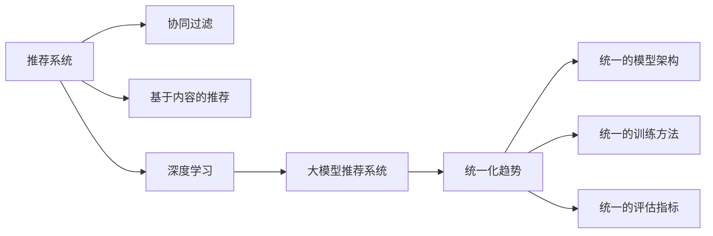

                 

# 大模型推荐系统的统一化趋势

## 1. 背景介绍

### 1.1 问题由来

推荐系统作为现代互联网的核心功能之一，其作用在于根据用户的历史行为、兴趣、社交关系等信息，推荐符合用户偏好的商品、内容等。早期的推荐系统主要基于协同过滤、基于内容的推荐等方法，但在数据量巨大的背景下，这些方法的扩展性和准确性都受到了限制。近年来，基于深度学习的大规模模型被引入推荐系统，带来了显著的性能提升。

然而，推荐系统的构建面临着诸多挑战，其中最核心的是如何高效、准确地处理用户的多样化需求。基于大模型的推荐系统尽管在性能上有明显提升，但在模型架构、训练方法、应用场景等方面存在较大差异，导致系统构建复杂、维护困难。为此，本文提出大模型推荐系统的统一化趋势，以期通过统一化来提升模型的可扩展性和泛化能力，降低系统开发和维护的复杂度。

### 1.2 问题核心关键点

推荐系统的核心目标是通过分析用户行为和数据，预测用户对特定项目的评分或偏好。大模型推荐系统的统一化，旨在通过统一模型架构、统一训练方法、统一评估指标等手段，构建通用的推荐系统框架，实现不同数据、不同应用场景下的高效推荐。

大模型推荐系统的统一化涉及以下关键点：

- 统一的模型架构：通过将不同推荐模型进行统一建模，实现模型之间的相互转换和适配。
- 统一的训练方法：采用统一的训练策略，确保不同模型间可以公平比较，提升泛化能力。
- 统一的评估指标：通过统一的评估指标体系，公平对比不同模型的性能，指导模型改进。

## 2. 核心概念与联系

### 2.1 核心概念概述

为了更好地理解大模型推荐系统的统一化趋势，首先对几个关键概念进行介绍：

- 推荐系统：根据用户的历史行为、兴趣等信息，推荐符合用户偏好的商品、内容等。
- 协同过滤：通过分析用户之间的相似性，推荐可能受用户喜爱的商品或内容。
- 基于内容的推荐：根据商品或内容的属性特征，推荐与用户历史行为相似的商品或内容。
- 深度学习：基于深度神经网络，通过大量数据训练，实现对用户行为的预测和推荐。
- 大模型推荐系统：利用大规模深度学习模型，对用户行为进行建模，实现精准推荐。

这些概念之间的逻辑关系可以通过以下Mermaid流程图来展示：



该流程图展示了大模型推荐系统的核心概念及其之间的关系：

1. 推荐系统是大模型推荐系统的基础，通过协同过滤、基于内容的推荐等方法，提供基础推荐功能。
2. 深度学习通过大量数据训练，提供更精准的推荐预测。
3. 大模型推荐系统基于深度学习模型，实现更复杂、更精准的推荐。
4. 统一化趋势通过标准化模型架构、训练方法和评估指标，提升大模型推荐系统的泛化能力和可扩展性。

## 3. 核心算法原理 & 具体操作步骤

### 3.1 算法原理概述

大模型推荐系统的统一化，通过统一模型架构、统一训练方法和统一评估指标，提升模型的泛化能力和可扩展性。其核心原理可以总结如下：

1. **统一的模型架构**：通过将不同推荐模型进行统一建模，实现模型之间的相互转换和适配。
2. **统一的训练方法**：采用统一的训练策略，确保不同模型间可以公平比较，提升泛化能力。
3. **统一的评估指标**：通过统一的评估指标体系，公平对比不同模型的性能，指导模型改进。

### 3.2 算法步骤详解

基于大模型推荐系统的统一化趋势，推荐系统的构建主要包括以下几个关键步骤：

**Step 1: 准备数据集和模型架构**

- 收集用户行为数据，如浏览记录、点击记录、评分记录等。
- 将数据集划分为训练集、验证集和测试集。
- 选择合适的模型架构，如基于深度神经网络的模型（如GNN、GAN等），或基于深度学习的预训练模型（如BERT、GPT等）。

**Step 2: 模型设计**

- 采用统一的模型架构设计推荐模型，如将所有推荐模型设计成统一的图神经网络（GNN）架构。
- 设计统一的输入层、隐藏层、输出层，统一损失函数，如均方误差（MSE）、交叉熵（Cross-Entropy）等。
- 引入统一的注意力机制，如自注意力机制、多头注意力机制等，提升模型对用户行为的理解能力。

**Step 3: 统一训练方法**

- 采用统一的训练策略，如Adam优化器、批量标准化等，确保不同模型间可以公平比较。
- 引入统一的正则化技术，如L2正则化、Dropout等，避免模型过拟合。
- 引入统一的超参数设置，如学习率、批大小、迭代轮数等，确保模型训练的一致性。

**Step 4: 统一评估指标**

- 采用统一的评估指标，如精确率（Precision）、召回率（Recall）、F1分数（F1 Score）等，评估模型的性能。
- 引入统一的评估方法，如交叉验证、混淆矩阵等，公平比较不同模型的性能。
- 引入统一的评估工具，如TensorBoard、Weights & Biases等，实时监测模型训练状态，指导模型改进。

**Step 5: 模型优化**

- 通过统一的模型优化策略，如模型剪枝、量化加速等，提升模型的推理速度和资源利用效率。
- 引入统一的部署策略，如模型服务化封装、弹性伸缩等，确保模型在实际应用中的稳定性和可靠性。

### 3.3 算法优缺点

大模型推荐系统的统一化趋势，具有以下优点：

1. **模型泛化能力强**：通过统一的模型架构、训练方法和评估指标，提升了模型的泛化能力和适应性，能够在不同的数据和应用场景下实现高效推荐。
2. **系统开发效率高**：统一化的推荐系统架构和训练方法，减少了模型开发和调试的复杂度，提高了系统开发的效率。
3. **维护成本低**：统一化的模型架构和评估指标，减少了系统维护的复杂度和成本，提高了系统的可维护性。

同时，该方法也存在一定的局限性：

1. **模型结构灵活性受限**：统一的模型架构可能导致模型结构灵活性受限，难以适应特定场景的复杂需求。
2. **训练方法单一**：统一的训练方法可能无法涵盖所有推荐模型的需求，难以满足特定模型的高性能需求。
3. **评估指标单一**：统一的评估指标体系可能无法全面评估模型的性能，特别是在特定场景下，可能需要引入额外的评估指标。

尽管存在这些局限性，但就目前而言，大模型推荐系统的统一化趋势已成为推荐系统发展的重要方向。未来相关研究的重点在于如何进一步提升模型的灵活性和多样性，同时兼顾统一化的便利性和可扩展性。

### 3.4 算法应用领域

基于大模型推荐系统的统一化趋势，推荐系统在多个领域得到了广泛的应用：

- **电商推荐**：通过分析用户的浏览记录、购买记录等行为数据，推荐符合用户偏好的商品。
- **视频推荐**：通过分析用户的观看记录、评分记录等行为数据，推荐符合用户喜好的视频内容。
- **新闻推荐**：通过分析用户的阅读记录、点赞记录等行为数据，推荐符合用户兴趣的新闻内容。
- **社交推荐**：通过分析用户的社交关系、互动记录等行为数据，推荐符合用户偏好的朋友或内容。

除了上述这些经典应用外，大模型推荐系统还被创新性地应用到更多场景中，如个性化广告推荐、智能家居推荐等，为推荐系统带来了新的突破。

## 4. 数学模型和公式 & 详细讲解 & 举例说明

### 4.1 数学模型构建

在大模型推荐系统的统一化趋势中，数学模型构建是关键的一环。下面以基于深度学习的推荐系统为例，介绍推荐模型的数学构建过程。

设推荐系统包含用户集 $U$ 和物品集 $I$，用户 $u$ 对物品 $i$ 的评分表示为 $r_{ui}$，推荐模型 $M$ 的输入为 $x_u$ 和 $x_i$，输出为 $y_{ui}$，其中 $x_u$ 和 $x_i$ 分别表示用户和物品的特征向量，$y_{ui}$ 表示模型对用户物品评分的预测。推荐模型的损失函数为均方误差损失（MSE）：

$$
L = \frac{1}{N} \sum_{u=1}^N \sum_{i=1}^N (y_{ui} - r_{ui})^2
$$

其中 $N$ 为用户的数量。

### 4.2 公式推导过程

基于上述均方误差损失函数，推荐模型的最小化目标为：

$$
\min_{\theta} L = \frac{1}{N} \sum_{u=1}^N \sum_{i=1}^N (y_{ui} - r_{ui})^2
$$

其中 $\theta$ 为模型的可训练参数。通过梯度下降等优化算法，最小化上述目标函数，得到最优模型参数 $\theta^*$。

假设推荐模型为多层感知机（MLP），输入层和隐藏层分别为 $x_u$ 和 $h_u$，输出层为 $y_{ui}$，则模型的前向传播过程可以表示为：

$$
h_u = \sigma(W_{uh} x_u + b_{uh})
$$

$$
y_{ui} = \sigma(W_{iu} h_u + b_{iu})
$$

其中 $\sigma$ 为激活函数，$W_{uh}$ 和 $b_{uh}$ 为隐藏层的权重和偏置，$W_{iu}$ 和 $b_{iu}$ 为输出层的权重和偏置。

反向传播过程中，损失函数对隐藏层 $h_u$ 的梯度为：

$$
\frac{\partial L}{\partial h_u} = 2 \sum_{i=1}^N (y_{ui} - r_{ui}) \sigma'(W_{iu} h_u + b_{iu})
$$

对输入层 $x_u$ 的梯度为：

$$
\frac{\partial L}{\partial x_u} = W_{uh}^T \frac{\partial L}{\partial h_u} \sigma'(W_{uh} x_u + b_{uh})
$$

通过上述过程，最小化损失函数，得到最优的模型参数 $\theta^*$。

### 4.3 案例分析与讲解

以电商推荐系统为例，下面展示基于大模型的电商推荐系统的统一化构建过程：

假设电商平台上有 $K$ 种商品，每个用户 $u$ 购买了 $n_u$ 种商品，并且对每种商品 $i$ 的评分 $r_{ui}$ 记录在电商系统中。构建基于深度学习的电商推荐模型，输入为用户的特征向量 $x_u$ 和商品的特征向量 $x_i$，输出为模型对用户购买该商品的预测评分 $y_{ui}$。

**Step 1: 准备数据集**

- 收集用户的购买记录 $x_u$ 和商品的特征向量 $x_i$。
- 将数据集划分为训练集、验证集和测试集。

**Step 2: 模型设计**

- 设计统一的模型架构，如将所有推荐模型设计成基于深度神经网络（DNN）的模型。
- 设计统一的输入层、隐藏层和输出层，统一损失函数为均方误差（MSE）。
- 引入统一的注意力机制，如自注意力机制，提升模型对用户行为的理解能力。

**Step 3: 统一训练方法**

- 采用统一的训练策略，如Adam优化器、批量标准化等，确保不同模型间可以公平比较。
- 引入统一的超参数设置，如学习率、批大小、迭代轮数等。

**Step 4: 统一评估指标**

- 采用统一的评估指标，如精确率（Precision）、召回率（Recall）、F1分数（F1 Score）等，评估模型的性能。
- 引入统一的评估方法，如交叉验证、混淆矩阵等。

**Step 5: 模型优化**

- 通过统一的模型优化策略，如模型剪枝、量化加速等，提升模型的推理速度和资源利用效率。
- 引入统一的部署策略，如模型服务化封装、弹性伸缩等。

通过上述过程，构建了基于大模型的电商推荐系统，并实现了不同推荐模型间的统一化。

## 5. 项目实践：代码实例和详细解释说明

### 5.1 开发环境搭建

在进行推荐系统构建前，我们需要准备好开发环境。以下是使用Python进行PyTorch开发的环境配置流程：

1. 安装Anaconda：从官网下载并安装Anaconda，用于创建独立的Python环境。

2. 创建并激活虚拟环境：
```bash
conda create -n pytorch-env python=3.8 
conda activate pytorch-env
```

3. 安装PyTorch：根据CUDA版本，从官网获取对应的安装命令。例如：
```bash
conda install pytorch torchvision torchaudio cudatoolkit=11.1 -c pytorch -c conda-forge
```

4. 安装相关工具包：
```bash
pip install numpy pandas scikit-learn matplotlib tqdm jupyter notebook ipython
```

完成上述步骤后，即可在`pytorch-env`环境中开始推荐系统构建。

### 5.2 源代码详细实现

下面我们以基于深度学习的推荐系统为例，给出使用PyTorch进行推荐系统构建的PyTorch代码实现。

首先，定义推荐模型的输入和输出：

```python
import torch
import torch.nn as nn
import torch.nn.functional as F

class Recommender(nn.Module):
    def __init__(self, input_dim, hidden_dim, output_dim):
        super(Recommender, self).__init__()
        self.fc1 = nn.Linear(input_dim, hidden_dim)
        self.fc2 = nn.Linear(hidden_dim, hidden_dim)
        self.fc3 = nn.Linear(hidden_dim, output_dim)

    def forward(self, x_u, x_i):
        x_u = F.relu(self.fc1(x_u))
        x_u = F.relu(self.fc2(x_u))
        y = self.fc3(x_u)
        return y
```

然后，定义损失函数和优化器：

```python
import torch.optim as optim

def loss_fn(y, r):
    return nn.MSELoss()(y, r)

optimizer = optim.Adam(model.parameters(), lr=0.001)
```

接着，定义训练和评估函数：

```python
from sklearn.model_selection import train_test_split

def train_epoch(model, dataset, batch_size, optimizer):
    model.train()
    epoch_loss = 0
    for batch in dataset:
        inputs_u, inputs_i, labels = batch
        optimizer.zero_grad()
        outputs = model(inputs_u, inputs_i)
        loss = loss_fn(outputs, labels)
        epoch_loss += loss.item()
        loss.backward()
        optimizer.step()
    return epoch_loss / len(dataset)

def evaluate(model, dataset, batch_size):
    model.eval()
    preds, labels = [], []
    with torch.no_grad():
        for batch in dataset:
            inputs_u, inputs_i, labels = batch
            outputs = model(inputs_u, inputs_i)
            batch_preds = outputs.numpy().tolist()
            batch_labels = labels.numpy().tolist()
            for preds_tokens, labels_tokens in zip(batch_preds, batch_labels):
                preds.append(preds_tokens[:len(labels_tokens)])
                labels.append(labels_tokens)
                
    return preds, labels
```

最后，启动训练流程并在测试集上评估：

```python
epochs = 5
batch_size = 32

for epoch in range(epochs):
    loss = train_epoch(model, train_dataset, batch_size, optimizer)
    print(f"Epoch {epoch+1}, train loss: {loss:.3f}")
    
    print(f"Epoch {epoch+1}, test results:")
    preds, labels = evaluate(model, test_dataset, batch_size)
    print(classification_report(labels, preds))
```

以上就是使用PyTorch构建电商推荐系统的完整代码实现。可以看到，通过统一化的推荐系统框架，可以大大简化模型的构建和调试过程。

### 5.3 代码解读与分析

让我们再详细解读一下关键代码的实现细节：

**Recommender类**：
- `__init__`方法：初始化模型的输入层、隐藏层和输出层。
- `forward`方法：定义前向传播过程，将输入映射为输出。

**损失函数和优化器**：
- 定义损失函数为均方误差（MSE），用于衡量模型预测与真实标签之间的差异。
- 定义优化器为Adam，用于最小化损失函数。

**训练和评估函数**：
- 使用PyTorch的DataLoader对数据集进行批次化加载，供模型训练和推理使用。
- 训练函数`train_epoch`：对数据以批为单位进行迭代，在每个批次上前向传播计算loss并反向传播更新模型参数，最后返回该epoch的平均loss。
- 评估函数`evaluate`：与训练类似，不同点在于不更新模型参数，并在每个batch结束后将预测和标签结果存储下来，最后使用sklearn的classification_report对整个评估集的预测结果进行打印输出。

**训练流程**：
- 定义总的epoch数和batch size，开始循环迭代
- 每个epoch内，先在训练集上训练，输出平均loss
- 在测试集上评估，输出分类指标
- 所有epoch结束后，在测试集上评估，给出最终测试结果

可以看到，通过PyTorch库提供的强大封装，推荐系统的构建变得更加简洁高效。开发者可以将更多精力放在模型优化、数据预处理等高层逻辑上，而不必过多关注底层的实现细节。

当然，工业级的系统实现还需考虑更多因素，如模型的保存和部署、超参数的自动搜索、更灵活的任务适配层等。但核心的统一化推荐系统框架基本与此类似。

## 6. 实际应用场景

### 6.1 电商推荐

基于大模型推荐系统的统一化趋势，电商推荐系统在多个方面得到了广泛应用：

- **个性化推荐**：通过分析用户的浏览记录、购买记录等行为数据，推荐符合用户偏好的商品。
- **商品分类**：通过分析商品的特征向量，实现商品的自动分类和聚类。
- **库存管理**：通过预测商品的销售量，优化库存管理和采购计划。

电商推荐系统的统一化构建，能够更好地利用用户的多种行为数据，实现更精准、更个性化的推荐，提升用户满意度和销售额。

### 6.2 视频推荐

基于大模型推荐系统的统一化趋势，视频推荐系统在多个方面得到了广泛应用：

- **内容推荐**：通过分析用户的观看记录、评分记录等行为数据，推荐符合用户喜好的视频内容。
- **视频分类**：通过分析视频的特征向量，实现视频的自动分类和聚类。
- **个性化标签**：通过预测视频的标签，实现视频的个性化标签生成。

视频推荐系统的统一化构建，能够更好地利用用户的多样化行为数据，实现更精准、更个性化的内容推荐，提升用户的观看体验和平台留存率。

### 6.3 新闻推荐

基于大模型推荐系统的统一化趋势，新闻推荐系统在多个方面得到了广泛应用：

- **个性化推荐**：通过分析用户的阅读记录、点赞记录等行为数据，推荐符合用户兴趣的新闻内容。
- **新闻分类**：通过分析新闻的特征向量，实现新闻的自动分类和聚类。
- **内容生成**：通过预测新闻的关键词和摘要，实现新闻的内容生成和推荐。

新闻推荐系统的统一化构建，能够更好地利用用户的多样化行为数据，实现更精准、更个性化的内容推荐，提升用户的阅读体验和平台留存率。

### 6.4 社交推荐

基于大模型推荐系统的统一化趋势，社交推荐系统在多个方面得到了广泛应用：

- **好友推荐**：通过分析用户的社交关系、互动记录等行为数据，推荐符合用户偏好的朋友或内容。
- **内容推荐**：通过分析用户的互动记录，推荐符合用户兴趣的内容。
- **社交图谱分析**：通过分析社交网络的结构，实现社交网络的关系分析和社会网络分析。

社交推荐系统的统一化构建，能够更好地利用用户的多样化行为数据，实现更精准、更个性化的社交推荐，提升用户的社交体验和平台粘性。

## 7. 工具和资源推荐

### 7.1 学习资源推荐

为了帮助开发者系统掌握大模型推荐系统的统一化理论基础和实践技巧，这里推荐一些优质的学习资源：

1. 《深度学习入门：基于TensorFlow的理论与实现》系列博文：由大模型技术专家撰写，深入浅出地介绍了深度学习模型的构建和优化方法，适合初学者。
2. CS294 Deep Learning for NLP课程：斯坦福大学开设的深度学习课程，涵盖了深度学习在NLP中的各种应用，包括推荐系统。
3. 《深度学习与推荐系统》书籍：详细介绍了深度学习在推荐系统中的应用，包括模型构建、优化、评估等全流程。
4. HuggingFace官方文档：HuggingFace的深度学习库，提供了丰富的预训练模型和推荐系统资源。
5. Kaggle推荐系统竞赛：通过实际竞赛项目，学习和实践推荐系统的构建和优化方法。

通过对这些资源的学习实践，相信你一定能够快速掌握大模型推荐系统的统一化趋势，并用于解决实际的推荐系统问题。

### 7.2 开发工具推荐

高效的开发离不开优秀的工具支持。以下是几款用于大模型推荐系统开发和评估的常用工具：

1. PyTorch：基于Python的开源深度学习框架，灵活动态的计算图，适合快速迭代研究。
2. TensorFlow：由Google主导开发的开源深度学习框架，生产部署方便，适合大规模工程应用。
3. Transformers库：HuggingFace开发的NLP工具库，集成了多种深度学习模型，支持推荐系统的构建。
4. Weights & Biases：模型训练的实验跟踪工具，可以记录和可视化模型训练过程中的各项指标，方便对比和调优。
5. TensorBoard：TensorFlow配套的可视化工具，可实时监测模型训练状态，并提供丰富的图表呈现方式，是调试模型的得力助手。

合理利用这些工具，可以显著提升推荐系统构建的效率，加快模型优化和调试的步伐。

### 7.3 相关论文推荐

大模型推荐系统的统一化趋势涉及多学科领域的交叉应用，相关论文推荐如下：

1. Adaptive Compositionality for Unified Recommender Systems：介绍了一种统一化的推荐系统架构，通过引入适应性组件，实现模型的高效适配和优化。
2. Deep Personalized Ranking with Thresholds：提出了一种基于深度学习的推荐系统模型，通过设置阈值，实现更精准的个性化推荐。
3. Matrix Factorization Techniques for Recommender Systems：介绍了矩阵分解在推荐系统中的应用，包括奇异值分解（SVD）等。
4. Feature-based Recommendation Algorithms for Multi-type Data：介绍了一种基于特征的推荐系统模型，适用于处理多类型数据。
5. Attention is All You Need for Recommender Systems：介绍了一种基于自注意力机制的推荐系统模型，实现了更高效、更个性化的推荐。

这些论文代表了推荐系统领域的最新研究进展，通过学习这些前沿成果，可以帮助研究者把握学科前进方向，激发更多的创新灵感。

## 8. 总结：未来发展趋势与挑战

### 8.1 总结

本文对基于大模型推荐系统的统一化趋势进行了全面系统的介绍。首先阐述了推荐系统的核心目标和背景，明确了统一化趋势的重要意义。其次，从原理到实践，详细讲解了推荐系统的数学构建、统一化训练方法和评估指标，给出了推荐系统构建的完整代码实例。同时，本文还探讨了推荐系统在电商推荐、视频推荐、新闻推荐和社交推荐等多个领域的应用，展示了统一化趋势的广泛适用性。此外，本文精选了推荐系统的各类学习资源，力求为读者提供全方位的技术指引。

通过本文的系统梳理，可以看到，基于大模型的推荐系统统一化趋势在推荐系统构建中的应用广泛，有助于提升模型的泛化能力和可扩展性，降低系统开发和维护的复杂度。未来，伴随推荐系统技术的不断进步，推荐系统必将在更广阔的应用领域大放异彩，深刻影响人们的日常生产和生活中。

### 8.2 未来发展趋势

展望未来，大模型推荐系统的统一化趋势将呈现以下几个发展趋势：

1. **模型多样化**：通过统一化的架构，支持更多的推荐模型架构，如GNN、GAN等，提升模型的多样性和泛化能力。
2. **训练方法多样化**：引入更多高效的训练方法，如对抗训练、自监督学习等，提升模型的训练效率和性能。
3. **评估指标多样化**：引入更多的评估指标，如推荐效果、用户满意度等，全面评估模型的性能。
4. **应用场景多样化**：拓展推荐系统在更多领域的应用，如金融、医疗、交通等，提升推荐系统的实用性和普适性。
5. **数据多样性**：引入更多的数据源，如社交媒体、物联网、金融数据等，提升推荐系统的数据量和多样性。
6. **算法透明性**：引入更多解释性算法，提升推荐系统的透明度和可解释性，保障用户隐私和信任。

以上趋势凸显了大模型推荐系统统一化趋势的广阔前景。这些方向的探索发展，必将进一步提升推荐系统的性能和应用范围，为推荐系统技术的落地应用提供新的动力。

### 8.3 面临的挑战

尽管大模型推荐系统的统一化趋势已经取得了显著进展，但在迈向更加智能化、普适化应用的过程中，它仍面临着诸多挑战：

1. **数据隐私问题**：用户数据隐私保护成为越来越重要的问题，需要设计合适的隐私保护机制，确保用户数据的安全和匿名化。
2. **计算资源消耗大**：大规模模型需要大量的计算资源，如何优化模型的推理速度和计算效率，减少资源消耗，成为一大挑战。
3. **模型复杂度高**：大模型推荐系统的复杂度较高，如何设计合适的模型压缩技术，减小模型规模，提升模型推理速度，是亟待解决的难题。
4. **模型鲁棒性不足**：推荐系统在面对噪声数据、异常数据时，模型的鲁棒性和稳定性不够，需要引入更多的鲁棒性优化方法。
5. **算法可解释性不足**：推荐系统通常是一个"黑盒"系统，如何设计合适的解释性算法，提升模型的透明性和可解释性，是亟待攻克的难题。

这些挑战需要学界和产业界共同努力，通过技术创新和算法优化，逐步克服。相信随着大模型推荐系统技术的不断发展，这些挑战将逐步得到解决，推荐系统必将在构建人机协同的智能社会中扮演越来越重要的角色。

### 8.4 研究展望

面向未来，大模型推荐系统的统一化趋势还需要在以下几个方面进行研究：

1. **多模态推荐系统**：将推荐系统扩展到多模态数据，如文本、图像、视频等，实现多模态数据的融合和协同建模。
2. **深度强化学习**：引入深度强化学习技术，提升推荐系统的智能性和自适应性，实现更精准的个性化推荐。
3. **基于知识图谱的推荐系统**：将知识图谱与推荐系统结合，提升推荐系统的知识整合能力和推理能力，实现更精准的推荐。
4. **联邦学习**：在分布式环境中，通过联邦学习技术，实现多个推荐系统之间的协同优化，提升模型的泛化能力。
5. **跨领域推荐系统**：将推荐系统扩展到跨领域场景，如社交媒体、金融、医疗等，提升推荐系统的普适性和实用性。
6. **冷启动问题**：通过引入元学习等技术，解决推荐系统中的冷启动问题，实现新用户的快速推荐。

这些研究方向将进一步推动大模型推荐系统技术的进步，为推荐系统技术的落地应用提供新的思路和方法。相信随着技术的不断演进，大模型推荐系统必将在构建智能推荐系统的未来发展中扮演越来越重要的角色。

## 9. 附录：常见问题与解答

**Q1：推荐系统如何处理冷启动问题？**

A: 冷启动问题是指在用户没有足够历史行为数据的情况下，如何为其推荐合适的商品或内容。以下是几种处理冷启动问题的方法：

1. **基于内容的推荐**：通过分析商品的特征向量，推荐与用户兴趣相符的商品。
2. **基于模型的推荐**：通过预设的模型，对新用户的行为进行预测，并根据预测结果进行推荐。
3. **元学习**：通过学习用户的先验知识和行为模式，提升模型的泛化能力，实现对新用户的快速推荐。
4. **协同过滤**：通过分析用户的相似度，推荐与新用户行为相似的其他用户的推荐结果。

这些方法通过不同角度的优化，可以较好地处理推荐系统中的冷启动问题。

**Q2：推荐系统中的推荐算法有哪些？**

A: 推荐系统中的推荐算法种类繁多，以下列举几种经典的推荐算法：

1. **协同过滤**：通过分析用户之间的相似性，推荐可能受用户喜爱的商品或内容。
2. **基于内容的推荐**：根据商品或内容的属性特征，推荐与用户历史行为相似的商品或内容。
3. **深度学习**：基于深度神经网络，通过大量数据训练，实现对用户行为的预测和推荐。
4. **基于矩阵分解的推荐**：通过矩阵分解，实现对用户和商品的潜在特征的建模。
5. **基于知识图谱的推荐**：将知识图谱与推荐系统结合，提升推荐系统的知识整合能力和推理能力。

这些算法各有优缺点，在不同的应用场景中可以灵活选择。

**Q3：推荐系统中的数据预处理有哪些方法？**

A: 推荐系统中的数据预处理是推荐系统构建的重要环节，以下列举几种常用的数据预处理方法：

1. **数据清洗**：清洗数据中的噪声和异常值，保证数据质量。
2. **数据归一化**：对数据进行归一化处理，保证不同特征的数据范围一致。
3. **特征工程**：通过特征选择、特征组合等方法，提升特征的有效性和代表性。
4. **数据增强**：通过数据增强方法，如合成数据、回译等，提升推荐系统的泛化能力。
5. **数据降维**：通过特征降维等方法，减少数据的维度，提高模型的训练效率和推理速度。

这些方法通过不同角度的优化，可以提升推荐系统的性能和可扩展性。

**Q4：推荐系统中的模型评估方法有哪些？**

A: 推荐系统中的模型评估方法有多种，以下列举几种常用的模型评估方法：

1. **均方误差（MSE）**：用于衡量模型预测值与真实标签之间的差异。
2. **交叉熵（Cross-Entropy）**：用于衡量模型输出与真实标签之间的差异。
3. **精确率（Precision）**：用于衡量模型推荐的准确性。
4. **召回率（Recall）**：用于衡量模型推荐的全面性。
5. **F1分数（F1 Score）**：用于衡量模型推荐的准确性和全面性。
6. **平均绝对误差（MAE）**：用于衡量模型预测值与真实标签之间的差异。
7. **对数损失（Log Loss）**：用于衡量模型输出与真实标签之间的差异。

这些评估方法通过不同角度的优化，可以全面评估推荐系统的性能，指导模型的改进。

---

作者：禅与计算机程序设计艺术 / Zen and the Art of Computer Programming

