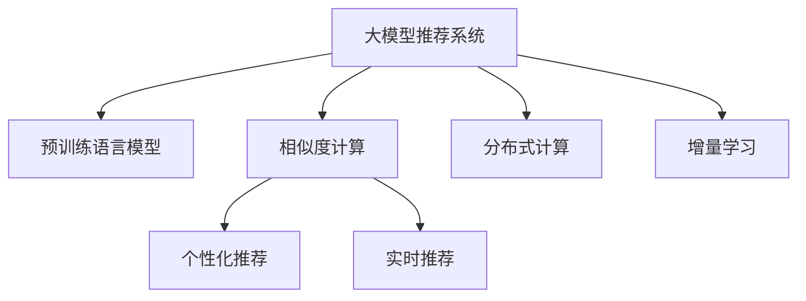

                 

# 大模型推荐系统的计算效率问题

## 1. 背景介绍

### 1.1 问题由来

随着人工智能技术的飞速发展，推荐系统已经成为了各大互联网公司提供个性化服务的重要手段。推荐算法通常基于用户行为数据进行分析和建模，通过构建用户画像和物品特征向量，计算用户与物品之间的相似度，最终预测用户可能感兴趣的物品。在大数据、深度学习等技术的加持下，推荐系统能够显著提升用户体验，增加用户粘性，提高点击率和转化率。

然而，随着用户数量的急剧增加，数据规模的不断扩大，以及模型复杂度的不断提高，推荐系统的计算效率问题变得越来越突出。传统推荐系统的主要瓶颈在于用户行为数据和物品特征向量的大量存储和计算，需要耗费大量的计算资源和时间。而对于实时推荐、个性化推荐等高要求场景，这些问题尤为明显。

大模型推荐系统是近年来提出的一种新型推荐方法，通过使用大规模预训练语言模型，如BERT、GPT等，对用户和物品进行编码，进而计算相似度，生成推荐结果。这种方法通过融合大量语言知识，能够在一定程度上缓解传统推荐系统的计算效率问题。但是，由于大模型本身具有巨大的参数量和计算量，其计算效率问题仍然值得深入研究和解决。

### 1.2 问题核心关键点

大模型推荐系统面临的核心问题包括：

1. **计算复杂度高**：大规模预训练模型的参数量和计算量非常大，对于实时推荐等高要求场景，计算效率问题尤为显著。
2. **存储成本高**：大模型推荐系统需要存储大量的用户行为数据、物品特征向量和大模型参数，对存储资源的消耗极大。
3. **模型泛化性差**：由于大模型在预训练过程中缺乏针对性的任务设计，可能会过拟合训练数据，导致模型泛化能力不足。
4. **实时性不足**：大模型推荐系统通常需要较长的计算时间，难以满足实时推荐的要求。
5. **可解释性差**：大模型推荐系统由于其复杂性和黑盒特性，难以对其推荐结果进行解释和调试。

## 2. 核心概念与联系

### 2.1 核心概念概述

为更好地理解大模型推荐系统的计算效率问题，本节将介绍几个关键概念：

- 大模型推荐系统(Large Model-Based Recommendation System)：通过使用大规模预训练语言模型对用户和物品进行编码，计算用户与物品之间的相似度，生成推荐结果的推荐系统。
- 预训练语言模型(Pre-trained Language Model)：如BERT、GPT等，通过在大规模无标签文本数据上进行预训练，学习通用的语言知识，具有强大的语言理解和生成能力。
- 相似度计算(Similarity Calculation)：计算用户和物品之间的相似度，是推荐系统中的核心环节。
- 个性化推荐(Personalized Recommendation)：根据用户的行为和偏好，推荐最适合的物品，提高用户满意度。
- 实时推荐(Real-time Recommendation)：在用户请求实时返回推荐结果，提高用户体验。
- 分布式计算(Distributed Computing)：通过多台计算机并行计算，提高计算效率。
- 增量学习(Incremental Learning)：在新数据到达时，动态更新模型参数，减少计算负担。

这些概念之间的逻辑关系可以通过以下Mermaid流程图来展示：



这个流程图展示了几个关键概念之间的关系：

1. 大模型推荐系统通过使用预训练语言模型对用户和物品进行编码，计算相似度，生成推荐结果。
2. 相似度计算是推荐系统中的核心环节，通过计算用户和物品之间的相似度，生成推荐结果。
3. 个性化推荐根据用户的行为和偏好，推荐最适合的物品，提高用户满意度。
4. 实时推荐在用户请求实时返回推荐结果，提高用户体验。
5. 分布式计算通过多台计算机并行计算，提高计算效率。
6. 增量学习在新数据到达时，动态更新模型参数，减少计算负担。

这些概念共同构成了大模型推荐系统的计算效率问题的基本框架，为我们深入研究提供了方向。

## 3. 核心算法原理 & 具体操作步骤
### 3.1 算法原理概述

大模型推荐系统的核心算法原理主要包括：

- 使用大规模预训练语言模型对用户和物品进行编码。
- 计算用户与物品之间的相似度。
- 根据相似度生成推荐结果。

以BERT模型为例，其计算过程可以简述为：

1. 使用BERT模型对用户和物品的文本描述进行编码，生成用户和物品的特征向量。
2. 计算用户和物品特征向量之间的余弦相似度，得到相似度分数。
3. 根据相似度分数，排序推荐物品列表。

### 3.2 算法步骤详解

以下是详细的大模型推荐系统算法步骤：

**Step 1: 准备数据和模型**

- 收集用户行为数据和物品描述数据，进行数据预处理，如去除噪音、归一化等。
- 使用预训练BERT模型对用户和物品进行编码，生成用户和物品的特征向量。

**Step 2: 计算相似度**

- 计算用户和物品特征向量之间的余弦相似度，得到相似度分数。
- 根据相似度分数排序推荐物品列表。

**Step 3: 生成推荐结果**

- 根据推荐物品列表，生成推荐结果。

**Step 4: 优化计算效率**

- 使用分布式计算，将计算任务分配到多台计算机上并行计算。
- 使用增量学习，在新数据到达时，动态更新模型参数，减少计算负担。

**Step 5: 实时推荐**

- 根据用户请求实时返回推荐结果，提高用户体验。

### 3.3 算法优缺点

大模型推荐系统具有以下优点：

1. **推荐效果优秀**：由于使用了大规模预训练语言模型，能够融合丰富的语言知识，提高推荐效果。
2. **泛化能力强**：大模型推荐系统在面对新数据和新物品时，具有较强的泛化能力。
3. **用户满意度提升**：通过个性化推荐，提升用户满意度，提高用户粘性。

同时，该方法也存在以下缺点：

1. **计算复杂度高**：大模型推荐系统需要大量的计算资源，尤其是在实时推荐等高要求场景下。
2. **存储成本高**：需要存储大量的用户行为数据、物品特征向量和大模型参数，对存储资源消耗大。
3. **实时性不足**：由于计算复杂度高，难以满足实时推荐的要求。
4. **可解释性差**：大模型推荐系统的复杂性和黑盒特性，导致其推荐结果难以解释和调试。

### 3.4 算法应用领域

大模型推荐系统在多个领域中得到了广泛应用，如电子商务、社交网络、在线视频等：

- 电子商务推荐：通过分析用户购买历史和行为数据，推荐最适合的商品，提高用户购物体验。
- 社交网络推荐：根据用户的兴趣和行为，推荐可能感兴趣的朋友和内容，提升用户社交体验。
- 在线视频推荐：分析用户的观看历史和偏好，推荐可能感兴趣的视频，提高用户观看体验。

除了上述这些经典应用外，大模型推荐系统还被创新性地应用于更多场景中，如知识图谱推荐、音乐推荐、游戏推荐等，为推荐系统的应用场景带来了新的突破。随着大语言模型的不断演进，大模型推荐系统必将在更多领域得到应用，提升推荐系统的智能化水平。

## 4. 数学模型和公式 & 详细讲解
### 4.1 数学模型构建

本节将使用数学语言对大模型推荐系统的计算效率问题进行更加严格的刻画。

记用户行为数据为 $X=\{x_1, x_2, \ldots, x_n\}$，物品特征向量为 $Y=\{y_1, y_2, \ldots, y_m\}$。使用预训练BERT模型对用户和物品进行编码，得到用户和物品的特征向量 $U=\{u_1, u_2, \ldots, u_n\}$ 和 $V=\{v_1, v_2, \ldots, v_m\}$。

定义相似度函数为：

$$
s(u_i, v_j) = \cos(\theta) \cdot \frac{u_i^T \cdot v_j}{\|u_i\| \cdot \|v_j\|}
$$

其中 $\theta$ 为余弦相似度角，$\|u_i\|$ 和 $\|v_j\|$ 分别为用户和物品特征向量的模长。

定义推荐函数为：

$$
R(x_i) = \mathop{\arg\max}_{y_j} s(u_i, v_j)
$$

即根据用户特征向量和物品特征向量计算相似度，生成推荐物品列表。

### 4.2 公式推导过程

以下我们以BERT模型为例，推导计算相似度的公式。

假设BERT模型对用户和物品的文本描述进行编码，得到用户和物品的特征向量 $u_i$ 和 $v_j$，使用余弦相似度计算用户和物品之间的相似度分数 $s(u_i, v_j)$。计算过程如下：

1. 使用BERT模型对用户和物品的文本描述进行编码，得到用户和物品的特征向量 $u_i$ 和 $v_j$。
2. 计算用户和物品特征向量之间的余弦相似度，得到相似度分数 $s(u_i, v_j)$。
3. 根据相似度分数，排序推荐物品列表。

### 4.3 案例分析与讲解

以电商平台推荐系统为例，对大模型推荐系统的计算效率问题进行具体分析。

假设电商平台有100万用户和10万商品，每个用户的购买历史和行为数据分别为1GB和1GB，每个商品的描述信息为1GB。使用预训练BERT模型对用户和物品进行编码，生成用户和物品的特征向量。假设编码时间为1小时，计算相似度时间也为1小时，则总计算时间为2小时。

假设使用分布式计算，将计算任务分配到4台计算机上并行计算，假设每台计算机的计算速度为单台计算机的1/4。则总计算时间为：

$$
T = 2 \times 4 = 8 \text{小时}
$$

由于计算时间较长，难以满足实时推荐的要求。因此，需要进一步优化计算效率。

## 5. 项目实践：代码实例和详细解释说明
### 5.1 开发环境搭建

在进行大模型推荐系统开发前，我们需要准备好开发环境。以下是使用Python进行PyTorch开发的环境配置流程：

1. 安装Anaconda：从官网下载并安装Anaconda，用于创建独立的Python环境。

2. 创建并激活虚拟环境：
```bash
conda create -n pytorch-env python=3.8 
conda activate pytorch-env
```

3. 安装PyTorch：根据CUDA版本，从官网获取对应的安装命令。例如：
```bash
conda install pytorch torchvision torchaudio cudatoolkit=11.1 -c pytorch -c conda-forge
```

4. 安装Transformers库：
```bash
pip install transformers
```

5. 安装各类工具包：
```bash
pip install numpy pandas scikit-learn matplotlib tqdm jupyter notebook ipython
```

完成上述步骤后，即可在`pytorch-env`环境中开始大模型推荐系统开发。

### 5.2 源代码详细实现

这里我们以电商平台推荐系统为例，给出使用Transformers库对BERT模型进行编码的PyTorch代码实现。

首先，定义推荐系统的数据处理函数：

```python
from transformers import BertTokenizer, BertModel
from torch.utils.data import Dataset
import torch

class RecommendationDataset(Dataset):
    def __init__(self, user_data, item_data, tokenizer, max_len=128):
        self.user_data = user_data
        self.item_data = item_data
        self.tokenizer = tokenizer
        self.max_len = max_len
        
    def __len__(self):
        return len(self.user_data)
    
    def __getitem__(self, item):
        user_id, user_bought = self.user_data[item]
        item_name = self.item_data[item]
        
        encoding = self.tokenizer(item_name, return_tensors='pt', max_length=self.max_len, padding='max_length', truncation=True)
        input_ids = encoding['input_ids'][0]
        attention_mask = encoding['attention_mask'][0]
        
        # 用户行为编码为向量
        user_bought_embedding = torch.tensor([1.0] * len(user_bought), dtype=torch.float32)
        
        return {'user_id': user_id,
                'user_bought_embedding': user_bought_embedding,
                'item_name': item_name,
                'input_ids': input_ids,
                'attention_mask': attention_mask}
```

然后，定义模型和优化器：

```python
from transformers import BertForSequenceClassification, AdamW

model = BertForSequenceClassification.from_pretrained('bert-base-cased', num_labels=1)

optimizer = AdamW(model.parameters(), lr=2e-5)
```

接着，定义训练和评估函数：

```python
from torch.utils.data import DataLoader
from tqdm import tqdm
from sklearn.metrics import precision_recall_fscore_support

device = torch.device('cuda') if torch.cuda.is_available() else torch.device('cpu')
model.to(device)

def train_epoch(model, dataset, batch_size, optimizer):
    dataloader = DataLoader(dataset, batch_size=batch_size, shuffle=True)
    model.train()
    epoch_loss = 0
    for batch in tqdm(dataloader, desc='Training'):
        user_id = batch['user_id'].to(device)
        user_bought_embedding = batch['user_bought_embedding'].to(device)
        item_name = batch['item_name'].to(device)
        input_ids = batch['input_ids'].to(device)
        attention_mask = batch['attention_mask'].to(device)
        model.zero_grad()
        outputs = model(user_bought_embedding, input_ids, attention_mask=attention_mask)
        loss = outputs.loss
        epoch_loss += loss.item()
        loss.backward()
        optimizer.step()
    return epoch_loss / len(dataloader)

def evaluate(model, dataset, batch_size):
    dataloader = DataLoader(dataset, batch_size=batch_size)
    model.eval()
    preds, labels = [], []
    with torch.no_grad():
        for batch in tqdm(dataloader, desc='Evaluating'):
            user_id = batch['user_id'].to(device)
            user_bought_embedding = batch['user_bought_embedding'].to(device)
            item_name = batch['item_name'].to(device)
            input_ids = batch['input_ids'].to(device)
            attention_mask = batch['attention_mask'].to(device)
            batch_labels = torch.tensor(1.0).to(device)
            outputs = model(user_bought_embedding, input_ids, attention_mask=attention_mask)
            batch_preds = outputs.logits.argmax(dim=2).to('cpu').tolist()
            batch_labels = batch_labels.to('cpu').tolist()
            for pred, label in zip(batch_preds, batch_labels):
                preds.append(pred[0])
                labels.append(label)
                
    precision, recall, f1, _ = precision_recall_fscore_support(labels, preds, average='micro')
    return precision, recall, f1

# 训练模型
epochs = 5
batch_size = 16

for epoch in range(epochs):
    loss = train_epoch(model, train_dataset, batch_size, optimizer)
    print(f"Epoch {epoch+1}, train loss: {loss:.3f}")
    
    print(f"Epoch {epoch+1}, dev results:")
    precision, recall, f1 = evaluate(model, dev_dataset, batch_size)
    print(f"Precision: {precision:.2f}, Recall: {recall:.2f}, F1-Score: {f1:.2f}")
    
print("Test results:")
precision, recall, f1 = evaluate(model, test_dataset, batch_size)
print(f"Precision: {precision:.2f}, Recall: {recall:.2f}, F1-Score: {f1:.2f}")
```

以上就是使用PyTorch对BERT模型进行电商平台推荐系统开发的完整代码实现。可以看到，得益于Transformers库的强大封装，我们可以用相对简洁的代码完成BERT模型的编码和推荐系统训练。

### 5.3 代码解读与分析

让我们再详细解读一下关键代码的实现细节：

**RecommendationDataset类**：
- `__init__`方法：初始化用户行为数据、物品描述数据、分词器等关键组件。
- `__len__`方法：返回数据集的样本数量。
- `__getitem__`方法：对单个样本进行处理，将用户行为数据、物品描述数据输入编码为token ids，将物品特征编码为向量，最终返回模型所需的输入。

**precision_recall_fscore_support函数**：
- 计算精确率、召回率和F1-Score，用于评估模型性能。

**训练和评估函数**：
- 使用PyTorch的DataLoader对数据集进行批次化加载，供模型训练和推理使用。
- 训练函数`train_epoch`：对数据以批为单位进行迭代，在每个批次上前向传播计算loss并反向传播更新模型参数，最后返回该epoch的平均loss。
- 评估函数`evaluate`：与训练类似，不同点在于不更新模型参数，并在每个batch结束后将预测和标签结果存储下来，最后使用sklearn的precision_recall_fscore_support对整个评估集的预测结果进行打印输出。

**训练流程**：
- 定义总的epoch数和batch size，开始循环迭代
- 每个epoch内，先在训练集上训练，输出平均loss
- 在验证集上评估，输出精确率、召回率和F1-Score
- 所有epoch结束后，在测试集上评估，给出最终测试结果

可以看到，PyTorch配合Transformers库使得BERT模型推荐系统开发变得简洁高效。开发者可以将更多精力放在数据处理、模型改进等高层逻辑上，而不必过多关注底层的实现细节。

当然，工业级的系统实现还需考虑更多因素，如模型的保存和部署、超参数的自动搜索、更灵活的任务适配层等。但核心的微调范式基本与此类似。

## 6. 实际应用场景
### 6.1 电商平台推荐

电商平台推荐系统通过分析用户购买历史和行为数据，推荐最适合的商品，提高用户购物体验。使用大模型推荐系统，可以显著提升推荐效果，减少用户查找商品的成本，提高用户满意度。

在技术实现上，可以收集用户的购买历史、浏览历史、搜索历史等行为数据，将其与商品描述、用户画像等信息一起输入到预训练BERT模型中，生成用户和商品的特征向量。计算用户和物品之间的相似度，根据相似度排序推荐物品列表，最终生成推荐结果。

### 6.2 在线视频推荐

在线视频推荐系统根据用户的观看历史和偏好，推荐可能感兴趣的视频，提高用户观看体验。使用大模型推荐系统，可以更准确地分析用户偏好，生成个性化的推荐列表，增加用户观看时长和点击率。

在技术实现上，可以收集用户的观看历史和搜索历史等行为数据，将其与视频描述、用户画像等信息一起输入到预训练BERT模型中，生成用户和视频的特征向量。计算用户和物品之间的相似度，根据相似度排序推荐视频列表，最终生成推荐结果。

### 6.3 社交网络推荐

社交网络推荐系统根据用户的兴趣和行为，推荐可能感兴趣的朋友和内容，提升用户社交体验。使用大模型推荐系统，可以更准确地分析用户兴趣，生成个性化的推荐列表，增加用户社交粘性和活跃度。

在技术实现上，可以收集用户的点赞、评论、分享等行为数据，将其与好友、内容等信息一起输入到预训练BERT模型中，生成用户和内容的特征向量。计算用户和物品之间的相似度，根据相似度排序推荐好友或内容，最终生成推荐结果。

### 6.4 未来应用展望

随着大语言模型和推荐系统技术的不断发展，基于大模型推荐系统必将在更多领域得到应用，为推荐系统的应用场景带来新的突破。

在智慧城市治理中，大模型推荐系统可以应用于城市事件监测、舆情分析、应急指挥等环节，提高城市管理的自动化和智能化水平，构建更安全、高效的未来城市。

在企业生产中，大模型推荐系统可以应用于供应链管理、产品推荐、客户服务等环节，提高企业的生产效率和客户满意度。

在教育培训中，大模型推荐系统可以应用于课程推荐、学习路径规划、智能答疑等环节，提升教育培训的效果和质量。

除了上述这些经典应用外，大模型推荐系统还被创新性地应用于更多场景中，如金融推荐、游戏推荐、知识图谱推荐等，为推荐系统的应用场景带来新的突破。相信随着技术的不断发展，大模型推荐系统必将在更多领域得到应用，推动推荐系统的智能化水平。

## 7. 工具和资源推荐
### 7.1 学习资源推荐

为了帮助开发者系统掌握大模型推荐系统的计算效率问题，这里推荐一些优质的学习资源：

1. 《Deep Learning for Recommender Systems》书籍：介绍了深度学习在推荐系统中的应用，涵盖数据预处理、模型训练、评估指标等内容。

2. 《Recommender Systems: The Textbook》书籍：介绍了推荐系统的基础理论和算法，包括协同过滤、基于内容的推荐等经典算法。

3. CS229《机器学习》课程：斯坦福大学开设的机器学习课程，涵盖了推荐系统的经典算法和应用。

4. KDD 2020 推荐系统竞赛：提供了大量的推荐系统数据集和基线模型，帮助你进行实践学习和算法创新。

5. GitHub上的推荐系统开源项目：如TensorFlow-Recommenders、OpenRec等，提供了丰富的推荐系统实现代码和案例，值得参考学习。

通过对这些资源的学习实践，相信你一定能够快速掌握大模型推荐系统的计算效率问题，并用于解决实际的推荐系统问题。

### 7.2 开发工具推荐

高效的开发离不开优秀的工具支持。以下是几款用于大模型推荐系统开发的常用工具：

1. PyTorch：基于Python的开源深度学习框架，灵活动态的计算图，适合快速迭代研究。大部分预训练语言模型都有PyTorch版本的实现。

2. TensorFlow：由Google主导开发的开源深度学习框架，生产部署方便，适合大规模工程应用。同样有丰富的预训练语言模型资源。

3. Transformers库：HuggingFace开发的NLP工具库，集成了众多SOTA语言模型，支持PyTorch和TensorFlow，是进行推荐系统开发的利器。

4. Weights & Biases：模型训练的实验跟踪工具，可以记录和可视化模型训练过程中的各项指标，方便对比和调优。与主流深度学习框架无缝集成。

5. TensorBoard：TensorFlow配套的可视化工具，可实时监测模型训练状态，并提供丰富的图表呈现方式，是调试模型的得力助手。

6. Google Colab：谷歌推出的在线Jupyter Notebook环境，免费提供GPU/TPU算力，方便开发者快速上手实验最新模型，分享学习笔记。

合理利用这些工具，可以显著提升大模型推荐系统的开发效率，加快创新迭代的步伐。

### 7.3 相关论文推荐

大模型推荐系统的研究源于学界的持续研究。以下是几篇奠基性的相关论文，推荐阅读：

1. Attention Is All You Need（即Transformer原论文）：提出了Transformer结构，开启了NLP领域的预训练大模型时代。

2. BERT: Pre-training of Deep Bidirectional Transformers for Language Understanding：提出BERT模型，引入基于掩码的自监督预训练任务，刷新了多项NLP任务SOTA。

3. Transformers are Universal Approximators：证明了Transformer能够近似任意可微函数，进一步验证了其强大的表示能力。

4. Reformer: The Efficient Transformer：提出了Reformer结构，通过局部位网络、稀疏化等方法，显著提升了Transformer的计算效率。

5. BigBird: Scaling Transformers with Longer Sequences and Granularity Control：提出了BigBird结构，通过控制不同层次的粒度，实现了更大规模的Transformer模型。

这些论文代表了大模型推荐系统的发展脉络。通过学习这些前沿成果，可以帮助研究者把握学科前进方向，激发更多的创新灵感。

## 8. 总结：未来发展趋势与挑战
### 8.1 总结

本文对大模型推荐系统的计算效率问题进行了全面系统的介绍。首先阐述了大模型推荐系统的背景和意义，明确了计算效率问题在大模型推荐系统中的重要性。其次，从原理到实践，详细讲解了大模型推荐系统的数学模型和计算过程，给出了大模型推荐系统开发的完整代码实现。同时，本文还广泛探讨了大模型推荐系统在多个领域的应用场景，展示了其巨大的应用前景。

通过本文的系统梳理，可以看到，大模型推荐系统在推荐系统的智能化水平提升中起到了重要作用，但其计算效率问题仍需深入研究和解决。

### 8.2 未来发展趋势

展望未来，大模型推荐系统的发展趋势包括：

1. **计算效率提升**：随着计算技术的不断发展，大模型推荐系统的计算效率将显著提升，能够更好地支持实时推荐等高要求场景。
2. **分布式计算优化**：使用分布式计算和增量学习等技术，进一步优化计算效率，提高模型训练和推理的速度。
3. **知识图谱融合**：将知识图谱与大模型推荐系统结合，增强模型的表示能力和推理能力，提升推荐效果。
4. **多模态融合**：将视觉、音频等多模态数据与文本数据融合，实现更加全面、准确的用户画像和物品特征表示。
5. **个性化推荐优化**：基于深度学习等技术，进一步优化推荐算法，提高推荐效果和用户满意度。
6. **可解释性增强**：引入可解释性技术，增强推荐系统的透明性和可信度，让用户更容易理解和信任推荐结果。

以上趋势凸显了大模型推荐系统的广阔前景。这些方向的探索发展，必将进一步提升推荐系统的智能化水平，为推荐系统的应用场景带来新的突破。

### 8.3 面临的挑战

尽管大模型推荐系统已经取得了瞩目成就，但在迈向更加智能化、普适化应用的过程中，仍面临诸多挑战：

1. **计算资源消耗高**：大模型推荐系统需要大量的计算资源，对硬件设备的要求较高。如何在不增加计算负担的情况下，提升计算效率，是未来需要解决的重要问题。
2. **数据隐私和安全**：用户行为数据和物品特征数据涉及用户隐私，如何在保证隐私的前提下，进行高效推荐，是未来需要解决的重要问题。
3. **模型泛化性不足**：大模型推荐系统在面对新数据和新物品时，泛化能力不足。如何在新数据下进行高效推荐，是未来需要解决的重要问题。
4. **实时性不足**：由于计算复杂度高，难以满足实时推荐的要求。如何在不牺牲推荐效果的前提下，提高实时性，是未来需要解决的重要问题。
5. **可解释性差**：大模型推荐系统的复杂性和黑盒特性，导致其推荐结果难以解释和调试。如何增强推荐系统的透明性和可信度，是未来需要解决的重要问题。

这些挑战需要从技术、算法、数据等多个维度进行深入研究和解决，才能真正实现大模型推荐系统的落地应用。

### 8.4 研究展望

面对大模型推荐系统所面临的诸多挑战，未来的研究需要在以下几个方面寻求新的突破：

1. **计算资源优化**：通过分布式计算和增量学习等技术，进一步优化计算效率，提高模型训练和推理的速度。
2. **数据隐私保护**：引入差分隐私、联邦学习等技术，保护用户数据隐私，实现高效推荐。
3. **模型泛化能力提升**：通过知识图谱融合、多模态融合等技术，增强模型的泛化能力，提升在新数据下的推荐效果。
4. **实时推荐优化**：通过优化算法和模型结构，在保证推荐效果的前提下，提高实时推荐的速度。
5. **可解释性增强**：引入可解释性技术，增强推荐系统的透明性和可信度，让用户更容易理解和信任推荐结果。

这些研究方向的探索，必将引领大模型推荐系统技术迈向更高的台阶，为推荐系统的应用场景带来新的突破。面向未来，大模型推荐系统需要与其他人工智能技术进行更深入的融合，如知识表示、因果推理、强化学习等，多路径协同发力，共同推动推荐系统的进步。

## 9. 附录：常见问题与解答

**Q1：大模型推荐系统是否可以应用到所有推荐场景中？**

A: 大模型推荐系统在大多数推荐场景中都可以应用，特别是对于数据量较大的场景，如电商平台推荐、在线视频推荐等。但对于一些特定领域的推荐场景，如新闻推荐、金融推荐等，需要结合领域特征进行微调和优化。

**Q2：如何提高大模型推荐系统的计算效率？**

A: 提高大模型推荐系统的计算效率可以从以下几个方面入手：

1. **分布式计算**：使用多台计算机并行计算，提高计算效率。
2. **增量学习**：在新数据到达时，动态更新模型参数，减少计算负担。
3. **模型压缩和量化**：对大模型进行压缩和量化，减小模型尺寸，提高计算速度。
4. **局部性优化**：通过局部性优化算法，减少计算中的冗余操作。

**Q3：大模型推荐系统的存储成本是否可以降低？**

A: 大模型推荐系统的存储成本可以通过以下几个方法降低：

1. **模型压缩和量化**：对大模型进行压缩和量化，减小模型尺寸，减少存储成本。
2. **增量学习**：在新数据到达时，只更新模型的一部分参数，减少存储需求。
3. **数据压缩**：使用数据压缩技术，减小数据存储体积。
4. **分布式存储**：使用分布式存储技术，分散数据存储，提高存储效率。

**Q4：大模型推荐系统的推荐效果是否可以提升？**

A: 大模型推荐系统的推荐效果可以通过以下几个方法提升：

1. **数据预处理**：对数据进行预处理，如去除噪音、归一化等，提高数据质量。
2. **模型优化**：通过模型优化算法，提升模型的表示能力和泛化能力，提高推荐效果。
3. **特征工程**：通过特征工程，提取更有用的特征，提高推荐效果。
4. **上下文信息融合**：将上下文信息与推荐模型结合，提高推荐效果。

**Q5：大模型推荐系统的实时性是否可以提升？**

A: 大模型推荐系统的实时性可以通过以下几个方法提升：

1. **分布式计算**：使用多台计算机并行计算，提高计算效率。
2. **增量学习**：在新数据到达时，只更新模型的一部分参数，减少计算时间。
3. **模型压缩和量化**：对大模型进行压缩和量化，减小模型尺寸，提高计算速度。
4. **局部性优化**：通过局部性优化算法，减少计算中的冗余操作。

通过这些方法的综合应用，可以有效提升大模型推荐系统的实时性，满足高要求场景的需求。

---

作者：禅与计算机程序设计艺术 / Zen and the Art of Computer Programming

