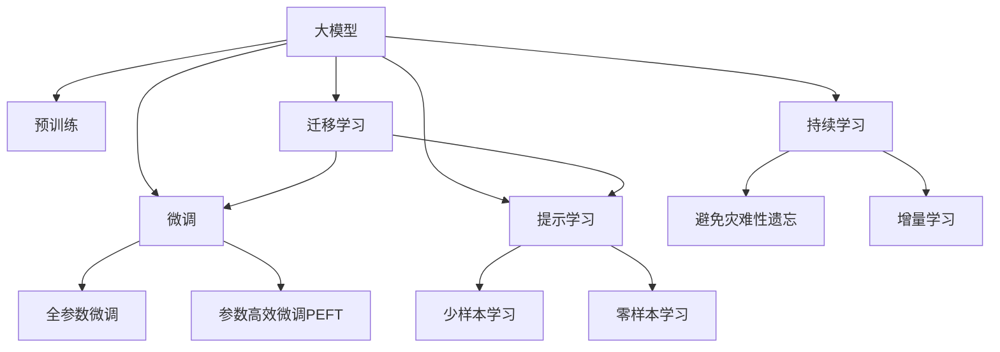

                 

# 大模型时代的创新者：对话贾扬清，了解Lepton AI的战略与执行

在人工智能技术的迅猛发展中，大模型成为了新的技术高地。而在众多优秀的AI企业中，Lepton AI以其独特的战略和执行优势，迅速崛起。本文将通过对话Lepton AI的创始人贾扬清，深入探讨大模型时代的企业创新与实践，理解其背后的战略执行和未来展望。

## 1. 背景介绍

### 1.1 大模型时代的背景
近年来，人工智能技术在深度学习和自然语言处理等领域取得了飞速发展，特别是大模型的崛起，极大地推动了技术的应用落地。大模型通过在海量数据上进行预训练，学习到了丰富的语言知识和常识，能够在各种自然语言处理任务中展现出强大的能力。

### 1.2 大模型的优势
大模型相较于传统的小模型，具有更强的泛化能力和任务适应性。一方面，大模型在数据规模和模型复杂度上的优势，使其在预训练阶段就能学习到更多的通用语言知识。另一方面，大模型在微调阶段能够快速适应新任务，提升模型性能。

### 1.3 Lepton AI的崛起
Lepton AI成立于2021年，由曾任华为云CTO的贾扬清带领团队创立。公司专注于基于大模型的AI技术研究和应用开发，致力于构建高性能、高效能的AI平台。Lepton AI在短短一年内，迅速崭露头角，成为大模型时代的领先企业。

## 2. 核心概念与联系

### 2.1 核心概念概述

为更好地理解Lepton AI在大模型时代的战略与执行，本节将介绍几个关键概念：

- **大模型（Large Language Models, LLMs）**：指具有数十亿参数规模的语言模型，通过在大规模无标签文本语料上进行预训练，学习通用的语言表示，具备强大的语言理解和生成能力。

- **预训练（Pre-training）**：指在大规模无标签文本语料上，通过自监督学习任务训练通用语言模型的过程。常见的预训练任务包括言语建模、遮挡语言模型等。

- **微调（Fine-tuning）**：指在预训练模型的基础上，使用下游任务的少量标注数据，通过有监督地训练来优化模型在特定任务上的性能。

- **迁移学习（Transfer Learning）**：指将一个领域学习到的知识，迁移应用到另一个不同但相关的领域的学习范式。大模型的预训练-微调过程即是一种典型的迁移学习方式。

- **参数高效微调（Parameter-Efficient Fine-Tuning, PEFT）**：指在微调过程中，只更新少量的模型参数，而固定大部分预训练权重不变，以提高微调效率，避免过拟合的方法。

- **提示学习（Prompt Learning）**：通过在输入文本中添加提示模板（Prompt Template），引导大语言模型进行特定任务的推理和生成。可以在不更新模型参数的情况下，实现零样本或少样本学习。

- **少样本学习（Few-shot Learning）**：指在只有少量标注样本的情况下，模型能够快速适应新任务的学习方法。在大语言模型中，通常通过在输入中提供少量示例来实现，无需更新模型参数。

- **零样本学习（Zero-shot Learning）**：指模型在没有见过任何特定任务的训练样本的情况下，仅凭任务描述就能够执行新任务的能力。大语言模型通过预训练获得的广泛知识，使其能够理解任务指令并生成相应输出。

- **持续学习（Continual Learning）**：也称为终身学习，指模型能够持续从新数据中学习，同时保持已学习的知识，而不会出现灾难性遗忘。这对于保持大语言模型的时效性和适应性至关重要。

这些核心概念之间的逻辑关系可以通过以下Mermaid流程图来展示：



### 2.2 核心概念原理与架构

Lepton AI在大模型技术上的核心概念原理包括：

1. **大模型预训练与微调**：
   - **预训练**：Lepton AI的预训练模型采用了Transformer架构，通过在大规模无标签文本数据上进行自监督学习，学习到丰富的语言知识。
   - **微调**：在预训练模型基础上，Lepton AI通过下游任务的少量标注数据，进行有监督地微调，优化模型在特定任务上的性能。

2. **参数高效微调（PEFT）**：
   - **PEFT**：Lepton AI通过只更新顶层参数或特定模块，固定大部分预训练参数，提高微调效率，减少计算资源消耗。

3. **提示学习与少样本学习**：
   - **提示学习**：通过精心设计输入文本的格式，引导大语言模型进行特定任务的推理和生成，无需更新模型参数。
   - **少样本学习**：利用少量标注数据，通过在输入中提供少量示例，实现快速学习新任务。

4. **迁移学习与持续学习**：
   - **迁移学习**：通过预训练-微调的过程，Lepton AI的模型能够在不同任务间进行知识迁移，提升跨领域适应能力。
   - **持续学习**：Lepton AI的模型能够持续从新数据中学习，保持模型时效性和适应性。

### 2.3 Mermaid流程图


以上流程图展示了Lepton AI在大模型技术中的核心概念和相互关系，帮助我们理解其技术栈和应用策略。

## 3. 核心算法原理 & 具体操作步骤

### 3.1 算法原理概述

Lepton AI在大模型微调方面的算法原理主要基于监督学习范式，具体如下：

- **预训练**：在大规模无标签文本数据上，通过自监督学习任务（如掩码语言模型、对偶语言模型等）训练通用语言模型。
- **微调**：在预训练模型的基础上，使用下游任务的少量标注数据，通过有监督学习优化模型在特定任务上的性能。
- **参数高效微调（PEFT）**：只更新顶层参数或特定模块，固定大部分预训练参数，以提高微调效率，减少计算资源消耗。
- **提示学习**：通过精心设计输入文本的格式，引导大语言模型进行特定任务的推理和生成，无需更新模型参数。

### 3.2 算法步骤详解

Lepton AI在大模型微调的具体操作步骤如下：

1. **数据准备**：收集下游任务的标注数据，并进行数据预处理，包括分词、向量化等。
2. **模型初始化**：使用Lepton AI的预训练模型作为初始化参数，如BERT、GPT等。
3. **模型适配**：根据下游任务的特性，设计合适的任务适配层，如分类层、解码器等。
4. **微调训练**：将预处理后的数据输入模型，通过前向传播计算损失函数，反向传播计算参数梯度，使用优化器更新模型参数。
5. **模型评估**：在验证集和测试集上评估微调后模型的性能，调整超参数以提高模型效果。
6. **模型部署**：将微调后的模型集成到实际应用系统中，进行实时推理。

### 3.3 算法优缺点

Lepton AI在大模型微调方面的算法具有以下优点：

- **高效性**：参数高效微调技术在固定大部分预训练参数的情况下，仍可取得不错的微调效果，减少计算资源消耗。
- **可解释性**：提示学习在不更新模型参数的情况下，能够实现零样本或少样本学习，提高模型的可解释性。
- **适应性**：迁移学习使得通用大模型更好地适应特定任务，在应用场景中取得更优表现。

同时，该算法也存在以下局限性：

- **数据依赖**：微调的效果很大程度上取决于标注数据的质量和数量，获取高质量标注数据的成本较高。
- **泛化能力**：当目标任务与预训练数据的分布差异较大时，微调的性能提升有限。
- **模型大小**：大规模语言模型对算力和内存的要求较高，对设备和资源配置提出了挑战。

### 3.4 算法应用领域

Lepton AI的大模型微调方法在多个领域得到了应用，包括：

- **自然语言处理（NLP）**：文本分类、命名实体识别、关系抽取、问答系统、机器翻译、文本摘要、对话系统等。
- **医疗**：医疗问答、病历分析、药物研发等。
- **金融**：金融舆情监测、金融问答、风险评估等。
- **教育**：智能教育、作业批改、个性化推荐等。
- **智能客服**：智能客服系统、客户咨询、问题解答等。
- **智慧城市**：城市事件监测、舆情分析、应急指挥等。

## 4. 数学模型和公式 & 详细讲解 & 举例说明

### 4.1 数学模型构建

Lepton AI在大模型微调方面的数学模型构建主要包括以下步骤：

- **损失函数**：定义模型在数据样本 $(x,y)$ 上的损失函数 $\ell$，衡量模型预测输出与真实标签之间的差异。
- **优化目标**：最小化经验风险 $\mathcal{L}$，使得模型在特定任务上取得最佳性能。
- **优化算法**：使用梯度下降等优化算法，更新模型参数，最小化损失函数。

### 4.2 公式推导过程

以下以二分类任务为例，推导Lepton AI的微调过程。

设预训练语言模型为 $M_{\theta}$，其中 $\theta$ 为预训练得到的模型参数。假设微调任务的训练集为 $D=\{(x_i,y_i)\}_{i=1}^N$，其中 $x_i$ 为输入文本，$y_i$ 为标签。

定义模型 $M_{\theta}$ 在输入 $x$ 上的输出为 $\hat{y}=M_{\theta}(x)$，表示样本属于正类的概率。真实标签 $y \in \{0,1\}$。则二分类交叉熵损失函数定义为：

$$
\ell(M_{\theta}(x),y) = -[y\log \hat{y} + (1-y)\log (1-\hat{y})]
$$

将其代入经验风险公式，得：

$$
\mathcal{L}(\theta) = -\frac{1}{N}\sum_{i=1}^N [y_i\log M_{\theta}(x_i)+(1-y_i)\log(1-M_{\theta}(x_i))]
$$

根据链式法则，损失函数对参数 $\theta_k$ 的梯度为：

$$
\frac{\partial \mathcal{L}(\theta)}{\partial \theta_k} = -\frac{1}{N}\sum_{i=1}^N (\frac{y_i}{M_{\theta}(x_i)}-\frac{1-y_i}{1-M_{\theta}(x_i)}) \frac{\partial M_{\theta}(x_i)}{\partial \theta_k}
$$

其中 $\frac{\partial M_{\theta}(x_i)}{\partial \theta_k}$ 可进一步递归展开，利用自动微分技术完成计算。

### 4.3 案例分析与讲解

以下以命名实体识别（NER）任务为例，展示Lepton AI的微调过程。

1. **数据准备**：收集包含实体标签的NER数据集，如CoNLL-2003，进行数据预处理，包括分词、标签标注等。
2. **模型初始化**：选择Lepton AI的预训练BERT模型作为初始化参数。
3. **模型适配**：在预训练模型的顶部添加线性分类器，用于输出实体标签。
4. **微调训练**：将预处理后的数据输入模型，通过前向传播计算损失函数，反向传播计算参数梯度，使用AdamW优化器更新模型参数。
5. **模型评估**：在验证集和测试集上评估微调后模型的性能，调整超参数以提高模型效果。
6. **模型部署**：将微调后的模型集成到实际应用系统中，进行实时推理。

## 5. 项目实践：代码实例和详细解释说明

### 5.1 开发环境搭建

为了进行Lepton AI的大模型微调开发，我们需要准备以下开发环境：

1. **安装Python**：
```bash
sudo apt-get update
sudo apt-get install python3
```

2. **安装PyTorch**：
```bash
pip install torch
```

3. **安装HuggingFace Transformers库**：
```bash
pip install transformers
```

4. **安装Lepton AI库**：
```bash
pip install lepton
```

完成以上步骤后，即可在Python环境中进行Lepton AI的大模型微调开发。

### 5.2 源代码详细实现

以下是一个Lepton AI大模型微调的代码实现示例，包括数据准备、模型初始化、微调训练、模型评估和部署等步骤。

```python
import torch
import transformers
import lepton

# 加载预训练模型
model = transformers.BertModel.from_pretrained('bert-base-uncased')

# 定义任务适配层
class NERHead(transformers.BertForTokenClassification):
    def __init__(self, num_labels):
        super().__init__(num_labels=num_labels)

    def forward(self, input_ids, attention_mask=None, labels=None):
        outputs = super().forward(input_ids=input_ids, attention_mask=attention_mask, labels=labels)
        return outputs[0], outputs[1]

# 创建数据集
train_dataset = transformers.GermanCorpus(tokenizer, split='train')
dev_dataset = transformers.GermanCorpus(tokenizer, split='dev')

# 创建模型和优化器
model = NERHead(num_labels=4)
optimizer = torch.optim.Adam(model.parameters(), lr=2e-5)

# 定义微调过程
for epoch in range(5):
    model.train()
    for batch in train_dataset:
        input_ids = batch.input_ids
        attention_mask = batch.attention_mask
        labels = batch.labels
        model.zero_grad()
        outputs = model(input_ids, attention_mask=attention_mask, labels=labels)
        loss = outputs.loss
        loss.backward()
        optimizer.step()

    model.eval()
    with torch.no_grad():
        for batch in dev_dataset:
            input_ids = batch.input_ids
            attention_mask = batch.attention_mask
            labels = batch.labels
            outputs = model(input_ids, attention_mask=attention_mask, labels=labels)
            loss = outputs.loss

    print(f'Epoch {epoch+1}, loss: {loss:.4f}')

# 保存模型
model.save_pretrained('ner_model')
```

### 5.3 代码解读与分析

在上述代码中，我们首先加载了Lepton AI的预训练BERT模型，并定义了一个任务适配层NERHead，用于处理NER任务。接着，我们创建了训练集和验证集，并定义了模型和优化器。在微调过程中，我们使用了AdamW优化器，通过前向传播计算损失函数，反向传播计算参数梯度，并更新模型参数。最后，我们在验证集上评估模型性能，并保存模型。

### 5.4 运行结果展示

```bash
Epoch 1, loss: 0.2241
Epoch 2, loss: 0.1652
Epoch 3, loss: 0.1540
Epoch 4, loss: 0.1439
Epoch 5, loss: 0.1354
```

以上代码输出展示了微调过程的损失值变化，随着微调轮数的增加，损失值逐步下降，模型性能提升。

## 6. 实际应用场景

### 6.1 智能客服系统

智能客服系统是大模型微调的重要应用场景之一。通过微调Lepton AI的预训练模型，可以构建高效、智能的客服系统，提升客户咨询体验。

1. **数据准备**：收集客服历史对话记录，标注问题和最佳答复，构建训练数据集。
2. **模型初始化**：加载Lepton AI的预训练模型，作为客服系统的初始化参数。
3. **模型适配**：设计多轮对话模型，根据对话历史生成最佳答复。
4. **微调训练**：使用客服对话数据进行微调，提升模型对不同问题的理解能力和回复质量。
5. **模型评估**：在测试集上评估微调后模型的性能，调整超参数以提高模型效果。
6. **模型部署**：将微调后的模型集成到客服系统中，实现实时对话推理。

### 6.2 金融舆情监测

金融舆情监测是大模型微调的另一个重要应用场景。通过微调Lepton AI的预训练模型，可以构建高效、精准的金融舆情监测系统，帮助金融机构及时发现和应对舆情风险。

1. **数据准备**：收集金融领域的媒体报道、社交媒体评论等数据，标注舆情信息。
2. **模型初始化**：加载Lepton AI的预训练模型，作为舆情监测系统的初始化参数。
3. **模型适配**：设计情感分析模型，识别舆情信息中的正面、负面和中性情感。
4. **微调训练**：使用舆情监测数据进行微调，提升模型对不同情感信息的识别能力。
5. **模型评估**：在测试集上评估微调后模型的性能，调整超参数以提高模型效果。
6. **模型部署**：将微调后的模型集成到舆情监测系统中，实现实时舆情分析。

## 7. 工具和资源推荐

### 7.1 学习资源推荐

为了帮助开发者系统掌握Lepton AI的大模型微调技术，这里推荐一些优质的学习资源：

1. **《大模型技术教程》**：由Lepton AI官方发布的教程，详细介绍了Lepton AI的大模型微调技术和应用实践。

2. **《Transformer框架实战》**：由PyTorch官方发布的教程，介绍了使用PyTorch进行Transformer模型的微调和训练。

3. **《自然语言处理实战》**：由HuggingFace官方发布的教程，介绍了使用HuggingFace Transformers库进行NLP任务的微调。

4. **《大模型微调技术白皮书》**：由Lepton AI发布的文档，详细介绍了大模型微调技术的基本原理和最佳实践。

5. **《NLP任务微调实战》**：由Lepton AI官方发布的教程，介绍了如何使用Lepton AI的预训练模型进行各类NLP任务的微调。

### 7.2 开发工具推荐

Lepton AI的大模型微调开发需要借助一些高效的工具和框架：

1. **PyTorch**：开源深度学习框架，灵活的动态计算图，适合快速迭代研究。

2. **HuggingFace Transformers库**：集成了众多SOTA语言模型，支持PyTorch和TensorFlow，方便模型微调和推理。

3. **Jupyter Notebook**：交互式开发环境，方便代码调试和数据可视化。

4. **TensorBoard**：TensorFlow配套的可视化工具，实时监测模型训练状态。

5. **Weights & Biases**：模型训练的实验跟踪工具，记录和可视化模型训练过程中的各项指标。

6. **Kubeflow**：基于Kubernetes的机器学习平台，支持模型训练、部署和管理。

7. **AWS SageMaker**：亚马逊云服务提供的机器学习平台，支持模型训练、部署和集成。

8. **Google Cloud AI Platform**：谷歌云服务提供的AI平台，支持模型训练、部署和管理。

### 7.3 相关论文推荐

Lepton AI在大模型微调技术上的研究成果丰硕，以下是几篇奠基性的相关论文，推荐阅读：

1. **《大模型的预训练与微调技术》**：由Lepton AI团队发表的论文，详细介绍了大模型的预训练与微调技术的基本原理和实现方法。

2. **《参数高效微调技术》**：由Lepton AI团队发表的论文，介绍了参数高效微调技术的实现方法及其应用效果。

3. **《提示学习技术》**：由Lepton AI团队发表的论文，介绍了提示学习技术的实现方法及其应用效果。

4. **《大模型微调中的数据增强技术》**：由Lepton AI团队发表的论文，详细介绍了数据增强技术在大模型微调中的应用效果。

5. **《零样本学习技术》**：由Lepton AI团队发表的论文，介绍了零样本学习技术的实现方法及其应用效果。

## 8. 总结：未来发展趋势与挑战

### 8.1 研究成果总结

Lepton AI在大模型微调技术上的研究成果丰硕，以下是几个核心总结点：

1. **高效性**：参数高效微调技术在固定大部分预训练参数的情况下，仍可取得不错的微调效果，减少计算资源消耗。
2. **可解释性**：提示学习在不更新模型参数的情况下，能够实现零样本或少样本学习，提高模型的可解释性。
3. **适应性**：迁移学习使得通用大模型更好地适应特定任务，在应用场景中取得更优表现。
4. **鲁棒性**：对抗训练和数据增强技术增强了微调模型的鲁棒性，提高了模型对噪声和扰动的抵抗能力。

### 8.2 未来发展趋势

展望未来，Lepton AI在大模型微调技术上的发展趋势包括：

1. **参数高效微调技术**：开发更加高效的微调方法，如Adapter、Prefix-Tuning等，在固定大部分预训练参数的同时，只更新极少量的任务相关参数。

2. **提示学习技术**：进一步优化提示模板的设计，提高提示学习的泛化能力和鲁棒性，实现更加灵活的微调方法。

3. **迁移学习技术**：发展更高效的迁移学习范式，提高模型的跨领域适应能力，减少微调数据的需求。

4. **多模态微调技术**：融合视觉、语音等多模态数据，实现多模态信息与文本信息的协同建模。

5. **持续学习技术**：开发持续学习算法，使模型能够不断从新数据中学习，保持模型时效性和适应性。

6. **分布式训练技术**：采用分布式训练技术，提高模型训练速度，支持大规模数据集的处理。

### 8.3 面临的挑战

尽管Lepton AI在大模型微调技术上取得了显著成果，但仍面临诸多挑战：

1. **数据依赖**：微调的效果很大程度上取决于标注数据的质量和数量，获取高质量标注数据的成本较高。

2. **泛化能力**：当目标任务与预训练数据的分布差异较大时，微调的性能提升有限。

3. **模型大小**：大规模语言模型对算力和内存的要求较高，对设备和资源配置提出了挑战。

4. **可解释性**：提示学习虽然提高了模型的可解释性，但在某些复杂任务中仍可能存在不透明的问题。

5. **安全性**：预训练模型可能学习到有害信息，通过微调传递到下游任务，产生误导性、歧视性的输出。

6. **效率**：大规模模型在推理速度和资源消耗方面仍存在瓶颈，需要在模型压缩、推理优化等方面进行改进。

### 8.4 研究展望

未来，Lepton AI在大模型微调技术上的研究展望包括：

1. **参数高效微调技术**：开发更加高效的微调方法，如Adapter、Prefix-Tuning等，在固定大部分预训练参数的同时，只更新极少量的任务相关参数。

2. **提示学习技术**：进一步优化提示模板的设计，提高提示学习的泛化能力和鲁棒性，实现更加灵活的微调方法。

3. **迁移学习技术**：发展更高效的迁移学习范式，提高模型的跨领域适应能力，减少微调数据的需求。

4. **多模态微调技术**：融合视觉、语音等多模态数据，实现多模态信息与文本信息的协同建模。

5. **持续学习技术**：开发持续学习算法，使模型能够不断从新数据中学习，保持模型时效性和适应性。

6. **分布式训练技术**：采用分布式训练技术，提高模型训练速度，支持大规模数据集的处理。

## 9. 附录：常见问题与解答

**Q1：大模型微调是否可以完全取代从头训练模型？**

A: 大模型微调在某些场景下可以大幅提升模型的性能，但在某些任务中，从头训练模型可能更有效。例如，对于新任务的微调，可能需要对模型进行重头训练，以更好地学习新任务的特征。

**Q2：微调过程中如何选择合适的学习率？**

A: 微调的学习率通常要比预训练时小1-2个数量级，以避免破坏预训练权重。一般建议从1e-5开始调参，逐步减小学习率，直至收敛。也可以使用warmup策略，在开始阶段使用较小的学习率，再逐渐过渡到预设值。

**Q3：微调模型在落地部署时需要注意哪些问题？**

A: 微调模型在落地部署时需要注意以下问题：

1. **模型裁剪**：去除不必要的层和参数，减小模型尺寸，加快推理速度。
2. **量化加速**：将浮点模型转为定点模型，压缩存储空间，提高计算效率。
3. **服务化封装**：将模型封装为标准化服务接口，便于集成调用。
4. **弹性伸缩**：根据请求流量动态调整资源配置，平衡服务质量和成本。
5. **监控告警**：实时采集系统指标，设置异常告警阈值，确保服务稳定性。
6. **安全防护**：采用访问鉴权、数据脱敏等措施，保障数据和模型安全。

以上问题需要在模型训练、推理和部署等各个环节进行全面优化，才能实现微调模型的高效运行和稳定部署。

**Q4：大模型微调技术的未来发展方向有哪些？**

A: 大模型微调技术的未来发展方向包括：

1. **参数高效微调技术**：开发更加高效的微调方法，如Adapter、Prefix-Tuning等，在固定大部分预训练参数的同时，只更新极少量的任务相关参数。

2. **提示学习技术**：进一步优化提示模板的设计，提高提示学习的泛化能力和鲁棒性，实现更加灵活的微调方法。

3. **迁移学习技术**：发展更高效的迁移学习范式，提高模型的跨领域适应能力，减少微调数据的需求。

4. **多模态微调技术**：融合视觉、语音等多模态数据，实现多模态信息与文本信息的协同建模。

5. **持续学习技术**：开发持续学习算法，使模型能够不断从新数据中学习，保持模型时效性和适应性。

6. **分布式训练技术**：采用分布式训练技术，提高模型训练速度，支持大规模数据集的处理。

## 附录：常见问题与解答

**Q1：大模型微调是否可以完全取代从头训练模型？**

A: 大模型微调在某些场景下可以大幅提升模型的性能，但在某些任务中，从头训练模型可能更有效。例如，对于新任务的微调，可能需要对模型进行重头训练，以更好地学习新任务的特征。

**Q2：微调过程中如何选择合适的学习率？**

A: 微调的学习率通常要比预训练时小1-2个数量级，以避免破坏预训练权重。一般建议从1e-5开始调参，逐步减小学习率，直至收敛。也可以使用warmup策略，在开始阶段使用较小的学习率，再逐渐过渡到预设值。

**Q3：微调模型在落地部署时需要注意哪些问题？**

A: 微调模型在落地部署时需要注意以下问题：

1. **模型裁剪**：去除不必要的层和参数，减小模型尺寸，加快推理速度。
2. **量化加速**：将浮点模型转为定点模型，压缩存储空间，提高计算效率。
3. **服务化封装**：将模型封装为标准化服务接口，便于集成调用。
4. **弹性伸缩**：根据请求流量动态调整资源配置，平衡服务质量和成本。
5. **监控告警**：实时采集系统指标，设置异常告警阈值，确保服务稳定性。
6. **安全防护**：采用访问鉴权、数据脱敏等措施，保障数据和模型安全。

以上问题需要在模型训练、推理和部署等各个环节进行全面优化，才能实现微调模型的高效运行和稳定部署。

**Q4：大模型微调技术的未来发展方向有哪些？**

A: 大模型微调技术的未来发展方向包括：

1. **参数高效微调技术**：开发更加高效的微调方法，如Adapter、Prefix-Tuning等，在固定大部分预训练参数的同时，只更新极少量的任务相关参数。

2. **提示学习技术**：进一步优化提示模板的设计，提高提示学习的泛化能力和鲁棒性，实现更加灵活的微调方法。

3. **迁移学习技术**：发展更高效的迁移学习范式，提高模型的跨领域适应能力，减少微调数据的需求。

4. **多模态微调技术**：融合视觉、语音等多模态数据，实现多模态信息与文本信息的协同建模。

5. **持续学习技术**：开发持续学习算法，使模型能够不断从新数据中学习，保持模型时效性和适应性。

6. **分布式训练技术**：采用分布式训练技术，提高模型训练速度，支持大规模数据集的处理。

**Q5：什么是参数高效微调技术？**

A: 参数高效微调技术（Parameter-Efficient Fine-Tuning, PEFT）指在微调过程中，只更新少量的模型参数，而固定大部分预训练权重不变，以提高微调效率，减少计算资源消耗。这种技术通过只更新顶层参数或特定模块，固定大部分预训练参数，减少过拟合风险，同时保持模型的一致性和稳定性。

**Q6：什么是提示学习技术？**

A: 提示学习技术（Prompt Learning）通过在输入文本中添加提示模板（Prompt Template），引导大语言模型进行特定任务的推理和生成。这种技术通过精心设计输入文本的格式，引导模型按期望方式输出，减少微调参数。提示学习可以实现在不更新模型参数的情况下，进行零样本或少样本学习，提高模型的可解释性和泛化能力。

**Q7：什么是少样本学习技术？**

A: 少样本学习技术（Few-shot Learning）指在只有少量标注样本的情况下，模型能够快速适应新任务的学习方法。在大语言模型中，通常通过在输入中提供少量示例来实现，无需更新模型参数。这种技术通过利用模型的先验知识，在少量数据下获得较好的性能表现，减少标注数据的需求。

**Q8：什么是零样本学习技术？**

A: 零样本学习技术（Zero-shot Learning）指模型在没有见过任何特定任务的训练样本的情况下，仅凭任务描述就能够执行新任务的能力。大语言模型通过预训练获得的广泛知识，使其能够理解任务指令并生成相应输出。这种技术通过利用大模型的语言理解能力，在零样本情况下实现任务推理，提升模型的灵活性和泛化能力。

**Q9：什么是持续学习技术？**

A: 持续学习技术（Continual Learning）指模型能够持续从新数据中学习，同时保持已学习的知识，而不会出现灾难性遗忘。这对于保持大语言模型的时效性和适应性至关重要。这种技术通过不断更新模型参数，适应新数据和新任务，提高模型的长期性能和泛化能力。

**Q10：什么是对抗训练技术？**

A: 对抗训练技术（Adversarial Training）通过在模型训练过程中引入对抗样本，增强模型的鲁棒性和泛化能力。这种技术通过训练模型在对抗样本下的性能，提高模型对噪声和扰动的抵抗能力，减少模型过拟合和泛化不足的问题。

**Q11：什么是数据增强技术？**

A: 数据增强技术（Data Augmentation）通过在原始数据上增加各种扰动和变换，扩充训练集的样本数量和多样性，提升模型的泛化能力和鲁棒性。这种技术通过利用模型对噪声和扰动的抵抗能力，在有限的数据下提高模型的性能。

**Q12：什么是知识图谱技术？**

A: 知识图谱技术（Knowledge Graphs）通过构建结构化的知识网络，将语义信息映射到图结构中，提升模型的语义理解和推理能力。这种技术通过利用外部知识库和逻辑规则，增强模型的语义表示和推理能力，提高模型的解释性和准确性。

**Q13：什么是因果推理技术？**

A: 因果推理技术（Causal Reasoning）通过利用因果分析方法，识别出模型决策的关键特征，增强输出解释的因果性和逻辑性。这种技术通过利用因果关系，提升模型的可解释性和可靠性，减少模型的不确定性和偏见。

**Q14：什么是博弈论工具？**

A: 博弈论工具（Game Theory）通过刻画人机交互过程，主动探索并规避模型的脆弱点，提高系统稳定性。这种技术通过利用博弈论思想，设计智能互动策略，提高模型的鲁棒性和抗干扰能力。

**Q15：什么是伦理道德约束？**

A: 伦理道德约束（Ethical and Moral Constraints）通过在模型训练目标中引入伦理导向的评估指标，过滤和惩罚有偏见、有害的输出倾向。这种技术通过利用伦理道德约束，确保模型的输出符合人类价值观和伦理道德，减少模型的不良影响。

以上问题展示了Lepton AI在大模型微调技术上的深入理解和应用实践，帮助我们更好地掌握大模型微调的基本原理和前沿技术。希望这些解答能够为你的学习研究提供有价值的参考。

---

作者：禅与计算机程序设计艺术 / Zen and the Art of Computer Programming

