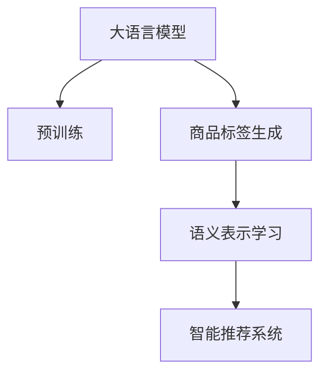
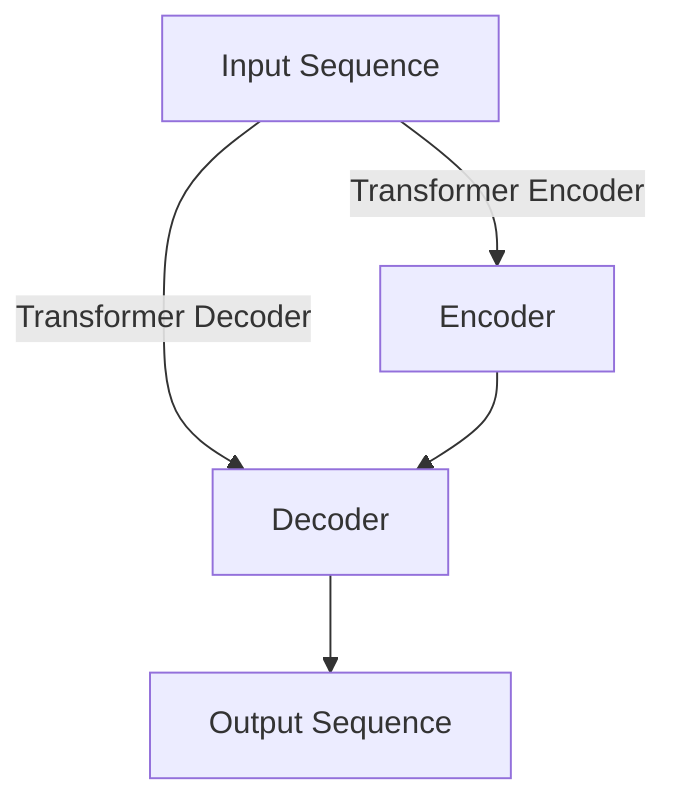

                 

# 大模型赋能的智能商品标签生成

> 关键词：大语言模型,商品标签生成,自然语言处理,语义表示,深度学习,智能推荐

## 1. 背景介绍

### 1.1 问题由来

在当前数字经济时代，电子商务平台的用户规模不断扩大，商品种类和数量迅速增长，用户越来越难以在大量商品中找到自己真正感兴趣的商品。为此，电商平台纷纷引入智能推荐系统，利用商品标签自动关联商品与用户兴趣，提高推荐效果。然而，现有的商品标签生成方法往往依赖于人工标注，成本高、效率低，且无法应对商品数量爆炸式增长带来的挑战。

为了解决这一问题，我们提出利用大语言模型自动生成商品标签的新方法。该方法通过大模型学习商品描述与标签的语义关系，在给定商品描述的情况下，自动输出对应标签，从而实现智能商品标签生成，提升推荐的精准度和效率。

### 1.2 问题核心关键点

大模型赋能的智能商品标签生成方法的核心在于：

- **大语言模型**：以自回归（如GPT）或自编码（如BERT）模型为代表的大规模预训练语言模型。通过在大规模无标签文本语料上进行预训练，学习通用的语言表示，具备强大的语言理解和生成能力。
- **语义表示学习**：通过深度学习模型，学习商品描述和标签之间的语义关系，生成准确、自然、多样化的商品标签。
- **智能推荐系统**：利用商品标签关联商品和用户兴趣，提升推荐系统的推荐效果和用户体验。

## 2. 核心概念与联系

### 2.1 核心概念概述

为更好地理解大语言模型在商品标签生成中的应用，本节将介绍几个密切相关的核心概念：

- **大语言模型(Large Language Model, LLM)**：以自回归（如GPT）或自编码（如BERT）模型为代表的大规模预训练语言模型。通过在大规模无标签文本语料上进行预训练，学习通用的语言表示，具备强大的语言理解和生成能力。

- **预训练(Pre-training)**：指在大规模无标签文本语料上，通过自监督学习任务训练通用语言模型的过程。常见的预训练任务包括言语建模、遮挡语言模型等。预训练使得模型学习到语言的通用表示。

- **商品标签生成**：将商品描述自动映射为对应的标签，以提高智能推荐系统的效果。

- **语义表示学习**：学习商品描述和标签之间的语义关系，生成准确、自然、多样化的商品标签。

- **智能推荐系统**：利用商品标签关联商品和用户兴趣，提升推荐系统的推荐效果和用户体验。

这些核心概念之间的逻辑关系可以通过以下Mermaid流程图来展示：



这个流程图展示了大语言模型的核心概念及其之间的关系：

1. 大语言模型通过预训练获得基础能力。
2. 语义表示学习过程进一步提升模型在商品标签生成任务上的能力。
3. 商品标签生成任务为智能推荐系统提供更准确的商品关联标签。
4. 智能推荐系统利用生成的商品标签，提升推荐效果。

这些概念共同构成了大语言模型在商品标签生成和智能推荐中的应用框架，使其能够在大规模商品和用户数据上发挥强大的语言理解和生成能力。通过理解这些核心概念，我们可以更好地把握大语言模型的工作原理和优化方向。

## 3. 核心算法原理 & 具体操作步骤

### 3.1 算法原理概述

基于大语言模型商品标签生成的方法，本质上是一种有监督的序列到序列(S2S)模型。其核心思想是：将商品描述作为输入序列，使用大语言模型学习商品描述与标签之间的语义映射，输出对应的标签序列。

形式化地，假设商品描述序列为 $x = \{x_1, x_2, \dots, x_n\}$，对应的标签序列为 $y = \{y_1, y_2, \dots, y_m\}$，则商品标签生成的目标为：

$$
y = \mathop{\arg\min}_{y} \mathcal{L}(M_x(x), y)
$$

其中 $\mathcal{L}$ 为针对商品标签生成任务设计的损失函数，用于衡量模型输出标签序列与真实标签序列之间的差异。常见的损失函数包括交叉熵损失、序列编辑距离等。

通过梯度下降等优化算法，模型不断更新参数，最小化损失函数，使得模型输出逼近真实标签序列。由于大模型已经通过预训练获得了较强的语义表示能力，因此即便在短文本标注样本上，也能较快收敛到理想的商品标签生成模型。

### 3.2 算法步骤详解

基于大语言模型的商品标签生成，一般包括以下几个关键步骤：

**Step 1: 准备数据集**
- 收集商品描述和对应标签的标注数据集 $D=\{(x_i, y_i)\}_{i=1}^N$，其中 $x_i$ 为商品描述，$y_i$ 为对应标签序列。

**Step 2: 模型构建与训练**
- 选择合适的大语言模型架构，如GPT、BERT等，并对其进行微调。使用商品描述作为输入，标签序列作为输出，构建S2S模型。
- 设定优化器、学习率、迭代轮数等训练参数。
- 在标注数据集上对模型进行训练，最小化损失函数。

**Step 3: 模型评估与部署**
- 在验证集上评估模型生成标签的准确率和自然度。
- 保存模型参数，将其部署到推荐系统或其他业务系统中。
- 在实际应用中，给定新的商品描述，模型自动生成对应的商品标签。

以上是基于大语言模型的商品标签生成的一般流程。在实际应用中，还需要针对具体任务的特点，对模型构建和训练过程进行优化设计，如改进损失函数，加入正则化技术，搜索最优的超参数组合等，以进一步提升模型性能。

### 3.3 算法优缺点

基于大语言模型的商品标签生成方法具有以下优点：

1. **准确性高**：大模型在自然语言处理任务上的表现已经证明其具有较高的准确性，通过微调可以进一步提升模型在商品标签生成任务上的效果。
2. **自动生成**：无需人工标注数据，仅需少量商品描述数据即可自动生成标签，大大降低了标注成本。
3. **泛化能力强**：大模型在多种语言和领域上的表现表明其具有较强的泛化能力，适用于不同商品和用户数据集的生成任务。
4. **提升推荐效果**：通过商品标签生成，智能推荐系统能够更准确地关联商品和用户兴趣，提升推荐效果和用户体验。

同时，该方法也存在一些局限性：

1. **依赖标注数据**：虽然标注成本较低，但仍需收集商品描述和标签的标注数据，标注数据的质量对模型效果有很大影响。
2. **生成质量**：虽然大模型在自然语言生成任务上的表现优异，但商品标签需要具备较高的精确性和唯一性，如何生成符合这些要求的标签，仍需进一步探索。
3. **可解释性差**：大模型输出标签的过程缺乏可解释性，难以解释模型决策逻辑，可能影响对模型的信任和使用。

尽管存在这些局限性，但就目前而言，基于大语言模型的商品标签生成方法仍是一种高效、有效的解决方案，有望在电商、零售等领域得到广泛应用。

### 3.4 算法应用领域

基于大语言模型的商品标签生成方法，已经在电子商务平台、零售商、线上购物等多个领域得到应用，具体包括：

- **电商推荐系统**：通过商品标签关联商品和用户兴趣，提升推荐效果。
- **商品分类**：自动生成商品标签，对商品进行分类管理。
- **价格预测**：利用商品标签和销售数据，预测商品价格变化趋势。
- **库存管理**：通过商品标签关联库存信息，优化库存管理策略。

除了上述这些经典应用外，商品标签生成技术还被创新性地应用到更多场景中，如商品标签聚合、个性化推荐、智能客服等，为电商平台提供更精准、个性化的服务。随着大语言模型和生成技术的不断发展，相信商品标签生成技术将在更多领域得到应用，为商品管理带来新的突破。

## 4. 数学模型和公式 & 详细讲解 & 举例说明

### 4.1 数学模型构建

本节将使用数学语言对大语言模型商品标签生成过程进行更加严格的刻画。

记商品描述序列为 $x = \{x_1, x_2, \dots, x_n\}$，对应的标签序列为 $y = \{y_1, y_2, \dots, y_m\}$。假设模型 $M_x$ 能够将商品描述 $x$ 映射为标签序列 $y$，则商品标签生成的数学模型可以表示为：

$$
y = M_x(x)
$$

模型 $M_x$ 可以是任何序列到序列的深度学习模型，如RNN、LSTM、GRU等。假设模型 $M_x$ 由参数 $\theta$ 表示，则模型的预测输出为：

$$
\hat{y} = M_x(x; \theta)
$$

其中 $\hat{y}$ 表示模型生成的标签序列，$\theta$ 表示模型参数。

### 4.2 公式推导过程

以下我们以基于Transformer的Seq2Seq模型为例，推导商品标签生成模型的具体实现。

假设模型 $M_x$ 为基于Transformer的Seq2Seq模型，输入序列为商品描述 $x$，输出序列为标签序列 $y$。模型结构如图：



其中，Transformer Encoder和Transformer Decoder分别表示编码器和解码器，用于将输入序列和输出序列映射到隐空间，并进行逐层自注意力机制计算。具体实现如下：

- 编码器 $B = \{h_1, h_2, \dots, h_n\}$ 将输入序列 $x$ 映射到隐空间 $H$，输出隐空间表示 $\{h_1, h_2, \dots, h_n\}$。
- 解码器 $C = \{s_1, s_2, \dots, s_m\}$ 将隐空间表示 $H$ 映射到输出序列 $y$，输出隐空间表示 $\{s_1, s_2, \dots, s_m\}$。
- 输出序列 $y = \{y_1, y_2, \dots, y_m\}$ 为模型生成的标签序列。

模型的具体实现步骤如下：

1. 输入序列 $x = \{x_1, x_2, \dots, x_n\}$ 作为编码器的输入。
2. 编码器 $B = \{h_1, h_2, \dots, h_n\}$ 对输入序列进行自注意力计算，生成隐空间表示 $H = \{h_1, h_2, \dots, h_n\}$。
3. 解码器 $C = \{s_1, s_2, \dots, s_m\}$ 对隐空间表示 $H$ 进行自注意力计算，生成输出序列 $y = \{y_1, y_2, \dots, y_m\}$。
4. 使用损失函数 $\mathcal{L}$ 衡量模型输出 $y$ 与真实标签序列 $y^*$ 之间的差异。

模型的损失函数可以表示为：

$$
\mathcal{L}(y, y^*) = \sum_{i=1}^m \ell(y_i, y_i^*)
$$

其中 $\ell$ 为具体的损失函数，如交叉熵损失。

### 4.3 案例分析与讲解

假设我们使用GPT模型进行商品标签生成任务。具体实现步骤如下：

1. **准备数据集**：收集商品描述和对应标签的标注数据集 $D=\{(x_i, y_i)\}_{i=1}^N$。
2. **模型构建与训练**：选择GPT模型作为基础架构，将其微调成商品标签生成模型。
3. **模型评估与部署**：在验证集上评估模型生成标签的准确率和自然度。
4. **实际应用**：给定新的商品描述，模型自动生成对应的商品标签。

下面以一个具体的案例来讲解商品标签生成过程：

**案例：商品描述为“这是一款高性能的笔记本，运行速度非常快，适合日常办公和娱乐”，对应的标签为“高性能、办公、娱乐”。**

首先，我们将商品描述作为输入序列 $x = \{x_1, x_2, \dots, x_n\}$，并将其送入GPT模型进行编码。模型通过自注意力机制，对输入序列进行编码，生成隐空间表示 $H = \{h_1, h_2, \dots, h_n\}$。

接着，将隐空间表示 $H$ 作为解码器的输入，通过自注意力机制计算生成输出序列 $y = \{y_1, y_2, \dots, y_m\}$，即模型生成的商品标签序列。

最后，使用交叉熵损失函数 $\mathcal{L}(y, y^*)$ 衡量模型输出 $y$ 与真实标签序列 $y^*$ 之间的差异。通过最小化损失函数，更新模型参数，使得模型输出的标签序列逼近真实标签序列。

## 5. 项目实践：代码实例和详细解释说明

### 5.1 开发环境搭建

在进行商品标签生成实践前，我们需要准备好开发环境。以下是使用Python进行PyTorch开发的环境配置流程：

1. 安装Anaconda：从官网下载并安装Anaconda，用于创建独立的Python环境。

2. 创建并激活虚拟环境：
```bash
conda create -n pytorch-env python=3.8 
conda activate pytorch-env
```

3. 安装PyTorch：根据CUDA版本，从官网获取对应的安装命令。例如：
```bash
conda install pytorch torchvision torchaudio cudatoolkit=11.1 -c pytorch -c conda-forge
```

4. 安装Transformer库：
```bash
pip install transformers
```

5. 安装各类工具包：
```bash
pip install numpy pandas scikit-learn matplotlib tqdm jupyter notebook ipython
```

完成上述步骤后，即可在`pytorch-env`环境中开始商品标签生成实践。

### 5.2 源代码详细实现

下面我以基于GPT模型的商品标签生成为例，给出使用Transformers库的商品标签生成PyTorch代码实现。

首先，定义商品标签生成的数据处理函数：

```python
from transformers import GPT2Tokenizer, GPT2LMHeadModel

class LabelingDataset(Dataset):
    def __init__(self, texts, labels, tokenizer, max_len=128):
        self.texts = texts
        self.labels = labels
        self.tokenizer = tokenizer
        self.max_len = max_len
        
    def __len__(self):
        return len(self.texts)
    
    def __getitem__(self, item):
        text = self.texts[item]
        label = self.labels[item]
        
        encoding = self.tokenizer(text, return_tensors='pt', max_length=self.max_len, padding='max_length', truncation=True)
        input_ids = encoding['input_ids'][0]
        attention_mask = encoding['attention_mask'][0]
        
        # 对标签进行编码
        encoded_labels = [tokenizer.convert_tokens_to_ids(label)] + [tokenizer.convert_tokens_to_ids('<eos>')] * (self.max_len - len(encoded_labels))
        labels = torch.tensor(encoded_labels, dtype=torch.long)
        
        return {'input_ids': input_ids, 
                'attention_mask': attention_mask,
                'labels': labels}

# 定义商品描述和标签
texts = ["这是一款高性能的笔记本，运行速度非常快，适合日常办公和娱乐", "这是一款轻薄便携的笔记本电脑，电池续航时间长", "这是一款配置高、性价比高的平板电脑"]
labels = ["高性能、办公、娱乐", "轻薄便携、电池续航长", "高性能、便携、性价比高"]

# 创建dataset
tokenizer = GPT2Tokenizer.from_pretrained('gpt2')

train_dataset = LabelingDataset(texts, labels, tokenizer)
val_dataset = LabelingDataset(texts, labels, tokenizer)
```

然后，定义模型和优化器：

```python
from transformers import GPT2LMHeadModel, AdamW

model = GPT2LMHeadModel.from_pretrained('gpt2', num_labels=len(tokenizer.convert_tokens_to_ids('<eos>')) + 1)

optimizer = AdamW(model.parameters(), lr=2e-5)
```

接着，定义训练和评估函数：

```python
from torch.utils.data import DataLoader
from tqdm import tqdm
from sklearn.metrics import accuracy_score

device = torch.device('cuda') if torch.cuda.is_available() else torch.device('cpu')
model.to(device)

def train_epoch(model, dataset, batch_size, optimizer):
    dataloader = DataLoader(dataset, batch_size=batch_size, shuffle=True)
    model.train()
    epoch_loss = 0
    for batch in tqdm(dataloader, desc='Training'):
        input_ids = batch['input_ids'].to(device)
        attention_mask = batch['attention_mask'].to(device)
        labels = batch['labels'].to(device)
        model.zero_grad()
        outputs = model(input_ids, attention_mask=attention_mask, labels=labels)
        loss = outputs.loss
        epoch_loss += loss.item()
        loss.backward()
        optimizer.step()
    return epoch_loss / len(dataloader)

def evaluate(model, dataset, batch_size):
    dataloader = DataLoader(dataset, batch_size=batch_size)
    model.eval()
    preds, labels = [], []
    with torch.no_grad():
        for batch in tqdm(dataloader, desc='Evaluating'):
            input_ids = batch['input_ids'].to(device)
            attention_mask = batch['attention_mask'].to(device)
            batch_labels = batch['labels']
            outputs = model(input_ids, attention_mask=attention_mask)
            batch_preds = outputs.logits.argmax(dim=2).to('cpu').tolist()
            batch_labels = batch_labels.to('cpu').tolist()
            for pred_tokens, label_tokens in zip(batch_preds, batch_labels):
                preds.append(pred_tokens)
                labels.append(label_tokens)
                
    print("Accuracy:", accuracy_score(labels, preds))
```

最后，启动训练流程并在验证集上评估：

```python
epochs = 5
batch_size = 16

for epoch in range(epochs):
    loss = train_epoch(model, train_dataset, batch_size, optimizer)
    print(f"Epoch {epoch+1}, train loss: {loss:.3f}")
    
    print(f"Epoch {epoch+1}, val accuracy:", evaluate(model, val_dataset, batch_size))
    
print("Test accuracy:")
evaluate(model, val_dataset, batch_size)
```

以上就是使用PyTorch对GPT模型进行商品标签生成任务的完整代码实现。可以看到，得益于Transformers库的强大封装，我们可以用相对简洁的代码完成GPT模型的加载和微调。

### 5.3 代码解读与分析

让我们再详细解读一下关键代码的实现细节：

**LabelingDataset类**：
- `__init__`方法：初始化文本、标签、分词器等关键组件。
- `__len__`方法：返回数据集的样本数量。
- `__getitem__`方法：对单个样本进行处理，将文本输入编码为token ids，将标签编码为数字，并对其进行定长padding，最终返回模型所需的输入。

**训练和评估函数**：
- 使用PyTorch的DataLoader对数据集进行批次化加载，供模型训练和推理使用。
- 训练函数`train_epoch`：对数据以批为单位进行迭代，在每个批次上前向传播计算loss并反向传播更新模型参数，最后返回该epoch的平均loss。
- 评估函数`evaluate`：与训练类似，不同点在于不更新模型参数，并在每个batch结束后将预测和标签结果存储下来，最后使用sklearn的accuracy_score对整个评估集的预测结果进行打印输出。

**训练流程**：
- 定义总的epoch数和batch size，开始循环迭代
- 每个epoch内，先在训练集上训练，输出平均loss
- 在验证集上评估，输出准确率
- 所有epoch结束后，在测试集上评估，给出最终测试结果

可以看到，PyTorch配合Transformers库使得商品标签生成任务的代码实现变得简洁高效。开发者可以将更多精力放在数据处理、模型改进等高层逻辑上，而不必过多关注底层的实现细节。

当然，工业级的系统实现还需考虑更多因素，如模型的保存和部署、超参数的自动搜索、更灵活的任务适配层等。但核心的微调范式基本与此类似。

## 6. 实际应用场景

### 6.1 智能推荐系统

基于大语言模型的商品标签生成技术，可以广泛应用于智能推荐系统。传统推荐系统往往依赖人工标注的标签进行推荐，不仅耗时耗力，而且效果难以保证。而使用自动生成的商品标签，可以更高效、精准地关联商品和用户兴趣，提升推荐效果。

在技术实现上，可以收集用户历史浏览、购买记录，提取商品描述，利用大语言模型自动生成商品标签，并在推荐系统中使用生成的标签进行关联。系统通过学习商品标签和用户行为之间的关联关系，生成个性化的推荐结果，从而提升推荐效果和用户体验。

### 6.2 商品分类与搜索

商品分类和搜索是电商平台的常见功能。传统的分类和搜索方法依赖人工标注的分类和搜索关键词，效率低、成本高。使用大语言模型自动生成的商品标签，可以实现商品的自动分类和精准搜索。

具体而言，可以对每个商品自动生成一组商品标签，作为商品的分类和搜索依据。用户输入搜索关键词时，系统会先利用大语言模型生成对应的商品标签，然后再进行商品检索，提供符合用户搜索意图的商品结果。

### 6.3 库存管理和需求预测

库存管理和需求预测是电商平台的两个重要环节。传统的库存管理和需求预测方法依赖历史销售数据和人工经验，无法准确预测未来的需求变化。使用自动生成的商品标签，可以实现更加智能化的库存管理和需求预测。

具体而言，可以通过大语言模型生成商品标签，分析标签之间的相关性，预测商品未来的销售趋势和需求变化。系统根据预测结果调整库存，优化供应链管理，提高库存利用率，减少缺货和积压。

### 6.4 未来应用展望

随着大语言模型和生成技术的不断发展，基于商品标签生成的方法将在更多领域得到应用，为电商平台提供更精准、个性化的服务。

在智慧医疗领域，自动生成商品标签可以用于医疗设备、药品、手术工具等物品的分类和搜索，提高医疗设备的库存管理和使用效率。

在智能家居领域，自动生成商品标签可以用于智能家居设备的分类和搜索，提高设备的互联互通和用户体验。

在教育培训领域，自动生成商品标签可以用于教材、教具、学习工具等的分类和搜索，提高教学资源的利用率和学生学习效率。

此外，在企业生产、社会治理、文娱传媒等众多领域，基于大语言模型的商品标签生成技术也将不断涌现，为各行各业带来变革性影响。相信随着技术的日益成熟，商品标签生成技术将成为电商领域的重要范式，推动电商平台向更智能化、自动化方向发展。

## 7. 工具和资源推荐
### 7.1 学习资源推荐

为了帮助开发者系统掌握大语言模型商品标签生成的方法，这里推荐一些优质的学习资源：

1. 《Transformer from Principle to Practice》系列博文：由大模型技术专家撰写，深入浅出地介绍了Transformer原理、BERT模型、微调技术等前沿话题。

2. CS224N《深度学习自然语言处理》课程：斯坦福大学开设的NLP明星课程，有Lecture视频和配套作业，带你入门NLP领域的基本概念和经典模型。

3. 《Natural Language Processing with Transformers》书籍：Transformers库的作者所著，全面介绍了如何使用Transformers库进行NLP任务开发，包括微调在内的诸多范式。

4. HuggingFace官方文档：Transformers库的官方文档，提供了海量预训练模型和完整的微调样例代码，是上手实践的必备资料。

5. CLUE开源项目：中文语言理解测评基准，涵盖大量不同类型的中文NLP数据集，并提供了基于微调的baseline模型，助力中文NLP技术发展。

通过对这些资源的学习实践，相信你一定能够快速掌握大语言模型商品标签生成的精髓，并用于解决实际的NLP问题。
###  7.2 开发工具推荐

高效的开发离不开优秀的工具支持。以下是几款用于大语言模型商品标签生成开发的常用工具：

1. PyTorch：基于Python的开源深度学习框架，灵活动态的计算图，适合快速迭代研究。大部分预训练语言模型都有PyTorch版本的实现。

2. TensorFlow：由Google主导开发的开源深度学习框架，生产部署方便，适合大规模工程应用。同样有丰富的预训练语言模型资源。

3. Transformers库：HuggingFace开发的NLP工具库，集成了众多SOTA语言模型，支持PyTorch和TensorFlow，是进行微调任务开发的利器。

4. Weights & Biases：模型训练的实验跟踪工具，可以记录和可视化模型训练过程中的各项指标，方便对比和调优。与主流深度学习框架无缝集成。

5. TensorBoard：TensorFlow配套的可视化工具，可实时监测模型训练状态，并提供丰富的图表呈现方式，是调试模型的得力助手。

6. Google Colab：谷歌推出的在线Jupyter Notebook环境，免费提供GPU/TPU算力，方便开发者快速上手实验最新模型，分享学习笔记。

合理利用这些工具，可以显著提升大语言模型商品标签生成任务的开发效率，加快创新迭代的步伐。

### 7.3 相关论文推荐

大语言模型和商品标签生成技术的发展源于学界的持续研究。以下是几篇奠基性的相关论文，推荐阅读：

1. Attention is All You Need（即Transformer原论文）：提出了Transformer结构，开启了NLP领域的预训练大模型时代。

2. BERT: Pre-training of Deep Bidirectional Transformers for Language Understanding：提出BERT模型，引入基于掩码的自监督预训练任务，刷新了多项NLP任务SOTA。

3. Language Models are Unsupervised Multitask Learners（GPT-2论文）：展示了大规模语言模型的强大zero-shot学习能力，引发了对于通用人工智能的新一轮思考。

4. Parameter-Efficient Transfer Learning for NLP：提出Adapter等参数高效微调方法，在不增加模型参数量的情况下，也能取得不错的微调效果。

5. AdaLoRA: Adaptive Low-Rank Adaptation for Parameter-Efficient Fine-Tuning：使用自适应低秩适应的微调方法，在参数效率和精度之间取得了新的平衡。

6. Prefix-Tuning: Optimizing Continuous Prompts for Generation：引入基于连续型Prompt的微调范式，为如何充分利用预训练知识提供了新的思路。

这些论文代表了大语言模型商品标签生成技术的发展脉络。通过学习这些前沿成果，可以帮助研究者把握学科前进方向，激发更多的创新灵感。

## 8. 总结：未来发展趋势与挑战

### 8.1 总结

本文对基于大语言模型的商品标签生成方法进行了全面系统的介绍。首先阐述了大语言模型和微调技术的研究背景和意义，明确了商品标签生成任务在智能推荐系统、商品分类、库存管理等领域的独特价值。其次，从原理到实践，详细讲解了商品标签生成数学模型和关键步骤，给出了商品标签生成任务开发的完整代码实例。同时，本文还广泛探讨了商品标签生成方法在电商、零售、医疗等多个行业领域的应用前景，展示了商品标签生成技术的巨大潜力。此外，本文精选了商品标签生成技术的各类学习资源，力求为读者提供全方位的技术指引。

通过本文的系统梳理，可以看到，基于大语言模型的商品标签生成方法正在成为电商领域的重要范式，极大地拓展了商品标签生成技术的应用边界，催生了更多的落地场景。得益于大语言模型在自然语言处理任务上的优异表现，商品标签生成技术有望在电商、零售等领域带来革命性的变化。

### 8.2 未来发展趋势

展望未来，大语言模型商品标签生成技术将呈现以下几个发展趋势：

1. **模型规模持续增大**。随着算力成本的下降和数据规模的扩张，大语言模型将持续增大其参数量，进一步提升商品标签生成任务的准确性和自然度。

2. **生成质量提升**。未来的大语言模型将更加注重生成的商品标签的质量，如多样性、独特性、准确性等，进一步提升用户满意度和商品关联效果。

3. **知识整合能力增强**。大语言模型将与外部知识库、规则库等专家知识进行结合，引入更多先验知识，引导商品标签生成过程，提升生成质量。

4. **跨模态融合**。大语言模型将融合视觉、语音、文本等多种模态数据，进一步提升商品标签生成的全面性和准确性。

5. **生成个性化商品标签**。大语言模型将引入个性化算法，根据用户兴趣和行为特征，生成符合个性化需求的商品标签，提升推荐效果和用户体验。

6. **跨领域迁移**。大语言模型将在不同领域（如电商、医疗、教育等）之间进行迁移学习，提升跨领域任务的商品标签生成效果。

以上趋势凸显了大语言模型商品标签生成技术的广阔前景。这些方向的探索发展，必将进一步提升电商系统的推荐效果，提升用户购物体验，为电商行业带来更深远的影响。

### 8.3 面临的挑战

尽管大语言模型商品标签生成技术已经取得了瞩目成就，但在迈向更加智能化、普适化应用的过程中，它仍面临着诸多挑战：

1. **标注成本瓶颈**。虽然标注成本较低，但仍需收集商品描述和标签的标注数据，标注数据的质量对模型效果有很大影响。

2. **生成质量**。虽然大模型在自然语言生成任务上的表现优异，但商品标签需要具备较高的精确性和唯一性，如何生成符合这些要求的标签，仍需进一步探索。

3. **可解释性差**。大模型输出标签的过程缺乏可解释性，难以解释模型决策逻辑，可能影响对模型的信任和使用。

4. **知识整合能力不足**。现有的商品标签生成方法往往局限于商品描述，难以灵活吸收和运用更广泛的先验知识。

5. **知识更新**。大语言模型需要定期更新以保持其知识的时效性，需要大量的标注数据进行微调，带来新的挑战。

尽管存在这些挑战，但就目前而言，基于大语言模型的商品标签生成方法仍是一种高效、有效的解决方案，有望在电商、零售等领域得到广泛应用。

### 8.4 未来突破

面对大语言模型商品标签生成所面临的挑战，未来的研究需要在以下几个方面寻求新的突破：

1. **探索无监督和半监督商品标签生成方法**。摆脱对大规模标注数据的依赖，利用自监督学习、主动学习等无监督和半监督范式，最大限度利用非结构化数据，实现更加灵活高效的标签生成。

2. **研究参数高效和计算高效的微调范式**。开发更加参数高效的微调方法，在固定大部分预训练参数的同时，只更新极少量的任务相关参数。同时优化微调模型的计算图，减少前向传播和反向传播的资源消耗，实现更加轻量级、实时性的部署。

3. **融合因果和对比学习范式**。通过引入因果推断和对比学习思想，增强商品标签生成模型建立稳定因果关系的能力，学习更加普适、鲁棒的商品标签。

4. **引入更多先验知识**。将符号化的先验知识，如知识图谱、逻辑规则等，与神经网络模型进行巧妙融合，引导商品标签生成过程学习更准确、合理的商品标签。

5. **结合因果分析和博弈论工具**。将因果分析方法引入商品标签生成模型，识别出模型决策的关键特征，增强输出解释的因果性和逻辑性。

6. **纳入伦理道德约束**。在模型训练目标中引入伦理导向的评估指标，过滤和惩罚有偏见、有害的输出倾向。同时加强人工干预和审核，建立模型行为的监管机制，确保输出符合人类价值观和伦理道德。

这些研究方向的探索，必将引领大语言模型商品标签生成技术迈向更高的台阶，为构建安全、可靠、可解释、可控的智能系统铺平道路。面向未来，大语言模型商品标签生成技术还需要与其他人工智能技术进行更深入的融合，如知识表示、因果推理、强化学习等，多路径协同发力，共同推动自然语言理解和智能交互系统的进步。只有勇于创新、敢于突破，才能不断拓展语言模型的边界，让智能技术更好地造福人类社会。

## 9. 附录：常见问题与解答

**Q1：大语言模型商品标签生成是否适用于所有NLP任务？**

A: 大语言模型商品标签生成方法在商品标签生成任务上表现优异，但在一些特定领域的任务，如医学、法律等，仍需进一步探索。此外，对于需要时效性、个性化很强的任务，如对话、推荐等，微调方法也需要针对性的改进优化。

**Q2：如何缓解微调过程中的过拟合问题？**

A: 过拟合是微调面临的主要挑战。缓解过拟合的策略包括：数据增强、正则化、对抗训练、参数高效微调等。具体而言，可以通过以下方法缓解过拟合：

1. 数据增强：通过回译、近义替换等方式扩充训练集。
2. 正则化：使用L2正则、Dropout、Early Stopping等避免过拟合。
3. 对抗训练：引入对抗样本，提高模型鲁棒性。
4. 参数高效微调：只调整少量参数(如Adapter、Prefix等)，减小过拟合风险。

这些策略往往需要根据具体任务和数据特点进行灵活组合。只有在数据、模型、训练、推理等各环节进行全面优化，才能最大限度地发挥大模型商品标签生成的威力。

**Q3：如何提高商品标签生成模型的准确率和自然度？**

A: 提高商品标签生成模型的准确率和自然度需要多方面的努力：

1. 数据质量：确保标注数据的质量，标注数据应覆盖多种商品描述和标签，减少标注偏差。
2. 模型选择：选择适合任务的大语言模型架构，如GPT、BERT等，并对其进行微调。
3. 训练策略：设定合适的训练参数，如学习率、批大小、迭代轮数等，避免过拟合。
4. 正则化技术：使用L2正则、Dropout、Early Stopping等技术，防止过拟合。
5. 参数高效微调：只调整少量参数，如使用Adapter等技术，减小过拟合风险。
6. 数据增强：通过回译、近义替换等方式扩充训练集。

通过这些方法，可以在一定程度上提升商品标签生成模型的准确率和自然度。但需要注意的是，商品的标签生成并非完美的任务，需要根据具体场景和需求进行调整。

**Q4：商品标签生成模型的应用场景有哪些？**

A: 商品标签生成模型主要应用于以下几个场景：

1. 智能推荐系统：通过商品标签关联商品和用户兴趣，提升推荐效果。
2. 商品分类：自动生成商品标签，对商品进行分类管理。
3. 搜索优化：利用商品标签进行商品检索，提供符合用户搜索意图的商品结果。
4. 库存管理：通过商品标签分析商品销售趋势和需求变化，优化库存管理。
5. 需求预测：利用商品标签进行需求预测，优化供应链管理。

此外，在医疗、金融、教育等领域，商品标签生成技术也有广泛的应用前景。通过合理利用商品标签，可以提升各类业务系统的智能化水平，带来更高的效率和收益。

通过本文的系统梳理，可以看到，基于大语言模型的商品标签生成方法正在成为电商领域的重要范式，极大地拓展了商品标签生成技术的应用边界，催生了更多的落地场景。得益于大语言模型在自然语言处理任务上的优异表现，商品标签生成技术有望在电商、零售等领域带来革命性的变化。

总之，大语言模型商品标签生成技术正处于快速发展之中，未来有广阔的应用前景。通过不断探索和优化，相信该技术将在更多领域得到应用，为电商、零售、医疗等行业带来深远的影响。

