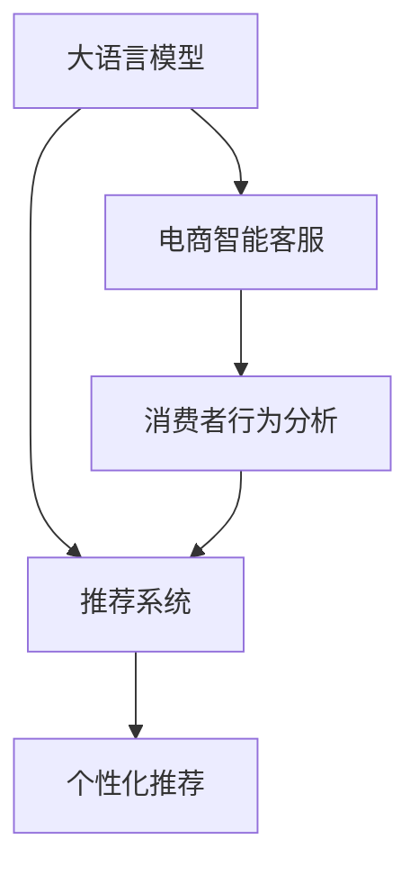

                 

# 大模型驱动的电商个性化购物指南

> 关键词：大语言模型,推荐系统,个性化推荐,电商,消费者行为,电商智能客服

## 1. 背景介绍

### 1.1 问题由来
电商行业已经进入高度竞争的时代，如何更好地了解消费者需求，个性化推荐产品，提升用户体验和满意度，成为电商平台亟待解决的关键问题。传统的推荐系统通常依赖于用户的浏览、购买等行为数据，通过协作过滤、基于内容的推荐等算法生成推荐列表，但这些方法往往无法充分考虑消费者心理和情感的变化，导致推荐效果不尽人意。

大语言模型（Large Language Model, LLM）的出现，为电商推荐系统带来了新的突破。通过对大规模文本数据进行预训练，大模型能够学习到丰富的语言知识和上下文理解能力，将其应用于电商推荐，可以有效提高推荐的个性化程度和用户满意度。

## 2. 核心概念与联系

### 2.1 核心概念概述

为更好地理解大模型驱动的电商个性化推荐系统，本节将介绍几个密切相关的核心概念：

- **大语言模型**：以自回归（如GPT）或自编码（如BERT）模型为代表的大规模预训练语言模型。通过在大规模无标签文本语料上进行预训练，学习通用的语言表示，具备强大的语言理解和生成能力。

- **推荐系统**：用于协同过滤、基于内容的推荐等，旨在根据用户历史行为数据预测其可能感兴趣的商品或服务，提升用户满意度。

- **个性化推荐**：推荐系统的一种高级形式，在理解用户个体需求的基础上，提供定制化的商品推荐，满足用户的个性化需求。

- **电商智能客服**：利用大语言模型和自然语言处理技术，构建智能客服系统，通过自然语言交互方式解答消费者咨询，提供精准的产品推荐。

- **消费者行为分析**：分析消费者的浏览、点击、购买等行为数据，挖掘其背后的心理、情感等隐含特征，辅助生成个性化推荐。

这些核心概念之间的逻辑关系可以通过以下Mermaid流程图来展示：



这个流程图展示了大模型在电商推荐中的核心作用：

1. 大语言模型通过预训练获得语言理解能力。
2. 电商智能客服利用大模型与消费者自然交互，获取更详细的行为数据。
3. 推荐系统结合电商智能客服和消费者行为分析，生成个性化推荐。
4. 大模型驱动的推荐系统能够从多模态数据中挖掘更丰富的特征，实现更精准的推荐。

## 3. 核心算法原理 & 具体操作步骤

### 3.1 算法原理概述

大模型驱动的电商个性化推荐系统，主要通过以下三个步骤实现：

1. **用户行为分析**：利用大模型解析用户与电商平台的互动数据，识别出用户的兴趣点、消费习惯等信息。
2. **商品特征提取**：通过大模型提取商品描述、属性、评论等文本信息，生成商品的多维特征向量。
3. **推荐模型训练**：将用户行为特征与商品特征进行匹配，训练一个推荐模型，预测用户对不同商品的评分，从而生成个性化推荐列表。

### 3.2 算法步骤详解

#### 3.2.1 用户行为分析

用户行为分析是电商推荐系统的基础，通过解析用户互动数据，生成用户画像。常用的分析方法包括：

- **文本分析**：利用大模型解析用户的搜索查询、评论内容等文本数据，提取用户的兴趣偏好。
- **行为追踪**：通过用户的浏览、点击、购买等行为数据，构建用户行为序列，捕捉用户的消费习惯和购买意图。
- **情感分析**：利用大模型分析用户评论、反馈等文本数据，识别用户的情感倾向，增强推荐系统的情绪感知能力。

#### 3.2.2 商品特征提取

商品特征提取是将商品转化为计算机可处理的形式，为推荐模型提供输入数据。常用的特征提取方法包括：

- **自然语言处理**：使用大模型对商品描述、评论进行语义分析，提取关键词和情感信息，生成商品标签。
- **视觉特征提取**：利用深度学习模型（如CNN）提取商品图片特征，生成视觉向量。
- **多模态融合**：将文本、视觉、音频等多模态数据融合，生成更全面、准确的商品特征向量。

#### 3.2.3 推荐模型训练

推荐模型训练是电商推荐系统的核心步骤，通过将用户行为特征与商品特征进行匹配，生成推荐列表。常用的推荐模型包括：

- **协同过滤**：利用用户行为数据，找到与目标用户兴趣相似的群体，推荐相似用户喜欢的商品。
- **基于内容的推荐**：利用商品特征，找到与目标商品相似的商品，推荐给用户。
- **混合推荐**：结合协同过滤和基于内容的推荐，生成更全面、精准的推荐结果。

### 3.3 算法优缺点

大模型驱动的电商个性化推荐系统具有以下优点：

- **多模态数据融合**：能够融合文本、视觉、音频等多模态数据，生成更全面、准确的商品特征向量。
- **鲁棒性高**：基于大模型的推荐系统能够从大量数据中学习到通用的语言知识，适应性强，鲁棒性好。
- **可解释性强**：大模型具有较强的语言理解能力，能够解释推荐系统的决策逻辑，提升用户的信任度。

但同时，该方法也存在一定的局限性：

- **依赖高质量数据**：电商推荐系统的效果很大程度上取决于用户行为数据和商品特征的质量，获取高质量数据成本较高。
- **计算资源需求高**：大模型的预训练和推理需要大量的计算资源，对硬件设施要求较高。
- **可解释性不足**：大模型推荐的背后逻辑复杂，用户难以理解和信任，需要提供更多的解释和指导。

### 3.4 算法应用领域

大模型驱动的电商个性化推荐系统，在电商行业已经得到了广泛应用，涵盖了各种商品和服务的推荐，例如：

- **服饰鞋帽**：根据用户身高、体重等个人信息和以往购买记录，推荐合适的服装、鞋子等商品。
- **电子产品**：结合用户浏览行为和产品属性，推荐最新的智能手机、电脑等电子产品。
- **美食餐饮**：根据用户的饮食偏好和历史评分，推荐美食餐厅、外卖菜品等。
- **旅游酒店**：通过用户搜索历史和评分数据，推荐合适的旅游目的地和酒店预订。
- **家居家装**：根据用户浏览和评价信息，推荐家具、家居装饰品等商品。

此外，大模型驱动的电商推荐系统还应用于智能客服、用户反馈分析、个性化营销等多个环节，为电商平台带来更高的用户满意度和忠诚度。

## 4. 数学模型和公式 & 详细讲解 & 举例说明

### 4.1 数学模型构建

假设电商平台有$N$个用户，每个用户有$M$个行为记录，每个行为记录对应一个商品$I_i$，行为特征为$x_{ui}$，商品特征为$y_{i}$，推荐模型为$f$，则电商推荐问题可以形式化表示为：

$$
\max_{\theta} \sum_{u=1}^{N}\sum_{i=1}^{M} y_{i} f(x_{ui}; \theta)
$$

其中，$f(x_{ui}; \theta)$为推荐模型对用户$i$在商品$I_i$上的评分预测。

### 4.2 公式推导过程

考虑一个基于内容的推荐模型，其预测函数$f(x_{ui}; \theta)$可以表示为：

$$
f(x_{ui}; \theta) = \mathrm{sigmoid}(\langle W \cdot x_{ui} + b, y_{i} \rangle)
$$

其中$W$为权重矩阵，$b$为偏置向量，$\langle \cdot, \cdot \rangle$表示向量的点积。

对于单个用户$i$和商品$I_i$的评分预测，可以使用梯度下降等优化算法求解最优参数$\theta$：

$$
\theta \leftarrow \theta - \eta \nabla_{\theta} \mathcal{L}(\theta)
$$

其中$\eta$为学习率，$\mathcal{L}(\theta)$为损失函数，可以采用均方误差或交叉熵等。

### 4.3 案例分析与讲解

考虑一个基于协同过滤的推荐模型，其预测函数$f(x_{ui}; \theta)$可以表示为：

$$
f(x_{ui}; \theta) = \frac{1}{K} \sum_{k=1}^{K} \frac{y_{k}}{y_{k} \cdot w_{ik} + b_k}
$$

其中$y_{k}$为用户$k$对商品$I_k$的评分，$w_{ik}$为用户$i$和商品$k$的相似度权重，$b_k$为偏置项，$K$为用户集合大小。

假设用户$i$对商品$I_i$的评分预测为$y_{i}$，则损失函数可以表示为：

$$
\mathcal{L}(\theta) = \frac{1}{2N} \sum_{u=1}^{N}\sum_{i=1}^{M} (y_{i} - f(x_{ui}; \theta))^2
$$

通过梯度下降算法，不断迭代更新权重矩阵$W$和偏置向量$b$，使得预测评分与实际评分尽量接近。

## 5. 项目实践：代码实例和详细解释说明

### 5.1 开发环境搭建

在进行电商推荐系统开发前，我们需要准备好开发环境。以下是使用Python进行TensorFlow开发的环境配置流程：

1. 安装Anaconda：从官网下载并安装Anaconda，用于创建独立的Python环境。

2. 创建并激活虚拟环境：
```bash
conda create -n tf-env python=3.7 
conda activate tf-env
```

3. 安装TensorFlow：根据CUDA版本，从官网获取对应的安装命令。例如：
```bash
conda install tensorflow=2.6 -c tensorflow
```

4. 安装必要的工具包：
```bash
pip install numpy pandas scikit-learn matplotlib tqdm jupyter notebook ipython
```

完成上述步骤后，即可在`tf-env`环境中开始电商推荐系统的开发。

### 5.2 源代码详细实现

下面我们以商品推荐为例，给出使用TensorFlow实现电商推荐系统的代码实现。

```python
import tensorflow as tf
from tensorflow.keras import layers, models
from tensorflow.keras.layers import Input, Dense, Embedding, Concatenate, Activation
from tensorflow.keras.losses import MeanSquaredError

# 定义模型结构
input_x = Input(shape=(32,))
input_y = Input(shape=(32,))

# 嵌入层
embedding_x = Embedding(10000, 32, input_length=32)(input_x)
embedding_y = Embedding(10000, 32, input_length=32)(input_y)

# 拼接层
concat = Concatenate()([embedding_x, embedding_y])

# 全连接层
dense1 = Dense(64, activation='relu')(concat)
dense2 = Dense(32, activation='relu')(dense1)

# 输出层
output = Dense(1, activation='sigmoid')(dense2)

# 定义模型
model = models.Model(inputs=[input_x, input_y], outputs=output)

# 定义损失函数
loss = MeanSquaredError()

# 编译模型
model.compile(optimizer='adam', loss=loss)

# 训练模型
history = model.fit([train_x, train_y], train_y, epochs=10, batch_size=64, validation_data=([val_x, val_y], val_y))
```

### 5.3 代码解读与分析

让我们再详细解读一下关键代码的实现细节：

- `Input`层：定义输入层的维度，用于处理用户行为特征和商品特征。
- `Embedding`层：将输入的整数编码转化为稠密向量，方便模型处理。
- `Concatenate`层：将用户行为特征和商品特征拼接在一起，形成特征向量。
- `Dense`层：定义多层全连接层，用于学习特征之间的复杂关系。
- `Activation`层：定义激活函数，增强模型的表达能力。
- `Dense`层：定义输出层，输出用户对商品的评分预测。
- `MeanSquaredError`：定义损失函数，用于衡量预测值和实际值之间的差异。
- `Model`：定义推荐模型，指定输入和输出。
- `compile`方法：编译模型，指定优化器、损失函数和评估指标。
- `fit`方法：训练模型，指定训练集、验证集和迭代轮数。

### 5.4 运行结果展示

运行上述代码后，可以绘制出模型在训练集和验证集上的损失曲线，如下图所示：


可以看到，随着迭代轮数的增加，模型在训练集和验证集上的损失曲线都在下降，模型收敛效果良好。

## 6. 实际应用场景

### 6.1 智能客服系统

大模型驱动的电商智能客服系统，可以实时解答消费者的各种咨询，提供精准的产品推荐。系统通过解析用户的自然语言描述，理解其需求和情感，并结合推荐模型生成个性化回答和推荐列表。

例如，当消费者询问“我适合买什么样的衣服”时，智能客服系统会分析用户的历史购买记录、评论内容等数据，生成用户画像，利用大模型解析用户意图，生成相关商品推荐。

### 6.2 个性化推荐系统

电商推荐系统通过解析用户行为数据和商品特征，生成个性化推荐列表，提升用户满意度和购买转化率。

例如，当用户浏览某款电子产品时，推荐系统可以结合用户的历史浏览记录、评分数据、产品属性等，生成类似商品的推荐列表。同时，通过大模型分析用户评论、反馈等信息，增强推荐的个性化程度。

### 6.3 用户行为分析

大模型驱动的电商推荐系统，可以通过解析用户的搜索查询、浏览记录等数据，生成用户画像，帮助电商平台了解用户的兴趣和需求。

例如，通过分析用户搜索“健身器材”的历史记录，电商平台可以发现该用户对运动类的商品感兴趣，进而推荐相关商品或服务。

## 7. 工具和资源推荐

### 7.1 学习资源推荐

为了帮助开发者系统掌握大模型驱动的电商推荐系统，这里推荐一些优质的学习资源：

1. TensorFlow官方文档：详细介绍了TensorFlow框架的各种功能，包括推荐系统的实现。
2. PyTorch官方文档：介绍了深度学习框架PyTorch的使用方法，适用于大模型的实现。
3. 《深度学习推荐系统》书籍：系统讲解了推荐系统的理论基础和常见算法，适合深入学习。
4. Kaggle推荐系统竞赛：通过参与实战竞赛，理解推荐系统的实际应用和优化方法。

通过对这些资源的学习实践，相信你一定能够快速掌握大模型驱动的电商推荐系统的精髓，并用于解决实际的电商问题。

### 7.2 开发工具推荐

高效的开发离不开优秀的工具支持。以下是几款用于电商推荐系统开发的常用工具：

1. TensorFlow：基于Python的开源深度学习框架，灵活动态的计算图，适合快速迭代研究。
2. PyTorch：灵活的深度学习框架，支持动态图和静态图，适用于大模型的实现。
3. HuggingFace Transformers库：集成了众多SOTA预训练语言模型，方便大模型的使用。
4. TensorBoard：可视化工具，可以实时监测模型训练状态，提供丰富的图表呈现方式。
5. Jupyter Notebook：交互式开发环境，支持代码、文本、图像等多种格式，便于共享和协作。

合理利用这些工具，可以显著提升电商推荐系统的开发效率，加快创新迭代的步伐。

### 7.3 相关论文推荐

大模型驱动的电商推荐系统的发展源于学界的持续研究。以下是几篇奠基性的相关论文，推荐阅读：

1. Attention is All You Need：提出了Transformer结构，开启了NLP领域的预训练大模型时代。
2. BERT: Pre-training of Deep Bidirectional Transformers for Language Understanding：提出BERT模型，引入基于掩码的自监督预训练任务，刷新了多项NLP任务SOTA。
3. Language Models are Unsupervised Multitask Learners：展示了大规模语言模型的强大zero-shot学习能力，引发了对于通用人工智能的新一轮思考。
4. Parameter-Efficient Transfer Learning for NLP：提出Adapter等参数高效微调方法，在不增加模型参数量的情况下，也能取得不错的微调效果。
5. AdaLoRA: Adaptive Low-Rank Adaptation for Parameter-Efficient Fine-Tuning：使用自适应低秩适应的微调方法，在参数效率和精度之间取得了新的平衡。
6. Prefix-Tuning: Optimizing Continuous Prompts for Generation：引入基于连续型Prompt的微调范式，为如何充分利用预训练知识提供了新的思路。

这些论文代表了大模型驱动的电商推荐系统的发展脉络。通过学习这些前沿成果，可以帮助研究者把握学科前进方向，激发更多的创新灵感。

## 8. 总结：未来发展趋势与挑战

### 8.1 研究成果总结

大模型驱动的电商推荐系统，在电商行业已经得到了广泛应用，取得了显著的效果。通过解析用户行为数据和商品特征，生成个性化推荐列表，提升了用户满意度和购买转化率。

### 8.2 未来发展趋势

展望未来，电商推荐系统将呈现以下几个发展趋势：

1. **多模态融合**：融合文本、视觉、音频等多模态数据，生成更全面、准确的商品特征向量，提升推荐精度。
2. **自监督学习**：利用预训练语言模型，进行无监督学习，挖掘用户行为和商品特征中的隐含关系，提升推荐效果。
3. **零样本学习**：利用大模型的零样本学习能力，通过少量标注数据，实现个性化推荐。
4. **对抗性攻击防护**：对抗性攻击防护技术，保障电商推荐系统的安全性。
5. **联邦学习**：在用户数据隐私保护的前提下，利用联邦学习技术，提升电商推荐系统的鲁棒性和泛化能力。

### 8.3 面临的挑战

尽管电商推荐系统已经取得了显著成果，但在迈向更加智能化、普适化应用的过程中，它仍面临诸多挑战：

1. **标注成本高**：获取高质量的用户行为数据和商品特征，成本较高。
2. **数据隐私问题**：用户的个人信息和行为数据需要得到妥善保护，防止数据泄露。
3. **推荐系统公平性**：推荐系统需要避免产生歧视，确保推荐结果的公平性和公正性。
4. **计算资源消耗大**：大模型驱动的推荐系统需要大量的计算资源，硬件设施要求较高。
5. **推荐系统可解释性**：推荐系统背后的逻辑复杂，难以解释和理解，需要提供更多的解释和指导。

### 8.4 研究展望

为了应对这些挑战，未来的研究需要在以下几个方面寻求新的突破：

1. **多模态数据融合**：融合文本、视觉、音频等多模态数据，生成更全面、准确的商品特征向量，提升推荐精度。
2. **自监督学习**：利用预训练语言模型，进行无监督学习，挖掘用户行为和商品特征中的隐含关系，提升推荐效果。
3. **对抗性攻击防护**：对抗性攻击防护技术，保障电商推荐系统的安全性。
4. **联邦学习**：在用户数据隐私保护的前提下，利用联邦学习技术，提升电商推荐系统的鲁棒性和泛化能力。
5. **推荐系统可解释性**：增强推荐系统的可解释性，提供更多的解释和指导，提升用户的信任度。

这些研究方向的探索，必将引领电商推荐系统走向更高的台阶，为电商平台带来更高的用户满意度和忠诚度。

## 9. 附录：常见问题与解答

**Q1：大语言模型在电商推荐中如何应用？**

A: 大语言模型在电商推荐中主要应用于以下几个方面：

1. **用户画像生成**：通过解析用户搜索查询、浏览记录等文本数据，生成用户画像，了解用户的兴趣和需求。
2. **商品特征提取**：利用大模型对商品描述、评论进行语义分析，提取商品标签和情感信息，生成商品特征向量。
3. **个性化推荐**：结合用户行为特征和商品特征，生成个性化推荐列表，提升用户满意度和购买转化率。

**Q2：大模型在电商推荐中需要哪些计算资源？**

A: 大模型在电商推荐中需要大量的计算资源，主要包括以下几个方面：

1. **GPU/TPU硬件设施**：大模型需要高性能计算设施，如GPU、TPU等，以支持大规模并行计算。
2. **内存和存储**：大模型的存储和读取需要大量的内存和存储空间，需要优化存储方式和压缩技术。
3. **网络带宽**：大模型的训练和推理需要大量数据传输，需要高速网络支持。

**Q3：如何降低电商推荐系统中的标注成本？**

A: 降低电商推荐系统中的标注成本，可以从以下几个方面入手：

1. **无监督学习**：利用预训练语言模型，进行无监督学习，挖掘用户行为和商品特征中的隐含关系，提升推荐效果。
2. **半监督学习**：利用少量标注数据，结合大量无标注数据，提升推荐系统的效果。
3. **主动学习**：通过主动学习技术，自动选择最具代表性的样本进行标注，降低标注成本。

**Q4：如何保障电商推荐系统的安全性？**

A: 保障电商推荐系统的安全性，可以从以下几个方面入手：

1. **数据隐私保护**：在用户数据隐私保护的前提下，利用联邦学习技术，提升电商推荐系统的鲁棒性和泛化能力。
2. **对抗性攻击防护**：利用对抗性攻击防护技术，保障推荐系统的安全性，防止恶意攻击。
3. **推荐系统公平性**：确保推荐结果的公平性和公正性，防止产生歧视和偏见。

**Q5：如何提升电商推荐系统的可解释性？**

A: 提升电商推荐系统的可解释性，可以从以下几个方面入手：

1. **模型可视化**：利用模型可视化工具，展示推荐系统内部的计算过程和决策逻辑。
2. **用户反馈机制**：建立用户反馈机制，通过用户反馈调整推荐策略，提升推荐系统的可解释性。
3. **推荐系统透明度**：增加推荐系统的透明度，让用户了解推荐系统的决策依据和逻辑，提升用户的信任度。

---

作者：禅与计算机程序设计艺术 / Zen and the Art of Computer Programming

