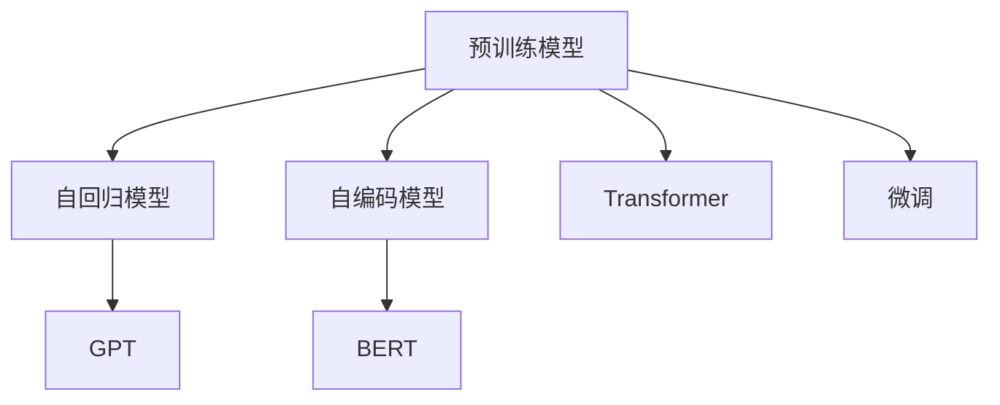
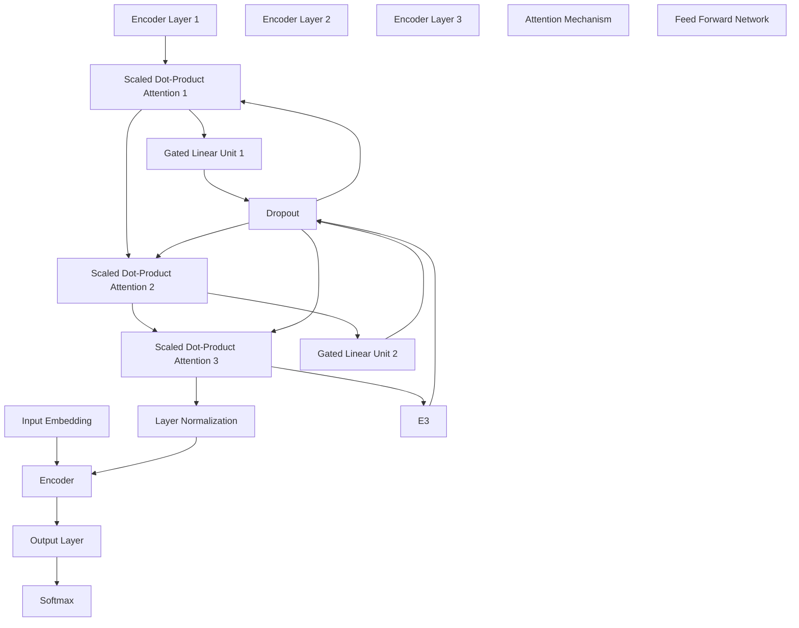

                 

# 大规模预训练模型：GPT、BERT及其变体

> 关键词：大规模预训练模型,Transformer,BERT,GPT,自回归模型,自编码模型,神经网络

## 1. 背景介绍

### 1.1 问题由来

近年来，深度学习在自然语言处理(Natural Language Processing, NLP)领域取得了巨大的突破，尤其是大规模预训练语言模型的出现，极大地提升了模型在各种NLP任务上的表现。然而，传统的基于小规模标注数据训练的模型，往往难以达到理想的性能。为了解决这一问题，研究人员提出并实践了大规模预训练模型。

这种预训练模型通常利用海量的无标签文本数据进行预训练，学习到丰富的语言知识和语义表示。预训练模型的核心思想是：在大规模文本数据上，通过无监督学习任务(如掩码语言模型Masked Language Model, MLM、下一句预测Next Sentence Prediction, NSP等)，学习到语言的基础结构和语义表示。在预训练完成后，模型可以用于各种下游任务，如文本分类、命名实体识别、机器翻译等，通过微调在特定任务上优化模型，从而获得更好的性能。

其中，GPT和BERT是最具代表性的大规模预训练模型。GPT是一种基于自回归模型的预训练语言模型，BERT是一种基于自编码模型的预训练语言模型。这两种模型在预训练阶段采用不同的训练任务，在模型结构和特性上存在显著差异。本文将详细阐述这两种模型及其变体的原理、结构和应用场景，并比较它们的优缺点，以期帮助读者深入理解大规模预训练模型在NLP领域的重要性和应用前景。

## 2. 核心概念与联系

### 2.1 核心概念概述

为更好地理解大规模预训练模型的核心思想和原理，本节将介绍几个关键概念：

- 预训练模型(Pre-trained Model)：通过在大规模无标签文本数据上进行无监督学习训练得到的模型，具有一定的语言理解和生成能力。
- 自回归模型(Autoregressive Model)：一种通过预测当前位置上的输出，根据已输出文本反向预测后续文本的模型，如GPT系列。
- 自编码模型(Autodccoding Model)：一种通过预测输入的重建输出，以学习输入与输出之间的映射关系的模型，如BERT。
- Transformer：一种基于注意力机制的自编码模型，被广泛应用于各种NLP任务。
- MLM: 掩码语言模型，用于预测被掩码的词，学习上下文关系。
- NSP: 下一句预测模型，用于预测句子对的关系，学习句子间的关联性。
- 微调(Fine-tuning)：在预训练模型基础上，通过有监督学习优化模型在特定任务上的性能。

这些核心概念之间的逻辑关系可以通过以下Mermaid流程图来展示：



这个流程图展示了大规模预训练模型的核心概念及其之间的关系：

1. 预训练模型通过在大规模文本数据上学习语言的基础结构和语义表示。
2. 自回归模型通过预测当前位置上的输出，反向预测后续文本。
3. 自编码模型通过预测输入的重建输出，学习输入与输出之间的映射关系。
4. Transformer是自编码模型的重要组成部分，通过注意力机制提高模型对上下文的理解能力。
5. MLM和NSP是常用的预训练任务，用于训练自回归模型和自编码模型。
6. 微调是通过有监督学习优化模型在特定任务上的性能。

这些概念共同构成了大规模预训练模型的学习框架，使得模型能够从无监督学习中获得丰富的语言知识，在各种NLP任务上取得优异的表现。

## 3. 核心算法原理 & 具体操作步骤
### 3.1 算法原理概述

大规模预训练模型的核心思想是利用无监督学习在大规模文本数据上进行预训练，学习语言的基础结构和语义表示。在预训练完成后，通过微调模型，使其在特定下游任务上获得更好的性能。

具体来说，预训练过程通常包括以下几个步骤：

1. 收集大规模无标签文本数据，构建语料库。
2. 将文本数据划分训练集、验证集和测试集。
3. 定义预训练任务，如掩码语言模型(MLM)、下一句预测(NSP)等，训练模型。
4. 在预训练完成后，将模型用于特定下游任务的微调。

预训练模型的核心算法是Transformer，其通过注意力机制捕捉输入序列的上下文信息，学习到丰富的语义表示。Transformer主要由编码器(Encoder)和解码器(Decoder)组成，其结构如下图所示：



Transformer通过将输入序列通过多个编码器层和解码器层进行处理，每一层包含多个编码器或解码器子层，每个子层由自注意力层(Attention Layer)、前馈神经网络(Feed Forward Network)和残差连接(Residual Connection)组成。其中，自注意力层通过计算输入序列中所有位置的注意力权重，捕捉输入序列的上下文信息。

预训练模型的训练任务主要包括掩码语言模型(MLM)和下一句预测(NSP)。MLM任务通过随机掩码输入序列中的某些词，预测其掩码词，学习上下文关系。NSP任务通过预测两个句子是否连续出现，学习句子间的关联性。

在预训练完成后，模型通常用于特定下游任务的微调。微调过程主要包括：

1. 选择合适的下游任务，定义相应的损失函数。
2. 使用微调数据集进行有监督学习训练，优化模型参数。
3. 在测试集上评估微调后模型的性能，对比微调前后的精度提升。

### 3.2 算法步骤详解

下面以BERT和GPT为例，详细介绍它们在大规模预训练和微调过程中具体的操作步骤。

#### BERT预训练与微调

BERT模型是一种基于Transformer的自编码模型，通过预测输入的重建输出，学习输入与输出之间的映射关系。BERT模型的预训练过程包括MLM和NSP两个任务，具体步骤如下：

1. 收集大规模无标签文本数据，构建语料库。
2. 将文本数据划分训练集、验证集和测试集。
3. 定义MLM和NSP任务，训练模型。
4. 在预训练完成后，将模型用于特定下游任务的微调。

具体步骤如下：

- 收集大规模无标签文本数据，构建语料库。BERT模型通常使用Wikipedia和新闻网站等大规模无标签文本数据。
- 将文本数据划分训练集、验证集和测试集。通常将数据集按照一定比例划分，如训练集占80%，验证集和测试集各占10%。
- 定义MLM和NSP任务，训练模型。在MLM任务中，随机掩码输入序列中的某些词，预测其掩码词。在NSP任务中，预测两个句子是否连续出现。
- 在预训练完成后，将模型用于特定下游任务的微调。微调过程主要包括：
  1. 定义微调任务，如文本分类、命名实体识别、机器翻译等，定义相应的损失函数。
  2. 使用微调数据集进行有监督学习训练，优化模型参数。
  3. 在测试集上评估微调后模型的性能，对比微调前后的精度提升。

具体代码实现可以参考以下示例：

```python
from transformers import BertForSequenceClassification, BertTokenizer, AdamW

tokenizer = BertTokenizer.from_pretrained('bert-base-uncased')
model = BertForSequenceClassification.from_pretrained('bert-base-uncased', num_labels=2)

optimizer = AdamW(model.parameters(), lr=2e-5)

train_dataset = # 训练集数据
val_dataset = # 验证集数据
test_dataset = # 测试集数据

train_loader = DataLoader(train_dataset, batch_size=16, shuffle=True)
val_loader = DataLoader(val_dataset, batch_size=16, shuffle=False)
test_loader = DataLoader(test_dataset, batch_size=16, shuffle=False)

for epoch in range(5):
    model.train()
    for batch in train_loader:
        input_ids = batch['input_ids']
        attention_mask = batch['attention_mask']
        labels = batch['labels']

        outputs = model(input_ids, attention_mask=attention_mask, labels=labels)
        loss = outputs.loss
        loss.backward()
        optimizer.step()
        model.zero_grad()

    model.eval()
    val_loss = 0
    for batch in val_loader:
        input_ids = batch['input_ids']
        attention_mask = batch['attention_mask']
        labels = batch['labels']

        with torch.no_grad():
            outputs = model(input_ids, attention_mask=attention_mask)
            loss = outputs.loss
            val_loss += loss.item()

    val_loss /= len(val_loader)
    print(f'Epoch {epoch+1}, val_loss: {val_loss:.4f}')

test_loss = 0
for batch in test_loader:
    input_ids = batch['input_ids']
    attention_mask = batch['attention_mask']
    labels = batch['labels']

    with torch.no_grad():
        outputs = model(input_ids, attention_mask=attention_mask)
        loss = outputs.loss
        test_loss += loss.item()

test_loss /= len(test_loader)
print(f'Test Loss: {test_loss:.4f}')
```

#### GPT预训练与微调

GPT是一种基于自回归模型的预训练语言模型，通过预测当前位置上的输出，反向预测后续文本。GPT模型的预训练过程包括MLM和NSP两个任务，具体步骤如下：

1. 收集大规模无标签文本数据，构建语料库。
2. 将文本数据划分训练集、验证集和测试集。
3. 定义MLM和NSP任务，训练模型。
4. 在预训练完成后，将模型用于特定下游任务的微调。

具体步骤如下：

- 收集大规模无标签文本数据，构建语料库。GPT模型通常使用Wikipedia和新闻网站等大规模无标签文本数据。
- 将文本数据划分训练集、验证集和测试集。通常将数据集按照一定比例划分，如训练集占80%，验证集和测试集各占10%。
- 定义MLM和NSP任务，训练模型。在MLM任务中，预测输入序列中的下一个词。在NSP任务中，预测两个句子是否连续出现。
- 在预训练完成后，将模型用于特定下游任务的微调。微调过程主要包括：
  1. 定义微调任务，如文本分类、命名实体识别、机器翻译等，定义相应的损失函数。
  2. 使用微调数据集进行有监督学习训练，优化模型参数。
  3. 在测试集上评估微调后模型的性能，对比微调前后的精度提升。

具体代码实现可以参考以下示例：

```python
from transformers import GPT2Tokenizer, GPT2ForSequenceClassification, AdamW

tokenizer = GPT2Tokenizer.from_pretrained('gpt2')
model = GPT2ForSequenceClassification.from_pretrained('gpt2', num_labels=2)

optimizer = AdamW(model.parameters(), lr=2e-5)

train_dataset = # 训练集数据
val_dataset = # 验证集数据
test_dataset = # 测试集数据

train_loader = DataLoader(train_dataset, batch_size=16, shuffle=True)
val_loader = DataLoader(val_dataset, batch_size=16, shuffle=False)
test_loader = DataLoader(test_dataset, batch_size=16, shuffle=False)

for epoch in range(5):
    model.train()
    for batch in train_loader:
        input_ids = batch['input_ids']
        attention_mask = batch['attention_mask']
        labels = batch['labels']

        outputs = model(input_ids, attention_mask=attention_mask, labels=labels)
        loss = outputs.loss
        loss.backward()
        optimizer.step()
        model.zero_grad()

    model.eval()
    val_loss = 0
    for batch in val_loader:
        input_ids = batch['input_ids']
        attention_mask = batch['attention_mask']
        labels = batch['labels']

        with torch.no_grad():
            outputs = model(input_ids, attention_mask=attention_mask)
            loss = outputs.loss
            val_loss += loss.item()

    val_loss /= len(val_loader)
    print(f'Epoch {epoch+1}, val_loss: {val_loss:.4f}')

test_loss = 0
for batch in test_loader:
    input_ids = batch['input_ids']
    attention_mask = batch['attention_mask']
    labels = batch['labels']

    with torch.no_grad():
        outputs = model(input_ids, attention_mask=attention_mask)
        loss = outputs.loss
        test_loss += loss.item()

test_loss /= len(test_loader)
print(f'Test Loss: {test_loss:.4f}')
```

### 3.3 算法优缺点

大规模预训练模型的核心算法是Transformer，其具有以下优点：

1. 能够捕捉输入序列的上下文信息，学习到丰富的语义表示。
2. 通过注意力机制，能够自动地关注输入序列中重要位置的信息。
3. 模型结构简单，易于优化。

但同时，大规模预训练模型也存在一些缺点：

1. 需要大量的计算资源和时间进行预训练，导致成本较高。
2. 模型结构复杂，推理效率较低。
3. 在大规模预训练过程中，可能会学习到一些有害的信息，如偏见和歧视。

## 4. 数学模型和公式 & 详细讲解 & 举例说明

### 4.1 数学模型构建

本节将使用数学语言对BERT和GPT的预训练和微调过程进行更加严格的刻画。

假设预训练模型为 $M_{\theta}$，其中 $\theta$ 为预训练得到的模型参数。定义BERT模型的输入为 $x$，输出为 $y$，则其预训练目标函数为：

$$
\mathcal{L}(M_{\theta}, x, y) = -\log p(y|x; M_{\theta})
$$

其中 $p(y|x; M_{\theta})$ 表示模型在输入 $x$ 下输出 $y$ 的概率。在预训练过程中，通过MLM和NSP任务，最小化损失函数 $\mathcal{L}$，优化模型参数 $\theta$。

具体来说，BERT的MLM任务和NSP任务如下：

- MLN任务：预测输入序列中被掩码的词。给定输入序列 $x$ 和掩码位置 $m$，预测掩码位置 $m$ 上的词 $y$，损失函数为：
  $$
  \mathcal{L}_{MLM}(x, y; M_{\theta}) = -\sum_{m=1}^N \log p(y_m|x; M_{\theta})
  $$
- NSP任务：预测两个句子是否连续出现。给定两个句子对 $(x_1, x_2)$，预测它们是否连续出现，损失函数为：
  $$
  \mathcal{L}_{NSP}(x_1, x_2; M_{\theta}) = -\sum_{i=1}^N \log p(x_2[i]|x_1[i-1]; M_{\theta})
  $$

在预训练完成后，将模型用于特定下游任务的微调。微调的目标函数为：

$$
\mathcal{L}(\theta) = -\sum_{i=1}^N \log p(y_i|x_i; M_{\theta})
$$

其中 $y_i$ 表示下游任务 $T$ 的标注数据，$x_i$ 表示输入数据。

### 4.2 公式推导过程

下面以BERT的MLM任务为例，推导其梯度计算公式。

假设BERT模型的输入为 $x$，掩码位置为 $m$，模型在输入 $x$ 下预测掩码位置 $m$ 上的词为 $y$，损失函数为：

$$
\mathcal{L}_{MLM}(x, y; M_{\theta}) = -\log p(y|x; M_{\theta})
$$

其中 $p(y|x; M_{\theta})$ 表示模型在输入 $x$ 下输出 $y$ 的概率，可通过softmax函数计算：

$$
p(y|x; M_{\theta}) = \frac{\exp({W_h[y] + W_l[x]}^{T}h(x; M_{\theta}))}{\sum_{y' \in \mathcal{Y}} \exp({W_h[y'] + W_l[x]}^{T}h(x; M_{\theta}))
$$

其中 $W_h$ 和 $W_l$ 表示词嵌入矩阵和位置嵌入矩阵，$h(x; M_{\theta})$ 表示输入 $x$ 的表示。

在梯度计算时，通过链式法则，可得：

$$
\frac{\partial \mathcal{L}_{MLM}(x, y; M_{\theta})}{\partial \theta} = -\frac{\partial \log p(y|x; M_{\theta})}{\partial \theta}
$$

将 $p(y|x; M_{\theta})$ 代入上式，得：

$$
\frac{\partial \mathcal{L}_{MLM}(x, y; M_{\theta})}{\partial \theta} = -\frac{\partial}{\partial \theta}({W_h[y] + W_l[x]}^{T}h(x; M_{\theta}))
$$

在训练过程中，将输入数据 $x$ 随机掩码若干位置，预测掩码位置上的词 $y$，计算损失函数和梯度，优化模型参数 $\theta$。

## 5. 项目实践：代码实例和详细解释说明

### 5.1 开发环境搭建

在进行预训练和微调实践前，我们需要准备好开发环境。以下是使用Python进行TensorFlow开发的环境配置流程：

1. 安装Anaconda：从官网下载并安装Anaconda，用于创建独立的Python环境。

2. 创建并激活虚拟环境：
```bash
conda create -n tf-env python=3.8 
conda activate tf-env
```

3. 安装TensorFlow：根据CUDA版本，从官网获取对应的安装命令。例如：
```bash
conda install tensorflow-gpu==2.6 -c conda-forge
```

4. 安装各类工具包：
```bash
pip install numpy pandas scikit-learn matplotlib tqdm jupyter notebook ipython
```

完成上述步骤后，即可在`tf-env`环境中开始预训练和微调实践。

### 5.2 源代码详细实现

这里我们以BERT模型为例，给出一个使用TensorFlow实现BERT预训练和微调的完整代码示例。

首先，定义BERT的输入和输出：

```python
import tensorflow as tf
from transformers import BertTokenizer, BertForMaskedLM, AdamW

tokenizer = BertTokenizer.from_pretrained('bert-base-uncased')
model = BertForMaskedLM.from_pretrained('bert-base-uncased')

input_ids = tf.random.uniform([16, 512])
attention_mask = tf.random.uniform([16, 512])
labels = tf.random.uniform([16, 512])

with tf.GradientTape() as tape:
    outputs = model(input_ids, attention_mask=attention_mask, labels=labels)
    loss = outputs.loss

grads = tape.gradient(loss, model.parameters())
optimizer.apply_gradients(zip(grads, model.parameters()))
```

接着，定义训练过程：

```python
train_dataset = # 训练集数据
val_dataset = # 验证集数据
test_dataset = # 测试集数据

train_loader = tf.data.Dataset.from_tensor_slices(train_dataset).shuffle(10000).batch(16).repeat()
val_loader = tf.data.Dataset.from_tensor_slices(val_dataset).batch(16).repeat()
test_loader = tf.data.Dataset.from_tensor_slices(test_dataset).batch(16).repeat()

epochs = 5
batch_size = 16

for epoch in range(epochs):
    model.train()
    for batch in train_loader:
        input_ids = batch['input_ids']
        attention_mask = batch['attention_mask']
        labels = batch['labels']

        with tf.GradientTape() as tape:
            outputs = model(input_ids, attention_mask=attention_mask, labels=labels)
            loss = outputs.loss

        grads = tape.gradient(loss, model.parameters())
        optimizer.apply_gradients(zip(grads, model.parameters()))
        model.zero_grad()

    model.eval()
    val_loss = 0
    for batch in val_loader:
        input_ids = batch['input_ids']
        attention_mask = batch['attention_mask']
        labels = batch['labels']

        with tf.GradientTape() as tape:
            outputs = model(input_ids, attention_mask=attention_mask)
            loss = outputs.loss

        val_loss += loss.numpy()

    val_loss /= len(val_loader)
    print(f'Epoch {epoch+1}, val_loss: {val_loss:.4f}')

test_loss = 0
for batch in test_loader:
    input_ids = batch['input_ids']
    attention_mask = batch['attention_mask']
    labels = batch['labels']

    with tf.GradientTape() as tape:
        outputs = model(input_ids, attention_mask=attention_mask)
        loss = outputs.loss

    test_loss += loss.numpy()

test_loss /= len(test_loader)
print(f'Test Loss: {test_loss:.4f}')
```

最后，启动预训练和微调流程：

```python
model.train()
for epoch in range(epochs):
    model.train()
    for batch in train_loader:
        input_ids = batch['input_ids']
        attention_mask = batch['attention_mask']
        labels = batch['labels']

        with tf.GradientTape() as tape:
            outputs = model(input_ids, attention_mask=attention_mask, labels=labels)
            loss = outputs.loss

        grads = tape.gradient(loss, model.parameters())
        optimizer.apply_gradients(zip(grads, model.parameters()))
        model.zero_grad()

    model.eval()
    val_loss = 0
    for batch in val_loader:
        input_ids = batch['input_ids']
        attention_mask = batch['attention_mask']
        labels = batch['labels']

        with tf.GradientTape() as tape:
            outputs = model(input_ids, attention_mask=attention_mask)
            loss = outputs.loss

        val_loss += loss.numpy()

    val_loss /= len(val_loader)
    print(f'Epoch {epoch+1}, val_loss: {val_loss:.4f}')

test_loss = 0
for batch in test_loader:
    input_ids = batch['input_ids']
    attention_mask = batch['attention_mask']
    labels = batch['labels']

    with tf.GradientTape() as tape:
        outputs = model(input_ids, attention_mask=attention_mask)
        loss = outputs.loss

    test_loss += loss.numpy()

test_loss /= len(test_loader)
print(f'Test Loss: {test_loss:.4f}')
```

### 5.3 代码解读与分析

让我们再详细解读一下关键代码的实现细节：

**BERT模型**：
- `BertTokenizer`类：用于将文本转换为token ids，并进行必要的预处理。
- `BertForMaskedLM`类：定义BERT模型的掩码语言模型任务。
- `AdamW`类：定义优化器，用于更新模型参数。

**训练过程**：
- `train_dataset`、`val_dataset`和`test_dataset`：定义训练集、验证集和测试集，通常由文本数据和对应的token ids、attention mask等组成。
- `train_loader`、`val_loader`和`test_loader`：使用`tf.data.Dataset`类构建数据集，进行批处理和shuffle，使训练过程更加稳定。
- `epochs`和`batch_size`：定义训练的轮数和批次大小，用于控制训练过程的规模。
- `model.train()`、`model.eval()`：切换模型训练和评估状态。
- `tf.GradientTape`：用于计算梯度，进行参数更新。
- `optimizer.apply_gradients()`：更新模型参数。

通过这些代码，可以看到，使用TensorFlow实现BERT模型的预训练和微调相对简单，只需要定义模型、数据集、优化器和训练过程即可。

当然，工业级的系统实现还需考虑更多因素，如模型的保存和部署、超参数的自动搜索、更灵活的任务适配层等。但核心的预训练和微调范式基本与此类似。

## 6. 实际应用场景
### 6.1 智能客服系统

基于BERT等大规模预训练模型的对话技术，可以广泛应用于智能客服系统的构建。传统客服往往需要配备大量人力，高峰期响应缓慢，且一致性和专业性难以保证。而使用BERT等模型进行微调，可以7x24小时不间断服务，快速响应客户咨询，用自然流畅的语言解答各类常见问题。

在技术实现上，可以收集企业内部的历史客服对话记录，将问题和最佳答复构建成监督数据，在此基础上对BERT等模型进行微调。微调后的对话模型能够自动理解用户意图，匹配最合适的答案模板进行回复。对于客户提出的新问题，还可以接入检索系统实时搜索相关内容，动态组织生成回答。如此构建的智能客服系统，能大幅提升客户咨询体验和问题解决效率。

### 6.2 金融舆情监测

金融机构需要实时监测市场舆论动向，以便及时应对负面信息传播，规避金融风险。传统的人工监测方式成本高、效率低，难以应对网络时代海量信息爆发的挑战。基于BERT等大规模预训练语言模型的文本分类和情感分析技术，为金融舆情监测提供了新的解决方案。

具体而言，可以收集金融领域相关的新闻、报道、评论等文本数据，并对其进行主题标注和情感标注。在此基础上对BERT等模型进行微调，使其能够自动判断文本属于何种主题，情感倾向是正面、中性还是负面。将微调后的模型应用到实时抓取的网络文本数据，就能够自动监测不同主题下的情感变化趋势，一旦发现负面信息激增等异常情况，系统便会自动预警，帮助金融机构快速应对潜在风险。

### 6.3 个性化推荐系统

当前的推荐系统往往只依赖用户的历史行为数据进行物品推荐，无法深入理解用户的真实兴趣偏好。基于BERT等大规模预训练语言模型，个性化推荐系统可以更好地挖掘用户行为背后的语义信息，从而提供更精准、多样的推荐内容。

在实践中，可以收集用户浏览、点击、评论、分享等行为数据，提取和用户交互的物品标题、描述、标签等文本内容。将文本内容作为模型输入，用户的后续行为（如是否点击、购买等）作为监督信号，在此基础上微调BERT等模型。微调后的模型能够从文本内容中准确把握用户的兴趣点。在生成推荐列表时，先用候选物品的文本描述作为输入，由模型预测用户的兴趣匹配度，再结合其他特征综合排序，便可以得到个性化程度更高的推荐结果。

### 6.4 未来应用展望

随着BERT等大规模预训练模型的不断发展，其应用场景也在不断拓展。未来，BERT等模型将在更多领域得到应用，为传统行业带来变革性影响。

在智慧医疗领域，基于BERT等模型的问答系统、病历分析、药物研发等应用将提升医疗服务的智能化水平，辅助医生诊疗，加速新药开发进程。

在智能教育领域，微调技术可应用于作业批改、学情分析、知识推荐等方面，因材施教，促进教育公平，提高教学质量。

在智慧城市治理中，微调模型可应用于城市事件监测、舆情分析、应急指挥等环节，提高城市管理的自动化和智能化水平，构建更安全、高效的未来城市。

此外，在企业生产、社会治理、文娱传媒等众多领域，基于BERT等模型的AI应用也将不断涌现，为经济社会发展注入新的动力。

## 7. 工具和资源推荐
### 7.1 学习资源推荐

为了帮助开发者系统掌握BERT等大规模预训练模型的原理和实践技巧，这里推荐一些优质的学习资源：

1. 《深度学习与自然语言处理》：斯坦福大学公开课，由Andrew Ng教授主讲，详细介绍了NLP领域的基本概念和经典模型。

2. 《Transformers: From Scrape to Deployment》：Transformers库的官方文档，提供了海量预训练模型和完整的微调样例代码，是上手实践的必备资料。

3. 《Python Machine Learning》：著名的机器学习入门书籍，涵盖NLP、计算机视觉等领域的多个经典模型。

4. 《NLP with Transformers》：由Transformers库的作者所著，全面介绍了如何使用Transformers库进行NLP任务开发，包括预训练、微调等。

5. 《BERT: Pre-training of Deep Bidirectional Transformers for Language Understanding》：BERT论文，介绍了BERT模型的核心算法和预训练任务。

通过这些资源的学习实践，相信你一定能够快速掌握BERT等大规模预训练模型的精髓，并用于解决实际的NLP问题。

### 7.2 开发工具推荐

高效的开发离不开优秀的工具支持。以下是几款用于BERT等大规模预训练模型开发常用的工具：

1. TensorFlow：基于Python的开源深度学习框架，灵活动态的计算图，适合快速迭代研究。

2. PyTorch：基于Python的开源深度学习框架，灵活的动态计算图，适合深度学习研究。

3. Transformers库：由HuggingFace开发的NLP工具库，集成了众多SOTA语言模型，支持多种深度学习框架。

4. Weights & Biases：模型训练的实验跟踪工具，可以记录和可视化模型训练过程中的各项指标，方便对比和调优。

5. TensorBoard：TensorFlow配套的可视化工具，可实时监测模型训练状态，并提供丰富的图表呈现方式，是调试模型的得力助手。

合理利用这些工具，可以显著提升BERT等大规模预训练模型的开发效率，加快创新迭代的步伐。

### 7.3 相关论文推荐

BERT等大规模预训练模型的发展源于学界的持续研究。以下是几篇奠基性的相关论文，推荐阅读：

1. Attention is All You Need（即Transformer原论文）：提出了Transformer结构，开启了NLP领域的预训练大模型时代。

2. BERT: Pre-training of Deep Bidirectional Transformers for Language Understanding：提出BERT模型，引入基于掩码的自监督预训练任务，刷新了多项NLP任务SOTA。

3. Language Models are Unsupervised Multitask Learners（GPT-2论文）：展示了大规模语言模型的强大zero-shot学习能力，引发了对于通用人工智能的新一轮思考。

4. Sentence-BERT: Sentence Embeddings Using Siamese BERT Networks：提出了Sentence-BERT模型，将BERT模型扩展到句子级别的向量表示，适用于各种文本相似度计算任务。

5. Sentence Transformers：基于Sentence-BERT的NLP应用工具包，提供了多种NLP任务下的预训练模型，方便快速上手开发。

这些论文代表了大规模预训练模型的发展脉络。通过学习这些前沿成果，可以帮助研究者把握学科前进方向，激发更多的创新灵感。

## 8. 总结：未来发展趋势与挑战

### 8.1 研究成果总结

本文对BERT等大规模预训练模型的原理、结构和应用场景进行了全面系统的介绍。具体来说，主要包括以下几个方面：

1. BERT和GPT等大规模预训练模型的核心算法和数学原理。
2. 模型预训练和微调的具体操作步骤和代码实现。
3. 模型在不同实际应用场景中的应用实例，如智能客服、金融舆情监测、个性化推荐等。

### 8.2 未来发展趋势

展望未来，BERT等大规模预训练模型将在更多领域得到应用，为传统行业带来变革性影响。

1. 模型规模持续增大。随着算力成本的下降和数据规模的扩张，BERT等模型的参数量还将持续增长。超大规模语言模型蕴含的丰富语言知识，有望支撑更加复杂多变的下游任务微调。

2. 微调方法日趋多样。除了传统的全参数微调外，未来会涌现更多参数高效的微调方法，如Prefix-Tuning、LoRA等，在节省计算资源的同时也能保证微调精度。

3. 持续学习成为常态。随着数据分布的不断变化，BERT等微调模型也需要持续学习新知识以保持性能。如何在不遗忘原有知识的同时，高效吸收新样本信息，将成为重要的研究课题。

4. 标注样本需求降低。受启发于提示学习(Prompt-based Learning)的思路，未来的微调方法将更好地利用BERT等模型的语言理解能力，通过更加巧妙的任务描述，在更少的标注样本上也能实现理想的微调效果。

5. 多模态微调崛起。当前的微调主要聚焦于纯文本数据，未来会进一步拓展到图像、视频、语音等多模态数据微调。多模态信息的融合，将显著提升BERT等模型对现实世界的理解和建模能力。

6. 模型通用性增强。经过海量数据的预训练和多领域任务的微调，BERT等模型将具备更强大的常识推理和跨领域迁移能力，逐步迈向通用人工智能(AGI)的目标。

以上趋势凸显了BERT等大规模预训练模型的广阔前景。这些方向的探索发展，必将进一步提升NLP系统的性能和应用范围，为人类认知智能的进化带来深远影响。

### 8.3 面临的挑战

尽管BERT等大规模预训练模型已经取得了瞩目成就，但在迈向更加智能化、普适化应用的过程中，它仍面临着诸多挑战：

1. 标注成本瓶颈。虽然微调大大降低了标注数据的需求，但对于长尾应用场景，难以获得充足的高质量标注数据，成为制约微调性能的瓶颈。如何进一步降低微调对标注样本的依赖，将是一大难题。

2. 模型鲁棒性不足。当前BERT等模型面对域外数据时，泛化性能往往大打折扣。对于测试样本的微小扰动，微调模型的预测也容易发生波动。如何提高BERT等模型的鲁棒性，避免灾难性遗忘，还需要更多理论和实践的积累。

3. 推理效率有待提高。BERT等大规模模型虽然精度高，但在实际部署时往往面临推理速度慢、内存占用大等效率问题。如何在保证性能的同时，简化模型结构，提升推理速度，优化资源占用，将是重要的优化方向。

4. 可解释性亟需加强。当前BERT等微调模型更像是"黑盒"系统，难以解释其内部工作机制和决策逻辑。对于医疗、金融等高风险应用，算法的可解释性和可审计性尤为重要。如何赋予BERT等微调模型更强的可解释性，将是亟待攻克的难题。

5. 安全性有待保障。BERT等预训练语言模型难免会学习到有偏见、有害的信息，通过微调传递到下游任务，产生误导性、歧视性的输出，给实际应用带来安全隐患。如何从数据和算法层面消除模型偏见，避免恶意用途，确保输出的安全性，也将是重要的研究课题。

6. 知识整合能力不足。现有的BERT等微调模型往往局限于任务内数据，难以灵活吸收和运用更广泛的先验知识。如何让微调过程更好地与外部知识库、规则库等专家知识结合，形成更加全面、准确的信息整合能力，还有很大的想象空间。

正视BERT等大规模预训练模型面临的这些挑战，积极应对并寻求突破，将是大规模预训练模型发展迈向成熟的必由之路。相信随着学界和产业界的共同努力，这些挑战终将一一被克服，BERT等模型必将在构建人机协同的智能时代中扮演越来越重要的角色。

### 8.4 研究展望

未来，BERT等大规模预训练模型的研究方向将进一步深化和拓展：

1. 探索无监督和半监督微调方法。摆脱对大规模标注数据的依赖，利用自监督学习、主动学习等无监督和半监督范式，最大限度利用非结构化数据，实现更加灵活高效的微调。

2. 研究参数高效和计算高效的微调范式。开发更加参数高效的微调方法，在固定大部分预训练参数的同时，只更新极少量的任务相关参数。同时优化微调模型的计算图，减少前向传播和反向传播的资源消耗，实现更加轻量级、实时性的部署。

3. 融合因果和对比学习范式。通过引入因果推断和对比学习思想，增强BERT等微调模型建立稳定因果关系的能力，学习更加普适、鲁棒的语言表征，从而提升模型泛化性和抗干扰能力。

4. 引入更多先验知识。将符号化的先验知识，如知识图谱、逻辑规则等，与神经网络模型进行巧妙融合，引导微调过程学习更准确、合理的语言模型。同时加强不同模态数据的整合，实现视觉、语音等多模态信息与文本信息的协同建模。

5. 结合因果分析和博弈论工具。将因果分析方法引入BERT等微调模型，识别出模型决策的关键特征，增强输出解释的因果性和逻辑性。借助博弈论工具刻画人机交互过程，主动探索并规避模型的脆弱点，提高系统稳定性。

6. 纳入伦理道德约束。在模型训练目标中引入伦理导向的评估指标，过滤和惩罚有偏见、有害的输出倾向。同时加强人工干预和审核，建立模型行为的监管机制，确保输出符合人类价值观和伦理道德。

这些研究方向的探索，必将引领BERT等大规模预训练模型迈向更高的台阶，为构建安全、可靠、可解释、可控的智能系统铺平道路。面向未来，BERT等模型还需要与其他人工智能技术进行更深入的融合，如知识表示、因果推理、强化学习等，多路径协同发力，共同推动自然语言理解和智能交互系统的进步。只有勇于创新、敢于突破，才能不断拓展BERT等大规模预训练模型的边界，让智能技术更好地造福人类社会。

## 9. 附录：常见问题与解答

**Q1：BERT等大规模预训练模型是否适用于所有NLP任务？**

A: BERT等大规模预训练模型在大多数NLP任务上都能取得不错的效果，特别是对于数据量较小的任务。但对于一些特定领域的任务，如医学、法律等，仅仅依靠通用语料预训练的模型可能难以很好地适应。此时需要在特定领域语料上进一步预训练，再进行微调，才能获得理想效果。此外，对于一些需要时效性、个性化很强的任务，如对话、推荐等，微调方法也需要针对性的改进优化。

**Q2：预训练和微调过程中如何选择学习率？**

A: 预训练和微调过程中选择学习率的方法类似，通常建议从1e-4开始调参，逐步减小学习率。如果预训练任务较为简单，学习率可以相对较大，反之则需要较小的学习率。对于微调任务，学习率也需要根据具体任务和数据特点进行灵活调整，一般从1e-5开始调参，逐步减小。

**Q3：预训练和微调过程中需要注意哪些问题？**

A: 预训练和微调过程中需要注意的问题包括：

1. 数据集划分：将数据集划分为训练集、验证集和测试集，并进行适当的shuffle和batching，以保证训练过程的稳定性和泛化性能。

2. 超参数设置：选择适当的优化器、学习率、批次大小、迭代轮数等超参数，需要进行充分的调参和实验验证。

3. 模型保存和部署：在预训练和微调完成后，需要将模型保存并部署到实际应用中，需要进行高效的模型压缩和优化。

4. 性能评估：在预训练和微调过程中，需要对模型在验证集和测试集上进行性能评估，以监控训练过程的收敛情况。

通过注意这些问题，可以最大限度地发挥BERT等大规模预训练模型的潜力，获得理想的效果。

**Q4：预训练和微调过程中如何处理标注样本不足的问题？**

A: 预训练和微调过程中处理标注样本不足的问题，可以采用以下方法：

1. 数据增强：通过数据增强技术，如回译、近义替换等，扩充训练集，增加样本数量。

2. 迁移学习：利用预训练模型在通用任务上的知识，在特定任务上进行微调，减小标注样本需求。

3. 对抗训练：引入对抗样本，提高模型鲁棒性，降低对标注样本的依赖。

4. 微调权重：在微调过程中，只调整模型的一部分参数，如Transformer的顶层，减小对标注样本的依赖。

通过这些方法，可以最大限度地利用现有数据，提升模型的性能。

**Q5：预训练和微调过程中如何避免过拟合？**

A: 预训练和微调过程中避免过拟合的方法包括：

1. 数据增强：通过数据增强技术，如回译、近义替换等，扩充训练集，增加样本数量。

2. 正则化：使用L2正则、Dropout、Early Stopping等技术，防止模型过度适应小

