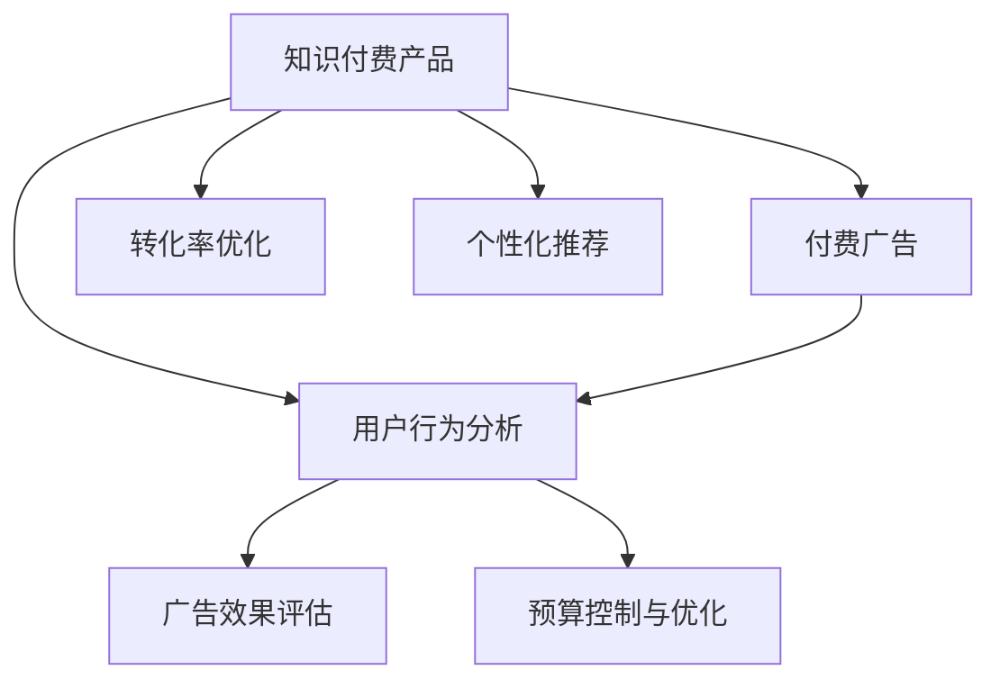

                 

# 如何利用付费广告推广知识付费产品

> 关键词：付费广告, 知识付费产品, 转化率优化, 用户行为分析, 个性化推荐

## 1. 背景介绍

### 1.1 问题由来

随着互联网和信息技术的快速发展，知识付费产品日益成为大众获取知识、提升个人技能的重要途径。无论是教育类应用、职业技能培训、专业课程，还是职场资讯、生活指南等，内容质量、用户体验和推广效果成为决定产品竞争力的关键因素。特别是对于初创型知识付费平台，精准有效的广告推广策略，直接关系到产品能否快速切入市场，实现用户增长和收入转化。

### 1.2 问题核心关键点

1. **广告精准投放**：如何根据目标用户群体特征，将广告内容精准地推送给最有可能转化为付费用户的人群。
2. **广告效果评估**：如何快速高效地评估广告效果，识别出高效的用户行为路径和转化路径。
3. **用户行为分析**：如何分析用户行为数据，挖掘用户兴趣和偏好，从而设计更具针对性的广告内容。
4. **个性化推荐**：如何通过个性化推荐引擎，提升广告的吸引力和用户体验，提升转化率。
5. **预算控制与优化**：如何在预算有限的情况下，最大化广告投放效果，实现成本效益最大化。

### 1.3 问题研究意义

掌握有效的付费广告推广策略，对于提升知识付费产品的市场竞争力和用户体验具有重要意义：

1. **提升市场竞争力**：精准有效的广告投放策略，可以帮助知识付费产品快速获取用户，抢占市场先机。
2. **提升用户体验**：通过个性化推荐和行为分析，能够提升用户黏性，提高用户的长期价值。
3. **实现成本效益最大化**：优化广告投放策略和预算分配，可以在有限的广告预算下，获得更高的广告ROI。
4. **积累用户数据**：广告投放过程中的数据收集和分析，有助于积累用户行为数据，进一步优化产品和服务。

## 2. 核心概念与联系

### 2.1 核心概念概述

为更好地理解如何利用付费广告推广知识付费产品，本节将介绍几个密切相关的核心概念：

- **知识付费产品(Knowledge Paying Products, KPPs)**：基于知识付费模式，提供高质量、有价值的知识内容，用户通过付费获取或订阅，以提升自身技能或知识水平的产品。
- **付费广告(Paid Advertising)**：企业支付费用，通过广告平台将广告内容推送给目标用户，以提升产品曝光率和用户转化的营销手段。
- **转化率优化Conversion Rate Optimization (CRO)**：通过分析用户行为数据，识别高效的用户转化路径，优化广告和产品设计，提升用户转化率的技术。
- **用户行为分析(User Behavior Analysis)**：通过分析用户在平台上的行为数据，挖掘用户的兴趣、偏好和行为特征，为个性化推荐和精准广告投放提供依据。
- **个性化推荐系统(Personalized Recommendation System)**：根据用户的历史行为和偏好，推荐符合其兴趣的产品或内容，提升用户体验和转化率的系统。
- **广告效果评估(Advertising Effectiveness Assessment)**：通过设定关键指标（如点击率、转化率等），评估广告投放效果，优化广告投放策略的流程。
- **预算控制与优化(Budget Control and Optimization)**：在预算限制下，通过优化广告投放策略，提升广告ROI（投资回报率）的方法。

这些核心概念之间的逻辑关系可以通过以下Mermaid流程图来展示：



这个流程图展示的核心概念及其之间的关系：

1. 知识付费产品通过付费广告获得用户曝光和流量。
2. 用户行为分析挖掘用户特征，指导个性化推荐和广告投放。
3. 个性化推荐提升用户体验和转化率。
4. 广告效果评估和预算控制优化广告投放策略，提升广告ROI。

这些概念共同构成了知识付费产品推广的核心框架，其相互配合可以显著提升广告投放效果和用户体验。

## 3. 核心算法原理 & 具体操作步骤
### 3.1 算法原理概述

基于付费广告的知识付费产品推广，核心在于通过精准投放、效果评估和预算优化，实现用户转化和市场竞争力的提升。其核心算法原理包括以下几个关键步骤：

1. **目标用户群体划分**：根据用户行为数据和属性标签，将用户划分为不同的群体。
2. **广告内容定制**：根据不同用户群体的特征，定制个性化的广告内容。
3. **广告投放优化**：通过A/B测试等方法，不断优化广告投放策略，提升点击率和转化率。
4. **用户行为分析**：收集和分析用户行为数据，挖掘用户兴趣和行为特征。
5. **个性化推荐优化**：通过用户行为数据，优化个性化推荐算法，提升用户体验和转化率。
6. **广告效果评估**：设定关键指标，评估广告效果，识别高效的用户转化路径。
7. **预算分配与优化**：根据广告效果，优化预算分配，实现成本效益最大化。

### 3.2 算法步骤详解

#### 3.2.1 目标用户群体划分

目标用户群体划分是广告精准投放的基础。通过分析用户在平台上的行为数据，可以将用户划分为不同的群体。以下是具体的步骤：

1. **用户属性标签提取**：根据用户在平台上的注册信息、浏览记录、购买记录等数据，提取用户属性标签，如年龄、性别、兴趣标签、职业等。
2. **用户行为模式分析**：通过分析用户在平台上的行为数据，识别出用户的行为模式，如活跃时间、浏览内容、购买习惯等。
3. **用户群体划分**：根据属性标签和行为模式，将用户划分为不同的群体。例如，可以划分为年轻用户群体、职业培训需求用户群体、科技爱好者用户群体等。

#### 3.2.2 广告内容定制

广告内容定制是提升广告效果的关键步骤。通过针对不同用户群体定制个性化的广告内容，可以显著提升用户的点击率和转化率。以下是具体的步骤：

1. **广告素材准备**：准备多样化的广告素材，包括视频、图片、文本等，以适应不同用户群体的偏好。
2. **广告文案设计**：根据用户群体的特征，设计符合用户兴趣和需求的广告文案。例如，针对年轻用户群体，设计幽默风趣的广告文案；针对职业培训需求用户群体，设计职业技能相关的广告文案。
3. **广告测试与优化**：通过A/B测试等方法，不断优化广告文案和素材，提升广告效果。

#### 3.2.3 广告投放优化

广告投放优化是提升广告效果的重要手段。通过不断优化广告投放策略，可以最大化广告的ROI。以下是具体的步骤：

1. **广告投放渠道选择**：选择适合的广告投放渠道，如社交媒体、搜索引擎、视频平台等。
2. **投放时间与频次控制**：根据用户活跃时间，选择最佳的广告投放时间，避免打扰用户。同时控制广告投放频次，避免用户疲劳。
3. **广告投放预算分配**：根据不同广告渠道的效果，合理分配广告预算，提升广告ROI。

#### 3.2.4 用户行为分析

用户行为分析是提升广告效果和用户体验的基础。通过分析用户行为数据，可以挖掘用户兴趣和行为特征，指导个性化推荐和精准广告投放。以下是具体的步骤：

1. **行为数据收集**：收集用户在平台上的行为数据，如浏览记录、购买记录、互动数据等。
2. **行为模式识别**：通过数据挖掘技术，识别出用户的行为模式，如喜欢浏览的课程类型、经常购买的产品类别等。
3. **用户兴趣提取**：根据用户行为模式，提取用户的兴趣和偏好，如喜欢历史、文学的用户，喜欢IT、编程的用户等。

#### 3.2.5 个性化推荐优化

个性化推荐优化是提升用户体验和转化率的关键手段。通过优化个性化推荐算法，可以提升用户对产品的兴趣和满意度。以下是具体的步骤：

1. **推荐算法设计**：选择适合的个性化推荐算法，如协同过滤、基于内容的推荐、混合推荐等。
2. **推荐内容更新**：根据用户的实时行为数据，动态更新推荐内容，提升推荐的相关性和个性化。
3. **推荐效果评估**：通过评估指标（如点击率、购买率等），评估推荐效果，不断优化推荐算法。

#### 3.2.6 广告效果评估

广告效果评估是优化广告投放策略的重要手段。通过设定关键指标，评估广告效果，可以优化广告投放策略。以下是具体的步骤：

1. **关键指标设定**：设定关键广告效果指标，如点击率、转化率、广告成本等。
2. **效果数据收集**：收集广告投放过程中的效果数据，如广告展示次数、点击次数、转化次数等。
3. **效果分析与优化**：通过效果数据，分析广告效果，识别高效的用户转化路径，优化广告投放策略。

#### 3.2.7 预算分配与优化

预算分配与优化是实现成本效益最大化的关键手段。通过优化预算分配，可以在有限的预算下，获得更高的广告效果。以下是具体的步骤：

1. **预算分配策略**：根据广告效果和预算限制，制定合理的预算分配策略，如按渠道分配、按用户群体分配等。
2. **预算优化算法**：选择适合的预算优化算法，如遗传算法、线性规划等，优化广告预算分配。
3. **效果跟踪与调整**：根据广告效果，跟踪预算使用情况，不断调整预算分配策略，实现成本效益最大化。

### 3.3 算法优缺点

利用付费广告推广知识付费产品，具有以下优点：

1. **快速获得用户曝光**：通过付费广告，可以快速获得目标用户群体的曝光，提升产品知名度和用户关注度。
2. **精准投放**：通过目标用户群体划分和广告内容定制，可以实现精准投放，提升广告效果。
3. **提升用户体验**：通过个性化推荐优化，提升用户对产品的兴趣和满意度，提高用户黏性。
4. **优化广告预算**：通过效果评估和预算优化，实现广告ROI最大化，降低广告成本。

但该方法也存在以下缺点：

1. **广告成本较高**：付费广告需要支付一定的费用，高成本可能会对小型平台造成压力。
2. **用户行为数据依赖**：广告效果和推荐优化依赖于用户行为数据，数据质量影响较大。
3. **效果评估难度大**：不同广告渠道和用户群体的效果评估复杂，需要大量实验和分析。
4. **投放策略复杂**：广告投放策略的制定和优化需要专业的技术和经验，对平台运营人员要求较高。

## 4. 数学模型和公式 & 详细讲解  
### 4.1 数学模型构建

在利用付费广告推广知识付费产品的过程中，可以构建以下数学模型：

1. **目标用户群体划分模型**：
   $$
   \text{User Group} = f(\text{User Attributes}, \text{User Behavior})
   $$
   其中，$\text{User Attributes}$为用户属性标签，$\text{User Behavior}$为用户行为模式。

2. **广告效果评估模型**：
   $$
   \text{Effectiveness} = \text{点击率} \times \text{转化率} - \text{广告成本}
   $$
   其中，$\text{点击率}$为广告点击次数与广告展示次数的比率，$\text{转化率}$为转化为付费用户次数与点击次数的比率。

3. **预算分配与优化模型**：
   $$
   \text{Budget Allocation} = \text{Ad Channels} \times \text{User Groups} \times \text{Effectiveness}
   $$
   其中，$\text{Ad Channels}$为广告投放渠道，$\text{User Groups}$为用户群体。

### 4.2 公式推导过程

1. **目标用户群体划分模型的推导**：

   通过聚类算法（如K-Means、DBSCAN等），将用户属性标签和行为模式作为特征，划分为不同的用户群体。推导公式如下：

   $$
   \text{User Group} = \text{Cluster}(\text{User Attributes}, \text{User Behavior})
   $$

2. **广告效果评估模型的推导**：

   根据广告的展示次数、点击次数、转化次数等数据，计算广告效果。推导公式如下：

   $$
   \text{Effectiveness} = \frac{\text{点击次数} \times \text{转化次数}}{\text{广告展示次数}} - \text{广告成本}
   $$

3. **预算分配与优化模型的推导**：

   根据广告效果和用户群体，优化广告预算分配。推导公式如下：

   $$
   \text{Budget Allocation} = \text{Ad Channels} \times \text{User Groups} \times \text{Effectiveness}
   $$

### 4.3 案例分析与讲解

**案例一：科技教育类应用推广**

假设某科技教育类应用，目标用户群体主要为科技爱好者和年轻学生。为了推广该应用，可以进行以下操作：

1. **目标用户群体划分**：根据用户注册信息、浏览记录、购买记录等数据，将用户划分为科技爱好者群体、年轻学生群体等。
2. **广告内容定制**：为科技爱好者群体设计科技前沿技术、最新科技新闻等相关广告内容；为年轻学生群体设计学习技巧、编程基础等相关广告内容。
3. **广告投放优化**：选择社交媒体、搜索引擎等广告渠道，优化投放时间与频次，合理分配预算。
4. **用户行为分析**：收集用户行为数据，识别出科技爱好者对前沿技术感兴趣，年轻学生对学习技巧和编程基础感兴趣。
5. **个性化推荐优化**：根据用户行为数据，优化推荐算法，提升用户对科技教育类应用的兴趣和满意度。
6. **广告效果评估**：设定点击率、转化率等关键指标，评估广告效果，识别高效的用户转化路径。
7. **预算分配与优化**：根据广告效果，优化预算分配，实现成本效益最大化。

**案例二：职场培训平台推广**

假设某职场培训平台，目标用户群体主要为职场新人、职业转型者。为了推广该平台，可以进行以下操作：

1. **目标用户群体划分**：根据用户注册信息、浏览记录、购买记录等数据，将用户划分为职场新人群体、职业转型者群体等。
2. **广告内容定制**：为职场新人群体设计职场技能、职业规划等相关广告内容；为职业转型者群体设计行业分析、职业转型课程等相关广告内容。
3. **广告投放优化**：选择职场社交平台、在线招聘平台等广告渠道，优化投放时间与频次，合理分配预算。
4. **用户行为分析**：收集用户行为数据，识别出职场新人对职场技能感兴趣，职业转型者对行业分析感兴趣。
5. **个性化推荐优化**：根据用户行为数据，优化推荐算法，提升用户对职场培训平台的兴趣和满意度。
6. **广告效果评估**：设定点击率、转化率等关键指标，评估广告效果，识别高效的用户转化路径。
7. **预算分配与优化**：根据广告效果，优化预算分配，实现成本效益最大化。

## 5. 项目实践：代码实例和详细解释说明
### 5.1 开发环境搭建

在进行付费广告推广实践前，我们需要准备好开发环境。以下是使用Python进行Facebook Ads SDK开发的环境配置流程：

1. 安装Anaconda：从官网下载并安装Anaconda，用于创建独立的Python环境。

2. 创建并激活虚拟环境：
```bash
conda create -n ads-env python=3.8 
conda activate ads-env
```

3. 安装Facebook Ads SDK：
```bash
pip install fb-ads-sdk
```

4. 安装各类工具包：
```bash
pip install numpy pandas scikit-learn matplotlib tqdm jupyter notebook ipython
```

完成上述步骤后，即可在`ads-env`环境中开始广告投放的开发实践。

### 5.2 源代码详细实现

下面我们以推广某科技教育类应用为例，给出使用Facebook Ads SDK进行付费广告推广的Python代码实现。

首先，定义广告投放策略：

```python
from fb_ads import (
    AdsClient,
    PlatformType,
    CreativeType,
    SchedulingType,
    CampaignType,
)

# 创建Facebook Ads SDK客户端
client = AdsClient(
    app_id='your_app_id',
    access_token='your_access_token',
    access_secret='your_access_secret'
)

# 创建广告投放集(Campaign)
campaign = client.create_campaign(
    name='科技教育广告投放集',
    type=CampaignType.CUSTOMIZED_AUDIENCE,
    ad_format=AdsClient.AD_FORMAT_IMAGES,
    platforms=[PlatformType.FB],
    schedule=CampaignType.SCHEDULE_DISCRIMINATE,
    customized_audience='your_customized_audience'
)

# 创建广告组(Ad Group)
ad_group = client.create_ad_group(
    name='科技教育广告组',
    ad_set_name='科技教育广告集',
    type=CampaignType.AD_SET,
    ad_format=AdsClient.AD_FORMAT_IMAGES,
    targeting=CampaignType.TARGETING_GENDER,
    targeting_values=['MEN', 'WOMEN']
)

# 创建广告(Creative)
creative = client.create_creative(
    name='科技教育广告素材',
    type=CreativeType.CUSTOMIZED,
    medium=AdsClient.MEDIUM_IMAGES,
    images=['your_ad_image']
)

# 创建广告(Campaign)对广告组(Ad Group)的关联关系
client.add_ad_group_to_campaign(ad_group.id, campaign.id)
```

然后，定义广告投放参数：

```python
# 定义广告预算和投放时间
daily_budget = 1000
targeting_values = ['MEN', 'WOMEN']
start_date = '2023-01-01'
end_date = '2023-01-31'
```

最后，启动广告投放流程：

```python
# 创建广告集(Campaign)
campaign = client.create_campaign(
    name='科技教育广告投放集',
    type=CampaignType.CUSTOMIZED_AUDIENCE,
    ad_format=AdsClient.AD_FORMAT_IMAGES,
    platforms=[PlatformType.FB],
    schedule=CampaignType.SCHEDULE_DISCRIMINATE,
    customized_audience='your_customized_audience',
    daily_budget=daily_budget,
    start_date=start_date,
    end_date=end_date
)

# 创建广告组(Ad Group)
ad_group = client.create_ad_group(
    name='科技教育广告组',
    ad_set_name='科技教育广告集',
    type=CampaignType.AD_SET,
    ad_format=AdsClient.AD_FORMAT_IMAGES,
    targeting=CampaignType.TARGETING_GENDER,
    targeting_values=targeting_values
)

# 创建广告(Creative)
creative = client.create_creative(
    name='科技教育广告素材',
    type=CreativeType.CUSTOMIZED,
    medium=AdsClient.MEDIUM_IMAGES,
    images=['your_ad_image']
)

# 创建广告(Campaign)对广告组(Ad Group)的关联关系
client.add_ad_group_to_campaign(ad_group.id, campaign.id)
```

以上就是使用Facebook Ads SDK进行付费广告推广的完整代码实现。可以看到，借助Facebook Ads SDK，开发者可以方便地进行广告投放策略的定义、广告组和广告集的创建、广告素材的上传等操作，从而实现高效的广告投放。

### 5.3 代码解读与分析

让我们再详细解读一下关键代码的实现细节：

**AdsClient类**：
- 用于与Facebook Ads SDK进行交互，创建和管理广告投放相关资源。
- 创建广告投放集时，需要指定投放平台、广告格式、广告集类型等参数。
- 创建广告组时，需要指定广告集类型、广告格式、投放时间和预算等参数。
- 创建广告时，需要指定广告素材类型、广告素材内容等参数。

**广告投放策略**：
- 通过设定广告集(Campaign)的投放类型、目标受众、广告素材等参数，实现精准的广告投放。
- 广告集类型分为多种，如自定义受众、相似受众、兴趣受众等，可以根据实际需求选择。
- 广告素材包括图片、视频、文本等多种形式，可以选择适合的形式进行投放。
- 广告组(Ad Group)的创建，可以实现更细致的受众定向，提升广告效果。

**广告投放参数**：
- 广告预算设定为每日1000美元，可以动态调整，以适应不同的投放效果。
- 受众定向分为多种，如性别、地理位置、兴趣标签等，可以根据实际需求选择。
- 广告投放时间设定为1月1日至1月31日，可以动态调整，以适应不同的推广周期。

**广告投放流程**：
- 创建广告集时，需要指定投放平台、广告格式、广告集类型等参数。
- 创建广告组时，需要指定广告集类型、广告格式、投放时间和预算等参数。
- 创建广告时，需要指定广告素材类型、广告素材内容等参数。
- 创建广告集对广告组的关联关系，确保广告投放的资源一致性。

可以看到，通过Facebook Ads SDK，开发者可以方便地进行广告投放策略的定义、广告组和广告集的创建、广告素材的上传等操作，从而实现高效的广告投放。

当然，工业级的系统实现还需考虑更多因素，如广告效果监控、预算分配优化、A/B测试等，但核心的广告投放范式基本与此类似。

## 6. 实际应用场景
### 6.1 智能客服系统

基于付费广告的知识付费产品推广，可以广泛应用于智能客服系统的构建。传统客服往往需要配备大量人力，高峰期响应缓慢，且一致性和专业性难以保证。通过付费广告推广知识付费产品，可以在短时间内快速提升品牌知名度和用户关注度，吸引更多的用户访问和使用智能客服系统。

在技术实现上，可以收集用户的历史使用数据和行为记录，将这些信息作为广告的素材和定向依据，进行精准投放。同时，在广告内容中引入智能客服的功能介绍和用户评价，提升广告的吸引力。用户点击广告后，可以自动进入智能客服系统，获得及时的咨询服务，提升用户体验。

### 6.2 金融理财应用

金融理财应用是知识付费产品的典型应用场景之一。通过付费广告推广，可以提升应用的知名度和用户关注度，吸引更多的用户注册和使用理财服务。

在广告投放策略上，可以针对不同年龄段、不同收入水平的用户群体，制定个性化的广告内容和定向策略。例如，对于年轻用户群体，可以设计理财知识和技巧相关的广告内容；对于高收入用户群体，可以设计高端理财产品和建议。通过个性化推荐引擎，提升用户对金融理财服务的满意度。

### 6.3 教育培训平台

教育培训平台是知识付费产品的重要应用领域之一。通过付费广告推广，可以吸引更多的学生和家长使用教育培训服务，提升平台的知名度和用户覆盖率。

在广告投放策略上，可以针对不同年龄段、不同教育阶段的学生群体，设计适合的教育培训内容和广告素材。例如，针对小学生群体，可以设计有趣的数学和英语学习课程；针对高中生群体，可以设计备战高考的复习资料和技巧。通过个性化推荐引擎，提升用户对教育培训服务的满意度。

### 6.4 健康医疗应用

健康医疗应用是知识付费产品的另一个重要应用场景。通过付费广告推广，可以提升应用的品牌知名度和用户关注度，吸引更多的用户关注健康和医疗知识。

在广告投放策略上，可以针对不同年龄段、不同健康需求的用户群体，设计适合的健康和医疗内容。例如，针对中老年用户群体，可以设计健康饮食、运动养生等相关内容；针对年轻用户群体，可以设计心理健康、疾病预防等相关内容。通过个性化推荐引擎，提升用户对健康医疗服务的满意度。

## 7. 工具和资源推荐
### 7.1 学习资源推荐

为了帮助开发者系统掌握付费广告推广的知识付费产品理论基础和实践技巧，这里推荐一些优质的学习资源：

1. Facebook Ads SDK官方文档：详细介绍了Facebook Ads SDK的使用方法和最佳实践，是进行付费广告推广的基础。
2. Google Ads AdWords API官方文档：介绍了Google Ads AdWords API的使用方法和最佳实践，是进行Google Ads推广的重要参考。
3. 《数字广告原理与实践》书籍：全面介绍了数字广告的原理和实践，涵盖了广告投放、效果评估、预算优化等多个方面。
4. 《Google Ads高级实战》课程：由Google Ads专家授课，深入讲解Google Ads的高级用法和优化技巧。
5. 《Facebook Ads高级实战》课程：由Facebook Ads专家授课，深入讲解Facebook Ads的高级用法和优化技巧。

通过对这些资源的学习实践，相信你一定能够快速掌握付费广告推广的知识付费产品精髓，并用于解决实际的推广问题。
### 7.2 开发工具推荐

高效的开发离不开优秀的工具支持。以下是几款用于付费广告推广开发的常用工具：

1. Facebook Ads SDK：由Facebook提供的广告投放SDK，支持Facebook平台的广告投放。
2. Google Ads AdWords API：由Google提供的广告投放API，支持Google Ads平台的广告投放。
3. Google Ads API Explorer：Google Ads的广告投放管理工具，提供了广告投放、效果分析、预算优化等功能。
4. Facebook Ads Manager：Facebook的广告投放管理工具，提供了广告创建、投放、效果分析等功能。
5. Analytics Platform：数据分析平台，支持多渠道数据的收集和分析，帮助优化广告投放策略。

合理利用这些工具，可以显著提升付费广告推广的开发效率，加快创新迭代的步伐。

### 7.3 相关论文推荐

付费广告推广的知识付费产品发展源于学界的持续研究。以下是几篇奠基性的相关论文，推荐阅读：

1. "Advertising and the Achievement of Large-Scale User Engagement"（Papacharissi，2014）：探讨了广告在提升用户参与和品牌认知中的作用，介绍了广告投放的最佳实践。
2. "Conversion Rate Optimization: A Survey"（Rhodes, 2019）：全面回顾了CRO的研究进展，介绍了多种CRO方法和技术。
3. "User Behavior Analysis in Online Advertisement"（Zhang et al., 2017）：研究了用户行为数据在广告投放中的重要性，介绍了用户行为分析的方法和技术。
4. "Personalized Recommendation Systems in Advertising"（Hofmann, 2013）：探讨了个性化推荐系统在广告投放中的应用，介绍了多种推荐算法和技术。
5. "Budget Control and Optimization in Online Advertising"（Sundararajan et al., 2016）：研究了广告预算分配和优化的策略，介绍了多种预算优化算法和技术。

这些论文代表了大语言模型微调技术的发展脉络。通过学习这些前沿成果，可以帮助研究者把握学科前进方向，激发更多的创新灵感。

## 8. 总结：未来发展趋势与挑战
### 8.1 总结

本文对如何利用付费广告推广知识付费产品进行了全面系统的介绍。首先阐述了付费广告推广的原理和优势，明确了广告精准投放、用户行为分析、个性化推荐等关键技术在推广过程中的重要性。其次，从原理到实践，详细讲解了付费广告推广的数学模型、关键步骤和具体实现，给出了广告投放的完整代码实例。同时，本文还探讨了付费广告推广在智能客服、金融理财、教育培训等多个领域的应用场景，展示了广告推广的广泛应用。

通过本文的系统梳理，可以看到，付费广告推广的知识付费产品具有强大的市场潜力和用户吸引力。广告精准投放、用户行为分析和个性化推荐等技术的协同应用，可以显著提升广告效果和用户转化率，实现良好的市场推广效果。未来，伴随广告技术的发展和应用场景的扩展，付费广告推广必将在知识付费产品推广中发挥更大的作用。

### 8.2 未来发展趋势

展望未来，付费广告推广的知识付费产品将呈现以下几个发展趋势：

1. **广告精准投放技术的进步**：随着用户数据和算法技术的进步，广告精准投放将更加精准，能够实现更高效的广告投放。
2. **用户行为分析的深化**：用户行为分析将更加深入，能够挖掘出更多的用户兴趣和行为特征，优化广告投放策略。
3. **个性化推荐系统的完善**：个性化推荐系统将更加完善，能够提升用户对产品的兴趣和满意度，提高用户转化率。
4. **广告效果评估的精细化**：广告效果评估将更加精细化，能够实时监控广告效果，优化广告投放策略。
5. **预算控制与优化的智能化**：预算控制与优化将更加智能化，能够动态调整预算分配，实现成本效益最大化。

这些趋势将进一步提升付费广告推广的效果和用户体验，推动知识付费产品的普及和发展。

### 8.3 面临的挑战

尽管付费广告推广的知识付费产品已经取得了显著成效，但在推广过程中仍面临诸多挑战：

1. **广告成本问题**：高额的广告成本可能对小型平台造成压力，需要通过优化广告策略和预算分配，降低广告成本。
2. **用户数据隐私问题**：用户行为数据的收集和分析涉及隐私问题，需要遵守相关法律法规，保护用户隐私。
3. **广告效果波动问题**：不同广告渠道和用户群体的广告效果波动较大，需要不断优化广告策略，提升广告效果稳定性。
4. **广告投放策略复杂性**：广告投放策略的制定和优化需要专业的技术和经验，对平台运营人员要求较高。
5. **广告效果监控问题**：实时监控广告效果，需要构建有效的广告效果评估机制，确保广告效果数据准确性。

### 8.4 研究展望

面对付费广告推广的知识付费产品所面临的挑战，未来的研究需要在以下几个方面寻求新的突破：

1. **低成本广告投放技术**：开发低成本、高效率的广告投放技术，降低广告成本，提升广告投放效率。
2. **用户数据隐私保护技术**：研发用户数据隐私保护技术，确保用户数据安全，遵守法律法规。
3. **广告效果波动控制技术**：研究广告效果波动控制技术，提升广告效果稳定性，减少广告投放风险。
4. **广告投放策略智能化**：开发智能化广告投放策略，通过机器学习和大数据分析，优化广告投放策略。
5. **广告效果监控技术**：研究广告效果监控技术，构建有效的广告效果评估机制，确保广告效果数据准确性。

这些研究方向的探索，必将引领付费广告推广的知识付费产品走向更高的台阶，为知识付费产品的推广提供更强大的技术支撑。

## 9. 附录：常见问题与解答

**Q1：付费广告推广有哪些平台可供选择？**

A: 付费广告推广的平台众多，主要包括以下几种：
1. Facebook Ads：面向Facebook和Instagram等平台，拥有丰富的广告格式和定向功能。
2. Google Ads：面向Google搜索和YouTube等平台，具有强大的广告投放和效果分析能力。
3. Baidu Ads：面向百度搜索和Baidu APP等平台，拥有丰富的广告格式和精准定向功能。
4. Tencent Ads：面向微信、QQ等平台，具有强大的广告投放和效果分析能力。

选择适合的广告平台，可以根据目标用户群体的平台使用习惯和行为特征进行决策。

**Q2：如何评估广告投放效果？**

A: 广告投放效果的评估主要通过以下关键指标进行：
1. 点击率(Click-Through Rate, CTR)：广告被点击次数与广告展示次数的比率。
2. 转化率(Conversion Rate, CR)：广告被点击后，转化为付费用户或完成预定行为的用户数与点击次数的比率。
3. 广告成本(Ad Cost)：广告投放的总成本。
4. 投资回报率(Return on Ad Spend, ROAS)：广告产生的收益与广告成本的比率。
5. 广告效果指数(Cost Per Click, CPC)：广告每次点击的费用。
6. 广告效果指数(Cost Per Acquisition, CPA)：广告每次转化的费用。

通过这些关键指标，可以全面评估广告投放效果，优化广告投放策略。

**Q3：如何优化广告预算分配？**

A: 广告预算分配的优化主要通过以下步骤进行：
1. 设定广告投放的每日预算和总预算，根据不同广告渠道和用户群体的效果，动态调整预算分配。
2. 使用A/B测试等方法，评估不同广告策略的效果，选择最优的广告投放策略。
3. 根据广告效果，动态调整预算分配，实现成本效益最大化。

预算分配的优化需要综合考虑广告效果、预算限制和用户群体特征，以达到最优的广告投放效果。

**Q4：如何实现广告精准投放？**

A: 广告精准投放的实现主要通过以下步骤进行：
1. 目标用户群体划分：根据用户行为数据和属性标签，将用户划分为不同的群体。
2. 广告内容定制：根据不同用户群体特征，定制个性化的广告内容。
3. 广告投放优化：通过A/B测试等方法，不断优化广告投放策略，提升点击率和转化率。
4. 用户行为分析：收集和分析用户行为数据，挖掘用户兴趣和行为特征，指导个性化推荐和精准广告投放。

广告精准投放需要综合考虑用户群体特征、广告内容和投放策略，以实现最优的广告效果。

**Q5：如何优化广告投放策略？**

A: 广告投放策略的优化主要通过以下步骤进行：
1. 设定广告投放的每日预算和总预算，根据不同广告渠道和用户群体的效果，动态调整预算分配。
2. 使用A/B测试等方法，评估不同广告策略的效果，选择最优的广告投放策略。
3. 根据广告效果，动态调整投放时间与频次，优化广告投放策略。

广告投放策略的优化需要综合考虑广告效果、预算限制和用户群体特征，以达到最优的广告投放效果。

---

作者：禅与计算机程序设计艺术 / Zen and the Art of Computer Programming

