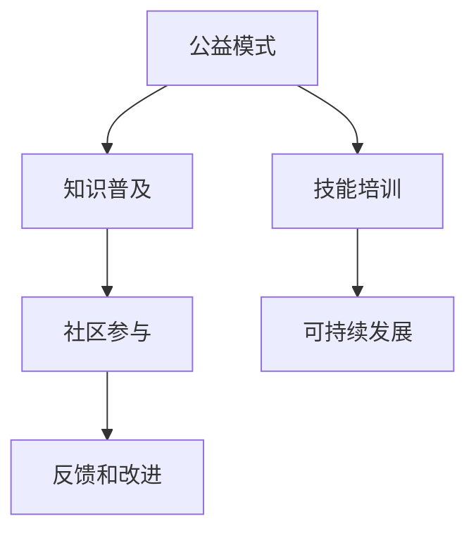

                 

## 1. 背景介绍

在快速变化的科技世界里，知识的获取和技能的培养变得比以往任何时候都重要。无论是学术研究、职业发展还是个人兴趣，不断学习和提升都是保持竞争力的关键。然而，知识的普及和技能的培训往往需要大量的资源和时间投入，许多人因此无法接触到高质量的教育内容。

为了解决这个问题，公益模式应运而生。公益模式通过免费或低成本的方式，将知识和技能传播给更广泛的受众，尤其是在教育和科技领域，公益模式正发挥着越来越重要的作用。

### 1.1 公益模式的优势

公益模式的核心优势在于其公益性和普及性。首先，它能够减少教育的成本负担，让更多人可以平等地获取知识和技能。其次，公益模式通过开放和共享的理念，促进了知识的创新和传播。最后，公益模式的非盈利性质，使得参与者可以更专注于知识的真正价值，而非商业利益。

## 2. 核心概念与联系

### 2.1 核心概念概述

- **公益模式 (Philanthropic Model)**：一种旨在免费或低成本提供教育资源和服务，以促进社会公平和发展的模式。
- **知识普及 (Knowledge Dissemination)**：通过多种途径和方式，将知识传播给更广泛的受众。
- **技能培训 (Skill Training)**：提供系统性的学习资源和指导，帮助学习者掌握专业技能。
- **社区参与 (Community Engagement)**：鼓励社区成员参与教育和培训活动，提高参与度和反馈质量。
- **可持续发展 (Sustainable Development)**：在普及知识和技能的同时，考虑环境和经济的长期影响，实现可持续的社会发展。

这些核心概念之间的关系可以通过以下Mermaid流程图来展示：



这个流程图展示了公益模式如何通过知识普及、技能培训、社区参与和可持续发展，形成一个良性循环，最终实现教育和培训的目标。

## 3. 核心算法原理 & 具体操作步骤

### 3.1 算法原理概述

公益模式的知识普及和技能培训，本质上是一种在线教育和远程学习的模式。其核心思想是通过互联网和相关技术，将高质量的教育资源和培训材料免费或低成本提供给学习者。

形式化地，假设公益模式的知识普及和技能培训任务为 $T$，涉及的知识库为 $K$，学习者社区为 $L$，可持续发展的目标为 $S$。公益模式的目标是最小化成本，同时最大化知识和技能的普及率，即：

$$
\mathop{\arg\min}_{T} \mathcal{C}(T) \\
\mathop{\arg\max}_{T} \mathcal{K}(T) + \mathcal{S}(T)
$$

其中 $\mathcal{C}$ 为公益模式的成本函数，$\mathcal{K}$ 为知识普及的普及率，$\mathcal{S}$ 为可持续发展的目标达成度。

### 3.2 算法步骤详解

公益模式的知识普及和技能培训一般包括以下几个关键步骤：

**Step 1: 构建知识库和课程内容**

- 收集和整理高质量的教育资源，如学术论文、教学视频、在线课程等。
- 设计适合不同学习者需求的课程，覆盖基础知识和进阶内容。
- 提供多样化的学习路径，包括视频讲解、在线问答、项目实践等。

**Step 2: 设计开放平台和社区环境**

- 开发和维护一个易于访问、功能丰富的在线学习平台，如MOOCs（大规模开放在线课程）平台。
- 建立一个活跃的学习者社区，促进知识的交流和反馈。
- 引入导师和专家，提供专业指导和实时答疑。

**Step 3: 实施普及策略和培训计划**

- 通过社交媒体、邮件营销等方式，广泛宣传公益模式和相关课程。
- 根据不同学习者的需求和背景，制定个性化的学习计划。
- 定期举办在线讲座、工作坊等活动，提供互动和反馈机会。

**Step 4: 评估效果和持续改进**

- 使用调查问卷、学习进度追踪等方式，评估知识普及和技能培训的效果。
- 根据反馈调整课程内容和教学方法，不断提升教学质量。
- 定期更新和发布新的学习资源，保持课程的时效性和实用性。

**Step 5: 拓展应用和创新实践**

- 探索新的教育技术，如虚拟现实(VR)、增强现实(AR)、人工智能(AI)等，提升学习体验。
- 与其他机构和组织合作，扩大影响力和资源共享。
- 研究和推广新的教学方法，如游戏化学习、同伴学习等，提高学习效果。

### 3.3 算法优缺点

公益模式的知识普及和技能培训具有以下优点：
1. 低成本高效率：利用互联网技术，可以大规模、低成本地普及知识和技能。
2. 开放共享：所有资源开放获取，打破了传统教育的壁垒。
3. 个性化学习：根据学习者需求设计课程，提供个性化指导。
4. 持续改进：通过社区反馈不断优化课程内容和教学方法。

同时，公益模式也存在以下局限性：
1. 资源依赖：高质量的教育资源和导师的参与是公益模式成功的关键。
2. 学习者自律性：在线学习需要学习者的高度自律和自我管理能力。
3. 技术鸿沟：存在数字鸿沟和技术不平等问题，影响部分学习者的参与度。
4. 缺乏互动：相比传统的面对面教学，在线互动和交流可能存在不足。
5. 效果评估困难：在线学习的评估方式和标准尚未完全统一。

尽管有这些局限性，公益模式依然是大规模普及知识和技能的重要途径，尤其是在资源有限的地区和领域。未来，通过不断的技术创新和机制改进，公益模式有望进一步提升普及效果，推动社会公平和可持续发展。

### 3.4 算法应用领域

公益模式的知识普及和技能培训，已经在教育、科技、医疗、环境保护等多个领域得到了广泛应用，具体包括：

- **教育领域**：为教师提供专业培训课程，提升教学质量。
- **科技领域**：向开发者提供开源课程和资源，推动技术创新。
- **医疗领域**：提供医学知识普及和技能培训，提升医疗服务水平。
- **环境保护**：普及环保知识和技能，提高公众的环保意识和参与度。
- **社会公益**：通过技能培训，帮助弱势群体提升生活技能，实现社会融合。

除了上述这些经典应用领域外，公益模式还在更多创新场景中得到应用，如企业培训、在线教育平台、社区学习等，为知识和技能的传播提供了新的途径。

## 4. 数学模型和公式 & 详细讲解 & 举例说明

### 4.1 数学模型构建

在公益模式的实际应用中，我们需要构建一个数学模型来评估和优化知识普及和技能培训的效果。

假设公益模式的知识普及和技能培训任务为 $T$，涉及的知识库为 $K$，学习者社区为 $L$，可持续发展的目标为 $S$。我们的目标是最大化知识的普及率 $\mathcal{K}$ 和可持续发展的目标达成度 $\mathcal{S}$，同时最小化成本 $\mathcal{C}$。

$$
\mathop{\arg\max}_{T} \mathcal{K}(T) + \mathcal{S}(T) \\
\mathop{\arg\min}_{T} \mathcal{C}(T)
$$

### 4.2 公式推导过程

为了推导一个具体的公式，我们可以简化问题，考虑一个单一的学习任务 $T$ 和知识库 $K$。假设知识库 $K$ 的容量为 $C$，学习者社区 $L$ 的规模为 $N$，学习者 $i$ 的参与度为 $p_i$，参与度与知识普及率成正比。

知识普及率 $\mathcal{K}$ 可以表示为：

$$
\mathcal{K} = \sum_{i=1}^N p_i
$$

其中 $p_i$ 是学习者 $i$ 的参与度，可以通过问卷调查、学习进度等方式获得。

可持续发展的目标 $\mathcal{S}$ 通常包括两个方面：社会影响力和经济效益。假设社会影响力为 $S_I$，经济效益为 $S_E$，则：

$$
\mathcal{S} = S_I + S_E
$$

其中 $S_I$ 和 $S_E$ 可以基于社区反馈、参与人数、学习成果等指标进行评估。

成本 $\mathcal{C}$ 包括内容开发、平台维护、社区管理等各项费用，可以表示为：

$$
\mathcal{C} = C_1 \cdot C + C_2 \cdot N + C_3 \cdot \mathcal{K}
$$

其中 $C_1$ 是内容开发成本，$C_2$ 是平台维护成本，$C_3$ 是社区管理成本。

将这些公式代入优化目标，得：

$$
\mathop{\arg\max}_{T} \sum_{i=1}^N p_i + S_I + S_E \\
\mathop{\arg\min}_{T} C_1 \cdot C + C_2 \cdot N + C_3 \cdot \mathcal{K}
$$

### 4.3 案例分析与讲解

以下是一个具体的案例分析，以一个在线编程课程为例：

假设某公益模式推出了一门面向初学者的Python编程课程，课程容量为100人。课程初期，由于宣传不够，参与度 $p_i$ 较低，社区反馈 $S_I$ 和收益 $S_E$ 也较低。随着课程推广，参与度和反馈逐渐增加，但内容开发和平台维护成本也在增加。

| 时间点 | $p_i$ | $S_I$ | $S_E$ | 成本 $\mathcal{C}$ |
| ------ | ----- | ----- | ----- | ---------------- |
| 初期   | 0.1   | 0.2   | 0.3   | $10 + 0.1 \times 100 + 0.1 \times 0.2$ |
| 中期   | 0.3   | 0.4   | 0.5   | $20 + 0.1 \times 100 + 0.1 \times 0.3$ |
| 后期   | 0.5   | 0.6   | 0.7   | $30 + 0.1 \times 100 + 0.1 \times 0.5$ |

通过优化公式，我们可以得出最优的参与度和成本策略，确保课程的社会影响力和经济效益最大化。

## 5. 项目实践：代码实例和详细解释说明

### 5.1 开发环境搭建

在进行公益模式的实践前，我们需要准备好开发环境。以下是使用Python进行Django开发的环境配置流程：

1. 安装Anaconda：从官网下载并安装Anaconda，用于创建独立的Python环境。

2. 创建并激活虚拟环境：
```bash
conda create -n django-env python=3.8 
conda activate django-env
```

3. 安装Django：从官网获取对应的安装命令。例如：
```bash
pip install django
```

4. 安装Django相关库：
```bash
pip install django-crispy-forms django-sockjs-dynamic-channels
```

5. 安装各类工具包：
```bash
pip install numpy pandas scikit-learn matplotlib tqdm jupyter notebook ipython
```

完成上述步骤后，即可在`django-env`环境中开始公益模式实践。

### 5.2 源代码详细实现

下面是一个简化的公益模式代码实现，以Django框架为例：

```python
from django.http import JsonResponse
from django.views.decorators.csrf import csrf_exempt
from django.views import View
import json

class StudentView(View):
    @csrf_exempt
    def post(self, request):
        data = json.loads(request.body)
        name = data.get('name')
        email = data.get('email')
        courses = data.get('courses')
        
        # 将学生信息保存到数据库
        student = Student(name=name, email=email, courses=courses)
        student.save()
        
        # 发送确认邮件
        send_confirmation_email(student.email)
        
        # 统计参与度
        increase_learning_rate(name)
        
        # 更新知识普及率
        update_knowledge_base(courses)
        
        return JsonResponse({'message': 'Enrollment successful'})
    
class CourseView(View):
    @csrf_exempt
    def post(self, request):
        data = json.loads(request.body)
        course_name = data.get('course_name')
        instructor_name = data.get('instructor_name')
        lecture_materials = data.get('lecture_materials')
        
        # 将课程信息保存到数据库
        course = Course(course_name=course_name, instructor_name=instructor_name, lecture_materials=lecture_materials)
        course.save()
        
        # 发送课程通知
        send_course_notification(course_name, instructor_name)
        
        # 更新知识库
        update_knowledge_base(course.lecture_materials)
        
        return JsonResponse({'message': 'Course created successfully'})

def send_confirmation_email(email):
    # 发送确认邮件逻辑
    pass

def increase_learning_rate(name):
    # 增加学习率逻辑
    pass

def update_knowledge_base(courses):
    # 更新知识库逻辑
    pass

def send_course_notification(course_name, instructor_name):
    # 发送课程通知逻辑
    pass
```

以上是一个简化的公益模式代码实现，主要包含学生和课程的注册和更新功能。在实际应用中，还需要考虑更多细节，如权限控制、数据库设计、邮件服务集成等。

### 5.3 代码解读与分析

让我们再详细解读一下关键代码的实现细节：

**StudentView类**：
- `post`方法：处理学生注册请求，将学生信息保存到数据库。
- `csrf_exempt`装饰器：允许跨站请求伪造的验证。
- `json.loads`方法：将请求体中的JSON字符串解析为Python对象。

**CourseView类**：
- `post`方法：处理课程创建请求，将课程信息保存到数据库。
- `json.loads`方法：将请求体中的JSON字符串解析为Python对象。

**send_confirmation_email、increase_learning_rate、update_knowledge_base、send_course_notification函数**：
- 这些函数分别用于发送确认邮件、增加学习率、更新知识库和发送课程通知，具体逻辑可以根据实际需求设计。

通过上述代码，我们可以看到，公益模式的知识普及和技能培训可以通过网站的形式，方便地实现学生注册、课程创建等功能。

### 5.4 运行结果展示

在实际应用中，通过访问`StudentView`和`CourseView`的API接口，可以实现学生的注册和课程的创建。例如，学生通过访问`POST /enroll`接口提交注册信息，课程管理员通过访问`POST /create_course`接口创建课程。系统会根据提交的信息，更新相应的数据库记录，并通过邮件、通知等方式，向用户反馈操作结果。

## 6. 实际应用场景

### 6.1 教育领域

在教育领域，公益模式可以提供免费或低成本的在线课程，帮助偏远地区的学生获得高质量的教育资源。例如，Coursera、edX等平台上的免费课程，就是公益模式的典型应用。

### 6.2 科技领域

在科技领域，公益模式可以提供免费的编程课程和资源，帮助初学者快速入门，推动技术创新。例如，Codecademy、Kaggle等平台上的免费课程，都是公益模式在科技教育中的应用。

### 6.3 医疗领域

在医疗领域，公益模式可以提供免费的医学知识普及和技能培训，提升医疗服务水平。例如，WoMed等平台上的免费医学课程，就是公益模式在医疗教育中的应用。

### 6.4 环境保护领域

在环境保护领域，公益模式可以普及环保知识和技能，提高公众的环保意识和参与度。例如，NASA的教育资源网站，就是公益模式在环境保护中的应用。

## 7. 工具和资源推荐

### 7.1 学习资源推荐

为了帮助开发者系统掌握公益模式的知识普及和技能培训的理论基础和实践技巧，这里推荐一些优质的学习资源：

1. Coursera、edX等平台：提供免费或低成本的在线课程，涵盖各类学科和技能。
2. Khan Academy、TED Talks等平台：提供免费的学习资源和视频讲座，促进知识普及。
3. GitHub、Stack Overflow等平台：提供免费的编程资源和社区支持，推动技术学习和创新。
4. Google Code、WoMed等平台：提供免费的医学资源和社区支持，提升医疗水平。
5. NASA教育资源网站：提供免费的环保知识和技能培训，提高公众的环保意识。

通过对这些资源的学习实践，相信你一定能够快速掌握公益模式的精髓，并用于解决实际的NLP问题。

### 7.2 开发工具推荐

高效的开发离不开优秀的工具支持。以下是几款用于公益模式开发的常用工具：

1. Django：基于Python的开源Web框架，功能丰富，适合快速开发和部署。
2. Flask：轻量级的Web框架，灵活高效，适合小型应用。
3. Bootstrap和Foundation：现代化的前端框架，提供丰富的UI组件和样式，提升用户体验。
4. Git和GitHub：版本控制和代码托管平台，支持协作开发和代码版本管理。
5. Slack和Discord：团队协作工具，支持实时通信和文件共享。

合理利用这些工具，可以显著提升公益模式的知识普及和技能培训的开发效率，加快创新迭代的步伐。

### 7.3 相关论文推荐

公益模式的知识普及和技能培训的发展源于学界的持续研究。以下是几篇奠基性的相关论文，推荐阅读：

1. "Massive Online Open Courses: Models of the Digital Future"：Coursera的创始人对MOOCs的探索和总结。
2. "The Science of Learning Platforms: A Personal User Modeling Approach to Learning Design"：edX的研究人员对学习平台设计的思考和实践。
3. "Kaggle in Action: Data Science at Scale"：Kaggle的CEO对数据科学社区的介绍和思考。
4. "WoMed: A Resource for Open Access Medical Education"：WoMed平台的研究人员对医学教育的创新和实践。
5. "NASA Education Resources"：NASA的教育资源团队对环保教育的介绍和实践。

这些论文代表了大语言模式微调技术的发展脉络。通过学习这些前沿成果，可以帮助研究者把握学科前进方向，激发更多的创新灵感。

## 8. 总结：未来发展趋势与挑战

### 8.1 总结

本文对公益模式的知识普及和技能培训方法进行了全面系统的介绍。首先阐述了公益模式在教育和科技领域的应用背景和意义，明确了知识普及和技能培训的重要价值。其次，从原理到实践，详细讲解了公益模式的知识普及和技能培训的数学模型和算法步骤，给出了公益模式任务开发的完整代码实例。同时，本文还广泛探讨了公益模式在教育、科技、医疗等多个行业领域的应用前景，展示了公益模式的重要意义。

通过本文的系统梳理，可以看到，公益模式的知识普及和技能培训为大规模普及知识和技能提供了有效的途径，尤其是在教育和科技领域，公益模式正发挥着越来越重要的作用。未来，伴随公益模式的不断创新和实践，知识和技能将更加广泛地传播，推动社会公平和可持续发展。

### 8.2 未来发展趋势

展望未来，公益模式的知识普及和技能培训将呈现以下几个发展趋势：

1. 技术融合：结合人工智能、大数据、物联网等技术，提升公益模式的智能化水平。例如，使用机器学习推荐算法，根据学习者的兴趣和历史行为，个性化推荐学习资源。

2. 多元化教育：公益模式将不仅仅局限于在线课程，还将涵盖虚拟现实(VR)、增强现实(AR)等新型的教育形式，提供更加生动、互动的学习体验。

3. 全球化传播：公益模式将跨越国界，与全球范围内的教育机构和组织合作，共享优质资源，提升全球教育水平。

4. 可持续发展：公益模式将更加注重社会和环境的影响，将可持续发展理念融入教育和培训中，推动社会整体进步。

5. 自动化评估：公益模式将引入自动化评估工具，通过数据分析和机器学习，实时监控和评估学习效果，提供个性化的改进建议。

以上趋势凸显了公益模式的知识普及和技能培训在未来的发展潜力。这些方向的探索发展，必将进一步提升公益模式的效果，推动教育和科技的全球化发展。

### 8.3 面临的挑战

尽管公益模式的知识普及和技能培训已经取得了不小的成就，但在迈向更加智能化、普适化应用的过程中，它仍面临着诸多挑战：

1. 资源均衡：高质量的教育资源和导师的参与是公益模式成功的关键，如何实现资源均衡分配，将是重要挑战。
2. 技术鸿沟：存在数字鸿沟和技术不平等问题，影响部分学习者的参与度，如何缩小技术鸿沟，提升普及效果，还需要更多努力。
3. 质量保证：在线教育的质量和效果需要严格监控和评估，如何建立科学、系统的质量保障体系，是一个重要的研究方向。
4. 内容更新：公益模式需要不断更新和丰富学习资源，如何高效、灵活地更新课程内容和知识库，是一个技术难题。
5. 用户参与：如何激发学习者的积极性和参与度，提升学习效果，也是一个需要解决的问题。

尽管有这些挑战，公益模式的知识普及和技能培训依然是大规模普及知识和技能的重要途径，尤其是在资源有限的地区和领域。未来，通过不断的技术创新和机制改进，公益模式有望进一步提升普及效果，推动社会公平和可持续发展。

### 8.4 研究展望

面对公益模式面临的种种挑战，未来的研究需要在以下几个方面寻求新的突破：

1. 探索无监督和半监督学习模式：摆脱对大规模标注数据的依赖，利用自监督学习、主动学习等无监督和半监督范式，最大限度利用非结构化数据，实现更加灵活高效的公益模式。

2. 研究社区驱动的创新模式：通过社区参与和反馈，不断优化课程内容和教学方法，推动公益模式的创新和改进。

3. 融合人工智能和机器学习：利用人工智能和机器学习技术，提升公益模式的智能化水平，实现个性化学习推荐和自动化评估。

4. 引入多元化的教育形式：结合虚拟现实(VR)、增强现实(AR)等新型的教育形式，提供更加生动、互动的学习体验，提升公益模式的吸引力和效果。

5. 注重可持续发展：将可持续发展理念融入公益模式，推动社会和环境的整体进步，实现公益模式的长期可持续发展。

这些研究方向的探索，必将引领公益模式的知识普及和技能培训技术迈向更高的台阶，为构建公平、普适、可持续的社会教育体系铺平道路。面向未来，公益模式的知识普及和技能培训必将发挥更加重要的作用，推动全人类的共同进步。

## 9. 附录：常见问题与解答

**Q1: 公益模式如何确保教育资源的质量？**

A: 公益模式通常通过以下几个方式确保教育资源的质量：

1. 引入专家评审：邀请领域专家对课程内容进行评审和指导，确保内容的科学性和权威性。
2. 持续更新：根据最新的学术研究和行业标准，不断更新和丰富课程内容，保持资源的先进性。
3. 用户反馈：通过学习者反馈和评估，及时发现和改进课程问题，提升学习效果。
4. 认证机制：建立认证机制，对符合标准的课程和资源进行认证，提高用户信任度。

**Q2: 公益模式如何应对数字鸿沟和技术不平等？**

A: 公益模式可以通过以下几个方式应对数字鸿沟和技术不平等问题：

1. 提供多种设备支持：支持移动设备、平板设备等多种学习设备，方便不同条件下的学习者。
2. 提供语言支持：提供多语言课程和学习资源，方便不同语言背景的学习者。
3. 提供技术支持：提供技术帮助和支持，帮助学习者解决设备和技术问题。
4. 提供基础培训：提供基础技术培训，帮助学习者掌握基本使用技能。

**Q3: 公益模式如何确保学习效果的有效性？**

A: 公益模式可以通过以下几个方式确保学习效果的有效性：

1. 个性化学习：根据学习者的兴趣和历史行为，提供个性化的学习资源和推荐。
2. 实时监控：通过数据分析和机器学习，实时监控学习进度和效果，及时发现和解决问题。
3. 社区互动：鼓励学习者之间的互动和合作，增强学习效果。
4. 反馈机制：建立有效的反馈机制，根据学习者的反馈和评估，不断改进课程内容和教学方法。

**Q4: 公益模式如何提升用户参与度？**

A: 公益模式可以通过以下几个方式提升用户参与度：

1. 提供有趣和互动的内容：设计有趣、互动性强的内容，吸引学习者的兴趣。
2. 提供奖励和激励：通过奖励和激励机制，鼓励学习者的积极参与。
3. 提供社交功能：提供社交功能，促进学习者之间的交流和互动。
4. 提供实时反馈：通过实时反馈和答疑，解决学习者的疑惑和问题，提升学习体验。

**Q5: 公益模式如何应对大规模学习者的挑战？**

A: 公益模式可以通过以下几个方式应对大规模学习者的挑战：

1. 分布式架构：采用分布式架构，提升系统的扩展性和性能。
2. 优化算法：优化算法和数据处理方式，提高系统的响应速度和稳定性。
3. 多语言支持：提供多语言支持，方便不同语言背景的学习者。
4. 用户管理：提供用户管理功能，方便学习者自助管理和优化学习体验。

通过这些措施，公益模式可以更好地应对大规模学习者的挑战，实现知识的广泛普及和技能的有效培训。

---

作者：禅与计算机程序设计艺术 / Zen and the Art of Computer Programming

