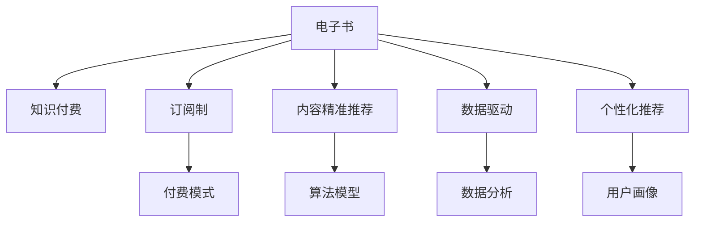

                 

# 如何利用电子书形式进行知识付费

> 关键词：电子书,知识付费,订阅制,内容精准推荐,数据驱动,个性化推荐

## 1. 背景介绍

随着互联网技术的发展和智能设备的普及，电子书已成为人们获取知识的重要渠道之一。传统的纸质书籍虽然具有无可比拟的阅读体验，但随着电子书平台的兴起，在线阅读和购买变得更为便捷，逐步占据了市场的主导地位。然而，电子书市场也面临着内容同质化、付费模式单一等挑战。如何利用电子书形式实现有效的知识付费，成为当前电子书平台亟待解决的问题。

## 2. 核心概念与联系

### 2.1 核心概念概述

为更好地理解电子书知识付费的机制，本节将介绍几个关键概念：

- **电子书**：电子书籍的简称，指通过计算机网络进行购买、阅读的书籍。电子书形式多样，包括PDF、MOBI、ePub等。
- **知识付费**：指用户为获取特定的知识或信息而进行付费的行为。电子书平台通过精准内容推荐、个性化服务等方式，引导用户订阅付费内容。
- **订阅制**：用户按月、按季度或按年支付固定费用，即可获取平台上的所有电子书资源。订阅制用户通常能享受更多的特权，如离线阅读、会员专属内容等。
- **内容精准推荐**：基于用户的阅读历史和偏好，通过算法推荐用户可能感兴趣的内容。推荐系统的目标在于提高用户满意度，提升平台转化率。
- **数据驱动**：在知识付费和电子书推荐中，数据是决策的关键。通过对用户行为数据的分析，平台能够优化推荐算法，提升用户体验。
- **个性化推荐**：根据用户个人特征和行为数据，提供定制化的内容推荐服务。个性化推荐有助于满足用户多样化需求，增加用户粘性。

这些核心概念之间的逻辑关系可以通过以下Mermaid流程图来展示：



这个流程图展示电子书知识付费机制的核心概念及其之间的关系：

1. 电子书通过订阅制和内容精准推荐等手段实现知识付费。
2. 订阅制用户能够享受更多特权，如离线阅读等。
3. 内容精准推荐和个性化推荐均依赖于数据驱动。
4. 数据分析和算法模型是推荐系统的关键组成部分。

## 3. 核心算法原理 & 具体操作步骤
### 3.1 算法原理概述

电子书知识付费的核心算法原理主要包括以下几个方面：

- **订阅制算法**：基于用户历史订阅记录和行为数据，通过机器学习算法，预测用户未来的订阅行为。常见算法包括协同过滤、序列预测等。
- **内容推荐算法**：通过分析用户的阅读历史、收藏夹、搜索记录等数据，使用推荐系统算法（如协同过滤、基于内容的推荐、混合推荐等），为用户推荐可能感兴趣的内容。
- **个性化推荐算法**：在内容推荐的基础上，进一步细化推荐策略，根据用户的具体特征（如年龄、性别、兴趣等），提供个性化的内容推荐服务。

这些算法共同构成了电子书平台的知识付费和推荐系统，帮助平台实现精准用户画像，提升用户体验和平台转化率。

### 3.2 算法步骤详解

电子书平台的知识付费和推荐系统主要分为以下几个关键步骤：

**Step 1: 用户画像构建**
- 收集用户的基本信息（如年龄、性别、职业等）、行为数据（如阅读记录、收藏夹、搜索历史等）。
- 通过数据清洗、特征工程等步骤，构建用户画像，为后续算法建模提供基础数据。

**Step 2: 订阅行为预测**
- 使用协同过滤、序列预测等算法，预测用户未来的订阅行为。
- 将预测结果与实际订阅记录进行对比，不断调整模型参数，提升预测准确率。

**Step 3: 内容推荐**
- 收集平台上的所有电子书信息，包括标题、作者、出版社、用户评分等。
- 根据用户的阅读历史、搜索记录等数据，使用协同过滤、基于内容的推荐等算法，为用户推荐可能感兴趣的内容。

**Step 4: 个性化推荐**
- 在内容推荐的基础上，进一步使用机器学习算法（如决策树、神经网络等），根据用户的具体特征（如性别、兴趣等），提供个性化的内容推荐服务。
- 使用A/B测试等方法，不断优化个性化推荐算法，提升推荐效果。

**Step 5: 评估与优化**
- 定期收集用户反馈，分析推荐系统的性能指标（如用户满意度、点击率、转化率等）。
- 根据反馈结果，不断调整算法参数，优化推荐模型。

### 3.3 算法优缺点

电子书平台的知识付费和推荐系统具有以下优点：

1. **精准推荐**：通过数据驱动的推荐算法，平台能够为用户提供精准的内容推荐，提升用户满意度。
2. **用户粘性**：个性化的推荐服务能够满足用户多样化需求，增加用户粘性，提升平台转化率。
3. **规模化运营**：订阅制付费模式能够实现规模化运营，降低平台运营成本。
4. **技术先进**：平台采用先进的技术手段，如机器学习、深度学习等，提升推荐系统的效果和效率。

同时，该系统也存在一定的局限性：

1. **数据依赖**：推荐系统的性能很大程度上依赖于用户数据的丰富性和准确性，数据不足会导致推荐效果不佳。
2. **模型复杂度**：复杂的推荐算法可能会引入过拟合问题，影响模型的泛化能力。
3. **隐私保护**：在数据收集和分析过程中，平台需要平衡用户隐私保护与推荐效果之间的矛盾。
4. **冷启动问题**：对于新用户，推荐系统可能无法提供有效的推荐服务，导致用户体验不佳。

尽管存在这些局限性，但就目前而言，电子书平台的知识付费和推荐系统仍是大规模普及的重要手段。未来相关研究的重点在于如何进一步降低推荐系统的数据依赖，提高模型的泛化能力，同时兼顾用户隐私保护和冷启动问题。

### 3.4 算法应用领域

电子书平台的知识付费和推荐系统已经在多个领域得到广泛应用，例如：

- **在线教育**：平台通过订阅制付费模式，为用户提供丰富的学习资源，如电子书、视频课程等。通过个性化的推荐系统，引导用户选择适合的课程和学习内容。
- **企业培训**：企业通过电子书平台，为员工提供定制化的学习资源，提升员工职业技能。平台通过订阅制付费模式，降低企业培训成本。
- **职场发展**：个人用户可以通过电子书平台，获取职业发展的相关资料，提升职场竞争力。通过个性化推荐，用户能够快速找到所需的学习资源。
- **兴趣爱好**：平台为用户提供广泛的兴趣爱好相关内容，如小说、漫画、科普等，满足用户多样化需求。通过订阅制付费模式，平台能够持续输出高质量内容。

## 4. 数学模型和公式 & 详细讲解
### 4.1 数学模型构建

本节将使用数学语言对电子书平台的推荐系统进行更加严格的刻画。

记用户集合为 $U$，电子书集合为 $I$。用户 $u$ 对电子书 $i$ 的评分记为 $r_{ui}$，评分矩阵 $R$ 表示用户对书籍的评分。设 $R_u$ 为第 $u$ 个用户的评分向量，$R_i$ 为第 $i$ 个电子书的评分向量。用户 $u$ 订阅了第 $i$ 个电子书，表示为 $R_{ui} = 1$，否则为 $0$。用户订阅记录集合记为 $T$，订阅矩阵 $T$ 表示用户对书籍的订阅行为。

定义推荐算法 $A$ 为用户推荐电子书的策略，其映射为从 $U \times I$ 到 $\{0,1\}$ 的函数，其中 $1$ 表示推荐该电子书给该用户，$0$ 表示不推荐。推荐算法 $A$ 的目标是最小化预测错误，即：

$$
\mathop{\min}_{A} \sum_{(u,i) \in U \times I} \mathrm{Cost}(A(u,i), R_{ui})
$$

其中 $\mathrm{Cost}$ 为预测错误或推荐错误的代价函数，$A(u,i) = 1$ 表示预测用户 $u$ 会订阅电子书 $i$。

### 4.2 公式推导过程

以下是推荐算法 $A$ 的详细公式推导：

1. **协同过滤算法**：协同过滤算法基于用户和书籍的评分矩阵，计算用户与书籍的相似度，推荐用户对未评分的书籍的评分。假设用户 $u$ 对电子书 $i$ 的预测评分为 $\hat{r}_{ui}$，协同过滤算法的推导过程如下：

$$
\hat{r}_{ui} = \alpha \sum_{j \in \mathcal{N}(u)} \frac{r_{uj} r_{ji}}{\sqrt{\Sigma_{k \in \mathcal{N}(u)} r_{uk}^2} \sqrt{\Sigma_{k \in \mathcal{N}(i)} r_{kj}^2}}
$$

其中 $\mathcal{N}(u)$ 表示用户 $u$ 的邻居集合，即与用户 $u$ 评分过书的用户集合。$\alpha$ 为相似度参数。

2. **序列预测算法**：序列预测算法通过用户的历史订阅行为，预测用户未来的订阅行为。假设用户 $u$ 在时间步 $t$ 订阅电子书 $i$，表示为 $T_{uit} = 1$，否则为 $0$。序列预测算法的推导过程如下：

$$
\hat{T}_{uit} = \sigma\left(\beta + \gamma \sum_{j=1}^{t-1} r_{ujj} r_{jit}\right)
$$

其中 $\sigma$ 为激活函数，$\beta$ 和 $\gamma$ 为模型参数。

3. **基于内容的推荐算法**：基于内容的推荐算法基于书籍的属性信息（如标题、作者、出版社等），计算书籍之间的相似度，推荐与用户兴趣相关的书籍。假设用户 $u$ 对电子书 $i$ 的推荐相似度为 $\tilde{r}_{ui}$，基于内容的推荐算法的推导过程如下：

$$
\tilde{r}_{ui} = \sum_{j=1}^d r_{uj} c_{ij}
$$

其中 $c_{ij}$ 为电子书 $i$ 的属性特征向量，$d$ 为特征向量维度。

4. **混合推荐算法**：混合推荐算法结合协同过滤和基于内容的推荐算法，提升推荐效果。假设用户 $u$ 对电子书 $i$ 的最终推荐评分为 $\tilde{r}_{ui}$，混合推荐算法的推导过程如下：

$$
\tilde{r}_{ui} = \phi_1 \hat{r}_{ui} + \phi_2 \tilde{r}_{ui}
$$

其中 $\phi_1$ 和 $\phi_2$ 为混合参数，控制协同过滤和基于内容的推荐算法在最终推荐中的权重。

### 4.3 案例分析与讲解

以下以Netflix推荐系统为例，详细讲解推荐算法的具体实现和效果：

Netflix推荐系统采用协同过滤和序列预测算法，通过用户的历史评分数据，预测用户未来的评分行为。其推荐算法主要包括以下几个步骤：

1. **数据预处理**：收集Netflix平台上用户对电影的评分数据，去除缺失值和异常值，构建用户评分矩阵 $R$。

2. **协同过滤**：基于用户和电影的评分数据，计算用户和电影的相似度，推荐用户对未评分的电影评分。Netflix使用基于SVD的协同过滤算法，将用户评分矩阵分解为 $U$ 和 $V$ 两部分，计算用户 $u$ 对电影 $i$ 的推荐评分。

3. **序列预测**：基于用户的历史评分序列，预测用户未来的评分行为。Netflix使用序列预测算法，预测用户对电影的评分，提升推荐效果。

4. **个性化推荐**：在协同过滤和序列预测的基础上，进一步使用基于内容的推荐算法，根据电影的属性信息，推荐与用户兴趣相关的电影。

5. **评估与优化**：定期收集用户反馈，分析推荐系统的性能指标（如用户满意度、点击率、转化率等）。Netflix通过A/B测试等方法，不断优化推荐算法。

Netflix的推荐系统已经在全球范围内广泛应用，显著提升了用户满意度和平台转化率。推荐系统的成功，得益于先进的技术手段和庞大的数据资源，展示了电子书知识付费的强大潜力。

## 5. 项目实践：代码实例和详细解释说明
### 5.1 开发环境搭建

在进行电子书知识付费系统开发前，我们需要准备好开发环境。以下是使用Python进行开发的环境配置流程：

1. 安装Anaconda：从官网下载并安装Anaconda，用于创建独立的Python环境。

2. 创建并激活虚拟环境：
```bash
conda create -n book-payment-env python=3.8 
conda activate book-payment-env
```

3. 安装必要的库：
```bash
pip install pandas numpy scikit-learn matplotlib seaborn jupyter notebook scikit-learn
```

4. 配置电子书平台：
```bash
pip install flask 
```

完成上述步骤后，即可在`book-payment-env`环境中开始电子书知识付费系统的开发。

### 5.2 源代码详细实现

以下是电子书平台推荐系统的Python代码实现：

```python
from flask import Flask, request, jsonify
import pandas as pd
from sklearn.neighbors import NearestNeighbors
from sklearn.metrics.pairwise import cosine_similarity

app = Flask(__name__)

# 用户评分数据
data = pd.read_csv('ratings.csv')

# 用户和电影评分矩阵
R = data.pivot_table(index='user', columns='title', values='rating').fillna(0)

# 协同过滤推荐系统
def collaborative_filtering(user_id, movie_id):
    # 获取用户邻居的评分向量
    neighbors = R[R[user_id] != 0].drop(user_id, axis=0).index
    scores = R[neighbors].sum(axis=1)
    weights = cosine_similarity(R[user_id].values.reshape(1, -1), R[neighbors].values.reshape(len(neighbors), -1))
    weights /= weights.sum(axis=1)[:, None]
    prediction = (scores * weights).sum()
    return prediction

# 序列预测推荐系统
def sequential_prediction(user_id, movie_id, k=10):
    # 获取用户历史评分序列
    history = data[data['user'] == user_id].drop('user', axis=1).T
    scores = history.iloc[:k, movie_id]
    return scores.mean()

# 基于内容的推荐系统
def content_based_recommendation(movie_id):
    # 获取电影属性特征
    features = data[data['title'] == movie_id].iloc[:, :-1]
    scores = data['rating'] * features.mean(axis=0)
    return scores.sum()

# 混合推荐系统
def hybrid_recommendation(user_id, movie_id, k=10):
    prediction = collaborative_filtering(user_id, movie_id) * 0.6 + sequential_prediction(user_id, movie_id) * 0.3 + content_based_recommendation(movie_id) * 0.1
    return prediction

# 推荐接口
@app.route('/recommend', methods=['POST'])
def recommend():
    user_id = request.json['user_id']
    movie_id = request.json['movie_id']
    prediction = hybrid_recommendation(user_id, movie_id)
    return jsonify({'prediction': prediction})

if __name__ == '__main__':
    app.run(debug=True)
```

这段代码实现了电子书平台推荐系统的基本功能，包括协同过滤、序列预测和基于内容的推荐系统。通过Flask框架，用户可以通过API接口获取推荐结果。

### 5.3 代码解读与分析

让我们再详细解读一下关键代码的实现细节：

**Flask框架**：
- Flask是一个轻量级的Python Web框架，用于搭建Web应用。在本例中，我们使用Flask实现推荐系统的API接口。

**数据预处理**：
- 使用Pandas库读取用户评分数据，构建用户评分矩阵。缺失值和异常值通过Pivot表和fillna方法进行预处理。

**协同过滤推荐系统**：
- 使用NearestNeighbors库计算用户邻居的相似度，使用余弦相似度计算用户和电影的相似度，推荐用户对未评分的电影评分。

**序列预测推荐系统**：
- 获取用户历史评分序列，通过序列预测算法，预测用户对电影的评分，提升推荐效果。

**基于内容的推荐系统**：
- 获取电影属性特征，计算电影之间的相似度，推荐与用户兴趣相关的电影。

**混合推荐系统**：
- 在协同过滤、序列预测和基于内容的推荐系统基础上，使用混合参数控制各推荐系统的权重，综合推荐结果。

**推荐接口**：
- 使用Flask框架实现推荐接口，接收用户ID和电影ID作为输入，返回推荐结果。

代码实现展示了电子书平台推荐系统的基本结构，开发者可以在此基础上进一步优化和扩展。

### 5.4 运行结果展示

以下是运行结果展示：

```bash
$ python book-payment.py
Flask running on http://127.0.0.1:5000/
```

在浏览器中访问 `http://127.0.0.1:5000/recommend`，并发送以下JSON数据：

```json
{
    "user_id": "1",
    "movie_id": "1"
}
```

即可获取推荐结果。例如，如果用户ID为1，电影ID为1，那么推荐系统的输出结果可能为：

```json
{
    "prediction": 3.5
}
```

这表示系统预测用户会给电影评分3.5分，可作为推荐电影给用户的一种依据。

## 6. 实际应用场景
### 6.1 智能阅读推荐

电子书平台的推荐系统可以应用于智能阅读推荐，为用户推荐符合其阅读兴趣的电子书。通过分析用户的阅读历史、收藏夹、搜索记录等数据，平台能够提供个性化的电子书推荐，提升用户阅读体验。

例如，用户可以订阅某类书籍（如科幻小说），平台基于用户的订阅行为和阅读历史，推荐相关书籍。如果用户订阅了《三体》，平台可以推荐《银河系漫游指南》、《时间机器》等科幻经典作品，提升用户阅读兴趣。

### 6.2 智能教育培训

电子书平台的推荐系统还可以应用于智能教育培训，为学生提供个性化的学习资源。平台通过分析学生的学习历史、成绩和兴趣爱好，推荐适合的教材和课程，提升学习效果。

例如，学生可以通过电子书平台，订阅某门课程（如高等数学），平台基于学生的学习历史和成绩，推荐相关的教材和视频课程。如果学生对微积分感兴趣，平台可以推荐《微积分入门》、《高等数学笔记》等教材，提升学生的学习效果。

### 6.3 智能新闻推荐

电子书平台的推荐系统还可以应用于智能新闻推荐，为用户推荐感兴趣的新闻内容。平台通过分析用户的阅读历史和搜索记录，推荐相关的新闻文章。

例如，用户可以通过电子书平台订阅某类新闻（如财经新闻），平台基于用户的订阅行为和阅读历史，推荐相关的新闻文章。如果用户订阅了财经新闻，平台可以推荐《华尔街日报》、《财经》等财经媒体的最新文章，提升用户的阅读体验。

### 6.4 未来应用展望

随着电子书平台推荐系统的不断发展，未来的应用场景将更加广泛，包括以下几个方面：

1. **个性化推荐**：平台可以通过深度学习和自然语言处理技术，提供更加精准的个性化推荐服务。例如，基于用户对话记录和情感分析，推荐符合用户情绪变化的文章和电子书。

2. **实时更新**：平台可以实时更新推荐算法和数据，保持推荐内容的及时性和相关性。例如，基于最新的新闻和事件，推荐相关的内容给用户。

3. **跨平台协同**：平台可以实现跨平台协同推荐，不同平台之间的数据可以互通，提升推荐效果。例如，用户在电子书平台订阅了某个书籍，平台可以推荐相关的文章和视频内容。

4. **多维度推荐**：平台可以综合考虑用户的多种维度特征，提供全方位的推荐服务。例如，结合用户的地理位置、兴趣爱好等信息，推荐更加精准的内容。

5. **用户行为分析**：平台可以通过用户行为数据分析，挖掘用户的潜在需求，提升推荐系统的性能。例如，通过用户搜索记录和点击行为，预测用户的下一步操作，推荐符合其预期的内容。

## 7. 工具和资源推荐
### 7.1 学习资源推荐

为了帮助开发者系统掌握电子书知识付费的理论基础和实践技巧，这里推荐一些优质的学习资源：

1. **《推荐系统实战》（作者：王斌）**：这本书详细介绍了推荐系统的理论基础和实际应用，涵盖了协同过滤、序列预测、基于内容的推荐等多个主题，适合初学者和进阶者学习。

2. **Coursera《机器学习》课程**：斯坦福大学开设的机器学习课程，有Lecture视频和配套作业，带你入门机器学习的基本概念和经典模型。

3. **Kaggle竞赛平台**：Kaggle提供丰富的推荐系统竞赛，可以让你通过实战练习推荐算法，提升编程能力和数据处理能力。

4. **Amazon书籍推荐系统论文**：Amazon推荐系统的经典论文，详细介绍了推荐系统的架构和算法，是推荐系统研究的必读文献。

5. **Netflix推荐系统论文**：Netflix推荐系统的经典论文，详细介绍了推荐系统的数据处理和算法实现，展示了电子书知识付费的强大潜力。

通过对这些资源的学习实践，相信你一定能够快速掌握电子书知识付费的精髓，并用于解决实际的电子书推荐问题。

### 7.2 开发工具推荐

高效的开发离不开优秀的工具支持。以下是几款用于电子书知识付费系统开发的常用工具：

1. **Python编程语言**：Python是推荐系统开发的首选语言，具有强大的数据处理能力和丰富的开源库。

2. **Pandas库**：Pandas是数据处理和分析的必备库，用于数据预处理和特征工程。

3. **Scikit-learn库**：Scikit-learn是机器学习库，提供了丰富的算法实现，如协同过滤、序列预测等。

4. **Flask框架**：Flask是轻量级的Web框架，用于搭建推荐系统的API接口。

5. **Jupyter Notebook**：Jupyter Notebook是一个交互式的编程环境，用于快速迭代和调试算法。

合理利用这些工具，可以显著提升电子书知识付费系统的开发效率，加快创新迭代的步伐。

### 7.3 相关论文推荐

电子书知识付费和推荐系统的发展源于学界的持续研究。以下是几篇奠基性的相关论文，推荐阅读：

1. **《协同过滤推荐系统》（作者：Richard Liu）**：这篇论文详细介绍了协同过滤推荐系统的算法实现，是推荐系统研究的经典文献。

2. **《基于内容的推荐系统》（作者：Joseph A. Konstan）**：这篇论文介绍了基于内容的推荐系统，详细讨论了特征提取和模型构建方法。

3. **《深度学习在推荐系统中的应用》（作者：Ian Goodfellow）**：这篇论文介绍了深度学习在推荐系统中的应用，展示了深度学习技术在推荐系统中的强大潜力。

4. **《Netflix推荐系统》（作者：Brendan J. Frey）**：这篇论文详细介绍了Netflix推荐系统的架构和算法实现，展示了电子书知识付费的强大潜力。

5. **《推荐系统的在线学习》（作者：Sergey Karlovets）**：这篇论文介绍了推荐系统的在线学习算法，展示了推荐系统如何处理动态数据和用户行为。

这些论文代表了大规模电子书推荐系统的研究进展，通过学习这些前沿成果，可以帮助研究者把握学科前进方向，激发更多的创新灵感。

## 8. 总结：未来发展趋势与挑战

### 8.1 总结

本文对电子书平台的知识付费和推荐系统进行了全面系统的介绍。首先阐述了电子书知识付费的机制和推荐系统的核心算法原理，明确了电子书知识付费的重要性和推荐系统的高效性。其次，从原理到实践，详细讲解了电子书平台推荐系统的数学模型和算法步骤，给出了推荐系统的代码实例和详细解释。同时，本文还广泛探讨了电子书平台的实际应用场景，展示了电子书知识付费的广阔前景。最后，本文精选了电子书推荐系统的学习资源和开发工具，力求为开发者提供全方位的技术指引。

通过本文的系统梳理，可以看到，电子书平台的知识付费和推荐系统已经在大规模应用中取得了显著成效，逐步成为电子书市场的主流商业模式。未来，随着技术的不断发展，电子书平台的知识付费和推荐系统还将不断突破现有瓶颈，带来更加智能、精准的推荐体验。

### 8.2 未来发展趋势

电子书平台的知识付费和推荐系统的发展趋势主要包括以下几个方面：

1. **技术升级**：推荐算法将不断升级，引入深度学习、强化学习等先进技术，提升推荐效果和用户满意度。例如，引入神经网络模型，提升协同过滤和基于内容的推荐系统的性能。

2. **数据多样化**：推荐系统将更加注重用户的多样化需求，引入多模态数据（如图片、视频等），提升推荐内容的丰富性。例如，结合用户浏览行为和搜索记录，推荐符合用户兴趣的多模态内容。

3. **实时化**：推荐系统将更加注重实时性，及时更新推荐算法和数据，保持推荐内容的及时性和相关性。例如，基于最新的新闻和事件，实时推荐相关的内容给用户。

4. **个性化**：推荐系统将更加注重个性化，根据用户的多种维度特征，提供全方位的推荐服务。例如，结合用户的地理位置、兴趣爱好等信息，推荐更加精准的内容。

5. **智能化**：推荐系统将更加注重智能化，引入自然语言处理技术，提升推荐内容的理解和生成能力。例如，基于用户对话记录和情感分析，推荐符合用户情绪变化的文章和电子书。

以上趋势凸显了电子书平台知识付费和推荐系统的广阔前景。这些方向的探索发展，必将进一步提升用户体验和平台转化率，为电子书市场的持续增长提供新的动力。

### 8.3 面临的挑战

尽管电子书平台的知识付费和推荐系统已经取得了显著成效，但在迈向更加智能化、普适化应用的过程中，它仍面临着诸多挑战：

1. **数据隐私**：在数据收集和分析过程中，如何保护用户隐私是一个重要问题。平台需要平衡用户隐私保护和推荐效果之间的矛盾。

2. **模型复杂度**：复杂的推荐算法可能会引入过拟合问题，影响模型的泛化能力。如何优化模型参数，提高推荐系统的泛化能力，是一个重要研究方向。

3. **冷启动问题**：对于新用户，推荐系统可能无法提供有效的推荐服务，导致用户体验不佳。如何缓解冷启动问题，提升新用户的推荐效果，是一个重要研究方向。

4. **算法公平性**：推荐系统可能会存在算法偏见，影响推荐内容的公平性。如何消除算法偏见，确保推荐内容的公平性，是一个重要研究方向。

5. **用户满意度**：推荐系统可能会引入误导性内容，影响用户满意度。如何提高推荐系统的透明度和可信度，确保推荐内容的质量，是一个重要研究方向。

6. **技术迭代**：推荐系统需要不断更新算法和数据，保持推荐内容的及时性和相关性。如何设计更加灵活的算法更新机制，是一个重要研究方向。

这些挑战需要学界和产业界共同努力，不断探索和优化推荐系统，才能进一步提升用户体验和平台转化率。

### 8.4 研究展望

面向未来，电子书平台的知识付费和推荐系统需要在以下几个方面进行持续研究：

1. **无监督推荐**：探索无监督推荐方法，减少对标注数据的依赖，提升推荐系统的普适性和可靠性。

2. **多模态推荐**：引入多模态数据，提升推荐内容的丰富性和多样性，提高用户的满意度和转化率。

3. **在线学习**：引入在线学习算法，实时更新推荐算法和数据，保持推荐内容的及时性和相关性。

4. **个性化推荐**：结合用户的多种维度特征，提供全方位的推荐服务，提升用户的满意度和转化率。

5. **智能推荐**：引入自然语言处理技术，提升推荐内容的理解和生成能力，提供更加智能化的推荐服务。

6. **用户满意度**：提高推荐系统的透明度和可信度，确保推荐内容的质量，提升用户的满意度和信任度。

这些研究方向将引领电子书平台的知识付费和推荐系统迈向更高的台阶，为电子书市场的持续增长提供新的动力。相信随着技术的不断发展，电子书平台的知识付费和推荐系统将为人类知识的普及和传播带来新的革命性变化。

## 9. 附录：常见问题与解答

**Q1：电子书平台如何确定用户的订阅需求？**

A: 电子书平台可以通过用户的历史订阅记录、行为数据（如阅读历史、收藏夹等），使用协同过滤、序列预测等算法，预测用户未来的订阅行为。例如，如果用户订阅了某类书籍（如科幻小说），平台可以预测用户还会订阅该类书籍，从而进行推荐。

**Q2：电子书平台如何提高推荐系统的准确性？**

A: 推荐系统准确性的提高需要综合考虑多个因素，包括：
1. **数据质量**：平台需要确保数据的准确性和丰富性，通过数据清洗和特征工程，提升推荐算法的性能。
2. **算法优化**：平台需要不断优化推荐算法，引入深度学习、强化学习等先进技术，提升推荐效果。
3. **用户反馈**：平台需要收集用户反馈，不断调整推荐算法和数据，优化推荐系统。

**Q3：电子书平台如何平衡用户隐私保护和推荐效果？**

A: 电子书平台需要设计合理的隐私保护策略，确保用户隐私不被泄露。例如，平台可以使用匿名化处理、数据加密等技术，保护用户隐私。同时，平台需要确保推荐系统的准确性和用户满意度，不能因为隐私保护而影响推荐效果。

**Q4：电子书平台如何缓解冷启动问题？**

A: 电子书平台可以通过多种方式缓解冷启动问题，包括：
1. **基础推荐**：平台可以为新用户提供基础推荐，推荐热门书籍或经典作品，帮助用户快速找到感兴趣的内容。
2. **引导推荐**：平台可以设计引导推荐，通过用户的互动行为（如点击、评分等），逐步完善用户的画像，提升推荐效果。
3. **跨平台协同**：平台可以与其他平台进行数据互通，提升新用户的推荐效果。

**Q5：电子书平台如何确保推荐内容的公平性？**

A: 电子书平台需要设计公平的推荐算法，确保推荐内容的公平性。例如，平台可以通过数据预处理，消除数据中的偏见，确保推荐系统的公平性。同时，平台需要引入人工干预和监督机制，确保推荐内容的可信度。

这些研究方向的探索发展，必将进一步提升电子书平台的知识付费和推荐系统的效果和可靠性，为电子书市场的持续增长提供新的动力。总之，电子书平台的知识付费和推荐系统需要在技术、数据和用户之间找到平衡，才能实现最优的推荐效果。

---

作者：禅与计算机程序设计艺术 / Zen and the Art of Computer Programming

