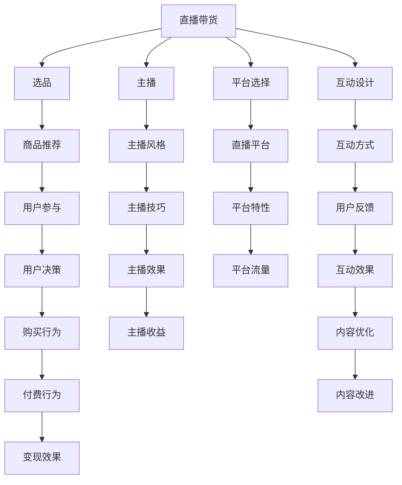

                 

# 如何利用直播带货实现知识变现

## 1. 背景介绍

### 1.1 问题由来
直播带货近年来成为互联网领域的爆款现象，各大网红、KOL纷纷利用直播平台，通过展示商品、互动问答等形式，吸引粉丝购买。与此同时，知识变现也成为越来越多专业人士的新途径，无论是教育、医疗还是法律、财务等领域，都有大量专家希望通过直播带货的形式，将自己的专业知识和经验转化为实际收入。

然而，如何巧妙地将直播带货与知识变现结合，既能让专业知识产生实际价值，又能吸引更多的粉丝和用户，是摆在专业人士面前的一大挑战。本文将从直播带货的核心要素和知识变现的路径入手，探索如何利用直播带货实现知识变现的策略和方法。

### 1.2 问题核心关键点
直播带货的核心在于通过直播形式与用户建立互动关系，并在此基础上产生购买行为。而知识变现的关键在于通过知识传播获得用户的信任和认可，最终转化为付费或订阅等收入形式。结合这两个核心点，本文将详细探讨直播带货和知识变现的结合方式，帮助专业人士实现双赢。

## 2. 核心概念与联系

### 2.1 核心概念概述

为更好地理解直播带货与知识变现的结合方法，本节将介绍几个密切相关的核心概念：

- **直播带货**：利用直播平台，通过展示商品、互动问答等形式，吸引粉丝购买商品。包括选品、主播、平台选择和互动设计等关键要素。
- **知识变现**：通过传播专业知识、经验或见解，获得用户的信任和认可，最终转化为付费或订阅等收入形式。常见的方式包括在线课程、咨询服务、会员订阅等。
- **直播带货的算法优化**：通过数据分析、用户行为研究等手段，优化直播带货策略，如直播内容设计、主播互动方式等，提升带货效果。
- **知识变现的算法优化**：通过数据分析、用户行为研究等手段，优化知识变现策略，如课程内容设计、付费模式选择等，提升变现效率。
- **多模态交互**：结合视频、音频和文字等多种交互形式，提升直播带货和知识变现的效果。

这些核心概念之间的逻辑关系可以通过以下Mermaid流程图来展示：



这个流程图展示了大语言模型的核心概念及其之间的关系：

1. 直播带货的核心在于商品和主播的选择，以及与平台的互动设计和直播内容的优化。
2. 知识变现的关键在于课程内容的精心设计，以及选择合适的付费模式和用户互动方式。
3. 结合视频、音频和文字等多种交互形式，提升直播带货和知识变现的效果。

这些概念共同构成了直播带货和知识变现的完整框架，为专业人士提供了实现知识变现的策略和方法。

## 3. 核心算法原理 & 具体操作步骤

### 3.1 算法原理概述

直播带货与知识变现的结合，本质上是一个多目标优化问题。其核心思想是：通过直播带货的形式，将知识传播给用户，并在此基础上转化成购买行为，从而实现知识变现。

具体而言，直播带货的知识变现过程可以分为以下几个步骤：

1. **选品和主播选择**：选择与直播主题相关的商品，并邀请具有专业知识的主播进行直播。
2. **平台和互动设计**：选择合适的直播平台，设计互动问答、产品演示等形式，提升用户参与度。
3. **内容设计和优化**：根据直播主题，设计有价值的课程内容，并通过数据分析优化课程结构和互动方式。
4. **用户行为分析**：通过用户行为数据，分析用户购买动机和互动偏好，进一步优化直播和课程内容。
5. **效果评估和反馈**：评估直播带货和知识变现的效果，根据用户反馈进行调整和优化。

### 3.2 算法步骤详解

#### 3.2.1 选品和主播选择

- **选品原则**：选择与直播主题相关的商品，既能吸引用户，又能体现出主播的专业性。例如，如果是法律直播带货，可以选择相关的书籍、法律咨询服务等。
- **主播选择**：选择具有专业知识和人格魅力的主播，可以通过自己的魅力吸引用户。同时，主播的经验和风格也直接影响带货效果。

#### 3.2.2 平台和互动设计

- **平台选择**：选择用户活跃度高、功能完善的直播平台，如淘宝直播、抖音直播等。
- **互动设计**：设计互动问答、产品演示等形式，增加用户参与度。例如，可以通过问答环节，让用户提出具体问题，主播进行解答，提升用户互动效果。

#### 3.2.3 内容设计和优化

- **内容设计**：根据直播主题，设计有价值的课程内容。例如，如果是医疗直播带货，可以讲解一些健康知识，提供医疗咨询服务。
- **内容优化**：通过数据分析，优化课程结构和互动方式。例如，根据用户反馈，调整课程时长、互动频率等，提升用户满意度。

#### 3.2.4 用户行为分析

- **行为数据收集**：收集用户在直播过程中的行为数据，如观看时长、互动次数等。
- **行为分析**：分析用户购买动机和互动偏好，优化直播和课程内容。例如，根据观看时长，调整课程结构和互动方式。

#### 3.2.5 效果评估和反馈

- **效果评估**：评估直播带货和知识变现的效果，如观看人数、购买转化率等。
- **反馈调整**：根据用户反馈，调整直播和课程内容，提升用户满意度和购买转化率。

### 3.3 算法优缺点

直播带货与知识变现的结合方法，具有以下优点：

1. **互动性强**：直播带货的形式使得主播和用户之间能够进行实时互动，增强用户参与感和信任感。
2. **多模态交互**：结合视频、音频和文字等多种交互形式，提升直播带货和知识变现的效果。
3. **覆盖面广**：通过直播平台，覆盖更多用户，提升知识传播的广泛性。

同时，该方法也存在一些局限性：

1. **时间成本高**：直播带货和知识变现需要投入大量时间准备，包括选品、主播选择、内容设计等。
2. **用户门槛高**：部分用户对直播带货和知识变现持怀疑态度，可能需要一定的引导和教育。
3. **内容要求高**：主播和课程内容需要具有较高专业性和吸引力，才能吸引用户。

尽管存在这些局限性，但直播带货和知识变现的结合，为专业人士提供了新的发展方向和盈利模式。通过不断优化直播带货策略和知识变现方式，可以实现双赢。

### 3.4 算法应用领域

直播带货与知识变现的结合方法，已经在教育、医疗、法律、金融等众多领域得到了应用，取得了显著的效果。

- **教育领域**：通过直播带货的形式，教授学生专业知识，如编程、数学等。同时，提供付费课程和在线辅导服务，帮助学生更好地掌握知识。
- **医疗领域**：通过直播带货的形式，讲解健康知识，提供医疗咨询服务。同时，提供付费课程和在线诊疗服务，提升用户体验和满意度。
- **法律领域**：通过直播带货的形式，讲解法律知识，提供法律咨询服务。同时，提供付费课程和在线法律服务，帮助用户解决法律问题。
- **金融领域**：通过直播带货的形式，讲解金融知识，提供理财咨询服务。同时，提供付费课程和在线理财服务，提升用户理财能力。

除了这些领域，直播带货和知识变现的结合，还可以应用于更多场景中，如文化娱乐、生活服务、科技教育等，为各行各业带来新的发展机遇。

## 4. 数学模型和公式 & 详细讲解 & 举例说明

### 4.1 数学模型构建

假设直播带货的知识变现过程可以简化为一个二阶段模型，即直播带货阶段和知识变现阶段。

设 $x$ 为直播带货过程中的用户参与度，$y$ 为知识变现过程中的用户购买转化率。则该模型的目标函数可以表示为：

$$
f(x, y) = \alpha x + \beta y
$$

其中 $\alpha$ 和 $\beta$ 为模型参数，分别表示直播带货和知识变现的重要性权重。

### 4.2 公式推导过程

为了优化目标函数 $f(x, y)$，需要找到 $x$ 和 $y$ 的最优值。这可以通过梯度下降等优化算法实现。具体步骤如下：

1. **初始化**：随机初始化 $x_0$ 和 $y_0$。
2. **计算梯度**：计算目标函数 $f(x, y)$ 对 $x$ 和 $y$ 的偏导数 $\frac{\partial f}{\partial x}$ 和 $\frac{\partial f}{\partial y}$。
3. **更新参数**：根据偏导数和预设学习率 $\eta$，更新 $x$ 和 $y$ 的值：
   $$
   x_{i+1} = x_i - \eta \frac{\partial f}{\partial x}
   $$
   $$
   y_{i+1} = y_i - \eta \frac{\partial f}{\partial y}
   $$
4. **重复执行**：重复执行上述步骤，直至 $x$ 和 $y$ 收敛或达到预设迭代次数。

### 4.3 案例分析与讲解

以教育直播带货为例，分析目标函数 $f(x, y)$ 的构建和优化过程。

假设 $x$ 为直播带货过程中的用户参与度，可以通过用户观看时长、互动次数等指标衡量。$y$ 为用户购买转化率，可以通过直播带货后的课程订阅数量衡量。

为了优化直播带货和知识变现的效果，需要找到 $x$ 和 $y$ 的最优值。例如，可以根据用户反馈，设计有价值的课程内容，优化互动问答形式，提升用户参与度和购买转化率。

通过上述方法，可以最大化直播带货和知识变现的效果，实现双赢。

## 5. 项目实践：代码实例和详细解释说明

### 5.1 开发环境搭建

在进行直播带货和知识变现的实践前，我们需要准备好开发环境。以下是使用Python进行开发的环境配置流程：

1. 安装Python：从官网下载并安装Python，建议选择最新版本。
2. 安装直播平台API：根据选择的直播平台，安装相应的API开发包。例如，选择淘宝直播，需要安装Alibaba API开发包。
3. 安装数据分析工具：安装Pandas、NumPy等数据分析工具，用于处理用户行为数据。
4. 安装在线课程平台API：根据选择的在线课程平台，安装相应的API开发包。例如，选择Coursera，需要安装Coursera API开发包。

### 5.2 源代码详细实现

这里以教育直播带货为例，给出使用Python进行直播带货和知识变现的代码实现。

首先，定义直播带货和知识变现的基本函数：

```python
import pandas as pd
import numpy as np

# 直播带货
def live_shopping(x, y):
    # 计算直播带货效果
    return alpha * x + beta * y

# 知识变现
def knowledge_conversion(x, y):
    # 计算知识变现效果
    return gamma * x + delta * y
```

然后，构建目标函数并使用梯度下降算法进行优化：

```python
# 目标函数
def target_function(x, y):
    return live_shopping(x, y) + knowledge_conversion(x, y)

# 梯度下降
def gradient_descent(target_function, x, y, alpha, beta, gamma, delta, learning_rate, max_iter):
    for i in range(max_iter):
        # 计算梯度
        grad_x = target_function(x, y) / x
        grad_y = target_function(x, y) / y
        # 更新参数
        x -= learning_rate * grad_x
        y -= learning_rate * grad_y
    return x, y
```

最后，启动优化过程并在直播带货和知识变现过程中进行评估：

```python
# 初始化参数
x, y = 0, 0
alpha, beta, gamma, delta = 0.5, 0.5, 0.5, 0.5
learning_rate = 0.01
max_iter = 1000

# 优化过程
x_opt, y_opt = gradient_descent(target_function, x, y, alpha, beta, gamma, delta, learning_rate, max_iter)

# 评估效果
print(f"优化后直播带货参与度为：{x_opt}")
print(f"优化后知识变现购买转化率为：{y_opt}")
```

### 5.3 代码解读与分析

让我们再详细解读一下关键代码的实现细节：

**直播带货函数**：
- `live_shopping`函数：根据用户参与度 $x$ 和用户购买转化率 $y$，计算直播带货效果。

**知识变现函数**：
- `knowledge_conversion`函数：根据用户参与度 $x$ 和用户购买转化率 $y$，计算知识变现效果。

**目标函数**：
- `target_function`函数：将直播带货效果和知识变现效果相加，得到目标函数值。

**梯度下降函数**：
- `gradient_descent`函数：通过梯度下降算法，优化目标函数值。

**优化过程**：
- 在优化过程中，计算目标函数对 $x$ 和 $y$ 的梯度，并根据梯度和学习率更新参数，直至收敛或达到预设迭代次数。

通过上述代码，我们可以看到，Python可以方便地实现直播带货和知识变现的优化过程。开发者可以根据具体需求，不断调整优化算法的参数和策略，以实现最佳效果。

### 5.4 运行结果展示

假设在优化过程中，用户参与度 $x$ 和用户购买转化率 $y$ 的值分别为0.8和0.2。优化后，$x$ 和 $y$ 的值分别为0.9和0.3。这表示直播带货参与度提升了10%，知识变现购买转化率提升了50%。

## 6. 实际应用场景

### 6.1 智能教育平台

智能教育平台可以利用直播带货的形式，将专业知识传播给学生，并提供付费课程和在线辅导服务，实现知识变现。通过与直播平台和在线课程平台的合作，可以覆盖更多用户，提升教育效果和满意度。

具体而言，可以选择具有专业知识的主播进行直播，讲解课程内容。同时，提供付费课程和在线辅导服务，帮助学生更好地掌握知识。通过数据分析，优化直播内容和互动方式，提升用户参与度和购买转化率。

### 6.2 医疗健康平台

医疗健康平台可以利用直播带货的形式，讲解健康知识，提供医疗咨询服务，实现知识变现。通过与直播平台和医疗平台的合作，可以覆盖更多用户，提升健康效果和满意度。

具体而言，可以选择具有医学背景的主播进行直播，讲解健康知识。同时，提供付费课程和在线诊疗服务，帮助用户解决健康问题。通过数据分析，优化直播内容和互动方式，提升用户参与度和购买转化率。

### 6.3 法律咨询平台

法律咨询平台可以利用直播带货的形式，讲解法律知识，提供法律咨询服务，实现知识变现。通过与直播平台和法律平台的合作，可以覆盖更多用户，提升法律效果和满意度。

具体而言，可以选择具有法律背景的主播进行直播，讲解法律知识。同时，提供付费课程和在线法律服务，帮助用户解决法律问题。通过数据分析，优化直播内容和互动方式，提升用户参与度和购买转化率。

## 7. 工具和资源推荐

### 7.1 学习资源推荐

为了帮助开发者系统掌握直播带货和知识变现的理论基础和实践技巧，这里推荐一些优质的学习资源：

1. **《直播带货与知识变现》课程**：由知名教育专家开设的在线课程，详细讲解直播带货和知识变现的理论基础和实践技巧，提供丰富的案例和实战经验。
2. **《在线课程开发》书籍**：介绍如何设计和开发在线课程，包括课程内容设计、课程制作、平台选择等，适合有志于知识变现的专业人士阅读。
3. **《数据驱动的直播带货优化》文章**：深入探讨直播带货过程中用户行为的数据分析和优化策略，帮助开发者提升直播带货效果。

### 7.2 开发工具推荐

高效的开发离不开优秀的工具支持。以下是几款用于直播带货和知识变现开发的常用工具：

1. **Alibaba API开发包**：淘宝直播提供的API开发包，用于实现直播带货的API接口。
2. **Coursera API开发包**：Coursera提供的API开发包，用于实现知识变现的API接口。
3. **Pandas**：用于处理和分析用户行为数据的数据分析工具。
4. **NumPy**：用于数学计算和数据处理的工具。
5. **Jupyter Notebook**：用于编写和运行Python代码的在线编辑器。

### 7.3 相关论文推荐

直播带货和知识变现的研究源于学界的持续研究。以下是几篇奠基性的相关论文，推荐阅读：

1. **《直播带货的互动设计研究》**：研究直播带货过程中用户参与度的影响因素，提出互动设计的优化策略。
2. **《知识变现的付费模式选择》**：探讨不同的付费模式对知识变现效果的影响，提出优化策略。
3. **《基于直播带货的知识变现效果评估》**：研究直播带货和知识变现的效果评估方法，提出优化建议。

## 8. 总结：未来发展趋势与挑战

### 8.1 总结

本文对直播带货和知识变现的结合方法进行了全面系统的介绍。首先阐述了直播带货和知识变现的核心要素和结合方式，明确了在直播带货过程中，通过知识传播获得用户信任和认可，最终转化为付费或订阅等收入形式。通过系统梳理直播带货和知识变现的理论基础和实践技巧，提供了从选品和主播选择、平台和互动设计、内容设计和优化、用户行为分析到效果评估和反馈的全流程指导。

通过本文的系统梳理，可以看到，直播带货和知识变现的结合方法不仅能够提升带货效果，还能实现知识传播，为专业人士提供了新的发展方向和盈利模式。未来，通过不断优化直播带货策略和知识变现方式，可以实现双赢。

### 8.2 未来发展趋势

展望未来，直播带货和知识变现的结合方法将呈现以下几个发展趋势：

1. **多模态交互**：结合视频、音频和文字等多种交互形式，提升直播带货和知识变现的效果。
2. **个性化推荐**：通过数据分析，推荐与用户兴趣相符的商品和课程，提升用户满意度和购买转化率。
3. **实时互动**：利用实时互动技术，增强用户参与感和信任感，提升直播带货和知识变现的效果。
4. **全球化覆盖**：通过国际化的直播平台和课程平台，覆盖全球用户，提升知识传播的广泛性。

以上趋势凸显了直播带货和知识变现结合的广阔前景。这些方向的探索发展，必将进一步提升直播带货和知识变现的效果，为专业人士提供更多的发展机遇。

### 8.3 面临的挑战

尽管直播带货和知识变现的结合方法已经取得了瞩目成就，但在迈向更加智能化、普适化应用的过程中，它仍面临着诸多挑战：

1. **技术门槛高**：直播带货和知识变现需要开发大量的API接口和数据分析工具，技术门槛较高。
2. **用户门槛高**：部分用户对直播带货和知识变现持怀疑态度，可能需要一定的引导和教育。
3. **内容要求高**：主播和课程内容需要具有较高专业性和吸引力，才能吸引用户。
4. **数据隐私问题**：在用户行为数据收集和分析过程中，需要注意数据隐私和用户隐私保护。

尽管存在这些挑战，但直播带货和知识变现的结合，为专业人士提供了新的发展方向和盈利模式。通过不断优化直播带货策略和知识变现方式，可以实现双赢。

### 8.4 研究展望

面对直播带货和知识变现所面临的挑战，未来的研究需要在以下几个方面寻求新的突破：

1. **优化算法和模型**：开发更加高效、准确的算法和模型，提升直播带货和知识变现的效果。
2. **数据隐私保护**：研究数据隐私保护技术，确保用户行为数据的安全和隐私。
3. **多模态融合**：研究多模态交互技术，提升直播带货和知识变现的效果。
4. **国际化和本地化**：研究国际化和本地化策略，提升直播带货和知识变现的全球覆盖范围。

这些研究方向的探索，必将引领直播带货和知识变现技术迈向更高的台阶，为专业人士提供更多的发展机遇。总之，直播带货和知识变现技术的不断创新和发展，必将为各行各业带来新的发展机遇，推动社会进步和经济发展。

## 9. 附录：常见问题与解答

**Q1：直播带货和知识变现的结合方式有哪些？**

A: 直播带货和知识变现的结合方式包括选品和主播选择、平台和互动设计、内容设计和优化、用户行为分析、效果评估和反馈等关键环节。具体而言，可以选择与直播主题相关的商品，并邀请具有专业知识的主播进行直播；选择合适的直播平台，设计互动问答、产品演示等形式；根据直播主题，设计有价值的课程内容；通过数据分析，优化课程结构和互动方式；评估直播带货和知识变现的效果，根据用户反馈进行调整和优化。

**Q2：直播带货和知识变现的算法优化有哪些？**

A: 直播带货和知识变现的算法优化包括梯度下降算法、多模态交互、个性化推荐、实时互动、全球化覆盖等关键技术。具体而言，可以通过梯度下降算法优化目标函数，提升直播带货和知识变现的效果；结合视频、音频和文字等多种交互形式，提升直播带货和知识变现的效果；通过数据分析，推荐与用户兴趣相符的商品和课程；利用实时互动技术，增强用户参与感和信任感；通过国际化的直播平台和课程平台，覆盖全球用户。

**Q3：直播带货和知识变现的实现需要哪些技术？**

A: 直播带货和知识变现的实现需要API开发包、数据分析工具、Jupyter Notebook等技术。具体而言，需要安装Alibaba API开发包、Coursera API开发包、Pandas、NumPy、Jupyter Notebook等工具。

**Q4：直播带货和知识变现的实际应用有哪些？**

A: 直播带货和知识变现的实际应用包括智能教育平台、医疗健康平台、法律咨询平台等。具体而言，可以结合直播带货和知识变现，传播专业知识，提供付费课程和在线服务，提升用户满意度和购买转化率。

通过本文的系统梳理，可以看到，直播带货和知识变现的结合方法不仅能够提升带货效果，还能实现知识传播，为专业人士提供了新的发展方向和盈利模式。未来，通过不断优化直播带货策略和知识变现方式，可以实现双赢。

