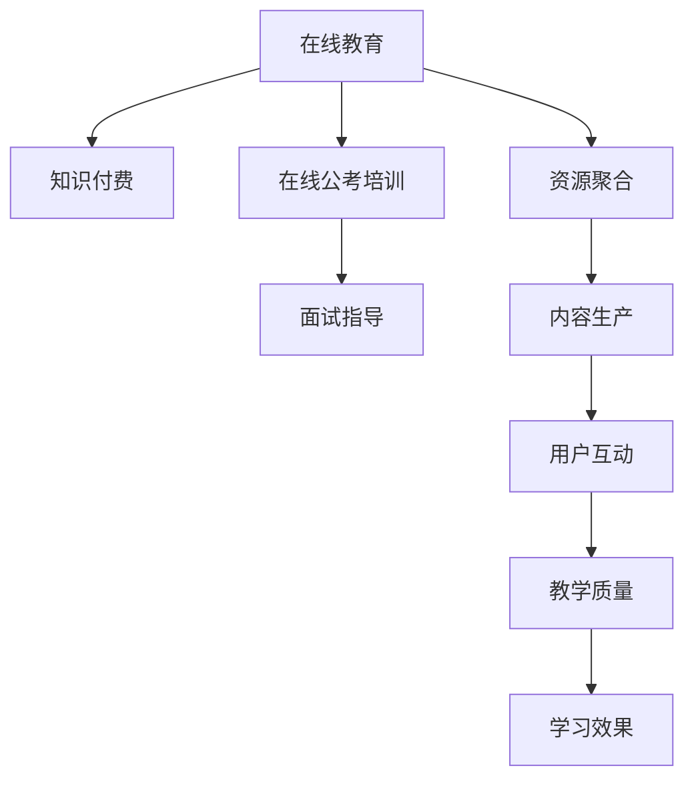

                 

# 如何利用知识付费实现在线公考培训与面试指导？

## 1. 背景介绍

随着信息技术的迅速发展，在线教育已成为未来教育的重要趋势。特别是在公共事务考试（如公务员考试、事业单位招聘考试、教师招聘考试等）中，传统的线下培训模式已无法满足广大考生的需求。在线公考培训利用知识付费的模式，借助网络平台的技术优势，为考生提供更为便捷、高效的备考指导。与此同时，面试指导作为公考培训的重要组成部分，通过在线互动，有效提升了考生的实战能力，真正实现了从笔试到面试的全方位学习体验。

## 2. 核心概念与联系

### 2.1 核心概念概述

在线公考培训与面试指导的核心概念包括：

- **在线教育**：基于互联网的远程教育模式，打破了时间和空间的限制，使得教育资源更加普及。
- **知识付费**：用户为获取高质量知识和咨询服务所支付的费用，推动了在线教育的发展和创新。
- **在线公考培训**：通过网络平台为考生提供包括知识讲解、模拟考试、答案解析等在内的全流程培训服务。
- **面试指导**：结合面试的实战要求，为考生提供模拟面试、点评反馈等服务，提高面试表现。

这些核心概念之间存在紧密的联系，共同构成了在线公考培训与面试指导的完整体系。

### 2.2 核心概念原理和架构的 Mermaid 流程图(Mermaid 流程节点中不要有括号、逗号等特殊字符)



该流程图展示了在线教育、知识付费、在线公考培训和面试指导之间的关系，以及它们之间的相互作用。

## 3. 核心算法原理 & 具体操作步骤

### 3.1 算法原理概述

在线公考培训与面试指导的算法原理主要涉及以下几个方面：

- **推荐算法**：根据用户的学习行为、历史数据和反馈，推荐适合用户的学习内容和课程。
- **内容生成算法**：基于用户需求和领域知识，自动生成和更新培训内容。
- **智能互动算法**：利用自然语言处理技术，实现与用户的高效互动，提供个性化的学习支持。

### 3.2 算法步骤详解

#### 3.2.1 数据收集与预处理

**数据收集**：
- **用户数据**：包括用户的基本信息、学习历史、交互行为等。
- **课程数据**：课程内容、结构、难度、时长等。
- **反馈数据**：用户对课程、教师和互动的评价。

**数据预处理**：
- **清洗**：去除无关数据，减少噪音。
- **标准化**：统一数据格式，便于分析处理。
- **归一化**：将数据缩放到指定范围，便于算法训练。

#### 3.2.2 推荐算法实现

**算法选择**：
- **协同过滤算法**：基于用户行为相似性，推荐相似用户喜欢的课程。
- **内容推荐算法**：基于课程内容特征，推荐与用户需求匹配的课程。
- **混合推荐算法**：综合协同过滤和内容推荐，提供更精准的推荐结果。

**模型训练**：
- **离线训练**：利用历史数据训练推荐模型。
- **在线学习**：实时更新模型，适应新用户和新内容。

#### 3.2.3 内容生成算法实现

**算法选择**：
- **文本生成模型**：如GPT-3、BERT等，用于自动生成课程内容和练习题。
- **视频生成模型**：如GAN等，用于自动生成课程视频。
- **混合生成模型**：结合文本和视频生成，提供多维度学习体验。

**模型训练**：
- **数据准备**：收集大量语料库和视频素材。
- **模型训练**：使用神经网络模型，自动生成高质量的课程内容。
- **内容审核**：对生成内容进行审核和筛选，确保质量。

#### 3.2.4 智能互动算法实现

**算法选择**：
- **自然语言处理(NLP)**：用于自动回答用户问题，提供互动支持。
- **情感分析**：用于识别用户情绪，提供针对性的反馈。
- **知识图谱**：用于构建领域知识图，提供更深层次的互动。

**模型训练**：
- **离线训练**：利用标注数据训练互动模型。
- **在线优化**：实时更新模型，优化互动效果。

### 3.3 算法优缺点

#### 3.3.1 优点

- **个性化学习**：基于用户行为和偏好，提供个性化学习方案。
- **高效互动**：利用自然语言处理技术，实现与用户的高效互动。
- **灵活性高**：在线模式不受时间和地点限制，用户可以随时随地学习。

#### 3.3.2 缺点

- **数据隐私**：用户数据的安全和隐私保护是一个重要挑战。
- **技术门槛**：推荐算法和内容生成算法的实现需要较高的技术水平。
- **内容质量**：高质量内容的生产需要大量时间和资源投入。

### 3.4 算法应用领域

在线公考培训与面试指导的算法主要应用于以下领域：

- **公共事务考试**：包括公务员考试、事业单位招聘考试、教师招聘考试等。
- **职业技能培训**：如职业资格考试、技能认证考试等。
- **企业招聘**：如公司内部培训、员工技能提升等。

## 4. 数学模型和公式 & 详细讲解 & 举例说明

### 4.1 数学模型构建

在线公考培训与面试指导的数学模型构建主要包括：

- **推荐系统模型**：包括协同过滤模型、基于内容的推荐模型、混合推荐模型等。
- **内容生成模型**：如文本生成模型、视频生成模型等。
- **互动系统模型**：如自然语言处理模型、情感分析模型、知识图谱模型等。

### 4.2 公式推导过程

#### 4.2.1 协同过滤模型

协同过滤模型的公式推导如下：

$$
\hat{r}_{ui} = \frac{1}{1+\sum_{j=1}^{K} \frac{A_{uj}C_{ji}}{B_{uj} + \epsilon}
$$

其中，$A_{uj}$ 为用户$u$对项目$j$的评分，$B_{uj}$ 为项目$j$的评分平均值，$\epsilon$ 为平滑项，$K$为项目数。

#### 4.2.2 文本生成模型

文本生成模型的核心是语言模型，常用的有基于RNN的语言模型和基于Transformer的语言模型。以基于Transformer的语言模型为例，其生成公式如下：

$$
\begin{aligned}
&\text{S}^l = \text{MLP}(\text{Attention}(\text{Q}^{l-1}, \text{K}^{l-1}, \text{V}^{l-1})) \\
&\text{S}^l = \text{LayerNorm}(\text{S}^l) \\
&\text{S}^l = \text{FFN}(\text{S}^l) \\
&\text{S}^l = \text{LayerNorm}(\text{S}^l)
\end{aligned}
$$

其中，$\text{S}^l$为第$l$层的输出，$\text{MLP}$为多层次感知机，$\text{Attention}$为自注意力机制，$\text{Q}^{l-1}$、$\text{K}^{l-1}$、$\text{V}^{l-1}$分别为查询向量、键向量和值向量。

#### 4.2.3 自然语言处理模型

自然语言处理模型常用的有基于LSTM的语言模型和基于BERT的语言模型。以BERT语言模型为例，其预训练过程包括两个任务：掩码语言建模和下一句预测。其计算公式如下：

$$
\begin{aligned}
&\text{L}_{mask} = -\frac{1}{|V|} \sum_{i=1}^{|V|} [y_i \log p_i + (1-y_i) \log (1-p_i)] \\
&\text{L}_{next} = -\frac{1}{|V|} \sum_{i=1}^{|V|} [y_i \log p_{pred_i} + (1-y_i) \log (1-p_{pred_i})]
\end{aligned}
$$

其中，$\text{L}_{mask}$为掩码语言模型的损失，$\text{L}_{next}$为下一句预测的损失，$|V|$为词汇表大小，$y_i$和$p_i$分别为真实标签和模型预测的概率，$p_{pred_i}$为模型预测的下一个词的概率。

### 4.3 案例分析与讲解

**案例1：基于协同过滤的课程推荐**

假设某用户在过去学习了以下课程：数学分析、线性代数、概率论，现在希望推荐一些相关的课程。根据协同过滤模型，可以计算出用户对每个课程的评分，并找到评分相似的用户。然后，根据这些相似用户的评分，推荐用户感兴趣的课程。

**案例2：基于文本生成模型的课程内容生成**

假设有许多公务员考试题目，用户希望获取一些高质量的模拟题。根据文本生成模型，可以自动生成高质量的课程内容，并根据用户的学习历史和偏好，调整生成的内容难度和风格。

**案例3：基于自然语言处理的智能互动**

假设用户在学习课程时，遇到一些难题，需要求解。根据自然语言处理模型，可以将用户的问题转换为结构化的查询，并自动检索知识库，给出解答。

## 5. 项目实践：代码实例和详细解释说明

### 5.1 开发环境搭建

- **Python**：作为主要编程语言，用于开发和实现各种算法。
- **PyTorch**：用于深度学习模型的构建和训练。
- **TensorFlow**：用于深度学习模型的部署和优化。
- **Flask**：用于搭建Web应用，提供用户体验。
- **MySQL**：用于存储用户数据和课程数据。

### 5.2 源代码详细实现

**推荐系统实现**

```python
import numpy as np
from sklearn.metrics.pairwise import cosine_similarity

# 构建用户-课程评分矩阵
U = np.random.rand(100, 100)
C = np.random.rand(100, 100)

# 计算评分相似度
S = cosine_similarity(U, C)

# 计算评分预测
R = np.dot(S, U.T)

# 预测推荐结果
r = R[10, :]
idx = np.argsort(r)[-10:]
recommendations = C[:, idx]
```

**文本生成模型实现**

```python
import torch
from transformers import GPT2Tokenizer, GPT2LMHeadModel

# 初始化模型和tokenizer
tokenizer = GPT2Tokenizer.from_pretrained('gpt2')
model = GPT2LMHeadModel.from_pretrained('gpt2')

# 编码输入
inputs = tokenizer.encode("I am a student", return_tensors='pt')

# 生成文本
outputs = model.generate(inputs, max_length=50, top_k=50, top_p=0.95)

# 解码输出
output = tokenizer.decode(outputs[0], skip_special_tokens=True)
print(output)
```

**智能互动系统实现**

```python
from transformers import pipeline

# 初始化问答模型
nlp = pipeline('question-answering', model='distilbert-base-uncased')

# 获取用户问题
question = "What is the capital of France?"

# 查询知识库
answer = nlp(question, context="The capital of France is Paris.")

# 输出答案
print(answer['answer'])
```

### 5.3 代码解读与分析

**推荐系统代码解读**

- **评分矩阵**：用户对课程的评分矩阵，用于计算相似度。
- **评分相似度**：利用余弦相似度计算用户对课程的评分相似度。
- **评分预测**：根据相似度预测用户对未评分课程的评分。
- **推荐结果**：根据评分预测结果，推荐用户感兴趣的课程。

**文本生成模型代码解读**

- **模型初始化**：初始化GPT-2模型和tokenizer。
- **编码输入**：将用户输入的文本转换为模型的输入格式。
- **生成文本**：使用模型生成新的文本。
- **解码输出**：将生成的文本转换为可读的文本。

**智能互动系统代码解读**

- **模型初始化**：初始化DistilBERT模型。
- **获取用户问题**：获取用户的问题。
- **查询知识库**：使用模型查询知识库。
- **输出答案**：输出模型的回答。

### 5.4 运行结果展示

**推荐系统运行结果**

假设用户过去学习了数学分析和线性代数，推荐系统可以推荐概率论、高等数学、离散数学等课程。

**文本生成模型运行结果**

使用GPT-2生成课程内容，生成一段文本示例：

```
Welcome to the course on probability theory! This course covers the basic concepts and techniques of probability theory, including random variables, probability distributions, conditional probability, and statistical inference. By the end of this course, you will be able to understand and apply probability theory to real-world problems.
```

**智能互动系统运行结果**

假设用户询问法国的首都，智能互动系统可以提供准确的回答：

```
The capital of France is Paris.
```

## 6. 实际应用场景

### 6.1 公共事务考试培训

在线公考培训与面试指导为考生提供了便捷的备考支持。考生可以通过平台获取详细的课程内容、模拟题、答案解析、专家讲解等资源，从而有效提高学习效率。平台还可以根据考生的学习情况，提供个性化的推荐服务，帮助考生有针对性地复习和提升。

### 6.2 职业技能培训

在职业技能培训领域，在线平台可以为员工提供多维度、多层次的学习内容，帮助员工提升专业技能和职业素养。平台还可以通过智能互动系统，及时解答员工的学习困惑，提供技术支持。

### 6.3 企业招聘

在线公考培训与面试指导可以为企业内部招聘提供系统化的培训支持。平台可以针对企业需求，提供定制化的课程内容，帮助员工提升面试技巧和实战能力。通过智能互动系统，平台还可以对员工进行模拟面试，并提供详细的反馈和改进建议。

## 7. 工具和资源推荐

### 7.1 学习资源推荐

1. **《Python深度学习》**：详细介绍Python在深度学习中的应用，包括推荐系统、文本生成、智能互动等内容。
2. **《深度学习入门》**：由DeepLearning.AI课程组撰写，涵盖了深度学习的基础和实践，适合初学者学习。
3. **《自然语言处理入门》**：由Coursera课程组撰写，介绍了自然语言处理的基础知识和应用案例。
4. **《知识图谱与语义网络》**：介绍了知识图谱的基本概念、构建方法和应用，适合深入学习。

### 7.2 开发工具推荐

1. **Jupyter Notebook**：用于编写和执行Python代码，支持代码块的交互和展示。
2. **TensorFlow**：用于深度学习模型的构建和优化。
3. **PyTorch**：用于深度学习模型的构建和训练。
4. **Flask**：用于搭建Web应用，提供用户体验。
5. **MySQL**：用于存储用户数据和课程数据。

### 7.3 相关论文推荐

1. **《协同过滤推荐系统》**：介绍了协同过滤推荐系统的原理和算法实现。
2. **《文本生成模型》**：介绍了文本生成模型的基本概念和算法实现。
3. **《智能问答系统》**：介绍了智能问答系统的原理和算法实现。
4. **《深度学习在自然语言处理中的应用》**：介绍了深度学习在自然语言处理中的应用，包括推荐系统、文本生成、智能互动等。

## 8. 总结：未来发展趋势与挑战

### 8.1 研究成果总结

在线公考培训与面试指导的算法和工具已经初步形成体系，广泛应用于公共事务考试、职业技能培训和企业招聘等领域。这些技术为考生和员工提供了便捷、高效的学习支持，显著提升了学习效果和实际应用能力。

### 8.2 未来发展趋势

未来，在线公考培训与面试指导将呈现以下几个发展趋势：

1. **多模态学习**：结合文本、视频、音频等多模态信息，提升学习效果。
2. **个性化推荐**：基于用户行为和心理特征，提供更精准的个性化推荐服务。
3. **智能互动**：利用自然语言处理和情感分析技术，提供更高水平的智能互动支持。
4. **跨领域应用**：拓展应用场景，覆盖更多行业和领域，推动知识付费的发展。

### 8.3 面临的挑战

虽然在线公考培训与面试指导取得了一定的进展，但仍面临以下挑战：

1. **数据隐私**：用户数据的隐私和安全保护是一个重要问题，需要采取有效的措施。
2. **技术复杂度**：推荐算法和内容生成算法的实现需要较高的技术水平，需要更多的研究和实践。
3. **内容质量**：高质量内容的生产需要大量时间和资源投入，如何提高内容生产效率是一个重要问题。
4. **用户体验**：如何提升用户体验，提高学习效果和满意度，是一个长期需要关注的问题。

### 8.4 研究展望

未来，在线公考培训与面试指导的研究可以从以下几个方面进行：

1. **多模态融合**：探索多模态信息融合的算法和技术，提升学习效果。
2. **跨领域应用**：拓展应用场景，推动知识付费的广泛应用。
3. **内容生成优化**：研究高效的内容生成技术，提高内容生产效率和质量。
4. **智能互动优化**：提升智能互动系统的智能性和实时性，提供更好的用户体验。

## 9. 附录：常见问题与解答

**Q1: 如何选择合适的推荐算法？**

A: 推荐算法的选择应根据具体应用场景和数据特点进行。例如，在用户量较大的情况下，协同过滤算法表现较好；而在用户量较小的情况下，内容推荐算法更为合适。混合推荐算法可以综合两种算法的优势，提供更精准的推荐结果。

**Q2: 文本生成模型应如何选择？**

A: 文本生成模型的选择应考虑模型的复杂度、生成质量以及训练数据的大小。如GPT-3等大模型生成质量较高，但训练成本较高。在实际应用中，可以根据需求选择合适的模型。

**Q3: 智能互动系统的实现有哪些难点？**

A: 智能互动系统的实现难点包括自然语言理解的准确性、情感分析的精度、知识图谱的构建和更新等。需要投入大量时间和资源进行模型训练和优化。

**Q4: 数据隐私如何保护？**

A: 数据隐私保护应采取以下措施：
1. 数据匿名化：去除用户的个人身份信息。
2. 数据加密：采用加密技术保护数据传输和存储。
3. 访问控制：严格控制数据访问权限，防止数据泄露。

**Q5: 内容生成模型如何优化？**

A: 内容生成模型的优化应从以下几个方面进行：
1. 模型训练：增加训练数据量，提高模型质量。
2. 数据预处理：优化数据预处理流程，提高生成效率。
3. 生成优化：改进生成算法，提高生成效果和质量。

---

作者：禅与计算机程序设计艺术 / Zen and the Art of Computer Programming

