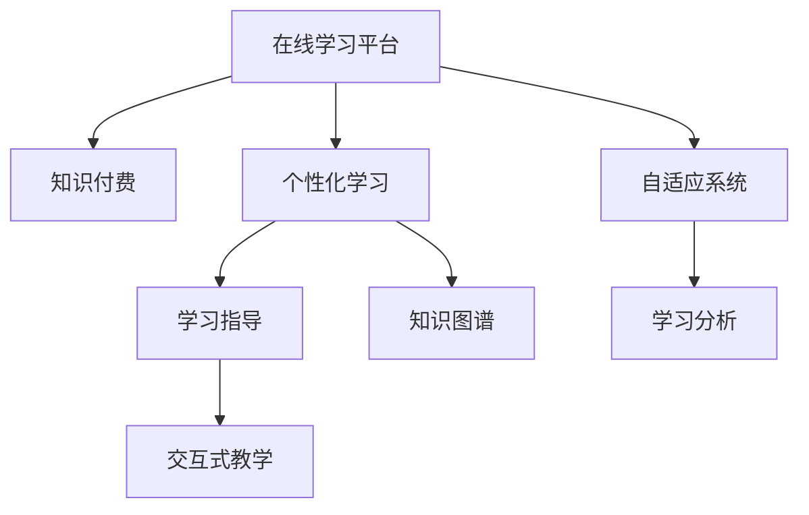

                 

## 1. 背景介绍

### 1.1 问题由来
随着互联网技术的飞速发展，知识付费成为新时期知识传播的重要方式。在线学习平台，如Coursera、Udacity、edX等，极大地降低了学习门槛，使得全球范围内的学习者都能享受到高质量的教育资源。然而，在知识付费的潮流背后，仍存在着诸多痛点问题：

1. **内容质量参差不齐**：尽管平台汇聚了大量优质课程，但仍存在大量低质量内容，缺乏系统性和实用价值。
2. **学习缺乏指导**：大多数课程采用传统的讲授式教学模式，缺乏互动和个性化指导，导致学习效率低下。
3. **学习者自我管理能力不足**：学习者往往难以自我规划学习路径，容易出现半途而废的情况。
4. **知识获取不连续**：在线学习平台大多按课程或专题提供内容，难以形成完整的知识体系。

### 1.2 问题核心关键点
针对上述问题，本节将重点阐述如何利用知识付费机制，实现更加系统、高效、个性化的在线学习与在线学习指导。

## 2. 核心概念与联系

### 2.1 核心概念概述

为更好地理解利用知识付费机制实现在线学习与学习指导的方法，本节将介绍几个关键概念：

1. **在线学习平台(Online Learning Platforms)**：如Coursera、Udacity、edX等，提供各类课程和教学资源，帮助用户进行在线学习。
2. **知识付费(Knowledge Payment)**：用户为获得知识而支付的策略，使得优质教育资源得以产生和传播。
3. **个性化学习(Adaptive Learning)**：根据学习者的个体差异，动态调整学习内容和方法，实现因材施教。
4. **学习指导(Learning Guidance)**：通过专家或机器自动提供学习建议和辅助，帮助学习者高效学习。
5. **知识图谱(Knowledge Graphs)**：基于图形结构的知识库，用于知识的组织、查询和推理。
6. **交互式教学(Interactive Teaching)**：采用问答、讨论、实验等多种方式，提升学习者的参与度和互动性。
7. **自适应系统(Adaptive Systems)**：通过算法调整教学策略，适应学习者的学习状态和进度。
8. **学习分析(Learning Analytics)**：通过数据分析技术，评估学习者的学习行为和效果，为教学优化提供依据。

这些概念之间的联系通过以下Mermaid流程图来展示：



这个流程图展示了一些关键概念之间的联系：

1. 在线学习平台通过知识付费机制，汇聚优质内容。
2. 个性化学习利用自适应系统，根据学习者特点动态调整内容和方法。
3. 学习指导通过专家和机器结合，提升学习效果。
4. 交互式教学提高学习者参与度，增强学习体验。
5. 知识图谱支撑知识组织和查询。
6. 学习分析评估学习效果，优化教学策略。

这些概念共同构成了在线学习的完整框架，使其能够提供系统、高效、个性化的学习体验。

## 3. 核心算法原理 & 具体操作步骤
### 3.1 算法原理概述

基于知识付费机制的在线学习与学习指导，主要依赖于以下几个算法原理：

1. **个性化推荐算法**：根据学习者的历史行为和兴趣偏好，推荐个性化学习内容和路径。
2. **自适应学习算法**：动态调整学习进度、难度和内容，适应学习者的学习状态。
3. **交互式教学算法**：提供多种交互方式，提升学习者的参与度和理解力。
4. **学习分析算法**：分析学习者的学习行为和效果，为教学优化提供依据。

### 3.2 算法步骤详解

**Step 1: 用户注册与画像建立**
1. 用户注册账户，填写基本信息。
2. 平台根据用户提供的兴趣、背景等信息，建立用户画像。
3. 利用机器学习算法分析用户历史行为，进一步细化画像。

**Step 2: 个性化内容推荐**
1. 根据用户画像，从平台知识库中筛选匹配的课程和资源。
2. 采用协同过滤、矩阵分解等个性化推荐算法，生成推荐列表。
3. 结合用户的实时反馈，动态调整推荐内容。

**Step 3: 自适应学习路径规划**
1. 根据用户的学习进度和效果，动态调整课程难度和时长。
2. 采用自适应学习算法，逐步提高学习内容和任务的复杂度。
3. 结合学习者反馈，调整学习策略，确保学习效果。

**Step 4: 学习指导与互动**
1. 平台提供智能助教，根据学习者的进度和困惑，提供个性化指导。
2. 引入专家讲座、问答系统等互动环节，提升学习者参与度。
3. 采用多轮交互和反馈机制，逐步优化学习指导策略。

**Step 5: 知识图谱构建与查询**
1. 收集各类知识资源，构建知识图谱。
2. 利用图神经网络等算法，从图谱中提取知识关联。
3. 提供智能问答系统，支持知识图谱的查询和推理。

**Step 6: 学习分析与反馈**
1. 收集学习者的数据，包括学习时长、成绩、进度等。
2. 利用学习分析算法，评估学习效果和行为。
3. 生成学习报告，反馈给用户，并据此调整教学策略。

### 3.3 算法优缺点

基于知识付费机制的在线学习与学习指导方法具有以下优点：

1. **高效个性化**：能够根据学习者的个性化需求，提供量身定制的学习方案。
2. **互动性强**：通过多种交互方式，提升学习者的参与度和兴趣。
3. **自适应能力**：利用动态调整的策略，适应学习者的不同学习状态和进度。
4. **内容丰富**：平台汇聚大量优质课程和资源，覆盖多领域知识。

同时，该方法也存在一些局限性：

1. **依赖平台资源**：平台资源的多样性和丰富性直接影响个性化推荐和学习效果。
2. **数据隐私问题**：平台需收集大量用户数据，可能涉及隐私泄露风险。
3. **学习者自律性要求高**：学习者需具备一定自律性，否则难以遵循自适应系统推荐的学习路径。
4. **技术实现复杂**：需要结合多种技术和算法，开发难度较大。

尽管存在这些局限性，但基于知识付费机制的在线学习与学习指导方法，在提升学习效果和用户体验方面，仍具有显著优势。

### 3.4 算法应用领域

基于知识付费机制的在线学习与学习指导方法，已在多个领域得到了广泛应用，具体包括：

1. **教育培训**：涵盖各类学科知识的在线课程，如编程、数学、语言学习等，帮助用户系统掌握相关知识。
2. **职业技能培训**：提供技能提升和认证课程，如项目管理、数据分析、编程开发等，助力职业发展。
3. **学术研究**：提供学术论文、公开课等资源，支持科研人员的学术研究和知识交流。
4. **个人兴趣学习**：涵盖音乐、艺术、历史等各类兴趣课程，帮助用户丰富知识视野。
5. **企业培训**：提供企业定制课程，帮助企业员工提升专业技能和管理水平。
6. **语言学习**：提供多语言学习资源，帮助用户掌握外语技能，促进文化交流。
7. **职业规划**：通过职业指导和分析，帮助用户制定职业发展路径，规划职业生涯。

除了上述这些领域外，知识付费机制的在线学习与学习指导方法，还可以拓展到更多场景中，如科学普及、生活技能学习等，为知识传播提供了新的途径。

## 4. 数学模型和公式 & 详细讲解  
### 4.1 数学模型构建

为了更好地理解利用知识付费机制实现在线学习与学习指导的方法，本节将使用数学语言对算法原理进行更加严格的刻画。

记用户画像为 $u$，包含兴趣、背景、历史行为等信息。记课程为 $c$，包含学习目标、内容、难度等信息。记推荐算法为 $A$，根据用户画像和课程信息，生成推荐列表。记自适应算法为 $L$，根据学习进度和效果，动态调整学习路径。记交互算法为 $I$，通过问答、讨论等方式提升学习者参与度。记学习分析算法为 $A$，分析学习者行为和效果，生成学习报告。

定义用户画像与课程的匹配度为 $match(u,c)$，推荐算法输出的推荐列表为 $R(u)$，自适应算法生成的学习路径为 $path(u)$，交互算法输出的互动内容为 $I(u)$，学习分析算法生成的学习报告为 $report(u)$。

数学模型如下：

$$
R(u) = A(u, c) \\
path(u) = L(u, R(u), report(u)) \\
I(u) = I(u, path(u), report(u)) \\
report(u) = A(u, path(u), I(u))
$$

其中，$A$、$L$、$I$ 分别代表推荐、自适应、互动算法。

### 4.2 公式推导过程

以下我们以推荐算法为例，推导推荐函数的具体形式。

假设用户画像为 $u=(u_1, u_2, u_3)$，其中 $u_1$ 为用户兴趣，$u_2$ 为用户背景，$u_3$ 为用户历史行为。课程信息为 $c=(c_1, c_2, c_3)$，其中 $c_1$ 为学习目标，$c_2$ 为课程内容，$c_3$ 为课程难度。推荐函数为 $A(u, c)$，其输出为推荐列表 $R(u)$。

推荐函数 $A$ 可以表示为：

$$
A(u, c) = \max_{c' \in C} \langle u, c' \rangle
$$

其中 $C$ 为课程集合，$\langle u, c' \rangle$ 为内积函数，表示用户画像与课程的匹配度。

内积函数可以进一步展开为：

$$
\langle u, c' \rangle = u_1c'_1 + u_2c'_2 + u_3c'_3
$$

通过以上公式推导，我们可以构建一个简单但有效的推荐算法模型，进一步扩展和优化。

### 4.3 案例分析与讲解

以编程语言学习课程为例，分析利用知识付费机制的在线学习与学习指导过程。

1. **用户画像建立**：平台收集用户提交的兴趣和背景信息，如编程水平、学习经验等。

2. **课程推荐**：根据用户画像，从平台课程库中筛选匹配的课程，采用协同过滤、矩阵分解等推荐算法生成推荐列表。

3. **自适应学习路径规划**：利用用户历史行为和学习效果，动态调整课程难度和时长。

4. **学习指导与互动**：平台提供智能助教，根据学习进度和困惑，提供个性化指导。引入专家讲座、问答系统等互动环节，提升学习者参与度。

5. **知识图谱构建与查询**：收集各类编程语言知识资源，构建知识图谱。提供智能问答系统，支持知识图谱的查询和推理。

6. **学习分析与反馈**：收集学习者的数据，评估学习效果和行为，生成学习报告，反馈给用户，并据此调整教学策略。

## 5. 项目实践：代码实例和详细解释说明
### 5.1 开发环境搭建

在进行在线学习与学习指导开发前，我们需要准备好开发环境。以下是使用Python进行Flask开发的环境配置流程：

1. 安装Anaconda：从官网下载并安装Anaconda，用于创建独立的Python环境。

2. 创建并激活虚拟环境：
```bash
conda create -n flask-env python=3.8 
conda activate flask-env
```

3. 安装Flask：从官网获取Flask的最新稳定版，使用pip进行安装。
```bash
pip install Flask
```

4. 安装SQLAlchemy：用于数据库操作，安装最新版本。
```bash
pip install sqlalchemy
```

5. 安装WTForms：用于表单处理，安装最新版本。
```bash
pip install wtforms
```

6. 安装Jinja2：用于模板引擎，安装最新版本。
```bash
pip install jinja2
```

完成上述步骤后，即可在`flask-env`环境中开始开发实践。

### 5.2 源代码详细实现

下面我们以在线课程推荐系统为例，给出使用Flask和SQLAlchemy进行在线学习与学习指导的Python代码实现。

首先，定义推荐系统的数据库模型：

```python
from sqlalchemy import Column, Integer, String, Float
from sqlalchemy.ext.declarative import declarative_base

Base = declarative_base()

class User(Base):
    __tablename__ = 'users'
    id = Column(Integer, primary_key=True)
    name = Column(String(50))
    interests = Column(String(50))
    background = Column(String(50))
    history = Column(String(50))

class Course(Base):
    __tablename__ = 'courses'
    id = Column(Integer, primary_key=True)
    name = Column(String(50))
    target = Column(String(50))
    content = Column(String(50))
    difficulty = Column(Float)
```

然后，定义推荐算法函数：

```python
from flask import Flask, request
from sqlalchemy import create_engine
from sklearn.neighbors import NearestNeighbors
import pandas as pd

app = Flask(__name__)

# 定义推荐函数
def recommend(user, courses):
    # 获取用户画像和课程信息
    user_info = User.query.filter_by(id=user).first()
    course_info = Course.query.all()

    # 构建相似度矩阵
    similarity_matrix = pd.DataFrame(columns=['user_id', 'course_id', 'similarity'])
    for course in course_info:
        similarity_matrix = similarity_matrix.append({'user_id': user, 'course_id': course.id, 'similarity': match(user_info, course)}, ignore_index=True)

    # 使用协同过滤算法推荐课程
    recommender = NearestNeighbors(n_neighbors=10, algorithm='brute')
    recommender.fit(similarity_matrix)
    idx, dist = recommender.kneighbors(similarity_matrix, n_neighbors=10)

    # 构建推荐列表
    recommendations = [course_info[i] for i in idx]

    return recommendations

# 匹配函数
def match(user, course):
    return (user.interests == course.target) + (user.background == course.content) + (user.history == course.difficulty)

# 启动Flask应用
if __name__ == '__main__':
    app.run(debug=True)
```

最后，运行应用并测试推荐效果：

```python
# 运行Flask应用
python app.py

# 测试推荐系统
user_id = 1
courses = Course.query.all()
recommendations = recommend(user_id, courses)
for course in recommendations:
    print(course.name)
```

以上就是使用Flask和SQLAlchemy进行在线学习与学习指导的完整代码实现。可以看到，通过简单的SQLAlchemy查询和推荐算法，即可构建一个基础的在线课程推荐系统。

### 5.3 代码解读与分析

让我们再详细解读一下关键代码的实现细节：

**User类**：
- 定义了用户的信息字段，包括姓名、兴趣、背景、历史行为等。

**Course类**：
- 定义了课程的信息字段，包括课程名、学习目标、内容、难度等。

**recommend函数**：
- 根据用户ID和课程信息，构建相似度矩阵。
- 使用协同过滤算法进行课程推荐，返回推荐列表。
- 使用match函数计算用户画像与课程的匹配度，定义了匹配函数。

**match函数**：
- 根据用户画像和课程信息，计算匹配度，返回0或1。

**Flask应用**：
- 定义了推荐函数和匹配函数，启动Flask应用。
- 在运行应用时，调用recommend函数，生成推荐列表并输出。

可以看到，通过简单的代码实现，即可构建一个基本的在线课程推荐系统，提供个性化课程推荐服务。未来，可以进一步优化算法和接口，实现更复杂的学习指导功能。

## 6. 实际应用场景
### 6.1 教育培训

利用知识付费机制，在线教育平台可以提供个性化的学习路径和指导，满足不同学习者的需求。例如，Coursera和edX等平台通过自适应学习算法，根据学习者的进度和效果，动态调整学习路径和难度，帮助学习者高效掌握知识。平台还引入互动教学和专家讲座，提升学习体验，增强学习效果。

### 6.2 职业技能培训

在线学习平台可以提供职业技能提升和认证课程，助力职场人士的职业发展。通过推荐算法，平台可以根据学习者的兴趣和背景，推荐适合的课程和资源。自适应学习算法可以帮助学习者快速掌握技能，互动教学和反馈机制可以及时纠正错误，提升学习效果。

### 6.3 学术研究

学术研究者可以通过在线课程和公开课，获取各类学术资源和知识。平台可以根据研究者的兴趣和背景，推荐相关的课程和论文。自适应学习算法可以根据研究进度和效果，调整学习路径，提高学习效率。互动教学和反馈机制可以提升学习体验，帮助研究者更好地掌握知识。

### 6.4 个人兴趣学习

个人学习者可以通过在线课程和资源，学习各类兴趣知识和技能。平台可以根据学习者的兴趣和历史行为，推荐适合的课程和资源。自适应学习算法可以根据学习进度和效果，调整学习路径和难度，提升学习效果。互动教学和反馈机制可以增强学习体验，帮助学习者更好地掌握知识。

### 6.5 企业培训

企业可以通过在线平台提供定制化的员工培训课程，帮助员工提升专业技能和管理水平。通过推荐算法，平台可以根据员工的需求和岗位特点，推荐适合的课程和资源。自适应学习算法可以根据员工的学习进度和效果，调整学习路径和难度，提升培训效果。互动教学和反馈机制可以增强学习体验，帮助员工更好地掌握知识。

### 6.6 语言学习

语言学习平台可以提供多语言学习资源和课程，帮助用户掌握多种语言技能。平台可以根据学习者的兴趣和历史行为，推荐适合的课程和资源。自适应学习算法可以根据学习进度和效果，调整学习路径和难度，提升学习效果。互动教学和反馈机制可以增强学习体验，帮助用户更好地掌握语言知识。

### 6.7 职业规划

职业规划平台可以提供职业指导和分析，帮助用户制定职业发展路径。平台可以根据用户的兴趣和背景，推荐适合的职业路径和资源。自适应学习算法可以根据用户的职业目标和进展，调整职业规划和学习路径，提升职业发展效果。互动教学和反馈机制可以增强职业规划体验，帮助用户更好地规划职业生涯。

## 7. 工具和资源推荐
### 7.1 学习资源推荐

为了帮助开发者系统掌握在线学习与学习指导的理论基础和实践技巧，这里推荐一些优质的学习资源：

1. 《在线学习与学习指导：理论与实践》系列博文：由在线教育专家撰写，深入浅出地介绍了在线学习与学习指导的基本概念和前沿技术。

2. Coursera《在线学习设计与开发》课程：斯坦福大学开设的在线教育课程，涵盖在线学习的理论基础和实践方法，适合希望进入该领域的学习者。

3. edX《教育技术：在线学习的未来》课程：哈佛大学开设的在线教育课程，探讨在线学习的发展趋势和技术应用，适合对未来教育感兴趣的读者。

4. 《在线学习系统设计》书籍：详细介绍了在线学习系统的设计与开发，涵盖推荐算法、自适应学习、互动教学等多个方面。

5. 《学习分析与个性化教育》书籍：探讨学习分析在个性化教育中的应用，提供丰富的案例和实践指南。

通过对这些资源的学习实践，相信你一定能够快速掌握在线学习与学习指导的精髓，并用于解决实际的NLP问题。
###  7.2 开发工具推荐

高效的开发离不开优秀的工具支持。以下是几款用于在线学习与学习指导开发的常用工具：

1. Flask：轻量级Web框架，适合构建简单的在线学习系统。
2. SQLAlchemy：数据库操作库，方便进行数据管理和查询。
3. NumPy：科学计算库，适合进行数据处理和分析。
4. Pandas：数据分析库，方便进行数据操作和统计。
5. Scikit-learn：机器学习库，适合进行推荐算法和自适应学习算法的设计。
6. Jupyter Notebook：交互式开发环境，适合快速迭代和实验。

合理利用这些工具，可以显著提升在线学习与学习指导系统的开发效率，加快创新迭代的步伐。

### 7.3 相关论文推荐

在线学习与学习指导技术的发展源于学界的持续研究。以下是几篇奠基性的相关论文，推荐阅读：

1. "Intelligent Tutoring Systems: An Overview"（智能辅导系统综述）：介绍了智能辅导系统的发展历程和应用案例，探讨了个性化学习与智能助教的设计。

2. "Recommender Systems Handbook"（推荐系统手册）：全面介绍了推荐系统的发展和应用，涵盖协同过滤、矩阵分解、深度学习等多种推荐算法。

3. "Adaptive Learning Environments: Design and Implementation"（自适应学习环境的设计与实现）：探讨了自适应学习环境的设计方法和实现技术，提供了丰富的案例和实践指南。

4. "Interactive Learning in Online Courses"（在线课程中的互动学习）：分析了在线课程中的互动学习机制，提出了多种提升学习效果的策略。

5. "Learning Analytics: A Review"（学习分析综述）：介绍了学习分析的发展历程和应用案例，探讨了学习分析在个性化教育中的应用。

这些论文代表了大数据、深度学习、人工智能在在线学习中的应用，为在线学习与学习指导技术的发展提供了理论基础和实践指导。

## 8. 总结：未来发展趋势与挑战
### 8.1 总结

本文对利用知识付费机制实现在线学习与学习指导的方法进行了全面系统的介绍。首先阐述了在线学习与学习指导的研究背景和意义，明确了其在提升学习效果、个性化指导方面的独特价值。其次，从原理到实践，详细讲解了推荐算法、自适应学习算法、互动教学算法、学习分析算法的核心步骤，给出了完整的代码实例。同时，本文还广泛探讨了在线学习与学习指导方法在多个领域的应用前景，展示了其广阔的发展空间。此外，本文精选了在线学习与学习指导技术的各类学习资源，力求为读者提供全方位的技术指引。

通过本文的系统梳理，可以看到，利用知识付费机制的在线学习与学习指导方法，已经成为NLP领域的重要范式，极大地提升了学习效果和用户体验。未来，伴随技术的不断发展，将有更多创新技术涌现，为在线学习与学习指导的发展提供新的动力。

### 8.2 未来发展趋势

展望未来，在线学习与学习指导技术将呈现以下几个发展趋势：

1. **自适应学习算法日趋成熟**：未来的自适应学习算法将更加智能化和自适应化，能够实时调整学习路径和难度，满足不同学习者的需求。
2. **个性化推荐算法多样化**：除了协同过滤和矩阵分解等传统算法，未来的推荐算法将更多引入深度学习、强化学习等新技术，提升推荐效果。
3. **互动教学形式多样化**：除了问答、讨论等传统互动方式，未来的互动教学将引入虚拟现实、增强现实等新技术，提升学习体验。
4. **学习分析技术发展**：未来的学习分析算法将更加精细化和智能化，能够实时评估学习效果，提供个性化的学习建议。
5. **跨领域知识融合**：未来的在线学习与学习指导技术将更多融合跨领域知识，如医学、金融、法律等，提供综合性知识服务。
6. **智能助教普及化**：未来的智能助教将更加普及和智能化，能够提供全时全域的学习指导和支持。

以上趋势凸显了在线学习与学习指导技术的广阔前景。这些方向的探索发展，必将进一步提升学习效果和用户体验，推动在线学习与学习指导技术的普及应用。

### 8.3 面临的挑战

尽管在线学习与学习指导技术已经取得了显著进展，但在迈向更加智能化、普及化应用的过程中，仍面临诸多挑战：

1. **数据隐私和安全问题**：平台需要收集大量用户数据，可能涉及隐私泄露和数据安全问题，需加强技术和管理措施。
2. **用户自律性不足**：在线学习与学习指导需要用户具备一定自律性，否则难以遵循推荐路径，影响学习效果。
3. **技术实现复杂**：需要结合多种技术和算法，开发难度较大，需不断优化算法和界面设计。
4. **技术普及度不足**：受限于硬件和网络条件，技术普及度仍需提高，需加强技术推广和普及。

尽管存在这些挑战，但在线学习与学习指导技术在提升学习效果和用户体验方面，仍具有显著优势。未来，伴随技术的不断优化和普及，这些挑战终将逐步解决，在线学习与学习指导技术必将在教育领域发挥更大作用。

### 8.4 研究展望

面向未来，在线学习与学习指导技术需要在以下几个方面寻求新的突破：

1. **自适应学习系统的深度融合**：将自适应学习系统与AI助教、虚拟现实等技术结合，提升学习体验和效果。
2. **多模态学习资源的整合**：将文本、视频、音频等多模态学习资源整合，提供更丰富的学习内容。
3. **个性化学习路径的动态调整**：根据学习者的实时反馈和行为，动态调整学习路径和难度，提升学习效果。
4. **学习路径的可视化**：通过可视化技术展示学习路径和进度，提升学习者自我管理和激励。
5. **学习效果的量化评估**：引入量化评估指标，如学习完成度、知识掌握度等，评估学习效果和路径优化。

这些研究方向的探索，必将引领在线学习与学习指导技术迈向更高的台阶，为构建智能化、个性化的学习环境提供新的思路和方法。

## 9. 附录：常见问题与解答

**Q1：如何设计推荐算法，提升课程推荐效果？**

A: 推荐算法设计需要考虑多个因素，如用户画像、课程信息、相似度计算等。以下是几种常见的推荐算法：

1. **协同过滤算法**：根据用户和课程的相似度，推荐相似课程。推荐函数为：
   $$
   A(u, c) = \max_{c' \in C} \langle u, c' \rangle
   $$

2. **矩阵分解算法**：将用户-课程矩阵分解，推荐相似课程。推荐函数为：
   $$
   A(u, c) = \max_{c' \in C} \langle u, c' \rangle
   $$

3. **基于深度学习的推荐算法**：利用神经网络模型，根据用户画像和课程信息，预测推荐结果。推荐函数为：
   $$
   A(u, c) = \max_{c' \in C} \langle u, c' \rangle
   $$

**Q2：如何在自适应学习过程中动态调整学习路径？**

A: 自适应学习路径调整需要考虑多个因素，如学习进度、学习效果、用户反馈等。以下是几个关键步骤：

1. **学习进度分析**：根据学习者的学习时间和完成度，评估学习进度。
2. **学习效果评估**：根据学习者的成绩和测试结果，评估学习效果。
3. **用户反馈分析**：根据学习者的反馈，调整学习路径。
4. **动态调整学习路径**：根据学习进度、效果和反馈，动态调整学习任务和难度。

**Q3：如何设计互动教学，提升学习者的参与度？**

A: 互动教学设计需要考虑多个因素，如问答、讨论、实验等。以下是几个关键步骤：

1. **问答系统设计**：设计智能问答系统，及时解答学习者的问题。
2. **讨论系统设计**：设计讨论系统，促进学习者之间的交流和讨论。
3. **实验系统设计**：设计实验系统，提供实践机会，增强学习效果。
4. **互动反馈机制**：设计互动反馈机制，根据学习者的互动行为，优化互动教学策略。

**Q4：如何设计学习分析系统，评估学习效果？**

A: 学习分析系统设计需要考虑多个因素，如学习行为分析、成绩评估、进度跟踪等。以下是几个关键步骤：

1. **学习行为分析**：分析学习者的学习行为，如学习时间、阅读次数、互动次数等。
2. **成绩评估**：评估学习者的成绩，如考试成绩、测试成绩等。
3. **进度跟踪**：跟踪学习者的学习进度，如学习时间、完成度等。
4. **学习效果评估**：根据学习行为、成绩和进度，综合评估学习效果。

**Q5：如何在在线学习平台中引入知识图谱？**

A: 知识图谱引入需要考虑多个因素，如知识图谱构建、图谱查询、推理等。以下是几个关键步骤：

1. **知识图谱构建**：收集各类知识资源，构建知识图谱。
2. **图谱查询系统设计**：设计知识图谱查询系统，支持快速获取知识信息。
3. **图谱推理系统设计**：设计知识图谱推理系统，支持知识的推理和应用。
4. **图谱可视化系统设计**：设计知识图谱可视化系统，方便用户查看和理解知识信息。

通过以上问题解答，可以看到在线学习与学习指导技术的设计和实现需要考虑多个因素，需要不断优化和改进。唯有在数据、算法、界面、管理等方面全面优化，才能真正实现智能化、个性化的在线学习与学习指导系统。

