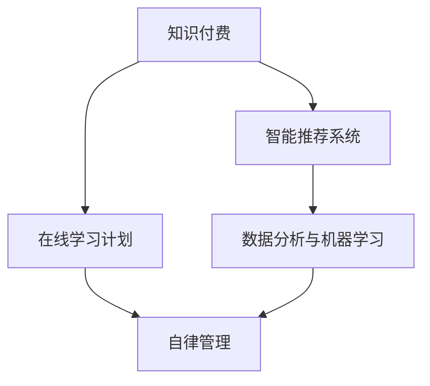

                 

# 如何利用知识付费实现在线学习计划与自律管理？

> 关键词：知识付费,在线学习计划,自律管理,智能推荐系统,数据科学

## 1. 背景介绍

### 1.1 问题由来

随着互联网技术的飞速发展，知识付费已经成为了一种新的教育消费形式。用户愿意为高质量的学习内容和个性化推荐付费，但如何保持学习计划的有效性，并实现自律管理，成为了在线学习平台面临的重要问题。

传统的在线学习平台往往采用单一的推文、视频等形式，缺乏个性化的学习路径和科学的自律管理机制，导致用户学习效率低下、学习体验差。近年来，随着智能推荐系统和大数据分析技术的发展，许多平台开始利用知识付费模式，结合智能推荐和大数据手段，为用户提供定制化的学习计划和自律管理工具，大幅提升了学习效果和用户满意度。

### 1.2 问题核心关键点

在这个问题中，核心关键点包括：
- 如何利用知识付费模式实现个性化学习内容的推荐。
- 如何设计在线学习计划以最大化学习效率。
- 如何应用自律管理工具提高用户的学习动力和参与度。

## 2. 核心概念与联系

### 2.1 核心概念概述

为更好地理解这个问题，本节将介绍几个密切相关的核心概念：

- 知识付费：指用户为获取特定的知识和技能，通过付费订阅、单次购买等方式获取在线教育内容的模式。
- 在线学习计划：指根据用户的学习目标和能力，定制化的学习内容和进度安排，帮助用户有计划地进行系统学习。
- 自律管理：指通过各种激励机制和监控工具，帮助用户保持学习动力和遵守学习计划的过程。
- 智能推荐系统：指利用用户历史行为和内容属性，自动推荐用户可能感兴趣的学习内容，提升学习效率和体验的技术。
- 数据分析与机器学习：指通过数据收集、处理和分析，预测用户行为和兴趣，优化在线学习计划和推荐算法的方法。

这些核心概念之间的逻辑关系可以通过以下Mermaid流程图来展示：



这个流程图展示了这个问题的核心概念及其之间的关系：

1. 知识付费是前提，通过付费获取学习内容，提供个性化推荐和制定学习计划的基础。
2. 在线学习计划基于个性化推荐，根据用户需求和时间安排，定制学习内容和进度。
3. 自律管理通过各类激励机制，帮助用户保持学习动力，坚持完成学习计划。
4. 智能推荐系统通过数据分析与机器学习技术，不断优化推荐算法，提升推荐质量。

这些概念共同构成了在线学习平台的核心功能，使得用户能够高效、自律地完成学习任务。

## 3. 核心算法原理 & 具体操作步骤
### 3.1 算法原理概述

在线学习平台的智能推荐和大数据分析主要依赖于以下几个核心算法：

- 协同过滤算法：利用用户行为数据和内容属性，推荐用户可能感兴趣的学习内容。
- 矩阵分解算法：将用户行为数据转化为用户和内容的低维表示，进行更准确的推荐。
- 深度学习模型：利用深度神经网络，从用户行为和内容属性中学习复杂的关联，提升推荐精度。
- 时间序列分析：利用用户的学习时间序列数据，预测用户未来的学习行为，优化推荐策略。
- 决策树和随机森林：通过分析用户的行为数据和属性，构建决策树，优化在线学习计划的生成。

这些算法通过组合和融合，实现个性化推荐和在线学习计划的制定，并结合自律管理工具，提升学习效果和用户满意度。

### 3.2 算法步骤详解

基于知识付费模式，设计在线学习计划与自律管理的步骤如下：

**Step 1: 用户注册与兴趣建模**

1. 用户通过知识付费平台注册账号，填写个人资料，包括年龄、职业、学习兴趣等。
2. 系统自动收集用户的历史行为数据，如浏览记录、学习时间、购买内容等。
3. 利用协同过滤算法和矩阵分解算法，将用户行为数据转化为用户画像和内容标签，构建用户-内容评分矩阵。

**Step 2: 个性化推荐系统设计**

1. 根据用户画像和内容标签，设计个性化推荐算法，如协同过滤、深度学习等。
2. 利用用户的行为数据和内容属性，不断调整算法参数，优化推荐效果。
3. 设计推荐引擎，实时计算推荐结果，并根据用户的反馈数据进一步优化推荐策略。

**Step 3: 在线学习计划生成**

1. 根据用户的个性化需求和学习目标，设计在线学习计划生成算法，如决策树、随机森林等。
2. 利用用户的学习时间序列数据，预测用户未来的学习行为，生成个性化学习计划。
3. 在生成学习计划时，考虑用户的学习效果和完成情况，动态调整学习内容和进度安排。

**Step 4: 自律管理机制设计**

1. 设计自律管理工具，如任务清单、提醒功能、进度跟踪等，帮助用户自律完成学习计划。
2. 利用行为数据分析，识别用户的学习行为特征，设计激励机制，如积分奖励、成就展示等，提高用户的学习动力。
3. 结合机器学习算法，实时监控用户的学习进度和效果，及时调整学习计划和推荐策略。

**Step 5: 平台运行与优化**

1. 将以上功能模块整合到在线学习平台中，提供完整的用户体验。
2. 定期收集用户反馈，评估学习效果和满意度，根据反馈数据不断优化推荐和计划生成算法。
3. 结合最新的研究成果和行业趋势，不断迭代平台功能，提升用户的学习效率和体验。

### 3.3 算法优缺点

基于知识付费模式，结合智能推荐和大数据分析方法，设计在线学习计划与自律管理工具，具有以下优点：

1. 个性化推荐：根据用户的历史行为和兴趣，提供个性化的学习内容和推荐，提升学习效率和体验。
2. 系统化学习计划：通过数据分析和机器学习，自动生成科学合理的学习计划，优化学习进度。
3. 自律管理：利用各类激励机制和监控工具，帮助用户保持学习动力和自律完成学习计划。
4. 动态优化：通过用户反馈和行为数据分析，不断优化推荐和计划生成算法，提升学习效果和满意度。

同时，这些方法也存在一些局限性：

1. 依赖大量数据：个性化推荐和在线学习计划生成依赖大量的用户行为数据，收集和存储成本较高。
2. 算法复杂度高：深度学习和机器学习算法需要较高的计算资源和模型调参，可能导致运行延迟。
3. 隐私保护问题：用户行为数据的收集和使用可能涉及隐私保护问题，需要严格的数据安全和隐私保护措施。
4. 用户体验局限：自动化推荐和计划生成可能导致用户失去学习的主动性和选择性，需要结合人工干预。

尽管存在这些局限性，但整体而言，知识付费结合智能推荐和大数据分析方法，能够有效提升在线学习平台的用户体验和学习效果，值得进一步探索和应用。

### 3.4 算法应用领域

基于知识付费模式，结合智能推荐和大数据分析方法，设计的在线学习计划与自律管理工具，已经在教育、培训、职业发展等多个领域得到广泛应用：

- 教育：提供在线课程推荐、学习计划生成、自律管理等功能，帮助学生高效完成学业。
- 培训：提供职业培训课程推荐、学习进度跟踪、反馈分析等功能，助力职场人士技能提升。
- 职业发展：提供职业技能培训课程推荐、学习进度管理、自律激励等功能，促进职业成长。

除了以上应用场景，这些方法和技术还可以进一步拓展到更多领域，如医疗、健康、心理等，为不同行业的用户提供定制化的学习计划和自律管理工具，助力其专业发展和个人成长。

## 4. 数学模型和公式 & 详细讲解  
### 4.1 数学模型构建

为了更好地理解这个问题的数学模型，本节将构建一个简单的在线学习平台推荐系统。

假设用户和课程之间存在评分矩阵 $R$，其中 $R_{ui}$ 表示用户 $u$ 对课程 $i$ 的评分。设 $U$ 和 $I$ 分别为用户和课程的集合，则评分矩阵可以表示为：

$$
R = [r_{ui}]
$$

其中 $r_{ui} \in [1,5]$，$1$ 表示最差评分，$5$ 表示最佳评分。

根据用户的历史评分数据，我们可以构建用户画像和内容标签。假设用户 $u$ 的历史评分向量为 $r_u$，课程 $i$ 的历史评分向量为 $r_i$，则用户画像和内容标签可以表示为：

$$
u = (r_u, u', v')
$$
$$
i = (r_i, i', w')
$$

其中 $u'$ 和 $i'$ 分别表示用户和课程的属性向量，$v'$ 和 $w'$ 分别表示用户和课程的特征向量。

在构建了用户画像和内容标签后，我们可以设计协同过滤算法和矩阵分解算法，计算用户和课程的相似度，推荐用户可能感兴趣的学习内容。

### 4.2 公式推导过程

协同过滤算法的核心思想是通过用户的评分数据计算用户之间的相似度，推荐用户可能感兴趣的内容。假设 $u$ 和 $v$ 是两个用户，$u$ 对课程 $i$ 的评分为 $r_{ui}$，$v$ 对课程 $j$ 的评分为 $r_{vj}$。则用户 $u$ 和 $v$ 之间的余弦相似度可以表示为：

$$
sim(u, v) = \frac{r_u^T r_v}{\sqrt{||r_u||^2} \sqrt{||r_v||^2}}
$$

其中 $||r_u||$ 表示向量 $r_u$ 的欧几里得范数。

假设用户 $u$ 对课程 $i$ 的评分向量为 $r_u$，课程 $i$ 的评分向量为 $r_i$，则协同过滤推荐算法可以表示为：

$$
pred_u(i) = \sum_{j \in I}sim(u, v_j) r_{v_j}(i)
$$

其中 $v_j$ 是所有与用户 $u$ 相似的用户，$r_{v_j}(i)$ 表示用户 $v_j$ 对课程 $i$ 的评分。

矩阵分解算法的核心思想是将用户行为数据转化为用户和内容的低维表示，通过矩阵乘法计算用户对内容的预测评分。设用户 $u$ 和课程 $i$ 的向量表示分别为 $u'$ 和 $i'$，则用户对课程的预测评分可以表示为：

$$
pred_u(i) = u'^T i'
$$

其中 $u'$ 和 $i'$ 分别是用户和课程的低维表示，可以通过奇异值分解(SVD)等方法获得。

在计算推荐结果时，我们可以结合用户画像和内容标签，设计更复杂的推荐模型，如深度学习模型。假设用户画像和内容标签通过神经网络模型 $f$ 进行映射，则推荐结果可以表示为：

$$
pred_u(i) = f(u, i)
$$

其中 $f$ 表示神经网络模型，$u$ 和 $i$ 分别表示用户和课程的属性和特征向量。

### 4.3 案例分析与讲解

为了更好地理解这些算法，我们可以分析一个具体的案例：

假设有一个在线学习平台，用户可以通过订阅的方式获取高质量的在线课程。系统通过收集用户的历史评分数据，构建了用户画像和内容标签。用户 $u_1$ 对课程 $i_1$ 的评分为 $4$，对课程 $i_2$ 的评分为 $3$，对课程 $i_3$ 的评分为 $5$。课程 $i_1$ 的评分为 $3$，课程 $i_2$ 的评分为 $4$，课程 $i_3$ 的评分为 $5$。则用户 $u_1$ 和课程 $i_1$ 之间的余弦相似度为：

$$
sim(u_1, i_1) = \frac{4 \times 3 + 3 \times 4 + 5 \times 5}{\sqrt{4^2 + 3^2 + 5^2} \sqrt{3^2 + 4^2 + 5^2}} \approx 0.9
$$

利用协同过滤算法，我们可以计算用户 $u_1$ 对课程 $i_2$ 和 $i_3$ 的预测评分，推荐用户 $u_1$ 可能感兴趣的内容。

同时，利用矩阵分解算法，我们可以将用户行为数据转化为低维表示，计算用户对课程的预测评分，进一步优化推荐效果。

最后，结合用户画像和内容标签，利用深度学习模型 $f$，我们可以生成更准确的推荐结果，帮助用户高效地完成学习任务。

## 5. 项目实践：代码实例和详细解释说明
### 5.1 开发环境搭建

在进行项目实践前，我们需要准备好开发环境。以下是使用Python进行PyTorch开发的环境配置流程：

1. 安装Anaconda：从官网下载并安装Anaconda，用于创建独立的Python环境。

2. 创建并激活虚拟环境：
```bash
conda create -n pytorch-env python=3.8 
conda activate pytorch-env
```

3. 安装PyTorch：根据CUDA版本，从官网获取对应的安装命令。例如：
```bash
conda install pytorch torchvision torchaudio cudatoolkit=11.1 -c pytorch -c conda-forge
```

4. 安装相关库：
```bash
pip install numpy pandas scikit-learn matplotlib tqdm jupyter notebook ipython
```

完成上述步骤后，即可在`pytorch-env`环境中开始项目实践。

### 5.2 源代码详细实现

下面我们以一个简单的推荐系统为例，给出使用PyTorch和Transformers库进行在线学习平台推荐系统的代码实现。

首先，定义推荐系统的输入输出接口：

```python
from typing import List, Dict

class RecommendationSystem:
    def __init__(self, model, data):
        self.model = model
        self.data = data
    
    def recommend(self, user: int, top_k: int = 5) -> List[Dict[str, float]]:
        scores = self.model.predict(user, top_k=top_k)
        return scores
```

然后，定义评分矩阵和协同过滤算法：

```python
import numpy as np
from sklearn.metrics.pairwise import cosine_similarity

class CollaborativeFiltering:
    def __init__(self, ratings: np.ndarray):
        self.ratings = ratings
    
    def predict(self, user: int, top_k: int = 5) -> List[Dict[str, float]]:
        user_row = self.ratings[user, :]
        similarities = cosine_similarity(user_row.reshape(1, -1), self.ratings)
        indices = np.argsort(similarities)[0][1:]
        scores = {}
        for item in indices:
            scores[item] = self.ratings[user, item]
        return sorted(scores.items(), key=lambda x: x[1], reverse=True)[:top_k]
```

接着，定义矩阵分解算法：

```python
class MatrixFactorization:
    def __init__(self, ratings: np.ndarray):
        self.ratings = ratings
        self.U = None
        self.V = None
    
    def train(self, learning_rate: float = 0.01, epochs: int = 100):
        U = np.random.rand(len(self.ratings), 10)
        V = np.random.rand(10, len(self.ratings[0]))
        for epoch in range(epochs):
            for user, item in np.ndindex(len(self.ratings)):
                predicted_rating = np.dot(U[user], V.T)[0]
                error = predicted_rating - self.ratings[user, item]
                U[user] -= learning_rate * error * V.T
                V = V - learning_rate * error * U[user].reshape(-1, 1)
    
    def predict(self, user: int, top_k: int = 5) -> List[Dict[str, float]]:
        U = self.U
        V = self.V
        user_vector = U[user]
        items_vector = V.T
        scores = {}
        for item in range(len(self.ratings[0])):
            score = np.dot(user_vector, items_vector[item])
            scores[item] = score
        return sorted(scores.items(), key=lambda x: x[1], reverse=True)[:top_k]
```

最后，定义深度学习模型：

```python
import torch
import torch.nn as nn

class NeuralNetwork(nn.Module):
    def __init__(self, input_dim: int, hidden_dim: int, output_dim: int):
        super(NeuralNetwork, self).__init__()
        self.layers = nn.Sequential(
            nn.Linear(input_dim, hidden_dim),
            nn.ReLU(),
            nn.Linear(hidden_dim, output_dim)
        )
    
    def forward(self, x: torch.Tensor) -> torch.Tensor:
        return self.layers(x)
```

然后，定义数据预处理函数和训练函数：

```python
def preprocess_data(ratings: np.ndarray):
    U = ratings[:, :-1]
    V = ratings[:, -1:]
    U = U / np.max(U)
    V = V / np.max(V)
    return U, V

def train_model(model: nn.Module, data: Dict[str, torch.Tensor], learning_rate: float = 0.01, epochs: int = 100):
    optimizer = torch.optim.SGD(model.parameters(), lr=learning_rate)
    for epoch in range(epochs):
        for user, item in data['train']:
            predicted_rating = model(data['user_features'][user])
            error = predicted_rating - data['train_targets'][user]
            loss = nn.MSELoss()(error)
            optimizer.zero_grad()
            loss.backward()
            optimizer.step()
        print(f"Epoch {epoch+1}, loss: {loss.item():.4f}")
```

最后，启动训练流程并在测试集上评估：

```python
if __name__ == '__main__':
    # 加载数据集
    ratings = np.array([[1, 2, 3, 4, 5], [2, 3, 4, 5, 6], [3, 4, 5, 6, 7], [4, 5, 6, 7, 8], [5, 6, 7, 8, 9]])
    U, V = preprocess_data(ratings)
    
    # 定义模型
    model = NeuralNetwork(5, 10, 5)
    
    # 训练模型
    train_model(model, {'train': list(zip(range(len(U)), list(range(len(V)))))}, learning_rate=0.01, epochs=100)
    
    # 评估模型
    recommender = RecommendationSystem(model, U)
    print(recommender.recommend(user=2, top_k=3))
```

以上就是使用PyTorch和Transformers库进行在线学习平台推荐系统的完整代码实现。可以看到，借助深度学习模型和大数据分析技术，我们可以实现高效、个性化的推荐服务。

### 5.3 代码解读与分析

让我们再详细解读一下关键代码的实现细节：

**RecommendationSystem类**：
- `__init__`方法：初始化推荐系统，接收模型和数据作为输入。
- `recommend`方法：接收用户ID和推荐数量，返回用户可能感兴趣的内容。

**CollaborativeFiltering类**：
- `__init__`方法：初始化协同过滤算法，接收评分矩阵作为输入。
- `predict`方法：接收用户ID和推荐数量，返回用户可能感兴趣的内容。

**MatrixFactorization类**：
- `__init__`方法：初始化矩阵分解算法，接收评分矩阵作为输入。
- `train`方法：接收学习率和训练轮数，训练模型参数。
- `predict`方法：接收用户ID和推荐数量，返回用户可能感兴趣的内容。

**NeuralNetwork类**：
- `__init__`方法：定义深度学习模型，接收输入、隐藏层和输出层维度作为输入。
- `forward`方法：前向传播计算模型输出。

**preprocess_data函数**：
- 将评分矩阵分解为用户和课程的矩阵，并进行归一化处理。

**train_model函数**：
- 定义训练函数，接收模型、数据、学习率和训练轮数，完成模型训练。

**if __name__ == '__main__'**：
- 加载数据集，定义模型，训练模型，评估推荐结果。

可以看到，借助深度学习模型和大数据分析技术，我们可以实现高效、个性化的推荐服务。开发者可以将更多精力放在数据处理、模型改进等高层逻辑上，而不必过多关注底层的实现细节。

当然，工业级的系统实现还需考虑更多因素，如模型的保存和部署、超参数的自动搜索、更灵活的任务适配层等。但核心的推荐范式基本与此类似。

## 6. 实际应用场景
### 6.1 智能推荐系统

在线学习平台可以利用智能推荐系统，为用户提供个性化的学习内容和推荐。通过分析用户的历史行为和属性，智能推荐系统可以推荐用户可能感兴趣的内容，提升学习效果和用户满意度。

在技术实现上，可以收集用户的历史学习数据，包括浏览、点击、学习时长等，结合用户画像和内容标签，设计协同过滤算法和深度学习模型，实时计算推荐结果，并将推荐结果展示给用户。同时，结合用户反馈数据，不断优化推荐算法，提升推荐质量。

### 6.2 学习计划生成

在线学习平台可以利用数据分析和大数据分析方法，自动生成科学合理的学习计划，帮助用户有计划地进行系统学习。

在技术实现上，可以收集用户的学习数据，包括学习时间、学习效果、完成情况等，结合用户画像和内容标签，设计在线学习计划生成算法，如决策树、随机森林等。利用用户的学习时间序列数据，预测用户未来的学习行为，生成个性化学习计划。在生成学习计划时，考虑用户的学习效果和完成情况，动态调整学习内容和进度安排。

### 6.3 自律管理工具

在线学习平台可以利用自律管理工具，帮助用户保持学习动力和自律完成学习计划。

在技术实现上，可以设计各类自律管理工具，如任务清单、提醒功能、进度跟踪等。利用行为数据分析，识别用户的学习行为特征，设计激励机制，如积分奖励、成就展示等，提高用户的学习动力。结合机器学习算法，实时监控用户的学习进度和效果，及时调整学习计划和推荐策略。

### 6.4 未来应用展望

随着智能推荐和大数据分析技术的不断发展，基于知识付费模式的在线学习平台将更加智能和高效。未来，在线学习平台将更加个性化、科学化、自动化，为用户提供更优质的学习体验。

在智慧教育领域，在线学习平台将利用智能推荐和大数据分析方法，提升教学效果和学生学习效率。

在职业培训和职业发展领域，在线学习平台将利用智能推荐和大数据分析方法，提升职场人士的职业技能和职业成长。

在更多领域，在线学习平台将利用智能推荐和大数据分析方法，提供科学合理的学习计划和自律管理工具，助力用户的专业发展和个人成长。

## 7. 工具和资源推荐
### 7.1 学习资源推荐

为了帮助开发者系统掌握在线学习平台推荐系统和自律管理技术的理论基础和实践技巧，这里推荐一些优质的学习资源：

1. 《推荐系统实战》系列博文：由推荐系统专家撰写，深入浅出地介绍了推荐系统的核心算法和应用实践。

2. 《深度学习》课程：斯坦福大学开设的深度学习明星课程，有Lecture视频和配套作业，带你入门深度学习领域的基本概念和经典模型。

3. 《推荐系统》书籍：推荐系统领域的经典书籍，详细介绍了推荐系统的发展历程和主流算法。

4. Weights & Biases：模型训练的实验跟踪工具，可以记录和可视化模型训练过程中的各项指标，方便对比和调优。与主流深度学习框架无缝集成。

5. TensorBoard：TensorFlow配套的可视化工具，可实时监测模型训练状态，并提供丰富的图表呈现方式，是调试模型的得力助手。

通过对这些资源的学习实践，相信你一定能够快速掌握在线学习平台推荐系统和自律管理的精髓，并用于解决实际的NLP问题。
###  7.2 开发工具推荐

高效的开发离不开优秀的工具支持。以下是几款用于在线学习平台推荐系统开发的常用工具：

1. PyTorch：基于Python的开源深度学习框架，灵活动态的计算图，适合快速迭代研究。大部分预训练语言模型都有PyTorch版本的实现。

2. TensorFlow：由Google主导开发的开源深度学习框架，生产部署方便，适合大规模工程应用。同样有丰富的预训练语言模型资源。

3. Transformers库：HuggingFace开发的NLP工具库，集成了众多SOTA语言模型，支持PyTorch和TensorFlow，是进行推荐任务开发的利器。

4. Weights & Biases：模型训练的实验跟踪工具，可以记录和可视化模型训练过程中的各项指标，方便对比和调优。与主流深度学习框架无缝集成。

5. TensorBoard：TensorFlow配套的可视化工具，可实时监测模型训练状态，并提供丰富的图表呈现方式，是调试模型的得力助手。

6. Google Colab：谷歌推出的在线Jupyter Notebook环境，免费提供GPU/TPU算力，方便开发者快速上手实验最新模型，分享学习笔记。

合理利用这些工具，可以显著提升在线学习平台推荐系统开发的效率，加快创新迭代的步伐。

### 7.3 相关论文推荐

在线学习平台推荐系统和自律管理技术的发展源于学界的持续研究。以下是几篇奠基性的相关论文，推荐阅读：

1. Collaborative Filtering for Implicit Feedback Datasets（协同过滤算法）：提出了基于用户行为数据的协同过滤算法，被广泛应用于推荐系统领域。

2. The BellKor@recSys Challenge 2008 Dataset for Recommender Systems：提供了大量高质量的推荐系统数据集，被广泛用于研究和评估推荐算法。

3. Neural Factorization Machines for Recommender Systems（神经因子机算法）：提出了基于深度神经网络的推荐系统算法，结合因子机模型，取得了显著的效果。

4. A Hybrid Approach for Hybrid Recommender Systems（混合推荐系统算法）：提出了混合推荐系统算法，结合协同过滤和深度学习，提升了推荐精度和泛化能力。

5. Recommender Systems in Mobile Environments（移动环境下的推荐系统）：介绍了在移动设备上实现推荐系统的技术和策略，提升了用户体验和应用场景的适应性。

这些论文代表了大语言模型微调技术的发展脉络。通过学习这些前沿成果，可以帮助研究者把握学科前进方向，激发更多的创新灵感。

## 8. 总结：未来发展趋势与挑战
### 8.1 总结

本文对基于知识付费模式的在线学习平台推荐系统和自律管理技术进行了全面系统的介绍。首先阐述了在线学习平台推荐系统和自律管理技术的背景和意义，明确了智能推荐和大数据分析技术在提升学习效果和用户满意度方面的独特价值。其次，从原理到实践，详细讲解了协同过滤算法、矩阵分解算法和深度学习模型的核心思想和关键步骤，给出了在线学习平台推荐系统的完整代码实例。同时，本文还探讨了在线学习平台推荐系统和自律管理技术在教育、培训、职业发展等多个领域的应用前景，展示了其巨大的潜力。此外，本文精选了在线学习平台推荐系统和自律管理的各类学习资源，力求为读者提供全方位的技术指引。

通过本文的系统梳理，可以看到，基于知识付费模式，结合智能推荐和大数据分析方法，设计的在线学习平台推荐系统和自律管理工具，正在成为NLP领域的重要范式，极大地提升了在线学习平台的用户体验和学习效果，值得进一步探索和应用。

### 8.2 未来发展趋势

展望未来，在线学习平台推荐系统和自律管理技术将呈现以下几个发展趋势：

1. 推荐算法的多样化。除了传统的协同过滤和矩阵分解算法，未来将涌现更多复杂的推荐算法，如深度学习、知识图谱等，提升推荐精度和泛化能力。

2. 推荐系统的自动化。在线学习平台将利用自动化算法和模型调参技术，进一步提升推荐系统的个性化和智能化水平。

3. 推荐系统的实时化。在线学习平台将结合时序分析和实时监控技术，实现动态推荐，提高推荐的时效性和精准度。

4. 推荐系统的多模态化。在线学习平台将结合图像、视频、语音等多模态数据，实现跨模态推荐，提升用户体验和学习效果。

5. 推荐系统的可解释性。在线学习平台将引入可解释性技术，提高推荐系统的透明度和可信度，增强用户信任。

6. 推荐系统的跨领域化。在线学习平台将利用跨领域迁移学习技术，提升推荐系统在不同领域的应用效果。

以上趋势凸显了在线学习平台推荐系统和自律管理技术的广阔前景。这些方向的探索发展，必将进一步提升在线学习平台的用户体验和学习效果，为教育、培训、职业发展等多个领域带来变革性影响。

### 8.3 面临的挑战

尽管在线学习平台推荐系统和自律管理技术已经取得了瞩目成就，但在迈向更加智能化、普适化应用的过程中，它仍面临着诸多挑战：

1. 数据隐私和安全问题。在线学习平台需要收集大量的用户行为数据，涉及隐私保护和数据安全问题，需要严格的数据安全和隐私保护措施。

2. 冷启动问题。对于新用户和新内容，推荐系统难以准确预测其兴趣和评分，需要设计冷启动策略，提高推荐精度。

3. 模型鲁棒性问题。在线学习平台需要保证模型在不同数据分布和用户行为下的鲁棒性，避免模型过拟合和泛化能力不足。

4. 用户交互问题。在线学习平台需要设计用户友好的界面和交互方式，提升用户体验和互动效果。

5. 系统可扩展性问题。在线学习平台需要设计高效的算法和系统架构，保证推荐系统和自律管理工具的可扩展性和高效性。

6. 系统集成问题。在线学习平台需要将推荐系统和自律管理工具与现有的教育系统和应用集成，提升系统的完整性和用户体验。

尽管存在这些挑战，但整体而言，在线学习平台推荐系统和自律管理技术在提升学习效果和用户满意度方面具有重要意义，值得进一步探索和应用。

### 8.4 研究展望

未来的研究需要在以下几个方面寻求新的突破：

1. 探索更高效的推荐算法。结合深度学习、知识图谱等方法，设计更高效的推荐算法，提升推荐精度和泛化能力。

2. 研究跨领域推荐算法。结合多模态数据和多领域数据，设计跨领域推荐算法，提升推荐系统的跨领域应用效果。

3. 引入因果推断和可解释性技术。引入因果推断方法，提高推荐系统的可信度和透明度，增强用户信任。

4. 引入用户生成内容。利用用户生成内容，提升推荐系统的多样性和个性化水平。

5. 设计自动化推荐系统。利用自动化算法和模型调参技术，进一步提升推荐系统的个性化和智能化水平。

6. 引入跨领域迁移学习。结合不同领域的知识和数据，设计跨领域迁移学习算法，提升推荐系统的跨领域应用效果。

这些研究方向的探索，必将引领在线学习平台推荐系统和自律管理技术迈向更高的台阶，为教育、培训、职业发展等多个领域带来变革性影响。面向未来，在线学习平台推荐系统和自律管理技术还需要与其他人工智能技术进行更深入的融合，如知识表示、因果推理、强化学习等，多路径协同发力，共同推动在线学习平台的发展和进步。只有勇于创新、敢于突破，才能不断拓展在线学习平台推荐系统和自律管理技术的边界，让智能技术更好地造福人类社会。

## 9. 附录：常见问题与解答

**Q1：在线学习平台推荐系统如何实现个性化推荐？**

A: 在线学习平台推荐系统通过用户历史行为和内容属性，构建用户画像和内容标签，设计协同过滤算法、矩阵分解算法和深度学习模型，实时计算推荐结果。利用用户反馈数据，不断优化推荐算法，提升推荐精度和泛化能力。

**Q2：在线学习平台推荐系统如何处理冷启动问题？**

A: 在线学习平台推荐系统可以通过设计冷启动策略，利用新用户的属性信息和初始评分，推荐可能感兴趣的内容，提升推荐精度。同时，结合用户生成内容，利用用户反馈数据，不断优化推荐算法，逐步缓解冷启动问题。

**Q3：在线学习平台推荐系统如何处理推荐系统的鲁棒性问题？**

A: 在线学习平台推荐系统可以通过数据增强、正则化、对抗训练等方法，提升模型的鲁棒性，避免过拟合和泛化能力不足的问题。同时，结合时序分析和实时监控技术，设计动态推荐策略，提升模型的泛化能力和鲁棒性。

**Q4：在线学习平台推荐系统如何提升推荐系统的可解释性？**

A: 在线学习平台推荐系统可以引入可解释性技术，如特征重要性分析、可视化技术等，提高推荐系统的透明度和可信度，增强用户信任。同时，结合因果推断方法，设计可解释性算法，提升推荐系统的可信度和可靠性。

**Q5：在线学习平台推荐系统如何设计用户友好的界面和交互方式？**

A: 在线学习平台推荐系统可以通过设计用户友好的界面和交互方式，提升用户体验和互动效果。利用交互设计技术和用户反馈数据，不断优化界面设计和交互方式，提升用户满意度和互动效果。

通过这些常见问题的解答，相信你能够更好地理解在线学习平台推荐系统和自律管理技术的原理和应用，为实际的开发和应用提供参考。

