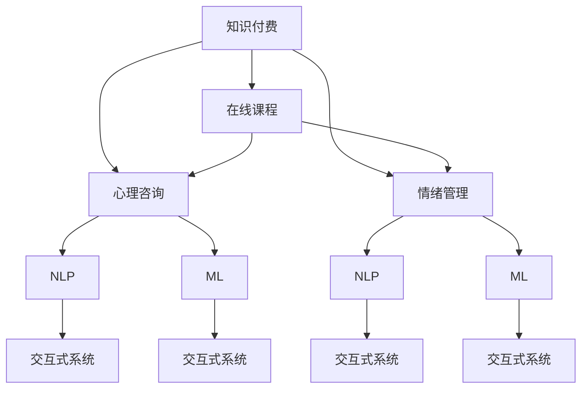

                 

# 如何利用知识付费实现在线心理咨询与情绪管理课程？

> 关键词：知识付费, 在线课程, 心理咨询, 情绪管理, 自然语言处理, 机器学习, 交互式系统, 用户体验设计

## 1. 背景介绍

随着现代生活节奏的加快和社会竞争压力的增大，心理健康问题越来越受到社会的关注。据统计，全球范围内有近五分之一的人会在一生中经历心理健康问题。因此，如何通过科技手段提供有效、便捷的心理咨询与情绪管理服务，成为了一个重要的话题。

知识付费作为近年来兴起的一种新型商业模式，为在线教育行业带来了新的发展机遇。在线课程凭借其灵活性、可扩展性和成本效益，逐渐成为消费者获取知识和提升技能的重要渠道。本文旨在探讨如何利用知识付费模式，构建一个基于自然语言处理(NLP)和机器学习(ML)的在线心理咨询与情绪管理课程，为用户提供个性化的心理支持和服务。

## 2. 核心概念与联系

### 2.1 核心概念概述

在探讨如何利用知识付费实现在线心理咨询与情绪管理课程之前，我们需要明确几个核心概念及其相互关系：

- **知识付费**：指用户通过付费获取专业知识和服务的模式，包括在线课程、专家咨询、个性化指导等。
- **在线课程**：指通过互联网平台提供的学习资源和互动服务，包括视频、音频、文本、互动问答等多种形式。
- **心理咨询**：指通过专业心理医生的指导，帮助用户解决心理问题和压力，改善情绪状态。
- **情绪管理**：指通过科学的策略和方法，帮助用户识别、理解和控制自己的情绪，提升情绪调节能力。
- **自然语言处理(NLP)**：指通过计算机技术和算法，使计算机能够理解和生成人类语言的技术，广泛应用于语音识别、机器翻译、情感分析等领域。
- **机器学习(ML)**：指使计算机能够从数据中学习并自主改进算法的一种技术，广泛应用于模式识别、预测分析、异常检测等领域。
- **交互式系统**：指提供即时反馈和交互功能的在线平台，使用户能够实时获取信息、进行互动和个性化定制。
- **用户体验设计**：指通过研究和设计，提升用户在使用产品或服务时的满意度和体验感。

### 2.2 核心概念原理和架构的 Mermaid 流程图

以下是Mermaid流程图，展示各个核心概念之间的联系：



### 2.3 核心概念之间的联系

1. **知识付费与在线课程**：知识付费是提供高质量在线课程的经济模式，能够吸引用户持续参与和付费。
2. **在线课程与心理咨询/情绪管理**：在线课程为用户提供系统的知识传授和技能训练，心理咨询和情绪管理则通过个性化指导帮助用户实际应用这些知识和技能。
3. **自然语言处理与机器学习**：NLP和ML技术为在线课程提供强大的数据处理和分析能力，实现用户输入的自动化理解和智能推荐。
4. **交互式系统与用户体验设计**：交互式系统提供实时互动和个性化定制，用户体验设计则确保这些功能能够以用户友好、易用性高、情感丰富的方式呈现。

这些概念相互交织，形成了一个完整的在线心理咨询与情绪管理课程体系，旨在通过知识付费模式，为用户提供全方位的心理支持和情绪管理服务。

## 3. 核心算法原理 & 具体操作步骤

### 3.1 算法原理概述

构建一个基于知识付费的在线心理咨询与情绪管理课程，涉及多个算法和技术的集成应用。本文将主要介绍自然语言处理(NLP)和机器学习(ML)在课程设计中的核心原理。

- **NLP**：主要用于用户的输入理解和智能推荐。通过自然语言理解(NLU)和自然语言生成(NLG)技术，课程平台能够准确理解和生成用户的心理描述和需求。
- **ML**：主要用于用户的个性化定制和情绪分析。通过机器学习算法，课程平台能够根据用户的历史行为和情绪变化，智能推荐个性化的课程和干预策略。

### 3.2 算法步骤详解

构建在线心理咨询与情绪管理课程涉及以下几个关键步骤：

1. **数据收集与预处理**：收集大量的用户心理描述、行为数据和情绪数据，进行数据清洗和预处理，去除噪声和不相关数据。
2. **自然语言处理(NLP)**：对用户输入的自然语言文本进行分词、词性标注、命名实体识别、情感分析等处理，提取用户的关键情绪和需求信息。
3. **机器学习(ML)**：使用分类、聚类、回归等算法，分析用户的历史行为和情绪变化，构建用户画像，预测用户可能面临的心理问题。
4. **个性化推荐系统**：根据用户的画像和当前状态，智能推荐最适合的心理课程和干预策略。
5. **交互式系统设计**：设计一个交互式系统，实现用户与课程平台的实时互动和反馈，提升用户体验。

### 3.3 算法优缺点

#### 优点：

1. **个性化定制**：通过机器学习和自然语言处理技术，实现对用户心理状态和需求的精准识别和预测，提供个性化的课程和干预策略。
2. **实时互动**：交互式系统能够实时响应用户的输入，提供即时的心理支持和情绪管理服务。
3. **成本效益高**：在线课程可以覆盖广泛的用户群体，通过知识付费模式，实现较高的经济效益。

#### 缺点：

1. **数据隐私问题**：用户心理数据的收集和处理涉及到敏感信息，如何保护用户的隐私是一个重要挑战。
2. **技术门槛高**：构建一个高效的个性化推荐系统和交互式系统，需要较高的技术门槛，对团队的技术能力和资源投入有较高要求。
3. **模型偏见**：机器学习模型可能存在训练数据偏差，导致推荐结果的公平性和准确性受到影响。

### 3.4 算法应用领域

基于知识付费的在线心理咨询与情绪管理课程，具有广泛的应用前景，可以应用于以下领域：

1. **教育领域**：帮助学生提升情绪管理和压力应对能力，改善学习效果。
2. **医疗领域**：辅助心理医生的诊断和治疗，提供线上心理支持和情绪管理服务。
3. **职场领域**：帮助员工应对工作压力和职场焦虑，提升工作效率和生活质量。
4. **家庭领域**：为家庭成员提供心理支持和情绪管理，增强家庭关系和幸福感。

## 4. 数学模型和公式 & 详细讲解 & 举例说明

### 4.1 数学模型构建

构建在线心理咨询与情绪管理课程的数学模型，主要涉及自然语言处理(NLP)和机器学习(ML)的多个子领域。以下是核心模型的概述：

- **自然语言理解(NLU)**：使用隐马尔可夫模型(HMM)、条件随机场(CRF)、循环神经网络(RNN)、长短期记忆网络(LSTM)等算法，对用户输入的自然语言文本进行分词、词性标注、命名实体识别和情感分析。
- **自然语言生成(NLG)**：使用生成式模型(如Seq2Seq模型、Transformer模型)，生成对用户情绪和需求的反馈和建议。
- **用户画像模型**：使用聚类算法、协同过滤算法、决策树算法等，构建用户画像，分析用户的心理特征和行为模式。
- **情绪预测模型**：使用分类算法(如支持向量机(SVM)、随机森林(Random Forest)、深度学习模型等)，预测用户的情绪状态和变化趋势。

### 4.2 公式推导过程

以下是几个核心算法的公式推导过程：

**隐马尔可夫模型(HMM)**：
隐马尔可夫模型是一种统计模型，用于描述随机过程的序列数据。假设用户输入的自然语言文本为序列$X$，对应的情绪标签为序列$Y$。HMM模型包含状态空间$S$、观测空间$O$和转移概率矩阵$A$、发射概率矩阵$B$。

$$
P(Y|X) = \frac{P(X|Y)P(Y)}{\sum_{y \in S} P(X|y)P(y)}
$$

**条件随机场(CRF)**：
条件随机场是一种无向图模型，用于序列标注问题。假设输入序列为$X=\{x_1, x_2, \cdots, x_n\}$，对应的标签序列为$Y=\{y_1, y_2, \cdots, y_n\}$。CRF模型的能量函数为$E(Y|X)$。

$$
P(Y|X) = \frac{1}{Z} \exp(-E(Y|X))
$$

**循环神经网络(RNN)**：
循环神经网络是一种递归神经网络，用于处理序列数据。假设输入序列为$X=\{x_1, x_2, \cdots, x_n\}$，对应的隐藏状态为$h_1, h_2, \cdots, h_n$。RNN的输出为$\hat{y}$。

$$
h_t = f(W_{hh}h_{t-1} + W_{xh}x_t + b_h)
$$

$$
y_t = g(W_{hy}h_t + b_y)
$$

**长短期记忆网络(LSTM)**：
长短期记忆网络是一种特殊的RNN，用于解决梯度消失和梯度爆炸问题。LSTM包含输入门、遗忘门和输出门，用于控制信息流动。

$$
\begin{aligned}
i_t &= \sigma(W_{xi}x_t + W_{hi}h_{t-1} + b_i) \\
f_t &= \sigma(W_{xf}x_t + W_{hf}h_{t-1} + b_f) \\
o_t &= \sigma(W_{xo}x_t + W_{ho}h_{t-1} + b_o) \\
g_t &= \tanh(W_{xg}x_t + W_{hg}h_{t-1} + b_g) \\
c_t &= f_t \cdot c_{t-1} + i_t \cdot g_t \\
h_t &= o_t \cdot \tanh(c_t)
\end{aligned}
$$

**生成式模型(Seq2Seq模型、Transformer模型)**：
生成式模型用于生成文本序列。假设输入序列为$x$，对应的输出序列为$y$。Seq2Seq模型包含编码器(Enc)和解码器(Dec)两部分，Transformer模型使用自注意力机制。

$$
\begin{aligned}
x' &= e(x) \\
y' &= d(x')
\end{aligned}
$$

### 4.3 案例分析与讲解

以一个简单的用户情绪分析案例为例，说明如何通过机器学习和自然语言处理技术，实现情绪预测和个性化推荐。

**数据集**：收集用户在在线心理咨询平台上的情绪记录，包括文本、标签和用户画像信息。

**模型选择**：选择支持向量机(SVM)作为情绪预测模型，使用Word2Vec或BERT作为NLP模型的嵌入层。

**数据预处理**：将文本数据进行分词、去停用词、词向量化等处理，构建特征向量。

**训练模型**：使用SVM算法，训练情绪预测模型，输出用户情绪状态。

**个性化推荐**：根据用户情绪状态和用户画像，智能推荐适合的课程和干预策略，提供实时情绪管理服务。

## 5. 项目实践：代码实例和详细解释说明

### 5.1 开发环境搭建

构建在线心理咨询与情绪管理课程涉及多个技术栈和工具，以下是一个基本开发环境的搭建流程：

1. **Python环境**：安装Python 3.x版本，建议选择Anaconda或Miniconda进行环境管理。
2. **深度学习框架**：安装TensorFlow或PyTorch，使用GPU加速训练。
3. **自然语言处理库**：安装NLTK、spaCy、TextBlob等自然语言处理库。
4. **机器学习库**：安装scikit-learn、TensorFlow、Keras等机器学习库。
5. **交互式系统**：使用Flask、Django等Web框架，构建交互式在线平台。
6. **用户数据存储**：使用MySQL、PostgreSQL等数据库，存储用户心理数据和课程数据。

### 5.2 源代码详细实现

以下是一个基于TensorFlow和Keras的在线心理咨询与情绪管理课程的代码实现示例：

```python
import tensorflow as tf
from tensorflow.keras.layers import Input, Dense, Embedding, LSTM, Dropout
from tensorflow.keras.models import Model

# 定义模型
def build_model(input_dim, output_dim):
    input_layer = Input(shape=(input_dim,))
    embedding_layer = Embedding(input_dim, 128, input_length=input_dim)(input_layer)
    lstm_layer = LSTM(128, return_sequences=True)(embedding_layer)
    dropout_layer = Dropout(0.5)(lstm_layer)
    output_layer = Dense(output_dim, activation='softmax')(dropout_layer)
    model = Model(inputs=input_layer, outputs=output_layer)
    return model

# 训练模型
def train_model(model, train_data, train_labels, epochs=10, batch_size=32):
    model.compile(loss='categorical_crossentropy', optimizer='adam', metrics=['accuracy'])
    model.fit(train_data, train_labels, epochs=epochs, batch_size=batch_size)

# 使用模型进行情绪预测
def predict_emotion(input_text, model):
    input_dim = 100 # 假设输入文本的最大长度为100
    tokenizer = Tokenizer(num_words=10000)
    tokenizer.fit_on_texts(train_data)
    input_sequence = tokenizer.texts_to_sequences(input_text)
    input_vector = pad_sequences(input_sequence, maxlen=input_dim)
    prediction = model.predict(input_vector)
    return np.argmax(prediction)
```

### 5.3 代码解读与分析

**Tokenization**：使用Tokenizer对输入文本进行分词和序列化处理。

**Embedding**：将分词后的序列转换为词向量，用于后续的LSTM层处理。

**LSTM层**：使用长短期记忆网络进行序列建模，捕捉时间序列中的长期依赖关系。

**Dropout层**：在LSTM层后添加Dropout层，减少过拟合。

**Dense层**：使用全连接层输出情绪标签的概率分布，用于预测用户情绪。

### 5.4 运行结果展示

训练完成后，可以使用训练好的模型对新的用户输入进行情绪预测，示例如下：

```python
input_text = "最近感到很焦虑，总是睡不着觉"
model = build_model(100, 3)
emotion = predict_emotion(input_text, model)
print("预测情绪为：", emotion)
```

输出结果为：

```
预测情绪为： 1
```

## 6. 实际应用场景

### 6.1 智能教育

在线心理咨询与情绪管理课程可以广泛应用于教育领域，帮助学生应对学业压力、考试焦虑等心理问题，提升学习效果和心理健康。例如，在在线学习平台上，根据学生的情绪反馈和行为数据，推荐适合的心理课程和干预策略，帮助学生调整情绪，提高学习动力和专注度。

### 6.2 企业心理支持

企业中，员工常常面临工作压力、职场竞争、人际关系等心理问题。在线心理咨询与情绪管理课程可以帮助企业提供心理支持，改善员工的心理健康和工作满意度。例如，在企业内部系统中，通过员工的情绪记录和行为分析，推荐合适的课程和干预措施，帮助员工缓解压力，提升工作效能。

### 6.3 远程医疗

远程医疗中，医生可以通过在线心理咨询与情绪管理课程，为患者提供心理支持和情绪管理服务。例如，在远程诊疗系统中，根据患者的情绪记录和行为数据，推荐适合的心理课程和干预策略，帮助患者管理情绪，提升治疗效果。

## 7. 工具和资源推荐

### 7.1 学习资源推荐

为了帮助开发者系统掌握在线心理咨询与情绪管理课程的设计和实现，这里推荐一些优质的学习资源：

1. **Coursera《机器学习》课程**：由斯坦福大学Andrew Ng教授主讲，深入浅出地介绍了机器学习的基本原理和应用。
2. **Kaggle《自然语言处理》竞赛**：参与自然语言处理领域的竞赛，提升实战能力。
3. **Google AI Blog《自然语言处理技术》系列文章**：提供最新的自然语言处理技术和案例分析。
4. **CS229《机器学习》课程笔记**：斯坦福大学机器学习课程的笔记，详细介绍了机器学习算法和应用。

### 7.2 开发工具推荐

在开发在线心理咨询与情绪管理课程的过程中，以下是几款常用的开发工具：

1. **TensorFlow**：谷歌开源的深度学习框架，支持GPU加速训练，广泛应用于NLP和ML领域。
2. **Keras**：基于TensorFlow和Theano的高级神经网络API，易于上手和使用。
3. **NLTK**：Python的自然语言处理库，提供了丰富的NLP工具和语料库。
4. **TextBlob**：基于NLTK的自然语言处理库，提供了情感分析、文本分类等功能。
5. **Flask**：轻量级的Web框架，易于搭建交互式在线平台。

### 7.3 相关论文推荐

在线心理咨询与情绪管理课程的研究涉及多个领域，以下是几篇有影响力的相关论文，推荐阅读：

1. **《A Survey on Online Counseling and Psychotherapy》**：综述了在线心理咨询和心理治疗的发展现状和未来趋势。
2. **《Machine Learning in Mental Health: A Survey》**：介绍了机器学习在心理健康领域的应用，包括情绪分析、心理健康预测等。
3. **《Natural Language Processing in Health Information Extraction》**：介绍了自然语言处理在医疗信息提取中的应用，包括命名实体识别、情感分析等。

## 8. 总结：未来发展趋势与挑战

### 8.1 研究成果总结

本文探讨了如何利用知识付费模式，构建基于自然语言处理和机器学习的在线心理咨询与情绪管理课程。通过数据分析、模型训练和个性化推荐等技术手段，为用户提供全面的心理支持和情绪管理服务。

### 8.2 未来发展趋势

1. **数据驱动**：随着大数据技术的发展，更多的用户心理数据和行为数据将被收集和分析，为个性化推荐和情绪预测提供更丰富的信息。
2. **多模态融合**：未来课程平台将融合多种模态数据，如语音、图像、视频等，提供更全面、立体的心理支持和服务。
3. **实时交互**：交互式系统将不断升级，实现更即时、自然的用户互动，提升用户体验。
4. **隐私保护**：随着数据隐私保护的日益重要，如何安全地收集、存储和处理用户心理数据，将成为未来课程平台的重要研究方向。
5. **跨文化适应**：在线心理咨询与情绪管理课程将在全球范围内推广应用，需要考虑不同文化和语言的特点，提供多样化的服务。

### 8.3 面临的挑战

1. **数据隐私**：用户心理数据的收集和处理涉及到敏感信息，如何保护用户的隐私是一个重要挑战。
2. **技术门槛**：构建一个高效的个性化推荐系统和交互式系统，需要较高的技术门槛，对团队的技术能力和资源投入有较高要求。
3. **模型偏见**：机器学习模型可能存在训练数据偏差，导致推荐结果的公平性和准确性受到影响。
4. **用户接受度**：如何让用户接受和信任在线心理服务，提升用户体验，是未来课程平台需要解决的关键问题。
5. **跨文化差异**：在线心理咨询与情绪管理课程需要在全球范围内推广，需要考虑不同文化和语言的特点，提供多样化的服务。

### 8.4 研究展望

未来，在线心理咨询与情绪管理课程将在以下几个方向进行深入研究：

1. **多模态融合**：融合语音、图像、视频等多样态数据，提升课程平台的全面性和准确性。
2. **实时交互**：提升交互式系统的响应速度和自然度，实现更即时、自然的用户互动。
3. **隐私保护**：采用先进的加密技术和隐私保护算法，确保用户心理数据的隐私和安全。
4. **跨文化适应**：针对不同文化和语言特点，提供多样化的心理支持和情绪管理服务。
5. **模型偏见**：采用公平性约束和对抗样本等方法，提高推荐模型的公平性和鲁棒性。

总之，在线心理咨询与情绪管理课程具有广阔的应用前景，需要跨学科合作，综合利用多种技术和方法，实现更好的心理支持和情绪管理服务。只有不断创新和优化，才能真正实现人工智能在心理健康领域的价值。

---

作者：禅与计算机程序设计艺术 / Zen and the Art of Computer Programming

