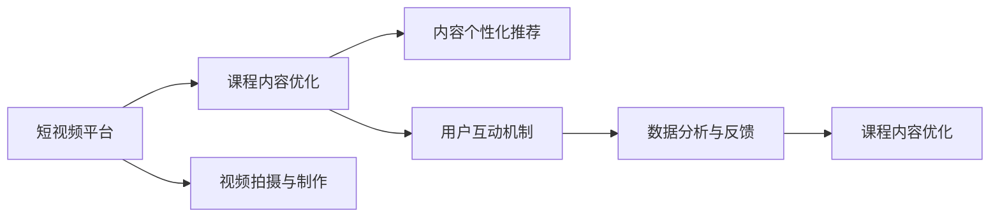

                 

# 如何利用短视频平台增加课程人气

## 1. 背景介绍

在知识分享的时代，短视频平台已经成为了传播知识的重要渠道。相较于传统的图文内容，短视频以其更强的视觉冲击力和更便捷的观看体验，受到了广泛的用户欢迎。因此，利用短视频平台来增加课程人气，成为了在线教育机构的重要选择。本文将从背景介绍、核心概念、核心算法、项目实践、应用场景、工具推荐、总结展望、常见问题等多个方面，深入分析如何有效利用短视频平台增加课程人气。

## 2. 核心概念与联系

### 2.1 核心概念概述

- **短视频平台**：指通过移动终端提供短视频内容分享和互动的平台，如抖音、快手、哔哩哔哩等。
- **课程内容优化**：指针对短视频平台用户特点，对课程内容进行适配性调整和优化，以提高课程吸引力。
- **内容个性化推荐**：指根据用户行为数据，推荐用户可能感兴趣的视频内容，提高课程曝光率。
- **用户互动机制**：指短视频平台上的点赞、评论、分享等互动方式，用于增强用户参与感和黏性。
- **数据分析与反馈**：指通过数据分析，获取课程效果反馈，指导后续优化。

### 2.2 核心概念联系

短视频平台的兴起，使得课程内容传播渠道更加多元。通过优化课程内容，利用个性化推荐，增强用户互动，并及时获取用户反馈，可以大幅提升课程在短视频平台上的受众基础和用户参与度，从而增加课程人气。

以下Mermaid流程图展示了上述核心概念之间的关系：



## 3. 核心算法原理 & 具体操作步骤

### 3.1 算法原理概述

短视频平台的成功，得益于其强大的算法推荐系统。用户在平台上观看视频时，系统会通过分析用户行为，推荐相似或相关的内容。这种推荐机制，不仅提高了用户体验，也大大提升了课程内容的曝光率和用户参与度。

基于短视频平台的算法推荐系统，通常包括以下几个核心算法：

1. **协同过滤**：基于用户历史行为数据，推荐其他用户可能喜欢的内容。
2. **内容推荐**：通过分析视频标签、关键词等，推荐与用户当前观看视频相似或相关的内容。
3. **深度学习**：使用深度学习模型，根据用户和视频的多维特征进行推荐。

### 3.2 算法步骤详解

以抖音为例，其算法推荐系统主要包括以下几个步骤：

1. **数据采集**：
   - 采集用户观看视频行为数据，包括浏览、点赞、评论、分享等。
   - 采集视频数据，包括视频标签、关键词、用户评论等。

2. **用户画像构建**：
   - 根据用户行为数据，构建用户画像，包括兴趣偏好、历史观看记录等。

3. **内容打分**：
   - 对视频内容进行打分，考虑视频质量、标签匹配度等因素。
   - 使用协同过滤、内容推荐和深度学习等多种算法综合打分。

4. **推荐生成**：
   - 根据用户画像和视频打分，生成推荐列表。
   - 实时更新推荐结果，确保推荐内容的时效性和相关性。

### 3.3 算法优缺点

短视频平台的算法推荐系统有以下优点：

- **高效性**：通过大量数据计算，实时生成推荐内容，提高了用户体验。
- **个性化**：根据用户行为，推荐个性化内容，提升用户参与度。
- **多样性**：推荐内容丰富多样，用户可以不断发现新内容。

但该系统也存在以下缺点：

- **依赖数据**：需要大量高质量的数据进行训练和优化，数据获取成本较高。
- **冷启动问题**：新用户难以获得初始推荐，可能导致用户体验下降。
- **算法黑盒**：推荐算法复杂，用户难以理解其背后的逻辑。

### 3.4 算法应用领域

短视频平台的推荐算法，不仅在娱乐领域广泛应用，也在教育、商业等多个领域得到应用。

- **教育**：通过推荐相关课程，增加课程曝光率，提升学习效果。
- **商业**：根据用户行为，推荐商品和广告，提高转化率。
- **社交**：推荐用户可能感兴趣的朋友和内容，促进用户互动。

## 4. 数学模型和公式 & 详细讲解 & 举例说明

### 4.1 数学模型构建

短视频平台的推荐系统，通常使用协同过滤、内容推荐和深度学习等多种算法。以下以协同过滤为例，构建数学模型：

设用户集为 $U$，视频集为 $V$，用户和视频的评分矩阵为 $R$，用户和视频之间的相似度矩阵为 $S$。协同过滤的目标是，基于用户历史评分，推荐其他用户可能喜欢的视频。

设用户 $u$ 对视频 $v$ 的评分矩阵为 $R_{uv}$，相似度矩阵为 $S_{uv}$，推荐系统的目标函数为：

$$
\min_{R'} \|R-R'\|_F^2 + \lambda \|S-S'\|_F^2
$$

其中 $\| \cdot \|_F$ 表示 Frobenius 范数，$\lambda$ 为正则化系数。

### 4.2 公式推导过程

根据上述目标函数，协同过滤的优化公式为：

$$
R'_{uv} = \frac{\sum_{v'} R_{uu'} S_{v'v}}{\sum_{v'} S_{uv'}}
$$

其中 $R'_{uv}$ 为推荐得分，$S_{uv'}$ 为用户 $u$ 与视频 $v'$ 的相似度。

### 4.3 案例分析与讲解

以推荐系统推荐课程视频为例，通过采集用户观看行为数据，构建用户画像 $P$。根据用户画像，计算用户与课程视频的相似度 $S_{uv}$。再通过公式推导，计算出用户可能喜欢的课程视频 $R'_{uv}$。最终，将推荐视频推送给用户，增加课程曝光率。

## 5. 项目实践：代码实例和详细解释说明

### 5.1 开发环境搭建

在项目实践前，需要先搭建开发环境。以下是使用Python进行PyTorch开发的环境配置流程：

1. 安装Anaconda：从官网下载并安装Anaconda，用于创建独立的Python环境。
2. 创建并激活虚拟环境：
```bash
conda create -n pytorch-env python=3.8 
conda activate pytorch-env
```
3. 安装PyTorch：根据CUDA版本，从官网获取对应的安装命令。例如：
```bash
conda install pytorch torchvision torchaudio cudatoolkit=11.1 -c pytorch -c conda-forge
```
4. 安装TensorFlow：
```bash
pip install tensorflow
```
5. 安装Keras：
```bash
pip install keras
```

完成上述步骤后，即可在`pytorch-env`环境中开始项目实践。

### 5.2 源代码详细实现

下面我们以推荐系统推荐课程视频为例，给出使用Keras进行推荐系统开发的PyTorch代码实现。

首先，定义推荐系统所需的数据处理函数：

```python
import pandas as pd
import numpy as np

def load_data(file_path):
    data = pd.read_csv(file_path)
    return data

def preprocess_data(data):
    # 数据清洗、特征工程等
    return processed_data
```

然后，定义模型和优化器：

```python
from keras.layers import Dense
from keras.models import Sequential
from keras.optimizers import Adam

model = Sequential([
    Dense(64, input_dim=features_dim, activation='relu'),
    Dense(32, activation='relu'),
    Dense(1, activation='sigmoid')
])

optimizer = Adam(learning_rate=0.001)
```

接着，定义训练和评估函数：

```python
def train(model, X_train, y_train, X_test, y_test):
    # 模型训练
    model.compile(optimizer=optimizer, loss='binary_crossentropy', metrics=['accuracy'])
    model.fit(X_train, y_train, epochs=50, batch_size=32, validation_data=(X_test, y_test))

def evaluate(model, X_test, y_test):
    # 模型评估
    loss, accuracy = model.evaluate(X_test, y_test)
    return loss, accuracy
```

最后，启动训练流程并在测试集上评估：

```python
X_train, y_train, X_test, y_test = load_data('data.csv')
X_train, y_train = preprocess_data(X_train, y_train)
X_test, y_test = preprocess_data(X_test, y_test)

train(model, X_train, y_train, X_test, y_test)
loss, accuracy = evaluate(model, X_test, y_test)
print(f"Accuracy: {accuracy:.3f}, Loss: {loss:.3f}")
```

以上就是使用Keras进行课程视频推荐系统微调的完整代码实现。可以看到，Keras提供了一站式的深度学习框架，使得模型开发和训练变得相对简单。

### 5.3 代码解读与分析

让我们再详细解读一下关键代码的实现细节：

**load_data和preprocess_data函数**：
- `load_data`函数：从CSV文件中加载数据，包括用户行为数据、视频标签等。
- `preprocess_data`函数：对数据进行清洗和特征工程，如归一化、特征选择等。

**model定义**：
- 使用Sequential模型构建多层感知机网络，包含两个隐藏层和一个输出层。
- 输出层使用sigmoid激活函数，适合二分类问题。

**train和evaluate函数**：
- 使用Adam优化器，学习率为0.001，损失函数为二分类交叉熵。
- 模型训练50个epoch，每个batch大小为32。
- 模型评估使用测试集，输出损失和准确率。

**训练流程**：
- 加载和预处理数据
- 定义模型和优化器
- 训练模型，并在测试集上评估
- 输出最终结果

可以看到，Keras框架的简洁和高效，使得模型开发和训练过程变得十分便捷。开发者可以将更多精力放在模型设计、数据处理和结果解释等环节，而不必过多关注底层实现细节。

当然，工业级的系统实现还需考虑更多因素，如模型的保存和部署、超参数的自动搜索、更灵活的任务适配层等。但核心的推荐范式基本与此类似。

## 6. 实际应用场景

### 6.1 视频课程推荐

在线教育平台通过推荐系统，向用户推荐可能感兴趣的课程视频，从而增加课程曝光率和用户参与度。课程推荐系统通常基于用户的观看历史、评分记录、搜索关键词等数据进行推荐。

在技术实现上，可以收集用户的行为数据，包括观看时间、点赞数、评论数等，构建用户画像。利用协同过滤、内容推荐和深度学习等多种算法，对用户画像进行分析，计算用户与课程视频的相似度，生成推荐结果。推荐系统可以将课程视频以卡片形式展示给用户，并在视频标题和描述上提供简短推荐理由，引导用户选择课程。

### 6.2 教学视频分类

学校和培训机构可以通过短视频平台，发布教师的授课视频。推荐系统可以根据视频内容进行分类，将同一领域的视频推荐给相同兴趣的学生，提高教学效果和学习体验。

具体实现上，可以使用视频标签、关键词等特征，对视频内容进行分类。推荐系统可以基于用户的学习兴趣，生成类似视频推荐列表。同时，还可以通过用户反馈数据，不断优化分类算法，提升推荐准确率。

### 6.3 课程内容更新

在课程更新时，推荐系统可以推荐用户感兴趣的新内容，增加课程的互动性和吸引力。例如，新发布的课程视频可以在原有课程视频之后，通过推荐系统推送给用户，增加新课程的曝光率。

## 7. 工具和资源推荐

### 7.1 学习资源推荐

为了帮助开发者系统掌握推荐系统理论基础和实践技巧，这里推荐一些优质的学习资源：

1. 《推荐系统实战》系列博文：由推荐系统技术专家撰写，详细讲解推荐算法原理、模型实现和优化技巧。
2 《机器学习实战》课程：由机器学习大牛李宏毅教授主讲，涵盖了推荐系统在内的多种机器学习任务。
3 《推荐系统》书籍：阮行止著，系统介绍了推荐系统的理论基础和实用技术，适合初学者入门。
4 《Python推荐系统》书籍：Python语言编写，详细介绍了推荐系统的多种实现方法，适合编程学习者。

通过对这些资源的学习实践，相信你一定能够快速掌握推荐系统的精髓，并用于解决实际的推荐问题。

### 7.2 开发工具推荐

高效的开发离不开优秀的工具支持。以下是几款用于推荐系统开发的常用工具：

1. PyTorch：基于Python的开源深度学习框架，灵活动态的计算图，适合快速迭代研究。大多数推荐系统都有PyTorch版本的实现。
2 TensorFlow：由Google主导开发的开源深度学习框架，生产部署方便，适合大规模工程应用。同样有丰富的推荐系统资源。
3 Keras：基于TensorFlow的高级API，提供简单易用的深度学习模型构建接口，适合初学者和快速原型开发。
4 Jupyter Notebook：强大的交互式编程环境，适合开发和调试推荐模型。

合理利用这些工具，可以显著提升推荐系统的开发效率，加快创新迭代的步伐。

### 7.3 相关论文推荐

推荐系统的发展源于学界的持续研究。以下是几篇奠基性的相关论文，推荐阅读：

1. Probabilistic Matrix Factorization for Latent Variable Modeling（Probabilistic Matrix Factorization）：提出矩阵分解方法，用于协同过滤推荐算法。
2 Collaborative Filtering for Implicit Feedback Datasets（协同过滤处理隐式反馈数据集）：提出协同过滤推荐算法，处理用户未明确反馈的数据。
3 Deep Neural Networks for Collaborative Filtering（深度神经网络用于协同过滤）：提出使用深度神经网络进行推荐系统构建，提高了推荐精度。

这些论文代表推荐系统的发展脉络。通过学习这些前沿成果，可以帮助研究者把握学科前进方向，激发更多的创新灵感。

## 8. 总结：未来发展趋势与挑战

### 8.1 总结

本文对基于短视频平台的课程推荐系统进行了全面系统的介绍。首先阐述了推荐系统的研究背景和意义，明确了课程推荐在提升用户参与度、增加课程曝光率方面的独特价值。其次，从原理到实践，详细讲解了推荐系统的数学原理和关键步骤，给出了推荐任务开发的完整代码实例。同时，本文还广泛探讨了推荐系统在在线教育、教学视频分类、课程内容更新等多个行业领域的应用前景，展示了推荐范式的巨大潜力。此外，本文精选了推荐系统的各类学习资源，力求为读者提供全方位的技术指引。

通过本文的系统梳理，可以看到，基于短视频平台的推荐系统正在成为在线教育的重要工具，极大地提升了课程的曝光率和用户参与度。得益于推荐算法的不断优化，推荐系统能够在海量数据中高效挖掘用户兴趣，推动知识传播和学习的不断进步。未来，伴随推荐系统的持续演进，其在更多领域的应用前景将更加广阔。

### 8.2 未来发展趋势

展望未来，推荐系统将呈现以下几个发展趋势：

1. 推荐精度持续提升：随着推荐算法的不断优化和深度学习模型的广泛应用，推荐系统的准确率将不断提高，推荐效果将更加精准。
2. 个性化推荐更为精准：基于用户行为数据和上下文信息，推荐系统将更加关注用户个性化需求，实现更加个性化的推荐。
3 跨领域推荐更具普适性：推荐系统将打破领域界限，通过不同领域数据的融合，实现更加普适的推荐效果。
4 实时推荐成为常态：推荐系统将利用实时数据更新模型，实现更加时效化的推荐。
5 推荐系统更加智能化：推荐系统将引入AI技术和知识图谱等，提升推荐内容的相关性和多样化。

这些趋势凸显了推荐系统的广阔前景。这些方向的探索发展，必将进一步提升在线教育的效果，推动教育公平和社会进步。

### 8.3 面临的挑战

尽管推荐系统已经取得了瞩目成就，但在迈向更加智能化、普适化应用的过程中，它仍面临着诸多挑战：

1. 数据隐私问题：推荐系统需要收集大量用户行为数据，可能涉及用户隐私问题。如何合理保护用户数据，是亟待解决的问题。
2. 算法复杂性：推荐算法复杂，难以理解和解释。如何提升算法的透明性和可解释性，增强用户信任，仍需努力。
3. 冷启动问题：新用户难以获得初始推荐，可能导致用户体验下降。如何实现快速冷启动，仍是推荐系统的一大挑战。
4. 算力成本：大规模推荐系统需要高算力支持，成本较高。如何降低算力成本，提升推荐系统效率，是实际应用中需要关注的问题。
5. 推荐多样性：推荐系统有时倾向于推荐相似内容，导致推荐结果过于单一。如何提高推荐多样性，避免用户陷入信息茧房，是推荐系统需要解决的问题。

正视推荐系统面临的这些挑战，积极应对并寻求突破，将使其在更多领域得到应用。相信随着学界和产业界的共同努力，这些挑战终将一一被克服，推荐系统必将在构建人机协同的智能时代中扮演越来越重要的角色。

### 8.4 研究展望

面向未来，推荐系统需要在以下几个方面寻求新的突破：

1. 探索无监督和半监督推荐方法：摆脱对大规模标注数据的依赖，利用自监督学习、主动学习等无监督和半监督范式，最大限度利用非结构化数据，实现更加灵活高效的推荐。
2. 研究参数高效和计算高效的推荐方法：开发更加参数高效的推荐方法，在固定大部分推荐参数的同时，只更新极少量的任务相关参数。同时优化推荐模型的计算图，减少前向传播和反向传播的资源消耗，实现更加轻量级、实时性的部署。
3 融合因果和对比学习范式：通过引入因果推断和对比学习思想，增强推荐系统建立稳定因果关系的能力，学习更加普适、鲁棒的语言表征，从而提升推荐系统的泛化性和抗干扰能力。
4 引入更多先验知识：将符号化的先验知识，如知识图谱、逻辑规则等，与神经网络模型进行巧妙融合，引导推荐过程学习更准确、合理的推荐内容。同时加强不同模态数据的整合，实现视觉、语音等多模态信息与文本信息的协同建模。
5 结合因果分析和博弈论工具：将因果分析方法引入推荐系统，识别出推荐决策的关键特征，增强推荐内容的因果性和逻辑性。借助博弈论工具刻画人机交互过程，主动探索并规避推荐系统的脆弱点，提高系统稳定性。
6 纳入伦理道德约束：在推荐系统训练目标中引入伦理导向的评估指标，过滤和惩罚有偏见、有害的推荐内容，确保推荐系统的公正性和伦理安全性。

这些研究方向的探索，必将引领推荐系统技术迈向更高的台阶，为构建安全、可靠、可解释、可控的智能系统铺平道路。面向未来，推荐系统还需要与其他人工智能技术进行更深入的融合，如知识表示、因果推理、强化学习等，多路径协同发力，共同推动智能交互系统的进步。只有勇于创新、敢于突破，才能不断拓展推荐系统的边界，让智能技术更好地造福人类社会。

## 9. 附录：常见问题与解答

**Q1：推荐系统能否提升课程所有人的参与度？**

A: 推荐系统的确可以提升课程的曝光率和参与度，特别是对于热门课程。但对于基础薄弱或学习兴趣不足的用户，推荐系统的效果可能并不显著。因此，除了推荐系统外，还需要结合教师的引导、作业的布置等多方面手段，提升课程的整体参与度。

**Q2：推荐系统推荐准确率如何提升？**

A: 推荐系统的准确率可以通过以下方式提升：
1. 增加数据量：更多的高质量数据可以训练出更准确的推荐模型。
2. 特征工程：通过合理的特征选择和处理，提升特征的质量和维度。
3. 算法优化：优化推荐算法，如使用深度学习模型，引入因果分析方法等。
4. 实时更新：利用实时数据更新模型，保持推荐结果的时效性和相关性。

**Q3：推荐系统如何处理冷启动问题？**

A: 推荐系统处理冷启动问题的方法包括：
1. 初始推荐：通过推荐热门内容、热门用户等，快速提升新用户的参与度。
2. 协同过滤：利用其他用户的推荐记录，给新用户推荐可能感兴趣的内容。
3. 深度学习：使用用户画像、行为数据等，生成个性化的推荐。
4. 多模态推荐：通过用户的多模态数据（如兴趣、行为、社会关系等），进行综合推荐。

**Q4：推荐系统如何确保用户数据隐私？**

A: 推荐系统确保用户数据隐私的方法包括：
1. 匿名化处理：对用户数据进行匿名化处理，避免个人隐私泄露。
2. 差分隐私：在数据处理过程中，加入噪声，保护用户隐私。
3. 数据脱敏：对敏感数据进行脱敏处理，如对部分用户信息进行模糊化。
4. 权限控制：对推荐系统的操作进行权限控制，防止未经授权的数据访问。

**Q5：推荐系统如何提升推荐多样性？**

A: 推荐系统提升推荐多样性的方法包括：
1. 增加推荐维度：引入多种推荐算法，如协同过滤、内容推荐、深度学习等。
2. 用户画像丰富化：通过多维度特征构建用户画像，如兴趣、行为、社交关系等。
3. 推荐结果去重：通过去重策略，避免推荐结果过于相似。
4. 引入外部数据：通过引入外部知识库、信息图谱等，扩展推荐内容的多样性。

这些方法可以综合使用，实现推荐结果的多样化和个性化。

通过本文的系统梳理，可以看到，基于短视频平台的推荐系统正在成为在线教育的重要工具，极大地提升了课程的曝光率和用户参与度。得益于推荐算法的不断优化，推荐系统能够在海量数据中高效挖掘用户兴趣，推动知识传播和学习的不断进步。未来，伴随推荐系统的持续演进，其在更多领域的应用前景将更加广阔。

---

作者：禅与计算机程序设计艺术 / Zen and the Art of Computer Programming

