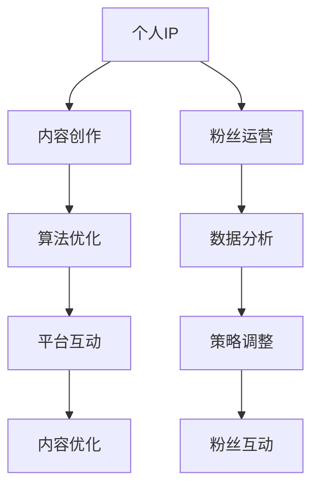

                 

# 如何利用短视频平台提升个人IP影响力

> 关键词：短视频平台,IP打造,内容创作,粉丝运营,算法优化,数据分析

## 1. 背景介绍

### 1.1 问题由来
在互联网时代，个人IP（Influencer Personal Brand）已经成为品牌塑造、内容创作和市场推广的重要手段。尤其随着短视频平台的兴起，如抖音、快手、Bilibili等，内容创作者可以借助短视频低成本、高曝光率的特点，快速建立个人影响力，吸引大批忠实粉丝。

### 1.2 问题核心关键点
要构建和维护一个成功的个人IP，需要借助短视频平台的多重策略，包括优质内容创作、粉丝运营、算法优化以及数据分析等。本文将系统介绍如何利用短视频平台提升个人IP影响力，从内容创作到粉丝运营，再到算法优化和数据分析，全方位助力IP打造。

## 2. 核心概念与联系

### 2.1 核心概念概述

为更好理解如何在短视频平台提升个人IP影响力，本节将介绍几个关键概念：

- 个人IP (Influencer Personal Brand)：指通过持续的、有价值的内容输出，建立个人在某一领域的专业性和权威性，吸引并影响目标受众。

- 短视频平台（Short Video Platforms）：如抖音、快手、Bilibili等，以短视频为载体，快速传播内容，高效互动用户的平台。

- 内容创作（Content Creation）：指个人或团队制作具有吸引力的视频内容，包括但不限于剧情、教程、解说、生活分享等。

- 粉丝运营（Fang Cultivation）：指对粉丝的互动和管理，包括回复评论、粉丝互动、社群建设等，以维护和扩大粉丝群体。

- 算法优化（Algorithm Optimization）：指对短视频平台推荐算法的设计和优化，以提高内容的曝光率和互动率。

- 数据分析（Data Analytics）：指对粉丝行为、视频表现等数据进行统计分析，以指导内容创作和运营策略。

这些核心概念之间的逻辑关系可以通过以下Mermaid流程图来展示：



该流程图展示了个人IP打造的全流程：

1. 从个人IP出发，进行内容创作。
2. 通过粉丝运营维护粉丝群体。
3. 利用算法优化提高内容曝光。
4. 数据分析指导策略调整。
5. 平台互动与内容优化相辅相成。
6. 策略调整进一步促进内容优化和粉丝互动。

## 3. 核心算法原理 & 具体操作步骤
### 3.1 算法原理概述

在短视频平台提升个人IP影响力的核心在于内容的优质化和传播的高效化。内容的优质化涉及内容创作和算法优化，而传播的高效化则主要依赖粉丝运营和数据分析。

短视频平台通常使用基于深度学习的内容推荐算法，通过多维度的特征提取和模型训练，确定内容的排序和推荐策略。推荐算法的核心目标在于：
1. **提升曝光率**：使优质内容获得更多展示机会。
2. **增强互动率**：鼓励用户点赞、评论、分享等互动行为。
3. **降低跳出率**：减少用户观看视频的跳出率，提高视频完整观看率。

算法原理主要包括以下几个关键步骤：

1. **特征提取**：将视频内容（如视频时长、帧率、画质、音频等）和用户行为（如观看时间、互动次数、用户画像等）转化为模型可以理解的形式。
2. **模型训练**：使用机器学习算法（如协同过滤、深度学习等）对大量标注数据进行训练，学习用户的偏好和内容的相关性。
3. **实时预测**：将新的视频内容和用户行为实时输入模型，预测其潜在的曝光率、互动率和跳出率，并据此进行排序和推荐。

### 3.2 算法步骤详解

以下详细介绍如何通过算法优化提升内容在短视频平台的曝光和互动：

**Step 1: 数据准备**
- 收集平台提供的数据，包括用户行为、互动情况、内容属性等。
- 进行数据预处理，如数据清洗、特征提取、归一化等。

**Step 2: 特征工程**
- 选择或设计重要的特征，包括但不限于视频时长、帧率、画质、音频清晰度、主题、标签、发布时间等。
- 进行特征工程，如特征组合、缺失值处理、降维等。

**Step 3: 模型选择与训练**
- 选择适合的推荐算法，如协同过滤、基于矩阵分解的推荐系统、基于深度学习的推荐模型（如BERT、DNN等）。
- 对模型进行训练，使用交叉验证等方法优化超参数，防止过拟合。

**Step 4: 预测与评估**
- 将训练好的模型应用于新数据进行预测，得到内容的曝光率和互动率。
- 使用各种指标（如AUC、MSE、MAE等）评估模型性能，并进行调整。

**Step 5: 反馈与调整**
- 根据用户反馈和实际表现，调整特征和模型，不断优化推荐策略。
- 定期更新模型，引入新数据和算法，提升预测准确性。

### 3.3 算法优缺点

短视频平台的推荐算法具有以下优点：
1. **高效性**：能快速处理大量数据，实时更新推荐结果，确保内容的时效性。
2. **个性化**：通过分析用户行为，精准推荐用户感兴趣的内容。
3. **覆盖广**：算法模型可以处理不同类型和风格的内容，广泛覆盖不同兴趣的用户群体。

然而，推荐算法也存在一些局限：
1. **数据偏见**：如果用户数据存在偏差，可能导致推荐结果的偏见。
2. **冷启动问题**：新内容和新用户难以被算法准确识别和推荐。
3. **动态性**：用户兴趣和内容热点可能随时间变化，算法需要不断更新才能跟上变化。
4. **计算资源消耗大**：大规模数据处理和模型训练需要大量的计算资源。

### 3.4 算法应用领域

推荐算法在短视频平台的应用领域广泛，具体如下：

- 内容推荐：根据用户历史行为和兴趣，推荐个性化视频内容。
- 广告投放：精准推荐广告，提高广告转化率。
- 用户画像：分析用户行为，构建精准的用户画像。
- 搜索排序：优化搜索结果排序，提高用户查找视频效率。
- 内容分析：分析视频内容质量，指导内容创作者。

## 4. 数学模型和公式 & 详细讲解 & 举例说明

### 4.1 数学模型构建

在推荐算法中，常用的数学模型包括协同过滤（Collaborative Filtering）、基于矩阵分解的推荐系统（Matrix Factorization Based Recommendation Systems）以及深度学习模型（如深度神经网络、BERT等）。以下以深度学习模型为例，介绍数学模型的构建和应用。

设 $X$ 为视频特征矩阵，$Y$ 为用户-内容评分矩阵。目标是最小化预测评分与实际评分之间的误差，即：

$$
\min_{W} \sum_{i,j} (y_{ij} - \langle X_iW, Y_j \rangle)^2
$$

其中 $\langle \cdot, \cdot \rangle$ 为向量的点积。

### 4.2 公式推导过程

通过求解上述最小化问题，可以得到模型参数 $W$，即：

$$
W = \left( \sum_{i,j} X_i Y_j \right)^{-1} \sum_{i,j} y_{ij} X_i Y_j
$$

在实际应用中，由于数据量巨大，通常采用随机梯度下降（SGD）等优化算法进行求解，迭代更新模型参数，直至收敛。

### 4.3 案例分析与讲解

以视频内容推荐为例，具体分析推荐算法的工作原理和优化方法。

假设一个用户 $u$ 对视频 $v$ 的评分 $y_{uv}$ 未知，推荐系统利用用户 $u$ 对其他视频 $v_1, v_2, \ldots, v_n$ 的评分 $y_{uv_1}, y_{uv_2}, \ldots, y_{uv_n}$，以及其他用户 $u_1, u_2, \ldots, u_m$ 对视频 $v$ 的评分 $y_{u_1v}, y_{u_2v}, \ldots, y_{umv}$，进行协同过滤推荐。具体步骤如下：

1. **相似度计算**：计算用户 $u$ 与其他用户 $u_1, u_2, \ldots, u_m$ 的相似度，如余弦相似度 $\cos\theta$。
2. **权重计算**：对相似度进行加权，得到权重 $w_i = \cos\theta \cdot y_{iu}$。
3. **预测评分**：根据权重 $w_i$ 和用户 $u_i$ 对视频 $v$ 的评分 $y_{u_iv}$，计算预测评分 $\hat{y}_{uv}$。
4. **排名排序**：根据预测评分 $\hat{y}_{uv}$ 进行排序，推荐评分较高的视频。

此推荐过程实现了基于用户行为数据的多维度协同过滤，可以较好地提升推荐精度和个性化程度。

## 5. 项目实践：代码实例和详细解释说明
### 5.1 开发环境搭建

以下是使用Python和PyTorch搭建推荐算法的开发环境步骤：

1. 安装Anaconda，创建虚拟环境。
2. 安装PyTorch、Numpy、Pandas、Scikit-learn等库。
3. 下载并预处理数据集，如使用Kaggle上的电影评分数据集。
4. 构建推荐算法模型，如使用矩阵分解或深度学习模型。
5. 训练模型，并在测试集上评估性能。

### 5.2 源代码详细实现

以下是一个基于深度学习模型的推荐算法实现：

```python
import torch
import torch.nn as nn
import torch.nn.functional as F
from torch.utils.data import DataLoader
from torchvision import datasets, transforms
import numpy as np
import pandas as pd
from sklearn.model_selection import train_test_split

# 数据处理和预处理
def preprocess_data():
    # 加载数据集
    data = pd.read_csv('ratings.csv')
    # 划分训练集和测试集
    train_data, test_data = train_test_split(data, test_size=0.2)
    # 特征工程，选择有用特征
    features = ['item_id', 'user_id', 'rating']
    X_train = train_data[features].values
    y_train = train_data['rating'].values
    X_test = test_data[features].values
    y_test = test_data['rating'].values
    return X_train, y_train, X_test, y_test

# 定义模型
class Model(nn.Module):
    def __init__(self):
        super(Model, self).__init__()
        self.user_layer = nn.Linear(1, 128)
        self.item_layer = nn.Linear(1, 128)
        self rating_layer = nn.Linear(128, 1)
    
    def forward(self, user, item):
        user = self.user_layer(user)
        item = self.item_layer(item)
        rating = self.rating_layer(torch.sigmoid(torch.add(user, item)))
        return rating

# 定义损失函数和优化器
model = Model()
loss_fn = nn.MSELoss()
optimizer = torch.optim.Adam(model.parameters(), lr=0.01)

# 训练和测试
X_train, y_train, X_test, y_test = preprocess_data()

for epoch in range(100):
    # 前向传播和损失计算
    y_pred = model(X_train[:, 0], X_train[:, 1])
    loss = loss_fn(y_pred, y_train)
    # 反向传播和参数更新
    optimizer.zero_grad()
    loss.backward()
    optimizer.step()
    # 测试集评估
    y_pred_test = model(X_test[:, 0], X_test[:, 1])
    test_loss = loss_fn(y_pred_test, y_test)
    print(f'Epoch {epoch+1}, loss={loss:.4f}, test loss={test_loss:.4f}')

# 保存模型
torch.save(model.state_dict(), 'model.pth')
```

### 5.3 代码解读与分析

代码实现了基于深度学习模型的推荐算法，主要包括以下步骤：

1. **数据预处理**：使用Pandas加载数据集，并进行特征选择和数据分割。
2. **模型定义**：使用PyTorch定义推荐模型的结构，包括用户和物品的线性变换层以及最终的评分预测层。
3. **损失函数和优化器**：选择均方误差损失函数和Adam优化器。
4. **模型训练和测试**：在训练集上进行前向传播和损失计算，反向传播更新模型参数，并在测试集上评估模型性能。
5. **模型保存**：将训练好的模型保存，以便后续使用。

本代码仅作示例，实际应用中可能需要根据具体数据和任务进行调整。

## 6. 实际应用场景

### 6.1 智能推荐系统

短视频平台的智能推荐系统基于推荐算法，能够根据用户历史行为和兴趣，实时推荐个性化视频内容，使用户能够发现更多感兴趣的片段。例如，抖音的推荐算法可以根据用户观看历史、点赞记录、互动行为等数据，推荐相关视频，提升用户体验。

### 6.2 内容生产辅助

内容创作者可以利用推荐算法了解哪些视频类型受欢迎，优化内容策略。例如，通过分析热门视频的特征，调整视频时长、音乐、字幕等元素，提高内容质量，吸引更多用户观看。

### 6.3 广告精准投放

短视频平台常常利用推荐算法进行广告精准投放，如在热门视频前投放广告，根据用户互动情况优化广告内容。这不仅提高了广告的点击率，还能降低广告投放成本。

## 7. 工具和资源推荐
### 7.1 学习资源推荐

以下是几本关于推荐算法的经典书籍，建议读者阅读：

1. 《推荐系统实践》：通过丰富的案例和代码，详细介绍推荐系统的设计、开发和优化方法。
2. 《深度学习与推荐系统》：介绍深度学习在推荐系统中的应用，涵盖协同过滤、深度神经网络等技术。
3. 《数据挖掘与统计学习》：系统讲解数据挖掘和统计学习方法，并应用到推荐系统中。
4. 《Python推荐系统实战》：通过Python实现推荐系统，结合实际项目案例，介绍推荐算法的应用和优化。

### 7.2 开发工具推荐

以下是几款常用的推荐系统开发工具：

1. Python和PyTorch：适合快速开发和迭代推荐算法。
2. TensorFlow和Keras：提供丰富的深度学习库和框架，适用于大规模模型训练。
3. Scikit-learn：包含丰富的机器学习算法库，用于特征工程和模型评估。
4. Apache Spark：分布式计算框架，适合大规模数据处理和推荐系统构建。
5. Elasticsearch：分布式搜索引擎，用于用户行为数据的实时分析。

### 7.3 相关论文推荐

以下是几篇关于推荐算法的经典论文，建议读者深入阅读：

1. Koren, Y. (2009). Factorization Meets the Neighborhood: A Multifaceted Collaborative Filtering Model. In Proceedings of the 14th ACM SIGKDD International Conference on Knowledge Discovery and Data Mining (KDD '09).
2. He, X., & Koren, Y. (2010). Collaborative Filtering for Implicit Feedback Datasets. In Proceedings of the ACM Conference on Recommender Systems (RecSys '10).
3. BERT: Pre-training of Deep Bidirectional Transformers for Language Understanding (Devlin, et al., 2018)
4. Attention is All You Need (Vaswani, et al., 2017)
5. A Deep Learning Framework for Multi-task Learning and Transfer Learning (Long et al., 2016)

## 8. 总结：未来发展趋势与挑战
### 8.1 总结

本文系统介绍如何利用短视频平台提升个人IP影响力，从内容创作到算法优化，再到粉丝运营和数据分析，提供了完整的策略和工具链。通过搭建推荐系统，内容创作者能够精准推荐优质内容，吸引更多用户观看和互动，进而提升IP影响力。

### 8.2 未来发展趋势

展望未来，推荐系统将在以下几个方面继续发展：

1. **个性化进一步提升**：利用更多维度的用户行为数据和上下文信息，实现更加精准的个性化推荐。
2. **实时性不断增强**：通过实时分析和推荐，确保内容的时效性和相关性。
3. **跨平台融合**：实现短视频、图文、音频等多平台内容的协同推荐。
4. **多模态融合**：结合视频、文本、图像等多模态数据，提升推荐系统的综合表现。
5. **隐私保护和安全性**：关注用户隐私保护，增强推荐系统的安全性和公平性。

### 8.3 面临的挑战

尽管推荐系统在短视频平台上取得了显著成效，但仍面临以下挑战：

1. **数据质量和多样性**：推荐系统的表现很大程度上取决于数据的质量和多样性，获取高质量、多样化数据是关键。
2. **计算资源消耗**：推荐系统需要处理大量数据和进行复杂计算，对计算资源和算力要求较高。
3. **算法偏见和公平性**：推荐算法可能会引入用户数据中的偏见，导致不公平的推荐结果。
4. **动态性**：用户兴趣和内容热点随时间变化，推荐系统需要不断更新才能保持竞争力。
5. **可解释性**：推荐算法的黑盒特性使得其决策过程难以解释，影响用户信任。

### 8.4 研究展望

未来，推荐系统的研究应聚焦于以下几个方向：

1. **增强可解释性**：开发可解释的推荐算法，增加用户的信任和理解。
2. **提升数据质量**：通过数据采集和清洗，提升数据的质量和多样性。
3. **优化计算资源**：利用分布式计算和模型压缩等技术，优化推荐系统的计算资源消耗。
4. **融合更多模态**：结合视频、音频、文本等多种模态数据，提升推荐系统的表现。
5. **强化隐私保护**：在保证推荐效果的同时，确保用户数据的隐私和安全性。

## 9. 附录：常见问题与解答

**Q1: 如何提高推荐系统的个性化推荐效果？**

A: 提高推荐系统的个性化推荐效果可以从以下几个方面入手：
1. **增加数据维度**：收集更多的用户行为数据，如观看时长、互动次数等，以丰富特征向量。
2. **优化模型**：使用更复杂的深度学习模型，如深度神经网络、Transformer等，提升模型表达能力。
3. **引入上下文信息**：考虑用户地理位置、时间、设备等上下文信息，进行多维度分析。
4. **实时学习**：利用用户实时反馈和行为数据，进行实时学习，动态更新推荐策略。
5. **多模态融合**：结合视频、文本、图像等多模态数据，提升推荐系统的综合表现。

**Q2: 推荐系统如何处理冷启动问题？**

A: 推荐系统处理冷启动问题可以从以下几个方面入手：
1. **利用知识图谱**：通过知识图谱获取用户和物品的先验信息，进行推荐。
2. **引入新用户推荐**：利用用户画像和行为数据，推荐新用户感兴趣的内容。
3. **利用内容标签**：根据内容的标签和关键词，推荐相关内容。
4. **使用协同过滤算法**：利用其他用户的行为数据，进行协同过滤推荐。

**Q3: 如何评估推荐系统的性能？**

A: 推荐系统的性能可以从以下几个方面进行评估：
1. **准确性**：使用准确率、召回率、F1值等指标评估推荐结果的准确性。
2. **多样性**：使用多样性指标（如信息增益）评估推荐结果的多样性。
3. **新颖性**：使用新颖性指标（如NDCG）评估推荐结果的新颖性。
4. **覆盖率**：使用覆盖率指标评估推荐结果覆盖热门内容的比例。
5. **用户满意度**：通过用户反馈和互动数据，评估用户对推荐结果的满意度。

**Q4: 如何优化推荐系统的实时性能？**

A: 推荐系统的实时性能可以从以下几个方面进行优化：
1. **降低计算复杂度**：使用轻量级模型和算法，减少计算资源的消耗。
2. **数据缓存**：使用数据缓存技术，减少实时数据处理的延迟。
3. **分布式计算**：利用分布式计算框架，并行处理大量数据。
4. **模型压缩**：通过模型压缩和剪枝，减少模型的存储和计算资源消耗。
5. **异步更新**：采用异步更新策略，提高模型训练和推理的效率。

**Q5: 如何处理推荐系统中的用户隐私问题？**

A: 处理推荐系统中的用户隐私问题可以从以下几个方面进行：
1. **数据匿名化**：对用户数据进行匿名化处理，防止数据泄露。
2. **差分隐私**：采用差分隐私技术，确保个体数据的安全性。
3. **隐私保护算法**：使用隐私保护算法，如联邦学习，确保模型训练过程中数据的隐私保护。
4. **用户自主控制**：允许用户自主控制数据的使用和隐私设置，增强用户信任。

---

作者：禅与计算机程序设计艺术 / Zen and the Art of Computer Programming

