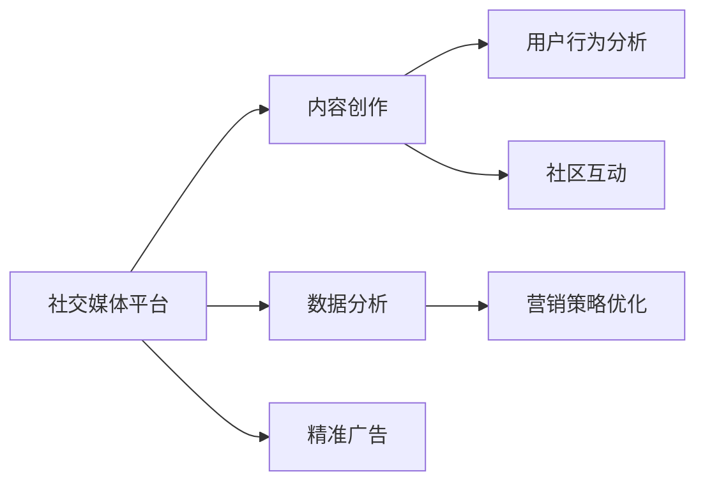

                 

# 如何利用社交媒体推广知识付费产品

> 关键词：社交媒体,知识付费,营销策略,数据分析,用户行为,内容创作,社区互动,精准广告

## 1. 背景介绍

### 1.1 问题由来
在知识付费行业，一个关键的挑战是如何有效推广产品，吸引目标用户并促成购买。传统的广告和线下活动成本高昂，效果有限，且缺乏精准性。近年来，社交媒体平台的兴起，以其低成本、高互动性和广泛覆盖的特点，成为推广知识付费产品的理想渠道。

### 1.2 问题核心关键点
利用社交媒体推广知识付费产品，核心在于以下几个关键点：
1. **选择适宜的社交媒体平台**：不同的社交平台有其独特的用户群体和使用习惯，选择合适的平台才能精准触达目标用户。
2. **创建有吸引力的内容**：内容是吸引用户注意力的关键，通过创作高质量、有价值的内容，引发用户兴趣。
3. **数据分析驱动策略优化**：通过社交媒体平台提供的数据分析工具，了解用户行为和偏好，持续优化推广策略。
4. **互动与社区建设**：通过与用户的互动，建立社群，增强用户粘性，促进口碑传播。
5. **精准广告投放**：利用社交媒体平台的精准广告投放机制，提升推广效果，实现高效转化。

## 2. 核心概念与联系

### 2.1 核心概念概述

- **社交媒体(Social Media)**：指通过互联网技术，允许用户创建、分享、评论和交流内容的平台。常见的社交媒体平台包括微博、微信、Instagram、Facebook等。
- **知识付费(Knowledge-as-a-Service, KaaS)**：指用户为获取特定知识和技能，支付一定费用获取服务或内容的形式。
- **营销策略(Marketing Strategy)**：指通过一系列策略和措施，达到推广产品、提高知名度、促成购买的目的。
- **数据分析(Analytics)**：指收集、处理和分析数据，从中获取有价值的信息和洞察，指导决策过程。
- **用户行为(User Behavior)**：指用户在社交媒体上的各种活动和互动方式，如点赞、评论、分享等。
- **内容创作(Content Creation)**：指创造具有吸引力和价值的内容，包括文字、图片、视频等。
- **社区互动(Community Engagement)**：指在社交媒体平台上与用户进行互动，建立社群，提升用户参与度和忠诚度。
- **精准广告(Precision Advertising)**：指基于用户行为和数据分析，精确投放广告，提高广告效率和效果。

这些核心概念通过社交媒体平台进行有机结合，形成了一套完整的推广知识付费产品的策略框架。

### 2.2 核心概念原理和架构的 Mermaid 流程图



这个流程图展示了社交媒体推广知识付费产品的核心流程：

1. **内容创作**：在社交媒体平台上创作有价值、有吸引力的内容，如文章、视频、直播等，吸引用户注意。
2. **数据分析**：通过社交媒体平台提供的数据分析工具，了解用户行为和偏好，优化内容策略。
3. **用户行为分析**：分析用户互动数据，识别兴趣点，指导营销策略。
4. **营销策略优化**：根据数据分析结果，调整营销策略，提高推广效果。
5. **社区互动**：通过与用户互动，建立社群，增强用户粘性。
6. **精准广告**：基于用户行为数据，精准投放广告，提升转化率。

这些步骤相互作用，形成一个闭环，不断迭代优化，提升推广效果。

## 3. 核心算法原理 & 具体操作步骤

### 3.1 算法原理概述

基于社交媒体平台的知识付费产品推广，本质上是一种社交网络传播过程。通过内容创作、数据分析、用户互动等策略，实现知识付费产品的有效推广。算法原理可以概括为以下几个方面：

- **用户行为预测**：通过分析用户在社交媒体上的行为数据，预测其可能对特定内容或广告的反应，实现精准推广。
- **内容推荐算法**：利用机器学习算法，根据用户的历史行为和偏好，推荐最相关的内容，提高内容的吸引力。
- **社交网络分析**：通过分析社交网络结构，识别意见领袖和关键节点，利用其影响力进行推广。
- **情感分析**：利用自然语言处理技术，分析用户对内容的情感倾向，优化推广策略。
- **广告投放优化**：基于用户行为数据和预测模型，优化广告投放的时间和地点，提高广告效果。

### 3.2 算法步骤详解

**Step 1: 选择适宜的社交媒体平台**

根据目标用户的特征和行为习惯，选择适宜的社交媒体平台。例如，对于年轻人，可以选择Instagram、TikTok等视觉内容为主的平台；对于专业人士，可以选择LinkedIn、Twitter等职业社交平台。

**Step 2: 创建有吸引力的内容**

根据平台特点和用户偏好，创作高质量、有价值的内容。例如，在微博和微信上，可以发布长文章、短评等；在Instagram和TikTok上，可以发布短视频、图片等。

**Step 3: 数据分析驱动策略优化**

通过社交媒体平台提供的数据分析工具，了解用户行为和偏好。例如，使用微博的“粉丝分析”功能，了解粉丝的兴趣点；使用Instagram的“洞察”功能，了解用户的互动情况。

**Step 4: 用户行为分析**

通过分析用户互动数据，识别兴趣点，指导内容创作和营销策略。例如，分析用户在内容下的评论和点赞情况，了解其兴趣和反馈。

**Step 5: 内容创作与互动**

根据用户行为分析结果，调整内容策略，创作有针对性的内容，与用户进行互动。例如，根据评论反馈，调整内容主题和形式。

**Step 6: 精准广告投放**

基于用户行为数据和预测模型，优化广告投放的时间和地点，提高广告效果。例如，使用Facebook的“广告管理工具”，根据用户的行为和兴趣，投放精准广告。

### 3.3 算法优缺点

基于社交媒体平台的知识付费产品推广，具有以下优点：
1. **成本低廉**：相比传统广告和线下活动，社交媒体推广成本更低，且容易实施。
2. **高互动性**：社交媒体平台鼓励用户互动，增强用户参与度和粘性。
3. **广泛覆盖**：社交媒体平台用户基数大，覆盖广泛，能够精准触达目标用户。
4. **数据分析支持**：社交媒体平台提供丰富的数据分析工具，便于优化推广策略。

同时，也存在一些局限：
1. **数据隐私问题**：用户数据隐私和安全是社交媒体推广中必须关注的问题，需确保用户数据合规使用。
2. **算法偏见**：社交媒体平台的推荐算法可能存在偏见，影响推广效果。
3. **平台依赖**：过度依赖某一社交媒体平台，可能限制推广范围和效果。
4. **动态变化**：社交媒体平台的用户行为和偏好不断变化，需持续关注和调整策略。

### 3.4 算法应用领域

基于社交媒体平台的知识付费产品推广，在多个领域都有广泛应用，例如：

- **在线教育**：通过社交媒体平台推广在线课程，吸引用户注册学习。
- **职业技能培训**：在职业社交平台推广职业技能培训课程，提高职场竞争力。
- **健康管理**：在健康相关的社交平台上推广健康管理课程，提升用户健康意识。
- **财经资讯**：在财经类社交平台上推广财经课程和资讯，满足用户学习需求。

## 4. 数学模型和公式 & 详细讲解 & 举例说明

### 4.1 数学模型构建

在社交媒体平台推广知识付费产品的过程中，涉及多个数学模型，主要包括以下几类：

1. **用户行为预测模型**：使用回归分析、时间序列预测等方法，预测用户对内容的互动行为。
2. **内容推荐模型**：使用协同过滤、内容基推荐等方法，推荐相关内容给用户。
3. **社交网络分析模型**：使用图算法，识别社交网络中的意见领袖和关键节点，进行推广。
4. **情感分析模型**：使用情感分类模型，分析用户对内容的情感倾向。
5. **广告投放优化模型**：使用线性回归、决策树等方法，优化广告投放策略。

### 4.2 公式推导过程

以用户行为预测模型为例，使用时间序列预测的方法进行推导：

假设用户对内容的互动次数为 $y_t$，包括点赞、评论、分享等，时间 $t$ 内的互动次数为 $y_{t-1}, y_{t-2}, \ldots, y_{t-k}$。使用自回归模型（AR模型）进行预测，公式如下：

$$
y_t = \alpha_0 + \alpha_1 y_{t-1} + \alpha_2 y_{t-2} + \ldots + \alpha_k y_{t-k} + \epsilon_t
$$

其中，$\alpha_0, \alpha_1, \ldots, \alpha_k$ 为模型参数，$\epsilon_t$ 为误差项。通过最小化均方误差（MSE），求解模型参数：

$$
\hat{\alpha} = \mathop{\arg\min}_{\alpha} \frac{1}{N}\sum_{t=1}^N (y_t - \alpha_0 - \alpha_1 y_{t-1} - \ldots - \alpha_k y_{t-k})^2
$$

通过求解得到模型参数 $\hat{\alpha}$，即可预测用户未来的互动行为。

### 4.3 案例分析与讲解

以下是一个用户行为预测的案例分析：

假设某在线教育平台，通过微博推广新课程。平台收集了过去一年内用户对课程内容的互动数据，包括点赞、评论和分享次数，时间范围从$t-6$到$t$。使用AR模型进行预测，结果如下：

| 时间 | 点赞次数 | 评论次数 | 分享次数 | 预测互动次数 |
|------|----------|----------|----------|--------------|
| $t-6$ | 20       | 10       | 5        | 22           |
| $t-5$ | 25       | 12       | 7        | 27           |
| $t-4$ | 30       | 15       | 8        | 28           |
| $t-3$ | 35       | 18       | 9        | 30           |
| $t-2$ | 40       | 20       | 10       | 35           |
| $t-1$ | 45       | 22       | 11       | 42           |
| $t$   |          |         |         | 45           |

根据AR模型预测，用户在$t$时刻的互动次数为45次。平台可以据此调整推广策略，例如在用户活跃时段加强推广力度。

## 5. 项目实践：代码实例和详细解释说明

### 5.1 开发环境搭建

在进行社交媒体推广知识付费产品的推广实践中，我们需要准备好开发环境。以下是使用Python进行PyTorch和TensorFlow开发的Python环境配置流程：

1. 安装Anaconda：从官网下载并安装Anaconda，用于创建独立的Python环境。

2. 创建并激活虚拟环境：
```bash
conda create -n pytorch-env python=3.8 
conda activate pytorch-env
```

3. 安装PyTorch和TensorFlow：根据CUDA版本，从官网获取对应的安装命令。例如：
```bash
conda install pytorch torchvision torchaudio cudatoolkit=11.1 -c pytorch -c conda-forge
conda install tensorflow tensorflow-gpu=2.4 -c tensorflow
```

4. 安装所需的Python包：
```bash
pip install pandas numpy scikit-learn matplotlib tensorflow_datasets
```

5. 安装社交媒体平台API：
```bash
pip install requests
```

完成上述步骤后，即可在`pytorch-env`环境中开始推广实践。

### 5.2 源代码详细实现

以下是使用TensorFlow和Keras进行用户行为预测的示例代码：

```python
import tensorflow as tf
from tensorflow.keras import models, layers
import requests
import pandas as pd
import numpy as np

# 获取用户互动数据
url = 'https://example.com/user_interactions.csv'
data = requests.get(url).content
df = pd.read_csv(data)

# 数据预处理
features = df.drop('interaction_count', axis=1)
target = df['interaction_count']

# 特征缩放
scaler = MinMaxScaler()
features_scaled = scaler.fit_transform(features)

# 划分训练集和测试集
train_features, test_features = train_test_split(features_scaled, test_size=0.2)
train_target, test_target = train_test_split(target, test_size=0.2)

# 构建AR模型
model = Sequential()
model.add(LSTM(64, input_shape=(features.shape[1], 1)))
model.add(Dense(32))
model.add(Dense(1))

# 编译模型
model.compile(optimizer='adam', loss='mse', metrics=['mae'])

# 训练模型
model.fit(train_features, train_target, epochs=10, validation_data=(test_features, test_target))

# 预测用户互动次数
new_data = np.array([[0.1, 0.2, 0.3, 0.4, 0.5]])
prediction = model.predict(new_data)
print(prediction)
```

这段代码展示了如何使用TensorFlow和Keras构建一个简单的AR模型，对用户互动次数进行预测。

### 5.3 代码解读与分析

**数据获取和预处理**：
- 通过API获取用户互动数据，包含时间序列的用户互动次数。
- 将数据分为特征（用户行为）和目标（互动次数），进行数据预处理，包括特征缩放和划分训练集和测试集。

**模型构建**：
- 使用LSTM层构建AR模型，捕捉时间序列中的动态变化。
- 添加Dense层，进行特征提取和输出预测。

**模型训练和预测**：
- 使用Adam优化器和均方误差损失函数，编译模型并进行训练。
- 在测试集上评估模型性能，并使用模型进行预测。

以上代码仅为示例，实际应用中需根据具体数据和问题进行调整。

## 6. 实际应用场景

### 6.1 在线教育平台

在线教育平台可以利用社交媒体推广新课程。例如，某在线编程平台，通过微博推广Python课程。平台可以发布课程简介、免费试听课等吸引用户关注，并通过数据分析了解用户互动情况，优化推广策略。同时，利用社交媒体平台的精准广告功能，对潜在用户进行定向投放，提升转化率。

### 6.2 职业技能培训

职业技能培训平台可以利用LinkedIn进行推广。例如，某职场技能培训平台，通过LinkedIn发布职业技能课程，吸引专业人士关注。平台可以利用LinkedIn的推荐算法，将课程推荐给有相关兴趣的用户，同时通过数据分析了解用户行为，优化课程内容和推广策略。

### 6.3 健康管理应用

健康管理应用可以利用Instagram进行推广。例如，某健康管理应用，通过Instagram发布健康管理课程和健身视频，吸引用户关注。平台可以利用Instagram的互动数据，了解用户的兴趣点，调整内容策略，同时通过精准广告，对潜在用户进行定向推广。

### 6.4 财经资讯平台

财经资讯平台可以利用Twitter进行推广。例如，某财经资讯平台，通过Twitter发布财经资讯和课程，吸引用户关注。平台可以利用Twitter的情感分析工具，了解用户对内容的情感倾向，优化内容策略，同时通过精准广告，对潜在用户进行定向投放。

## 7. 工具和资源推荐

### 7.1 学习资源推荐

为了帮助开发者系统掌握社交媒体推广知识付费产品的理论基础和实践技巧，这里推荐一些优质的学习资源：

1. **《社交媒体营销实战》系列书籍**：由营销专家撰写，深入浅出地介绍了社交媒体营销的策略和技巧。
2. **Coursera《社交媒体营销》课程**：斯坦福大学开设的社交媒体营销课程，提供了丰富的案例和实际操作指南。
3. **Hootsuite Academy**：提供社交媒体营销的在线课程和认证，涵盖平台使用、内容创作、数据分析等多个方面。
4. **《Python社交媒体分析》书籍**：讲解如何使用Python进行社交媒体数据分析，提供丰富的示例代码。
5. **Google Analytics**：社交媒体平台提供的流量分析工具，了解用户行为和流量来源。

通过对这些资源的学习实践，相信你一定能够快速掌握社交媒体推广知识付费产品的精髓，并用于解决实际的推广问题。

### 7.2 开发工具推荐

高效的开发离不开优秀的工具支持。以下是几款用于社交媒体推广知识付费产品开发的常用工具：

1. **Python**：免费的开源编程语言，适用于数据分析和模型开发。
2. **TensorFlow**：由Google主导开发的深度学习框架，易于使用，支持分布式计算。
3. **Keras**：基于TensorFlow的高级深度学习API，提供简单易用的接口，适合快速开发。
4. **RapidAPI**：提供各种API接口，方便获取社交媒体平台的数据和功能。
5. **Tableau**：强大的数据可视化工具，便于进行数据探索和可视化分析。
6. **Hootsuite**：社交媒体管理工具，方便进行多平台管理和推广。

合理利用这些工具，可以显著提升社交媒体推广知识付费产品的开发效率，加快创新迭代的步伐。

### 7.3 相关论文推荐

社交媒体平台推广知识付费产品的研究源于学界的持续探索。以下是几篇奠基性的相关论文，推荐阅读：

1. **《社交媒体上的知识传播行为研究》**：探讨社交媒体平台上的知识传播行为，提出基于用户互动的传播模型。
2. **《利用社交媒体平台进行品牌推广》**：分析社交媒体平台在品牌推广中的作用和策略，提供成功案例。
3. **《社交媒体推荐系统研究》**：介绍社交媒体推荐系统的算法和实现，讨论其应用前景。
4. **《社交媒体情感分析技术》**：讲解社交媒体情感分析的方法和工具，指导情感分析应用。
5. **《基于社交媒体的广告投放优化》**：研究基于用户行为数据的广告投放优化策略，提升广告效果。

这些论文代表了大规模社交媒体推广的最新进展，帮助研究者把握学科前进方向，激发更多的创新灵感。

## 8. 总结：未来发展趋势与挑战

### 8.1 研究成果总结

本文对利用社交媒体平台推广知识付费产品的技术进行了全面系统的介绍。首先阐述了社交媒体推广知识付费产品的背景和意义，明确了推广策略的核心要素。其次，从原理到实践，详细讲解了社交媒体推广的知识付费产品的数学模型和操作步骤，提供了完整代码实例。同时，本文还广泛探讨了社交媒体推广在多个行业领域的应用前景，展示了推广范式的巨大潜力。此外，本文精选了推广技术的各类学习资源，力求为开发者提供全方位的技术指引。

通过本文的系统梳理，可以看到，基于社交媒体平台的知识付费产品推广技术正在成为教育、培训、健康等多个行业的重要工具，极大地拓展了知识付费产品的应用范围和推广效果。未来，伴随社交媒体平台和推广技术的不断进步，知识付费产品必将在更广阔的领域得到应用，成为推动社会进步的重要力量。

### 8.2 未来发展趋势

展望未来，社交媒体平台推广知识付费产品将呈现以下几个发展趋势：

1. **内容多样化和个性化**：社交媒体平台上的内容将更加多样化，个性化推荐算法将进一步提升用户满意度和粘性。
2. **数据分析和预测**：社交媒体平台提供的数据分析工具将更加强大，利用机器学习进行用户行为预测，优化推广策略。
3. **社区互动和社群建设**：社交媒体平台上的社群互动将成为推广的重要手段，增强用户参与度和忠诚度。
4. **精准广告和营销自动化**：利用社交媒体平台的精准广告和自动化工具，实现高效推广，提升转化率。
5. **跨平台协同推广**：跨平台推广将成为趋势，利用不同平台的特点，综合推广效果。

以上趋势凸显了社交媒体平台推广知识付费产品的广阔前景。这些方向的探索发展，必将进一步提升知识付费产品的推广效果和应用范围，为更多用户提供有价值的学习资源。

### 8.3 面临的挑战

尽管社交媒体平台推广知识付费产品已经取得了显著成效，但在推广过程中，仍面临诸多挑战：

1. **数据隐私和安全**：用户数据隐私和安全是社交媒体推广中必须关注的问题，需确保用户数据合规使用。
2. **算法偏见**：社交媒体平台的推荐算法可能存在偏见，影响推广效果。
3. **平台依赖**：过度依赖某一社交媒体平台，可能限制推广范围和效果。
4. **用户行为变化**：社交媒体用户行为和偏好不断变化，需持续关注和调整策略。
5. **竞争加剧**：随着社交媒体平台和知识付费产品的增多，竞争将更加激烈，需不断创新和优化。

### 8.4 研究展望

面对社交媒体平台推广知识付费产品所面临的挑战，未来的研究需要在以下几个方面寻求新的突破：

1. **无监督和半监督学习**：探索无监督和半监督学习范式，降低对标注数据的依赖，提高推广效果。
2. **多模态数据融合**：将文本、图片、视频等多模态数据融合，提升内容吸引力和用户体验。
3. **因果推断和图模型**：引入因果推断和图模型，优化推荐算法，提高推广效果。
4. **可解释性和透明性**：加强推广模型的可解释性和透明性，增强用户信任和接受度。
5. **跨平台协同推广**：研究跨平台协同推广的策略，优化推广效果。

这些研究方向的探索，必将引领社交媒体平台推广知识付费产品技术迈向更高的台阶，为更多用户提供有价值的知识资源，推动社会进步。

## 9. 附录：常见问题与解答

**Q1: 社交媒体推广知识付费产品的核心要素是什么？**

A: 社交媒体推广知识付费产品的核心要素包括：选择合适的社交媒体平台、创建有吸引力的内容、数据分析驱动策略优化、用户行为分析、社区互动、精准广告投放。这些要素相互作用，形成一个闭环，不断优化推广效果。

**Q2: 如何选择合适的社交媒体平台？**

A: 根据目标用户的特征和行为习惯，选择适宜的社交媒体平台。例如，年轻人更偏好视觉内容为主的平台如Instagram、TikTok；专业人士更偏好职业社交平台如LinkedIn、Twitter。

**Q3: 数据隐私和安全问题如何解决？**

A: 确保用户数据合规使用，采取数据匿名化、加密等措施，遵守相关法律法规，建立用户隐私保护机制。

**Q4: 如何应对用户行为变化？**

A: 持续关注用户行为变化，及时调整推广策略。利用数据分析工具，实时监控用户互动情况，优化内容策略和投放策略。

**Q5: 如何应对平台依赖问题？**

A: 进行跨平台推广，利用不同平台的特点，综合提升推广效果。同时，构建品牌社区，增强用户粘性和品牌忠诚度。

通过这些问题的解答，可以看出，社交媒体平台推广知识付费产品是一个复杂而系统的过程，需要综合考虑多个要素和环节，不断优化推广策略，才能实现最佳效果。

---

作者：禅与计算机程序设计艺术 / Zen and the Art of Computer Programming

