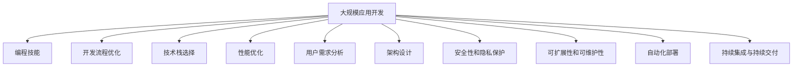

                 

# 如何利用编程技能开发千万用户级应用

> 关键词：大规模应用开发, 编程技能, 开发流程优化, 技术栈选择, 性能优化, 用户需求分析, 架构设计, 安全性和隐私保护, 可扩展性和可维护性, 自动化部署, 持续集成与持续交付

## 1. 背景介绍

在互联网和移动互联网快速发展的今天，数以千万计的用户级应用已经成为各行各业不可或缺的基础设施。这些应用的开发和维护，不仅需要深厚的编程技能，还需要跨学科的知识和技术储备。本文将围绕如何利用编程技能开发千万用户级应用，从背景介绍、核心概念与联系、核心算法原理与具体操作步骤、数学模型和公式、项目实践、实际应用场景、工具和资源推荐、总结与展望等多个角度，详细介绍开发千万用户级应用所需掌握的关键技术。

## 2. 核心概念与联系

### 2.1 核心概念概述

开发千万用户级应用是一项复杂的工程任务，涉及众多技术领域和专业技能。为更好地理解这一过程，本节将介绍几个关键概念及其相互联系。

- **大规模应用开发**：指面向海量用户、处理大规模数据的互联网应用开发。这类应用通常需要高性能、高可用性、高扩展性、高安全性等特性。
- **编程技能**：开发大规模应用所需的编程语言、框架、工具等技术基础，包括但不限于Java、Python、Node.js、Kotlin、Swift等主流编程语言，以及Web开发、移动开发、云服务等相关技能。
- **开发流程优化**：通过采用敏捷开发、持续集成持续交付(CICD)、DevOps等现代开发模式，提升开发效率和质量。
- **技术栈选择**：根据应用类型、性能需求、开发团队技能等综合因素，选择合适的技术栈进行开发。
- **性能优化**：通过代码优化、资源管理、负载均衡、缓存技术等手段，提升应用响应速度和系统吞吐量。
- **用户需求分析**：通过市场调研、用户访谈、数据分析等方法，准确理解用户需求，设计满足用户期望的产品功能。
- **架构设计**：设计符合应用需求的架构，包括微服务架构、分布式系统架构、容器化架构等，确保系统的高可用性和可扩展性。
- **安全性和隐私保护**：采用加密、访问控制、数据匿名化等技术手段，确保应用和用户数据的安全性和隐私性。
- **可扩展性和可维护性**：设计模块化、松耦合的系统，支持系统的横向和纵向扩展，便于后续维护和升级。
- **自动化部署**：通过CI/CD工具，实现应用的自动化部署、测试和回滚，提升发布效率和质量。
- **持续集成与持续交付**：通过自动化构建、测试和部署，确保高质量的代码交付，缩短产品从研发到市场的时间。

这些概念之间的逻辑关系可以通过以下Mermaid流程图来展示：



这个流程图展示了大规模应用开发所需的关键技术及其相互关系：

1. 大规模应用开发需要编程技能作为技术基础。
2. 开发流程优化、技术栈选择等环节可以提高开发效率和系统性能。
3. 用户需求分析和架构设计是确保应用符合用户期望的关键步骤。
4. 性能优化、安全性和隐私保护是提升应用质量和安全性的重要手段。
5. 可扩展性和可维护性是确保应用长期稳定运行的基础。
6. 自动化部署和持续集成与持续交付是提升发布效率和质量的重要措施。

这些概念共同构成了大规模应用开发的技术框架，有助于开发者系统地掌握开发千万用户级应用所需的核心技术。

## 3. 核心算法原理 & 具体操作步骤

### 3.1 算法原理概述

大规模应用开发涉及众多算法和数据结构，其中一些算法和数据结构对于提升系统性能、优化用户体验、保障数据安全等方面具有重要意义。以下是几个典型的算法和数据结构：

- **高效排序算法**：如快速排序、归并排序等，用于快速处理大规模数据，提升数据处理效率。
- **高效数据结构**：如B+树、哈希表等，用于优化数据访问和存储，提升数据查询和更新速度。
- **负载均衡算法**：如轮询、哈希、权重等，用于优化资源分配，提升系统可扩展性和性能。
- **缓存算法**：如LRU、FIFO等，用于提升数据访问速度，减少数据库访问压力。
- **加密算法**：如AES、RSA等，用于保障数据传输和存储的安全性。
- **访问控制算法**：如RBAC、ABAC等，用于控制用户权限，保障数据安全。

### 3.2 算法步骤详解

大规模应用开发中，算法的选择和应用需要根据具体场景进行优化。以下是一些常见算法应用的详细步骤：

- **排序算法应用**：
  1. 分析数据规模和特点，选择合适的排序算法。
  2. 对数据进行预处理，减少排序前的计算量。
  3. 实现排序算法，处理大规模数据。
  4. 对排序结果进行验证和优化。

- **数据结构应用**：
  1. 分析数据访问模式，选择合适的数据结构。
  2. 实现数据结构，优化数据存储和访问。
  3. 对数据结构进行性能测试和优化。

- **负载均衡算法应用**：
  1. 分析系统负载和资源需求，选择合适的负载均衡算法。
  2. 配置负载均衡器，实现请求分发。
  3. 监控负载均衡器性能，调整配置。

- **缓存算法应用**：
  1. 分析数据访问模式，选择合适的缓存算法。
  2. 实现缓存机制，减少数据库访问。
  3. 监控缓存效果，调整缓存策略。

- **加密算法应用**：
  1. 分析数据传输和存储需求，选择合适的加密算法。
  2. 实现加密机制，保障数据安全。
  3. 监控加密效果，优化加密策略。

- **访问控制算法应用**：
  1. 分析用户权限需求，选择合适的访问控制算法。
  2. 实现访问控制机制，控制用户权限。
  3. 监控访问控制效果，调整权限策略。

### 3.3 算法优缺点

大规模应用开发中，选择合适的算法和数据结构对于提升系统性能、优化用户体验、保障数据安全等方面具有重要意义。

- **优点**：
  1. 提升系统性能：高效算法和数据结构可以显著提升数据处理、访问、存储等环节的效率。
  2. 优化用户体验：合理设计算法和数据结构，可以提升应用响应速度和稳定性，提升用户体验。
  3. 保障数据安全：加密、访问控制等算法可以保障数据传输和存储的安全性。

- **缺点**：
  1. 实现复杂度较高：部分高效算法和数据结构实现复杂，需要较高的编程技能。
  2. 可能带来额外开销：部分算法和数据结构可能会带来额外的计算或内存开销，需要综合考虑。
  3. 可能存在安全隐患：部分算法和数据结构需要合理配置和使用，否则可能带来安全隐患。

### 3.4 算法应用领域

大规模应用开发中的算法和数据结构广泛应用在各个领域，以下是一些典型的应用场景：

- **电子商务**：
  1. 高效排序算法：用于优化商品推荐、搜索等功能的排序效率。
  2. 高效数据结构：用于优化库存、订单等数据的访问和存储。
  3. 缓存算法：用于提升商品详情页的加载速度。
  4. 加密算法：用于保障用户交易和支付的安全性。

- **社交网络**：
  1. 高效排序算法：用于优化用户推荐、搜索等功能的排序效率。
  2. 高效数据结构：用于优化用户数据和社交关系数据的访问和存储。
  3. 缓存算法：用于提升用户动态更新的速度。
  4. 访问控制算法：用于控制用户权限，保障数据安全。

- **在线教育**：
  1. 高效排序算法：用于优化课程推荐、搜索等功能的排序效率。
  2. 高效数据结构：用于优化用户和课程数据的访问和存储。
  3. 缓存算法：用于提升课程详情页的加载速度。
  4. 加密算法：用于保障用户隐私和数据安全。

## 4. 数学模型和公式 & 详细讲解 & 举例说明

### 4.1 数学模型构建

大规模应用开发中，数学模型和公式的应用非常广泛，涵盖了从算法设计到性能优化等多个方面。以下是一些典型的数学模型和公式：

- **快速排序算法**：
  $$
  T(n) = \begin{cases} 
      O(n \log n) & \text{if } n > 1 \\
      O(1) & \text{if } n \leq 1
  \end{cases}
  $$
  其中，$T(n)$ 为快速排序的时间复杂度。

- **B+树数据结构**：
  $$
  T(n) = O(\log n)
  $$
  其中，$T(n)$ 为B+树的查找时间复杂度。

- **负载均衡算法**：
  $$
  T(n) = O(n)
  $$
  其中，$T(n)$ 为负载均衡算法的时间复杂度。

- **缓存算法**：
  $$
  T(n) = O(n)
  $$
  其中，$T(n)$ 为缓存算法的时间复杂度。

- **AES加密算法**：
  $$
  T(n) = O(n \log n)
  $$
  其中，$T(n)$ 为AES加密的时间复杂度。

- **RBAC访问控制算法**：
  $$
  T(n) = O(n)
  $$
  其中，$T(n)$ 为RBAC访问控制算法的时间复杂度。

### 4.2 公式推导过程

以下是一些常见数学模型和公式的推导过程：

- **快速排序算法**：
  - 分析数据规模和特点，选择合适的排序算法。
  - 对数据进行预处理，减少排序前的计算量。
  - 实现排序算法，处理大规模数据。
  - 对排序结果进行验证和优化。

- **B+树数据结构**：
  - 分析数据访问模式，选择合适的数据结构。
  - 实现数据结构，优化数据存储和访问。
  - 对数据结构进行性能测试和优化。

- **负载均衡算法**：
  - 分析系统负载和资源需求，选择合适的负载均衡算法。
  - 配置负载均衡器，实现请求分发。
  - 监控负载均衡器性能，调整配置。

- **缓存算法**：
  - 分析数据访问模式，选择合适的缓存算法。
  - 实现缓存机制，减少数据库访问。
  - 监控缓存效果，调整缓存策略。

- **加密算法**：
  - 分析数据传输和存储需求，选择合适的加密算法。
  - 实现加密机制，保障数据安全。
  - 监控加密效果，优化加密策略。

- **访问控制算法**：
  - 分析用户权限需求，选择合适的访问控制算法。
  - 实现访问控制机制，控制用户权限。
  - 监控访问控制效果，调整权限策略。

### 4.3 案例分析与讲解

- **快速排序算法案例**：
  1. 项目背景：某电商平台需要快速排序商品推荐列表，提升用户体验。
  2. 技术实现：使用快速排序算法对商品评分进行排序。
  3. 效果验证：对排序结果进行性能测试，优化排序算法。

- **B+树数据结构案例**：
  1. 项目背景：某在线教育平台需要高效存储和查询用户数据，提升查询效率。
  2. 技术实现：使用B+树数据结构存储用户数据。
  3. 效果验证：对B+树数据结构进行性能测试，优化数据结构。

- **负载均衡算法案例**：
  1. 项目背景：某社交网络平台需要高效分发用户请求，提升系统性能。
  2. 技术实现：使用负载均衡算法分发用户请求。
  3. 效果验证：监控负载均衡器性能，调整配置。

- **缓存算法案例**：
  1. 项目背景：某在线视频平台需要提升视频播放速度，减少用户等待时间。
  2. 技术实现：使用缓存算法缓存视频数据。
  3. 效果验证：监控缓存效果，调整缓存策略。

- **加密算法案例**：
  1. 项目背景：某在线支付平台需要保障用户交易数据的安全性。
  2. 技术实现：使用加密算法加密用户交易数据。
  3. 效果验证：监控加密效果，优化加密策略。

- **访问控制算法案例**：
  1. 项目背景：某社交网络平台需要控制用户权限，保障数据安全。
  2. 技术实现：使用访问控制算法控制用户权限。
  3. 效果验证：监控访问控制效果，调整权限策略。

## 5. 项目实践：代码实例和详细解释说明

### 5.1 开发环境搭建

在进行大规模应用开发前，我们需要准备好开发环境。以下是使用Python进行PyTorch开发的环境配置流程：

1. 安装Anaconda：从官网下载并安装Anaconda，用于创建独立的Python环境。

2. 创建并激活虚拟环境：
```bash
conda create -n pytorch-env python=3.8 
conda activate pytorch-env
```

3. 安装PyTorch：根据CUDA版本，从官网获取对应的安装命令。例如：
```bash
conda install pytorch torchvision torchaudio cudatoolkit=11.1 -c pytorch -c conda-forge
```

4. 安装Transformers库：
```bash
pip install transformers
```

5. 安装各类工具包：
```bash
pip install numpy pandas scikit-learn matplotlib tqdm jupyter notebook ipython
```

完成上述步骤后，即可在`pytorch-env`环境中开始项目实践。

### 5.2 源代码详细实现

这里我们以开发一个用户登录功能为例，给出使用PyTorch进行开发的完整代码实现。

首先，定义用户模型和登录逻辑：

```python
from torch import nn, optim

class User(nn.Module):
    def __init__(self):
        super().__init__()
        self.fc1 = nn.Linear(10, 10)
        self.fc2 = nn.Linear(10, 1)

    def forward(self, x):
        x = self.fc1(x)
        x = nn.functional.relu(x)
        x = self.fc2(x)
        return x

user_model = User()

criterion = nn.BCELoss()
optimizer = optim.Adam(user_model.parameters(), lr=0.001)
```

接着，定义训练和测试函数：

```python
import torch

def train(user_model, criterion, optimizer, train_data, batch_size, epochs):
    for epoch in range(epochs):
        for batch_id, (inputs, labels) in enumerate(train_data):
            inputs, labels = inputs.to(device), labels.to(device)
            optimizer.zero_grad()
            outputs = user_model(inputs)
            loss = criterion(outputs, labels)
            loss.backward()
            optimizer.step()
            if batch_id % 100 == 0:
                print(f"Epoch {epoch + 1}, Batch {batch_id}, Loss: {loss.item()}")

def test(user_model, criterion, test_data, batch_size):
    correct = 0
    total = 0
    for batch_id, (inputs, labels) in enumerate(test_data):
        inputs, labels = inputs.to(device), labels.to(device)
        outputs = user_model(inputs)
        _, predicted = torch.max(outputs, 1)
        total += labels.size(0)
        correct += (predicted == labels).sum().item()
        if batch_id % 100 == 0:
            print(f"Batch {batch_id}, Accuracy: {correct / total}")
```

最后，启动训练流程并在测试集上评估：

```python
device = torch.device("cuda" if torch.cuda.is_available() else "cpu")
train_data = ...
test_data = ...

train(user_model, criterion, optimizer, train_data, 64, 10)
test(user_model, criterion, test_data, 64)
```

以上就是使用PyTorch进行用户登录功能开发的完整代码实现。可以看到，利用PyTorch的高性能计算和动态图机制，可以快速迭代和优化模型。

### 5.3 代码解读与分析

让我们再详细解读一下关键代码的实现细节：

- **User类**：
  - `__init__`方法：初始化模型参数。
  - `forward`方法：定义前向传播计算。

- **train和test函数**：
  - 分别定义训练和测试过程，其中`train_data`和`test_data`为数据集，`batch_size`为批次大小，`epochs`为迭代次数。

- **train_data和test_data**：
  - 定义训练集和测试集，使用`to(device)`将数据转移到GPU上加速计算。

- **train函数**：
  - 使用循环迭代，对每个批次进行前向传播、反向传播和梯度更新。
  - 打印每个批次的损失值。

- **test函数**：
  - 对每个批次进行前向传播，计算准确率和损失。
  - 打印每个批次的准确率和损失。

## 6. 实际应用场景

### 6.1 智能客服系统

智能客服系统是现代企业服务的重要组成部分，通过大规模应用开发，可以实现7x24小时不间断服务，快速响应客户咨询，用自然流畅的语言解答各类常见问题。

- **项目背景**：某电商平台需要构建智能客服系统，提升客户服务体验。
- **技术实现**：使用自然语言处理技术，将用户输入转化为问题，并匹配最佳答复。
- **效果验证**：通过用户反馈，评估智能客服系统的服务质量，持续优化模型。

### 6.2 金融舆情监测

金融机构需要实时监测市场舆论动向，以便及时应对负面信息传播，规避金融风险。传统的人工监测方式成本高、效率低，难以应对网络时代海量信息爆发的挑战。

- **项目背景**：某金融公司需要构建金融舆情监测系统，保障公司安全。
- **技术实现**：使用自然语言处理和机器学习技术，分析社交媒体、新闻报道等文本数据，监测舆情变化。
- **效果验证**：通过实时告警和数据分析，保障公司安全。

### 6.3 个性化推荐系统

当前的推荐系统往往只依赖用户的历史行为数据进行物品推荐，无法深入理解用户的真实兴趣偏好。通过大规模应用开发，可以实现更加智能化的推荐系统。

- **项目背景**：某在线视频平台需要构建个性化推荐系统，提升用户体验。
- **技术实现**：使用深度学习技术，分析用户行为和视频内容，生成个性化推荐结果。
- **效果验证**：通过用户点击率和满意度等指标，评估推荐系统的性能，持续优化模型。

### 6.4 未来应用展望

随着大规模应用开发技术的不断进步，未来将涌现更多前沿应用场景：

- **智慧医疗**：通过自然语言处理和机器学习技术，构建智慧医疗系统，辅助医生诊疗，加速新药开发进程。
- **智能教育**：开发智能教育系统，因材施教，促进教育公平，提高教学质量。
- **智慧城市治理**：利用智能监控和数据分析，构建智慧城市系统，提高城市管理的自动化和智能化水平。
- **智能制造**：通过自然语言处理和机器学习技术，构建智能制造系统，提升生产效率和产品质量。

## 7. 工具和资源推荐

### 7.1 学习资源推荐

为了帮助开发者系统掌握大规模应用开发所需的编程技能，这里推荐一些优质的学习资源：

1. 《深入理解计算机系统》：经典的计算机系统入门书籍，涵盖操作系统、网络、存储等核心内容。
2. 《算法导论》：算法和数据结构的经典教材，涵盖各种常见算法和数据结构的原理和实现。
3. 《深度学习》：深度学习领域的经典教材，涵盖深度学习的基本概念和算法。
4. 《分布式系统原理与设计》：分布式系统领域的经典教材，涵盖分布式系统原理和设计方法。
5. 《程序员的自我修养》：涵盖软件开发过程中的各个环节，包括编程技能、设计模式、测试、性能优化等。

通过对这些资源的学习实践，相信你一定能够快速掌握大规模应用开发所需的核心技术。

### 7.2 开发工具推荐

高效的开发离不开优秀的工具支持。以下是几款用于大规模应用开发常用的工具：

1. PyTorch：基于Python的开源深度学习框架，灵活动态的计算图，适合快速迭代研究。大部分预训练语言模型都有PyTorch版本的实现。
2. TensorFlow：由Google主导开发的开源深度学习框架，生产部署方便，适合大规模工程应用。同样有丰富的预训练语言模型资源。
3. Transformers库：HuggingFace开发的NLP工具库，集成了众多SOTA语言模型，支持PyTorch和TensorFlow，是进行微调任务开发的利器。
4. Weights & Biases：模型训练的实验跟踪工具，可以记录和可视化模型训练过程中的各项指标，方便对比和调优。与主流深度学习框架无缝集成。
5. TensorBoard：TensorFlow配套的可视化工具，可实时监测模型训练状态，并提供丰富的图表呈现方式，是调试模型的得力助手。

合理利用这些工具，可以显著提升大规模应用开发的效率，加快创新迭代的步伐。

### 7.3 相关论文推荐

大规模应用开发的研究源于学界的持续研究。以下是几篇奠基性的相关论文，推荐阅读：

1. "Parallel and Distributed Systems: Architectures and Algorithms"：经典的分布式系统原理教材，涵盖分布式系统原理和设计方法。
2. "Deep Learning"：深度学习领域的经典教材，涵盖深度学习的基本概念和算法。
3. "Algorithms"：算法和数据结构的经典教材，涵盖各种常见算法和数据结构的原理和实现。
4. "Artificial Intelligence: A Modern Approach"：人工智能领域的经典教材，涵盖人工智能的基本概念和应用。
5. "Design Patterns: Elements of Reusable Object-Oriented Software"：设计模式领域的经典教材，涵盖各种常见设计模式的原理和实现。

这些论文代表了大规模应用开发技术的发展脉络。通过学习这些前沿成果，可以帮助研究者把握学科前进方向，激发更多的创新灵感。

## 8. 总结：未来发展趋势与挑战

### 8.1 研究成果总结

本文对大规模应用开发所需的核心技术进行了系统介绍，涵盖编程技能、算法和数据结构、开发流程优化等多个方面。通过系统梳理，可以看到大规模应用开发所需的关键技术和概念，有助于开发者系统掌握相关技能。

### 8.2 未来发展趋势

随着大规模应用开发技术的不断进步，未来将呈现以下几个发展趋势：

1. 模型规模持续增大：随着算力成本的下降和数据规模的扩张，模型参数量还将持续增长，超大规模模型蕴含的丰富知识，有望支撑更加复杂多变的任务。
2. 技术栈日趋多样化：随着应用类型的增多，技术栈的选择将更加灵活和多样化。
3. 开发模式不断进化：敏捷开发、DevOps、CICD等现代开发模式将更加普及，提升开发效率和质量。
4. 算法和数据结构不断创新：高效算法和数据结构将不断涌现，提升系统性能和用户体验。
5. 应用场景不断拓展：智能客服、智慧医疗、智慧城市等前沿应用场景将不断涌现，为社会带来深远影响。

以上趋势凸显了大规模应用开发技术的广阔前景，这些方向的探索发展，必将进一步提升应用系统的性能和应用范围，为经济社会发展注入新的动力。

### 8.3 面临的挑战

尽管大规模应用开发技术已经取得了显著成果，但在迈向更加智能化、普适化应用的过程中，仍面临诸多挑战：

1. 资源瓶颈：大规模应用开发需要高性能硬件、大量数据、高级算法等多方面资源，资源成本较高。
2. 性能优化：随着应用规模的增大，性能优化成为关键，需要深入分析系统瓶颈，进行针对性优化。
3. 安全性和隐私保护：大规模应用开发需要高度关注数据安全和隐私保护，防止数据泄露和滥用。
4. 可扩展性和可维护性：大规模应用开发需要设计模块化、松耦合的系统，确保系统的可扩展性和可维护性。
5. 自动化部署：大规模应用开发需要高效自动化部署工具，确保系统快速发布和更新。

这些挑战需要开发者不断提升技术水平，完善系统设计，确保应用系统的稳定性和安全性。

### 8.4 研究展望

面对大规模应用开发所面临的挑战，未来的研究需要在以下几个方面寻求新的突破：

1. 探索高效算法和数据结构：研究更加高效、适应性更强的算法和数据结构，提升系统性能。
2. 开发自动化工具和平台：开发自动化部署、测试、监控等工具和平台，提升开发效率。
3. 引入更多跨学科技术：引入机器学习、自然语言处理、物联网等跨学科技术，提升应用系统的智能化水平。
4. 优化系统架构和设计：设计更加模块化、松耦合的系统架构，确保系统的可扩展性和可维护性。
5. 关注安全和隐私保护：研究更加安全和隐私保护的技术手段，确保数据安全。

这些研究方向将推动大规模应用开发技术的不断进步，为构建高效、稳定、智能化的应用系统提供新的动力。

## 9. 附录：常见问题与解答

**Q1：如何选择合适的编程语言和框架？**

A: 选择合适的编程语言和框架需要综合考虑项目需求、团队技能、性能需求等多个因素。常用的编程语言包括Java、Python、JavaScript等，常用的框架包括Spring、Django、React等。在选择时，可以优先考虑主流框架和语言，确保技术生态完善和社区支持。

**Q2：如何优化大规模应用系统的性能？**

A: 优化大规模应用系统性能需要综合考虑多个方面：
1. 算法优化：选择合适的算法和数据结构，提升数据处理效率。
2. 资源管理：合理分配和管理系统资源，如内存、CPU、IO等。
3. 负载均衡：使用负载均衡算法，优化请求分发，提升系统可扩展性和性能。
4. 缓存技术：使用缓存算法，减少数据库访问，提升数据访问速度。
5. 分布式系统：使用分布式系统架构，提高系统的可扩展性和可用性。

**Q3：如何确保大规模应用系统的安全性和隐私保护？**

A: 确保大规模应用系统的安全性和隐私保护需要综合考虑多个方面：
1. 数据加密：使用加密算法，保障数据传输和存储的安全性。
2. 访问控制：使用访问控制算法，控制用户权限，防止数据泄露。
3. 安全审计：定期进行安全审计，发现和修复潜在漏洞。
4. 数据匿名化：使用数据匿名化技术，保障用户隐私。
5. 监控告警：实时监测系统状态，设置异常告警阈值，保障系统安全。

**Q4：如何确保大规模应用系统的可扩展性和可维护性？**

A: 确保大规模应用系统的可扩展性和可维护性需要综合考虑多个方面：
1. 模块化设计：设计模块化、松耦合的系统架构，确保系统的可扩展性和可维护性。
2. 自动化测试：使用自动化测试工具，确保代码质量和系统稳定性。
3. 代码复用：设计可复用的代码和组件，提升代码重用率。
4. 文档和注释：编写清晰的代码文档和注释，提升代码可读性和维护性。
5. 持续集成与持续交付：使用CICD工具，实现自动化构建、测试和部署，提升发布效率和质量。

---

作者：禅与计算机程序设计艺术 / Zen and the Art of Computer Programming

